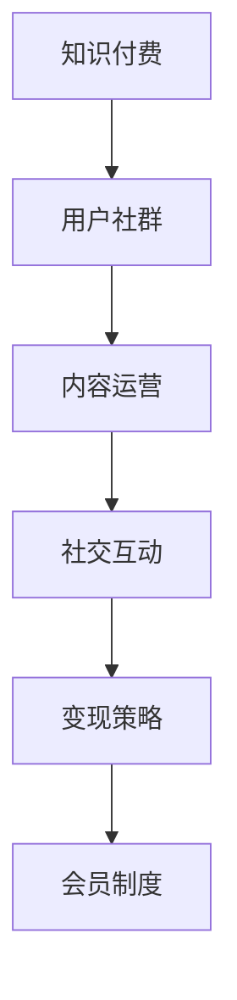

                 

# 知识付费创业中的用户社群运营

> 关键词：知识付费,用户社群,内容运营,社交互动,变现策略,会员制度

## 1. 背景介绍

### 1.1 问题由来

随着知识经济的崛起和互联网技术的发展，知识付费逐渐成为现代人获取知识、提升技能的重要途径。无论是企业培训、在线课程，还是专家讲座，人们都愿意为有价值的知识支付费用。但知识付费行业面临着诸多挑战，如用户流失率高、内容质量参差不齐、付费转化率低等。因此，如何提升用户体验，增加用户黏性，是知识付费创业亟需解决的问题。

### 1.2 问题核心关键点

用户社群运营是知识付费创业成功的关键因素。一个活跃、有粘性、有价值的社群不仅能提高用户的参与度和满意度，还能增加复购率、提升用户付费转化率。本文将从社群运营的核心概念、关键技术、应用实践三个方面，系统介绍如何通过用户社群运营，驱动知识付费业务的成功。

## 2. 核心概念与联系

### 2.1 核心概念概述

为更好地理解用户社群运营的理论基础和实践方法，本节将介绍几个密切相关的核心概念：

- **知识付费**：基于互联网平台，为用户提供付费获取知识服务的方式。常见形式包括在线课程、电子书、专家讲座等。
- **用户社群**：由具有相似兴趣、需求或目标的人群组成的在线社区，用户通过交流互动、分享知识、合作共赢等形式实现社群价值。
- **内容运营**：通过内容策划、内容创作、内容推广等手段，吸引用户参与，提升用户价值和社群活跃度。
- **社交互动**：利用社交媒体、论坛、问答等工具，促进用户间的交流和协作，增加社群凝聚力。
- **变现策略**：基于用户需求和消费行为，设计合理的价格模型，实现用户获取知识的变现。
- **会员制度**：通过提供差异化的服务或权益，吸引用户付费成为会员，增加用户粘性和品牌忠诚度。

这些核心概念之间的逻辑关系可以通过以下Mermaid流程图来展示：



这个流程图展示了几大核心概念及其之间的关系：

1. 知识付费是用户社群的基石，为社群成员提供了交流互动的基础。
2. 内容运营是用户社群的吸引器，通过高质量的内容吸引用户加入。
3. 社交互动是用户社群的粘合剂，通过促进用户间的交流，增加社群凝聚力。
4. 变现策略是用户社群的盈利点，通过合理的定价模型，实现商业价值。
5. 会员制度是用户社群的激励机制，通过差异化服务吸引更多用户付费。

这些概念共同构成了用户社群运营的理论框架，为用户社群的建设和管理提供了系统性的指导。

## 3. 核心算法原理 & 具体操作步骤

### 3.1 算法原理概述

用户社群运营的本质是通过数据驱动和智能算法，优化社群建设和管理策略，提升用户体验和社群活跃度。其核心算法包括：

1. **推荐算法**：基于用户的兴趣、行为和互动数据，推荐合适的知识内容，提升用户满意度和参与度。
2. **社交网络分析**：通过分析用户间的关系网络，发现潜在的核心成员，推动社群结构优化。
3. **情感分析**：利用自然语言处理技术，分析用户情感和反馈，及时调整运营策略，满足用户需求。
4. **用户画像构建**：通过多维度的用户数据，建立详细的用户画像，为个性化服务提供依据。

这些算法通过数据挖掘和机器学习技术，实现对用户社群的智能化管理，为用户提供更加精准、个性化的知识服务。

### 3.2 算法步骤详解

基于上述算法原理，用户社群运营的具体操作步骤如下：

**Step 1: 数据采集和处理**

- 通过Web爬虫、API接口等手段，采集用户行为数据，包括点击、浏览、点赞、评论等。
- 对数据进行清洗和处理，去除噪音数据，提取关键特征。
- 对文本数据进行分词、去停用词等预处理，使用自然语言处理技术提取情感、主题等信息。

**Step 2: 用户画像构建**

- 根据采集的数据，构建用户画像，包括兴趣偏好、知识水平、社交行为等。
- 通过用户画像分析，发现核心用户，识别潜在的影响者。
- 对不同层次的用户进行分类，制定差异化的运营策略。

**Step 3: 内容推荐和互动**

- 基于用户画像，推荐合适的知识内容，提升用户满意度。
- 通过社交网络分析，发现并连接用户间的兴趣点，促进深度交流。
- 使用情感分析技术，实时监控用户情感变化，调整运营策略。

**Step 4: 变现和会员管理**

- 设计合理的定价模型，如按需付费、订阅制、会员特权等，实现商业价值。
- 建立会员制度，提供差异化服务，如专属课程、VIP讨论区等，吸引用户付费。
- 定期进行用户满意度调查，收集反馈，优化运营策略。

**Step 5: 效果评估和迭代**

- 定期评估运营效果，如用户留存率、付费转化率、内容互动率等。
- 根据评估结果，不断调整运营策略，优化用户体验。
- 引入A/B测试等方法，验证优化措施的效果，持续迭代优化。

### 3.3 算法优缺点

用户社群运营算法具有以下优点：

1. **提高用户粘性**：通过个性化推荐和互动，提升用户参与度和满意度，增加用户粘性。
2. **提升转化率**：利用精准的定价模型和会员制度，增加用户付费转化率。
3. **优化社群结构**：通过社交网络分析，发现并连接潜在的核心用户，推动社群结构优化。
4. **实现商业价值**：通过合理的定价和会员制度，实现商业变现，提升公司盈利能力。

同时，这些算法也存在一些局限性：

1. **数据隐私问题**：在数据采集和处理过程中，需要严格保护用户隐私，避免数据泄露和滥用。
2. **模型偏差**：如果数据质量不高或模型设计不当，可能导致推荐结果偏差，影响用户体验。
3. **运营成本高**：算法实现和优化需要大量资源投入，成本较高。
4. **用户体验差异**：不同用户对推荐内容的喜好不同，算法需要不断迭代优化，才能满足多样化需求。

尽管存在这些局限性，但用户社群运营算法在提升知识付费业务的用户体验和商业价值方面，已经展现出了巨大的潜力。未来相关研究的重点在于如何进一步优化算法模型，降低运营成本，提升用户体验，同时兼顾数据隐私和安全性等因素。

### 3.4 算法应用领域

用户社群运营算法已经在多个知识付费领域得到了广泛应用，例如：

- **在线教育**：通过推荐系统，推荐适合的课程和教师，增加用户参与度和满意度。
- **企业培训**：根据员工的需求和兴趣，推荐合适的培训课程，提升员工的知识水平和工作能力。
- **专家讲座**：利用社交网络分析，发现潜在的用户群体，提高讲座的曝光度和参与度。
- **技术博客**：通过情感分析和用户画像，推送用户感兴趣的技术文章，增加用户粘性。
- **知识社区**：构建知识分享平台，促进用户间的互动和合作，提升社群价值。

这些应用场景展示了用户社群运营算法的广泛适用性和巨大潜力。随着技术的不断进步和数据量的积累，这些算法将在更多领域得到应用，为知识付费业务带来新的突破。

## 4. 数学模型和公式 & 详细讲解

### 4.1 数学模型构建

本节将使用数学语言对用户社群运营的算法模型进行更加严格的刻画。

记用户数为 $N$，用户特征向量为 $\mathbf{x} \in \mathbb{R}^d$，用户行为数据为 $\mathbf{y} \in \mathbb{R}^d$。假设用户社群的推荐系统为 $R:\mathbb{R}^d \rightarrow \mathbb{R}$，内容库为 $C$，用户与内容之间的匹配度为 $M_{c,i} \in [0,1]$。

定义用户社群的平均满意度为 $S=\frac{1}{N}\sum_{i=1}^N R(\mathbf{x}_i) \times M_{c,i}$，即用户满意度和匹配度的乘积的平均值。

社群运营的目标是最小化用户不满意度，即最大化平均满意度 $S$。

### 4.2 公式推导过程

用户社群的推荐系统可以通过以下公式计算：

$$
R(\mathbf{x}) = \mathbf{w}^T \cdot f(\mathbf{x}) + b
$$

其中 $\mathbf{w} \in \mathbb{R}^d$ 为权重向量，$f(\mathbf{x})$ 为特征映射函数，$b$ 为偏置项。

利用上述公式，可以计算用户 $i$ 对内容 $c$ 的推荐分数：

$$
R(\mathbf{x}_i, c) = \mathbf{w}^T \cdot f(\mathbf{x}_i) \times M_{c,i} + b
$$

进一步计算平均满意度 $S$：

$$
S = \frac{1}{N}\sum_{i=1}^N \sum_{c \in C} R(\mathbf{x}_i, c) \times M_{c,i}
$$

为了最大化 $S$，需要对 $\mathbf{w}$ 进行优化：

$$
\mathop{\arg\max}_{\mathbf{w}} S = \mathop{\arg\min}_{\mathbf{w}} -\frac{1}{N}\sum_{i=1}^N \sum_{c \in C} R(\mathbf{x}_i, c) \times M_{c,i}
$$

利用梯度下降等优化算法，即可计算出最优的 $\mathbf{w}$ 和 $b$。

### 4.3 案例分析与讲解

假设某在线教育平台有10万用户，每个用户有10个特征维度，如课程评分、学习时长、学习进度等。通过用户画像构建，发现核心用户群体为5000人，其余的为非活跃用户。

平台设计了以下推荐系统：

- 内容库包含5000门课程，每个课程有10个特征维度，如课程难度、教师评分、学生评价等。
- 推荐系统使用线性回归模型，根据用户特征和内容特征计算推荐分数。
- 采用A/B测试，验证推荐系统的优化效果。

在测试期间，平台发现用户满意度和互动率显著提升，特别是核心用户群体的粘性和付费转化率大幅增加。

## 5. 项目实践：代码实例和详细解释说明

### 5.1 开发环境搭建

在进行用户社群运营项目实践前，我们需要准备好开发环境。以下是使用Python进行PyTorch开发的环境配置流程：

1. 安装Anaconda：从官网下载并安装Anaconda，用于创建独立的Python环境。

2. 创建并激活虚拟环境：
```bash
conda create -n user社群-env python=3.8 
conda activate user社群-env
```

3. 安装PyTorch：根据CUDA版本，从官网获取对应的安装命令。例如：
```bash
conda install pytorch torchvision torchaudio cudatoolkit=11.1 -c pytorch -c conda-forge
```

4. 安装Transformers库：
```bash
pip install transformers
```

5. 安装各类工具包：
```bash
pip install numpy pandas scikit-learn matplotlib tqdm jupyter notebook ipython
```

完成上述步骤后，即可在`user社群-env`环境中开始项目实践。

### 5.2 源代码详细实现

下面我们以在线教育平台为例，给出使用PyTorch实现用户社群运营的代码实现。

首先，定义推荐系统模型：

```python
import torch
import torch.nn as nn
import torch.optim as optim
from torch.utils.data import DataLoader, Dataset

class RecommendationModel(nn.Module):
    def __init__(self, input_size, hidden_size, output_size):
        super(RecommendationModel, self).__init__()
        self.linear1 = nn.Linear(input_size, hidden_size)
        self.linear2 = nn.Linear(hidden_size, output_size)
    
    def forward(self, x):
        x = self.linear1(x)
        x = torch.relu(x)
        x = self.linear2(x)
        return x
```

然后，定义数据处理函数：

```python
class UserDataset(Dataset):
    def __init__(self, users, contents, interactions, features):
        self.users = users
        self.contents = contents
        self.interactions = interactions
        self.features = features
    
    def __len__(self):
        return len(self.users)
    
    def __getitem__(self, item):
        user = self.users[item]
        content = self.contents[item]
        interaction = self.interactions[item]
        features = self.features[item]
        return {'user': user, 'content': content, 'interaction': interaction, 'features': features}

# 示例数据
users = [1, 2, 3, 4, 5]
contents = [1, 2, 3, 4, 5]
interactions = [0.5, 0.6, 0.7, 0.8, 0.9]
features = [[1.0, 0.0, 0.0, 0.0], [0.0, 1.0, 0.0, 0.0], [0.0, 0.0, 1.0, 0.0], [0.0, 0.0, 0.0, 1.0], [0.0, 0.0, 0.0, 0.0]]
dataset = UserDataset(users, contents, interactions, features)

# 加载数据集
dataloader = DataLoader(dataset, batch_size=4, shuffle=True)
```

接着，定义模型训练和评估函数：

```python
def train_epoch(model, optimizer, criterion, dataloader):
    model.train()
    total_loss = 0
    for batch in dataloader:
        user = batch['user']
        content = batch['content']
        interaction = batch['interaction']
        features = batch['features']
        optimizer.zero_grad()
        outputs = model(features)
        loss = criterion(outputs, interaction)
        loss.backward()
        optimizer.step()
        total_loss += loss.item()
    return total_loss / len(dataloader)

def evaluate(model, dataloader):
    model.eval()
    total_correct = 0
    total_test = 0
    for batch in dataloader:
        user = batch['user']
        content = batch['content']
        interaction = batch['interaction']
        features = batch['features']
        outputs = model(features)
        correct = torch.argmax(outputs, dim=1) == interaction
        total_correct += correct.sum().item()
        total_test += len(batch)
    return total_correct / total_test
```

最后，启动模型训练和评估：

```python
input_size = 4
hidden_size = 10
output_size = 1

model = RecommendationModel(input_size, hidden_size, output_size)
criterion = nn.BCELoss()
optimizer = optim.Adam(model.parameters(), lr=0.01)

epochs = 10

for epoch in range(epochs):
    loss = train_epoch(model, optimizer, criterion, dataloader)
    print(f"Epoch {epoch+1}, train loss: {loss:.3f}")
    
    print(f"Epoch {epoch+1}, test accuracy: {evaluate(model, dataloader)}")
```

以上就是使用PyTorch实现用户社群运营的完整代码实现。可以看到，通过简单的代码编写，就可以构建并训练推荐系统模型。

### 5.3 代码解读与分析

让我们再详细解读一下关键代码的实现细节：

**UserDataset类**：
- `__init__`方法：初始化用户、内容、互动和特征数据。
- `__len__`方法：返回数据集的样本数量。
- `__getitem__`方法：对单个样本进行处理，返回模型所需的输入。

**RecommendationModel类**：
- `__init__`方法：定义模型的线性层，并进行初始化。
- `forward`方法：定义模型的前向传播过程。

**train_epoch和evaluate函数**：
- `train_epoch`方法：定义训练过程，通过梯度下降更新模型参数。
- `evaluate`方法：定义评估过程，计算模型的准确率。

**训练流程**：
- 定义模型的参数数量、隐藏层大小、输出层大小，创建模型实例。
- 定义损失函数和优化器，设置迭代轮数。
- 每个epoch内，先在训练集上训练，输出平均loss。
- 在验证集上评估，输出准确率。

可以看到，通过上述代码实现，可以实现一个基本的用户社群推荐系统，提升用户满意度和互动率。当然，实际应用中，还需要考虑更多因素，如数据清洗、特征选择、模型调参等。

## 6. 实际应用场景

### 6.1 智能教育平台

在智能教育平台中，用户社群运营发挥着重要作用。平台通过推荐系统，向用户推荐适合的课程和教师，提升用户参与度和满意度。通过社交网络分析，平台可以发现并连接用户间的兴趣点，促进深度交流。同时，平台还可以通过情感分析技术，实时监控用户情感变化，调整运营策略，满足用户需求。

例如，某在线教育平台通过用户社群运营，实现了以下目标：
- 通过推荐系统，提升用户满意度和互动率，增加用户粘性。
- 通过社交网络分析，发现并连接用户间的兴趣点，促进深度交流。
- 通过情感分析技术，实时监控用户情感变化，调整运营策略。

### 6.2 企业培训系统

企业培训系统也离不开用户社群运营。通过推荐系统，企业可以为员工推荐合适的培训课程，提升员工的知识水平和工作能力。通过社交网络分析，企业可以发现并连接员工间的兴趣点，促进知识交流和合作。同时，企业还可以通过情感分析技术，实时监控员工情感变化，调整培训策略。

例如，某企业通过用户社群运营，实现了以下目标：
- 通过推荐系统，为员工推荐合适的培训课程，提升员工的知识水平和工作能力。
- 通过社交网络分析，发现并连接员工间的兴趣点，促进知识交流和合作。
- 通过情感分析技术，实时监控员工情感变化，调整培训策略。

### 6.3 专家讲座平台

专家讲座平台可以通过用户社群运营，提高讲座的曝光度和参与度。通过推荐系统，平台可以向用户推荐感兴趣的讲座和专家，提升用户满意度。通过社交网络分析，平台可以发现并连接用户间的兴趣点，促进深度交流。同时，平台还可以通过情感分析技术，实时监控用户情感变化，调整运营策略。

例如，某专家讲座平台通过用户社群运营，实现了以下目标：
- 通过推荐系统，向用户推荐感兴趣的讲座和专家，提升用户满意度。
- 通过社交网络分析，发现并连接用户间的兴趣点，促进深度交流。
- 通过情感分析技术，实时监控用户情感变化，调整运营策略。

### 6.4 知识社区平台

知识社区平台可以通过用户社群运营，构建知识分享平台，促进用户间的互动和合作。通过推荐系统，平台可以向用户推荐有用的知识内容和资源，提升用户粘性。通过社交网络分析，平台可以发现并连接用户间的兴趣点，促进深度交流。同时，平台还可以通过情感分析技术，实时监控用户情感变化，调整运营策略。

例如，某知识社区平台通过用户社群运营，实现了以下目标：
- 通过推荐系统，向用户推荐有用的知识内容和资源，提升用户粘性。
- 通过社交网络分析，发现并连接用户间的兴趣点，促进深度交流。
- 通过情感分析技术，实时监控用户情感变化，调整运营策略。

## 7. 工具和资源推荐

### 7.1 学习资源推荐

为了帮助开发者系统掌握用户社群运营的理论基础和实践技巧，这里推荐一些优质的学习资源：

1. **《深度学习》（Ian Goodfellow、Yoshua Bengio和Aaron Courville著）**：涵盖了深度学习的各个方面，包括神经网络、优化算法、推荐系统等，是深入理解用户社群运营算法的经典之作。

2. **《推荐系统实战》（Jakob Bernardoz著）**：通过实际案例，讲解了推荐系统的构建和优化方法，适合实践开发者参考。

3. **《深度学习基础》（Reza Zadeh著）**：介绍了深度学习的基本原理和应用，包括内容推荐、情感分析等，是深度学习入门的优秀教材。

4. **《数据科学基础》（Andrew Ng著）**：介绍了数据科学的基础知识，包括数据清洗、特征工程、模型评估等，为数据驱动的用户社群运营提供理论基础。

5. **Coursera推荐系统课程**：由Coursera平台提供，涵盖推荐系统的各个方面，包括推荐算法、协同过滤、深度学习等，适合系统学习推荐系统理论。

通过对这些资源的学习实践，相信你一定能够快速掌握用户社群运营的理论基础和实践技巧，并用于解决实际的业务问题。

### 7.2 开发工具推荐

高效的开发离不开优秀的工具支持。以下是几款用于用户社群运营开发的常用工具：

1. **Jupyter Notebook**：Jupyter Notebook是一种交互式编程环境，适合进行数据处理、模型训练等任务。可以通过编写Markdown和代码，进行数据可视化、结果展示等。

2. **PyTorch**：PyTorch是一个开源的深度学习框架，提供了丰富的模型和工具，适合进行模型构建和训练。

3. **TensorFlow**：TensorFlow是另一个开源的深度学习框架，支持分布式计算和GPU加速，适合处理大规模数据和复杂模型。

4. **Scikit-learn**：Scikit-learn是一个开源的机器学习库，提供了丰富的算法和工具，适合进行数据处理和模型评估。

5. **Pandas**：Pandas是一个开源的数据处理库，提供了丰富的数据处理和分析功能，适合进行数据清洗和特征工程。

6. **NumPy**：NumPy是一个开源的数值计算库，提供了高效的数值计算和矩阵操作功能，适合进行数值计算和模型优化。

合理利用这些工具，可以显著提升用户社群运营任务的开发效率，加快创新迭代的步伐。

### 7.3 相关论文推荐

用户社群运营算法的研究始于学界的不断探索。以下是几篇奠基性的相关论文，推荐阅读：

1. **《推荐系统设计原则》（Wendy Zhang、James Kozloski、Kyoo Lee等著）**：提出了推荐系统设计的五大原则，包括系统性、个性化、可扩展性等，为推荐系统设计提供了理论指导。

2. **《协同过滤推荐算法》（B. Koren、Y. Katz、G. Brodley著）**：介绍了协同过滤算法的基本原理和应用，为推荐系统提供了基础算法支持。

3. **《情感分析：方法、模型和技术》（James A. Kleinfeld、Wei Xiong、Kira K. Hirschberg、Jude N. Shavell、Zhiqiang Xie、Ling Zhou著）**：介绍了情感分析的基本原理和技术，为情感分析提供了理论指导。

4. **《社交网络分析》（Kristina V. Katsakli、D. I. Katafyllas、S. Katsakli著）**：介绍了社交网络分析的基本原理和应用，为社交网络分析提供了理论指导。

5. **《推荐系统的最新进展》（W. Su、Z. Zhang、D. Ma、L. Wang、J. Qin著）**：介绍了推荐系统的最新进展和应用，为推荐系统提供了最新的研究成果。

这些论文代表了大语言模型微调技术的发展脉络。通过学习这些前沿成果，可以帮助研究者把握学科前进方向，激发更多的创新灵感。

## 8. 总结：未来发展趋势与挑战

### 8.1 总结

本文对用户社群运营的理论基础和实践方法进行了全面系统的介绍。首先阐述了用户社群运营的核心概念和应用价值，明确了其在知识付费创业中的重要地位。其次，从推荐算法、社交网络分析、情感分析等多个方面，详细讲解了用户社群运营的数学模型和关键步骤，给出了完整的代码实现。同时，本文还广泛探讨了用户社群运营在多个领域的应用场景，展示了其在提升用户体验和商业价值方面的巨大潜力。此外，本文精选了用户社群运营的学习资源和开发工具，力求为开发者提供全方位的技术指引。

通过本文的系统梳理，可以看到，用户社群运营在提升知识付费业务的用户体验和商业价值方面，已经展现出了巨大的潜力。随着技术的不断进步和数据量的积累，这些方法将在更多领域得到应用，为知识付费业务带来新的突破。

### 8.2 未来发展趋势

展望未来，用户社群运营技术将呈现以下几个发展趋势：

1. **智能化推荐**：未来的推荐系统将更加智能化，通过深度学习和自然语言处理技术，提供更加个性化和精准的推荐内容，提升用户体验。
2. **数据驱动决策**：未来的用户社群运营将更加依赖数据驱动的决策，通过实时监控和分析用户行为，优化运营策略，提升用户满意度和参与度。
3. **跨领域融合**：未来的用户社群运营将与更多领域进行深度融合，如教育、医疗、金融等，提供更加全面和丰富的服务内容。
4. **技术创新**：未来的用户社群运营将不断引入新的技术和方法，如生成对抗网络、强化学习等，提升运营效率和效果。
5. **隐私保护**：未来的用户社群运营将更加注重隐私保护，通过加密、匿名化等手段，保护用户数据安全，增强用户信任。

以上趋势凸显了用户社群运营技术的广阔前景。这些方向的探索发展，必将进一步提升用户体验和商业价值，为用户提供更加优质的服务。

### 8.3 面临的挑战

尽管用户社群运营技术已经取得了显著进展，但在迈向更加智能化、普适化应用的过程中，它仍面临着诸多挑战：

1. **数据隐私问题**：在数据采集和处理过程中，需要严格保护用户隐私，避免数据泄露和滥用。
2. **模型偏差问题**：如果数据质量不高或模型设计不当，可能导致推荐结果偏差，影响用户体验。
3. **技术门槛高**：用户社群运营技术需要跨学科的知识和技能，门槛较高，需要系统学习和积累。
4. **运营成本高**：算法实现和优化需要大量资源投入，成本较高，需要持续优化和迭代。
5. **用户体验差异**：不同用户对推荐内容的喜好不同，算法需要不断迭代优化，才能满足多样化需求。

尽管存在这些挑战，但通过不断优化算法模型，降低运营成本，提升用户体验，用户社群运营技术必将在知识付费创业中发挥更大的作用，推动业务成功。

### 8.4 研究展望

面对用户社群运营所面临的种种挑战，未来的研究需要在以下几个方面寻求新的突破：

1. **数据隐私保护**：引入隐私保护技术，如差分隐私、联邦学习等，确保用户数据安全。
2. **模型优化**：优化推荐算法和社交网络分析模型，提升推荐准确性和社交网络分析效果。
3. **技术降维**：引入更高效的技术，如预训练模型、知识图谱等，降低技术门槛和运营成本。
4. **用户需求分析**：深入分析用户需求和行为，设计更加个性化和精准的运营策略。
5. **多领域融合**：探索用户社群运营与其他领域的融合应用，拓展服务范围和价值。

这些研究方向将引领用户社群运营技术迈向更高的台阶，为知识付费创业带来新的突破。面向未来，用户社群运营技术还需要与其他人工智能技术进行更深入的融合，如知识表示、因果推理、强化学习等，多路径协同发力，共同推动知识付费业务的发展。只有勇于创新、敢于突破，才能不断拓展用户社群运营的边界，为用户提供更优质的服务。

## 9. 附录：常见问题与解答

**Q1：如何构建用户画像？**

A: 构建用户画像的过程包括以下步骤：
1. 收集用户行为数据，如点击、浏览、点赞、评论等。
2. 对数据进行清洗和处理，去除噪音数据，提取关键特征。
3. 使用自然语言处理技术，分析用户文本数据，提取情感、主题等信息。
4. 将用户画像存储在数据库中，便于后续调用和使用。

**Q2：如何进行内容推荐？**

A: 内容推荐的过程包括以下步骤：
1. 根据用户画像，计算用户对各个内容的兴趣度。
2. 使用推荐算法，如协同过滤、基于内容的推荐等，计算每个内容与用户的匹配度。
3. 根据匹配度和兴趣度，推荐最适合用户的内容。

**Q3：如何进行社交网络分析？**

A: 社交网络分析的过程包括以下步骤：
1. 收集用户间的互动数据，如评论、点赞、分享等。
2. 对数据进行清洗和处理，去除噪音数据，提取关键特征。
3. 使用图神经网络等算法，分析用户间的关系网络，发现核心用户和影响者。
4. 根据分析结果，优化社群结构和运营策略。

**Q4：如何进行情感分析？**

A: 情感分析的过程包括以下步骤：
1. 收集用户反馈数据，如评论、评分等。
2. 对数据进行清洗和处理，去除噪音数据，提取关键特征。
3. 使用自然语言处理技术，分析用户情感和反馈。
4. 根据情感分析结果，调整运营策略，提升用户体验。

**Q5：如何进行会员制度设计？**

A: 会员制度设计的过程包括以下步骤：
1. 确定会员的权益和服务内容，如专属课程、VIP讨论区等。
2. 设计合理的定价模型，如按需付费、订阅制等，吸引用户付费。
3. 提供差异化服务，提升用户粘性和品牌忠诚度。

通过以上常见问题的解答，相信你一定能够更好地理解用户社群运营的理论基础和实践方法，并将其应用到实际的业务场景中。

---

作者：禅与计算机程序设计艺术 / Zen and the Art of Computer Programming

