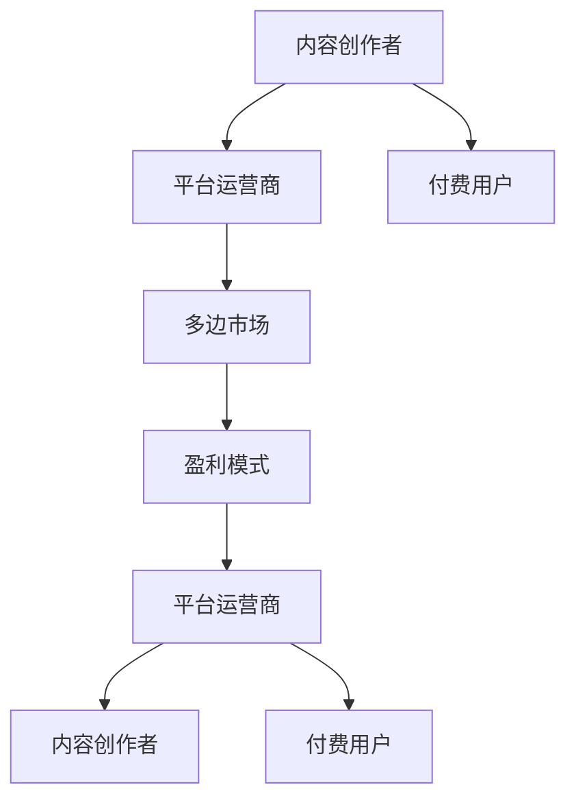

                 

# 知识付费创业的商业模式创新

> 关键词：知识付费, 内容创作者, 用户需求, 平台运营, 技术创新, 多边市场, 盈利模式

## 1. 背景介绍

### 1.1 问题由来
随着互联网技术的普及和数字内容的丰富，人们对于高质量、高效能的学习内容的需求日益增长。知识付费作为一种新兴的教育消费方式，迎合了这一需求，成为推动教育数字化转型的一个重要趋势。知识付费的商业模式主要依赖于内容创作者提供的高价值内容，平台运营商搭建的传播渠道，以及付费用户对知识的消费需求。然而，尽管知识付费行业已进入快速发展阶段，但其盈利模式单一、用户体验不足等问题仍需解决。

### 1.2 问题核心关键点
知识付费创业的核心在于构建一个高效的知识生产和传播体系，通过技术创新和商业模式创新，最大化地满足用户需求，实现内容的有效供给和变现。

1. **内容质量与数量**：高质量的内容是知识付费成功的关键，需要持续吸引和激励内容创作者生产原创优质内容。
2. **用户需求匹配**：平台需通过智能推荐系统等技术手段，精准匹配用户需求与内容资源，提升用户满意度。
3. **平台运营效率**：高效的内容生产、分发和管理流程，是平台运营的基础，需要通过技术手段和组织架构优化来实现。
4. **盈利模式多样性**：单一的订阅收费模式难以覆盖所有用户，需开发多元化的盈利渠道，如会员付费、内容出售、广告、周边产品销售等。
5. **市场规模与竞争**：知识付费市场潜力巨大，但竞争激烈，平台需不断创新，维持领先优势。

## 2. 核心概念与联系

### 2.1 核心概念概述

为更好地理解知识付费的商业模式创新，本节将介绍几个密切相关的核心概念：

- **知识付费**：指用户通过付费方式获取知识资源，提升个人技能或解决实际问题的商业模型。
- **内容创作者**：指通过平台提供各类知识内容的个人或机构，包括作家、学者、行业专家等。
- **平台运营商**：指搭建知识付费平台，提供技术支持、内容审核、市场推广等服务的第三方公司或个人。
- **付费用户**：指通过付费获取知识内容的用户群体，包括学生、职场人士、终身学习者等。
- **技术创新**：指通过应用先进的科技成果，提升知识付费平台的运营效率和用户体验，包括大数据、人工智能、区块链等技术。
- **多边市场**：指由平台运营商、内容创作者、付费用户等多个参与方组成的市场体系，各方可通过平台获得收益。
- **盈利模式**：指平台实现收入的主要渠道，包括订阅费、广告费、产品销售费等。

这些核心概念之间的逻辑关系可以通过以下Mermaid流程图来展示：



这个流程图展示了大语言模型的核心概念及其之间的关系：

1. 内容创作者通过平台运营商搭建的平台发布内容。
2. 平台运营商通过技术创新，提升平台的用户体验和运营效率。
3. 付费用户通过平台获取知识和资源，满足自身学习需求。
4. 平台运营商通过多边市场运作，实现盈利。
5. 盈利模式包括平台运营商、内容创作者和付费用户的收益分配。

## 3. 核心算法原理 & 具体操作步骤
### 3.1 算法原理概述

知识付费平台的商业模式创新，本质上是围绕内容创作者、平台运营商和付费用户三方构建的生态系统。其核心在于如何通过技术手段，提高内容质量和供给效率，匹配用户需求，并实现多方共赢。

形式化地，假设知识付费平台为 $P$，内容创作者为 $C$，付费用户为 $U$，内容为 $K$，则平台的目标是最大化用户价值 $V$，其中 $V = f(C,K)$。

具体来说，平台运营商需设计一个高效的生态系统，使得内容创作者能够持续输出高质量内容，付费用户能够高效获取并消费内容，同时平台能够实现收益最大化。

### 3.2 算法步骤详解

基于上述目标，知识付费平台的商业模式创新通常包括以下几个关键步骤：

**Step 1: 内容创作者激励机制设计**
- 设计公平合理的收益分配制度，保证内容创作者能够获得与其产出相匹配的回报。
- 提供技术和资源支持，帮助内容创作者提升创作效率和质量。
- 通过社区互动、内容推荐等手段，增加内容创作者的曝光度，吸引更多用户关注和付费。

**Step 2: 用户需求匹配算法优化**
- 利用大数据和机器学习技术，构建精准的用户画像和内容标签系统，帮助平台实现内容的精准匹配。
- 引入推荐算法和搜索算法，提高用户获取内容的效率和质量。
- 实时监测用户行为数据，及时调整算法策略，提升用户体验。

**Step 3: 平台运营效率提升**
- 搭建高效的内容审核和发布系统，确保内容质量和合规性。
- 引入自动化技术，如智能审核、自动排版等，降低运营成本。
- 优化平台架构，提高系统的可扩展性和稳定性。

**Step 4: 盈利模式多元化**
- 开发多样化的盈利渠道，如会员订阅、单次付费、内容打赏、广告合作等。
- 建立内容衍生品业务，如出版、周边商品等，拓展收入来源。
- 通过大数据和人工智能技术，实现精准营销和广告投放，提高广告收益。

**Step 5: 市场竞争策略制定**
- 持续投入研发，保持技术领先优势，提升平台的竞争力。
- 建立合作伙伴关系，形成生态联盟，共同开发新市场。
- 积极参与行业标准制定，提升品牌影响力。

### 3.3 算法优缺点

知识付费平台的商业模式创新具有以下优点：
1. 提升内容质量：通过公平激励和优质资源，吸引和激励更多优秀内容创作者。
2. 精准匹配需求：通过先进技术手段，实现内容和用户的精准匹配，提高用户满意度。
3. 提高运营效率：通过自动化技术和平台优化，降低运营成本，提升平台盈利能力。
4. 多元化盈利：通过多样化盈利渠道，分散风险，保障平台长期稳定发展。

同时，该方法也存在一定的局限性：
1. 内容创作者流失：激励机制设计不当，可能导致内容创作者流失，影响平台内容供给。
2. 用户体验不均：推荐算法或搜索算法不完善，可能造成部分用户体验差，影响平台口碑。
3. 运营成本高：平台建设、维护和优化初期投入较大，需多渠道开源节流。
4. 市场风险高：市场竞争激烈，需不断创新和调整策略，才能维持市场领先地位。

尽管存在这些局限性，但就目前而言，知识付费平台的商业模式创新仍是一个高效的路径，通过优化平台生态系统，不断提升用户体验和内容质量，实现平台的可持续发展。

### 3.4 算法应用领域

知识付费平台的商业模式创新已广泛应用于多个领域，包括但不限于：

- **在线教育**：提供课程内容付费服务，帮助用户提升技能。
- **职场培训**：提供职业技能培训课程，帮助职场人士提升竞争力。
- **职业发展**：提供职业规划和发展指导服务，帮助用户实现职业目标。
- **健康管理**：提供健康知识付费内容，帮助用户改善生活习惯，提高生活质量。
- **个人兴趣**：提供各类兴趣爱好内容付费服务，满足用户的个性化需求。

除了上述这些典型应用外，知识付费平台还在更多场景中得到应用，如职业咨询、个人理财、艺术创作等，为不同用户群体提供多元化的知识服务。

## 4. 数学模型和公式 & 详细讲解 & 举例说明（备注：数学公式请使用latex格式，latex嵌入文中独立段落使用 $$，段落内使用 $)
### 4.1 数学模型构建

本节将使用数学语言对知识付费平台的商业模式创新进行更加严格的刻画。

记知识付费平台为 $P$，内容创作者为 $C$，付费用户为 $U$，内容为 $K$，则平台的目标是最大化用户价值 $V$，其中 $V = f(C,K)$。

定义平台的目标函数为：

$$
\max_{P, C, U} V = \max_{P, C, U} \sum_{i=1}^n u_i(c_i,k_i)
$$

其中 $u_i$ 为第 $i$ 个用户（$i=1,2,\cdots,n$）的效用函数，$c_i$ 为第 $i$ 个用户消费的第 $i$ 个内容，$k_i$ 为第 $i$ 个内容。

### 4.2 公式推导过程

以下我们以用户效用函数为例，推导效用函数的构建。

假设用户效用函数为：

$$
u_i = \alpha(c_i) + \beta(k_i)
$$

其中 $\alpha(c_i)$ 为用户消费内容带来的效用，$\beta(k_i)$ 为内容质量带来的效用。

则平台的目标函数可表示为：

$$
\max_{P, C, U} \sum_{i=1}^n [\alpha(c_i) + \beta(k_i)]
$$

为了最大化用户价值，平台需优化内容和用户的匹配，提升内容质量，并优化内容创作者的激励机制。

### 4.3 案例分析与讲解

以在线教育平台为例，分析如何通过算法优化实现商业模式的创新：

**案例背景**：一家在线教育平台通过付费订阅方式提供各类课程内容，旨在帮助用户提升职业技能。平台用户主要分为两大类：高阶技能提升者（如工程师、教师）和职业资格认证者（如司法考试、会计考试考生）。

**需求分析**：高阶技能提升者需要深入学习特定领域知识，获得专业技能认证；职业资格认证者则需快速掌握考试重点，高效备考。

**优化策略**：
- **内容设计**：针对两类用户设计差异化的课程内容，高阶技能提升者课程需深入、全面，职业资格认证者课程需精炼、重点突出。
- **推荐算法**：引入个性化推荐算法，根据用户画像和课程标签，推荐最适合的内容。同时，设计搜索算法，方便用户快速定位所需内容。
- **激励机制**：设计合理的激励机制，如课程积分、学习时长奖励、考试通过奖励等，提高内容创作者的积极性。
- **运营策略**：优化平台运营流程，提升课程审核效率，减少运营成本。同时，引入智能客服，提高用户满意度。
- **盈利模式**：开发多元化的盈利渠道，如单次付费课程、会员订阅、考试通过奖励等。通过数据分析，实现精准营销和广告投放。

**实现结果**：通过上述策略的实施，平台内容质量和用户满意度显著提升，订阅用户数和课程销量大幅增长，平台实现了盈利。

## 5. 项目实践：代码实例和详细解释说明
### 5.1 开发环境搭建

在进行知识付费平台的商业模式创新实践前，我们需要准备好开发环境。以下是使用Python进行Flask开发的环境配置流程：

1. 安装Anaconda：从官网下载并安装Anaconda，用于创建独立的Python环境。

2. 创建并激活虚拟环境：
```bash
conda create -n flask-env python=3.8 
conda activate flask-env
```

3. 安装Flask：
```bash
pip install flask
```

4. 安装相关工具包：
```bash
pip install numpy pandas scikit-learn torch torchvision matplotlib
```

完成上述步骤后，即可在`flask-env`环境中开始商业模式创新的开发实践。

### 5.2 源代码详细实现

下面我们以在线教育平台为例，给出使用Flask搭建知识付费平台的Python代码实现。

首先，定义平台的核心功能模块：

```python
from flask import Flask, request, jsonify

app = Flask(__name__)

@app.route('/user', methods=['POST'])
def user_login():
    # 用户登录功能
    return jsonify({'message': 'User login successful'})

@app.route('/content', methods=['POST'])
def content_publish():
    # 内容发布功能
    return jsonify({'message': 'Content published successfully'})

@app.route('/recommend', methods=['GET'])
def content_recommend():
    # 内容推荐功能
    return jsonify({'message': 'Content recommended'})

@app.route('/search', methods=['GET'])
def content_search():
    # 内容搜索功能
    return jsonify({'message': 'Content search successful'})

@app.route('/purchase', methods=['POST'])
def content_purchase():
    # 内容购买功能
    return jsonify({'message': 'Content purchased successfully'})

if __name__ == '__main__':
    app.run(debug=True)
```

然后，定义用户的激励机制：

```python
# 用户积分系统
user_id = 0
user_score = 0

def add_user_score():
    global user_id, user_score
    user_id += 1
    user_score += 1
    return user_score

def get_user_score():
    return user_score
```

最后，启动服务器：

```python
# 启动Flask服务器
if __name__ == '__main__':
    app.run(debug=True)
```

以上就是使用Flask搭建知识付费平台的完整代码实现。可以看到，得益于Flask的强大封装，我们可以用相对简洁的代码完成平台的核心功能模块的搭建。

### 5.3 代码解读与分析

让我们再详细解读一下关键代码的实现细节：

**Flask应用实例**：
- 使用Flask框架创建了一个简单的Web应用，包括用户登录、内容发布、内容推荐、内容搜索、内容购买等核心功能。
- 各功能模块通过Flask的路由系统进行管理，根据不同的HTTP请求（POST、GET）调用不同的函数。

**用户积分系统**：
- 定义了一个简单的用户积分系统，用于激励内容创作者。
- 通过`add_user_score`函数记录用户发布内容的数量，并按一定规则（如每条内容增加1积分）累加用户积分。
- `get_user_score`函数用于获取用户当前积分，以便展示和激励用户。

**服务器启动**：
- 通过`app.run(debug=True)`命令启动Flask服务器，在本地运行应用。
- 通过设置`debug=True`参数，开启调试模式，方便查看和调试应用错误。

可以看出，Flask作为轻量级Web框架，极大地简化了知识付费平台的开发过程，让开发者能够专注于核心业务逻辑的实现，而不是底层Web技术。

当然，工业级的系统实现还需考虑更多因素，如用户认证、数据存储、安全性等，但核心的商业模式创新原理基本与此类似。

## 6. 实际应用场景
### 6.1 教育培训平台

知识付费平台在教育培训领域的应用最为典型。通过构建高质量的课程内容和先进的推荐算法，教育平台能够为各类学习者提供个性化、高效的学习体验。

在技术实现上，可以采用Flask等框架搭建平台，结合MySQL、Redis等数据库，实现内容存储、推荐算法等核心功能。同时，引入TensorFlow等机器学习库，构建个性化的推荐模型，提升用户体验。

### 6.2 职业培训平台

职业培训平台通过提供职业技能培训课程，帮助用户提升职场竞争力。平台需设计合理的激励机制，吸引内容创作者发布高质量课程，并通过推荐算法，帮助用户高效获取内容。

在技术上，职业培训平台需要具备强大的用户画像系统，能够精准匹配用户需求与内容资源。同时，引入大数据技术，进行用户行为分析，优化推荐算法，提升用户体验和内容质量。

### 6.3 健康管理平台

健康管理平台通过提供健康知识付费内容，帮助用户改善生活习惯，提高生活质量。平台需设计丰富的健康课程和互动社区，吸引用户参与和付费。

在技术上，健康管理平台需要引入智能推荐和搜索算法，帮助用户快速获取健康知识。同时，通过数据分析和机器学习技术，实现健康知识的个性化推荐和用户行为分析，提升平台的用户黏性和盈利能力。

### 6.4 未来应用展望

随着知识付费平台技术的不断成熟，其在更多领域的应用前景将更加广阔：

1. **职业咨询平台**：通过提供职业规划和发展指导服务，帮助用户实现职业目标。平台需设计科学的职业测评工具，结合大数据和人工智能技术，为用户提供个性化的职业规划建议。
2. **个人理财平台**：提供理财知识付费内容，帮助用户提升财务管理能力。平台需引入智能理财助手，结合金融大数据，为用户提供个性化的理财建议和金融产品。
3. **艺术创作平台**：提供各类艺术创作课程，满足用户的个性化需求。平台需设计高效的课程管理系统，引入智能推荐算法，提升用户体验。
4. **家庭教育平台**：通过提供家庭教育指导内容，帮助家长提升教育能力。平台需引入家庭教育专家和教育数据分析技术，为用户提供科学的育儿建议。

总之，知识付费平台的多元化应用将为不同用户群体提供全方位的知识服务，成为推动社会进步和文化发展的重要力量。

## 7. 工具和资源推荐
### 7.1 学习资源推荐

为了帮助开发者系统掌握知识付费的商业模式创新理论基础和实践技巧，这里推荐一些优质的学习资源：

1. **《知识付费：商业模式与运营策略》系列博文**：由知识付费领域的专家撰写，系统讲解了知识付费的商业模式、用户需求、技术实现等内容。

2. **CS202《知识付费技术》课程**：中国大学MOOC平台开设的课程，涵盖了知识付费平台的搭建、推荐算法、用户画像等内容，适合初学者入门。

3. **《知识付费商业模型》书籍**：详细介绍了知识付费平台的商业模式创新，包括内容管理、用户运营、盈利策略等。

4. **Coursera《知识付费》课程**：斯坦福大学等名校开设的课程，全面讲解了知识付费的商业模式、内容策略、技术实现等。

5. **Udacity《知识付费平台开发》课程**：由行业专家授课，涵盖知识付费平台的核心技术和商业策略，适合进阶学习。

通过对这些资源的学习实践，相信你一定能够快速掌握知识付费平台的商业模式创新精髓，并用于解决实际的商业问题。

### 7.2 开发工具推荐

高效的开发离不开优秀的工具支持。以下是几款用于知识付费平台开发的常用工具：

1. **Flask**：轻量级Web框架，适合快速迭代研究，支持Python编写。
2. **Django**：功能丰富的Web框架，适合大规模Web应用开发。
3. **TensorFlow**：强大的机器学习框架，支持深度学习算法开发。
4. **Keras**：高级神经网络API，易于上手，适合快速原型开发。
5. **PyTorch**：灵活的深度学习框架，支持动态图和静态图，适合研究和开发。
6. **Jupyter Notebook**：交互式编程环境，支持Python、R等语言，适合数据科学和机器学习开发。

合理利用这些工具，可以显著提升知识付费平台的开发效率，加快创新迭代的步伐。

### 7.3 相关论文推荐

知识付费平台的发展源于学界的持续研究。以下是几篇奠基性的相关论文，推荐阅读：

1. **《知识付费平台的内容推荐系统研究》**：介绍基于协同过滤、基于内容的推荐算法在知识付费平台中的应用。
2. **《知识付费平台的用户画像系统设计》**：探讨如何通过用户行为数据构建精细的用户画像，提升平台的用户匹配和推荐效果。
3. **《知识付费平台的激励机制设计》**：分析内容创作者的激励机制，讨论如何设计公平合理的收益分配制度，吸引更多优秀内容创作者。
4. **《知识付费平台的商业模式创新》**：研究知识付费平台的盈利模式和市场策略，探讨如何实现多边市场运作，提高平台盈利能力。
5. **《知识付费平台的推荐算法优化》**：介绍机器学习和深度学习技术在知识付费平台推荐算法中的应用。

这些论文代表了大语言模型微调技术的发展脉络。通过学习这些前沿成果，可以帮助研究者把握学科前进方向，激发更多的创新灵感。

## 8. 总结：未来发展趋势与挑战
### 8.1 总结

本文对知识付费平台的商业模式创新进行了全面系统的介绍。首先阐述了知识付费平台的研究背景和意义，明确了平台在内容创作、用户需求匹配、平台运营和盈利模式等方面的核心价值。其次，从原理到实践，详细讲解了知识付费平台的商业模式创新的数学模型和关键步骤，给出了平台开发的完整代码实例。同时，本文还广泛探讨了平台在教育培训、职业培训、健康管理等领域的实际应用前景，展示了商业模式创新的巨大潜力。此外，本文精选了平台的各类学习资源，力求为读者提供全方位的技术指引。

通过本文的系统梳理，可以看到，知识付费平台通过技术手段提升内容质量和供给效率，匹配用户需求，实现多方共赢的商业模式创新，极大地推动了教育数字化转型和文化产业发展。未来，伴随技术的不断进步和市场需求的不断变化，知识付费平台还需不断创新和优化，以应对新的挑战和机遇。

### 8.2 未来发展趋势

展望未来，知识付费平台的商业模式创新将呈现以下几个发展趋势：

1. **内容质量持续提升**：随着内容创作者的激励机制不断优化，内容质量和数量将进一步提升，满足用户对高质量内容的需求。
2. **用户需求精准匹配**：通过先进算法和数据分析技术，实现内容与用户的高效匹配，提升用户满意度。
3. **平台运营智能化**：引入人工智能和大数据技术，提升平台运营的智能化水平，降低运营成本，提高平台效率。
4. **盈利模式多样化**：通过多元化盈利渠道，分散风险，保障平台长期稳定发展。
5. **市场竞争多样化**：不断创新和调整策略，维持市场领先地位，拓展新市场和新业务。

以上趋势凸显了知识付费平台商业模式创新的广阔前景。这些方向的探索发展，必将进一步提升平台的用户体验和内容质量，推动平台向智能化、多元化、可持续化方向迈进。

### 8.3 面临的挑战

尽管知识付费平台的商业模式创新已经取得了显著成效，但在迈向更加智能化、普适化应用的过程中，仍面临诸多挑战：

1. **内容创作者流失**：激励机制设计不当，可能导致内容创作者流失，影响平台内容供给。
2. **用户体验不均**：推荐算法或搜索算法不完善，可能造成部分用户体验差，影响平台口碑。
3. **运营成本高**：平台建设、维护和优化初期投入较大，需多渠道开源节流。
4. **市场风险高**：市场竞争激烈，需不断创新和调整策略，才能维持市场领先地位。

尽管存在这些挑战，但通过不断优化平台生态系统，提升内容质量和用户体验，知识付费平台仍有机会实现商业模式的持续创新和平台的长久发展。

### 8.4 研究展望

面对知识付费平台所面临的种种挑战，未来的研究需要在以下几个方面寻求新的突破：

1. **内容创作者的激励机制优化**：通过更公平合理的收益分配制度，提高内容创作者的积极性，吸引更多优秀内容创作者。
2. **用户体验的持续提升**：引入先进的推荐算法和搜索算法，提高用户匹配和内容搜索的效率和准确性。
3. **运营效率的优化**：优化平台架构，引入自动化技术，降低运营成本，提升平台运营效率。
4. **盈利模式的创新**：开发多元化的盈利渠道，如内容衍生品销售、广告合作等，分散风险，保障平台长期稳定发展。
5. **市场竞争策略的多样化**：通过创新和调整策略，维持市场领先地位，拓展新市场和新业务。

这些研究方向的探索，必将引领知识付费平台商业模式创新的新突破，为平台提供更优质的内容和服务，吸引更多用户，实现商业模式的可持续发展。面向未来，知识付费平台还需不断创新和优化，以应对新的挑战和机遇，成为推动教育数字化转型和文化产业发展的重要力量。

## 9. 附录：常见问题与解答
### 附录：常见问题与解答

**Q1：知识付费平台如何吸引更多内容创作者？**

A: 知识付费平台需设计公平合理的收益分配制度，保证内容创作者能够获得与其产出相匹配的回报。同时，提供技术和资源支持，帮助内容创作者提升创作效率和质量。通过社区互动、内容推荐等手段，增加内容创作者的曝光度，吸引更多用户关注和付费。

**Q2：知识付费平台如何实现用户需求精准匹配？**

A: 平台需利用大数据和机器学习技术，构建精准的用户画像和内容标签系统，帮助平台实现内容的精准匹配。引入推荐算法和搜索算法，提高用户获取内容的效率和质量。实时监测用户行为数据，及时调整算法策略，提升用户体验。

**Q3：知识付费平台如何降低运营成本？**

A: 平台需优化平台运营流程，提升课程审核效率，减少运营成本。引入自动化技术，如智能审核、自动排版等，降低运营成本。优化平台架构，提高系统的可扩展性和稳定性。

**Q4：知识付费平台如何提升盈利能力？**

A: 开发多元化的盈利渠道，如会员订阅、单次付费、内容出售、广告合作等。通过大数据和人工智能技术，实现精准营销和广告投放，提高广告收益。建立内容衍生品业务，如出版、周边商品等，拓展收入来源。

**Q5：知识付费平台如何应对市场竞争？**

A: 持续投入研发，保持技术领先优势，提升平台的竞争力。建立合作伙伴关系，形成生态联盟，共同开发新市场。积极参与行业标准制定，提升品牌影响力。

---

作者：禅与计算机程序设计艺术 / Zen and the Art of Computer Programming

