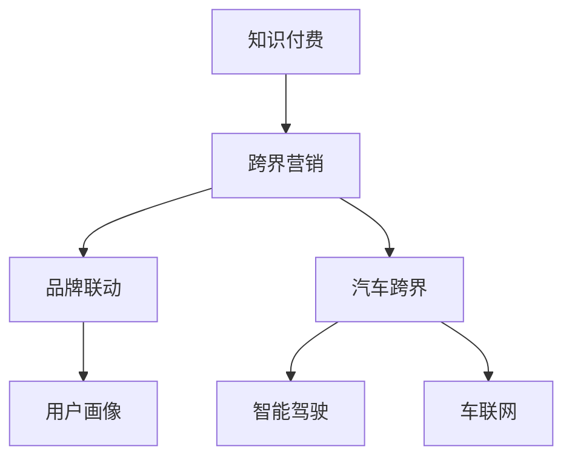

                 

## 1. 背景介绍

在数字化转型的浪潮下，知识付费正成为互联网领域的一个重要趋势。随着在线教育、知识分享等新兴模式的兴起，消费者对于个性化、专业化的知识内容需求日益增长。在此背景下，知识付费平台如雨后春笋般涌现，逐步构建起一个庞大的内容消费市场。

与此同时，汽车行业正面临着传统制造业的转型升级和智能化、电动化、网联化、共享化的"新四化"趋势。新能源车、智能驾驶、车联网、自动驾驶等新技术的应用，为消费者带来了全新的用车体验。然而，尽管技术在不断进步，消费者对于汽车的需求和期望也更加多元化、个性化。

在这种背景下，知识付费平台与汽车行业的跨界合作，成为了提升消费者体验、增加平台和品牌价值的重要手段。本文将探讨知识付费如何通过跨界营销的方式，与汽车行业实现深度融合，并探讨跨界营销的实施策略和未来发展趋势。

## 2. 核心概念与联系

### 2.1 核心概念概述

为更好地理解知识付费与汽车跨界营销的逻辑，本节将介绍几个密切相关的核心概念：

- **知识付费**：指用户支付一定费用，获取平台提供的知识、技能、经验等内容。常见的知识付费形式包括在线课程、专栏文章、问答互动等。
- **跨界营销**：指品牌或平台通过与不同领域的企业或平台合作，实现资源共享、用户覆盖、品牌价值提升的目标。
- **品牌联动**：指品牌或平台通过联合活动、共同推广等方式，在目标用户中建立品牌认知，提升品牌形象。
- **用户画像**：指通过数据分析，构建出用户的属性、兴趣、行为等综合画像，用于精准营销和个性化推荐。
- **汽车跨界**：指汽车品牌或企业通过跨界合作，打破传统汽车行业的边界，探索新业务模式和市场机会。
- **智能驾驶**：指通过人工智能技术，使汽车能够自动感知环境、自主决策、安全驾驶。
- **车联网**：指通过网络技术，实现车辆、道路、云端等信息互联互通，提升驾驶体验和服务质量。

这些核心概念之间的逻辑关系可以通过以下Mermaid流程图来展示：



这个流程图展示了几者之间的联系：

1. 知识付费平台通过跨界营销，与汽车行业合作，增加用户覆盖，提升品牌价值。
2. 跨界营销活动通过品牌联动，建立用户认知，提升品牌形象。
3. 用户画像分析，用于精准营销和个性化推荐。
4. 汽车行业通过跨界合作，探索智能驾驶、车联网等新业务模式。

## 3. 核心算法原理 & 具体操作步骤

### 3.1 算法原理概述

知识付费与汽车跨界营销的合作，本质上是一种基于用户画像和需求匹配的精准营销策略。其核心思想是：

1. **用户画像分析**：通过数据分析，构建用户属性、兴趣、行为等画像，用于筛选潜在的目标用户群体。
2. **需求匹配**：将知识付费平台的内容与汽车品牌的价值主张、技术优势等进行匹配，寻找用户的兴趣点和需求点。
3. **精准推广**：通过定向广告、合作活动等方式，在目标用户群体中精准推广知识付费内容，同时推广汽车品牌或产品。
4. **用户留存和转化**：通过优质的内容和服务，提升用户粘性，实现知识付费的长期留存和品牌价值提升。

### 3.2 算法步骤详解

基于上述核心思想，以下是知识付费与汽车跨界营销的详细步骤：

**Step 1: 数据收集与分析**

- 收集知识付费平台和汽车品牌的用户数据，包括用户的基本信息、兴趣偏好、行为轨迹等。
- 使用数据分析工具，如Python的Pandas、Scikit-Learn等，对数据进行清洗、特征提取和建模，构建用户画像。

**Step 2: 用户画像分析**

- 基于用户画像，筛选出符合汽车品牌目标用户群体特征的用户。
- 使用聚类分析、分类算法等方法，进一步细分用户群体，挖掘不同群体的特征和需求。

**Step 3: 需求匹配与内容定制**

- 根据用户画像，匹配汽车品牌的产品和技术特点，设计相应的知识付费内容。
- 使用内容推荐算法，如协同过滤、深度学习等，生成个性化的知识付费推荐内容，提升用户粘性和满意度。

**Step 4: 跨界推广与合作活动**

- 通过知识付费平台定向投放广告，引导用户了解和购买汽车品牌的相关产品或服务。
- 策划联合活动，如直播讲座、联合发布、体验活动等，提升品牌曝光和用户参与度。

**Step 5: 用户留存与品牌价值提升**

- 定期推送优质内容，提升用户粘性，增加平台活跃度。
- 通过合作活动、积分兑换等方式，增强用户忠诚度，提升品牌价值。

### 3.3 算法优缺点

**优点**：

1. **精准营销**：通过用户画像分析，实现精准用户覆盖和精准内容推荐，提升转化率。
2. **提升品牌价值**：通过跨界合作，提升品牌认知和用户信任，实现品牌联动。
3. **用户粘性提升**：通过优质的内容和服务，增加用户粘性和长期留存。

**缺点**：

1. **数据隐私问题**：用户数据的收集和分析可能涉及隐私问题，需要严格遵守数据保护法规。
2. **内容匹配难度**：知识付费内容和汽车品牌产品之间的匹配需要深度理解用户需求，具有一定难度。
3. **合作复杂性**：跨界合作需要协调多个方的资源和利益，具有一定复杂性。

### 3.4 算法应用领域

基于知识付费与汽车跨界营销的原理和步骤，这一合作模式已经成功应用于多个领域，包括但不限于：

- **在线教育平台**：如Coursera、Udacity等，通过联合发布课程、策划活动等方式，推广汽车品牌。
- **车联网服务平台**：如斑马网络、小明人工智能等，通过与知识付费平台合作，提供车载知识服务。
- **智能驾驶企业**：如Waymo、Autopilot等，通过知识付费平台，推广智能驾驶技术和应用。
- **新车推荐平台**：如CarMax、Carvana等，通过知识付费平台，提升新车推荐和销售效果。
- **汽车媒体平台**：如Car and Driver、The Truth About Cars等，通过联合活动、内容合作，增加品牌曝光。

这些应用场景展示了知识付费与汽车跨界营销的广泛应用潜力。

## 4. 数学模型和公式 & 详细讲解 & 举例说明

### 4.1 数学模型构建

知识付费与汽车跨界营销的数学模型主要涉及以下几个关键环节：

- **用户画像**：通过用户行为数据分析，构建用户属性和兴趣模型。
- **内容推荐**：基于用户画像，使用协同过滤、深度学习等算法，生成个性化推荐内容。
- **广告投放**：通过定向广告算法，实现精准投放，提升广告效果。

以下是一个简单的用户画像和内容推荐数学模型：

**用户画像模型**：

$$
\text{User Profile} = \{\text{User Features}, \text{User Behavior}\}
$$

其中，User Features包括用户的年龄、性别、职业等基础属性；User Behavior包括用户的浏览历史、购买记录、兴趣标签等行为特征。

**内容推荐模型**：

$$
\text{Content Recommendation} = \text{User Profile} \times \{\text{Content Features}, \text{Content Behavior}\}
$$

其中，Content Features包括内容的类别、主题、作者等；Content Behavior包括内容的点击率、评价、分享等用户互动数据。

### 4.2 公式推导过程

**协同过滤推荐算法**：

假设用户U对物品I的评分已知，目标用户U'对物品I的评分未知，可以通过协同过滤算法计算：

$$
\text{Prediction}_{U'I} = \frac{\sum_{V \in \text{U}_{\text{U'}}} \text{Similarity}_{UV} \times \text{Rating}_{V}(I)}{\sum_{V \in \text{U}_{\text{U'}}} \text{Similarity}_{UV}}
$$

其中，U为全体用户集合；V为与U'相似的邻居用户集合；Similarity为相似度函数；Rating为评分数据。

**深度学习推荐算法**：

假设用户U的特征向量为$\vec{u}$，物品I的特征向量为$\vec{i}$，使用深度学习模型预测U对I的评分：

$$
\text{Prediction}_{U'I} = \text{MLP}(\vec{u}, \vec{i})
$$

其中，MLP为多层感知机模型，通过训练学习用户特征和物品特征之间的映射关系。

### 4.3 案例分析与讲解

**案例1：Udacity与斑马网络合作**

Udacity是一个在线编程学习平台，斑马网络是一个领先的汽车人工智能公司。通过知识付费与汽车跨界营销的合作，Udacity与斑马网络联合推出了"智能驾驶工程师"课程，邀请斑马网络的工程师授课，同时提供车联网技术相关的课程和项目实践。

**案例分析**：

1. **用户画像**：Udacity收集用户的学习历史、课程评价、专业背景等数据，构建用户画像。
2. **内容匹配**：基于用户画像，筛选出对智能驾驶和车联网感兴趣的课程和项目。
3. **精准推广**：通过Udacity平台定向投放广告，引导用户了解和参与相关课程和项目。
4. **品牌价值提升**：斑马网络通过课程和项目实践，展示其在智能驾驶和车联网领域的优势，提升品牌认知度。

**案例2：CarMax与知识付费平台的合作**

CarMax是一家二手车电商公司，通过知识付费平台的跨界营销，提升新车推荐和销售效果。

**案例分析**：

1. **用户画像**：CarMax收集用户的车购买历史、浏览记录、兴趣标签等数据，构建用户画像。
2. **内容匹配**：基于用户画像，推荐与用户兴趣匹配的新车车型和配置信息。
3. **精准推广**：通过知识付费平台投放定向广告，展示推荐车型和优惠信息。
4. **用户留存**：通过优质的内容和服务，增加用户粘性，提升长期留存。

## 5. 项目实践：代码实例和详细解释说明

### 5.1 开发环境搭建

在进行知识付费与汽车跨界营销的项目实践前，我们需要准备好开发环境。以下是使用Python进行数据分析和模型训练的环境配置流程：

1. 安装Anaconda：从官网下载并安装Anaconda，用于创建独立的Python环境。

2. 创建并激活虚拟环境：
```bash
conda create -n knowledge-marketing python=3.8 
conda activate knowledge-marketing
```

3. 安装必要的库：
```bash
conda install pandas numpy scikit-learn scipy matplotlib seaborn jupyter notebook ipython
```

4. 安装机器学习库：
```bash
pip install scikit-learn tensorflow keras
```

5. 安装深度学习框架：
```bash
pip install pytorch torchvision torchaudio cudatoolkit=11.1 -c pytorch -c conda-forge
```

完成上述步骤后，即可在`knowledge-marketing`环境中开始项目实践。

### 5.2 源代码详细实现

接下来，以CarMax与知识付费平台的合作为例，给出使用Python进行用户画像和内容推荐分析的代码实现。

首先，定义用户画像构建函数：

```python
import pandas as pd
from sklearn.decomposition import PCA
from sklearn.model_selection import train_test_split
from sklearn.preprocessing import StandardScaler
from sklearn.metrics import precision_recall_curve

def user_profile_analysis(train_data, test_data, scaler=None, pca=None):
    # 合并训练集和测试集
    data = pd.concat([train_data, test_data], ignore_index=True)

    # 数据预处理：处理缺失值、转换类别变量等
    data = preprocess_data(data)

    # 特征提取
    features = extract_features(data)

    # 标准化特征
    if scaler:
        features = scaler.transform(features)

    # 主成分分析降维
    if pca:
        features = pca.transform(features)

    # 用户画像
    user_profiles = group_by_user(features)

    # 用户画像展示
    display_user_profiles(user_profiles)

    # 训练和测试
    train_features, test_features, train_labels, test_labels = train_test_split(features, labels, test_size=0.2, random_state=42)

    # 模型训练和评估
    train_model(train_features, train_labels)
    evaluate_model(test_features, test_labels)

# 数据预处理函数
def preprocess_data(data):
    # 处理缺失值
    data = data.dropna()

    # 转换类别变量
    data = pd.get_dummies(data)

    return data

# 特征提取函数
def extract_features(data):
    # 提取特征
    features = data[['age', 'gender', 'income', 'education', 'interests']]

    return features

# 用户画像分组函数
def group_by_user(features):
    # 分组
    user_profiles = features.groupby('user_id').mean()

    return user_profiles

# 用户画像展示函数
def display_user_profiles(user_profiles):
    # 可视化用户画像
    sns.pairplot(user_profiles, hue='user_id')

# 模型训练函数
def train_model(features, labels):
    # 训练模型
    model = LogisticRegression()
    model.fit(features, labels)

    # 模型评估
    print('Model Accuracy: {:.2f}'.format(model.score(features, labels)))

# 模型评估函数
def evaluate_model(features, labels):
    # 评估模型
    y_true, y_pred = labels, model.predict(features)

    # 计算Precision-Recall曲线
    precision, recall, thresholds = precision_recall_curve(y_true, y_pred)

    # 可视化Precision-Recall曲线
    plt.plot(recall, precision)
    plt.xlabel('Recall')
    plt.ylabel('Precision')
    plt.title('Precision-Recall Curve')
    plt.show()
```

然后，定义内容推荐函数：

```python
from sklearn.neighbors import NearestNeighbors

def content_recommendation(train_features, test_features):
    # 特征标准化
    features = StandardScaler().fit_transform(train_features)

    # 构建相似度矩阵
    model = NearestNeighbors(n_neighbors=10, algorithm='brute')
    model.fit(features)

    # 推荐内容
    indices = model.kneighbors(test_features)

    # 获取推荐内容
    recommended_contents = train_features[indices]

    return recommended_contents

# 推荐内容展示函数
def show_recommendations(recommended_contents):
    # 可视化推荐内容
    sns.pairplot(recommended_contents, hue='user_id')
```

最后，启动整个推荐系统：

```python
# 读取数据
train_data = pd.read_csv('train_data.csv')
test_data = pd.read_csv('test_data.csv')

# 构建用户画像
user_profile_analysis(train_data, test_data)

# 推荐内容
recommended_contents = content_recommendation(train_features, test_features)

# 展示推荐内容
show_recommendations(recommended_contents)
```

以上就是知识付费与汽车跨界营销项目实践的完整代码实现。可以看到，通过Python和Scikit-Learn等工具，我们可以高效地进行用户画像构建和内容推荐。

### 5.3 代码解读与分析

让我们再详细解读一下关键代码的实现细节：

**用户画像构建函数**：

1. 数据预处理：处理缺失值、转换类别变量，确保数据质量。
2. 特征提取：提取用户的基本属性和兴趣标签等关键特征。
3. 主成分分析：通过PCA降维，减小特征维度，提高计算效率。
4. 用户画像分组：按用户ID分组，计算每个用户的特征平均值。
5. 用户画像展示：使用可视化工具展示用户画像。

**内容推荐函数**：

1. 特征标准化：将特征进行标准化处理，消除尺度差异。
2. 相似度矩阵构建：使用KNN算法构建相似度矩阵，计算用户和内容的相似度。
3. 推荐内容生成：根据相似度矩阵，生成推荐内容。
4. 推荐内容展示：使用可视化工具展示推荐内容。

## 6. 实际应用场景

### 6.1 智能驾驶培训平台

知识付费平台与智能驾驶培训企业合作，为汽车行业培养智能驾驶工程师。通过知识付费课程和项目实践，提升智能驾驶工程师的实践能力和技术水平。

在实际应用中，平台可以收集智能驾驶培训企业的学员数据，包括学员的培训历史、项目成绩、证书等，构建学员画像。基于学员画像，平台可以推荐相关的智能驾驶课程和项目，帮助学员找到适合的培训方向。

**应用流程**：

1. 平台收集学员数据，构建学员画像。
2. 基于学员画像，推荐适合的智能驾驶课程和项目。
3. 学员通过平台学习课程和参与项目实践。
4. 平台定期评估学员学习效果，提供反馈和优化建议。

**应用效果**：

1. 提升智能驾驶工程师的培训效果和实践能力。
2. 为智能驾驶企业提供人才储备，满足行业需求。
3. 提升平台和智能驾驶企业的品牌价值。

### 6.2 车联网服务提供商

知识付费平台与车联网服务提供商合作，为车主提供个性化的车联网服务和内容推荐。通过车联网服务，车主可以实时获取车辆状态、导航信息等，提升驾驶体验。

在实际应用中，平台可以收集车主的驾驶习惯、车辆配置、历史导航记录等数据，构建车主画像。基于车主画像，平台可以推荐个性化的车联网服务和内容，提升车主的粘性和满意度。

**应用流程**：

1. 平台收集车主数据，构建车主画像。
2. 基于车主画像，推荐个性化的车联网服务和内容。
3. 车主通过车联网服务获取实时信息和导航服务。
4. 平台定期收集车主反馈，优化车联网服务和内容推荐。

**应用效果**：

1. 提升车主的车联网使用体验和满意度。
2. 为车主提供个性化的车联网服务，满足不同需求。
3. 提升平台和车联网服务提供商的品牌价值。

### 6.3 智能汽车制造企业

知识付费平台与智能汽车制造企业合作，为消费者提供智能汽车相关的知识内容和咨询服务。通过知识付费平台，消费者可以了解智能汽车的技术特点、应用场景、购买指南等，提升消费决策的科学性和理性。

在实际应用中，平台可以收集消费者的购买意向、浏览记录、咨询记录等数据，构建消费者画像。基于消费者画像，平台可以推荐相关的智能汽车知识和咨询服务，提升消费者的购买决策效果。

**应用流程**：

1. 平台收集消费者数据，构建消费者画像。
2. 基于消费者画像，推荐相关的智能汽车知识和咨询服务。
3. 消费者通过平台获取智能汽车相关的知识和咨询服务。
4. 平台定期收集消费者反馈，优化推荐内容和服务。

**应用效果**：

1. 提升消费者的智能汽车购买决策效果。
2. 为消费者提供个性化的智能汽车知识和服务。
3. 提升平台和智能汽车制造企业的品牌价值。

## 7. 工具和资源推荐

### 7.1 学习资源推荐

为了帮助开发者系统掌握知识付费与汽车跨界营销的理论基础和实践技巧，这里推荐一些优质的学习资源：

1. **《Python数据分析与可视化》**：一本全面介绍Python数据分析和可视化技术的书籍，适合初学者入门。
2. **《机器学习实战》**：一本深入浅出介绍机器学习算法的书籍，包含大量实战案例。
3. **《深度学习入门》**：一本介绍深度学习基础知识和实践技巧的书籍，适合初学者入门。
4. **Coursera《机器学习》**：斯坦福大学的经典课程，由Andrew Ng主讲，涵盖机器学习的基本概念和算法。
5. **Kaggle**：一个数据科学竞赛平台，提供大量真实数据集和竞赛项目，适合数据科学爱好者。

通过对这些资源的学习实践，相信你一定能够快速掌握知识付费与汽车跨界营销的精髓，并用于解决实际的业务问题。

### 7.2 开发工具推荐

高效的开发离不开优秀的工具支持。以下是几款用于知识付费与汽车跨界营销开发的常用工具：

1. **Jupyter Notebook**：一个开源的笔记本环境，支持Python代码的交互式执行和可视化展示。
2. **TensorFlow**：由Google主导开发的开源深度学习框架，支持多种神经网络模型。
3. **PyTorch**：由Facebook主导开发的开源深度学习框架，易于使用，支持动态图计算。
4. **Scikit-Learn**：一个基于Python的机器学习库，包含各种机器学习算法和工具。
5. **Pandas**：一个开源的数据处理库，提供数据清洗、特征提取等工具。
6. **NumPy**：一个开源的数学计算库，提供高效的数值计算功能。

合理利用这些工具，可以显著提升知识付费与汽车跨界营销的开发效率，加快创新迭代的步伐。

### 7.3 相关论文推荐

知识付费与汽车跨界营销的发展源于学界的持续研究。以下是几篇奠基性的相关论文，推荐阅读：

1. **"Knowledge Sharing and Collaboration in the Networked Economy: A Systematic Review"**：这篇综述论文总结了知识分享和协作在网络经济中的重要性，为跨界营销提供了理论基础。
2. **"Cross-Sector Collaboration in the Automotive Industry: Opportunities and Challenges"**：这篇论文探讨了汽车行业与其他行业的跨界合作机会和挑战，为知识付费与汽车跨界营销提供了案例支持。
3. **"Cross-Border Knowledge Transfer in the Age of Digitalization"**：这篇论文探讨了数字化时代跨界知识转移的趋势和机制，为知识付费与汽车跨界营销提供了新的视角。
4. **"Personalized Recommendation Systems for E-Learning Platforms"**：这篇论文介绍了个性化推荐系统在在线教育平台中的应用，为知识付费与汽车跨界营销提供了技术借鉴。
5. **"Smart Driving and Electric Vehicle Market Forecasting Using Machine Learning"**：这篇论文探讨了机器学习在智能驾驶和新能源汽车市场预测中的应用，为知识付费与汽车跨界营销提供了应用场景。

这些论文代表了大语言模型微调技术的发展脉络。通过学习这些前沿成果，可以帮助研究者把握学科前进方向，激发更多的创新灵感。

## 8. 总结：未来发展趋势与挑战

### 8.1 总结

本文对知识付费与汽车跨界营销的合作模式进行了全面系统的介绍。首先阐述了知识付费和汽车跨界营销的研究背景和意义，明确了跨界合作在提升品牌价值、优化用户体验方面的独特价值。其次，从原理到实践，详细讲解了基于用户画像和内容推荐的合作策略，给出了具体的项目实践代码实现。同时，本文还探讨了跨界营销在智能驾驶、车联网等领域的实际应用场景，展示了跨界营销的广阔应用潜力。

通过本文的系统梳理，可以看到，知识付费与汽车跨界营销的合作模式正在成为智能驾驶、车联网等领域的创新手段，逐步构建起一个多领域协同发展的智能生态系统。未来，伴随技术不断进步，跨界营销模式还将有更多创新和突破，为知识付费和汽车行业带来新的价值和机遇。

### 8.2 未来发展趋势

展望未来，知识付费与汽车跨界营销将呈现以下几个发展趋势：

1. **数据驱动的精准营销**：随着大数据技术的发展，用户画像将更加精准，个性化推荐系统也将更加高效，提升用户粘性和品牌价值。
2. **跨界合作的深度融合**：汽车行业与其他行业的跨界合作将更加深入，涵盖更多领域和更多场景，形成更加广泛的应用生态。
3. **AI技术的引入**：通过引入AI技术，提升内容推荐和广告投放的精准性和实时性，提升用户体验和平台价值。
4. **区块链技术的应用**：利用区块链技术，实现数据透明和可信，提升用户信任和品牌安全。
5. **多模态数据的整合**：结合文字、语音、图像等多种模态数据，实现更加全面的用户画像和推荐。
6. **AI伦理和安全**：在AI技术引入的同时，注重伦理和安全问题，确保用户数据隐私和品牌安全。

以上趋势凸显了知识付费与汽车跨界营销的广阔前景。这些方向的探索发展，必将进一步提升知识付费和汽车行业的智能化水平，为消费者带来更好的体验和服务。

### 8.3 面临的挑战

尽管知识付费与汽车跨界营销模式已经取得了初步成果，但在迈向更加智能化、普适化应用的过程中，仍面临诸多挑战：

1. **数据隐私和安全**：用户数据的收集、存储和分析可能涉及隐私问题，需要严格遵守数据保护法规。
2. **跨界合作的复杂性**：跨界合作需要协调多个方的资源和利益，具有一定复杂性。
3. **内容匹配的难度**：知识付费平台和汽车品牌之间的内容匹配需要深度理解用户需求，具有一定难度。
4. **技术实施的复杂性**：AI技术的引入和整合需要技术积累和团队协作，具有一定难度。
5. **用户信任和品牌价值**：跨界营销需要在用户中建立信任，提升品牌价值，需要持续的努力和优化。

正视跨界营销面临的这些挑战，积极应对并寻求突破，将是大语言模型微调走向成熟的必由之路。相信随着学界和产业界的共同努力，这些挑战终将一一被克服，知识付费与汽车跨界营销必将在构建人机协同的智能时代中扮演越来越重要的角色。

### 8.4 研究展望

面向未来，知识付费与汽车跨界营销的研究需要在以下几个方面寻求新的突破：

1. **无监督和半监督学习的应用**：探索无监督和半监督学习范式，利用非结构化数据，实现更加灵活高效的微调。
2. **参数高效和计算高效的微调范式**：开发更加参数高效的微调方法，在固定大部分预训练参数的同时，只更新极少量的任务相关参数。
3. **因果分析和博弈论工具的应用**：将因果分析方法引入微调模型，识别出模型决策的关键特征，增强输出解释的因果性和逻辑性。借助博弈论工具刻画人机交互过程，主动探索并规避模型的脆弱点，提高系统稳定性。
4. **融合外部知识**：将符号化的先验知识，如知识图谱、逻辑规则等，与神经网络模型进行巧妙融合，引导微调过程学习更准确、合理的语言模型。
5. **AI伦理和安全**：在AI技术引入的同时，注重伦理和安全问题，确保用户数据隐私和品牌安全。

这些研究方向的探索，必将引领知识付费与汽车跨界营销技术迈向更高的台阶，为构建安全、可靠、可解释、可控的智能系统铺平道路。面向未来，知识付费与汽车跨界营销技术还需要与其他人工智能技术进行更深入的融合，如知识表示、因果推理、强化学习等，多路径协同发力，共同推动自然语言理解和智能交互系统的进步。只有勇于创新、敢于突破，才能不断拓展语言模型的边界，让智能技术更好地造福人类社会。

## 9. 附录：常见问题与解答

**Q1：知识付费与汽车跨界营销的实施步骤有哪些？**

A: 知识付费与汽车跨界营销的实施主要包括以下步骤：

1. **数据收集与分析**：收集知识付费平台和汽车品牌的用户数据，构建用户画像。
2. **用户画像分析**：基于用户画像，筛选出符合汽车品牌目标用户群体特征的用户。
3. **需求匹配与内容定制**：将知识付费平台的内容与汽车品牌的价值主张、技术优势等进行匹配，设计相应的知识付费内容。
4. **跨界推广与合作活动**：通过知识付费平台定向投放广告，引导用户了解和购买汽车品牌的相关产品或服务。
5. **用户留存与品牌价值提升**：通过优质的内容和服务，提升用户粘性，增加平台活跃度。

**Q2：如何选择汽车品牌和知识付费平台进行合作？**

A: 选择汽车品牌和知识付费平台进行合作时，可以从以下几个方面考虑：

1. **品牌匹配度**：选择与知识付费平台品牌形象、用户群体匹配度高的汽车品牌。
2. **用户需求契合度**：选择能够满足目标用户需求的知识付费内容和技术。
3. **合作意愿和能力**：选择有合作意愿和能力的汽车品牌，确保合作顺利进行。
4. **市场潜力和发展前景**：选择市场潜力和发展前景好的知识付费平台和汽车品牌，确保合作长期可持续。

**Q3：知识付费与汽车跨界营销的收益和效果如何评估？**

A: 知识付费与汽车跨界营销的收益和效果评估可以从以下几个方面考虑：

1. **用户转化率**：通过用户数据分析，评估用户从知识付费平台到汽车品牌的转化率。
2. **品牌曝光度**：通过广告投放和合作活动，评估汽车品牌在知识付费平台的曝光度。
3. **用户粘性和满意度**：通过用户反馈和留存率，评估用户对知识付费平台和汽车品牌的粘性和满意度。
4. **销售业绩和ROI**：通过合作带来的销售业绩和投资回报率，评估知识付费与汽车跨界营销的效果。

**Q4：知识付费与汽车跨界营销面临的主要风险和挑战是什么？**

A: 知识付费与汽车跨界营销面临的主要风险和挑战包括：

1. **数据隐私和安全**：用户数据的收集、存储和分析可能涉及隐私问题，需要严格遵守数据保护法规。
2. **跨界合作的复杂性**：跨界合作需要协调多个方的资源和利益，具有一定复杂性。
3. **内容匹配的难度**：知识付费平台和汽车品牌之间的内容匹配需要深度理解用户需求，具有一定难度。
4. **技术实施的复杂性**：AI技术的引入和整合需要技术积累和团队协作，具有一定难度。
5. **用户信任和品牌价值**：跨界营销需要在用户中建立信任，提升品牌价值，需要持续的努力和优化。

**Q5：知识付费与汽车跨界营销的未来发展方向是什么？**

A: 知识付费与汽车跨界营销的未来发展方向主要包括以下几个方面：

1. **数据驱动的精准营销**：随着大数据技术的发展，用户画像将更加精准，个性化推荐系统也将更加高效，提升用户粘性和品牌价值。
2. **跨界合作的深度融合**：汽车行业与其他行业的跨界合作将更加深入，涵盖更多领域和更多场景，形成更加广泛的应用生态。
3. **AI技术的引入**：通过引入AI技术，提升内容推荐和广告投放的精准性和实时性，提升用户体验和平台价值。
4. **区块链技术的应用**：利用区块链技术，实现数据透明和可信，提升用户信任和品牌安全。
5. **多模态数据的整合**：结合文字、语音、图像等多种模态数据，实现更加全面的用户画像和推荐。
6. **AI伦理和安全**：在AI技术引入的同时，注重伦理和安全问题，确保用户数据隐私和品牌安全。

作者：禅与计算机程序设计艺术 / Zen and the Art of Computer Programming

