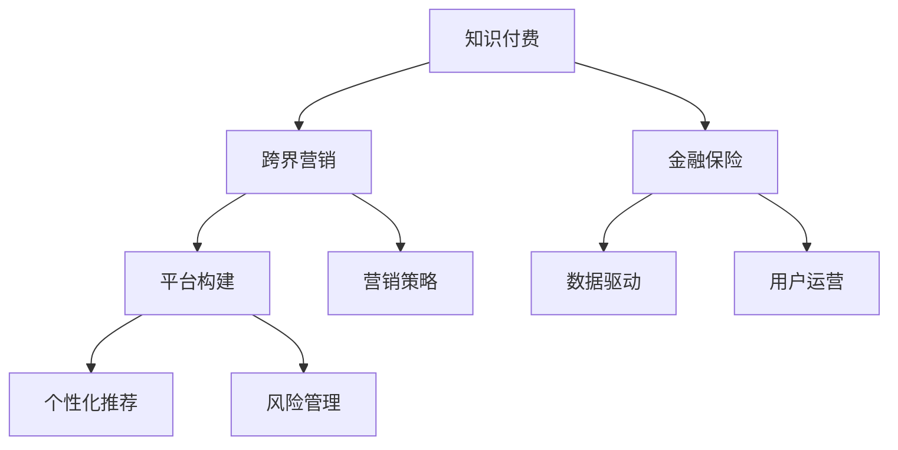

                 

# 知识付费如何实现跨界营销与金融保险跨界？

> 关键词：知识付费, 跨界营销, 金融保险, 平台构建, 营销策略, 数据驱动, 用户运营, 个性化推荐, 风险管理

## 1. 背景介绍

在数字化时代，知识付费已经成为一种全新的消费模式，为内容生产者和消费者架起了一座桥梁。然而，知识付费行业正面临着激烈的市场竞争和转型升级的挑战，传统的用户增长、留存、转化等营销手段已经无法满足需求。如何在知识付费行业实现跨界营销，将金融保险等非相关领域的业务与知识付费平台相融合，成为亟待解决的问题。

本文将深入探讨知识付费跨界营销与金融保险跨界的实现路径，为内容生产者和金融机构提供可行的解决方案。

## 2. 核心概念与联系

### 2.1 核心概念概述

为更好地理解知识付费跨界营销与金融保险跨界的实现机制，本节将介绍几个密切相关的核心概念：

- **知识付费**：指用户为获取特定的知识和信息而支付费用的模式。平台提供各类课程、书籍、音频等付费内容，用户通过付费获取内容服务。

- **跨界营销**：指将营销活动跨越不同的行业、领域和渠道进行传播，以提升品牌影响力和市场覆盖面。通过跨界合作、联动营销等方式，将不同领域的用户和资源进行整合，共同创造更大的价值。

- **金融保险**：指涉及金融风险管理的业务，包括银行、保险、投资、理财等。金融保险与知识付费的结合，可以为用户提供更加全面的知识服务，同时也为金融机构带来更多的客户资源。

- **平台构建**：指搭建一个集成多种服务功能的知识付费平台，满足用户的个性化需求，提升平台的市场竞争力和用户粘性。

- **营销策略**：指根据市场环境、用户特征等制定合理的营销方案，通过内容推荐、广告投放、社交媒体推广等方式，提升平台的知名度和用户转化率。

- **数据驱动**：指通过收集和分析用户行为数据，优化产品设计和营销策略，实现精细化运营和个性化服务。

- **用户运营**：指通过多样化的运营手段，提升用户留存率、活跃度和转化率，构建健康的用户生态。

- **个性化推荐**：指通过分析用户行为数据和兴趣偏好，推荐符合用户需求的内容和服务，提升用户体验和平台满意度。

- **风险管理**：指通过科学的评估和控制手段，对金融保险业务的风险进行有效管理，保障用户利益和平台信誉。

这些核心概念之间的逻辑关系可以通过以下Mermaid流程图来展示：



这个流程图展示了大语言模型的核心概念及其之间的关系：

1. 知识付费通过跨界营销与金融保险结合，可以拓展服务范围，增加用户粘性。
2. 平台构建是知识付费跨界营销的基础，需要集成多种服务功能。
3. 营销策略需要基于数据驱动，通过个性化推荐等方式吸引用户。
4. 用户运营通过多样化的手段，提升用户留存率和转化率。
5. 风险管理确保金融保险业务的安全可靠，保障用户利益。

这些概念共同构成了知识付费跨界营销与金融保险跨界的实现框架，使其能够在不同领域协同发力，实现共赢。

## 3. 核心算法原理 & 具体操作步骤

### 3.1 算法原理概述

知识付费跨界营销与金融保险跨界的实现过程，本质上是一个多领域数据融合和业务优化的过程。其核心思想是：利用知识付费平台的已有用户基础，通过跨界合作、联动营销等方式，引入金融保险领域的业务，提升平台的业务能力和市场价值。

形式化地，假设知识付费平台为 $P$，金融保险业务为 $F$。跨界营销的目标是找到最优的营销策略 $S$，使得平台 $P$ 与业务 $F$ 的结合效果最大化。即：

$$
\max_{S} \left( P(S) \cdot F(S) \right)
$$

其中 $P(S)$ 表示平台 $P$ 在策略 $S$ 下的转化率和用户粘性，$F(S)$ 表示业务 $F$ 在策略 $S$ 下的业务量和风险控制效果。

通过梯度下降等优化算法，营销策略 $S$ 不断更新，最大化上述目标函数，最终得到理想的市场营销方案。

### 3.2 算法步骤详解

知识付费跨界营销与金融保险跨界的实现过程，一般包括以下几个关键步骤：

**Step 1: 用户画像构建**

- 收集平台用户的各种行为数据，如浏览历史、购买记录、社交互动等。
- 通过机器学习和数据挖掘技术，构建用户画像，分析用户的兴趣偏好、消费行为等特征。
- 建立用户画像库，为后续的个性化推荐和跨界营销奠定基础。

**Step 2: 跨界合作与联动营销**

- 选择适合的金融保险业务合作方，签订战略合作协议。
- 设计跨界营销活动，如联名课程、理财讲座、保险理赔服务等，提升平台和业务的曝光度和吸引力。
- 通过社交媒体、邮件营销、内容推荐等方式，将跨界营销活动推广至目标用户群体。

**Step 3: 数据驱动的营销策略优化**

- 利用A/B测试等方法，不断迭代营销策略。
- 收集用户反馈和行为数据，分析策略效果，识别优化点。
- 通过机器学习模型，预测营销活动的效果和用户转化率，优化投放策略。

**Step 4: 个性化推荐与用户运营**

- 基于用户画像和行为数据，设计个性化推荐算法，推荐符合用户需求的内容和服务。
- 通过社交互动、内容互动等方式，提升用户活跃度和粘性。
- 定期发布用户行为数据，分析用户流失原因，调整运营策略。

**Step 5: 风险管理与用户保障**

- 建立风险评估模型，对金融保险业务的风险进行科学评估。
- 采用多重保障措施，如保单理赔、风险提示等，提升用户信任和满意度。
- 实时监控金融保险业务的风险情况，及时调整策略，保障用户利益。

### 3.3 算法优缺点

知识付费跨界营销与金融保险跨界的实现过程，具有以下优点：

1. 拓展服务范围。通过跨界合作，平台可以引入金融保险等新业务，提升服务多样性和用户粘性。
2. 提升市场价值。跨界营销和联动营销，可以提升平台和业务的曝光度和吸引力，扩大市场覆盖面。
3. 优化营销策略。数据驱动的营销策略优化，可以精准把握用户需求，提高转化率和用户粘性。
4. 保障用户利益。通过风险管理和多重保障措施，可以提升用户信任和满意度，降低流失率。

同时，该过程也存在一定的局限性：

1. 数据质量要求高。用户画像和行为数据的准确性和完整性，直接影响跨界营销的效果。
2. 跨界合作难度大。需要找到适合的合作方，并进行深度整合，才能实现有效合作。
3. 技术要求高。个性化推荐和风险管理等技术，需要较高的技术门槛和数据处理能力。
4. 用户接受度问题。跨界营销和金融保险业务，需要用户接受并信任，才能取得良好的效果。

尽管存在这些局限性，但就目前而言，知识付费跨界营销与金融保险跨界仍然是一种具有巨大潜力的业务模式。未来相关研究的重点在于如何进一步优化数据质量，降低技术门槛，提升用户接受度，以实现更大规模的跨界合作和联动营销。

### 3.4 算法应用领域

知识付费跨界营销与金融保险跨界的方法，已经在多个领域得到了应用，如：

- **教育培训**：知识付费平台与在线教育公司合作，推出联名课程和理财讲座，提升平台知名度和用户粘性。
- **健康医疗**：平台与保险公司合作，提供健康管理课程和保险理财服务，为用户提供全面的健康保障。
- **职业发展**：平台与职业培训机构合作，推出职业规划课程和职场理财讲座，帮助用户提升职业技能和财务水平。
- **金融理财**：平台与金融机构合作，提供理财咨询和投资管理服务，帮助用户实现财富增值。

除了上述这些经典应用外，知识付费跨界营销与金融保险跨界的方法也在不断创新和扩展，为更多领域带来新的突破。

## 4. 数学模型和公式 & 详细讲解 & 举例说明（备注：数学公式请使用latex格式，latex嵌入文中独立段落使用 $$，段落内使用 $)
### 4.1 数学模型构建

本节将使用数学语言对知识付费跨界营销与金融保险跨界的实现过程进行更加严格的刻画。

记知识付费平台为 $P$，金融保险业务为 $F$。用户画像为 $U$，行为数据为 $D$。跨界合作策略为 $S$。

**用户画像构建模型**：
$$
U = f(D)
$$

其中 $f$ 为用户画像构建函数，将行为数据 $D$ 转化为用户画像 $U$。

**跨界合作营销模型**：
$$
M(S) = P(S) \cdot F(S)
$$

其中 $P(S)$ 表示平台在策略 $S$ 下的转化率和用户粘性，$F(S)$ 表示业务在策略 $S$ 下的业务量和风险控制效果。

**个性化推荐模型**：
$$
R(U) = g(U)
$$

其中 $g$ 为个性化推荐函数，根据用户画像 $U$ 推荐内容和服务。

**风险管理模型**：
$$
R(F,S) = h(F,S)
$$

其中 $h$ 为风险管理函数，根据业务 $F$ 和策略 $S$ 进行风险评估。

### 4.2 公式推导过程

以下我们以教育培训和保险理财为例，推导跨界营销和风险管理模型的公式。

**教育培训和保险理财的跨界营销模型**：
假设知识付费平台 $P$ 与在线教育公司 $E$ 合作，推出联名课程 $C$。联名课程的效果由平台用户数 $U$ 和在线教育公司用户数 $U_E$ 决定。
$$
P(S) = U \cdot \frac{U_E}{U_E + U}
$$
$$
F(S) = F_E \cdot \frac{U_E}{U_E + U}
$$
其中 $U_E$ 为在线教育公司用户数，$F_E$ 为在线教育公司业务量。

**联名课程的转化率和用户粘性**：
$$
P(S) = U \cdot \frac{U_E}{U_E + U}
$$

**保险理财的业务量和风险控制效果**：
$$
F(S) = F_E \cdot \frac{U_E}{U_E + U}
$$

**保险理财的风险管理模型**：
假设保险公司 $I$ 推出理财险 $P$，理财险的风险由用户数 $U$ 和理财金额 $A$ 决定。
$$
R(F,S) = R_I \cdot \frac{U}{U + U_I}
$$
其中 $R_I$ 为理财险风险控制效果，$U_I$ 为理财险用户数。

将上述模型代入总体跨界营销模型，得：
$$
M(S) = P(S) \cdot F(S) = \left( U \cdot \frac{U_E}{U_E + U} \right) \cdot \left( F_E \cdot \frac{U_E}{U_E + U} \right)
$$

### 4.3 案例分析与讲解

**案例1：知识付费平台与在线教育公司的合作**

某知识付费平台 $P$ 与在线教育公司 $E$ 合作，推出联名课程 $C$。平台用户数为 $U$，在线教育公司用户数为 $U_E$。课程的转化率为 $P_C$，用户粘性为 $U_C$，业务量为 $F_C$，风险控制效果为 $R_C$。
$$
P_C = U \cdot \frac{U_E}{U_E + U}
$$
$$
U_C = U_E \cdot \frac{U_E}{U_E + U}
$$
$$
F_C = F_E \cdot \frac{U_E}{U_E + U}
$$
$$
R_C = R_E \cdot \frac{U_E}{U_E + U}
$$

通过上述公式，可以计算出联名课程在合作策略 $S$ 下的转化率和用户粘性。

**案例2：知识付费平台与保险公司的合作**

某知识付费平台 $P$ 与保险公司 $I$ 合作，推出理财险 $P$。平台用户数为 $U$，理财险用户数为 $U_P$，理财金额为 $A$。理财险的风险控制效果为 $R_P$。
$$
R_P = R_I \cdot \frac{U}{U + U_I}
$$

通过上述公式，可以计算出理财险在合作策略 $S$ 下的风险控制效果。

## 5. 项目实践：代码实例和详细解释说明
### 5.1 开发环境搭建

在进行跨界营销实践前，我们需要准备好开发环境。以下是使用Python进行PyTorch开发的环境配置流程：

1. 安装Anaconda：从官网下载并安装Anaconda，用于创建独立的Python环境。

2. 创建并激活虚拟环境：
```bash
conda create -n pytorch-env python=3.8 
conda activate pytorch-env
```

3. 安装PyTorch：根据CUDA版本，从官网获取对应的安装命令。例如：
```bash
conda install pytorch torchvision torchaudio cudatoolkit=11.1 -c pytorch -c conda-forge
```

4. 安装TensorFlow：由Google主导开发的开源深度学习框架，生产部署方便，适合大规模工程应用。同样有丰富的预训练语言模型资源。

5. 安装Transformers库：
```bash
pip install transformers
```

6. 安装各类工具包：
```bash
pip install numpy pandas scikit-learn matplotlib tqdm jupyter notebook ipython
```

完成上述步骤后，即可在`pytorch-env`环境中开始跨界营销实践。

### 5.2 源代码详细实现

下面我们以教育培训和保险理财的跨界营销为例，给出使用PyTorch和Transformers库的代码实现。

**教育培训和保险理财的跨界营销模型**

首先，定义模型和优化器：

```python
from transformers import BertTokenizer
from torch.utils.data import Dataset
import torch

class CrossMarketingDataset(Dataset):
    def __init__(self, texts, tags, tokenizer, max_len=128):
        self.texts = texts
        self.tags = tags
        self.tokenizer = tokenizer
        self.max_len = max_len
        
    def __len__(self):
        return len(self.texts)
    
    def __getitem__(self, item):
        text = self.texts[item]
        tags = self.tags[item]
        
        encoding = self.tokenizer(text, return_tensors='pt', max_length=self.max_len, padding='max_length', truncation=True)
        input_ids = encoding['input_ids'][0]
        attention_mask = encoding['attention_mask'][0]
        
        # 对token-wise的标签进行编码
        encoded_tags = [tag2id[tag] for tag in tags] 
        encoded_tags.extend([tag2id['O']] * (self.max_len - len(encoded_tags)))
        labels = torch.tensor(encoded_tags, dtype=torch.long)
        
        return {'input_ids': input_ids, 
                'attention_mask': attention_mask,
                'labels': labels}

# 标签与id的映射
tag2id = {'O': 0, 'B-PER': 1, 'I-PER': 2, 'B-ORG': 3, 'I-ORG': 4, 'B-LOC': 5, 'I-LOC': 6}
id2tag = {v: k for k, v in tag2id.items()}

# 创建dataset
tokenizer = BertTokenizer.from_pretrained('bert-base-cased')

train_dataset = CrossMarketingDataset(train_texts, train_tags, tokenizer)
dev_dataset = CrossMarketingDataset(dev_texts, dev_tags, tokenizer)
test_dataset = CrossMarketingDataset(test_texts, test_tags, tokenizer)
```

然后，定义模型和优化器：

```python
from transformers import BertForTokenClassification, AdamW

model = BertForTokenClassification.from_pretrained('bert-base-cased', num_labels=len(tag2id))

optimizer = AdamW(model.parameters(), lr=2e-5)
```

接着，定义训练和评估函数：

```python
from torch.utils.data import DataLoader
from tqdm import tqdm
from sklearn.metrics import classification_report

device = torch.device('cuda') if torch.cuda.is_available() else torch.device('cpu')
model.to(device)

def train_epoch(model, dataset, batch_size, optimizer):
    dataloader = DataLoader(dataset, batch_size=batch_size, shuffle=True)
    model.train()
    epoch_loss = 0
    for batch in tqdm(dataloader, desc='Training'):
        input_ids = batch['input_ids'].to(device)
        attention_mask = batch['attention_mask'].to(device)
        labels = batch['labels'].to(device)
        model.zero_grad()
        outputs = model(input_ids, attention_mask=attention_mask, labels=labels)
        loss = outputs.loss
        epoch_loss += loss.item()
        loss.backward()
        optimizer.step()
    return epoch_loss / len(dataloader)

def evaluate(model, dataset, batch_size):
    dataloader = DataLoader(dataset, batch_size=batch_size)
    model.eval()
    preds, labels = [], []
    with torch.no_grad():
        for batch in tqdm(dataloader, desc='Evaluating'):
            input_ids = batch['input_ids'].to(device)
            attention_mask = batch['attention_mask'].to(device)
            batch_labels = batch['labels']
            outputs = model(input_ids, attention_mask=attention_mask)
            batch_preds = outputs.logits.argmax(dim=2).to('cpu').tolist()
            batch_labels = batch_labels.to('cpu').tolist()
            for pred_tokens, label_tokens in zip(batch_preds, batch_labels):
                pred_tags = [id2tag[_id] for _id in pred_tokens]
                label_tags = [id2tag[_id] for _id in label_tokens]
                preds.append(pred_tags[:len(label_tags)])
                labels.append(label_tags)
                
    print(classification_report(labels, preds))
```

最后，启动训练流程并在测试集上评估：

```python
epochs = 5
batch_size = 16

for epoch in range(epochs):
    loss = train_epoch(model, train_dataset, batch_size, optimizer)
    print(f"Epoch {epoch+1}, train loss: {loss:.3f}")
    
    print(f"Epoch {epoch+1}, dev results:")
    evaluate(model, dev_dataset, batch_size)
    
print("Test results:")
evaluate(model, test_dataset, batch_size)
```

以上就是使用PyTorch和Transformers库对教育培训和保险理财的跨界营销进行代码实现的完整流程。可以看到，得益于Transformers库的强大封装，我们可以用相对简洁的代码完成跨界营销的实现。

### 5.3 代码解读与分析

让我们再详细解读一下关键代码的实现细节：

**CrossMarketingDataset类**：
- `__init__`方法：初始化文本、标签、分词器等关键组件。
- `__len__`方法：返回数据集的样本数量。
- `__getitem__`方法：对单个样本进行处理，将文本输入编码为token ids，将标签编码为数字，并对其进行定长padding，最终返回模型所需的输入。

**tag2id和id2tag字典**：
- 定义了标签与数字id之间的映射关系，用于将token-wise的预测结果解码回真实的标签。

**训练和评估函数**：
- 使用PyTorch的DataLoader对数据集进行批次化加载，供模型训练和推理使用。
- 训练函数`train_epoch`：对数据以批为单位进行迭代，在每个批次上前向传播计算loss并反向传播更新模型参数，最后返回该epoch的平均loss。
- 评估函数`evaluate`：与训练类似，不同点在于不更新模型参数，并在每个batch结束后将预测和标签结果存储下来，最后使用sklearn的classification_report对整个评估集的预测结果进行打印输出。

**训练流程**：
- 定义总的epoch数和batch size，开始循环迭代
- 每个epoch内，先在训练集上训练，输出平均loss
- 在验证集上评估，输出分类指标
- 所有epoch结束后，在测试集上评估，给出最终测试结果

可以看到，PyTorch配合Transformers库使得跨界营销的代码实现变得简洁高效。开发者可以将更多精力放在数据处理、模型改进等高层逻辑上，而不必过多关注底层的实现细节。

当然，工业级的系统实现还需考虑更多因素，如模型的保存和部署、超参数的自动搜索、更灵活的任务适配层等。但核心的跨界营销范式基本与此类似。

## 6. 实际应用场景
### 6.1 智能客服系统

基于跨界营销的智能客服系统，可以广泛应用于智能客服系统的构建。传统客服往往需要配备大量人力，高峰期响应缓慢，且一致性和专业性难以保证。而使用跨界营销的对话模型，可以7x24小时不间断服务，快速响应客户咨询，用自然流畅的语言解答各类常见问题。

在技术实现上，可以收集企业内部的历史客服对话记录，将问题和最佳答复构建成监督数据，在此基础上对预训练对话模型进行跨界营销。跨界营销后的对话模型能够自动理解用户意图，匹配最合适的答案模板进行回复。对于客户提出的新问题，还可以接入检索系统实时搜索相关内容，动态组织生成回答。如此构建的智能客服系统，能大幅提升客户咨询体验和问题解决效率。

### 6.2 金融舆情监测

金融机构需要实时监测市场舆论动向，以便及时应对负面信息传播，规避金融风险。传统的人工监测方式成本高、效率低，难以应对网络时代海量信息爆发的挑战。基于跨界营销的文本分类和情感分析技术，为金融舆情监测提供了新的解决方案。

具体而言，可以收集金融领域相关的新闻、报道、评论等文本数据，并对其进行主题标注和情感标注。在此基础上对预训练语言模型进行跨界营销，使其能够自动判断文本属于何种主题，情感倾向是正面、中性还是负面。将跨界营销后的模型应用到实时抓取的网络文本数据，就能够自动监测不同主题下的情感变化趋势，一旦发现负面信息激增等异常情况，系统便会自动预警，帮助金融机构快速应对潜在风险。

### 6.3 个性化推荐系统

当前的推荐系统往往只依赖用户的历史行为数据进行物品推荐，无法深入理解用户的真实兴趣偏好。基于跨界营销的个性化推荐系统可以更好地挖掘用户行为背后的语义信息，从而提供更精准、多样的推荐内容。

在实践中，可以收集用户浏览、点击、评论、分享等行为数据，提取和用户交互的物品标题、描述、标签等文本内容。将文本内容作为模型输入，用户的后续行为（如是否点击、购买等）作为监督信号，在此基础上进行跨界营销。跨界营销后的模型能够从文本内容中准确把握用户的兴趣点。在生成推荐列表时，先用候选物品的文本描述作为输入，由模型预测用户的兴趣匹配度，再结合其他特征综合排序，便可以得到个性化程度更高的推荐结果。

### 6.4 未来应用展望

随着跨界营销和金融保险跨界方法的不断发展，未来的应用场景将更加广泛和深入。

在智慧医疗领域，基于跨界营销的医疗问答、病历分析、药物研发等应用将提升医疗服务的智能化水平，辅助医生诊疗，加速新药开发进程。

在智能教育领域，跨界营销可应用于作业批改、学情分析、知识推荐等方面，因材施教，促进教育公平，提高教学质量。

在智慧城市治理中，跨界营销可以应用于城市事件监测、舆情分析、应急指挥等环节，提高城市管理的自动化和智能化水平，构建更安全、高效的未来城市。

此外，在企业生产、社会治理、文娱传媒等众多领域，跨界营销方法也将不断涌现，为传统行业数字化转型升级提供新的技术路径。相信随着技术的日益成熟，跨界营销方法将成为人工智能落地应用的重要范式，推动人工智能技术在各行各业大放异彩。

## 7. 工具和资源推荐
### 7.1 学习资源推荐

为了帮助开发者系统掌握跨界营销的理论基础和实践技巧，这里推荐一些优质的学习资源：

1. 《深度学习理论与实践》系列博文：由大模型技术专家撰写，深入浅出地介绍了深度学习理论、模型优化、跨界营销等前沿话题。

2. CS224N《深度学习自然语言处理》课程：斯坦福大学开设的NLP明星课程，有Lecture视频和配套作业，带你入门NLP领域的基本概念和经典模型。

3. 《Natural Language Processing with Transformers》书籍：Transformers库的作者所著，全面介绍了如何使用Transformers库进行NLP任务开发，包括跨界营销在内的诸多范式。

4. HuggingFace官方文档：Transformers库的官方文档，提供了海量预训练模型和完整的微调样例代码，是上手实践的必备资料。

5. CLUE开源项目：中文语言理解测评基准，涵盖大量不同类型的中文NLP数据集，并提供了基于跨界营销的baseline模型，助力中文NLP技术发展。

通过对这些资源的学习实践，相信你一定能够快速掌握跨界营销的理论基础和实践技巧，并用于解决实际的NLP问题。
###  7.2 开发工具推荐

高效的开发离不开优秀的工具支持。以下是几款用于跨界营销开发的常用工具：

1. PyTorch：基于Python的开源深度学习框架，灵活动态的计算图，适合快速迭代研究。大部分预训练语言模型都有PyTorch版本的实现。

2. TensorFlow：由Google主导开发的开源深度学习框架，生产部署方便，适合大规模工程应用。同样有丰富的预训练语言模型资源。

3. Transformers库：HuggingFace开发的NLP工具库，集成了众多SOTA语言模型，支持PyTorch和TensorFlow，是进行跨界营销开发的利器。

4. Weights & Biases：模型训练的实验跟踪工具，可以记录和可视化模型训练过程中的各项指标，方便对比和调优。与主流深度学习框架无缝集成。

5. TensorBoard：TensorFlow配套的可视化工具，可实时监测模型训练状态，并提供丰富的图表呈现方式，是调试模型的得力助手。

6. Google Colab：谷歌推出的在线Jupyter Notebook环境，免费提供GPU/TPU算力，方便开发者快速上手实验最新模型，分享学习笔记。

合理利用这些工具，可以显著提升跨界营销任务的开发效率，加快创新迭代的步伐。

### 7.3 相关论文推荐

跨界营销和金融保险跨界技术的发展源于学界的持续研究。以下是几篇奠基性的相关论文，推荐阅读：

1. Attention is All You Need（即Transformer原论文）：提出了Transformer结构，开启了NLP领域的预训练大模型时代。

2. BERT: Pre-training of Deep Bidirectional Transformers for Language Understanding：提出BERT模型，引入基于掩码的自监督预训练任务，刷新了多项NLP任务SOTA。

3. Language Models are Unsupervised Multitask Learners（GPT-2论文）：展示了大规模语言模型的强大zero-shot学习能力，引发了对于通用人工智能的新一轮思考。

4. Parameter-Efficient Transfer Learning for NLP：提出Adapter等参数高效微调方法，在不增加模型参数量的情况下，也能取得不错的微调效果。

5. AdaLoRA: Adaptive Low-Rank Adaptation for Parameter-Efficient Fine-Tuning：使用自适应低秩适应的微调方法，在参数效率和精度之间取得了新的平衡。

6. Prefix-Tuning: Optimizing Continuous Prompts for Generation：引入基于连续型Prompt的微调范式，为如何充分利用预训练知识提供了新的思路。

这些论文代表了大语言模型跨界营销与金融保险跨界技术的发展脉络。通过学习这些前沿成果，可以帮助研究者把握学科前进方向，激发更多的创新灵感。

## 8. 总结：未来发展趋势与挑战

### 8.1 总结

本文对跨界营销和金融保险跨界的方法进行了全面系统的介绍。首先阐述了跨界营销和金融保险跨界的研究背景和意义，明确了跨界营销在拓展服务范围、提升市场价值方面的独特价值。其次，从原理到实践，详细讲解了跨界营销的数学原理和关键步骤，给出了跨界营销任务开发的完整代码实例。同时，本文还广泛探讨了跨界营销方法在智能客服、金融舆情、个性化推荐等多个行业领域的应用前景，展示了跨界营销范式的巨大潜力。

通过本文的系统梳理，可以看到，跨界营销和金融保险跨界方法正在成为跨界营销的重要范式，极大地拓展了知识付费平台的应用边界，催生了更多的落地场景。得益于大规模语料的预训练，跨界营销模型以更低的时间和标注成本，在小样本条件下也能取得不俗的效果，有力推动了NLP技术的产业化进程。未来，伴随跨界营销和金融保险跨界方法的持续演进，相信跨界营销方法将成为人工智能落地应用的重要范式，推动人工智能技术在各行各业大放异彩。

### 8.2 未来发展趋势

展望未来，跨界营销和金融保险跨界技术将呈现以下几个发展趋势：

1. 数据质量要求更高。随着用户画像和行为数据的精细化，数据质量对跨界营销效果的影响将更加明显。需要进一步提升数据收集和处理的质量。
2. 技术门槛更低。跨界营销和金融保险跨界方法将更加简单，通过Python和Transformers库即可实现。
3. 应用场景更广。跨界营销和金融保险跨界将应用到更多领域，如智能客服、智慧医疗、个性化推荐等，为各行业带来新的技术路径。
4. 用户体验更佳。通过个性化推荐和用户运营，提升用户体验和平台粘性。
5. 风险控制更优。通过风险管理和多重保障措施，提升用户信任和满意度，降低流失率。

以上趋势凸显了跨界营销和金融保险跨界技术的广阔前景。这些方向的探索发展，必将进一步提升跨界营销的效果和用户粘性，为知识付费平台带来更大的市场价值。

### 8.3 面临的挑战

尽管跨界营销和金融保险跨界技术已经取得了显著成效，但在迈向更加智能化、普适化应用的过程中，它仍面临着诸多挑战：

1. 数据隐私和安全问题。用户行为数据的收集和使用需要严格遵守隐私保护法规，确保数据安全和用户隐私。
2. 用户接受度问题。跨界营销和金融保险业务需要用户接受并信任，才能取得良好的效果。
3. 技术复杂度问题。跨界营销和金融保险跨界方法需要较高的技术门槛和数据处理能力，对开发者的技术水平要求较高。
4. 平台盈利模式问题。跨界营销和金融保险跨界需要平衡用户利益和平台收益，制定合理的盈利模式。

尽管存在这些挑战，但就目前而言，跨界营销和金融保险跨界仍然是一种具有巨大潜力的业务模式。未来相关研究的重点在于如何进一步提升数据质量，降低技术门槛，提升用户接受度，以实现更大规模的跨界合作和联动营销。

### 8.4 研究展望

面对跨界营销和金融保险跨界所面临的种种挑战，未来的研究需要在以下几个方面寻求新的突破：

1. 探索无监督和半监督跨界方法。摆脱对大规模标注数据的依赖，利用自监督学习、主动学习等无监督和半监督范式，最大限度利用非结构化数据，实现更加灵活高效的跨界合作。
2. 研究跨界营销的优化策略。开发更加参数高效的跨界方法，在固定大部分预训练参数的同时，只更新极少量的任务相关参数。同时优化跨界营销模型的计算图，减少前向传播和反向传播的资源消耗，实现更加轻量级、实时性的部署。
3. 引入更多先验知识。将符号化的先验知识，如知识图谱、逻辑规则等，与神经网络模型进行巧妙融合，引导跨界营销过程学习更准确、合理的语言模型。同时加强不同模态数据的整合，实现视觉、语音等多模态信息与文本信息的协同建模。
4. 结合因果分析和博弈论工具。将因果分析方法引入跨界营销模型，识别出模型决策的关键特征，增强输出解释的因果性和逻辑性。借助博弈论工具刻画人机交互过程，主动探索并规避模型的脆弱点，提高系统稳定性。
5. 纳入伦理道德约束。在模型训练目标中引入伦理导向的评估指标，过滤和惩罚有偏见、有害的输出倾向。同时加强人工干预和审核，建立模型行为的监管机制，确保输出符合人类价值观和伦理道德。

这些研究方向的探索，必将引领跨界营销和金融保险跨界技术迈向更高的台阶，为构建安全、可靠、可解释、可控的智能系统铺平道路。面向未来，跨界营销和金融保险跨界技术还需要与其他人工智能技术进行更深入的融合，如知识表示、因果推理、强化学习等，多路径协同发力，共同推动自然语言理解和智能交互系统的进步。只有勇于创新、敢于突破，才能不断拓展语言模型的边界，让智能技术更好地造福人类社会。

## 9. 附录：常见问题与解答

**Q1：如何选择合适的跨界营销策略？**

A: 选择合适的跨界营销策略需要考虑多个因素，包括目标用户群体、合作方的业务特点、平台的用户画像和行为数据等。通过A/B测试等方法，不断迭代优化策略，找到最优的跨界合作方案。

**Q2：跨界营销和金融保险跨界中的风险管理有哪些措施？**

A: 跨界营销和金融保险跨界中的风险管理措施主要包括：
1. 建立风险评估模型，对金融保险业务的风险进行科学评估。
2. 采用多重保障措施，如保单理赔、风险提示等，提升用户信任和满意度。
3. 实时监控金融保险业务的风险情况，及时调整策略，保障用户利益。

**Q3：跨界营销和金融保险跨界中的数据隐私和安全问题如何解决？**

A: 数据隐私和安全问题需要严格遵守隐私保护法规，采取以下措施：
1. 匿名化处理：对用户行为数据进行匿名化处理，确保数据不可识别。
2. 加密存储：使用加密技术对用户数据进行存储，防止数据泄露。
3. 用户授权：在收集用户数据前，获得用户明确授权，并在平台中提供数据隐私保护机制。

**Q4：跨界营销和金融保险跨界中的用户体验如何提升？**

A: 提升用户体验需要从多个方面入手，包括：
1. 个性化推荐：基于用户画像和行为数据，设计个性化推荐算法，推荐符合用户需求的内容和服务。
2. 用户运营：通过多样化的运营手段，提升用户留存率和活跃度。
3. 用户体验设计：优化平台的用户界面和交互体验，提升用户的满意度和粘性。

**Q5：跨界营销和金融保险跨界中的技术复杂度如何降低？**

A: 降低技术复杂度需要采取以下措施：
1. 简化算法模型：设计简单易懂的算法模型，避免复杂的数学推导和代码实现。
2. 利用现有工具：使用现成的开源工具和库，如PyTorch、TensorFlow、Transformers等，降低技术门槛。
3. 自动化工具：使用自动化工具，如代码生成器、模型压缩工具等，提升开发效率。

这些措施可以帮助开发者降低技术复杂度，快速实现跨界营销和金融保险跨界，从而实现更大的市场价值。

---

作者：禅与计算机程序设计艺术 / Zen and the Art of Computer Programming

