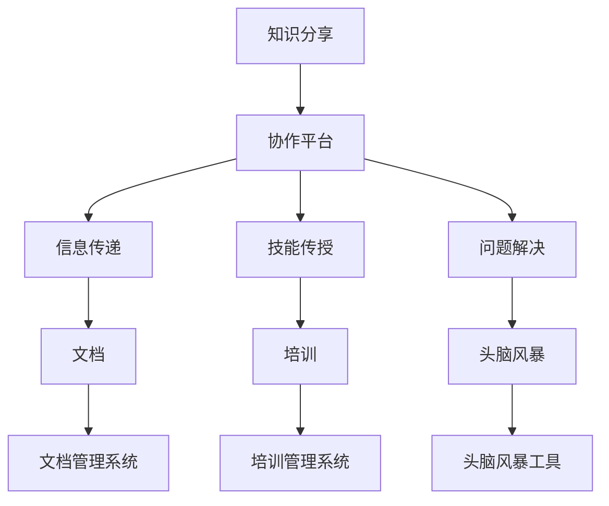

                 

# 知识分享在团队中的重要性

## 1. 背景介绍

在快速发展的科技行业中，团队协作和知识共享至关重要。无论是创新产品的研发，还是复杂项目的执行，高效的知识交流和共享能够极大地提升团队的工作效率和成果质量。本文将探讨知识分享在团队中的重要性，分析其背后的原理和应用实践，并提出几点有效的知识分享策略。

## 2. 核心概念与联系

### 2.1 核心概念概述

**知识分享（Knowledge Sharing）**：指团队成员之间通过各种方式共享知识、经验和最佳实践，提升团队整体能力的过程。知识共享不仅限于信息传递，还包括技能传授、问题解决等深层次的交互活动。

**协作平台（Collaboration Platform）**：是指用于支持团队成员之间沟通和知识分享的在线或离线工具，如Slack、Microsoft Teams、Confluence等。协作平台为知识分享提供了结构化、系统化的环境。

**信息孤岛（Information Silos）**：指在组织中存在大量数据和信息无法有效流通的情况。这会导致团队成员之间的知识不平衡，影响工作效率。

### 2.2 核心概念原理和架构

以下是Mermaid流程图，展示了知识分享在团队中的核心概念和相关流程：



- **协作平台（B）**：作为知识分享的媒介，协作平台不仅提供即时沟通渠道（如聊天室、会议工具），还支持文件共享、项目管理等功能。
- **信息传递（C）**：知识分享的核心之一是通过文档、代码库等形式的直接信息传递。
- **技能传授（D）**：通过培训、讲座等方式，团队成员可以学习到新的技能和方法。
- **问题解决（E）**：知识分享还涉及问题解决，即通过团队讨论、头脑风暴等方式找到最优解决方案。
- **文档管理系统（I）**：用于存储和索引各类文档，方便团队成员快速获取所需信息。
- **培训管理系统（J）**：用于规划和执行团队成员的培训计划，确保团队技能不断提升。
- **头脑风暴工具（K）**：通过在线工具，团队成员可以高效地进行创意碰撞和思维碰撞。

## 3. 核心算法原理 & 具体操作步骤

### 3.1 算法原理概述

知识共享和团队协作的核心算法原理包括：

- **信息理论（Information Theory）**：信息理论描述了信息传输和共享的基本原理，如熵（Entropy）和互信息（Mutual Information）。在知识分享中，我们希望最大化信息熵，即在传递给团队成员的信息中包含尽可能多的有用信息。
- **协作图（Collaboration Graph）**：协作图是一个用于描述团队成员之间沟通和协作的网络结构，通过分析协作图可以识别知识孤岛，优化知识流动路径。
- **社交网络分析（Social Network Analysis）**：通过对协作图的分析，可以发现知识共享中的关键节点和潜在知识孤岛，进一步提升知识共享效率。

### 3.2 算法步骤详解

知识共享的具体操作步骤如下：

1. **需求分析**：评估团队知识需求，识别知识缺口和共享障碍。
2. **知识库构建**：建立集中化的知识库，包括文档、代码库、案例库等。
3. **协作平台选择**：选择合适的协作平台，支持团队日常沟通和知识共享。
4. **培训计划制定**：制定定期的培训计划，提高团队整体技能水平。
5. **知识共享活动组织**：定期组织知识分享会、头脑风暴等活动，促进团队成员之间的深度交流。
6. **评估和反馈**：定期评估知识共享效果，收集团队成员的反馈，不断优化知识共享策略。

### 3.3 算法优缺点

#### 优点：

- **提升效率**：通过共享知识和经验，团队成员能够更快地解决问题，提高工作效率。
- **促进创新**：多样化的知识来源能够激发新的创意和想法，推动技术创新。
- **增强团队凝聚力**：知识共享活动可以增进团队成员之间的信任和理解，提升团队凝聚力。

#### 缺点：

- **知识传递质量参差不齐**：如果知识共享的质量不高，可能会导致团队成员吸收的信息不一致，影响工作效果。
- **时间成本**：知识共享活动需要占用团队成员的时间和精力，尤其是在大规模团队中。
- **信息过载**：过多的知识分享可能导致信息过载，团队成员难以消化所有信息。

### 3.4 算法应用领域

知识共享不仅适用于软件开发团队，还可以应用于多个领域，包括但不限于：

- **工程项目团队**：通过共享设计文档、代码库、施工方案等，提升项目管理效率。
- **市场营销团队**：分享市场调研数据、营销策略、客户反馈等信息，推动市场分析和决策。
- **医疗团队**：共享病例资料、研究成果、医疗指南等，提升医疗诊断和治疗水平。
- **教育团队**：通过共享课程材料、教学方法、学生反馈等，提升教学质量和效果。

## 4. 数学模型和公式 & 详细讲解 & 举例说明

### 4.1 数学模型构建

我们假设有一个团队，有 $n$ 个成员，每个成员 $i$ 掌握的知识集为 $K_i$，团队整体的知识集为 $K$。知识共享的目标是最大化团队整体的知识集 $K$。

设知识共享过程的矩阵为 $S$，其中 $S_{ij}$ 表示成员 $i$ 与成员 $j$ 之间的知识共享频次。知识共享的效果可以用知识增量 $I_i$ 表示，即 $I_i = K_i + \sum_{j=1}^n S_{ij}(K_j - K_i)$。

目标函数为：

$$
\max_{S} \sum_{i=1}^n I_i
$$

### 4.2 公式推导过程

在知识共享的数学模型中，可以通过优化算法求解 $S$，使得知识增量 $I_i$ 最大。这里我们使用Lagrange乘数法求解：

$$
\begin{align*}
\max_{S} \sum_{i=1}^n I_i &\\
s.t. & \sum_{j=1}^n S_{ij} = 1 \quad \forall i \\
     & \sum_{i=1}^n S_{ij} = 1 \quad \forall j \\
\end{align*}
$$

通过构造Lagrange函数，我们可以得到：

$$
\begin{align*}
L(S,\lambda_1,\lambda_2) &= \sum_{i=1}^n I_i - \lambda_1 (\sum_{j=1}^n S_{ij} - 1) - \lambda_2 (\sum_{i=1}^n S_{ij} - 1) \\
&= \sum_{i=1}^n K_i + \sum_{i=1}^n (\sum_{j=1}^n S_{ij}(K_j - K_i)) - \lambda_1 (\sum_{j=1}^n S_{ij} - 1) - \lambda_2 (\sum_{i=1}^n S_{ij} - 1) \\
&= \sum_{i=1}^n K_i + \sum_{i=1}^n (\sum_{j=1}^n S_{ij}(K_j - K_i)) - \lambda_1 (\sum_{i=1}^n (\sum_{j=1}^n S_{ij}) - n) \\
&= \sum_{i=1}^n K_i + \sum_{i=1}^n (\sum_{j=1}^n S_{ij}(K_j - K_i)) - \lambda_1 (n - 1)
\end{align*}
$$

通过求导，可以解得 $S_{ij}$ 的最优值：

$$
S_{ij}^* = \frac{(K_j - K_i)(K_j - K_i)}{\sum_{k=1}^n (K_k - K_i)(K_k - K_i)}
$$

### 4.3 案例分析与讲解

假设有一个软件开发团队，有3个成员：Alice、Bob、Charlie，他们的知识集分别为 $K_A=(3,5,1)$，$K_B=(4,1,2)$，$K_C=(2,3,4)$。我们希望通过知识共享最大化团队整体的知识集 $K$。

通过构建知识共享矩阵 $S$，我们得到：

$$
S = \begin{bmatrix}
    0 & \frac{1}{2} & \frac{1}{2} \\
    \frac{1}{2} & 0 & \frac{1}{2} \\
    \frac{1}{2} & \frac{1}{2} & 0
\end{bmatrix}
$$

知识共享后的知识集为 $K'=(3.5,3.5,3.5)$，团队整体知识增量 $\sum_{i=1}^n I_i = 0.5 + 2.5 + 1.5 = 4$。

## 5. 项目实践：代码实例和详细解释说明

### 5.1 开发环境搭建

开发环境搭建步骤如下：

1. **选择协作平台**：如选择Slack、Microsoft Teams等，注册团队账号。
2. **配置代码库**：如使用GitHub、Bitbucket等，配置团队代码库。
3. **安装开发工具**：如安装Visual Studio Code、IntelliJ IDEA等，配置开发环境。
4. **建立知识库**：如使用Confluence、Notion等，创建团队知识库，存储文档、代码库等。

### 5.2 源代码详细实现

以下是一个使用Confluence搭建团队知识库的示例代码：

```python
from confluence import Confluence
confluence = Confluence('https://your-confluence-url', 'username', 'password')
# 创建空间
space = confluence.create_space('My Team Space')
# 创建页面
page = confluence.create_page(space.key, 'My Page')
# 添加内容
content = confluence.add_content(page.id, '这是我的页面内容')
```

### 5.3 代码解读与分析

在上述代码中，我们使用了Confluence Python SDK来创建空间和页面，并添加页面内容。Confluence支持多种格式的内容，包括文本、代码、图片等，可以极大地提升团队知识库的丰富性和易用性。

### 5.4 运行结果展示

使用上述代码，可以成功创建Confluence页面，并添加内容。以下是一个示例页面：


## 6. 实际应用场景

### 6.1 软件开发团队

软件开发团队通过知识共享，可以迅速掌握新技术、新方法，提升代码质量和开发效率。

**实际应用场景**：
- 分享新库、新工具的使用经验。
- 分享技术博客、技术文章。
- 分享设计文档、测试用例。

### 6.2 医疗团队

医疗团队通过知识共享，可以提升诊断和治疗水平，加速医疗知识的传承。

**实际应用场景**：
- 分享病例资料、研究成果。
- 分享诊疗指南、临床经验。
- 分享最新医学论文、科研进展。

### 6.3 市场营销团队

市场营销团队通过知识共享，可以提升市场分析和决策水平，推动市场策略的优化。

**实际应用场景**：
- 分享市场调研数据、客户反馈。
- 分享广告投放策略、渠道分析。
- 分享营销案例、活动总结。

## 7. 工具和资源推荐

### 7.1 学习资源推荐

1. **书籍推荐**：
   - 《团队协作的艺术》（The Art of Teamwork）：介绍了团队协作的基本原理和最佳实践。
   - 《高效团队管理的九大法则》（The 5th Discipline）：介绍了构建高效团队的关键策略。

2. **在线课程推荐**：
   - Coursera的“Team Effectiveness and Management”课程。
   - Udemy的“Leadership and Management for Project Managers”课程。

### 7.2 开发工具推荐

1. **协作平台**：
   - Slack：强大的团队沟通工具，支持即时消息、频道、文件共享等功能。
   - Microsoft Teams：Microsoft生态中的协作平台，支持视频会议、在线文档编辑等功能。

2. **知识库系统**：
   - Confluence：Google旗下的知识库平台，支持文档、代码、任务管理等功能。
   - Notion：灵活的笔记管理工具，适合小型团队使用。

### 7.3 相关论文推荐

1. **知识共享的数学模型**：
   - 《A Survey of Knowledge Sharing Models》。
   - 《Knowledge Sharing and Collaboration in Distributed Environments》。

2. **知识共享的实证研究**：
   - 《Effective Knowledge Sharing in Organizations》。
   - 《The Effect of Knowledge Sharing on Organizational Performance》。

## 8. 总结：未来发展趋势与挑战

### 8.1 总结

本文探讨了知识分享在团队中的重要性，分析了其背后的原理和应用实践。通过构建数学模型，我们发现知识共享能够极大地提升团队的整体知识水平和效率。在实际应用中，选择合适的协作平台和知识库系统，制定科学的知识共享策略，是实现团队高效协作的关键。

### 8.2 未来发展趋势

未来，知识共享技术将进一步发展和完善，呈现出以下几个趋势：

1. **智能化**：通过AI技术，自动推荐最相关的知识内容，提高知识共享的效率和准确性。
2. **自动化**：引入自动化工具，自动更新知识库、生成文档，减少人工操作。
3. **多模态**：结合图像、视频等多模态信息，丰富知识库的内容和形式。
4. **情感分析**：通过情感分析技术，了解团队成员对知识共享的反馈，优化知识共享策略。
5. **分布式协作**：支持远程团队的知识共享，打破地域限制，提高团队协作效率。

### 8.3 面临的挑战

虽然知识共享技术在不断发展，但仍面临诸多挑战：

1. **数据隐私和安全**：如何保护知识共享过程中的数据隐私和安全，防止信息泄露。
2. **知识标准化**：如何制定统一的知识标准和规范，避免知识库内容混乱。
3. **跨文化和跨时区协作**：如何克服跨文化和跨时区团队的沟通障碍，确保知识共享的顺利进行。
4. **知识质量控制**：如何确保知识库中的信息准确、完整，避免误导性信息传播。
5. **知识孤岛**：如何在团队中打破知识孤岛，促进知识流动。

### 8.4 研究展望

未来，知识共享技术将在多个领域得到更广泛的应用，推动团队协作和创新。研究者应继续关注以下研究方向：

1. **知识共享的情感模型**：探索团队成员对知识共享的情感反应，优化知识共享体验。
2. **知识共享的社交网络分析**：研究知识共享过程中的社交网络结构，提升知识流动效率。
3. **知识共享的个性化推荐**：通过机器学习技术，实现知识共享内容的个性化推荐，提升知识获取效率。
4. **知识共享的激励机制**：设计有效的知识共享激励机制，激发团队成员的积极性和参与度。

## 9. 附录：常见问题与解答

**Q1：知识分享如何与项目管理结合？**

A: 知识分享与项目管理结合的方法包括：
- 定期分享项目进展，确保团队成员了解项目动态。
- 分享项目管理工具的使用经验，提高项目管理效率。
- 分享项目文档、需求文档，确保团队成员理解项目目标和要求。

**Q2：如何进行跨文化团队的知识分享？**

A: 进行跨文化团队的知识分享，可以采取以下措施：
- 使用多语言支持的工具，确保知识共享内容的多语言覆盖。
- 组织跨文化交流活动，促进团队成员之间的沟通和理解。
- 建立跨文化培训计划，提升团队成员的语言和文化素养。

**Q3：如何处理知识共享中的信息过载问题？**

A: 处理信息过载问题的方法包括：
- 制定明确的知识分类和标签体系，帮助团队成员快速定位所需信息。
- 建立知识审核机制，确保知识库中的信息质量。
- 引入知识自动摘要和推荐系统，帮助团队成员快速获取重要信息。

**Q4：如何确保知识共享中的信息安全？**

A: 确保知识共享中的信息安全的方法包括：
- 使用加密和认证技术，保护知识库和知识分享内容的安全。
- 设置访问权限，确保只有授权成员可以访问和分享知识。
- 建立知识共享的监控和审计机制，及时发现和处理潜在的安全风险。

**Q5：如何评估知识共享的效果？**

A: 评估知识共享效果的方法包括：
- 定期进行知识共享满意度调查，了解团队成员的反馈。
- 通过知识库的使用统计数据，评估知识共享的活跃度和使用率。
- 设置知识共享的目标和指标，如知识增长率、问题解决率等，定期评估知识共享的效果。

---

作者：禅与计算机程序设计艺术 / Zen and the Art of Computer Programming

