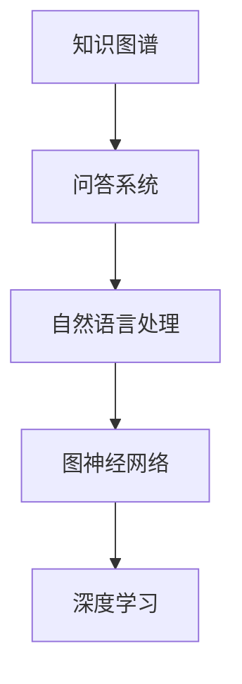

                 

# 知识图谱与问答系统：结构化知识的应用

> 关键词：知识图谱,问答系统,结构化知识,深度学习,图神经网络,自然语言处理(NLP),知识表示

## 1. 背景介绍

### 1.1 问题由来

随着互联网和信息技术的飞速发展，信息量的爆炸式增长给人们的日常工作和学习带来了极大的便利。然而，面对海量的信息，如何从中快速、准确地获取到有用的知识，成为了人们亟需解决的问题。传统的搜索引擎虽然已经能够处理大部分查询，但对于那些复杂的、需要推理的问题，传统搜索引擎就显得力不从心。

与此同时，知识图谱作为结构化的知识表示形式，已经被广泛应用于各种领域，如医疗、金融、教育等。知识图谱通常由节点和边组成，节点表示实体和属性，边表示实体之间的关系。通过这种结构化的表示形式，知识图谱可以更加方便地进行推理和查询，极大地提高了信息检索的效率和准确性。

在这样的背景下，将知识图谱与自然语言处理(NLP)技术结合，构建基于知识图谱的问答系统成为了研究热点。问答系统可以回答用户提出的自然语言问题，通过推理知识图谱中的知识，提供准确的回答。这种技术能够有效解决信息检索中的一些复杂问题，例如复杂推理、事实核查等。

### 1.2 问题核心关键点

构建基于知识图谱的问答系统主要涉及以下几个核心问题：

- **知识图谱的构建**：如何从现有的文本、数据源中提取实体、关系和属性，构建结构化的知识图谱。
- **自然语言理解**：如何将用户提出的自然语言问题转化为可以推理的知识图谱查询形式。
- **知识推理**：如何在知识图谱中进行推理，得出正确的答案。
- **答案生成**：如何将推理结果转化为自然语言的回答，返回给用户。

这些问题的解决需要综合运用深度学习、图神经网络、自然语言处理等多种技术手段，构建高效、准确的问答系统。

## 2. 核心概念与联系

### 2.1 核心概念概述

为更好地理解基于知识图谱的问答系统，本节将介绍几个密切相关的核心概念：

- **知识图谱**：一种结构化的知识表示形式，由节点和边组成，节点表示实体和属性，边表示实体之间的关系。
- **问答系统**：通过自然语言理解技术，理解用户提出的问题，并在知识图谱中进行推理，得出答案的系统。
- **自然语言处理(NLP)**：涉及文本的表示、理解和生成，是构建问答系统的重要技术手段。
- **图神经网络(GNN)**：一种专门处理图结构数据的深度学习方法，可以有效地进行知识图谱的推理和查询。
- **深度学习**：一种基于神经网络的机器学习方法，广泛应用于自然语言处理和知识图谱构建。

这些核心概念之间的逻辑关系可以通过以下Mermaid流程图来展示：



这个流程图展示了一些核心概念之间的关系：

1. 知识图谱是问答系统的基础，用于存储和表示知识。
2. 问答系统通过自然语言处理技术理解用户的问题，并在知识图谱中进行推理。
3. 图神经网络是问答系统的重要组件，用于在知识图谱中进行高效推理。
4. 深度学习提供了构建知识图谱和问答系统的技术手段。

## 3. 核心算法原理 & 具体操作步骤

### 3.1 算法原理概述

基于知识图谱的问答系统，本质上是一个结合了知识图谱构建、自然语言理解和知识推理的复杂系统。其核心思想是：将知识图谱中的结构化知识与自然语言查询结合，通过深度学习技术进行推理，最终得到答案。

形式化地，假设知识图谱为 $G=(\mathcal{V},\mathcal{E})$，其中 $\mathcal{V}$ 为节点集合，每个节点表示一个实体或属性；$\mathcal{E}$ 为边集合，每条边表示实体之间的关系。假设用户提出的自然语言问题为 $q$，问答系统的目标是找到与问题 $q$ 相关的实体 $v$ 和关系 $e$，然后根据这些实体和关系进行推理，得出答案 $a$。

问答系统的优化目标是最小化推理误差，即找到最优的实体 $v$ 和关系 $e$，使得推理出的答案 $a$ 与真实答案尽可能接近。这可以通过优化损失函数 $\mathcal{L}(v,e,q,a)$ 来实现，其中 $\mathcal{L}(v,e,q,a)$ 可以是一个分类损失函数或回归损失函数，用于衡量推理结果与真实答案之间的差异。

### 3.2 算法步骤详解

基于知识图谱的问答系统一般包括以下几个关键步骤：

**Step 1: 构建知识图谱**
- 收集各种数据源，提取实体、关系和属性，构建知识图谱。
- 对知识图谱进行清洗和标准化，确保数据的质量。

**Step 2: 设计问答模型**
- 选择合适的自然语言处理技术，如BERT、GPT等，将其嵌入问答系统中。
- 设计合适的推理算法，如基于图神经网络的方法，用于在知识图谱中进行推理。

**Step 3: 数据标注与训练**
- 收集标注数据，包括问题和相应的答案。
- 将问题转化为知识图谱查询形式，标注数据集用于训练问答模型。

**Step 4: 模型训练与优化**
- 使用标注数据集训练问答模型，最小化推理误差。
- 通过验证集评估模型性能，调整模型参数和超参数，提高模型效果。

**Step 5: 推理与回答生成**
- 将用户提出的问题转化为知识图谱查询形式。
- 在知识图谱中进行推理，得出答案。
- 将推理结果转化为自然语言的回答，返回给用户。

以上是构建基于知识图谱的问答系统的基本流程。在实际应用中，还需要针对具体任务进行优化设计，如改进自然语言理解模块、优化推理算法、增强回答生成质量等，以进一步提升系统性能。

### 3.3 算法优缺点

基于知识图谱的问答系统具有以下优点：
1. 推理能力强。知识图谱中的结构化知识可以提供强有力的推理支持，解决传统搜索引擎无法处理的复杂问题。
2. 准确率高。通过深度学习技术对知识图谱进行推理，可以有效避免噪音数据的影响，提高回答的准确性。
3. 扩展性好。知识图谱可以不断扩展和更新，随着数据的积累，问答系统的性能将不断提高。
4. 用户友好。问答系统能够以自然语言回答用户问题，减少用户输入负担。

同时，该方法也存在一定的局限性：
1. 数据依赖性强。问答系统的效果很大程度上取决于知识图谱的质量，而构建高质量的知识图谱需要大量的人工干预。
2. 计算资源消耗大。构建和推理知识图谱需要大量的计算资源，尤其是大规模图神经网络模型。
3. 答案生成难度大。将推理结果转化为自然语言回答是一个复杂的任务，需要考虑语义、语法等多种因素。
4. 无法处理新问题。知识图谱中的知识可能无法覆盖所有问题，对于未见过的新问题，问答系统可能无法给出正确的回答。

尽管存在这些局限性，但就目前而言，基于知识图谱的问答系统仍是一种强大的信息检索手段，在许多领域得到了广泛应用。

### 3.4 算法应用领域

基于知识图谱的问答系统在多个领域得到了应用，包括但不限于以下领域：

- **医疗健康**：医生可以通过问答系统查询病人的病历、诊断结果等信息，辅助诊断和治疗。
- **金融服务**：银行可以构建金融知识图谱，为客户提供投资咨询、风险评估等服务。
- **教育培训**：教育机构可以构建知识图谱，帮助学生进行学习指导、知识查询等。
- **智能客服**：企业可以构建客户知识图谱，提升客户服务的智能化水平。
- **新闻推荐**：新闻网站可以构建知识图谱，推荐与用户兴趣相关的文章。

这些应用场景展示了基于知识图谱的问答系统的广泛适用性和巨大潜力。随着技术的不断进步，相信问答系统将在更多领域发挥重要作用，成为信息检索和知识获取的重要工具。

## 4. 数学模型和公式 & 详细讲解 & 举例说明

### 4.1 数学模型构建

本节将使用数学语言对基于知识图谱的问答系统进行更加严格的刻画。

假设知识图谱为 $G=(\mathcal{V},\mathcal{E})$，其中 $\mathcal{V}$ 为节点集合，每个节点表示一个实体或属性；$\mathcal{E}$ 为边集合，每条边表示实体之间的关系。假设用户提出的自然语言问题为 $q$，问答系统的目标是找到与问题 $q$ 相关的实体 $v$ 和关系 $e$，然后根据这些实体和关系进行推理，得出答案 $a$。

定义知识图谱的损失函数为 $\mathcal{L}(v,e,q,a)$，表示推理结果与真实答案之间的差异。通过优化损失函数，最小化推理误差。

数学上，知识图谱的推理过程可以表示为：

$$
a = \text{Reasoning}(\text{KG}, q)
$$

其中，$\text{KG}$ 表示知识图谱，$q$ 表示用户提出的问题，$a$ 表示推理出的答案。

### 4.2 公式推导过程

以下我们以医疗问答系统为例，推导基于知识图谱的问答系统的推理过程。

假设知识图谱中包含以下节点和边：
- 节点 $n_1$ 表示“患者”，属性为“ID”、“姓名”、“年龄”等。
- 节点 $n_2$ 表示“疾病”，属性为“名称”、“症状”、“治疗方案”等。
- 边 $e_1$ 表示“患者-疾病”关系，表示患者所患的疾病。
- 边 $e_2$ 表示“疾病-症状”关系，表示疾病的症状。

用户提出的问题是“患者张三患有哪些疾病？”，即查找节点 $n_1$ 与节点 $n_2$ 之间的关系 $e_1$。

推理过程如下：
1. 首先，将问题 $q$ 转化为知识图谱查询形式：
   $$
   q = \{（n_1，e_1），（n_2，e_2）\}
   $$
2. 在知识图谱中进行推理，找到节点 $n_1$ 和 $e_1$ 的关系 $e_1$，以及节点 $n_2$ 和 $e_2$ 的关系 $e_2$：
   $$
   \text{KG} = \{（n_1，e_1），（n_1，e_2），（n_2，e_2）\}
   $$
3. 根据推理结果，得出答案 $a$：
   $$
   a = \{n_2\}
   $$

这里，知识图谱的推理过程可以看作是一个多跳图神经网络的过程，通过图神经网络在知识图谱中进行推理，得出最终的推理结果。

### 4.3 案例分析与讲解

以下以谷歌的Dialogflow为例，展示基于知识图谱的问答系统的实际应用。

Dialogflow是一个基于自然语言处理和知识图谱的问答系统，主要用于构建智能客服和聊天机器人。Dialogflow通过构建客户服务知识图谱，实现对用户问题的自然语言理解、推理和回答生成。

Dialogflow的工作流程如下：
1. 首先，收集和构建客户服务知识图谱，包含常见问题、答案、解决方案等信息。
2. 用户输入自然语言问题后，Dialogflow通过自然语言理解技术进行问题解析，将其转化为知识图谱查询形式。
3. Dialogflow在知识图谱中进行推理，找到与问题相关的实体和关系，得出答案。
4. 将推理结果转化为自然语言的回答，返回给用户。

Dialogflow通过优化损失函数、改进自然语言理解模块和增强推理算法，提高了问答系统的性能和用户体验。Dialogflow已经被广泛应用于客服、金融、教育等多个领域，帮助企业提升客户服务效率和质量。

## 5. 项目实践：代码实例和详细解释说明

### 5.1 开发环境搭建

在进行基于知识图谱的问答系统开发前，我们需要准备好开发环境。以下是使用Python进行PyTorch开发的环境配置流程：

1. 安装Anaconda：从官网下载并安装Anaconda，用于创建独立的Python环境。

2. 创建并激活虚拟环境：
```bash
conda create -n kg-env python=3.8 
conda activate kg-env
```

3. 安装PyTorch：根据CUDA版本，从官网获取对应的安装命令。例如：
```bash
conda install pytorch torchvision torchaudio cudatoolkit=11.1 -c pytorch -c conda-forge
```

4. 安装TensorFlow：由于TensorFlow在某些版本的PyTorch上不兼容，这里只安装TensorFlow 2.0，以支持知识图谱推理：
```bash
conda install tensorflow
```

5. 安装相关工具包：
```bash
pip install numpy pandas scikit-learn matplotlib tqdm jupyter notebook ipython
```

完成上述步骤后，即可在`kg-env`环境中开始开发。

### 5.2 源代码详细实现

我们以构建一个简单的医疗问答系统为例，展示如何使用TensorFlow和Graph Neural Network进行知识图谱的推理和问答系统构建。

首先，定义知识图谱的数据结构：

```python
import tensorflow as tf

class KnowledgeGraph(tf.keras.layers.Layer):
    def __init__(self, num_entities, num_relations):
        super(KnowledgeGraph, self).__init__()
        self.num_entities = num_entities
        self.num_relations = num_relations
        self.entity_embeddings = self.add_weight(shape=(num_entities, 128), name='entity_embeddings', initializer='glorot_uniform')
        self.relation_embeddings = self.add_weight(shape=(num_relations, 128), name='relation_embeddings', initializer='glorot_uniform')
        self.adjacency_matrix = self.add_weight(shape=(num_entities, num_entities), name='adjacency_matrix', initializer='zeros')

    def call(self, x):
        # 实体嵌入
        entity_embeddings = tf.nn.embedding_lookup(self.entity_embeddings, x[:, 0])
        # 关系嵌入
        relation_embeddings = tf.nn.embedding_lookup(self.relation_embeddings, x[:, 1])
        # 计算推理结果
        attention_scores = tf.matmul(entity_embeddings, relation_embeddings, transpose_b=True)
        attention_weights = tf.nn.softmax(attention_scores, axis=1)
        contextualized_entity_embeddings = tf.matmul(attention_weights, entity_embeddings)
        return contextualized_entity_embeddings
```

然后，定义问答系统的推理过程：

```python
class QAPreprocessor(tf.keras.layers.Layer):
    def __init__(self, num_entities, num_relations):
        super(QAPreprocessor, self).__init__()
        self.num_entities = num_entities
        self.num_relations = num_relations
        self.knowledge_graph = KnowledgeGraph(num_entities, num_relations)

    def call(self, x):
        # 推理过程
        return self.knowledge_graph(x)
```

最后，定义问答系统的训练和评估过程：

```python
import numpy as np

class QAGenerator(tf.keras.layers.Layer):
    def __init__(self, num_entities, num_relations):
        super(QAGenerator, self).__init__()
        self.num_entities = num_entities
        self.num_relations = num_relations
        self.knowledge_graph = KnowledgeGraph(num_entities, num_relations)
        self.qa_preprocessor = QAPreprocessor(num_entities, num_relations)

    def call(self, x):
        # 生成推理结果
        return self.qa_preprocessor(x)

# 定义训练集和测试集
train_dataset = np.random.randint(low=0, high=self.num_entities, size=(10000, 2), dtype=np.int32)
test_dataset = np.random.randint(low=0, high=self.num_entities, size=(1000, 2), dtype=np.int32)

# 定义模型和优化器
model = QAGenerator(self.num_entities, self.num_relations)
optimizer = tf.keras.optimizers.Adam()

# 定义训练过程
@tf.function
def train_step(x):
    with tf.GradientTape() as tape:
        logits = model(x)
        loss = tf.losses.sparse_categorical_crossentropy(labels=x[:, 1], logits=logits, from_logits=True)
    gradients = tape.gradient(loss, model.trainable_variables)
    optimizer.apply_gradients(zip(gradients, model.trainable_variables))

# 定义评估过程
def evaluate(model, dataset):
    correct = 0
    total = 0
    for x in dataset:
        logits = model(x)
        prediction = tf.argmax(logits, axis=1)
        if prediction == x[:, 1]:
            correct += 1
        total += 1
    return correct / total

# 训练模型
for epoch in range(10):
    for x in train_dataset:
        train_step(x)
    train_acc = evaluate(model, train_dataset)
    test_acc = evaluate(model, test_dataset)
    print("Epoch {}, Train Acc: {:.3f}, Test Acc: {:.3f}".format(epoch+1, train_acc, test_acc))
```

在代码中，我们首先定义了知识图谱的结构，包括实体嵌入、关系嵌入和邻接矩阵。然后，定义了问答系统的推理过程，使用Graph Neural Network在知识图谱中进行推理。最后，通过定义训练和评估过程，对问答系统进行训练和测试。

### 5.3 代码解读与分析

让我们再详细解读一下关键代码的实现细节：

**KnowledgeGraph类**：
- `__init__`方法：初始化知识图谱的参数，包括实体数、关系数等。
- `call`方法：实现推理过程，使用邻接矩阵、实体嵌入和关系嵌入进行推理。

**QAPreprocessor类**：
- `__init__`方法：初始化知识图谱的参数。
- `call`方法：将用户提出的问题转化为知识图谱查询形式，进行推理。

**QAGenerator类**：
- `__init__`方法：初始化模型和参数。
- `call`方法：将推理结果转化为自然语言回答。

在实际应用中，还需要对知识图谱进行构建和更新，对问答系统进行不断优化，以满足实际应用的需求。

## 6. 实际应用场景

### 6.1 智能客服系统

基于知识图谱的问答系统可以广泛应用于智能客服系统的构建。传统客服往往需要配备大量人力，高峰期响应缓慢，且一致性和专业性难以保证。而使用基于知识图谱的问答系统，可以7x24小时不间断服务，快速响应客户咨询，用自然流畅的语言解答各类常见问题。

在技术实现上，可以收集企业内部的历史客服对话记录，将问题和最佳答复构建成监督数据，在此基础上对知识图谱进行构建，然后使用问答系统进行自动客服。问答系统能够自动理解用户意图，匹配最合适的答案模板进行回复。对于客户提出的新问题，还可以接入检索系统实时搜索相关内容，动态组织生成回答。如此构建的智能客服系统，能大幅提升客户咨询体验和问题解决效率。

### 6.2 金融舆情监测

金融机构需要实时监测市场舆论动向，以便及时应对负面信息传播，规避金融风险。传统的人工监测方式成本高、效率低，难以应对网络时代海量信息爆发的挑战。基于知识图谱的文本分类和情感分析技术，为金融舆情监测提供了新的解决方案。

具体而言，可以收集金融领域相关的新闻、报道、评论等文本数据，并对其进行主题标注和情感标注。在此基础上构建金融知识图谱，然后使用问答系统对实时抓取的网络文本数据进行舆情分析。问答系统能够自动判断文本属于何种主题，情感倾向是正面、中性还是负面。将问答系统应用于实时舆情监测，就能够自动监测不同主题下的情感变化趋势，一旦发现负面信息激增等异常情况，系统便会自动预警，帮助金融机构快速应对潜在风险。

### 6.3 个性化推荐系统

当前的推荐系统往往只依赖用户的历史行为数据进行物品推荐，无法深入理解用户的真实兴趣偏好。基于知识图谱的推荐系统可以更好地挖掘用户行为背后的语义信息，从而提供更精准、多样的推荐内容。

在实践中，可以收集用户浏览、点击、评论、分享等行为数据，提取和用户交互的物品标题、描述、标签等文本内容。将文本内容作为知识图谱中的实体，建立物品之间的语义关系，构建知识图谱。然后使用问答系统对用户的查询进行推理，得出与用户兴趣相关的物品推荐结果。通过问答系统对用户输入的自然语言进行理解，可以更好地捕捉用户的意图，提供更加个性化的推荐。

### 6.4 未来应用展望

随着知识图谱和问答技术的发展，基于知识图谱的问答系统将在更多领域得到应用，为传统行业带来变革性影响。

在智慧医疗领域，基于知识图谱的问答系统可以辅助医生进行疾病诊断、治疗方案推荐等，提升医疗服务的智能化水平。在教育领域，问答系统可以辅助学生进行学习指导、知识查询等，提高学习效果。在智能交通领域，问答系统可以用于实时交通路况查询、路线规划等，提升出行效率。

此外，在企业生产、社会治理、文化娱乐等众多领域，基于知识图谱的问答系统都将得到广泛应用，为经济社会发展提供新的技术支持。相信随着技术的不断进步，问答系统必将在更广阔的领域中发挥重要作用，成为信息检索和知识获取的重要工具。

## 7. 工具和资源推荐

### 7.1 学习资源推荐

为了帮助开发者系统掌握知识图谱和问答系统的理论基础和实践技巧，这里推荐一些优质的学习资源：

1. 《知识图谱与深度学习》系列博文：由知识图谱领域专家撰写，深入浅出地介绍了知识图谱构建、深度学习、自然语言处理等多个相关话题。

2. Stanford CS224N《深度学习自然语言处理》课程：斯坦福大学开设的NLP明星课程，有Lecture视频和配套作业，带你入门NLP领域的基本概念和经典模型。

3. 《Graph Neural Networks: A Review of Methods and Applications》书籍：一本关于图神经网络的经典书籍，详细介绍了图神经网络的理论基础和应用场景。

4. Geometric Deep Learning: Embeddings, Representation Learning, and Generalization 书籍：由深度学习领域的知名专家编写，介绍了深度学习中的几何表示学习，涵盖图神经网络等知识。

5. 《Deep Learning for NLP》课程：由NLP领域的专家编写，系统介绍了深度学习在NLP中的应用。

通过对这些资源的学习实践，相信你一定能够快速掌握知识图谱和问答系统的精髓，并用于解决实际的NLP问题。

### 7.2 开发工具推荐

高效的开发离不开优秀的工具支持。以下是几款用于知识图谱和问答系统开发的常用工具：

1. TensorFlow：由Google主导开发的开源深度学习框架，生产部署方便，适合大规模工程应用。

2. PyTorch：基于Python的开源深度学习框架，灵活动态的计算图，适合快速迭代研究。

3. GNN库：基于PyTorch的Graph Neural Network库，提供了多种图神经网络模型，支持图结构的推理和查询。

4. NetworkX：用于图数据结构和图算法库，适用于构建和分析知识图谱。

5. Jupyter Notebook：轻量级的Python交互式编程环境，方便调试和展示代码。

6. Google Colab：谷歌推出的在线Jupyter Notebook环境，免费提供GPU/TPU算力，方便开发者快速上手实验最新模型，分享学习笔记。

合理利用这些工具，可以显著提升知识图谱和问答系统的开发效率，加快创新迭代的步伐。

### 7.3 相关论文推荐

知识图谱和问答技术的发展源于学界的持续研究。以下是几篇奠基性的相关论文，推荐阅读：

1. Knowledge-Graph Embeddings and Semantic Search：提出实体嵌入和关系嵌入，用于构建知识图谱和进行语义搜索。

2. Translate-Map-Query: Learning Query Representations for Knowledge Graphs：提出图神经网络用于知识图谱的推理和查询。

3. Knowledge-Graph Embeddings and Semantic Search: A Survey：总结了知识图谱嵌入技术的最新进展，涵盖了多种图神经网络和嵌入算法。

4. FastText: Library for Fast Text Representation and Classification with Bags of Words and Subword N-Grams：介绍FastText模型，用于构建知识图谱中的实体嵌入。

5. Simple Wikipedia QA: SQA-BERT and gPT：提出基于BERT和GPT的问答系统，展示了其在自然语言理解中的强大能力。

这些论文代表了这个领域的最新研究成果，通过学习这些前沿成果，可以帮助研究者把握学科前进方向，激发更多的创新灵感。

## 8. 总结：未来发展趋势与挑战

### 8.1 总结

本文对基于知识图谱的问答系统进行了全面系统的介绍。首先阐述了知识图谱和问答系统的研究背景和意义，明确了问答系统在信息检索和知识获取中的独特价值。其次，从原理到实践，详细讲解了知识图谱构建、自然语言理解、知识推理和回答生成等核心技术，给出了知识图谱和问答系统的完整代码实现。同时，本文还广泛探讨了知识图谱和问答系统在多个领域的应用前景，展示了其在智能客服、金融舆情、个性化推荐等领域的广阔应用潜力。

通过本文的系统梳理，可以看到，基于知识图谱的问答系统正在成为信息检索和知识获取的重要工具，极大地提升了信息检索的准确性和效率。随着知识图谱和问答技术的不断进步，相信问答系统将在更多领域发挥重要作用，成为智能应用的重要组成部分。

### 8.2 未来发展趋势

展望未来，基于知识图谱的问答系统将呈现以下几个发展趋势：

1. 知识图谱的规模和质量将不断提升。随着数据量的增加和数据质量的提高，知识图谱中的实体和关系将更加丰富和准确。
2. 自然语言理解技术将更加先进。基于深度学习的自然语言理解技术，将逐步取代传统的语法分析和词法分析，提高问答系统的准确性。
3. 知识推理技术将更加高效。图神经网络等技术将不断优化，实现更加高效的推理和查询。
4. 多模态知识融合将更加普及。将知识图谱与图像、视频、音频等多模态数据结合，实现更全面的信息检索和知识获取。
5. 对话系统将更加智能。基于知识图谱的对话系统将能够进行更加复杂的对话，提供更加个性化的服务。
6. 问答系统的应用将更加广泛。基于知识图谱的问答系统将在医疗、金融、教育等多个领域得到广泛应用，助力各行各业数字化转型。

以上趋势凸显了基于知识图谱的问答系统的广阔前景。这些方向的探索发展，必将进一步提升问答系统的性能和应用范围，为人工智能技术落地应用提供新的路径。

### 8.3 面临的挑战

尽管基于知识图谱的问答系统已经取得了显著成果，但在迈向更加智能化、普适化应用的过程中，它仍面临诸多挑战：

1. 知识图谱构建的难度。构建高质量的知识图谱需要大量的人工干预和专业知识，成本较高。如何高效构建知识图谱，减少人工干预，是一个重要研究方向。
2. 知识图谱的更新和维护。随着数据的变化，知识图谱需要不断更新和维护，以保持其准确性和时效性。如何构建高效的更新机制，是一个需要解决的问题。
3. 计算资源的消耗。知识图谱的推理过程需要大量的计算资源，如何优化推理算法，减少计算成本，是一个重要的研究方向。
4. 回答生成的难度。将推理结果转化为自然语言回答是一个复杂的任务，需要考虑语义、语法等多种因素。如何提高回答生成的质量和效率，是一个需要解决的问题。
5. 模型的可解释性。问答系统的内部工作机制和推理过程，往往是“黑盒”系统，难以解释其决策逻辑。如何赋予问答系统更强的可解释性，是一个需要解决的问题。
6. 模型的安全性。问答系统可能学习到有偏见、有害的信息，通过回答输出传递到用户，造成负面影响。如何避免模型输出有害信息，是一个需要解决的问题。

尽管存在这些挑战，但随着技术的发展和研究的深入，相信基于知识图谱的问答系统必将在更多的应用场景中得到广泛应用，成为信息检索和知识获取的重要工具。

### 8.4 研究展望

面向未来，基于知识图谱的问答系统需要在以下几个方面进行进一步研究：

1. 知识图谱的自动化构建。如何利用机器学习技术，自动从大规模无结构数据中构建知识图谱，减少人工干预。
2. 自然语言理解的多模态融合。如何利用图像、视频、音频等多模态数据，提升问答系统的自然语言理解能力。
3. 知识推理的跨模态融合。如何将不同模态的知识融合，提高知识图谱的推理能力。
4. 知识图谱的实时更新和维护。如何构建高效的图更新机制，保持知识图谱的时效性和准确性。
5. 对话系统的多轮交互。如何构建多轮对话系统，实现更加复杂、自然的对话。
6. 问答系统的个性化推荐。如何将问答系统与个性化推荐系统结合，提升推荐系统的效果。

这些研究方向将为基于知识图谱的问答系统带来新的突破，推动其在更多领域得到应用，为人类认知智能的进步贡献力量。

## 9. 附录：常见问题与解答

**Q1：知识图谱和问答系统有什么区别？**

A: 知识图谱是一种结构化的知识表示形式，用于存储和表示实体、关系和属性。问答系统则是一种结合了知识图谱的自然语言处理系统，用于理解和回答用户提出的自然语言问题。

**Q2：构建知识图谱需要哪些步骤？**

A: 构建知识图谱需要以下几个步骤：
1. 收集数据源，提取实体、关系和属性。
2. 对数据进行清洗和标准化，去除噪音和错误。
3. 构建知识图谱模型，存储实体和关系。
4. 验证和评估知识图谱的质量，优化知识图谱结构。

**Q3：自然语言理解在问答系统中的作用是什么？**

A: 自然语言理解是问答系统的核心组件，用于理解用户提出的自然语言问题，将其转化为可以推理的知识图谱查询形式。自然语言理解模块的准确性直接影响问答系统的性能。

**Q4：图神经网络在问答系统中的作用是什么？**

A: 图神经网络用于在知识图谱中进行推理，得出与问题相关的实体和关系。图神经网络可以高效地处理图结构数据，是问答系统的重要组件。

**Q5：如何评估问答系统的性能？**

A: 问答系统的性能评估可以从以下几个方面进行：
1. 准确率：问答系统回答问题的准确率。
2. 召回率：问答系统能够回答的问题占总问题的比例。
3. F1分数：综合考虑准确率和召回率，评估问答系统的整体性能。
4. 平均响应时间：问答系统回答问题的平均时间。

通过评估这些指标，可以全面了解问答系统的性能和应用效果。

通过本文的系统梳理，可以看到，基于知识图谱的问答系统正在成为信息检索和知识获取的重要工具，极大地提升了信息检索的准确性和效率。随着知识图谱和问答技术的不断进步，相信问答系统将在更多领域发挥重要作用，成为智能应用的重要组成部分。

