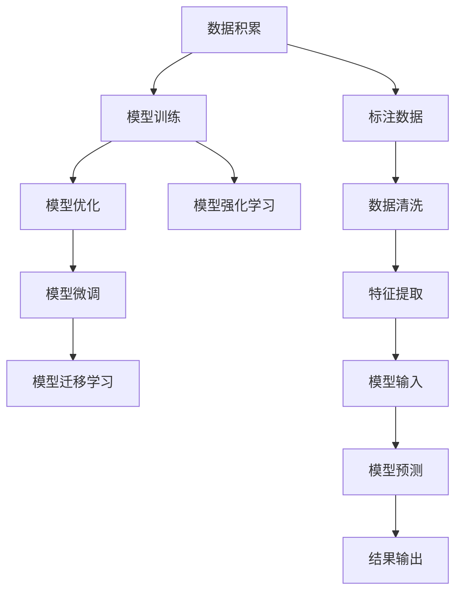

                 

# 知识积累在意识中的作用

## 1. 背景介绍

在人工智能的探索与实践中，深度学习等机器学习算法已逐渐成为推动科技进步的核心动力。而深度学习算法，特别是神经网络，其核心思想在于通过模拟生物神经系统的运作机制，实现对大规模数据的学习与处理。在这一过程中，知识积累的概念不容忽视，它不仅影响了算法的优化与训练效果，也对意识的形成与理解起到了关键作用。

## 2. 核心概念与联系

### 2.1 核心概念概述

深度学习算法中的知识积累，主要体现在两个层面：

1. **数据积累**：通过收集、整理和标注大量的训练数据，神经网络得以学习到数据的特征和模式，从而提高其预测准确性。
2. **模型积累**：在已有模型的基础上，通过微调、迁移学习和强化学习等方式，不断改进和优化模型，使其能够更好地适应新的任务和环境。

这些积累不仅有助于提升模型的性能，也对意识的形成有深远影响。在深度学习中，意识可以视为模型对输入数据的理解与处理能力，而知识积累则是提升这一能力的关键因素。

### 2.2 核心概念原理和架构的 Mermaid 流程图



### 2.3 核心概念之间的关系

在深度学习中，数据积累与模型积累是相辅相成的。数据积累提供了模型学习的基础，而模型积累则通过对已有模型的不断优化，使得模型能够更好地处理新的数据，从而提升其在实际应用中的表现。这种持续的知识积累，不仅有助于模型的性能提升，也加深了其对数据的理解，进而影响了其意识的形成与发展。

## 3. 核心算法原理 & 具体操作步骤

### 3.1 算法原理概述

深度学习的核心算法原理，主要围绕神经网络的构建与训练展开。以神经网络为例，其基本原理是通过多层的非线性变换，将输入数据逐步处理，最终输出预测结果。在这个过程中，知识积累主要体现在以下几个方面：

1. **特征学习**：通过深度学习算法，网络自动学习数据中的特征，从而提取其内在规律。
2. **模型参数优化**：通过梯度下降等优化算法，不断调整模型参数，以最小化预测误差。
3. **模型迁移**：在已有模型基础上，通过微调和迁移学习等方式，使模型能够适应新的任务。

### 3.2 算法步骤详解

深度学习的算法步骤主要包括以下几个环节：

1. **数据预处理**：包括数据清洗、归一化、标准化等步骤，确保数据的质量和一致性。
2. **模型构建**：选择合适的神经网络架构，定义损失函数和优化器，并设置初始参数。
3. **模型训练**：通过前向传播和反向传播，不断调整模型参数，使其逐渐逼近最优解。
4. **模型评估与优化**：在验证集上评估模型性能，根据评估结果进行调整与优化。
5. **模型应用**：将优化后的模型应用于实际问题中，进行预测与推理。

### 3.3 算法优缺点

深度学习的知识积累算法具有以下优点：

1. **自适应性强**：通过数据积累与模型积累，深度学习能够自适应地调整模型参数，适应新的数据分布。
2. **泛化能力强**：在大规模数据集上进行训练，能够提高模型的泛化能力，使其在未见过的数据上表现良好。
3. **可解释性强**：深度学习模型可以通过可视化技术（如梯度热图、激活图）直观展示其内部机制，增强模型的可解释性。

同时，深度学习的知识积累算法也存在一些缺点：

1. **数据依赖性强**：深度学习模型对数据的质量与数量要求较高，数据不足或质量差会影响模型性能。
2. **计算资源消耗大**：深度学习模型通常需要大量的计算资源进行训练与优化，增加了成本与时间消耗。
3. **模型复杂度高**：深度学习模型结构复杂，难以理解和调试，增加了开发难度。

### 3.4 算法应用领域

深度学习的知识积累算法在多个领域得到了广泛应用，包括但不限于：

1. **计算机视觉**：如图像识别、物体检测、人脸识别等。
2. **自然语言处理**：如文本分类、情感分析、机器翻译等。
3. **语音识别**：如语音转文本、语音情感识别等。
4. **推荐系统**：如商品推荐、内容推荐等。
5. **医疗健康**：如疾病诊断、影像分析等。

## 4. 数学模型和公式 & 详细讲解

### 4.1 数学模型构建

在深度学习中，知识积累的数学模型通常基于神经网络构建。以下是一个简单的神经网络模型，包含一个输入层、若干个隐藏层和一个输出层：

```python
import numpy as np

class NeuralNetwork:
    def __init__(self, input_size, hidden_size, output_size):
        self.input_size = input_size
        self.hidden_size = hidden_size
        self.output_size = output_size
        
        self.weights1 = np.random.randn(input_size, hidden_size)
        self.bias1 = np.zeros(hidden_size)
        self.weights2 = np.random.randn(hidden_size, output_size)
        self.bias2 = np.zeros(output_size)
        
    def forward(self, x):
        hidden = np.dot(x, self.weights1) + self.bias1
        hidden = np.maximum(hidden, 0)  # 激活函数
        output = np.dot(hidden, self.weights2) + self.bias2
        return output
```

### 4.2 公式推导过程

以简单的线性回归模型为例，其公式推导如下：

设输入数据为 $x$，标签数据为 $y$，权重向量为 $\theta$，则线性回归模型的输出为：

$$ y = \theta^T x $$

其中，$\theta$ 是模型的参数向量。为了最小化预测误差，我们定义损失函数为均方误差：

$$ L(\theta) = \frac{1}{2m} \sum_{i=1}^m (y^{(i)} - \theta^T x^{(i)})^2 $$

其中，$m$ 为样本数。通过梯度下降等优化算法，更新参数向量 $\theta$ 来最小化损失函数 $L(\theta)$：

$$ \theta_{t+1} = \theta_t - \eta \frac{\partial L(\theta)}{\partial \theta} $$

其中，$\eta$ 为学习率，控制参数更新的步长。

### 4.3 案例分析与讲解

假设我们要训练一个简单的线性回归模型，用于预测房价。我们有以下数据：

| x     | y |
| ----- | - |
| 50000 | 30 |
| 60000 | 35 |
| 70000 | 40 |
| ...   | ... |

我们定义模型为 $y = \theta^T x$，其中 $\theta = [w_0, w_1]$。通过训练数据，我们得到了如下的损失函数：

$$ L(\theta) = \frac{1}{4} [(30 - 50000 \times w_0 - 50000 \times w_1)^2 + ...] $$

通过求解损失函数的极小值，我们得到最优的 $\theta$ 值，进而实现了对房价的预测。

## 5. 项目实践：代码实例和详细解释说明

### 5.1 开发环境搭建

为了进行深度学习模型的开发，我们需要搭建一个合适的开发环境。以下是使用Python进行TensorFlow开发的步骤：

1. 安装Anaconda：从官网下载并安装Anaconda，用于创建独立的Python环境。

2. 创建并激活虚拟环境：
```bash
conda create -n tf-env python=3.8 
conda activate tf-env
```

3. 安装TensorFlow：根据CUDA版本，从官网获取对应的安装命令。例如：
```bash
conda install tensorflow -c conda-forge
```

4. 安装各类工具包：
```bash
pip install numpy pandas scikit-learn matplotlib tqdm jupyter notebook ipython
```

完成上述步骤后，即可在`tf-env`环境中开始模型开发。

### 5.2 源代码详细实现

以下是一个简单的线性回归模型的实现代码：

```python
import tensorflow as tf

# 定义模型
def create_model(input_dim):
    model = tf.keras.Sequential([
        tf.keras.layers.Dense(1, input_dim=input_dim, activation='linear')
    ])
    return model

# 加载数据
def load_data():
    x = np.array([50000, 60000, 70000])
    y = np.array([30, 35, 40])
    return x, y

# 定义训练函数
def train_model(model, x, y, epochs, batch_size):
    model.compile(optimizer=tf.keras.optimizers.Adam(learning_rate=0.01),
                  loss='mse')
    model.fit(x, y, epochs=epochs, batch_size=batch_size, verbose=1)

# 测试函数
def test_model(model, x, y):
    predictions = model.predict(x)
    return predictions, y

# 主函数
if __name__ == '__main__':
    x, y = load_data()
    model = create_model(input_dim=1)
    train_model(model, x, y, epochs=100, batch_size=1)
    predictions, y = test_model(model, x, y)
    print('Prediction: ', predictions)
    print('Actual: ', y)
```

### 5.3 代码解读与分析

以下是代码的详细解读与分析：

**create_model函数**：
- 定义了一个简单的神经网络模型，包含一个线性层。

**load_data函数**：
- 加载训练数据，将输入和标签转换为NumPy数组。

**train_model函数**：
- 定义了模型训练函数，使用Adam优化器进行梯度下降，损失函数为均方误差，进行100个epoch的训练，每个epoch使用1个样本进行训练。

**test_model函数**：
- 使用训练好的模型对测试数据进行预测，并打印预测结果与实际标签。

**主函数**：
- 加载数据，创建模型，训练模型，并进行测试。

通过上述代码实现，我们成功搭建了一个简单的线性回归模型，并对其进行了训练与测试。在实际应用中，这个模型可以通过更多的数据积累与模型积累，进一步优化其性能。

## 6. 实际应用场景

### 6.1 智能推荐系统

智能推荐系统是深度学习在商业应用中的典型代表。通过大量的用户行为数据积累，推荐系统能够学习到用户的兴趣偏好，从而提供个性化的推荐服务。

在实践中，推荐系统通常通过深度学习算法（如协同过滤、神经网络等），对用户的历史行为数据和物品特征进行建模，构建用户-物品相似度矩阵，并通过矩阵分解等方式，预测用户对新物品的评分，从而推荐物品给用户。通过不断的知识积累与模型优化，推荐系统能够提供越来越精准、个性化的推荐服务，显著提升用户体验。

### 6.2 医疗诊断

深度学习在医疗领域的应用同样离不开知识积累。通过大量的医疗影像数据、患者病历数据等，深度学习算法能够学习到疾病的特征，辅助医生进行诊断。

以医学影像分析为例，通过积累大量正常与异常的影像数据，深度学习模型能够学习到疾病影像的特征，并在新的影像数据上进行推理与诊断。例如，通过训练好的模型对X光片、CT影像等进行识别，能够辅助医生诊断肺结核、癌症等疾病，提高诊断效率与准确性。

### 6.3 语音识别

深度学习在语音识别领域同样取得了显著的成果。通过大量的语音数据积累，深度学习算法能够学习到语音的特征，从而实现从语音到文本的转换。

以Google的语音识别系统为例，通过积累大量的语音数据，深度学习模型能够学习到语音的特征，并在新的语音数据上进行识别与转换。例如，在智能音箱、语音助手等应用中，深度学习模型能够准确地将用户的语音指令转换为文本，实现智能对话。

## 7. 工具和资源推荐

### 7.1 学习资源推荐

为了帮助开发者系统掌握深度学习与知识积累的理论基础和实践技巧，以下是一些优质的学习资源：

1. 《深度学习》书籍：Ian Goodfellow等著，全面介绍了深度学习的理论基础与实践技巧，适合深度学习入门与进阶学习。
2. 《Python深度学习》书籍：Francois Chollet著，通过丰富的代码实例，系统讲解了深度学习在Python中的实现。
3. Coursera《深度学习》课程：由Andrew Ng主讲，涵盖深度学习的各个核心概念与算法，适合初学者入门。
4. Udacity《深度学习专业》课程：涵盖深度学习在计算机视觉、自然语言处理等领域的实践应用，适合进阶学习。
5. arXiv上的最新论文：通过阅读最新的深度学习论文，了解最新的研究成果与趋势。

通过对这些资源的学习实践，相信你一定能够全面掌握深度学习与知识积累的理论基础和实践技巧，并在实际应用中取得显著成果。

### 7.2 开发工具推荐

高效的开发离不开优秀的工具支持。以下是几款用于深度学习开发的常用工具：

1. TensorFlow：由Google主导开发的开源深度学习框架，适合大规模工程应用。提供了丰富的API与工具，方便开发者进行模型训练与部署。
2. PyTorch：由Facebook主导开发的开源深度学习框架，灵活动态的计算图，适合快速迭代研究。提供了丰富的模型与工具，方便开发者进行模型开发与优化。
3. Keras：基于TensorFlow与Theano的高级深度学习框架，提供了简单易用的API，适合快速原型开发与实验。
4. Jupyter Notebook：支持多语言编程的交互式开发环境，方便开发者进行代码调试与实验。
5. Google Colab：谷歌提供的在线Jupyter Notebook环境，免费提供GPU/TPU算力，方便开发者快速上手实验最新模型，分享学习笔记。

合理利用这些工具，可以显著提升深度学习模型的开发效率，加快创新迭代的步伐。

### 7.3 相关论文推荐

深度学习与知识积累的研究源于学界的持续研究。以下是几篇奠基性的相关论文，推荐阅读：

1. AlexNet：深度学习在图像识别领域的重要里程碑，首次展示了深度神经网络的强大能力。
2. RNNs for Learning Phrases from Aligned Documents（Attention机制）：提出了基于Attention机制的序列建模方法，显著提升了序列建模的性能。
3. Understanding LSTM Networks：通过分析LSTM网络的结构与机制，揭示了LSTM在序列建模中的优势。
4. ImageNet Classification with Deep Convolutional Neural Networks：提出了基于卷积神经网络的图像分类方法，显著提升了图像分类的精度。
5. Attention is All You Need（Transformer模型）：提出了Transformer模型，展示了自注意力机制在序列建模中的强大能力。

这些论文代表了大深度学习与知识积累的发展脉络。通过学习这些前沿成果，可以帮助研究者把握学科前进方向，激发更多的创新灵感。

## 8. 总结：未来发展趋势与挑战

### 8.1 总结

本文对深度学习与知识积累的理论基础和实践技巧进行了全面系统的介绍。通过数据积累与模型积累，深度学习模型能够逐步提升其性能，从而形成意识，进行复杂的推理与判断。这些知识积累不仅有助于提升模型的性能，也对意识的形成与发展起到了关键作用。

通过对深度学习算法的系统学习，相信读者能够掌握其在实际应用中的方法与技巧，并在更多领域中取得显著成果。未来，深度学习与知识积累技术将持续演进，为更多领域的智能化提供强大的技术支撑。

### 8.2 未来发展趋势

展望未来，深度学习与知识积累技术将呈现以下几个发展趋势：

1. **多模态学习**：深度学习模型将逐渐扩展到多模态数据，如文本、图像、语音等，通过跨模态学习提升模型的综合能力。
2. **自监督学习**：深度学习模型将逐渐从监督学习向自监督学习转变，通过无监督学习获取更多的知识。
3. **联邦学习**：通过联邦学习等分布式学习方式，深度学习模型能够在保护隐私的前提下进行知识积累与共享。
4. **自动化机器学习**：通过自动化机器学习技术，深度学习模型能够自动选择最合适的模型与参数，提升模型的泛化能力。
5. **元学习**：通过元学习等方法，深度学习模型能够通过少量样本来快速适应新任务，提升模型的迁移能力。

这些趋势将使得深度学习与知识积累技术更加智能化、普适化，为更多领域带来变革性影响。

### 8.3 面临的挑战

尽管深度学习与知识积累技术已经取得了瞩目成就，但在迈向更加智能化、普适化应用的过程中，仍面临诸多挑战：

1. **数据隐私问题**：深度学习模型需要大量数据进行训练，但在处理涉及隐私的数据时，如何保护数据安全是一个重要问题。
2. **计算资源限制**：深度学习模型的训练与推理需要大量的计算资源，如何在有限的资源下实现最优性能是一个重要挑战。
3. **模型复杂度问题**：深度学习模型结构复杂，难以理解和调试，如何在复杂度与性能之间找到平衡是一个重要问题。
4. **知识整合问题**：深度学习模型需要整合外部知识库、规则库等专家知识，如何在模型中有效地利用这些知识是一个重要挑战。
5. **公平性与公正性问题**：深度学习模型可能会学习到有偏见的数据，导致模型输出具有歧视性，如何在模型中避免偏见是一个重要问题。

这些挑战需要学界和产业界的共同努力，才能逐步解决，推动深度学习与知识积累技术的进一步发展。

### 8.4 研究展望

面对深度学习与知识积累技术面临的挑战，未来的研究需要在以下几个方面寻求新的突破：

1. **数据隐私保护**：通过差分隐私等技术，保护数据隐私，同时保证模型的性能。
2. **计算资源优化**：通过模型压缩、量化加速等技术，提升深度学习模型的计算效率。
3. **模型复杂度简化**：通过模型简化与结构优化，提升深度学习模型的可解释性和可维护性。
4. **知识整合与融合**：通过知识图谱、逻辑规则等技术，整合外部知识，提升深度学习模型的综合能力。
5. **公平性与公正性优化**：通过公平性学习等方法，优化深度学习模型，避免歧视性输出。

这些研究方向将使得深度学习与知识积累技术更加智能化、普适化，为更多领域带来变革性影响。

## 9. 附录：常见问题与解答

**Q1：深度学习模型如何实现知识积累？**

A: 深度学习模型实现知识积累主要通过数据积累与模型积累两个方面。数据积累指通过收集、整理和标注大量的训练数据，使得模型学习到数据的特征与规律。模型积累指在已有模型的基础上，通过微调、迁移学习和强化学习等方式，不断改进和优化模型，使其能够适应新的任务和环境。

**Q2：深度学习模型的学习速率如何设置？**

A: 深度学习模型的学习速率通常需要根据具体情况进行调整。一般建议从1e-3开始调参，逐步减小学习率，直至收敛。也可以使用warmup策略，在开始阶段使用较小的学习率，再逐渐过渡到预设值。不同的优化器（如Adam、SGD等）可能需要设置不同的学习率阈值。

**Q3：深度学习模型如何进行数据预处理？**

A: 深度学习模型通常需要进行以下数据预处理步骤：数据清洗、归一化、标准化、特征提取等。具体预处理步骤需要根据具体任务和数据特点进行选择。

**Q4：深度学习模型在实际应用中需要注意哪些问题？**

A: 在实际应用中，深度学习模型需要注意以下问题：
1. 模型裁剪：去除不必要的层和参数，减小模型尺寸，加快推理速度。
2. 量化加速：将浮点模型转为定点模型，压缩存储空间，提高计算效率。
3. 服务化封装：将模型封装为标准化服务接口，便于集成调用。
4. 弹性伸缩：根据请求流量动态调整资源配置，平衡服务质量和成本。
5. 监控告警：实时采集系统指标，设置异常告警阈值，确保服务稳定性。
6. 安全防护：采用访问鉴权、数据脱敏等措施，保障数据和模型安全。

通过这些措施，可以确保深度学习模型在实际应用中的性能与安全性。

**Q5：深度学习模型如何提高其泛化能力？**

A: 提高深度学习模型的泛化能力主要通过以下方法：
1. 数据增强：通过回译、近义替换等方式扩充训练集。
2. 正则化：使用L2正则、Dropout、Early Stopping等防止过拟合。
3. 对抗训练：引入对抗样本，提高模型鲁棒性。
4. 参数高效微调：只调整少量参数，减小过拟合风险。
5. 多模型集成：训练多个模型，取平均输出，抑制过拟合。

这些方法可以提升深度学习模型的泛化能力，使其在未见过的数据上表现良好。

---

作者：禅与计算机程序设计艺术 / Zen and the Art of Computer Programming

