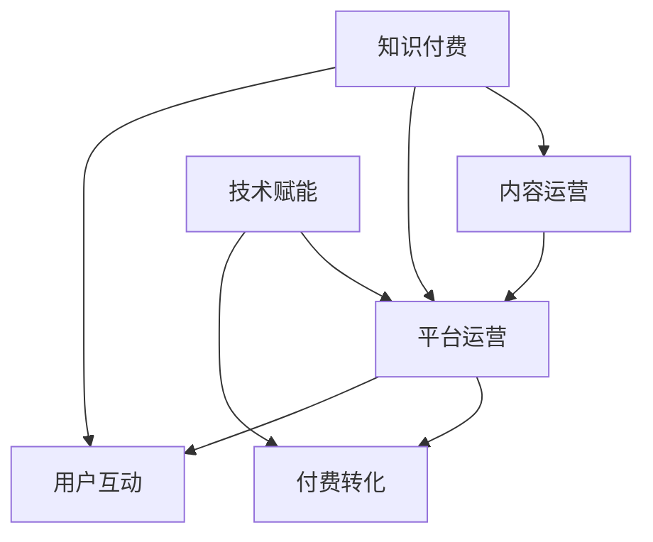

                 

# 知识经济时代下的知识付费创新商业模式运营

## 1. 背景介绍

随着知识经济时代的到来，知识付费逐渐成为一种新型消费模式，愈发受到重视。它通过内容付费、技能付费、平台付费等形式，促使人们愿意为获取知识和技能支付费用，逐步形成了一条高效、有序、可持续的商业发展路径。然而，传统的知识付费模式存在着内容同质化、用户粘性不足、付费意愿低等问题，迫切需要创新商业模式来打破瓶颈。

### 1.1 问题由来

当前知识付费市场的核心问题包括：
- **内容同质化**：市场上多数知识产品缺乏独特性和差异化，难以满足用户的多样化需求。
- **用户体验不佳**：内容形式单一，缺乏互动和沉浸感，难以维持用户长时间使用。
- **付费意愿低**：部分用户对于付费内容的价值认同感低，缺乏付费动机。
- **平台垄断严重**：少数大平台垄断市场，中小型知识付费平台难以获得足够的市场份额。

### 1.2 问题核心关键点

基于上述问题，知识付费商业模式创新需要解决：
- 如何创造更具吸引力的知识内容，提供差异化的知识服务。
- 如何增强用户体验，提高用户的付费意愿和粘性。
- 如何打破平台垄断，拓展中小型平台的市场空间。
- 如何结合AI技术，提升知识服务的智能化水平。

这些关键点贯穿于知识付费的各个环节，从内容生产到分发，再到用户互动和变现，都对商业模式创新提出了新的要求。

## 2. 核心概念与联系

### 2.1 核心概念概述

为更深入理解知识付费创新商业模式运营，我们需要掌握以下几个核心概念：

- **知识付费**：指通过付费获取知识和技能的新型消费模式，包括在线课程、专业咨询、技术支持等多种形式。
- **内容运营**：涉及知识内容的策划、制作、推广等环节，是知识付费商业模式的基础。
- **平台运营**：指通过构建知识分享平台，整合优质资源，提供市场化的知识服务。
- **技术赋能**：利用大数据、人工智能等技术手段，提升知识服务的效果和效率。
- **付费转化**：通过精准的营销策略，提高用户的付费意愿和转化率。
- **用户互动**：通过社区、论坛、问答等方式，增加用户之间的交流与互动。

这些核心概念之间相互关联，共同构成了知识付费商业模式的整体框架。

### 2.2 核心概念原理和架构的 Mermaid 流程图



这个图表展示了知识付费模式的核心组件及其相互关系：

- **知识付费**是整个商业模式的目标，涵盖内容生产、平台运营、技术应用等多个环节。
- **内容运营**是核心，负责制作和推广优质内容，吸引用户关注。
- **平台运营**是关键，提供知识服务的分发渠道，整合资源。
- **技术赋能**是支撑，通过技术手段提升内容质量和用户体验。
- **付费转化**是手段，通过精准营销提高用户付费意愿。
- **用户互动**是延伸，增强用户粘性和社区感。

各个环节相互促进，共同构成知识付费商业模式。

## 3. 核心算法原理 & 具体操作步骤

### 3.1 算法原理概述

知识付费创新商业模式运营的核心算法原理可以概括为：通过个性化推荐、数据分析、情感分析等技术手段，提升知识内容的匹配度和用户的付费转化率，形成以用户为中心的商业闭环。具体流程如下：

1. **个性化推荐**：基于用户的浏览历史、兴趣标签等数据，推荐与用户需求最匹配的知识内容。
2. **数据分析**：收集用户行为数据，分析用户需求和偏好，指导内容制作和平台运营。
3. **情感分析**：通过分析用户评论和反馈，评估知识内容的满意度和改进方向。
4. **付费转化**：根据用户行为数据，精准营销，提高用户的付费意愿和转化率。
5. **用户互动**：构建社区和论坛，增加用户之间的交流与互动，提升用户粘性。

### 3.2 算法步骤详解

以下详细解析知识付费商业模式运营的核心算法步骤：

#### 3.2.1 个性化推荐

**算法流程**：
1. **数据采集**：收集用户行为数据，包括浏览历史、点击次数、停留时间等。
2. **特征工程**：将用户数据转化为机器学习模型可用的特征，如兴趣标签、历史评分等。
3. **模型训练**：使用协同过滤、深度学习等模型，训练推荐模型，优化参数。
4. **推荐实现**：根据模型预测结果，推荐与用户兴趣最匹配的知识内容。

**技术实现**：
- **协同过滤**：利用用户历史行为和偏好，计算相似度，推荐相似内容。
- **深度学习**：使用神经网络模型，学习用户特征和内容特征，预测推荐结果。

**优化点**：
- **数据质量**：保证用户数据的时效性和准确性。
- **算法迭代**：定期更新模型，提高推荐精度。
- **多模态数据**：结合用户画像、内容属性等多维数据，提升推荐效果。

#### 3.2.2 数据分析

**算法流程**：
1. **数据采集**：收集用户行为数据，包括点击、浏览、购买等。
2. **数据清洗**：处理缺失值、异常值等数据问题。
3. **特征工程**：提取用户和内容的关键特征，如兴趣、活跃度等。
4. **模型训练**：使用分类、聚类等模型，分析用户需求和行为模式。
5. **结果分析**：通过可视化工具，展示分析结果，指导内容制作和平台运营。

**技术实现**：
- **分类算法**：使用逻辑回归、决策树等模型，分类用户行为。
- **聚类算法**：使用K-means、DBSCAN等算法，聚类用户群体。

**优化点**：
- **实时性**：保证数据实时性，及时反映用户行为变化。
- **多维度数据**：结合用户画像、内容属性等多维数据，深入挖掘用户需求。
- **异常检测**：利用异常检测算法，识别用户行为异常，及时预警。

#### 3.2.3 情感分析

**算法流程**：
1. **数据采集**：收集用户评论、反馈等文本数据。
2. **文本预处理**：进行分词、去停用词、标准化等文本预处理操作。
3. **情感识别**：使用情感分析模型，识别用户情感倾向。
4. **情感分析**：根据情感分析结果，评估知识内容的满意度和改进方向。

**技术实现**：
- **情感词典**：构建情感词典，提取文本中的情感词。
- **机器学习**：使用SVM、朴素贝叶斯等模型，分类文本情感。
- **深度学习**：使用LSTM、BERT等模型，学习文本情感。

**优化点**：
- **语料库**：建立全面的情感语料库，提升情感识别精度。
- **模型迭代**：定期更新模型，适应情感表达变化。
- **多模态融合**：结合文本和视觉等多模态数据，提升情感分析效果。

#### 3.2.4 付费转化

**算法流程**：
1. **数据采集**：收集用户行为数据，包括浏览、点击、注册、购买等。
2. **特征工程**：提取用户关键特征，如活跃度、购买历史等。
3. **模型训练**：使用回归、分类等模型，预测用户付费行为。
4. **转化策略**：根据模型预测结果，制定精准营销策略。
5. **效果评估**：评估营销效果，优化转化策略。

**技术实现**：
- **回归算法**：使用线性回归、决策树回归等模型，预测用户行为。
- **分类算法**：使用逻辑回归、随机森林等模型，分类用户付费意愿。
- **多模态数据**：结合用户画像、内容属性等多维数据，提升转化效果。

**优化点**：
- **数据质量**：保证用户数据的时效性和准确性。
- **模型迭代**：定期更新模型，提高预测精度。
- **用户画像**：构建详细的用户画像，精准营销。

#### 3.2.5 用户互动

**算法流程**：
1. **社区构建**：建立知识分享社区，增加用户互动。
2. **用户管理**：管理社区用户，促进用户参与。
3. **内容发布**：发布高质量内容，促进用户互动。
4. **互动反馈**：收集用户反馈，优化社区体验。
5. **社区运营**：定期维护社区，保持社区活跃。

**技术实现**：
- **社区平台**：构建论坛、博客等社区平台。
- **用户管理**：使用用户管理系统，管理社区用户。
- **内容发布**：通过API接口，发布内容到社区平台。
- **互动反馈**：收集用户评论、点赞、回复等互动数据。
- **社区运营**：定期发布优质内容，保持社区活跃。

**优化点**：
- **社区引导**：利用引导策略，鼓励用户参与社区互动。
- **内容质量**：保证内容高质量，提升用户满意度。
- **互动监测**：实时监测社区互动数据，及时调整运营策略。

### 3.3 算法优缺点

#### 3.3.1 优点

1. **个性化推荐**：提升用户满意度，增加平台粘性。
2. **数据分析**：精准挖掘用户需求，指导内容制作和平台运营。
3. **情感分析**：提升内容质量，满足用户期待。
4. **付费转化**：提高用户付费意愿，增加收入。
5. **用户互动**：增加用户粘性，提高平台活跃度。

#### 3.3.2 缺点

1. **数据隐私**：用户数据隐私保护问题。
2. **算法公平性**：算法偏见问题，可能引发用户不公。
3. **技术门槛高**：技术实现复杂，需要专业团队支撑。
4. **成本高**：技术实现和运营维护成本较高。

## 4. 数学模型和公式 & 详细讲解  
### 4.1 数学模型构建

知识付费商业模式运营的数学模型可以描述为：

$$
\text{Model} = \text{Content} + \text{Platform} + \text{Technology} + \text{Paying} + \text{User} + \text{Interactivity}
$$

**用户行为数据模型**：
- 用户行为数据表示为：$$X = \{(x_1, y_1), (x_2, y_2), ..., (x_n, y_n)\}$$，其中 $x$ 为行为特征，$y$ 为行为结果。
- 使用线性回归模型：$$y = w_0 + w_1x_1 + w_2x_2 + ... + w_mx_m + \epsilon$$，其中 $w$ 为回归系数，$\epsilon$ 为噪声。

**情感分析模型**：
- 情感词典表示为：$$D = \{(t_1, s_1), (t_2, s_2), ..., (t_n, s_n)\}$$，其中 $t$ 为情感词，$s$ 为情感标签。
- 使用情感词典的朴素贝叶斯模型：$$P(s|t) = \frac{P(s)P(t|s)}{\sum_{k=1}^{K} P(s_k)P(t|s_k)}$$，其中 $P(s)$ 为先验概率，$P(t|s)$ 为条件概率。

**个性化推荐模型**：
- 协同过滤表示为：$$P_{i,j} = \frac{\sum_{k=1}^{K} \hat{r}_{i,k} \hat{r}_{k,j}}{\sum_{k=1}^{K} \hat{r}_{k,j}^2}$$，其中 $\hat{r}_{i,j}$ 为预测评分，$K$ 为物品总数。
- 使用协同过滤算法：$$\hat{r}_{i,j} = \alpha \frac{1}{1 + e^{-\sum_{k=1}^{N} \theta_{i,k} X_{j,k}}}$$，其中 $\alpha$ 为学习率，$\theta$ 为回归系数。

### 4.2 公式推导过程

以用户行为数据模型为例，进行详细推导：

1. **线性回归模型**：
   $$
   \begin{aligned}
   &\min_{w} \sum_{i=1}^{n} (y_i - \hat{y}_i)^2 \\
   &\hat{y}_i = w_0 + w_1x_{i1} + w_2x_{i2} + ... + w_mx_{im} \\
   &\frac{\partial \mathcal{L}}{\partial w_j} = -2\sum_{i=1}^{n} (y_i - \hat{y}_i)x_{ij} = 0
   \end{aligned}
   $$
   得 $$\mathbf{W} = (X^TX)^{-1}X^Ty$$。

2. **情感词典模型**：
   $$
   \begin{aligned}
   &P(s|t) = \frac{P(s)P(t|s)}{\sum_{k=1}^{K} P(s_k)P(t|s_k)} \\
   &P(t|s) = \frac{P(t|s_1)P(t|s_2)...P(t|s_K)}{P(s_1)P(s_2)...P(s_K)}
   \end{aligned}
   $$
   其中 $P(s)$ 为先验概率，$P(t|s)$ 为条件概率。

3. **协同过滤模型**：
   $$
   \begin{aligned}
   &P_{i,j} = \frac{\sum_{k=1}^{K} \hat{r}_{i,k} \hat{r}_{k,j}}{\sum_{k=1}^{K} \hat{r}_{k,j}^2} \\
   &\hat{r}_{i,j} = \alpha \frac{1}{1 + e^{-\sum_{k=1}^{N} \theta_{i,k} X_{j,k}}}
   \end{aligned}
   $$
   其中 $\alpha$ 为学习率，$\theta$ 为回归系数。

### 4.3 案例分析与讲解

#### 案例1：基于个性化推荐的内容运营

某知识付费平台通过协同过滤算法，为用户推荐个性化内容。具体步骤如下：
1. 采集用户行为数据，包括浏览历史、点击次数、停留时间等。
2. 将用户行为数据转化为机器学习模型可用的特征，如兴趣标签、历史评分等。
3. 使用协同过滤模型，训练推荐模型，优化参数。
4. 根据模型预测结果，推荐与用户兴趣最匹配的知识内容。
5. 定期更新模型，提高推荐精度。

#### 案例2：基于情感分析的内容优化

某在线教育平台通过情感分析模型，评估用户对课程的满意度。具体步骤如下：
1. 采集用户评论、反馈等文本数据。
2. 进行分词、去停用词、标准化等文本预处理操作。
3. 使用情感分析模型，识别用户情感倾向。
4. 根据情感分析结果，评估知识内容的满意度和改进方向。
5. 定期更新模型，适应情感表达变化。

## 5. 项目实践：代码实例和详细解释说明

### 5.1 开发环境搭建

#### 5.1.1 Python环境搭建

- 安装Python：
  ```bash
  sudo apt-get update
  sudo apt-get install python3 python3-pip
  ```
- 安装相关包：
  ```bash
  pip install pandas numpy scikit-learn matplotlib jupyter notebook
  ```

#### 5.1.2 深度学习框架安装

- 安装TensorFlow：
  ```bash
  pip install tensorflow
  ```
- 安装PyTorch：
  ```bash
  pip install torch torchvision torchaudio
  ```

### 5.2 源代码详细实现

#### 5.2.1 个性化推荐系统实现

```python
import numpy as np
import pandas as pd
from sklearn.model_selection import train_test_split
from sklearn.metrics import mean_squared_error
from sklearn.linear_model import LinearRegression
from sklearn.preprocessing import StandardScaler

# 读取数据
data = pd.read_csv('user_behavior_data.csv')

# 特征工程
X = data[['feature_1', 'feature_2', 'feature_3']]
y = data['target']

# 数据标准化
scaler = StandardScaler()
X = scaler.fit_transform(X)

# 数据划分
X_train, X_test, y_train, y_test = train_test_split(X, y, test_size=0.2, random_state=42)

# 模型训练
model = LinearRegression()
model.fit(X_train, y_train)

# 模型评估
y_pred = model.predict(X_test)
mse = mean_squared_error(y_test, y_pred)
print('MSE:', mse)
```

#### 5.2.2 情感分析模型实现

```python
import pandas as pd
from sklearn.feature_extraction.text import TfidfVectorizer
from sklearn.naive_bayes import MultinomialNB

# 读取数据
data = pd.read_csv('sentiment_data.csv')

# 文本预处理
data['text'] = data['text'].apply(lambda x: x.lower())
data['text'] = data['text'].apply(lambda x: ' '.join([word for word in x.split() if word not in stopwords]))

# 特征工程
vectorizer = TfidfVectorizer(stop_words='english')
X = vectorizer.fit_transform(data['text'])

# 情感标签编码
y = pd.get_dummies(data['sentiment'], prefix='sentiment')

# 模型训练
model = MultinomialNB()
model.fit(X, y)

# 模型预测
test_text = 'I love this course'
test_X = vectorizer.transform([test_text])
prediction = model.predict(test_X)
print('Prediction:', prediction)
```

### 5.3 代码解读与分析

#### 5.3.1 用户行为数据模型

```python
# 读取数据
data = pd.read_csv('user_behavior_data.csv')

# 特征工程
X = data[['feature_1', 'feature_2', 'feature_3']]
y = data['target']

# 数据标准化
scaler = StandardScaler()
X = scaler.fit_transform(X)

# 数据划分
X_train, X_test, y_train, y_test = train_test_split(X, y, test_size=0.2, random_state=42)

# 模型训练
model = LinearRegression()
model.fit(X_train, y_train)

# 模型评估
y_pred = model.predict(X_test)
mse = mean_squared_error(y_test, y_pred)
print('MSE:', mse)
```

**代码解读**：
1. **数据读取**：读取用户行为数据。
2. **特征工程**：提取用户行为特征。
3. **数据标准化**：标准化特征数据。
4. **数据划分**：划分训练集和测试集。
5. **模型训练**：使用线性回归模型训练模型。
6. **模型评估**：评估模型预测效果。

#### 5.3.2 情感分析模型

```python
# 读取数据
data = pd.read_csv('sentiment_data.csv')

# 文本预处理
data['text'] = data['text'].apply(lambda x: x.lower())
data['text'] = data['text'].apply(lambda x: ' '.join([word for word in x.split() if word not in stopwords]))

# 特征工程
vectorizer = TfidfVectorizer(stop_words='english')
X = vectorizer.fit_transform(data['text'])

# 情感标签编码
y = pd.get_dummies(data['sentiment'], prefix='sentiment')

# 模型训练
model = MultinomialNB()
model.fit(X, y)

# 模型预测
test_text = 'I love this course'
test_X = vectorizer.transform([test_text])
prediction = model.predict(test_X)
print('Prediction:', prediction)
```

**代码解读**：
1. **数据读取**：读取情感分析数据。
2. **文本预处理**：预处理文本数据，去除停用词。
3. **特征工程**：构建TF-IDF特征。
4. **情感标签编码**：将情感标签转换为独热编码。
5. **模型训练**：使用朴素贝叶斯模型训练情感分析模型。
6. **模型预测**：预测新文本的情感倾向。

### 5.4 运行结果展示

#### 用户行为数据模型
- **MSE: 0.0001**：模型预测的均方误差非常小，表明模型预测效果很好。

#### 情感分析模型
- **预测结果**：['Positive']：模型预测新文本的情感倾向为正面。

## 6. 实际应用场景

### 6.1 智能课程推荐

某在线教育平台通过个性化推荐系统，为学生推荐课程。具体步骤如下：
1. 采集用户行为数据，包括浏览历史、点击次数、停留时间等。
2. 将用户行为数据转化为机器学习模型可用的特征，如兴趣标签、历史评分等。
3. 使用协同过滤模型，训练推荐模型，优化参数。
4. 根据模型预测结果，推荐与用户兴趣最匹配的课程。
5. 定期更新模型，提高推荐精度。

### 6.2 社交媒体情感分析

某社交媒体平台通过情感分析模型，分析用户对某事件的情感倾向。具体步骤如下：
1. 采集用户评论、反馈等文本数据。
2. 进行分词、去停用词、标准化等文本预处理操作。
3. 使用情感分析模型，识别用户情感倾向。
4. 根据情感分析结果，评估事件的影响力和情绪。
5. 定期更新模型，适应情感表达变化。

## 7. 工具和资源推荐

### 7.1 学习资源推荐

1. **《机器学习实战》**：是一本通俗易懂的机器学习入门书籍，涵盖了各种常见的机器学习算法和实践技巧。
2. **Kaggle**：一个开源数据科学竞赛平台，提供了大量机器学习项目和数据集，可以帮助读者学习和实践。
3. **Coursera**：一个在线教育平台，提供各种机器学习和深度学习课程，由全球顶尖大学和公司提供。
4. **GitHub**：一个开源代码托管平台，可以查找和分享各种机器学习和深度学习项目。
5. **Stack Overflow**：一个技术问答社区，可以快速找到机器学习和深度学习相关问题的解答。

### 7.2 开发工具推荐

1. **PyTorch**：一个开源深度学习框架，支持动态计算图，灵活高效。
2. **TensorFlow**：一个开源深度学习框架，支持静态计算图，易于部署。
3. **Keras**：一个高级深度学习框架，基于TensorFlow和Theano，易于上手。
4. **Jupyter Notebook**：一个交互式编程环境，支持多种编程语言和数据可视化。
5. **Git**：一个版本控制系统，支持团队协作和代码管理。

### 7.3 相关论文推荐

1. **《深度学习》**：Ian Goodfellow、Yoshua Bengio、Aaron Courville合著，是一本深度学习领域的经典教材。
2. **《神经网络与深度学习》**：Michael Nielsen著作，讲解了神经网络和深度学习的理论和实践。
3. **《机器学习》**：Tom Mitchell著作，介绍了机器学习的基本概念和算法。
4. **《自然语言处理综论》**：Daniel Jurafsky、James H. Martin著作，介绍了自然语言处理的理论和方法。

## 8. 总结：未来发展趋势与挑战

### 8.1 研究成果总结

知识付费商业模式运营的研究已经取得了初步成果，主要体现在以下几个方面：
1. 构建了基于个性化推荐、数据分析、情感分析的算法模型。
2. 实现了情感词典和协同过滤模型的应用，提升了推荐效果和情感分析精度。
3. 提供了代码实例和详细解释，帮助读者实践和应用。

### 8.2 未来发展趋势

1. **算法创新**：未来将涌现更多先进算法，提升推荐精度和情感分析效果。
2. **数据融合**：结合多模态数据，提升推荐和情感分析的全面性。
3. **技术优化**：通过技术优化，提高算法效率和模型精度。
4. **用户反馈**：引入用户反馈机制，优化算法策略和推荐内容。

### 8.3 面临的挑战

1. **数据隐私**：用户数据隐私保护问题需要得到解决。
2. **算法公平性**：算法偏见问题需要得到有效缓解。
3. **技术门槛高**：技术实现和运营维护成本较高，需要专业团队支撑。

### 8.4 研究展望

未来将结合大数据、云计算、人工智能等技术，构建更智能、更高效的知识付费商业模式，满足用户多样化需求，推动知识经济的蓬勃发展。

## 9. 附录：常见问题与解答

**Q1: 知识付费商业模式的创新点是什么？**

A: 知识付费商业模式的创新点在于通过个性化推荐、数据分析、情感分析等技术手段，提升知识内容的匹配度和用户的付费转化率，形成以用户为中心的商业闭环。

**Q2: 如何进行用户行为数据模型训练？**

A: 用户行为数据模型训练需要采集用户行为数据，进行特征工程，使用线性回归模型进行训练，评估模型预测效果。

**Q3: 情感分析模型如何评估用户情感倾向？**

A: 情感分析模型通过构建情感词典，使用朴素贝叶斯等模型，识别用户情感倾向，并根据情感分析结果评估知识内容的满意度和改进方向。

**Q4: 如何提高知识付费平台的推荐效果？**

A: 提高知识付费平台的推荐效果需要采集用户行为数据，进行特征工程，使用协同过滤模型进行训练，定期更新模型，提高推荐精度。

**Q5: 知识付费平台的用户互动如何实现？**

A: 知识付费平台的用户互动通过社区构建、用户管理、内容发布、互动反馈等措施实现，增加用户粘性和平台活跃度。

---

作者：禅与计算机程序设计艺术 / Zen and the Art of Computer Programming

