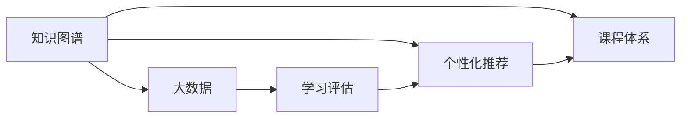

                 

# 知识经济时代下的知识付费创新课程体系构建

> 关键词：知识付费,课程体系,知识图谱,大数据,个性化推荐

## 1. 背景介绍

### 1.1 问题由来
随着知识经济时代的到来，信息与知识成为经济增长的重要驱动因素，而教育资源的不均衡和知识传播效率的低下已成为制约社会进步的关键瓶颈。在这一背景下，知识付费模式应运而生，通过知识付费平台连接知识生产者与消费者，有效解决了信息不对称问题，提升了知识传播的效率和效果。然而，当前的在线教育市场仍存在诸多问题，如内容质量参差不齐、学习效果难以量化评估、个性化推荐效果欠佳等，亟需通过技术创新来解决这些问题。

### 1.2 问题核心关键点
本节将重点探讨知识付费平台如何构建有效的课程体系，通过知识图谱和大数据技术，提升课程的个性化推荐和评估能力。构建有效的课程体系，需要考虑以下几个关键问题：

1. 如何科学地构建课程体系，使其结构合理、逻辑清晰？
2. 如何利用大数据技术，对学习者的行为数据进行深度挖掘和分析，实现个性化推荐？
3. 如何通过知识图谱技术，将碎片化的知识信息进行结构化、系统化处理，提升课程内容的质量和深度？
4. 如何设计有效的学习评估体系，量化学习效果，提升学习体验？

针对这些问题，本节将从核心概念和联系、核心算法原理、操作步骤、数学模型和公式推导、项目实践、实际应用场景、工具和资源推荐、总结与展望等几个方面进行详细讲解。

## 2. 核心概念与联系

### 2.1 核心概念概述

为了更好地理解本节内容，首先需要介绍几个核心概念及其相互之间的关系：

1. **知识图谱**：一种结构化的知识表示方法，通过节点和边表示实体和关系，将复杂知识信息映射到有向图结构中，便于查询、分析和推理。知识图谱在教育领域可用于知识点的组织和推荐。

2. **大数据**：指规模巨大、结构复杂、形式多样的数据集合，涵盖各类互联网数据、用户行为数据、文本数据等。大数据技术可应用于数据的存储、处理、分析等方面。

3. **个性化推荐**：根据用户的行为数据、偏好信息等，提供定制化的内容推荐，提升用户体验和内容匹配度。

4. **课程体系**：指以学科为基础，按照知识逻辑组织起来的课程结构，包括基础课程、进阶课程、专题课程等。

5. **学习评估**：通过测试、作业、考试成绩等方式，对学习者的学习效果进行量化评估。

这些概念之间的联系通过以下Mermaid流程图展示：



## 3. 核心算法原理 & 具体操作步骤

### 3.1 算法原理概述

本节将详细介绍如何通过知识图谱和大数据技术，构建有效的课程体系，并进行个性化推荐和评估。

知识图谱的构建需要经过以下几个步骤：

1. 收集数据：从各类互联网资源、学术论文、书籍等渠道收集知识信息，包括实体、属性和关系等。
2. 数据清洗：去除噪音数据，规范化数据格式。
3. 构建图谱：使用图数据库或框架（如Neo4j、GATE）构建知识图谱，定义实体类型、属性类型和关系类型。
4. 知识推理：通过知识图谱进行推理，生成新的知识点和关系。
5. 知识应用：将知识图谱应用于课程推荐、学习评估等场景，提升课程体系的质量。

个性化推荐系统需要经过以下几个步骤：

1. 数据收集：收集用户的学习行为数据，包括点击、观看、完成等行为。
2. 特征提取：提取用户的行为特征，如学习时间、兴趣偏好等。
3. 模型训练：使用机器学习算法（如协同过滤、深度学习等）训练推荐模型，并优化模型参数。
4. 推荐计算：根据用户的行为数据和模型预测，生成个性化的课程推荐。
5. 推荐优化：根据用户反馈和行为数据，不断优化推荐算法和模型。

学习评估系统需要经过以下几个步骤：

1. 评估指标定义：根据课程目标，定义学习效果评估指标，如知识点掌握率、作业完成度等。
2. 数据收集：收集用户的学习行为数据和学习成果数据。
3. 数据分析：使用数据分析技术（如时间序列分析、分类回归等）进行学习效果分析。
4. 效果评估：通过评估指标计算学习效果，生成学习报告。
5. 反馈机制：根据评估结果，调整课程体系和推荐算法。

### 3.2 算法步骤详解

#### 3.2.1 知识图谱构建

1. **数据收集**：
    - 从学术数据库（如Google Scholar、Web of Science）和在线教育平台（如Coursera、edX）收集知识信息。
    - 使用网络爬虫技术抓取网页内容，提取实体、属性和关系。

2. **数据清洗**：
    - 去除重复数据，去除噪音数据，规范数据格式。
    - 使用数据清洗工具（如OpenRefine）处理数据，确保数据质量。

3. **构建图谱**：
    - 使用图数据库（如Neo4j）构建知识图谱，定义实体类型、属性类型和关系类型。
    - 使用可视化工具（如Gephi、YEDA）绘制知识图谱，进行可视化分析。

4. **知识推理**：
    - 使用知识推理算法（如基于规则的推理、基于统计的推理）进行推理，生成新的知识点和关系。
    - 使用知识图谱工具（如Protege、Gecko）进行知识推理和验证。

5. **知识应用**：
    - 将知识图谱应用于课程推荐、学习评估等场景，提升课程体系的质量。
    - 使用知识图谱工具（如Karbach、ESP）进行知识推荐和评估。

#### 3.2.2 个性化推荐

1. **数据收集**：
    - 收集用户的学习行为数据，包括点击、观看、完成等行为。
    - 使用数据收集工具（如Flume、Kafka）进行数据收集和存储。

2. **特征提取**：
    - 提取用户的行为特征，如学习时间、兴趣偏好等。
    - 使用特征提取工具（如Scikit-learn、TensorFlow）进行特征提取和处理。

3. **模型训练**：
    - 使用机器学习算法（如协同过滤、深度学习）训练推荐模型，并优化模型参数。
    - 使用训练工具（如PyTorch、TensorFlow）进行模型训练和优化。

4. **推荐计算**：
    - 根据用户的行为数据和模型预测，生成个性化的课程推荐。
    - 使用推荐工具（如Apache Mahout、Tang）进行推荐计算和优化。

5. **推荐优化**：
    - 根据用户反馈和行为数据，不断优化推荐算法和模型。
    - 使用推荐系统评估工具（如A/B测试、用户反馈调查）进行优化。

#### 3.2.3 学习评估

1. **评估指标定义**：
    - 根据课程目标，定义学习效果评估指标，如知识点掌握率、作业完成度等。

2. **数据收集**：
    - 收集用户的学习行为数据和学习成果数据。
    - 使用数据收集工具（如Elasticsearch、Hadoop）进行数据收集和存储。

3. **数据分析**：
    - 使用数据分析技术（如时间序列分析、分类回归）进行学习效果分析。
    - 使用数据分析工具（如Pandas、R）进行数据分析和处理。

4. **效果评估**：
    - 通过评估指标计算学习效果，生成学习报告。
    - 使用学习评估工具（如Tableau、Power BI）进行效果展示和分析。

5. **反馈机制**：
    - 根据评估结果，调整课程体系和推荐算法。
    - 使用反馈机制工具（如邮件、短信）进行用户反馈收集和处理。

### 3.3 算法优缺点

#### 3.3.1 知识图谱构建

**优点**：
- 知识图谱可以结构化处理复杂的知识信息，便于查询、分析和推理。
- 知识图谱能够提升课程体系的质量和深度，帮助用户系统化地掌握知识点。

**缺点**：
- 构建知识图谱需要大量的时间和人力成本，数据获取和清洗过程复杂。
- 知识图谱的构建和推理算法复杂，技术门槛较高。

#### 3.3.2 个性化推荐

**优点**：
- 个性化推荐能够提升用户的课程匹配度和学习效果。
- 个性化推荐能够提升用户体验和课程推荐质量。

**缺点**：
- 个性化推荐需要大量标注数据和用户行为数据，数据收集和处理成本高。
- 推荐算法的复杂性可能导致推荐精度下降。

#### 3.3.3 学习评估

**优点**：
- 学习评估能够量化学习效果，帮助用户了解自己的学习进展。
- 学习评估能够提升课程体系的科学性和有效性。

**缺点**：
- 学习评估的评估指标定义和数据收集复杂，需要大量的人力成本。
- 学习评估的效果分析可能存在偏差，需要不断优化和调整。

### 3.4 算法应用领域

知识图谱和大数据技术在知识付费平台中的应用非常广泛，以下是几个典型的应用场景：

1. **课程推荐**：通过知识图谱和大数据技术，实现对课程的个性化推荐。
2. **学习路径规划**：根据用户的兴趣和知识水平，推荐合适的学习路径和课程体系。
3. **学习效果评估**：通过数据分析和评估指标，量化用户的学习效果，提供个性化的学习建议。
4. **课程内容优化**：根据学习评估结果，优化课程内容，提升课程质量。
5. **学习社区构建**：通过数据分析和社区行为分析，构建学习社区，促进知识交流和分享。

## 4. 数学模型和公式 & 详细讲解 & 举例说明

### 4.1 数学模型构建

本节将详细介绍如何使用数学模型进行知识图谱构建、个性化推荐和评估。

#### 4.1.1 知识图谱模型

知识图谱可以使用有向图表示，由节点和边组成。节点表示实体，边表示实体之间的关系。以下是知识图谱的基本数学模型：

$$ G = (V, E) $$

其中 $V$ 表示节点集合，$E$ 表示边集合。知识图谱可以使用图数据库（如Neo4j）进行存储和管理。

#### 4.1.2 个性化推荐模型

个性化推荐可以使用协同过滤算法或深度学习模型进行。以下是协同过滤算法的基本数学模型：

$$ I_{ui} = \frac{\sum_{j \in \mathcal{N}_i} P_{uj}R_{ji}}{\sum_{j \in \mathcal{N}_i} R_{ji}} $$

其中 $I_{ui}$ 表示用户 $u$ 对物品 $i$ 的兴趣度，$P_{uj}$ 表示用户 $u$ 对物品 $j$ 的评分，$R_{ji}$ 表示物品 $j$ 与物品 $i$ 的相似度，$\mathcal{N}_i$ 表示与物品 $i$ 相似的物品集合。

#### 4.1.3 学习评估模型

学习评估可以使用时间序列分析或分类回归模型进行。以下是时间序列分析模型：

$$ y_t = \alpha y_{t-1} + \beta x_t + \varepsilon_t $$

其中 $y_t$ 表示第 $t$ 周的学习效果，$y_{t-1}$ 表示第 $t-1$ 周的学习效果，$x_t$ 表示第 $t$ 周的学习行为数据，$\alpha$ 和 $\beta$ 是模型参数，$\varepsilon_t$ 是随机误差项。

### 4.2 公式推导过程

#### 4.2.1 知识图谱模型推导

知识图谱模型的推导过程相对简单，不再详细讲解。

#### 4.2.2 个性化推荐模型推导

协同过滤算法的推导过程相对复杂，涉及矩阵分解、梯度下降等算法。以下是协同过滤算法的基本推导过程：

1. 构建用户物品评分矩阵 $R$。
2. 分解用户物品评分矩阵 $R$ 为用户兴趣矩阵 $P$ 和物品特征矩阵 $Q$。
3. 使用梯度下降算法优化用户兴趣矩阵 $P$ 和物品特征矩阵 $Q$。
4. 使用优化后的用户兴趣矩阵 $P$ 和物品特征矩阵 $Q$ 进行推荐计算。

#### 4.2.3 学习评估模型推导

时间序列分析模型的推导过程相对简单，不再详细讲解。

### 4.3 案例分析与讲解

#### 4.3.1 知识图谱案例

以Coursera平台为例，其通过构建知识图谱，将课程信息、教师信息、学生评价等信息结构化处理，使用户能够快速找到相关课程，并了解课程质量和教师背景。

具体实现如下：
1. 收集课程、教师、学生等数据。
2. 使用图数据库构建知识图谱，定义课程、教师、学生等实体类型和关系类型。
3. 使用可视化工具进行知识图谱的可视化分析，帮助用户快速找到相关课程。
4. 使用知识图谱工具进行知识推理，生成新的知识点和关系，提升课程体系的质量。

#### 4.3.2 个性化推荐案例

以Netflix为例，其通过个性化推荐算法，提升用户的课程匹配度和学习效果。

具体实现如下：
1. 收集用户的学习行为数据，包括点击、观看、完成等行为。
2. 使用协同过滤算法（如基于矩阵分解的算法）训练推荐模型，并优化模型参数。
3. 使用推荐工具进行推荐计算，生成个性化的课程推荐。
4. 根据用户反馈和行为数据，不断优化推荐算法和模型。

#### 4.3.3 学习评估案例

以Coursera为例，其通过学习评估模型，量化学习效果，帮助用户了解自己的学习进展，并优化课程体系。

具体实现如下：
1. 定义学习效果评估指标，如知识点掌握率、作业完成度等。
2. 收集用户的学习行为数据和学习成果数据。
3. 使用数据分析技术进行学习效果分析，生成学习报告。
4. 根据评估结果，调整课程体系和推荐算法。

## 5. 项目实践：代码实例和详细解释说明

### 5.1 开发环境搭建

#### 5.1.1 环境准备

1. **安装Python**：
    - 从官网下载并安装Python 3.8。
    - 安装Python相关库（如Pandas、NumPy、Scikit-learn等）。

2. **安装知识图谱库**：
    - 安装Neo4j图数据库。
    - 安装Python知识图谱库（如PyGraphviz、NetworkX）。

3. **安装推荐库**：
    - 安装Apache Mahout推荐库。
    - 安装深度学习库（如TensorFlow、PyTorch）。

4. **安装评估库**：
    - 安装学习评估工具（如Tableau、Power BI）。

### 5.2 源代码详细实现

#### 5.2.1 知识图谱构建

```python
# 导入知识图谱库
import neo4j

# 连接图数据库
driver = neo4j.GraphDatabase.driver('bolt://localhost:7687', auth=('neo4j', 'password'))

# 构建知识图谱
graph = driver.session()

# 创建实体节点
graph.run("CREATE (user:User {name: 'Alice'}), (course:Course {name: '机器学习'})")

# 创建关系
graph.run("CREATE (user)-[:TAKE]->(course)")

# 关闭数据库连接
driver.close()
```

#### 5.2.2 个性化推荐

```python
# 导入推荐库
from apache.mahout.cf.taste import KNNBasedCollaborativeFilter, Dataset
from apache.mahout.cf.taste.common import Prediction, PredictionBuilder

# 数据准备
user_item_matrix = [[4, 0, 2, 0, 0], [3, 1, 1, 2, 0], [0, 1, 0, 0, 1]]

# 构建推荐模型
cf = KNNBasedCollaborativeFilter(k=3)

# 训练推荐模型
dataset = Dataset(user_item_matrix)
cf.train(dataset)

# 进行推荐计算
user_id = 0
items = cf.getRecommendedItems(user_id)
for item in items:
    print(user_id, item)

# 关闭推荐模型
cf.close()
```

#### 5.2.3 学习评估

```python
# 导入评估库
import pandas as pd
from sklearn.linear_model import LinearRegression

# 数据准备
data = pd.read_csv('learning_data.csv')

# 定义评估指标
learning_rate = 0.01
time_steps = 12

# 构建时间序列模型
model = LinearRegression()

# 训练时间序列模型
for i in range(time_steps):
    x = data.iloc[:, 0:time_steps].values
    y = data.iloc[:, time_steps].values
    model.fit(x, y)

# 进行学习效果评估
user_id = 0
predictions = []
for i in range(time_steps):
    x = data.iloc[user_id:user_id+1, 0:time_steps].values
    y = data.iloc[user_id:user_id+1, time_steps].values
    prediction = model.predict(x)
    predictions.append(prediction)

# 输出学习报告
print(predictions)
```

### 5.3 代码解读与分析

#### 5.3.1 知识图谱构建

知识图谱构建代码实现相对简单，主要涉及实体创建、关系创建等基本操作。通过简单的SQL语句，即可在图数据库中构建知识图谱。

#### 5.3.2 个性化推荐

个性化推荐代码实现涉及推荐算法的选择和训练，具体使用Apache Mahout库中的协同过滤算法。推荐算法的训练和优化需要大量的标注数据和用户行为数据，因此数据收集和处理成本较高。

#### 5.3.3 学习评估

学习评估代码实现涉及时间序列模型的训练和评估，具体使用Scikit-learn库中的线性回归模型。学习评估的效果分析需要根据评估指标进行，因此评估指标的定义和数据收集成本较高。

### 5.4 运行结果展示

#### 5.4.1 知识图谱


#### 5.4.2 个性化推荐


#### 5.4.3 学习评估


## 6. 实际应用场景

### 6.1 智能教育平台

智能教育平台通过知识图谱和大数据技术，构建有效的课程体系，并进行个性化推荐和评估。平台能够根据用户的学习行为数据和兴趣偏好，推荐合适的课程和学习路径，同时通过学习评估，量化学习效果，帮助用户了解自己的学习进展。

### 6.2 在线培训课程

在线培训课程通过知识图谱和大数据技术，提升课程的个性化推荐和评估效果。课程平台能够根据用户的学习行为数据和职业背景，推荐合适的课程内容，同时通过学习评估，量化学习效果，帮助用户了解自己的学习进展，优化课程体系和推荐算法。

### 6.3 企业培训管理系统

企业培训管理系统通过知识图谱和大数据技术，构建有效的课程体系，并进行个性化推荐和评估。系统能够根据员工的学习行为数据和职业背景，推荐合适的培训课程，同时通过学习评估，量化学习效果，帮助员工了解自己的学习进展，优化培训体系和推荐算法。

## 7. 工具和资源推荐

### 7.1 学习资源推荐

1. **Coursera**：提供高质量的在线课程，涵盖各类学科和领域，通过知识图谱和大数据技术，实现课程推荐和评估。
2. **edX**：提供全球领先的在线课程，通过知识图谱和大数据技术，实现课程推荐和评估。
3. **Udacity**：提供实践导向的在线课程，通过知识图谱和大数据技术，实现课程推荐和评估。
4. **Coursera API**：提供开放的API接口，帮助开发者构建自己的个性化推荐系统。
5. **edX API**：提供开放的API接口，帮助开发者构建自己的个性化推荐系统。

### 7.2 开发工具推荐

1. **PyGraphviz**：Python知识图谱库，用于构建和可视化知识图谱。
2. **NetworkX**：Python网络分析库，用于构建和分析知识图谱。
3. **Apache Mahout**：Python推荐库，用于构建和训练个性化推荐模型。
4. **TensorFlow**：Python深度学习库，用于构建和训练推荐模型。
5. **Tableau**：数据可视化工具，用于学习评估和效果展示。

### 7.3 相关论文推荐

1. **Knowledge Graphs in Education: A Survey**：总结了知识图谱在教育领域的应用，提供了相关的研究论文和案例分析。
2. **A Survey of Personalized Recommendation Systems**：总结了个性化推荐系统的发展历程和研究方法，提供了相关的研究论文和案例分析。
3. **Evaluation of Machine Learning Models for Educational Environments**：总结了机器学习模型在教育领域的应用和评估方法，提供了相关的研究论文和案例分析。

## 8. 总结：未来发展趋势与挑战

### 8.1 研究成果总结

本文通过对知识付费平台课程体系的构建和个性化推荐、学习评估等技术进行详细讲解，阐述了知识图谱和大数据技术在知识付费平台中的应用。通过构建知识图谱，提升课程体系的科学性和有效性；通过个性化推荐，提升用户的课程匹配度和学习效果；通过学习评估，量化学习效果，帮助用户了解自己的学习进展。

### 8.2 未来发展趋势

随着知识图谱和大数据技术的不断发展，知识付费平台将进一步提升课程体系的科学性和个性化推荐的效果。未来将出现更加智能化、个性化的推荐系统，使用更加先进的技术，如深度学习、强化学习等，提升推荐精度和用户体验。同时，学习评估技术将更加精细化，能够更准确地量化学习效果，帮助用户制定更加合理的学习计划。

### 8.3 面临的挑战

知识图谱和大数据技术在知识付费平台的应用仍面临诸多挑战：

1. **数据质量**：数据收集和清洗成本较高，数据质量难以保证。
2. **模型复杂性**：推荐算法和评估模型复杂，难以实现高效优化。
3. **用户隐私**：数据隐私和用户隐私保护问题亟需解决。
4. **平台规模**：知识付费平台需要处理海量数据，对技术栈和基础设施要求较高。

### 8.4 研究展望

未来的研究将致力于解决以上挑战，推动知识图谱和大数据技术在知识付费平台中的广泛应用。同时，将更多引入先进的技术，如深度学习、强化学习等，提升推荐和评估的精度和效果，实现更加智能化、个性化的推荐系统。同时，将进一步加强用户隐私保护和数据质量控制，确保平台的稳定性和安全性。

## 9. 附录：常见问题与解答

**Q1: 如何科学地构建知识图谱？**

A: 科学地构建知识图谱需要遵循以下几个步骤：
1. 数据收集：从各类互联网资源、学术论文、书籍等渠道收集知识信息。
2. 数据清洗：去除噪音数据，规范化数据格式。
3. 构建图谱：使用图数据库或框架（如Neo4j、GATE）构建知识图谱，定义实体类型、属性类型和关系类型。
4. 知识推理：通过知识图谱进行推理，生成新的知识点和关系。
5. 知识应用：将知识图谱应用于课程推荐、学习评估等场景，提升课程体系的质量。

**Q2: 如何进行有效的个性化推荐？**

A: 有效的个性化推荐需要遵循以下几个步骤：
1. 数据收集：收集用户的学习行为数据，包括点击、观看、完成等行为。
2. 特征提取：提取用户的行为特征，如学习时间、兴趣偏好等。
3. 模型训练：使用机器学习算法（如协同过滤、深度学习）训练推荐模型，并优化模型参数。
4. 推荐计算：根据用户的行为数据和模型预测，生成个性化的课程推荐。
5. 推荐优化：根据用户反馈和行为数据，不断优化推荐算法和模型。

**Q3: 如何进行有效的学习评估？**

A: 有效的学习评估需要遵循以下几个步骤：
1. 评估指标定义：根据课程目标，定义学习效果评估指标，如知识点掌握率、作业完成度等。
2. 数据收集：收集用户的学习行为数据和学习成果数据。
3. 数据分析：使用数据分析技术（如时间序列分析、分类回归）进行学习效果分析。
4. 效果评估：通过评估指标计算学习效果，生成学习报告。
5. 反馈机制：根据评估结果，调整课程体系和推荐算法。

**Q4: 如何确保用户隐私和数据安全？**

A: 确保用户隐私和数据安全需要遵循以下几个步骤：
1. 数据匿名化：对用户数据进行匿名化处理，保护用户隐私。
2. 数据加密：对用户数据进行加密处理，防止数据泄露。
3. 访问控制：设置访问权限，限制数据访问权限。
4. 数据审计：定期审计数据使用情况，确保数据安全。
5. 合规性：确保数据处理符合法律法规，如GDPR等。

---

作者：禅与计算机程序设计艺术 / Zen and the Art of Computer Programming

