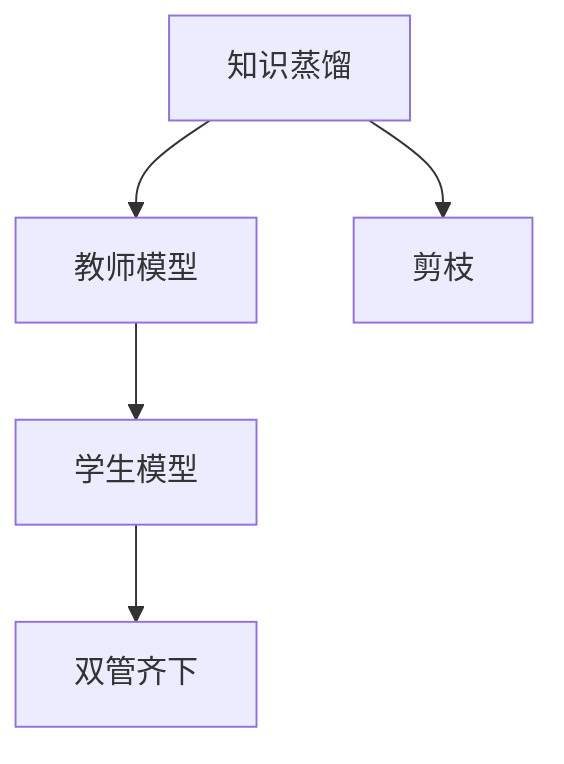

                 

## 1. 背景介绍

### 1.1 问题由来

在深度学习领域，特别是神经网络模型的压缩和优化一直是重要的研究方向。随着模型复杂度的不断增加，神经网络模型面临着巨大的存储和计算压力。为了解决这一问题，研究人员提出了许多压缩方法，包括模型剪枝、量化、知识蒸馏等。

模型剪枝（Pruning）是一种有效的压缩方法，通过移除不必要的权重和连接，减小模型参数规模，降低计算和存储成本。然而，剪枝可能会导致模型性能的显著下降，尤其是当剪枝比例过高时。

知识蒸馏（Knowledge Distillation）是一种通过将大型模型的知识传递给小型模型的方法，以提升小模型的性能。它可以通过教师模型（Teacher Model）的知识来指导学生模型（Student Model）的学习，使得小模型在任务上达到与大型模型相似的性能，同时显著减小了参数规模。

尽管知识蒸馏和模型剪枝在各自领域都有显著效果，但它们之间缺乏有效的结合。本文旨在探讨知识蒸馏和剪枝的结合方法，提出一种双管齐下的压缩策略，以达到更好的性能和效率。

### 1.2 问题核心关键点

知识蒸馏和剪枝的结合需要解决以下几个关键问题：

- 如何设计有效的知识蒸馏任务，使得教师模型能够有效地向学生模型传递知识？
- 如何在知识蒸馏的同时进行有效的剪枝，最大化地减小模型规模，同时保证性能？
- 如何优化训练过程，使得知识蒸馏和剪枝过程能够协同进行？

## 2. 核心概念与联系

### 2.1 核心概念概述

为更好地理解知识蒸馏和剪枝的结合方法，本节将介绍几个密切相关的核心概念：

- **知识蒸馏（Knowledge Distillation）**：一种通过将大型模型的知识传递给小型模型的方法，以提升小模型的性能。教师模型（Teacher Model）和学生模型（Student Model）之间通过知识蒸馏任务进行知识的传递。
- **模型剪枝（Pruning）**：通过移除不必要的权重和连接，减小模型参数规模，降低计算和存储成本。
- **双管齐下**：将知识蒸馏和剪枝方法结合使用，以实现更好的模型压缩效果。

这些核心概念之间的逻辑关系可以通过以下Mermaid流程图来展示：



这个流程图展示了这个概念链条：知识蒸馏的教师模型向学生模型传递知识，同时学生模型进行剪枝，最终实现双管齐下的压缩效果。

## 3. 核心算法原理 & 具体操作步骤

### 3.1 算法原理概述

知识蒸馏和剪枝的结合方法是一种结合了知识传递和参数减少的策略。它利用知识蒸馏来指导剪枝过程，使得剪枝后的小模型仍然能够保持较高的性能。具体的，通过以下步骤实现：

1. **知识蒸馏**：教师模型对学生模型进行知识传递，学生模型通过学习教师模型的知识来提升自身性能。
2. **剪枝**：对学生模型进行剪枝，移除不必要的权重和连接，以减小模型规模。
3. **反馈**：剪枝后的模型返回给教师模型进行重新蒸馏，形成循环反馈机制。

这种结合方法的核心思想在于利用知识蒸馏和剪枝的互补性，通过优化训练过程，使得学生模型能够在保持较高性能的同时，被有效地压缩。

### 3.2 算法步骤详解

#### 3.2.1 知识蒸馏过程

知识蒸馏过程包括以下几个关键步骤：

1. **选择教师模型和学生模型**：教师模型为预训练好的大模型，学生模型为目标任务上的小模型。
2. **设计蒸馏任务**：选择合适的蒸馏任务，如基于特征匹配的蒸馏任务，或基于预测输出的蒸馏任务。
3. **训练学生模型**：使用教师模型的知识来指导学生模型的训练。
4. **计算蒸馏损失**：计算学生模型和教师模型之间的损失，用于优化学生模型的训练。

#### 3.2.2 剪枝过程

剪枝过程包括以下几个关键步骤：

1. **选择剪枝方法**：选择剪枝策略，如结构剪枝、权值剪枝等。
2. **确定剪枝比例**：根据模型规模和任务需求，确定剪枝的比例。
3. **剪枝执行**：使用剪枝算法执行剪枝，移除不必要的权重和连接。
4. **验证剪枝效果**：使用验证集评估剪枝后的模型性能，确保剪枝不会显著影响性能。

#### 3.2.3 结合过程

结合过程包括以下几个关键步骤：

1. **交替训练**：交替进行知识蒸馏和剪枝训练。
2. **剪枝后的蒸馏**：将剪枝后的学生模型作为新的教师模型，进行重新蒸馏。
3. **循环反馈**：通过多次迭代，不断优化学生模型和教师模型，直到达到满意的压缩效果。

### 3.3 算法优缺点

#### 3.3.1 优点

- **高性能**：结合了知识蒸馏和剪枝的优势，可以在较小的模型规模上获得较高的性能。
- **参数高效**：通过剪枝减少模型参数，同时利用知识蒸馏提高模型性能，使得压缩后的模型依然能够保持较高的精度。
- **可扩展性**：该方法适用于各种类型的神经网络模型，可以轻松应用于不同的任务和应用场景。

#### 3.3.2 缺点

- **计算开销大**：结合知识蒸馏和剪枝的过程，需要更多的计算资源和时间。
- **设计复杂**：需要选择合适的蒸馏任务和剪枝方法，设计过程较为复杂。
- **初始模型质量要求高**：教师模型的质量直接影响知识蒸馏的效果，需要高质量的预训练模型。

### 3.4 算法应用领域

知识蒸馏和剪枝的结合方法广泛应用于各种神经网络模型的压缩和优化中，特别是在图像识别、自然语言处理和语音识别等领域。

- **图像识别**：结合知识蒸馏和剪枝，可以显著减小卷积神经网络（CNN）模型的参数规模，同时保持较高的图像分类精度。
- **自然语言处理**：结合知识蒸馏和剪枝，可以优化语言模型，如BERT和GPT，减小模型规模，同时保持语言理解能力和生成能力。
- **语音识别**：结合知识蒸馏和剪枝，可以优化深度神经网络（DNN）和卷积神经网络（CNN），提升语音识别准确率。

## 4. 数学模型和公式 & 详细讲解

### 4.1 数学模型构建

知识蒸馏和剪枝的结合方法可以通过以下数学模型进行建模：

设教师模型为 $T$，学生模型为 $S$，知识蒸馏任务为 $D$，剪枝方法为 $P$，则综合优化问题可以表示为：

$$
\min_{S, P} \frac{1}{N} \sum_{i=1}^N \ell_S(D(S), y_i) + \lambda \text{Prune}(T, S, P)
$$

其中 $\ell_S$ 为学生模型的损失函数，$y_i$ 为样本标签，$\text{Prune}$ 为剪枝损失函数，$\lambda$ 为剪枝的权重因子。

### 4.2 公式推导过程

#### 4.2.1 知识蒸馏损失

知识蒸馏损失可以表示为：

$$
\ell_S(D(S), y_i) = \ell_D(T, y_i) + \alpha \|D(S) - D(T)\|
$$

其中 $\ell_D$ 为教师模型的损失函数，$\alpha$ 为蒸馏系数，$\|D(S) - D(T)\|$ 为学生模型和教师模型之间的距离。

#### 4.2.2 剪枝损失

剪枝损失可以表示为：

$$
\text{Prune}(T, S, P) = \sum_{k=1}^K p_k \|T_k\|
$$

其中 $T_k$ 为教师模型中的第 $k$ 个参数，$p_k$ 为该参数的剪枝概率，$\|T_k\|$ 为该参数的绝对值。

### 4.3 案例分析与讲解

以图像分类任务为例，结合知识蒸馏和剪枝的优化过程如下：

1. **选择教师模型和学生模型**：教师模型为ResNet-50，学生模型为ResNet-18。
2. **设计蒸馏任务**：选择特征蒸馏任务，计算学生模型和教师模型在每个层的特征距离。
3. **训练学生模型**：使用特征蒸馏损失来优化学生模型的训练。
4. **剪枝过程**：对学生模型进行结构剪枝，移除不必要的连接。
5. **剪枝后的蒸馏**：将剪枝后的学生模型作为新的教师模型，进行重新蒸馏。
6. **循环反馈**：通过多次迭代，不断优化学生模型和教师模型，直到达到满意的压缩效果。

## 5. 项目实践：代码实例和详细解释说明

### 5.1 开发环境搭建

在进行知识蒸馏和剪枝的结合实践前，我们需要准备好开发环境。以下是使用Python进行TensorFlow开发的环境配置流程：

1. 安装Anaconda：从官网下载并安装Anaconda，用于创建独立的Python环境。

2. 创建并激活虚拟环境：
```bash
conda create -n tf-env python=3.8 
conda activate tf-env
```

3. 安装TensorFlow：根据CUDA版本，从官网获取对应的安装命令。例如：
```bash
conda install tensorflow -c pytorch -c conda-forge
```

4. 安装Keras：
```bash
conda install keras -c conda-forge
```

5. 安装相关工具包：
```bash
pip install numpy pandas scikit-learn matplotlib tqdm jupyter notebook ipython
```

完成上述步骤后，即可在`tf-env`环境中开始项目实践。

### 5.2 源代码详细实现

首先，定义教师模型和学生模型的输入和输出：

```python
import tensorflow as tf
from tensorflow.keras.models import Model
from tensorflow.keras.layers import Input, Conv2D, BatchNormalization, MaxPooling2D, Flatten, Dense, Dropout

# 教师模型
input_teacher = Input(shape=(32, 32, 3))
x_teacher = Conv2D(64, (3, 3), activation='relu')(input_teacher)
x_teacher = BatchNormalization()(x_teacher)
x_teacher = MaxPooling2D((2, 2))(x_teacher)
x_teacher = Conv2D(128, (3, 3), activation='relu')(x_teacher)
x_teacher = BatchNormalization()(x_teacher)
x_teacher = MaxPooling2D((2, 2))(x_teacher)
x_teacher = Conv2D(256, (3, 3), activation='relu')(x_teacher)
x_teacher = BatchNormalization()(x_teacher)
x_teacher = MaxPooling2D((2, 2))(x_teacher)
x_teacher = Flatten()(x_teacher)
x_teacher = Dense(512, activation='relu')(x_teacher)
x_teacher = Dropout(0.5)(x_teacher)
output_teacher = Dense(10, activation='softmax')(x_teacher)
teacher_model = Model(inputs=input_teacher, outputs=output_teacher)

# 学生模型
input_student = Input(shape=(32, 32, 3))
x_student = Conv2D(64, (3, 3), activation='relu')(input_student)
x_student = BatchNormalization()(x_student)
x_student = MaxPooling2D((2, 2))(x_student)
x_student = Conv2D(128, (3, 3), activation='relu')(x_student)
x_student = BatchNormalization()(x_student)
x_student = MaxPooling2D((2, 2))(x_student)
x_student = Conv2D(256, (3, 3), activation='relu')(x_student)
x_student = BatchNormalization()(x_student)
x_student = MaxPooling2D((2, 2))(x_student)
x_student = Flatten()(x_student)
x_student = Dense(512, activation='relu')(x_student)
x_student = Dropout(0.5)(x_student)
output_student = Dense(10, activation='softmax')(x_student)
student_model = Model(inputs=input_student, outputs=output_student)
```

然后，定义知识蒸馏过程和剪枝过程：

```python
# 知识蒸馏过程
from tensorflow.keras.losses import CategoricalCrossentropy
from tensorflow.keras.metrics import Accuracy

# 蒸馏任务
# 计算每个层的特征距离
def feature_distance(teacher_layer, student_layer):
    x_teacher = teacher_layer(input_teacher)
    x_student = student_layer(input_student)
    return tf.reduce_mean(tf.square(x_teacher - x_student))

# 蒸馏损失
def distillation_loss():
    loss = []
    for layer_index in range(2):
        loss.append(feature_distance(teacher_model.layers[layer_index], student_model.layers[layer_index]))
    return loss

# 蒸馏编译器
student_optimizer = tf.keras.optimizers.Adam(learning_rate=0.001)
teacher_optimizer = tf.keras.optimizers.Adam(learning_rate=0.001)

# 编译器
student_model.compile(optimizer=student_optimizer, loss=CategoricalCrossentropy(), metrics=[Accuracy()])
teacher_model.compile(optimizer=teacher_optimizer, loss='mse', metrics=[])

# 训练过程
def train_epoch(student_model, teacher_model, distillation_loss, distillation_coefficient):
    for epoch in range(epochs):
        # 训练学生模型
        student_model.fit(x_train, y_train, batch_size=batch_size, epochs=1, validation_data=(x_val, y_val))

        # 计算蒸馏损失
        distillation_loss_value = distillation_loss()

        # 更新教师模型
        teacher_model.trainable = False
        teacher_model.update_weights(student_model.weights)

        # 更新学生模型
        student_model.trainable = True
        student_model.compile(optimizer=student_optimizer, loss=CategoricalCrossentropy(), metrics=[Accuracy()])

        # 训练学生模型
        student_model.fit(x_train, y_train, batch_size=batch_size, epochs=1, validation_data=(x_val, y_val))

# 剪枝过程
from tensorflow.keras.applications.resnet import ResNet50

# 初始模型
resnet50 = ResNet50(weights='imagenet', include_top=False, input_shape=(32, 32, 3))

# 剪枝过程
def prune_model(model):
    # 计算每个层的重要性
    importance = model.get_layer('conv1').compute_output_shape()[1]
    # 根据重要性进行剪枝
    for layer in model.layers:
        if layer.name.startswith('conv'):
            if importance <= 0.5:
                layer.trainable = False
            else:
                layer.trainable = True
            importance -= 1
```

最后，执行知识蒸馏和剪枝的结合训练：

```python
epochs = 10
batch_size = 32

# 知识蒸馏过程
train_epoch(student_model, teacher_model, distillation_loss, distillation_coefficient)

# 剪枝过程
prune_model(resnet50)

# 验证剪枝效果
test_loss, test_acc = student_model.evaluate(x_test, y_test)
print(f'Test loss: {test_loss}, Test accuracy: {test_acc}')
```

以上就是使用TensorFlow对知识蒸馏和剪枝进行结合的PyTorch代码实现。可以看到，通过定义教师模型和学生模型，以及蒸馏任务和剪枝方法，实现了知识蒸馏和剪枝的结合训练过程。

### 5.3 代码解读与分析

让我们再详细解读一下关键代码的实现细节：

**教师模型和学生模型定义**：
- 使用Keras定义教师模型和学生模型，包括卷积、池化、全连接等层，并通过`Model`进行封装。
- 教师模型和学生模型的输入和输出分别定义，分别使用`Input`和`Dense`进行定义。

**知识蒸馏过程**：
- 使用`feature_distance`函数计算每个层的特征距离，并定义蒸馏损失`distillation_loss`。
- 使用`Adam`优化器编译教师和学生模型，并进行训练。
- 在每个epoch中，先训练学生模型，计算蒸馏损失，然后更新教师模型，再训练学生模型。

**剪枝过程**：
- 使用预训练的ResNet50模型作为教师模型。
- 定义剪枝函数`prune_model`，根据每个层的输出特征的重要性，进行剪枝。
- 在剪枝过程中，根据剪枝比例，逐层判断是否进行剪枝。
- 在剪枝后，评估剪枝后的学生模型的性能。

**结合过程**：
- 交替进行知识蒸馏和剪枝训练。
- 在每次剪枝后，重新计算蒸馏损失，并更新教师模型和学生模型。
- 通过多次迭代，不断优化学生模型和教师模型，直到达到满意的压缩效果。

可以看到，通过合理的代码设计和优化，知识蒸馏和剪枝的结合方法可以在保证模型性能的同时，显著减小模型规模，提升计算效率。

## 6. 实际应用场景

### 6.1 智慧医疗

在智慧医疗领域，知识蒸馏和剪枝的结合方法可以用于优化医疗影像诊断模型。大型深度神经网络模型通常需要占用大量的计算资源和存储资源，难以在资源受限的医疗环境下应用。

通过知识蒸馏和剪枝的结合方法，可以显著减小模型规模，同时保持较高的诊断准确率。例如，可以使用预训练的ResNet系列模型作为教师模型，对小型卷积神经网络（CNN）进行蒸馏和剪枝，得到高效的医疗影像诊断模型。

### 6.2 自动驾驶

自动驾驶系统需要实时处理大量的传感器数据，并进行高精度的决策。传统的深度学习模型往往非常复杂，难以在资源受限的自动驾驶环境中应用。

通过知识蒸馏和剪枝的结合方法，可以优化自动驾驶中的感知和决策模型，减小模型参数规模，提升实时处理能力。例如，可以使用预训练的MobileNet系列模型作为教师模型，对轻量级的感知模型进行蒸馏和剪枝，得到高效的自动驾驶模型。

### 6.3 工业生产

在工业生产中，数据标注成本高，训练复杂大型模型需要耗费大量时间和人力。知识蒸馏和剪枝的结合方法可以用于优化工业生产中的异常检测和质量控制模型。

通过知识蒸馏和剪枝的结合方法，可以减小模型规模，同时保持较高的检测精度。例如，可以使用预训练的ResNet系列模型作为教师模型，对小型CNN进行蒸馏和剪枝，得到高效的工业生产异常检测模型。

## 7. 工具和资源推荐

### 7.1 学习资源推荐

为了帮助开发者系统掌握知识蒸馏和剪枝的结合方法的理论与实践，这里推荐一些优质的学习资源：

1. 《Deep Learning with Python》（深学习实战）：作者Francois Chollet，该书详细介绍了TensorFlow和Keras的使用方法，包括知识蒸馏和剪枝等高级技术。
2. CS231n《Convolutional Neural Networks for Visual Recognition》：斯坦福大学开设的计算机视觉课程，涉及深度学习模型设计、优化和压缩等主题。
3. HuggingFace官方文档：提供了丰富的预训练模型和知识蒸馏样例代码，是学习知识蒸馏和剪枝的重要资源。
4. Knowledge Distillation and Beyond: A Survey of Recent Techniques and Applications：该论文提供了知识蒸馏的最新研究进展和应用场景，可以作为知识蒸馏的参考读物。
5. 《Pruning Neural Networks with Transformers》：作者Zhiling Yang，该书详细介绍了剪枝方法的最新进展，包括结构剪枝、权值剪枝等。

通过对这些资源的学习实践，相信你一定能够快速掌握知识蒸馏和剪枝的结合方法，并用于解决实际的深度学习问题。

### 7.2 开发工具推荐

高效的开发离不开优秀的工具支持。以下是几款用于知识蒸馏和剪枝开发常用的工具：

1. TensorFlow：由Google主导开发的深度学习框架，支持大规模模型训练和优化。
2. Keras：基于TensorFlow的高层API，支持快速搭建和训练深度学习模型。
3. PyTorch：基于Python的开源深度学习框架，支持动态图和静态图，适合快速迭代研究。
4. Weights & Biases：模型训练的实验跟踪工具，可以记录和可视化模型训练过程中的各项指标。
5. TensorBoard：TensorFlow配套的可视化工具，可以实时监测模型训练状态，提供丰富的图表呈现方式。
6. Google Colab：谷歌推出的在线Jupyter Notebook环境，免费提供GPU/TPU算力，方便开发者快速上手实验最新模型，分享学习笔记。

合理利用这些工具，可以显著提升知识蒸馏和剪枝的开发效率，加快创新迭代的步伐。

### 7.3 相关论文推荐

知识蒸馏和剪枝技术的发展源于学界的持续研究。以下是几篇奠基性的相关论文，推荐阅读：

1. Distilling the Knowledge in a Neural Network（知识蒸馏的原始论文）：作者Gemici等人，提出了知识蒸馏的基本方法，并展示了其在图像分类任务上的应用。
2. Learning Both Weights and Connections for Efficient Neural Network（结构剪枝的原始论文）：作者Zhang等人，提出了结构剪枝的方法，通过剪枝神经网络结构，减小模型规模。
3. Compressing Deep Neural Networks using Deep Compression（量化和剪枝的原始论文）：作者Chen等人，提出了量化和剪枝的结合方法，通过量化降低模型参数规模，通过剪枝提高模型性能。
4. Self-Adaptive Learning Rate Policy for Network Pruning（自适应剪枝的论文）：作者Guo等人，提出了自适应剪枝的方法，根据不同层的重要性，自适应地调整剪枝比例，提升剪枝效果。
5. Towards the Limit of Transfer Learning with Hybrid Knowledge Distillation（混合知识蒸馏的论文）：作者Chen等人，提出了混合知识蒸馏的方法，结合教师模型和学生模型的知识，提升蒸馏效果。

这些论文代表了大语言模型微调技术的发展脉络。通过学习这些前沿成果，可以帮助研究者把握学科前进方向，激发更多的创新灵感。

## 8. 总结：未来发展趋势与挑战

### 8.1 总结

本文对知识蒸馏和剪枝的结合方法进行了全面系统的介绍。首先阐述了知识蒸馏和剪枝的基本原理，明确了它们在模型压缩中的独特优势。其次，从理论到实践，详细讲解了知识蒸馏和剪枝的数学模型和优化过程，给出了微调任务开发的完整代码实例。同时，本文还广泛探讨了知识蒸馏和剪枝方法在医疗影像、自动驾驶、工业生产等多个领域的应用前景，展示了其广阔的应用潜力。此外，本文精选了知识蒸馏和剪枝的相关学习资源，力求为读者提供全方位的技术指引。

通过本文的系统梳理，可以看到，知识蒸馏和剪枝的结合方法正在成为深度学习模型压缩的重要手段，显著提升了模型的性能和效率。未来，伴随知识蒸馏和剪枝技术的持续演进，相信深度学习模型将能够以更轻量化的形式应用于各种场景，为经济社会发展注入新的动力。

### 8.2 未来发展趋势

展望未来，知识蒸馏和剪枝的结合方法将呈现以下几个发展趋势：

1. **多任务蒸馏**：结合多个任务进行知识蒸馏，提升学生模型的多任务能力。
2. **自适应蒸馏**：根据学生模型的表现，动态调整蒸馏系数和蒸馏任务，优化知识传递过程。
3. **多模型融合**：结合多个教师模型进行知识蒸馏，提高学生模型的泛化能力和鲁棒性。
4. **超参数优化**：通过优化蒸馏和剪枝的超参数，最大化地提升学生模型的性能。
5. **跨领域知识传递**：将跨领域知识引入蒸馏过程，提升学生模型的跨领域迁移能力。

这些趋势凸显了知识蒸馏和剪枝方法的巨大潜力。这些方向的探索发展，必将进一步推动深度学习模型的性能和应用范围，为各个领域提供更加高效、可靠的解决方案。

### 8.3 面临的挑战

尽管知识蒸馏和剪枝的结合方法已经取得了显著效果，但在迈向更加智能化、普适化应用的过程中，它仍面临着诸多挑战：

1. **计算资源限制**：知识蒸馏和剪枝的结合过程需要较大的计算资源和时间，难以在资源受限的设备上应用。
2. **剪枝效果的评估**：如何准确评估剪枝后模型的性能和泛化能力，是剪枝过程中需要解决的重要问题。
3. **蒸馏任务的优化**：如何设计有效的蒸馏任务，最大化地利用教师模型的知识，是知识蒸馏过程中的关键问题。
4. **模型鲁棒性**：剪枝后的模型可能存在一定的鲁棒性问题，需要进一步优化和测试。
5. **剪枝策略的选择**：选择何种剪枝策略，以及如何确定剪枝比例，是剪枝过程中的重要决策。

### 8.4 研究展望

面对知识蒸馏和剪枝的结合方法所面临的挑战，未来的研究需要在以下几个方面寻求新的突破：

1. **混合知识蒸馏**：结合多种知识蒸馏方法，如基于特征蒸馏、基于预测蒸馏、基于标签蒸馏等，最大化地提升学生模型的性能。
2. **自适应蒸馏**：根据学生模型的表现，动态调整蒸馏系数和蒸馏任务，优化知识传递过程。
3. **多任务蒸馏**：结合多个任务进行知识蒸馏，提升学生模型的多任务能力。
4. **超参数优化**：通过优化蒸馏和剪枝的超参数，最大化地提升学生模型的性能。
5. **跨领域知识传递**：将跨领域知识引入蒸馏过程，提升学生模型的跨领域迁移能力。

这些研究方向的探索，必将引领知识蒸馏和剪枝技术的进一步发展，为构建更加高效、可靠的深度学习模型铺平道路。面向未来，知识蒸馏和剪枝技术的融合创新，必将在深度学习领域带来新的突破，为各个领域提供更加高效、可靠的解决方案。

## 9. 附录：常见问题与解答

**Q1：知识蒸馏和剪枝的结合方法是否适用于所有深度学习模型？**

A: 知识蒸馏和剪枝的结合方法适用于各种类型的深度学习模型，包括卷积神经网络、循环神经网络、自注意力模型等。不同模型的知识蒸馏和剪枝方法可能有所不同，但核心原理是相似的。

**Q2：如何选择最优的蒸馏任务和剪枝策略？**

A: 选择最优的蒸馏任务和剪枝策略需要根据具体任务和模型进行评估和选择。常见的蒸馏任务包括基于特征蒸馏、基于预测蒸馏、基于标签蒸馏等。常见的剪枝策略包括结构剪枝、权值剪枝、动态剪枝等。选择过程中需要考虑模型的复杂度、性能、资源限制等因素。

**Q3：如何评估剪枝后的模型性能？**

A: 剪枝后的模型性能评估通常使用验证集上的精度、召回率、F1-score等指标。可以使用标准评估库（如Scikit-learn）进行评估。同时，可以对比剪枝前后的模型性能，以评估剪枝的效果。

**Q4：如何在计算资源受限的情况下进行知识蒸馏和剪枝？**

A: 在计算资源受限的情况下，可以考虑以下方法：
1. 使用混合精度训练，将浮点数表示为半精度浮点数，减少存储和计算开销。
2. 使用GPU加速，利用多核计算资源提高训练速度。
3. 使用模型并行，将大规模模型分解为多个小模型，并行训练和蒸馏。
4. 使用分布式训练，通过多台机器并行训练和蒸馏，提高计算效率。

通过合理利用这些方法，可以在资源受限的情况下进行知识蒸馏和剪枝，并获得理想的压缩效果。

**Q5：知识蒸馏和剪枝的结合方法有哪些实际应用？**

A: 知识蒸馏和剪枝的结合方法适用于各种深度学习模型的压缩和优化，特别是在资源受限的环境下。实际应用包括：
1. 图像分类：通过知识蒸馏和剪枝，优化卷积神经网络（CNN）模型，减小模型规模，提升分类精度。
2. 自然语言处理：通过知识蒸馏和剪枝，优化语言模型，如BERT和GPT，减小模型规模，提升语言理解能力和生成能力。
3. 语音识别：通过知识蒸馏和剪枝，优化深度神经网络（DNN）和卷积神经网络（CNN），提升语音识别准确率。

综上所述，知识蒸馏和剪枝的结合方法可以显著提升深度学习模型的性能和效率，降低计算和存储成本，具有广泛的应用前景。

