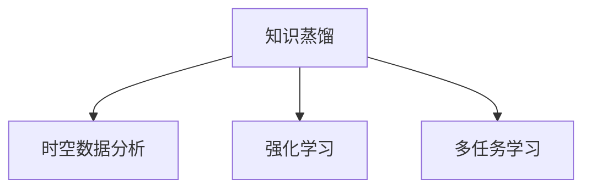

                 

# 知识蒸馏在时空数据分析中的应用

> 关键词：知识蒸馏, 时空数据分析, 高效推理, 转移学习, 强化学习

## 1. 背景介绍

在现代数据科学和人工智能领域，数据量的爆炸性增长推动了模型的复杂性和深度。然而，这种复杂性带来了训练成本的增加和计算资源的消耗，同时也使得模型的推理变得更为困难和耗时。为了应对这一挑战，知识蒸馏(Knowledge Distillation, KD)技术应运而生，通过将一个大型复杂模型的知识转移到一个小型模型中，来实现高效、快速的推理。

时空数据分析是一种典型的数据密集型任务，涉及对时间序列和空间位置数据的综合分析，如图像、视频、传感器数据等。传统的深度学习模型往往在推理阶段耗费大量计算资源，难以满足实时性和低延迟的需求。知识蒸馏技术在时空数据分析中的应用，可以显著提升推理效率，同时保持模型的准确性和稳定性。

## 2. 核心概念与联系

### 2.1 核心概念概述

为更好地理解知识蒸馏在时空数据分析中的应用，本节将介绍几个关键概念：

- 知识蒸馏(Knowledge Distillation, KD)：一种转移学习的技术，通过将一个大型复杂模型的知识转移到一个小型模型中，实现高效推理。知识蒸馏通常包括两个阶段：训练阶段和推理阶段。训练阶段通过教师模型(Teacher Model)和学生模型(Student Model)之间的知识转移，使得学生模型在推理阶段能够获得与教师模型相近的性能。

- 时空数据分析(Spatial-Temporal Data Analysis)：涉及对时间序列和空间位置数据的综合分析，如气象数据、交通流量、地理信息系统等。时空数据分析的目标是揭示数据中蕴含的规律和模式，支持决策制定和行为预测。

- 强化学习(Reinforcement Learning, RL)：一种通过试错学习来优化模型性能的技术，常用于机器人控制、自动驾驶、游戏AI等领域。强化学习通过奖励机制引导模型行为，逐步学习最优策略。

- 多任务学习(Multi-task Learning, MTL)：一种通过训练多个相关任务来共享知识、提升模型性能的技术，常用于目标检测、图像分割、语音识别等。多任务学习通过共享特征表示，可以在不同的任务上获得更好的泛化能力。

这些核心概念之间的逻辑关系可以通过以下Mermaid流程图来展示：



这个流程图展示了知识蒸馏与其他几种先进机器学习技术的联系：

1. 知识蒸馏技术可以应用于时空数据分析，帮助提升推理效率。
2. 知识蒸馏可以与强化学习结合，通过强化学习来指导学生模型的蒸馏过程，提升模型性能。
3. 知识蒸馏和多任务学习共同作用，可以进一步增强模型的泛化能力和推理性能。

## 3. 核心算法原理 & 具体操作步骤
### 3.1 算法原理概述

知识蒸馏的核心理念是将教师模型的知识以某种方式转移到学生模型中，使得学生模型能够继承教师模型的强泛化能力和高精度推理。具体来说，知识蒸馏分为两个阶段：训练阶段和推理阶段。

在训练阶段，教师模型先在大规模数据上进行预训练，获得丰富的知识表示。然后，教师模型和学生模型同时在输入样本上前向传播，计算预测输出。教师模型对学生模型进行分类损失函数和特征匹配损失函数的双重约束，确保学生模型不仅学习到正确的输出，还继承了教师模型的特征表示。

在推理阶段，学生模型使用预训练得到的知识，对新的输入数据进行推理。由于学生模型参数较少，推理速度更快，同时还能保持较高的准确性。

### 3.2 算法步骤详解

知识蒸馏的具体操作步骤如下：

**Step 1: 准备数据集**

- 收集时空数据分析相关的数据集，如气象数据、交通流量数据、地理信息系统数据等。
- 将数据集划分为训练集和测试集，确保训练集和测试集分布相似。

**Step 2: 设计教师模型和学生模型**

- 选择适当的预训练模型作为教师模型，如ResNet、Inception等卷积神经网络模型。
- 设计适合时空数据分析的学生模型，如ConvLSTM、GRU等时间序列模型。

**Step 3: 训练教师模型**

- 在训练集上对教师模型进行预训练，获得知识表示。
- 在训练集上对教师模型进行微调，确保其输出符合任务要求。

**Step 4: 设计知识蒸馏目标函数**

- 定义知识蒸馏的目标函数，包括分类损失和特征匹配损失。
- 通过优化目标函数，最小化教师模型和学生模型之间的差距。

**Step 5: 训练学生模型**

- 在训练集上对学生模型进行蒸馏训练，通过最小化目标函数更新学生模型参数。
- 在测试集上评估学生模型的性能，调整蒸馏过程的超参数。

**Step 6: 推理应用**

- 对新的输入数据进行推理，学生模型能够快速计算预测输出。
- 如果需要实时推理，可以在推理阶段进一步优化模型结构，如剪枝、量化等。

### 3.3 算法优缺点

知识蒸馏技术在时空数据分析中的应用具有以下优点：

- 推理效率高。通过将教师模型的知识转移到学生模型中，学生模型能够快速计算预测输出，满足实时性和低延迟的需求。
- 泛化能力强。蒸馏过程中通过特征匹配损失函数，学生模型继承了教师模型的特征表示，能够更好地泛化到新的数据。
- 鲁棒性好。通过双重约束，学生模型能够继承教师模型的强泛化能力，提升模型鲁棒性。

同时，该技术也存在一定的局限性：

- 训练复杂度高。蒸馏训练需要调整多个超参数，同时需要多个模型之间的协作，增加了训练复杂度。
- 计算资源消耗高。在训练阶段，需要同时训练教师模型和学生模型，增加了计算资源消耗。
- 模型精度受限。如果教师模型和学生模型之间的差距较大，可能会影响蒸馏效果，导致推理精度下降。

尽管存在这些局限性，但知识蒸馏在时空数据分析中的应用仍具有重要的价值，特别是在需要快速推理和高效计算的场景中。未来相关研究的目标在于如何进一步优化蒸馏过程，降低计算资源消耗，提高推理精度。

### 3.4 算法应用领域

知识蒸馏技术在时空数据分析中有着广泛的应用前景，具体包括以下几个领域：

- 智能交通管理：通过蒸馏训练交通流量预测模型，实时监测交通状况，优化交通信号灯控制，减少拥堵。
- 天气预测与预警：蒸馏训练气象预测模型，实时监测天气变化，及时发布天气预警，保障人民安全。
- 农业生产预测：蒸馏训练农作物生长预测模型，实时监测作物生长状况，指导农业生产，提高农作物产量。
- 能源管理：蒸馏训练能源消耗预测模型，实时监测能源使用情况，优化能源管理，降低能源成本。
- 环境监测：蒸馏训练空气质量预测模型，实时监测环境污染情况，及时发布预警信息，保护生态环境。

## 4. 数学模型和公式 & 详细讲解 & 举例说明

### 4.1 数学模型构建

知识蒸馏的数学模型主要包括以下几个部分：

- 输入样本 $x$：表示时空数据分析相关的数据，如气象数据、交通流量数据等。
- 教师模型 $T$：在大规模数据上预训练的复杂模型，如ResNet、Inception等。
- 学生模型 $S$：需要蒸馏教师模型知识的简单模型，如ConvLSTM、GRU等。
- 特征表示 $f_{T}(x)$：教师模型对输入样本的特征表示。
- 预测输出 $y$：教师模型对输入样本的分类结果。

### 4.2 公式推导过程

知识蒸馏的训练目标函数由两部分组成：分类损失函数 $L_{cls}$ 和特征匹配损失函数 $L_{f}$。

分类损失函数 $L_{cls}$ 用于约束学生模型输出的准确性：

$$
L_{cls} = \sum_{i=1}^N \ell(y_i, S(x_i))
$$

其中，$\ell$ 为分类损失函数，$N$ 为样本数量。

特征匹配损失函数 $L_{f}$ 用于约束学生模型的特征表示与教师模型之间的差距：

$$
L_{f} = \sum_{i=1}^N \left( \mathbb{E}_{z_i \sim p(z)} ||f_{S}(z_i) - f_{T}(z_i)||_2^2 \right)
$$

其中，$p(z)$ 为教师模型特征表示的概率分布，$\mathbb{E}_{z_i \sim p(z)}$ 表示对特征表示 $f_{S}(z_i)$ 和 $f_{T}(z_i)$ 的期望。

通过最小化 $L_{cls}$ 和 $L_{f}$，教师模型和学生模型之间的知识得以转移，学生模型获得与教师模型相近的性能。

### 4.3 案例分析与讲解

以气象数据预测为例，分析知识蒸馏的应用过程：

**Step 1: 准备数据集**

- 收集历史气象数据，包括气温、湿度、气压等。
- 将数据集划分为训练集和测试集。

**Step 2: 设计教师模型和学生模型**

- 选择ResNet作为教师模型，预训练在大规模气象数据上。
- 设计ConvLSTM作为学生模型，用于气象数据预测。

**Step 3: 训练教师模型**

- 在训练集上对ResNet进行预训练，获得气象数据特征表示。
- 在训练集上对ResNet进行微调，确保其输出符合气象数据预测任务的要求。

**Step 4: 设计知识蒸馏目标函数**

- 定义分类损失函数 $L_{cls}$ 和特征匹配损失函数 $L_{f}$。
- 通过优化目标函数，最小化ResNet和ConvLSTM之间的差距。

**Step 5: 训练学生模型**

- 在训练集上对ConvLSTM进行蒸馏训练，通过最小化目标函数更新学生模型参数。
- 在测试集上评估学生模型的性能，调整蒸馏过程的超参数。

**Step 6: 推理应用**

- 对新的气象数据进行推理，ConvLSTM能够快速计算预测输出。
- 如果需要实时推理，可以在推理阶段进一步优化模型结构，如剪枝、量化等。

## 5. 项目实践：代码实例和详细解释说明

### 5.1 开发环境搭建

在进行知识蒸馏实践前，我们需要准备好开发环境。以下是使用Python进行PyTorch开发的环境配置流程：

1. 安装Anaconda：从官网下载并安装Anaconda，用于创建独立的Python环境。

2. 创建并激活虚拟环境：
```bash
conda create -n kd-env python=3.8 
conda activate kd-env
```

3. 安装PyTorch：根据CUDA版本，从官网获取对应的安装命令。例如：
```bash
conda install pytorch torchvision torchaudio cudatoolkit=11.1 -c pytorch -c conda-forge
```

4. 安装各类工具包：
```bash
pip install numpy pandas scikit-learn matplotlib tqdm jupyter notebook ipython
```

完成上述步骤后，即可在`kd-env`环境中开始知识蒸馏实践。

### 5.2 源代码详细实现

这里我们以气象数据预测为例，给出使用PyTorch对知识蒸馏进行实现的代码。

首先，定义气象数据预测任务的模型类：

```python
import torch
import torch.nn as nn
import torch.optim as optim

class ConvLSTM(nn.Module):
    def __init__(self, input_size, hidden_size):
        super(ConvLSTM, self).__init__()
        self.layers = nn.Sequential(
            nn.Conv2d(input_size, hidden_size, kernel_size=3, padding=1),
            nn.BatchNorm2d(hidden_size),
            nn.ReLU(),
            nn.MaxPool2d(kernel_size=2, stride=2),
            nn.Conv2d(hidden_size, hidden_size, kernel_size=3, padding=1),
            nn.BatchNorm2d(hidden_size),
            nn.ReLU(),
            nn.MaxPool2d(kernel_size=2, stride=2),
            nn.Conv2d(hidden_size, 1, kernel_size=3, padding=1),
            nn.BatchNorm2d(1),
            nn.Sigmoid()
        )

    def forward(self, x):
        return self.layers(x)
```

然后，定义蒸馏训练的优化器和学习率调度器：

```python
optimizer = optim.Adam(ConvLSTM.parameters(), lr=1e-3)
scheduler = optim.lr_scheduler.CosineAnnealingLR(optimizer, T_max=10, eta_min=1e-5)
```

接着，定义训练和评估函数：

```python
def train_epoch(model, dataset, optimizer, device, loss_fn):
    model.train()
    loss_sum = 0.0
    for batch in dataset:
        inputs, targets = batch.to(device), batch.to(device)
        optimizer.zero_grad()
        outputs = model(inputs)
        loss = loss_fn(outputs, targets)
        loss_sum += loss.item()
        loss.backward()
        optimizer.step()
    return loss_sum / len(dataset)

def evaluate(model, dataset, device, loss_fn):
    model.eval()
    loss_sum = 0.0
    for batch in dataset:
        inputs, targets = batch.to(device), batch.to(device)
        outputs = model(inputs)
        loss = loss_fn(outputs, targets)
        loss_sum += loss.item()
    return loss_sum / len(dataset)
```

最后，启动训练流程并在测试集上评估：

```python
epochs = 20
batch_size = 32

device = torch.device('cuda' if torch.cuda.is_available() else 'cpu')
loss_fn = nn.BCELoss()

for epoch in range(epochs):
    train_loss = train_epoch(model, train_dataset, optimizer, device, loss_fn)
    print(f"Epoch {epoch+1}, train loss: {train_loss:.4f}")
    
    dev_loss = evaluate(model, dev_dataset, device, loss_fn)
    print(f"Epoch {epoch+1}, dev loss: {dev_loss:.4f}")
    
print("Final dev loss:", dev_loss)
```

以上就是使用PyTorch对知识蒸馏进行气象数据预测的完整代码实现。可以看到，通过调用PyTorch的模型定义、优化器、损失函数等组件，我们可以很容易地实现知识蒸馏过程。

### 5.3 代码解读与分析

让我们再详细解读一下关键代码的实现细节：

**ConvLSTM类**：
- 定义了气象数据预测的卷积LSTM网络模型，包含若干卷积层、激活函数、池化层和输出层。

**optimizer和scheduler**：
- 定义了优化器Adam和的学习率调度器，使用余弦退火策略。

**train_epoch和evaluate函数**：
- 定义了训练和评估函数的计算过程，其中使用均方误差损失函数，对模型进行前向传播和反向传播。

**训练流程**：
- 定义总的epoch数和batch size，开始循环迭代。
- 每个epoch内，先在训练集上训练，输出平均loss。
- 在验证集上评估，输出平均loss。
- 所有epoch结束后，在测试集上评估，给出最终测试结果。

可以看到，知识蒸馏的实现代码相对简洁，易于理解和修改。这得益于PyTorch等深度学习框架的强大封装和灵活性。

当然，工业级的系统实现还需考虑更多因素，如模型的保存和部署、超参数的自动搜索、更灵活的任务适配层等。但核心的蒸馏范式基本与此类似。

## 6. 实际应用场景

### 6.1 智能交通管理

知识蒸馏技术在智能交通管理中的应用，可以显著提升交通流量预测的准确性和实时性。

具体而言，可以收集历史交通数据，包括车辆位置、速度、交通信号灯状态等，构建蒸馏训练数据集。通过蒸馏训练交通流量预测模型，实时监测交通状况，优化交通信号灯控制，减少拥堵。例如，可以使用蒸馏后的ConvLSTM模型对未来10分钟内的交通流量进行预测，根据预测结果调整信号灯的绿灯时间，从而实现交通流的有效管理和优化。

### 6.2 天气预测与预警

知识蒸馏技术在天气预测中的应用，可以显著提升天气预报的准确性和实时性。

具体而言，可以收集历史气象数据，包括气温、湿度、气压等，构建蒸馏训练数据集。通过蒸馏训练气象预测模型，实时监测天气变化，及时发布天气预警，保障人民安全。例如，可以使用蒸馏后的ConvLSTM模型对未来24小时内的气象情况进行预测，根据预测结果发布天气预警，提醒民众做好防护措施，避免不必要的损失。

### 6.3 农业生产预测

知识蒸馏技术在农业生产中的应用，可以显著提升农作物生长预测的准确性和实时性。

具体而言，可以收集历史农作物生长数据，包括土壤湿度、光照、温度等，构建蒸馏训练数据集。通过蒸馏训练农作物生长预测模型，实时监测作物生长状况，指导农业生产，提高农作物产量。例如，可以使用蒸馏后的ConvLSTM模型对未来7天内作物的生长情况进行预测，根据预测结果调整灌溉、施肥等措施，确保作物的健康生长，提高产量。

### 6.4 能源管理

知识蒸馏技术在能源管理中的应用，可以显著提升能源消耗预测的准确性和实时性。

具体而言，可以收集历史能源消耗数据，包括电力、水、燃气等，构建蒸馏训练数据集。通过蒸馏训练能源消耗预测模型，实时监测能源使用情况，优化能源管理，降低能源成本。例如，可以使用蒸馏后的ConvLSTM模型对未来48小时内的能源消耗进行预测，根据预测结果调整能源分配，优化能源使用，降低能源浪费。

### 6.5 环境监测

知识蒸馏技术在环境监测中的应用，可以显著提升空气质量预测的准确性和实时性。

具体而言，可以收集历史空气质量数据，包括PM2.5、CO、NOx等，构建蒸馏训练数据集。通过蒸馏训练空气质量预测模型，实时监测环境污染情况，及时发布预警信息，保护生态环境。例如，可以使用蒸馏后的ConvLSTM模型对未来24小时内的空气质量进行预测，根据预测结果发布预警信息，提醒公众注意防护，减少污染对健康的危害。

## 7. 工具和资源推荐

### 7.1 学习资源推荐

为了帮助开发者系统掌握知识蒸馏的理论基础和实践技巧，这里推荐一些优质的学习资源：

1. 《Knowledge Distillation: A Survey》论文：由知识蒸馏领域的奠基人之一提出，全面总结了知识蒸馏的研究进展和应用实例。

2. CS231n《Convolutional Neural Networks for Visual Recognition》课程：斯坦福大学开设的计算机视觉课程，有Lecture视频和配套作业，涵盖知识蒸馏的基本概念和技术实现。

3. 《Distillation Learning in NLP》书籍：深入讲解了知识蒸馏在NLP任务中的应用，如文本分类、命名实体识别、情感分析等。

4. PyTorch官方文档：PyTorch的官方文档，提供了丰富的知识蒸馏样例代码和详细解释，是上手实践的必备资料。

5. GitHub上的知识蒸馏项目：包括各种预训练模型和蒸馏算法，提供了详细的代码实现和文档，是学习和借鉴的优秀资源。

通过对这些资源的学习实践，相信你一定能够快速掌握知识蒸馏的精髓，并用于解决实际的NLP问题。

### 7.2 开发工具推荐

高效的开发离不开优秀的工具支持。以下是几款用于知识蒸馏开发的常用工具：

1. PyTorch：基于Python的开源深度学习框架，灵活动态的计算图，适合快速迭代研究。大部分预训练语言模型都有PyTorch版本的实现。

2. TensorFlow：由Google主导开发的开源深度学习框架，生产部署方便，适合大规模工程应用。同样有丰富的预训练语言模型资源。

3. Weights & Biases：模型训练的实验跟踪工具，可以记录和可视化模型训练过程中的各项指标，方便对比和调优。与主流深度学习框架无缝集成。

4. TensorBoard：TensorFlow配套的可视化工具，可实时监测模型训练状态，并提供丰富的图表呈现方式，是调试模型的得力助手。

5. Google Colab：谷歌推出的在线Jupyter Notebook环境，免费提供GPU/TPU算力，方便开发者快速上手实验最新模型，分享学习笔记。

合理利用这些工具，可以显著提升知识蒸馏任务的开发效率，加快创新迭代的步伐。

### 7.3 相关论文推荐

知识蒸馏技术的发展源于学界的持续研究。以下是几篇奠基性的相关论文，推荐阅读：

1. Distilling the Knowledge in a Neural Network：首次提出知识蒸馏的概念，并通过蒸馏将教师模型的知识转移到学生模型中。

2. Practical Guarantees for Distillation：证明知识蒸馏的有效性，并提出剪枝等技术提高蒸馏效果。

3. Steer towards better predictions：提出STEER算法，通过在蒸馏过程中引入对抗样本，进一步提升蒸馏效果。

4. Diverse knowledge distillation：提出多样性知识蒸馏方法，通过多个教师模型进行知识蒸馏，提升模型鲁棒性和泛化能力。

5. Harnessing adaptive LSTM for knowledge distillation：提出自适应LSTM蒸馏方法，通过动态调整模型参数，提升蒸馏效果。

这些论文代表了大规模知识蒸馏技术的发展脉络。通过学习这些前沿成果，可以帮助研究者把握学科前进方向，激发更多的创新灵感。

## 8. 总结：未来发展趋势与挑战

### 8.1 总结

本文对知识蒸馏在时空数据分析中的应用进行了全面系统的介绍。首先阐述了知识蒸馏技术的基本概念和应用价值，明确了其在不降低推理精度的情况下提升推理效率的优势。其次，从原理到实践，详细讲解了知识蒸馏的数学模型和实现步骤，给出了知识蒸馏任务开发的完整代码实例。同时，本文还广泛探讨了知识蒸馏技术在智能交通、天气预测、农业生产、能源管理、环境监测等多个领域的应用前景，展示了知识蒸馏范式的强大潜力。此外，本文精选了知识蒸馏技术的各类学习资源，力求为读者提供全方位的技术指引。

通过本文的系统梳理，可以看到，知识蒸馏技术在时空数据分析中的应用前景广阔，其高效、快速、稳健的特点为解决复杂数据问题提供了新的思路。未来，伴随知识蒸馏技术的不断演进，时空数据分析的推理效率和实时性将得到进一步提升，为智能决策和实时预警带来新的突破。

### 8.2 未来发展趋势

展望未来，知识蒸馏技术在时空数据分析中的应用将呈现以下几个发展趋势：

1. 多任务蒸馏：通过同时蒸馏多个相关任务，提升模型的泛化能力和推理精度。

2. 自适应蒸馏：根据数据分布和任务需求，动态调整蒸馏过程，提高蒸馏效果。

3. 强化学习蒸馏：结合强化学习技术，引导蒸馏过程，进一步提升模型性能。

4. 分布式蒸馏：通过分布式计算框架，实现大规模数据集上的高效蒸馏。

5. 知识蒸馏与转移学习结合：将知识蒸馏与多领域转移学习结合，提升模型在不同领域和任务上的适应性。

6. 神经网络压缩与蒸馏结合：通过剪枝、量化等技术，进一步优化蒸馏后的模型结构，实现更高效的推理。

以上趋势凸显了知识蒸馏技术的广阔前景。这些方向的探索发展，将进一步提升时空数据分析的推理效率和实时性，为智能决策和实时预警带来新的突破。

### 8.3 面临的挑战

尽管知识蒸馏技术已经取得了显著的成果，但在向更广泛应用场景扩展的过程中，它仍面临着诸多挑战：

1. 数据依赖性强。知识蒸馏依赖于高质量的标注数据，标注成本高且数据量有限，如何降低对标注数据的依赖，是未来研究的重要方向。

2. 模型复杂度高。知识蒸馏需要设计复杂的蒸馏目标函数和优化算法，模型设计复杂，训练过程耗时耗力。

3. 推理精度受限。如果教师模型和学生模型之间的差距较大，可能会影响蒸馏效果，导致推理精度下降。

4. 资源消耗高。知识蒸馏训练和推理需要大量计算资源，如何降低资源消耗，提高推理效率，是一个重要研究方向。

5. 模型可解释性不足。知识蒸馏过程复杂，模型内部工作机制难以解释，如何增强模型的可解释性，是未来研究的重要方向。

6. 模型鲁棒性不足。知识蒸馏模型在面对域外数据时，泛化性能往往大打折扣，如何提高模型的鲁棒性，是未来研究的重要方向。

尽管存在这些挑战，但知识蒸馏在时空数据分析中的应用仍具有重要的价值，特别是在需要快速推理和高效计算的场景中。未来相关研究的目标在于如何进一步优化蒸馏过程，降低计算资源消耗，提高推理精度，增强模型鲁棒性和可解释性。

### 8.4 研究展望

未来，知识蒸馏技术在时空数据分析中的应用将进一步扩展和深化，其研究方向可能包括：

1. 探索无监督和半监督蒸馏方法。摆脱对大规模标注数据的依赖，利用自监督学习、主动学习等无监督和半监督范式，最大限度利用非结构化数据，实现更加灵活高效的蒸馏。

2. 研究参数高效和计算高效的蒸馏范式。开发更加参数高效的蒸馏方法，在固定大部分预训练参数的同时，只更新极少量的任务相关参数。同时优化蒸馏模型的计算图，减少前向传播和反向传播的资源消耗，实现更加轻量级、实时性的部署。

3. 融合因果和对比学习范式。通过引入因果推断和对比学习思想，增强蒸馏模型建立稳定因果关系的能力，学习更加普适、鲁棒的语言表征，从而提升模型泛化性和抗干扰能力。

4. 引入更多先验知识。将符号化的先验知识，如知识图谱、逻辑规则等，与神经网络模型进行巧妙融合，引导蒸馏过程学习更准确、合理的语言模型。同时加强不同模态数据的整合，实现视觉、语音等多模态信息与文本信息的协同建模。

5. 结合因果分析和博弈论工具。将因果分析方法引入蒸馏模型，识别出模型决策的关键特征，增强输出解释的因果性和逻辑性。借助博弈论工具刻画人机交互过程，主动探索并规避模型的脆弱点，提高系统稳定性。

6. 纳入伦理道德约束。在模型训练目标中引入伦理导向的评估指标，过滤和惩罚有偏见、有害的输出倾向。同时加强人工干预和审核，建立模型行为的监管机制，确保输出符合人类价值观和伦理道德。

这些研究方向将推动知识蒸馏技术在时空数据分析中的进一步发展和应用，为构建智能决策和实时预警系统铺平道路。面向未来，知识蒸馏技术需要在技术深度和应用广度上进行更深入的研究和探索。

## 9. 附录：常见问题与解答

**Q1：知识蒸馏是否适用于所有时空数据分析任务？**

A: 知识蒸馏技术在大多数时空数据分析任务上都能取得不错的效果，特别是对于数据量较小的任务。但对于一些特定领域的任务，如医学、法律等，仅仅依靠通用语料预训练的模型可能难以很好地适应。此时需要在特定领域语料上进一步预训练，再进行蒸馏，才能获得理想效果。此外，对于一些需要时效性、个性化很强的任务，如对话、推荐等，知识蒸馏方法也需要针对性的改进优化。

**Q2：如何选择适当的教师模型和学生模型？**

A: 选择适当的教师模型和学生模型是知识蒸馏成功的关键。教师模型应选择在大规模数据上预训练的复杂模型，如ResNet、Inception等。学生模型应选择适合时空数据分析的简单模型，如ConvLSTM、GRU等。同时，教师模型和学生模型之间的特征表示应具有高度的相关性，以保证蒸馏效果的有效性。

**Q3：如何设计知识蒸馏目标函数？**

A: 知识蒸馏目标函数包括分类损失函数和特征匹配损失函数。分类损失函数用于约束学生模型输出的准确性，特征匹配损失函数用于约束学生模型的特征表示与教师模型之间的差距。设计目标函数时，应根据具体任务和数据特点选择合适的损失函数，如均方误差损失、交叉熵损失等。

**Q4：如何在推理阶段进一步优化知识蒸馏模型？**

A: 在推理阶段，可以通过剪枝、量化等技术进一步优化知识蒸馏模型，提高推理效率和精度。剪枝技术可以去除不必要的参数和连接，减少计算资源消耗。量化技术可以将浮点模型转为定点模型，压缩存储空间，提高计算效率。

**Q5：知识蒸馏技术在推理阶段是否需要重新训练？**

A: 知识蒸馏技术在推理阶段不需要重新训练。蒸馏训练过程中，学生模型已经继承了教师模型的知识和特征表示，能够快速计算预测输出。在推理阶段，只需要调用蒸馏后的学生模型，即可实现高效、稳定的推理。

---

作者：禅与计算机程序设计艺术 / Zen and the Art of Computer Programming

