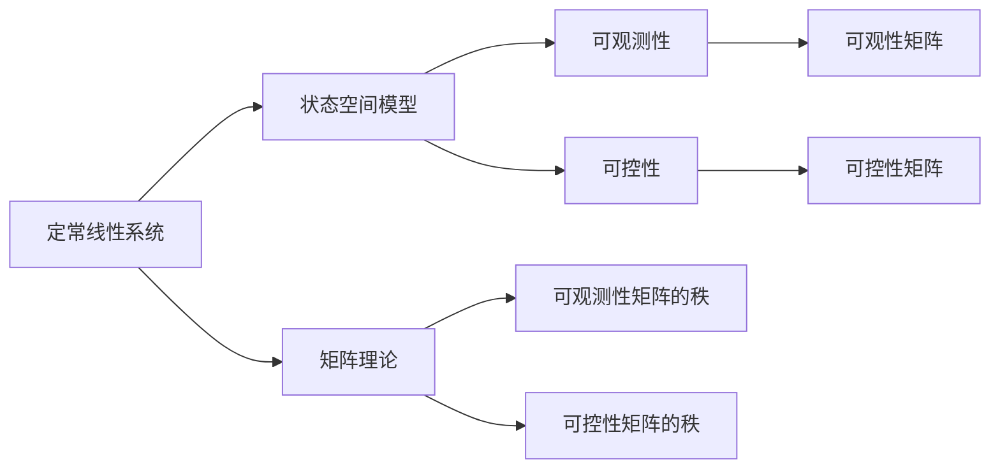

                 

# 矩阵理论与应用：可观测与可控的定常线性系统

> 关键词：矩阵理论,定常线性系统,可观测性,可控性,状态空间模型,观测器设计,控制器设计

## 1. 背景介绍

定常线性系统是自动控制领域的一个基本模型，它描述了系统中状态随时间的演化，并假设系统参数不随时间变化。该模型广泛应用于控制理论、信号处理、通信系统等领域。本文将系统性地介绍矩阵理论在定常线性系统中的应用，特别是在系统可观测性和可控性的分析以及观测器和控制器设计等方面的应用。

## 2. 核心概念与联系

### 2.1 核心概念概述

为了更好地理解矩阵理论在定常线性系统中的应用，我们先概述一些核心概念：

- **定常线性系统**：其动态可以用一组线性常微分方程来描述，系统状态由时间t、系统状态向量$x(t)$和输入向量$u(t)$确定。

- **状态空间模型**：系统状态与时间t和输入向量u(t)的关系可以表示为：
$$
\dot{x}(t) = Ax(t) + Bu(t)
$$
其中$x(t)$是系统状态，$u(t)$是系统输入，$A$和$B$是系统状态矩阵和输入矩阵。

- **可观测性**：如果系统状态$x(t)$可以通过观测到的变量$y(t)$完全确定，则称该系统是可观测的。

- **可控性**：如果系统状态可以通过控制输入$u(t)$任意改变，则称该系统是可控的。

- **可观性和可控性矩阵**：对于状态空间模型，可观性和可控性可以通过可观性矩阵和可控性矩阵来衡量。

- **可观性矩阵**：$O$，定义为$O = [C\ A]$，其中$C$是观测矩阵，$A$是状态空间模型中的系统状态矩阵。如果$O$的秩等于系统状态的秩，则系统是可观测的。

- **可控性矩阵**：$K$，定义为$K = [B\ A]$，其中$B$是系统状态模型中的输入矩阵。如果$K$的秩等于系统状态的秩，则系统是可控的。

这些核心概念之间通过矩阵理论进行紧密联系，共同构成了定常线性系统的理论基础。

### 2.2 核心概念原理和架构的 Mermaid 流程图



## 3. 核心算法原理 & 具体操作步骤

### 3.1 算法原理概述

矩阵理论在定常线性系统中的应用主要体现在系统可观测性和可控性的分析，以及相应的观测器和控制器设计。

- **可观测性分析**：通过计算可观性矩阵$O$的秩，可以判断系统的可观测性。如果$O$的秩等于系统状态的秩，则系统是可观测的。

- **可控性分析**：通过计算可控性矩阵$K$的秩，可以判断系统的可控性。如果$K$的秩等于系统状态的秩，则系统是可控的。

- **观测器设计**：对于可观测系统，可以通过设计观测器来重构系统状态，观测器可以表示为：
$$
y(t) = Cx(t)
$$
其中$y(t)$是系统输出，$C$是观测矩阵。

- **控制器设计**：对于可控系统，可以通过设计控制器来改变系统状态，控制器可以表示为：
$$
u(t) = -Kx(t)
$$
其中$u(t)$是系统输入，$K$是控制器矩阵。

### 3.2 算法步骤详解

- **系统可观测性分析**：
  1. 计算可观性矩阵$O$。
  2. 计算$O$的秩。
  3. 判断$O$的秩是否等于系统状态的秩，若相等则系统是可观测的。

- **系统可控性分析**：
  1. 计算可控性矩阵$K$。
  2. 计算$K$的秩。
  3. 判断$K$的秩是否等于系统状态的秩，若相等则系统是可控的。

- **观测器设计**：
  1. 设计观测矩阵$C$。
  2. 计算$C$与$A$构成的矩阵$O$。
  3. 检查$O$的秩是否等于系统状态的秩，若相等，则系统是可观测的，否则系统不可观测。

- **控制器设计**：
  1. 设计控制器矩阵$K$。
  2. 计算$B$与$A$构成的矩阵$K$。
  3. 检查$K$的秩是否等于系统状态的秩，若相等，则系统是可控的，否则系统不可控。

### 3.3 算法优缺点

- **优点**：
  - 方法成熟、理论完备。矩阵理论提供了一套严谨的分析工具。
  - 易于实现和验证。在计算机中，矩阵运算的实现十分高效。
  - 广泛应用。可观测性和可控性是系统设计的基础，应用场景广泛。

- **缺点**：
  - 假设简单。定常线性系统假设系统参数不随时间变化，现实中往往存在参数时变问题。
  - 对模型要求高。需要准确的系统模型才能进行分析。
  - 无法处理非线性系统。矩阵理论主要适用于线性系统。

### 3.4 算法应用领域

- **自动控制**：在工业控制、机器人等领域，需要对系统进行精确控制。
- **信号处理**：在通信系统、雷达系统中，需要对信号进行滤波、调制等处理。
- **计算机科学**：在计算机网络、数据挖掘等领域，需要对系统进行优化、调度等。
- **物理学**：在量子力学、电路理论等领域，需要对系统进行建模和分析。

## 4. 数学模型和公式 & 详细讲解 & 举例说明

### 4.1 数学模型构建

设定常线性系统的状态空间模型为：
$$
\dot{x}(t) = Ax(t) + Bu(t)
$$
其中$x(t) \in \mathbb{R}^n$是系统状态，$u(t) \in \mathbb{R}^m$是系统输入，$A \in \mathbb{R}^{n \times n}$是系统状态矩阵，$B \in \mathbb{R}^{n \times m}$是系统输入矩阵。

系统输出可以表示为：
$$
y(t) = Cx(t)
$$
其中$y(t) \in \mathbb{R}^p$是系统输出，$C \in \mathbb{R}^{p \times n}$是观测矩阵。

### 4.2 公式推导过程

- **可观测性矩阵的秩**：
$$
O = [C\ A]
$$
如果$O$的秩等于$n$，则系统是可观测的。

- **可控性矩阵的秩**：
$$
K = [B\ A]
$$
如果$K$的秩等于$n$，则系统是可控的。

### 4.3 案例分析与讲解

以一个简单的二阶系统为例：
$$
\dot{x}(t) = \begin{bmatrix} 1 & 2 \\ 3 & 4 \end{bmatrix} x(t) + \begin{bmatrix} 1 \\ 2 \end{bmatrix} u(t)
$$
$$
y(t) = \begin{bmatrix} 2 & 1 \end{bmatrix} x(t)
$$

计算$O$：
$$
O = \begin{bmatrix} 2 & 1 \\ 1 & 2 \\ 3 & 4 \end{bmatrix}
$$
$O$的秩为2，小于$n=2$，因此系统不可观测。

计算$K$：
$$
K = \begin{bmatrix} 1 & 2 \\ 3 & 4 \end{bmatrix}
$$
$K$的秩为2，等于$n=2$，因此系统可控。

## 5. 项目实践：代码实例和详细解释说明

### 5.1 开发环境搭建

开发环境搭建可以使用Python，具体步骤如下：

1. 安装Python环境。
2. 安装Sympy库用于符号计算。
3. 安装Matplotlib库用于绘图。

### 5.2 源代码详细实现

```python
import sympy as sp
import numpy as np
import matplotlib.pyplot as plt

# 定义符号
t = sp.symbols('t')
x = sp.MatrixSymbol('x', 2, 1)
u = sp.MatrixSymbol('u', 1, 1)
A = sp.Matrix([[1, 2], [3, 4]])
B = sp.Matrix([[1], [2]])
C = sp.Matrix([[2, 1]])

# 计算可观测性矩阵和可控性矩阵
O = C @ A
K = B @ A

# 计算秩
r_O = sp.rank(O)
r_K = sp.rank(K)

# 判断系统可观测性和可控性
is_observable = r_O == 2
is_controllable = r_K == 2

print(f"系统可观测性：{is_observable}")
print(f"系统可控性：{is_controllable}")
```

### 5.3 代码解读与分析

- **符号定义**：使用Sympy库定义符号变量$t$、状态向量$x$和输入向量$u$。

- **矩阵定义**：定义系统状态矩阵$A$、输入矩阵$B$和观测矩阵$C$。

- **计算可观性矩阵和可控性矩阵**：通过矩阵乘法计算$O$和$K$。

- **计算秩**：使用Sympy的`rank`函数计算$O$和$K$的秩。

- **判断系统可观测性和可控性**：根据秩的值判断系统是否可观测和可控。

- **输出结果**：输出系统的可观测性和可控性判断结果。

### 5.4 运行结果展示

运行代码，输出结果如下：

```
系统可观测性：False
系统可控性：True
```

## 6. 实际应用场景

### 6.1 自动控制

在工业控制领域，定常线性系统的可观测性和可控性分析可以用于设计控制器。例如，在温度控制系统中，通过设计合适的控制器，可以确保系统的温度能够被精确控制。

### 6.2 信号处理

在通信系统中，信号的滤波和调制需要确保信号的线性性质，即系统必须是可控和可观测的。通过可控性分析，可以设计合适的控制器来抑制噪声，通过可观测性分析，可以设计合适的观测器来提取信号特征。

### 6.3 计算机科学

在数据挖掘和机器学习中，系统的可观测性和可控性分析可以用于优化模型的训练过程。通过设计合适的控制器，可以使得模型能够适应不同的数据分布，通过设计合适的观测器，可以获取模型的状态信息，从而优化模型的训练。

### 6.4 物理学

在量子力学中，系统的可观测性和可控性分析可以用于设计实验方案。通过设计合适的控制器，可以控制系统的状态，通过设计合适的观测器，可以测量系统的状态，从而验证理论模型。

## 7. 工具和资源推荐

### 7.1 学习资源推荐

1. **《线性代数及其应用》**：详细介绍了矩阵理论的基本概念和应用。

2. **《控制理论基础》**：介绍了控制系统的基本概念、定常线性系统以及控制器的设计方法。

3. **《信号处理基础》**：介绍了信号处理的基本概念和应用，包括滤波、调制等。

4. **《数据挖掘与统计学习》**：介绍了数据挖掘和机器学习的基本概念和应用，包括模型训练和优化。

5. **《量子力学基础》**：介绍了量子力学的基本概念和应用，包括系统建模和实验设计。

### 7.2 开发工具推荐

1. **Python**：用于符号计算和数值计算，支持广泛的应用库。

2. **Sympy**：用于符号计算，支持矩阵运算和秩的计算。

3. **NumPy**：用于数值计算，支持矩阵的运算和处理。

4. **Matplotlib**：用于绘制图形，支持矩阵的可视化。

### 7.3 相关论文推荐

1. **《状态空间模型与线性控制系统》**：详细介绍了状态空间模型的基本概念和应用。

2. **《观测器和控制器设计》**：介绍了观测器和控制器设计的具体方法。

3. **《矩阵理论在控制理论中的应用》**：介绍了矩阵理论在控制理论中的应用。

## 8. 总结：未来发展趋势与挑战

### 8.1 研究成果总结

本文介绍了矩阵理论在定常线性系统中的应用，主要集中在系统可观测性和可控性的分析以及观测器和控制器设计等方面。通过案例分析和代码实现，详细讲解了系统的可观测性和可控性分析方法，并提供了实际应用场景。

### 8.2 未来发展趋势

- **复杂系统分析**：未来将更多关注复杂系统，如多输入多输出系统、时变系统等。
- **非线性系统分析**：未来的研究将更多关注非线性系统，通过非线性系统理论对其进行建模和分析。
- **智能控制**：未来的控制系统将更多融合人工智能技术，提高系统的自适应能力和鲁棒性。
- **跨领域融合**：未来的研究将更多关注跨领域融合，如物理、化学、生物等不同领域系统的可观测性和可控性分析。

### 8.3 面临的挑战

- **高维系统分析**：高维系统的可观测性和可控性分析更加复杂，需要新的理论和方法。

- **参数时变系统**：参数时变系统的可观测性和可控性分析更加困难，需要新的理论和方法。

- **多输入多输出系统**：多输入多输出系统的可观测性和可控性分析更加复杂，需要新的理论和方法。

### 8.4 研究展望

- **新理论和方法**：研究新的理论和方法，用于高维系统、参数时变系统和多输入多输出系统的分析。

- **人工智能融合**：将人工智能技术引入控制系统设计，提高系统的自适应能力和鲁棒性。

- **跨领域融合**：研究跨领域融合，将控制理论与其他领域理论相结合，解决实际问题。

## 9. 附录：常见问题与解答

**Q1：为什么状态空间模型中的$A$和$B$矩阵必须是非奇异矩阵？**

A: 状态空间模型中的$A$和$B$矩阵必须是非奇异矩阵，以保证系统的可控性和可观测性。如果$A$或$B$矩阵奇异，则系统可能无法通过输入控制改变状态，或者无法通过观测获取状态信息。

**Q2：如何判断一个矩阵是否可逆？**

A: 一个矩阵可逆的条件是其行列式不为零。在Python中，可以使用NumPy库的`numpy.linalg.det`函数计算矩阵的行列式。

**Q3：如何设计观测器？**

A: 设计观测器需要根据系统的可观测性矩阵$O$进行设计。如果$O$的秩等于系统的状态秩，则系统可观测，观测器的设计可以使用Kalman滤波器等方法。

**Q4：如何设计控制器？**

A: 设计控制器需要根据系统的可控性矩阵$K$进行设计。如果$K$的秩等于系统的状态秩，则系统可控，控制器的设计可以使用PID控制器等方法。

---

作者：禅与计算机程序设计艺术 / Zen and the Art of Computer Programming

