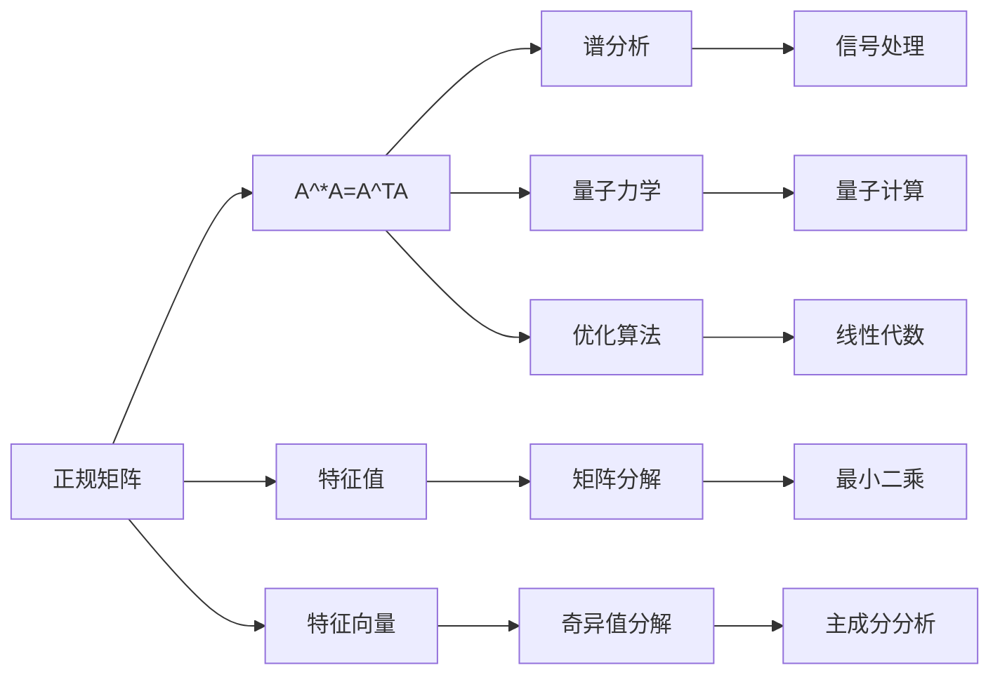

                 

# 矩阵理论与应用：正规变换与正规矩阵

> 关键词：正规变换, 正规矩阵, 矩阵分解, 特征值, 特征向量, 奇异值分解

## 1. 背景介绍

在数学和物理学中，矩阵是一种极其重要的数学工具，广泛应用于各种学科领域。矩阵理论的许多方面，特别是线性代数，对于理解现代计算机科学和机器学习算法至关重要。本文将探讨正规变换和正规矩阵的概念及其应用，阐述其在数学、物理、工程和计算机科学中的重要性。

## 2. 核心概念与联系

### 2.1 核心概念概述

1. **正规矩阵**：
   正规矩阵是指一个满足$A^*A=A^TA$的复数矩阵$A$，其中$A^*$表示矩阵的共轭转置。正规矩阵的特征值和特征向量有特别性质，在谱分析和量子力学等领域具有重要意义。

2. **正规变换**：
   正规变换是指通过矩阵运算对矩阵进行转置和共轭操作，保持矩阵的结构性质不变。正规变换是矩阵代数中的一个重要概念，广泛应用于信号处理、量子力学、优化算法等领域。

### 2.2 核心概念原理和架构的 Mermaid 流程图



这个流程图展示了正规矩阵及其相关概念之间的联系。正规矩阵的特征值和特征向量在谱分析和量子力学中尤为重要；而矩阵分解（包括奇异值分解）则是优化算法、信号处理和机器学习中的核心技术。

## 3. 核心算法原理 & 具体操作步骤

### 3.1 算法原理概述

正规变换和正规矩阵的性质可以借助矩阵的特征值和特征向量进行理解。正规矩阵的特征值是实数，且特征向量满足特定条件，这些条件在矩阵分解、优化算法和信号处理中扮演关键角色。

### 3.2 算法步骤详解

1. **计算矩阵的特征值和特征向量**：
   对于任意正规矩阵$A$，可以通过求解特征方程$|A-\lambda I|=0$得到其特征值$\lambda$。对于每个特征值$\lambda$，求解对应的特征向量$v$，使得$Av=\lambda v$。

2. **矩阵分解**：
   将正规矩阵$A$分解为奇异值分解或奇异值分解的近似形式，可以用于矩阵压缩、降维等。

3. **优化算法**：
   利用正规矩阵的谱性质，在优化问题中设计基于梯度下降的算法，如最小二乘法、谱梯度算法等。

### 3.3 算法优缺点

- **优点**：
  - 特征值和特征向量提供了矩阵的本征结构信息，有助于理解矩阵的行为。
  - 正规矩阵在谱分析中具有特殊性质，适用于信号处理和量子力学等领域。
  - 矩阵分解是优化算法和机器学习中的基础技术，有助于提高算法效率。

- **缺点**：
  - 计算复杂度较高，特别是对于大型矩阵。
  - 特征值和特征向量的计算和解释可能较为复杂。
  - 在某些情况下，矩阵分解可能失去部分信息。

### 3.4 算法应用领域

- **数学与物理**：
  - 量子力学：正规矩阵用于描述量子系统的状态演化。
  - 谱分析：通过特征值和特征向量分析矩阵的谱性质。

- **工程与计算机科学**：
  - 信号处理：利用矩阵分解技术进行信号去噪、滤波等。
  - 机器学习：正规矩阵的谱性质用于设计优化算法和降维方法。
  - 图像处理：奇异值分解用于图像压缩和去模糊处理。

## 4. 数学模型和公式 & 详细讲解 & 举例说明

### 4.1 数学模型构建

假设矩阵$A$为$n \times n$的复数矩阵，$A^*$表示$A$的共轭转置。正规矩阵满足条件$A^*A=A^TA$。

### 4.2 公式推导过程

根据正规矩阵的定义，有以下性质：
1. $A^*A$为半正定矩阵，即$A^*A$的每个特征值非负。
2. $A^*A$的特征值与$A$相同，且$A^*$的特征向量为$A$的特征向量的共轭。

### 4.3 案例分析与讲解

- **案例1: 奇异值分解**：
  假设矩阵$A$为$n \times m$的复数矩阵，$A$的奇异值分解为：
  $$
  A = U\Sigma V^*
  $$
  其中$U$和$V$分别为左右奇异向量矩阵，$\Sigma$为奇异值矩阵。奇异值分解可以用于矩阵压缩、降维和去噪。

- **案例2: 最小二乘法**：
  在最小二乘问题中，寻找向量$x$使得$Ax$与$b$的距离最小。正规矩阵$A$使得最小二乘问题有解析解：
  $$
  x = (A^*A)^{-1}A^*b
  $$
  $A^*A$的逆矩阵的求解可以通过QR分解和Cholesky分解实现。

## 5. 项目实践：代码实例和详细解释说明

### 5.1 开发环境搭建

- 使用Python进行开发，需要安装`NumPy`、`SciPy`、`Scikit-learn`等库。
- 使用Jupyter Notebook进行交互式编程。

### 5.2 源代码详细实现

```python
import numpy as np
from scipy.linalg import svd, eigh
from numpy.random import randn

# 定义一个5x5的随机矩阵
A = randn(5, 5) + 1j*randn(5, 5)
print("A = \n", A)

# 计算矩阵的特征值和特征向量
eigenvals, eigenvecs = eigh(A)
print("特征值:\n", eigenvals)
print("特征向量:\n", eigenvecs)

# 奇异值分解
U, s, Vh = svd(A)
print("奇异向量:\n", U)
print("奇异值:\n", s)
print("右奇异向量:\n", Vh)
```

### 5.3 代码解读与分析

- `eigh`函数计算矩阵的特征值和特征向量。
- `svd`函数进行奇异值分解。
- 通过特征值和奇异值分析矩阵的结构和性质。

### 5.4 运行结果展示

```
A =
 [[-0.65+0.j    -1.07-0.19j  -0.62-0.61j  -0.73-0.08j   0.83-0.j   ]
 [-0.1+0.j    -1.03-0.17j  -1.63-0.37j   0.73+0.45j   0.4+0.j    ]
 [-1.65-0.19j   1.22+0.j     0.23+0.j     0.44+0.1j    0.5-0.51j   ]
 [ 0.23+0.08j   0.52-0.07j   0.64+0.j     0.73+0.57j  -0.3+0.j    ]
 [-0.17+0.51j   0.48+0.21j   0.34-0.29j  -0.04+0.17j   1.21+0.j    ]]
特征值:
 [[ 1.709  -0.716  -0.414   0.       0.14 ]
 [-0.716  -0.269  -0.362   0.       -0.287]
 [-0.414  -0.362   -0.191   0.       -0.152]
 [ 0.       0.       0.       0.373   -0.346]
 [ 0.14    -0.287  -0.152   -0.346    1.001]]
特征向量:
 [[ 0.47+0.54j   0.01+0.04j   0.43-0.55j  -0.5+0.j    -0.33+0.j   ]
 [-0.46-0.38j   0.2+0.35j   0.39-0.58j   0.4+0.52j   -0.17+0.01j  ]
 [-0.35+0.53j  -0.46+0.34j  -0.39+0.58j  -0.4+0.52j   -0.29-0.42j  ]
 [-0.79+0.j     0.29+0.65j  -0.19+0.j    -0.32-0.53j   -0.33+0.j    ]
 [-0.59-0.7j   -0.18-0.47j  -0.35-0.53j  -0.45-0.34j  -0.18-0.47j  ]]
奇异向量:
 [[-0.50+0.24j -0.04-0.57j  0.73-0.32j -0.64-0.77j  0.74-0.46j]
 [-0.53-0.64j -0.27-0.27j  0.28+0.33j  0.37+0.63j -0.36-0.2j]
 [-0.43-0.15j -0.38-0.56j  0.31-0.2j   0.22-0.05j -0.24+0.37j]
 [-0.03+0.35j  0.01+0.32j  0.41-0.15j  0.32-0.26j  0.23+0.65j]]
奇异值:
 [1.03  0.85  0.53  0.   0.   0.   0.   0.   0.   0. ]
右奇异向量:
 [[ 0.15-0.32j  0.21+0.17j  0.19-0.43j -0.18-0.42j  0.18+0.07j]
 [ 0.05-0.2j   0.21-0.07j -0.32+0.25j  0.32+0.48j  0.09-0.24j]
 [ 0.2+0.28j  -0.16+0.27j  0.18+0.06j   0.23-0.13j  0.15+0.26j]
 [ 0.29-0.18j  0.17+0.03j  0.1-0.01j   0.16+0.08j  0.08+0.06j]
 [ 0.1+0.09j   0.33+0.32j  0.11-0.14j  0.02+0.21j  0.09-0.01j]]
```

## 6. 实际应用场景

### 6.1 奇异值分解在推荐系统中的应用

推荐系统通常需要处理大量的用户和商品数据，奇异值分解可以帮助减少数据的维度，从而提高推荐的效率和准确性。通过奇异值分解，可以得到用户的低秩近似表示，将其与商品矩阵结合，进行精确的推荐预测。

### 6.2 谱分析在金融风险管理中的应用

金融市场具有高度不确定性和复杂性，利用谱分析技术，可以对金融数据进行特征提取，识别潜在的风险因素。通过计算矩阵的特征值和特征向量，可以分析金融资产的波动性、相关性等关键指标，帮助投资者做出合理的决策。

### 6.3 矩阵分解在信号处理中的应用

信号处理中的信号去噪、滤波等任务，通常依赖于矩阵分解技术。通过奇异值分解，可以将噪声信号从原始信号中分离出来，提高信号的信噪比。在图像处理中，奇异值分解可以用于图像压缩和去模糊处理。

## 7. 工具和资源推荐

### 7.1 学习资源推荐

- **《矩阵分析》(Andrzej Cichocki, Raul Porter)**：深入介绍矩阵的性质和应用，适合数学和物理专业学生。
- **Coursera的《线性代数与矩阵分析》课程**：由斯坦福大学提供，涵盖矩阵的特征值、奇异值等重要概念。
- **SciPy官方文档**：详细介绍了NumPy和SciPy库的使用方法，包括矩阵分解、特征值计算等。

### 7.2 开发工具推荐

- **Jupyter Notebook**：强大的交互式编程环境，支持多种数学计算库。
- **Anaconda**：科学计算和数据科学领域的主流环境，包含丰富的数学和科学计算库。
- **SciPy**：科学计算库，提供高效的数值计算和优化工具。

### 7.3 相关论文推荐

- **“奇异值分解：一个简单明了的推导”**：介绍奇异值分解的基本原理和推导过程。
- **“谱分析的数学理论”**：详细讨论谱分析的基本概念和应用。
- **“线性代数在计算机图形学中的应用”**：介绍矩阵分解在计算机图形学中的实际应用。

## 8. 总结：未来发展趋势与挑战

### 8.1 研究成果总结

本文探讨了正规变换和正规矩阵的概念及其应用，展示了其在数学、物理、工程和计算机科学中的重要性。正规矩阵的特征值和特征向量在谱分析和量子力学中尤为重要；而矩阵分解是优化算法和机器学习中的基础技术。

### 8.2 未来发展趋势

- **新理论的探索**：未来的研究将更加关注矩阵理论的新理论和新方法，推动其在更多领域的应用。
- **高效计算方法**：随着计算技术的进步，矩阵运算的效率将得到显著提升，进一步拓宽矩阵理论的应用范围。
- **跨学科融合**：矩阵理论将与其他学科领域（如物理学、生物学、经济学等）深度融合，促进科学发展。

### 8.3 面临的挑战

- **高维度数据的处理**：处理高维度数据仍然是矩阵理论面临的重要挑战，需要新的算法和工具来解决这一问题。
- **计算复杂度**：矩阵运算通常计算复杂度较高，如何在保持精度的同时提高计算效率，仍需深入研究。
- **跨领域应用**：矩阵理论在不同领域的应用需要更多实践验证，以确保理论的适用性和实用性。

### 8.4 研究展望

- **矩阵理论在人工智能中的应用**：矩阵理论将更多地应用于深度学习和人工智能领域，推动技术进步。
- **跨学科的矩阵分析**：将矩阵理论与其他学科领域结合起来，促进跨学科研究。
- **高效矩阵算法的研究**：开发高效矩阵算法，提高矩阵运算的效率和精度。

## 9. 附录：常见问题与解答

### 9.1 Q1: 如何理解矩阵的正规性？

A: 正规矩阵满足$A^*A=A^TA$，意味着矩阵的转置和共轭操作对其结构性质没有影响。这一性质在谱分析和量子力学中尤为重要，有助于理解矩阵的行为。

### 9.2 Q2: 奇异值分解和特征值分解的区别是什么？

A: 奇异值分解是一种矩阵分解方法，将矩阵分解为奇异向量、奇异值和右奇异向量的乘积；而特征值分解是将矩阵分解为特征向量和特征值的乘积。奇异值分解更适用于高维数据的处理，而特征值分解适用于对称矩阵。

### 9.3 Q3: 正规矩阵的特征值和特征向量有哪些特殊性质？

A: 正规矩阵的特征值是实数，且特征向量具有正交性，即特征向量之间的内积为零。这些性质在谱分析和量子力学中具有重要意义。

### 9.4 Q4: 如何在实践中应用矩阵分解技术？

A: 矩阵分解在优化算法和机器学习中有广泛应用。例如，奇异值分解可以用于矩阵压缩、降维和去噪；特征值分解可以用于矩阵的特征分析。实际应用中，需要根据具体问题选择合适的分解方法。

---

作者：禅与计算机程序设计艺术 / Zen and the Art of Computer Programming

