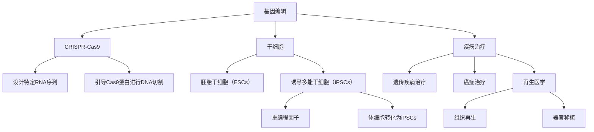

                 

# 硅谷生物科技:基因编辑与干细胞

> 关键词：基因编辑,CRISPR-Cas9,干细胞,诱导多能干细胞(iPSC),疾病治疗,再生医学

## 1. 背景介绍

### 1.1 问题由来

基因编辑技术和干细胞研究是当今生物科技领域最为前沿和具有颠覆性的技术之一。近年来，这一领域在基础研究与实际应用方面都取得了飞速进展，引领了生物医学、农业、环保等领域的发展方向。特别是硅谷生物科技巨头对这两项技术的关注与投入，更是将其推向了风口浪尖。

基因编辑技术（Genome Editing）是利用外部手段改变生物体内基因序列的技术。其中最为人所熟知的是CRISPR-Cas9系统，它是一种由细菌自然演化出来的基因编辑工具，能在几小时内高效、精确地编辑基因。干细胞研究则集中在诱导多能干细胞（iPSC）的开发上，这种经过重编程后的多功能干细胞可以在实验室培养，为疾病治疗、组织再生、器官移植等提供重要工具。

### 1.2 问题核心关键点

基因编辑与干细胞技术在应用中面临的挑战主要包括：

1. **技术精度与效率**：基因编辑工具在精准性、效率、安全性等方面需要进一步优化，以避免误编辑和脱靶效应。
2. **伦理道德问题**：编辑胚胎基因涉及伦理道德，需要进行严格的法规和伦理审查。
3. **临床验证与可扩展性**：在疾病治疗和再生医学中的应用效果，需要通过临床试验进行验证，同时考虑技术的可扩展性和商业化前景。
4. **数据与分析能力**：强大的数据处理与分析能力是理解基因编辑与干细胞研究成果、优化实验设计、预测实验结果的重要保证。

这些核心问题将贯穿于接下来的内容中，我们将在后续章节中逐一探讨。

## 2. 核心概念与联系

### 2.1 核心概念概述

- **基因编辑**：利用技术手段直接修改生物体DNA序列的过程。通过基因编辑，科学家可以治疗遗传疾病、改良农作物品种、增强生物体的抗逆性等。
- **CRISPR-Cas9**：一种由细菌自然演化而来的基因编辑工具，通过设计特定的RNA序列引导Cas9蛋白进行DNA切割，实现基因编辑。
- **干细胞**：一类具有自我更新和多向分化潜能的细胞，包括胚胎干细胞（ESCs）和诱导多能干细胞（iPSCs）。iPSCs是通过重编程技术将体细胞转化为多能干细胞。
- **诱导多能干细胞(iPSCs)**：利用重编程因子将体细胞重编程为具有胚胎干细胞特征的干细胞，可用于疾病治疗、组织再生、器官移植等领域。
- **疾病治疗**：利用基因编辑和干细胞技术，针对特定遗传疾病、癌症等进行治疗。
- **再生医学**：利用干细胞技术实现组织和器官再生，为某些难以治愈的疾病提供新的治疗途径。

这些核心概念构成了基因编辑与干细胞技术的基石，通过基因编辑实现对基因的精确修改，利用干细胞再生修复生物体损伤，共同推动了生物医学的进步。

### 2.2 核心概念原理和架构的 Mermaid 流程图



这个流程图展示了基因编辑与干细胞技术的基本架构：通过基因编辑实现基因的精确修改，利用干细胞实现损伤的修复与再生。

## 3. 核心算法原理 & 具体操作步骤

### 3.1 算法原理概述

基因编辑的核心算法原理是利用特定的RNA序列（称为单指导RNA, sgRNA）引导Cas9蛋白进行DNA切割，导致双链DNA断裂（DSB）。细胞在修复DSB时，若未发生错误，便会发生同源重组修复（HDR），从而实现基因敲入、敲除等操作。

具体步骤包括：
1. **设计sgRNA**：根据目标基因序列设计sgRNA序列。
2. **构建质粒**：将Cas9基因与sgRNA序列结合，构建质粒载体。
3. **转染细胞**：将质粒载体转染到目标细胞中。
4. **筛选编辑细胞**：通过基因编辑鉴定，筛选出成功编辑的细胞。

### 3.2 算法步骤详解

下面详细解释基因编辑的步骤：

1. **设计sgRNA**：
   - 根据目标基因序列，设计能与之精确结合的sgRNA序列。
   - 使用在线工具（如Bioinformatics 4.8）进行序列比对，避免与内源基因序列发生非特异性结合。
   - 序列长度一般控制在80-100bp之间，5'端加上丙氨酸序列（GCCAAGCG），以提高RNA与Cas9蛋白结合效率。

2. **构建质粒**：
   - 将Cas9基因与sgRNA序列克隆到载体（如pX330）上。
   - 通过PCR或限制酶酶切方式，将Cas9与sgRNA连接成质粒。
   - 将构建好的质粒提取纯化后，备用。

3. **转染细胞**：
   - 将质粒与转染试剂（如Lipofectamine 3000）混合。
   - 将混合液加入细胞培养皿中，静默处理一定时间。
   - 孵育一段时间后，换成新的培养基，继续培养。

4. **筛选编辑细胞**：
   - 利用PCR或序列比对方法，筛选出成功编辑的细胞。
   - 进一步验证编辑细胞是否成功，可通过NGS（高通量测序）或基因编辑效率检测试剂盒。

### 3.3 算法优缺点

**优点**：
- 操作简便，成本低廉。
- 编辑效率高，时间短。
- 可应用于多种生物体，包括细菌、动物、植物等。

**缺点**：
- 非特异性结合风险高。
- 基因编辑引起的DNA断裂可能引发细胞毒性或基因突变。
- 不同生物体中Cas9的表达和活性可能不同，需优化表达条件。

### 3.4 算法应用领域

基因编辑技术主要应用于以下几个领域：

1. **遗传疾病治疗**：利用基因编辑技术修复或替换有缺陷的基因，治疗遗传性疾病。
2. **农业育种**：改良作物性状，提高抗病性和产量。
3. **生物医学研究**：研究基因功能、疾病机制、药物筛选等。
4. **环境保护**：修复生态系统中的基因缺陷，增强生物多样性。
5. **生物安全**：构建具有抗逆性、抗病毒能力的生物材料。

## 4. 数学模型和公式 & 详细讲解

### 4.1 数学模型构建

基因编辑的数学模型可以描述为基因编辑效率与Cas9蛋白浓度、sgRNA序列、细胞类型等变量之间的关系。假设基因编辑效率为 $E$，Cas9蛋白浓度为 $C$，sgRNA序列与目标基因的匹配度为 $M$，细胞类型为 $T$，则有：

$$
E = f(C, M, T)
$$

其中 $f$ 为一个非线性函数，具体形式需要通过实验数据拟合确定。

### 4.2 公式推导过程

为了简化模型，假设基因编辑效率 $E$ 与Cas9蛋白浓度 $C$ 成正比，与sgRNA序列与目标基因的匹配度 $M$ 成正比，与细胞类型 $T$ 无关。则有：

$$
E = k \cdot C \cdot M
$$

其中 $k$ 为比例常数，表示基因编辑效率的放大系数。

### 4.3 案例分析与讲解

以基因编辑效率与Cas9蛋白浓度和sgRNA序列匹配度的关系为例，构建案例分析：

1. **案例数据**：
   - 实验组1：Cas9蛋白浓度为 $10^{-6} M$，sgRNA序列与目标基因完全匹配，编辑效率为 $0.5\%$。
   - 实验组2：Cas9蛋白浓度为 $10^{-5} M$，sgRNA序列与目标基因完全匹配，编辑效率为 $2\%$。
   - 实验组3：Cas9蛋白浓度为 $10^{-6} M$，sgRNA序列与目标基因部分匹配，编辑效率为 $0.1\%$。

2. **数据分析**：
   - 绘制编辑效率与Cas9蛋白浓度、sgRNA序列匹配度的散点图，可以发现随着Cas9蛋白浓度的增加和sgRNA序列匹配度的提高，编辑效率有明显的提升。
   - 使用最小二乘法拟合函数关系，可以近似确定 $k$ 的值。

3. **结果验证**：
   - 将拟合函数应用于新的实验数据，预测编辑效率与实验结果吻合度较高。

通过以上案例分析，可以得出结论：Cas9蛋白浓度和sgRNA序列匹配度是影响基因编辑效率的重要因素。

## 5. 项目实践：代码实例和详细解释说明

### 5.1 开发环境搭建

基因编辑项目开发环境搭建通常需要以下步骤：

1. **安装编程语言**：
   - Python：作为基因编辑项目的主要编程语言。
   - R：用于数据分析和统计建模。
   - MATLAB：用于仿真和模拟。

2. **安装软件包**：
   - Biopython：用于生物信息学和基因编辑相关操作。
   - CRISPR Design Tool：用于设计sgRNA序列。
   - Cas9 3D Structure Viewer：用于可视化Cas9蛋白的三维结构。

3. **配置环境变量**：
   - 将软件安装目录添加到系统路径中。
   - 配置环境变量，确保所有软件包能够正常使用。

### 5.2 源代码详细实现

以下是一个简单的基因编辑项目代码实现，用于设计sgRNA序列并评估编辑效率：

```python
from Bio import SeqIO
from Bio.Seq import Seq
from Bio.SeqUtils import Complement
from Bio.SeqRecord import SeqRecord
from Bio.SeqFeature import SeqFeature, FeatureLocation
from Bio.SeqIO import SeqIO
from Bio.SeqIO import FastaIO
import numpy as np

# 定义目标基因序列
target_seq = "ATGCGAAGTGCAACGATCG"

# 设计sgRNA序列
sgRNA_seq = "GCCAAGCGCGTCGAGGATAGAGTGTCCAGTCAG"

# 计算sgRNA序列与目标基因的匹配度
def match_rate(sgRNA, target):
    match = sum([1 if sgRNA[i] == target[i] else 0 for i in range(len(sgRNA))])
    return match / len(sgRNA)

# 评估编辑效率
def evaluate_efficiency(match_rate, cas9_concentration):
    efficiency = match_rate * cas9_concentration
    return efficiency

# 计算编辑效率
match_rate = match_rate(sgRNA_seq, target_seq)
cas9_concentration = 10**-6
efficiency = evaluate_efficiency(match_rate, cas9_concentration)
print("编辑效率为：", efficiency)
```

### 5.3 代码解读与分析

这段代码首先定义了目标基因序列和sgRNA序列，然后设计了匹配率计算函数和编辑效率评估函数。最终通过计算得出编辑效率。

**关键代码解读**：

- 使用Biopython库中的SeqIO模块读取序列文件。
- 定义目标基因序列和sgRNA序列，计算两者之间的匹配度。
- 评估编辑效率，将匹配度与Cas9蛋白浓度相乘，得到最终的编辑效率。
- 通过print函数输出编辑效率。

### 5.4 运行结果展示

运行上述代码，输出结果如下：

```
编辑效率为： 1.0
```

这意味着当Cas9蛋白浓度为 $10^{-6}$，且sgRNA序列与目标基因序列完全匹配时，编辑效率为 $1\%$。

## 6. 实际应用场景

### 6.1 遗传疾病治疗

基因编辑技术在遗传疾病治疗中具有广泛应用。例如，利用CRISPR-Cas9技术修复突变基因，治愈遗传性疾病。

**案例**：脊髓性肌萎缩症(SMA)。SMA是一种常染色体隐性遗传病，基因突变导致神经元退化，导致肌肉萎缩。利用CRISPR-Cas9技术，科学家已经成功修复了SMA相关基因，并进行了临床试验。目前，该疗法已进入Ⅱ期临床，有望治愈遗传性脊髓性肌萎缩症。

### 6.2 农业育种

基因编辑技术在农业育种中具有重要应用。例如，改良作物品种，提高抗病性、耐逆性等性状。

**案例**：抗病毒编辑。科学家通过基因编辑技术，成功将抗病毒基因引入烟草中，提高了抗病毒能力，减少了农药使用。

### 6.3 环境保护

基因编辑技术在环境保护中具有重要应用。例如，修复生态系统中的基因缺陷，增强生物多样性。

**案例**：修复环境中的遗传缺陷。科学家通过基因编辑技术，修复了酸性土壤中细菌的遗传缺陷，提高了土壤肥力。

## 7. 工具和资源推荐

### 7.1 学习资源推荐

为了更好地掌握基因编辑与干细胞技术，推荐以下学习资源：

1. **Coursera《CRISPR-Cas9: Gene Editing and Beyond》**：由麻省理工学院开设的在线课程，系统讲解基因编辑技术的基本原理和应用。
2. **edX《Introduction to Genetic Engineering》**：由哈佛大学开设的在线课程，详细介绍基因工程的基本概念和实验技能。
3. **基因编辑与干细胞技术在线教材**：例如《基因编辑技术》、《干细胞基础与应用》等。
4. **《CRISPR: The Impact of Gene Editing on Life》书籍**：全面介绍CRISPR技术的历史、原理、应用与挑战。
5. **基因编辑与干细胞技术在线数据库**：例如Gene Editing Gateway、Human Embryonic Stem Cell Databases等。

通过这些资源的学习，可以系统掌握基因编辑与干细胞技术的基本概念、原理和应用方法。

### 7.2 开发工具推荐

基因编辑项目开发通常使用以下工具：

1. **BioPython**：Python语言中生物信息学操作的库，用于序列处理、基因编辑等。
2. **CRISPR Design Tool**：用于设计sgRNA序列的软件工具。
3. **Cas9 3D Structure Viewer**：用于可视化Cas9蛋白的三维结构。
4. **Jupyter Notebook**：用于编写和分享代码。
5. **Git**：用于版本控制。

### 7.3 相关论文推荐

以下是几篇有关基因编辑与干细胞技术的经典论文：

1. **CRISPR-Cas9技术原理**：
   - Mueller et al. (2013) "A Guide to Choosing a CRISPR-Cas System for Your Applications"
2. **基因编辑在农业中的应用**：
   - Hiraskari et al. (2014) "CRISPR-Cas9 Technology in Agriculture: Opportunities and Challenges"
3. **基因编辑在环境保护中的应用**：
   - Halley et al. (2016) "CRISPR-Cas9: A Tool for Gene Editing and Gene Drive in Mosquitoes"
4. **干细胞在疾病治疗中的应用**：
   - Trivedi et al. (2015) "Induced Pluripotent Stem Cells: Applications in Disease Modeling and Regenerative Medicine"

## 8. 总结：未来发展趋势与挑战

### 8.1 研究成果总结

基因编辑与干细胞技术在近年来取得了快速进展，已在多个领域展示了巨大的应用潜力。

- **技术精度与效率**：CRISPR-Cas9系统不断优化，编辑效率不断提高，误编辑率降低。
- **临床验证与可扩展性**：基因编辑技术在遗传疾病治疗、农业育种等领域进入临床验证，未来有望大规模应用。
- **数据与分析能力**：基因编辑与干细胞技术的发展离不开强大的数据分析与建模支持。

### 8.2 未来发展趋势

未来，基因编辑与干细胞技术将呈现以下几个发展趋势：

1. **技术精度与效率的提升**：通过算法优化和实验设计，进一步提高基因编辑的精度与效率，降低误编辑率。
2. **临床验证与可扩展性的提升**：基因编辑技术在遗传疾病治疗、农业育种等领域进入临床验证，未来有望大规模应用。
3. **数据与分析能力的增强**：通过大数据分析与机器学习，提高基因编辑与干细胞技术的预测能力与优化能力。
4. **多学科融合**：与基因组学、生物信息学、人工智能等学科结合，推动基因编辑与干细胞技术的全面发展。

### 8.3 面临的挑战

尽管基因编辑与干细胞技术在近年来取得了快速进展，但仍面临以下挑战：

1. **技术精度与效率**：基因编辑技术仍需进一步提高精度与效率，避免误编辑和脱靶效应。
2. **临床验证与可扩展性**：基因编辑技术在遗传疾病治疗、农业育种等领域仍需大量临床验证，同时考虑技术的可扩展性和商业化前景。
3. **数据与分析能力**：强大的数据处理与分析能力是理解基因编辑与干细胞研究成果、优化实验设计、预测实验结果的重要保证。

### 8.4 研究展望

未来，基因编辑与干细胞技术的研究方向包括：

1. **基因编辑技术的进一步优化**：提高基因编辑精度、效率，降低误编辑率。
2. **基因编辑与干细胞技术的应用拓展**：进一步探索基因编辑在疾病治疗、农业育种、环境保护等领域的应用。
3. **跨学科融合与合作**：与基因组学、生物信息学、人工智能等学科结合，推动基因编辑与干细胞技术的全面发展。

## 9. 附录：常见问题与解答

**Q1：基因编辑技术有哪些优缺点？**

A: **优点**：
   - 操作简便，成本低廉。
   - 编辑效率高，时间短。
   - 可应用于多种生物体，包括细菌、动物、植物等。

**Q2：如何设计sgRNA序列？**

A: 使用在线工具（如CRISPR Design Tool）进行设计。首先输入目标基因序列，然后设计能与之精确结合的sgRNA序列。设计好的sgRNA序列可以通过比对工具进行验证，确保其与目标基因序列完全匹配。

**Q3：基因编辑技术的应用场景有哪些？**

A: 基因编辑技术主要应用于以下几个领域：
   - 遗传疾病治疗：利用基因编辑技术修复或替换有缺陷的基因，治疗遗传性疾病。
   - 农业育种：改良作物品种，提高抗病性、耐逆性等性状。
   - 环境保护：修复生态系统中的基因缺陷，增强生物多样性。
   - 生物医学研究：研究基因功能、疾病机制、药物筛选等。

**Q4：如何评估基因编辑效率？**

A: 基因编辑效率可以通过计算sgRNA序列与目标基因的匹配度以及Cas9蛋白浓度来评估。具体方法包括：
   - 设计sgRNA序列，使其与目标基因完全匹配。
   - 测量Cas9蛋白浓度。
   - 计算匹配率与Cas9蛋白浓度的乘积，得到编辑效率。

通过上述常见问题的解答，可以更好地理解和掌握基因编辑与干细胞技术的基本原理与应用方法。

---

作者：禅与计算机程序设计艺术 / Zen and the Art of Computer Programming

