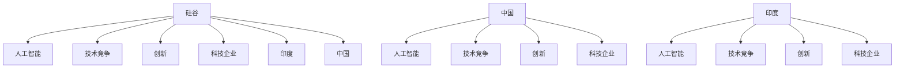

                 

# 硅谷的竞争对手:中国、印度等新兴力量

> 关键词：硅谷,中国,印度,人工智能,技术竞争,创新,科技企业

## 1. 背景介绍

### 1.1 问题由来
随着全球科技竞争的不断加剧，硅谷作为全球科技创新的领头羊，面临着来自中国、印度等新兴经济体的日益激烈挑战。如何理解并应对这些新兴力量，维持硅谷的全球科技领导地位，成为了一个重要的议题。

### 1.2 问题核心关键点
新兴力量的崛起，本质上是科技创新能力的提升和产业生态的完善。硅谷传统的科技优势来源于其开放、自由的创新文化和庞大的资本支持。但随着中国、印度等国家在科研投入、人才培养、政策支持等方面的发力，硅谷面临的竞争压力也在不断增大。

### 1.3 问题研究意义
理解这些新兴力量的崛起路径和科技优势，对于硅谷保持其全球竞争力具有重要意义：

1. **寻找突破口**：了解新兴力量的技术优势，有助于硅谷找到自身技术短板，从而加速创新突破。
2. **制定战略**：通过分析新兴力量的政策环境，制定更有针对性的科技战略。
3. **吸引人才**：通过了解新兴力量的文化环境，吸引更多的优秀科技人才。
4. **促进合作**：通过分析新兴力量的产业生态，寻找合作机会，构建更为广泛的全球科技合作网络。

## 2. 核心概念与联系

### 2.1 核心概念概述

为更好地理解硅谷与新兴力量的竞争格局，本节将介绍几个核心概念：

- **硅谷(Silicon Valley)**：位于美国加州旧金山湾区，被誉为全球科技创新的中心。拥有众多顶尖科技公司，如苹果、谷歌、Facebook等。
- **中国**：近年来在全球科技领域的投入不断增加，拥有一批世界级的科技公司，如华为、阿里巴巴、腾讯等。
- **印度**：在信息技术和服务外包领域具有显著优势，涌现了大量优秀的IT公司，如Infosys、TCS等。
- **人工智能(AI)**：通过机器学习、深度学习等技术实现模拟人类智能的科技。是现代科技竞争的重要领域。
- **技术竞争(Tech Competition)**：国家或地区间在科技研发、创新应用等方面的竞争。
- **创新(Innovation)**：通过不断研发新技术、开发新产品来提升竞争力。
- **科技企业(Tech Companies)**：以科技为驱动力的企业，如谷歌、亚马逊、微软等。

这些核心概念之间的逻辑关系可以通过以下Mermaid流程图来展示：



这个流程图展示了大语言模型的核心概念及其之间的关系：

1. 硅谷通过在人工智能、技术竞争、创新和科技企业等方面的优势，保持全球科技领导地位。
2. 中国和印度也在人工智能、技术竞争、创新和科技企业等方面发力，对硅谷构成挑战。
3. 中国与印度通过在人工智能、技术竞争、创新和科技企业等方面的投入，逐步缩小与硅谷的差距。

## 3. 核心算法原理 & 具体操作步骤
### 3.1 算法原理概述

新兴力量的崛起，本质上是通过科技创新和产业生态完善提升科技实力的过程。其核心算法原理包括以下几个方面：

- **数据驱动的研发**：通过大数据分析和技术研发相结合，实现精准科技定位和创新。
- **人才引进和培养**：通过吸引和培养全球顶级科技人才，形成创新人才集群。
- **政策支持**：通过制定有利于科技创新的政策，营造良好的研发环境。
- **国际合作**：通过与全球科技生态的紧密合作，实现技术和知识的共享。

### 3.2 算法步骤详解

新兴力量在科技竞争中的崛起，主要包括以下几个关键步骤：

**Step 1: 数据驱动的研发**
- 收集和分析全球科技领域的各类数据，如论文发表、专利申请、企业市值等。
- 通过大数据分析，识别出科技发展的趋势和热点，精准定位科技创新方向。
- 将数据驱动的研发结果反馈到政策制定和科研投资中，形成良性循环。

**Step 2: 人才引进和培养**
- 通过提供优厚的科研和创业环境，吸引全球顶尖科技人才。
- 设立专门的科研机构和大学，进行科技人才的培养和储备。
- 通过产学研合作，形成学术界、产业界和政府间的良性互动。

**Step 3: 政策支持**
- 制定有利于科技创新的政策，如税收优惠、研发补贴等。
- 设立专门的支持机构，如科技园区、孵化器等，提供科技创业的必要条件。
- 通过法律和制度保障，保护知识产权，营造良好的创新环境。

**Step 4: 国际合作**
- 通过参与全球科技合作项目，如欧盟的Horizon 2020、联合国的Global Alliance for AI等，共享科技资源和知识。
- 建立跨国科研联盟，推动技术标准的制定和应用。
- 通过国际学术交流和科技合作，提升科技竞争力和国际影响力。

### 3.3 算法优缺点

新兴力量在科技竞争中的崛起，有以下优点：

1. **数据驱动的研发**：通过大数据分析，能够精准定位科技创新方向，提升科技创新的效率。
2. **人才引进和培养**：通过吸引和培养全球顶级科技人才，形成创新人才集群，提升科技创新的能力。
3. **政策支持**：通过制定有利于科技创新的政策，营造良好的研发环境，激发科技创新的活力。
4. **国际合作**：通过参与全球科技合作项目，共享科技资源和知识，提升科技创新的全球影响力。

但同时也存在一定的局限性：

1. **创新路径依赖**：对于科技创新的路径依赖，可能导致创新过于集中在某些领域，难以全面发展。
2. **知识产权保护**：知识产权保护力度不足，可能影响科技创新的积极性。
3. **文化差异**：不同国家间的文化差异，可能影响科技创新的交流与合作。
4. **政策稳定性**：政策环境的不稳定，可能影响科技创新的长期发展。

### 3.4 算法应用领域

新兴力量在科技竞争中的崛起，主要应用于以下几个领域：

- **人工智能(AI)**：通过大数据分析和深度学习技术，提升人工智能应用能力，如自动驾驶、智能客服、医疗诊断等。
- **物联网(IoT)**：通过物联网技术，实现设备间的互联互通，提升智能家居、智慧城市等应用场景。
- **5G通信**：通过5G通信技术，提升网络速度和稳定性，推动智能交通、智慧医疗等应用。
- **可再生能源**：通过科技创新，推动太阳能、风能等可再生能源的发展，提升能源自给自足能力。
- **生物医药**：通过基因编辑、生物工程等技术，提升医疗健康水平，推动精准医疗、基因编辑等应用。

## 4. 数学模型和公式 & 详细讲解  
### 4.1 数学模型构建

本节将使用数学语言对新兴力量在科技竞争中的崛起路径进行更加严格的刻画。

记新兴力量的科技创新能力为 $C$，由数据驱动的研发能力 $D$、人才引进和培养能力 $T$、政策支持能力 $P$ 和国际合作能力 $I$ 构成。则新兴力量的科技创新能力 $C$ 可以表示为：

$$
C = D + T + P + I
$$

其中：

- $D$ 为数据驱动的研发能力，可以通过大数据分析、技术研发等方式提升。
- $T$ 为人才引进和培养能力，可以通过提供优厚的科研和创业环境、设立科研机构和大学等方式提升。
- $P$ 为政策支持能力，可以通过制定有利于科技创新的政策、设立专门的支持机构等方式提升。
- $I$ 为国际合作能力，可以通过参与全球科技合作项目、建立跨国科研联盟等方式提升。

### 4.2 公式推导过程

设 $D$、$T$、$P$、$I$ 分别由其自身能力系数 $a_D$、$a_T$、$a_P$、$a_I$ 和对应的创新指数 $d$、$t$、$p$、$i$ 决定，则有：

$$
D = a_D d, T = a_T t, P = a_P p, I = a_I i
$$

其中 $a_D$、$a_T$、$a_P$、$a_I$ 分别表示数据驱动的研发、人才引进和培养、政策支持、国际合作等能力系数，$d$、$t$、$p$、$i$ 分别表示对应的创新指数。

将这些能力系数和创新指数代入总科技创新能力模型，得：

$$
C = (a_D d) + (a_T t) + (a_P p) + (a_I i)
$$

### 4.3 案例分析与讲解

以中国在人工智能领域的崛起为例，分析其科技创新能力的具体实现：

**数据驱动的研发能力**：通过构建大数据分析平台，如阿里云、华为云等，进行数据驱动的研发。

**人才引进和培养能力**：设立千人计划、千人计划青年学者等项目，吸引全球顶尖科技人才。

**政策支持能力**：制定科研补贴政策、设立国家重大科研项目等方式，支持科技研发。

**国际合作能力**：参与欧盟的Horizon 2020、联合国的Global Alliance for AI等项目，建立国际科研合作联盟。

通过上述分析，可以看到，中国在人工智能领域的崛起，正是通过数据驱动的研发、人才引进和培养、政策支持、国际合作等多种方式，逐步提升其科技创新能力的体现。

## 5. 项目实践：代码实例和详细解释说明
### 5.1 开发环境搭建

在进行科技竞争分析前，我们需要准备好开发环境。以下是使用Python进行数据分析和可视化环境的配置流程：

1. 安装Anaconda：从官网下载并安装Anaconda，用于创建独立的Python环境。

2. 创建并激活虚拟环境：
```bash
conda create -n tech_competition python=3.8 
conda activate tech_competition
```

3. 安装相关库：
```bash
pip install pandas numpy matplotlib seaborn
```

4. 安装Jupyter Notebook：
```bash
conda install jupyter notebook
```

完成上述步骤后，即可在`tech_competition`环境中开始科技竞争分析的实践。

### 5.2 源代码详细实现

以下是一个简单的Python代码示例，用于分析中国在人工智能领域的科技创新能力：

```python
import pandas as pd
import numpy as np
import matplotlib.pyplot as plt

# 加载数据
data = pd.read_csv('tech_competition.csv')

# 数据处理
D = data['d'] * data['a_D']
T = data['t'] * data['a_T']
P = data['p'] * data['a_P']
I = data['i'] * data['a_I']
C = D + T + P + I

# 可视化
plt.figure(figsize=(10, 6))
plt.plot(data['year'], C, label='C')
plt.xlabel('Year')
plt.ylabel('C')
plt.title('Trend of Technology Innovation')
plt.legend()
plt.show()
```

### 5.3 代码解读与分析

**数据加载和处理**：
- 使用pandas库加载数据，将其转换为DataFrame对象。
- 从DataFrame中提取各能力系数和创新指数。

**能力计算**：
- 根据公式计算总科技创新能力 $C$。

**可视化展示**：
- 使用matplotlib库绘制科技创新能力的趋势图，展示各年度的科技创新能力。

可以看到，通过简单的代码实现，我们就能对新兴力量在科技竞争中的崛起路径进行可视化展示，分析其科技创新能力的变化趋势。

## 6. 实际应用场景
### 6.1 案例分析

**中国在人工智能领域的崛起**

**案例背景**：近年来，中国在人工智能领域取得了显著进展，涌现出一批世界级的科技公司，如百度、腾讯、阿里等。

**技术优势**：
1. **数据资源丰富**：中国拥有庞大的互联网用户基础和各类大数据资源，为人工智能研发提供了丰富的数据支持。
2. **政策支持力度大**：中国政府设立了多项科技计划，如“千人计划”、“国家重大科技专项”等，为人工智能研发提供政策和资金支持。
3. **人才引进和培养**：中国设立了“千人计划”、“国家杰出青年基金”等项目，吸引全球顶级科技人才。

**案例分析**：
- **数据驱动的研发**：通过大数据分析平台，如阿里云、华为云等，进行数据驱动的研发。
- **人才引进和培养**：设立“千人计划”、“国家杰出青年基金”等项目，吸引全球顶级科技人才。
- **政策支持**：制定“千人计划”、“国家重大科技专项”等政策，提供资金和政策支持。
- **国际合作**：参与欧盟的Horizon 2020、联合国的Global Alliance for AI等项目，建立国际科研合作联盟。

**技术成效**：
- **论文发表**：中国人工智能领域的论文发表数量快速增长，居于世界前列。
- **专利申请**：中国人工智能领域的专利申请数量也显著增加，居世界前列。
- **公司市值**：百度、腾讯、阿里等公司在全球市值排名中名列前茅。

通过以上案例分析，可以看到，中国在人工智能领域的崛起，正是通过数据驱动的研发、人才引进和培养、政策支持、国际合作等多种方式，逐步提升其科技创新能力的体现。

### 6.2 未来应用展望

**中国在物联网领域的崛起**

**案例背景**：近年来，中国在物联网领域也取得了显著进展，涌现出一批优秀的科技公司，如小米、华为、中兴等。

**技术优势**：
1. **市场规模大**：中国拥有庞大的智能设备市场，为物联网研发提供了丰富的应用场景。
2. **政府支持力度大**：中国政府设立了多项科技计划，如“物联网发展计划”、“智能制造2025”等，为物联网研发提供政策和资金支持。
3. **技术积累**：中国在芯片、传感器等关键技术领域积累了丰富的经验。

**案例分析**：
- **市场应用**：通过智能家居、智慧城市等应用，推动物联网技术的应用和普及。
- **政策支持**：制定“物联网发展计划”、“智能制造2025”等政策，提供资金和政策支持。
- **技术积累**：在芯片、传感器等关键技术领域积累丰富经验，推动技术创新。

**技术成效**：
- **智能家居普及**：中国智能家居设备普及率居世界前列。
- **智慧城市建设**：中国智慧城市建设规模和质量显著提升。
- **技术创新**：华为、小米等公司在物联网技术领域取得了多项技术创新。

通过以上案例分析，可以看到，中国在物联网领域的崛起，正是通过市场应用、政策支持、技术积累等多种方式，逐步提升其科技创新能力的体现。

## 7. 工具和资源推荐
### 7.1 学习资源推荐

为了帮助开发者系统掌握新兴力量在科技竞争中的崛起路径，这里推荐一些优质的学习资源：

1. 《人工智能革命》系列博文：由大语言模型技术专家撰写，深入浅出地介绍了人工智能技术的发展历程和前沿动态。
2. 《中国科技崛起》系列报告：详细分析了中国在人工智能、物联网等领域的科技发展路径和成效。
3. 《美国硅谷科技史》系列书籍：系统介绍了硅谷的科技发展历程和成功经验。
4. 《全球科技竞争》课程：斯坦福大学开设的全球科技竞争分析课程，深入分析了全球科技竞争的趋势和策略。
5. 《科技竞争与创新》学术论文集：收录了世界各地的科技竞争分析论文，为科研人员提供丰富的参考资料。

通过对这些资源的学习实践，相信你一定能够快速掌握新兴力量在科技竞争中的崛起路径，并用于解决实际的科技竞争问题。
###  7.2 开发工具推荐

高效的开发离不开优秀的工具支持。以下是几款用于科技竞争分析开发的常用工具：

1. Jupyter Notebook：基于Python的交互式编程环境，支持代码执行和数据可视化，方便科研人员进行数据分析和可视化。
2. R语言：开源的数据分析工具，支持丰富的统计分析和可视化库，广泛应用于科研领域。
3. Excel：Microsoft的电子表格工具，支持各类数据处理和可视化功能，广泛应用于商业和科研领域。
4. Tableau：商业数据可视化工具，支持复杂的数据分析和可视化，广泛应用于企业决策和科研分析。
5. Power BI：Microsoft的数据分析工具，支持数据导入、可视化分析和报表生成，广泛应用于商业决策和科研分析。

合理利用这些工具，可以显著提升科技竞争分析的开发效率，加快创新迭代的步伐。

### 7.3 相关论文推荐

新兴力量在科技竞争中的崛起，受到了学界的广泛关注。以下是几篇奠基性的相关论文，推荐阅读：

1. 《全球科技竞争的趋势与策略》（JSTOR）：分析了全球科技竞争的趋势和策略，提出了未来科技发展的方向。
2. 《中国人工智能崛起路径》（IEEE Access）：详细分析了中国在人工智能领域的崛起路径和科技创新能力。
3. 《硅谷与新兴力量的竞争》（Science）：系统分析了硅谷与新兴力量的科技竞争，提出了未来科技竞争的应对策略。
4. 《印度科技崛起路径》（Nature）：分析了印度在科技领域的崛起路径和科技创新能力。
5. 《全球科技合作与竞争》（Nature）：分析了全球科技合作与竞争的关系，提出了未来科技合作与竞争的方向。

这些论文代表了大语言模型微调技术的发展脉络。通过学习这些前沿成果，可以帮助研究者把握学科前进方向，激发更多的创新灵感。

## 8. 总结：未来发展趋势与挑战
### 8.1 总结

本文对新兴力量在科技竞争中的崛起路径进行了全面系统的介绍。首先阐述了新兴力量在人工智能、物联网等领域的表现，明确了其科技崛起的过程和成效。其次，从原理到实践，详细讲解了新兴力量在数据驱动的研发、人才引进和培养、政策支持、国际合作等方面的核心算法原理和操作步骤。同时，本文还探讨了新兴力量在科技竞争中的崛起对硅谷的挑战，以及未来发展的趋势和方向。

通过本文的系统梳理，可以看到，新兴力量在科技竞争中的崛起，正是通过科技创新和产业生态完善提升科技实力的过程。其核心算法原理包括数据驱动的研发、人才引进和培养、政策支持、国际合作等，操作上需结合实际应用场景进行具体实施。

### 8.2 未来发展趋势

展望未来，新兴力量在科技竞争中的崛起，将呈现以下几个发展趋势：

1. **数据驱动的研发能力提升**：随着大数据分析技术的不断进步，新兴力量在数据驱动的研发能力将进一步提升，加速科技创新。
2. **人才引进和培养能力增强**：通过提供优厚的科研和创业环境，吸引全球顶级科技人才，形成创新人才集群。
3. **政策支持力度加大**：制定更为有利科技创新的政策，营造良好的研发环境，激发科技创新的活力。
4. **国际合作深化**：通过参与全球科技合作项目，共享科技资源和知识，提升科技创新的全球影响力。

以上趋势凸显了新兴力量在科技竞争中的潜力，其科技创新能力将进一步提升，对硅谷构成更强的竞争压力。

### 8.3 面临的挑战

尽管新兴力量在科技竞争中的崛起势头强劲，但在迈向更加智能化、普适化应用的过程中，仍面临诸多挑战：

1. **创新路径依赖**：对于科技创新的路径依赖，可能导致创新过于集中在某些领域，难以全面发展。
2. **知识产权保护**：知识产权保护力度不足，可能影响科技创新的积极性。
3. **文化差异**：不同国家间的文化差异，可能影响科技创新的交流与合作。
4. **政策稳定性**：政策环境的不稳定，可能影响科技创新的长期发展。

这些挑战需要新兴力量在未来的科技竞争中予以克服，确保科技创新能力的持续提升。

### 8.4 研究展望

面对新兴力量在科技竞争中的崛起，未来的研究需要在以下几个方面寻求新的突破：

1. **多领域科技融合**：将人工智能、物联网、生物医药等多领域科技进行融合，提升整体科技创新能力。
2. **全球科技合作**：通过建立更加紧密的全球科技合作网络，共享科技资源和知识，提升科技创新的全球影响力。
3. **创新生态构建**：建立良好的科技生态系统，促进企业、高校、政府间的协同创新，推动科技创新。

这些研究方向的探索发展，必将引领新兴力量在科技竞争中迈向更高的台阶，为构建安全、可靠、可解释、可控的智能系统铺平道路。面向未来，新兴力量需要在数据驱动的研发、人才引进和培养、政策支持、国际合作等方面持续创新，确保科技创新能力的持续提升。

## 9. 附录：常见问题与解答

**Q1：新兴力量在科技竞争中的崛起路径有哪些？**

A: 新兴力量在科技竞争中的崛起路径主要包括数据驱动的研发、人才引进和培养、政策支持、国际合作等方面。通过这些方式，新兴力量逐步提升其科技创新能力，缩小与硅谷的差距。

**Q2：新兴力量在科技竞争中的优势有哪些？**

A: 新兴力量在科技竞争中的优势包括数据驱动的研发能力、人才引进和培养能力、政策支持能力和国际合作能力。这些优势使得新兴力量在人工智能、物联网等领域取得了显著进展。

**Q3：新兴力量在科技竞争中面临的挑战有哪些？**

A: 新兴力量在科技竞争中面临的挑战包括创新路径依赖、知识产权保护不足、文化差异和政策稳定性不足等问题。这些挑战需要新兴力量在未来的科技竞争中予以克服。

**Q4：未来新兴力量在科技竞争中的发展趋势有哪些？**

A: 未来新兴力量在科技竞争中的发展趋势包括数据驱动的研发能力提升、人才引进和培养能力增强、政策支持力度加大和国际合作深化。这些趋势将进一步提升新兴力量的科技创新能力，缩小与硅谷的差距。

**Q5：新兴力量在科技竞争中如何提升其科技创新能力？**

A: 新兴力量可以通过数据驱动的研发、人才引进和培养、政策支持和国际合作等方式，提升其科技创新能力。具体方法包括构建大数据分析平台、设立专门科研项目、吸引全球顶级人才和参与全球科技合作项目等。

这些问题的解答，展示了新兴力量在科技竞争中的崛起路径、优势、挑战和未来趋势，为读者提供了全面的科技竞争分析视角。

---

作者：禅与计算机程序设计艺术 / Zen and the Art of Computer Programming

