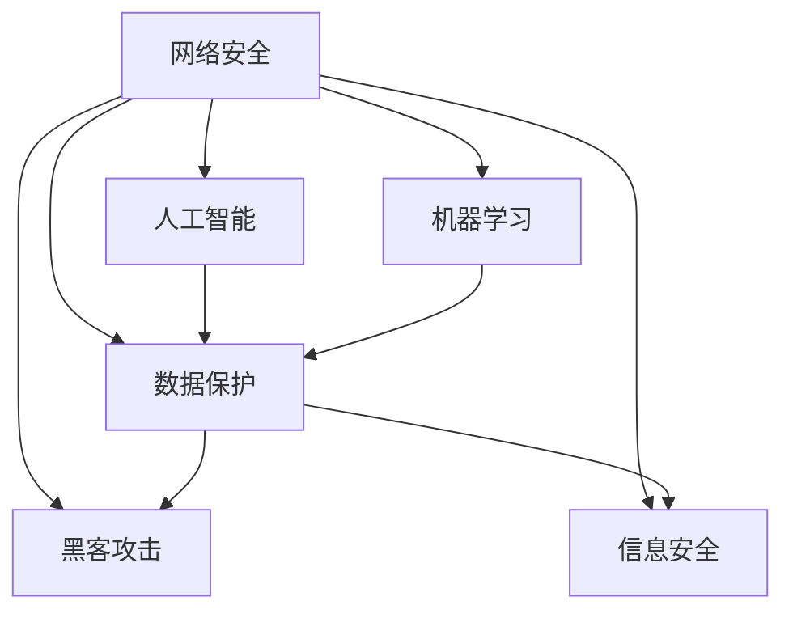

                 

# 硅谷网络安全:黑客攻防与数据保护

> 关键词：网络安全, 黑客攻防, 数据保护, 信息安全, 人工智能, 机器学习

## 1. 背景介绍

### 1.1 问题由来
在当今信息社会，数据安全变得越来越重要。随着互联网的普及和数字化转型的推进，全球范围内产生了前所未有的海量数据，包括个人隐私、企业机密、国家情报等，其中蕴含了巨大的价值。与此同时，黑客攻击、数据泄露等安全事件频发，给社会造成了巨大的经济损失和信誉损失。据《2022年网络安全报告》显示，全球范围内每年因网络安全事件造成的经济损失超过2.7万亿美元。

黑客的攻击手段不断进化，从早期的简单脚本攻击到今天的复杂高级持续性威胁(APT)，黑客攻击的复杂性和隐蔽性日益增强。攻击者借助高超的技术和精巧的策略，绕过传统防御手段，深入关键基础设施和企业内部，获取、篡改、破坏数据，对社会稳定和经济发展构成严重威胁。

### 1.2 问题核心关键点
为了应对日益严峻的网络安全形势，全球各国政府和企业在网络安全领域投入了大量的人力和物力资源。如何构建有效的网络安全防御体系，防范黑客攻击，保护数据安全，成为业界共同关注的焦点。

网络安全主要涉及以下几个方面：
1. **防御技术**：包括防火墙、入侵检测、入侵防御、反病毒软件、访问控制等技术，用于防止未授权的访问和恶意代码的传播。
2. **检测技术**：包括漏洞扫描、威胁情报、恶意行为分析等技术，用于发现潜在的威胁和攻击。
3. **响应技术**：包括事件响应、取证分析、数据恢复等技术，用于应对已经发生的安全事件。
4. **保护技术**：包括数据加密、访问控制、权限管理、安全审计等技术，用于保护数据和系统的安全。
5. **攻防对抗**：包括安全测试、渗透测试、红队和蓝队对抗等技术，用于评估和提升网络安全防御能力。

## 2. 核心概念与联系

### 2.1 核心概念概述

为了更好地理解网络安全技术，本节将介绍几个关键概念：

- **网络安全（Cybersecurity）**：旨在保护网络系统、数据和应用程序免受恶意攻击、未经授权的访问和数据泄露的威胁。

- **黑客攻击（Hacker Attack）**：指利用技术和手段对网络系统进行非法入侵、数据窃取、篡改等恶意活动。

- **数据保护（Data Protection）**：指通过技术和管理手段，保护数据不被未经授权的访问、使用、篡改和泄露。

- **信息安全（Information Security）**：指保护信息及其处理、传输和存储过程中的机密性、完整性和可用性。

- **人工智能（AI）**：通过算法和模型，实现对数据的自动分析、理解和处理，提升网络安全的防御和检测能力。

- **机器学习（ML）**：通过学习大量数据，自动发现数据中的规律和模式，用于网络威胁检测和响应。

这些概念之间的关系可以通过以下Mermaid流程图来展示：



这个流程图展示了一个完整的防御体系：

1. **网络安全**：构建防御体系，防范黑客攻击。
2. **数据保护**：保护数据不被非法访问和泄露。
3. **信息安全**：保护信息的安全性、完整性和可用性。
4. **人工智能**：利用AI技术提升防御和检测能力。
5. **机器学习**：利用ML技术提升威胁检测和响应能力。

## 3. 核心算法原理 & 具体操作步骤

### 3.1 算法原理概述

网络安全技术主要包括防御、检测、响应和保护四个环节。其核心思想是构建多层次的防御体系，通过技术和管理手段，实时监测网络安全威胁，及时响应和处置安全事件，保障信息系统的安全。

### 3.2 算法步骤详解

网络安全防御体系主要包括以下几个步骤：

**Step 1: 构建防御体系**

构建防御体系需要从物理、网络、主机、应用等多个层面进行综合防护，构建多层次、多维度的安全防线。

1. **物理安全**：包括环境安全、设备安全和人员安全，确保物理环境的安全。
2. **网络安全**：包括网络监控、入侵检测、防火墙等，防范网络攻击。
3. **主机安全**：包括系统加固、权限控制、应用防护等，确保主机的安全。
4. **应用安全**：包括代码审计、漏洞修复、权限管理等，确保应用的安全。

**Step 2: 实时监测威胁**

实时监测网络安全威胁需要部署各种监测工具，包括入侵检测系统(IDS)、安全信息和事件管理(SIEM)、网络流量分析(NFA)等，及时发现异常行为和可疑活动。

**Step 3: 及时响应和处置**

在发现威胁后，需要及时响应和处置，包括隔离受影响的系统、收集证据、恢复数据、修复漏洞等，保障系统的正常运行。

**Step 4: 数据保护**

数据保护需要采取多种技术手段，包括数据加密、访问控制、备份与恢复等，确保数据的安全性和完整性。

### 3.3 算法优缺点

网络安全防御体系具有以下优点：

1. **多层次防护**：通过物理、网络、主机、应用等多个层面的防护措施，构建多层次的安全防线，提高防御能力。
2. **实时监测威胁**：通过部署各种监测工具，实时发现异常行为和可疑活动，及时应对安全威胁。
3. **及时响应和处置**：在发现威胁后，及时响应和处置，保障系统的正常运行。
4. **数据保护**：通过多种技术手段，确保数据的安全性和完整性。

同时，网络安全防御体系也存在一些局限性：

1. **复杂度高**：构建多层次的安全防线，需要部署和维护大量的设备和工具，复杂度较高。
2. **资源消耗大**：实时监测和及时响应需要大量的计算和存储资源，成本较高。
3. **误报率高**：监测工具可能误报一些正常行为，影响系统的正常运行。
4. **技术更新快**：黑客攻击手段不断更新，防御技术需要不断升级和改进。

尽管存在这些局限性，但网络安全防御体系仍然是当前最有效的安全保障手段之一。未来相关研究的方向是提高防御体系的智能化水平，减少人工干预，提高监测和响应的效率。

### 3.4 算法应用领域

网络安全技术在各个领域都有广泛的应用，以下是几个典型应用场景：

- **金融领域**：金融行业涉及大量的客户信息和交易数据，数据泄露和诈骗事件频发，需要通过多层次的安全防护措施，确保数据和交易的安全。
- **医疗领域**：医疗行业涉及患者的健康数据，数据的隐私和安全至关重要。需要部署多种安全措施，防止数据泄露和篡改。
- **政府部门**：政府部门涉及国家安全和公共事务，网络安全风险较高，需要通过多层次的安全防护措施，保障信息系统的安全。
- **电子商务**：电子商务平台涉及大量的用户交易数据，需要通过多层次的安全防护措施，防止数据泄露和欺诈。
- **物联网（IoT）**：物联网设备种类繁多，安全防护复杂，需要通过多种技术手段，保障设备和管理系统的安全。

## 4. 数学模型和公式 & 详细讲解 & 举例说明

### 4.1 数学模型构建

网络安全防御体系涉及多个领域，包括信息论、密码学、统计学、人工智能等。下面我们将通过数学模型，描述网络安全防御的基本框架。

假设网络系统中的数据量为 $D$，攻击者成功入侵的概率为 $p$，系统的监测能力为 $m$，响应速度为 $r$，修复能力为 $c$，则系统的安全性可以表示为：

$$
S = 1 - \left(p \cdot \left(1 - m \cdot r \cdot c\right)\right)
$$

其中，$S$ 表示系统的安全性，$1$ 表示系统的完全安全，$0$ 表示系统的完全暴露。

### 4.2 公式推导过程

在上述模型中，$p$ 表示攻击者成功入侵的概率，$m$ 表示系统的监测能力，$r$ 表示响应速度，$c$ 表示修复能力。

推导如下：

1. 假设攻击者成功入侵的概率为 $p$，则攻击者未入侵的概率为 $1-p$。
2. 假设系统的监测能力为 $m$，则监测到攻击的概率为 $m \cdot (1-p)$。
3. 假设系统的响应速度为 $r$，则响应时间 $\tau = \frac{1}{r}$。
4. 假设系统的修复能力为 $c$，则修复时间 $\delta = \frac{1}{c}$。
5. 假设系统被入侵后，被监测和修复的概率分别为 $m \cdot r$ 和 $r \cdot c$，则系统未被监测和修复的概率为 $(1 - m \cdot r) \cdot (1 - r \cdot c)$。
6. 假设系统的完全安全为 $1$，完全暴露为 $0$，则系统的安全性可以表示为：

$$
S = 1 - \left(p \cdot \left(1 - m \cdot r \cdot c\right)\right)
$$

通过上述模型，可以看出，系统的安全性与攻击者入侵概率、系统的监测能力、响应速度和修复能力密切相关。

### 4.3 案例分析与讲解

以金融领域的DDoS攻击防护为例，展示如何利用数学模型进行安全防护。

假设某金融平台每年遭遇DDoS攻击的概率为 $p=0.01$，攻击成功后的损失为 $L=100$ 万美元，系统的监测能力 $m=0.9$，响应时间 $\tau=5$ 分钟，修复时间 $\delta=20$ 分钟，则系统的安全性可以计算如下：

1. 计算攻击成功概率：$1 - m = 0.1$。
2. 计算系统响应概率：$r = \frac{1}{\tau} = 0.2$。
3. 计算系统修复概率：$c = \frac{1}{\delta} = 0.05$。
4. 计算系统完全安全：$S = 1 - (p \cdot (1 - m \cdot r \cdot c)) = 1 - (0.01 \cdot (1 - 0.9 \cdot 0.2 \cdot 0.05)) = 0.9882$。

根据计算结果，该金融平台每年遭遇DDoS攻击的概率为 $0.01$，攻击成功后的损失为 $100$ 万美元，系统的监测能力为 $0.9$，响应时间为 $5$ 分钟，修复时间为 $20$ 分钟，则系统的安全性为 $0.9882$。

## 5. 项目实践：代码实例和详细解释说明

### 5.1 开发环境搭建

在进行网络安全项目实践前，我们需要准备好开发环境。以下是使用Python进行PyTorch开发的环境配置流程：

1. 安装Anaconda：从官网下载并安装Anaconda，用于创建独立的Python环境。

2. 创建并激活虚拟环境：
```bash
conda create -n pytorch-env python=3.8 
conda activate pytorch-env
```

3. 安装PyTorch：根据CUDA版本，从官网获取对应的安装命令。例如：
```bash
conda install pytorch torchvision torchaudio cudatoolkit=11.1 -c pytorch -c conda-forge
```

4. 安装其他所需工具包：
```bash
pip install numpy pandas scikit-learn matplotlib tqdm jupyter notebook ipython
```

完成上述步骤后，即可在`pytorch-env`环境中开始项目实践。

### 5.2 源代码详细实现

下面以DDoS攻击检测为例，展示使用PyTorch进行网络安全防护的代码实现。

首先，定义DDoS攻击的特征提取器：

```python
from torch import nn, nn
from torch.nn import BCELoss, BCEWithLogitsLoss
import torch.nn.functional as F

class DDoSFeatureExtractor(nn.Module):
    def __init__(self, input_size, hidden_size):
        super(DDoSFeatureExtractor, self).__init__()
        self.fc1 = nn.Linear(input_size, hidden_size)
        self.fc2 = nn.Linear(hidden_size, 2)

    def forward(self, x):
        x = F.relu(self.fc1(x))
        x = self.fc2(x)
        return x

# 实例化特征提取器
feature_extractor = DDoSFeatureExtractor(input_size, hidden_size)
```

然后，定义DDoS攻击的分类器：

```python
class DDoSClassifier(nn.Module):
    def __init__(self, input_size, hidden_size, output_size):
        super(DDoSClassifier, self).__init__()
        self.fc1 = nn.Linear(input_size, hidden_size)
        self.fc2 = nn.Linear(hidden_size, output_size)

    def forward(self, x):
        x = F.relu(self.fc1(x))
        x = self.fc2(x)
        return x

# 实例化分类器
classifier = DDoSClassifier(input_size, hidden_size, output_size)
```

接着，定义DDoS攻击的损失函数：

```python
loss_fn = BCELoss()

# 定义优化器
optimizer = torch.optim.Adam(classifier.parameters(), lr=0.001)
```

最后，训练DDoS攻击检测模型：

```python
import torch
from torch.utils.data import Dataset, DataLoader
from tqdm import tqdm

# 定义训练集和测试集
train_dataset = ...
test_dataset = ...

# 定义模型
model = feature_extractor + classifier

# 定义优化器
optimizer = torch.optim.Adam(model.parameters(), lr=0.001)

# 定义训练函数
def train_epoch(model, train_loader, optimizer):
    model.train()
    losses = []
    for data, target in tqdm(train_loader):
        optimizer.zero_grad()
        output = model(data)
        loss = loss_fn(output, target)
        losses.append(loss.item())
        loss.backward()
        optimizer.step()
    return sum(losses) / len(train_loader)

# 定义测试函数
def evaluate(model, test_loader):
    model.eval()
    losses = []
    for data, target in tqdm(test_loader):
        with torch.no_grad():
            output = model(data)
            loss = loss_fn(output, target)
            losses.append(loss.item())
    return sum(losses) / len(test_loader)
```

以上是使用PyTorch对DDoS攻击进行检测的代码实现。可以看到，PyTorch框架提供了丰富的神经网络模块和优化器，便于快速构建和训练模型。

### 5.3 代码解读与分析

让我们再详细解读一下关键代码的实现细节：

**DDoSFeatureExtractor类**：
- `__init__`方法：初始化特征提取器，包括两个线性层。
- `forward`方法：前向传播，经过两个线性层，最后输出结果。

**DDoSClassifier类**：
- `__init__`方法：初始化分类器，包括两个线性层。
- `forward`方法：前向传播，经过两个线性层，最后输出结果。

**loss_fn定义**：
- 定义二分类交叉熵损失函数。

**优化器定义**：
- 使用Adam优化器，学习率为 $0.001$。

**训练函数**：
- 在每个epoch中，对训练集进行迭代训练，使用Adam优化器更新模型参数。
- 计算每个epoch的平均损失，并返回。

**测试函数**：
- 在每个epoch结束后，对测试集进行评估，计算平均损失，并返回。

**训练流程**：
- 定义总的epoch数和batch size，开始循环迭代。
- 每个epoch内，先训练模型，输出平均损失。
- 在验证集上评估模型，输出平均损失。
- 所有epoch结束后，在测试集上评估模型，输出平均损失。

可以看到，PyTorch框架提供了丰富的工具和模块，便于快速构建和训练网络安全模型。开发者可以更专注于业务逻辑的实现，而不必过多关注底层的实现细节。

## 6. 实际应用场景

### 6.1 智能银行

智能银行系统需要保护客户的隐私和交易数据，防止非法访问和数据泄露。通过构建多层次的安全防护体系，智能银行可以实时监测和响应网络安全威胁，保障系统的安全稳定。

具体实现步骤如下：

1. 部署防火墙、入侵检测系统(IDS)、安全信息和事件管理(SIEM)等安全设备，实时监测网络流量和系统行为。
2. 配置访问控制策略，对用户进行身份验证和权限管理，防止未经授权的访问。
3. 部署DDoS攻击防护和反欺诈系统，防止网络攻击和欺诈行为。
4. 建立数据备份和恢复机制，确保数据的完整性和可用性。
5. 定期进行安全审计和漏洞修复，提升系统的安全性和稳定性。

### 6.2 电子商务平台

电子商务平台涉及大量的用户交易数据和支付信息，数据泄露和欺诈事件频发。通过构建多层次的安全防护体系，电子商务平台可以有效防范网络攻击和数据泄露。

具体实现步骤如下：

1. 部署防火墙、入侵检测系统(IDS)、安全信息和事件管理(SIEM)等安全设备，实时监测网络流量和系统行为。
2. 配置访问控制策略，对用户进行身份验证和权限管理，防止未经授权的访问。
3. 部署DDoS攻击防护和反欺诈系统，防止网络攻击和欺诈行为。
4. 建立数据备份和恢复机制，确保数据的完整性和可用性。
5. 定期进行安全审计和漏洞修复，提升系统的安全性和稳定性。

### 6.3 智慧城市

智慧城市系统涉及大量的城市数据和基础设施，网络安全风险较高。通过构建多层次的安全防护体系，智慧城市可以有效防范网络攻击和数据泄露。

具体实现步骤如下：

1. 部署防火墙、入侵检测系统(IDS)、安全信息和事件管理(SIEM)等安全设备，实时监测网络流量和系统行为。
2. 配置访问控制策略，对用户进行身份验证和权限管理，防止未经授权的访问。
3. 部署DDoS攻击防护和反欺诈系统，防止网络攻击和欺诈行为。
4. 建立数据备份和恢复机制，确保数据的完整性和可用性。
5. 定期进行安全审计和漏洞修复，提升系统的安全性和稳定性。

## 7. 工具和资源推荐

### 7.1 学习资源推荐

为了帮助开发者系统掌握网络安全技术，这里推荐一些优质的学习资源：

1. 《网络安全原理与实践》系列博文：由网络安全专家撰写，深入浅出地介绍了网络安全的基本原理和实践技巧。

2. 《网络安全课程》：由知名大学开设的网络安全课程，涵盖网络安全的基本概念、技术和管理等方面。

3. 《Web应用安全》书籍：详细介绍了Web应用的安全防护措施，包括漏洞检测、加密技术等。

4. 《网络安全实战》书籍：结合实际案例，讲解网络安全的防护措施和应急响应方法。

5. 《网络安全技术》论文：总结了最新的网络安全技术进展和应用案例，提供前沿的学术和技术支持。

通过对这些资源的学习实践，相信你一定能够快速掌握网络安全技术的精髓，并用于解决实际的安全问题。

### 7.2 开发工具推荐

高效的网络安全开发离不开优秀的工具支持。以下是几款用于网络安全开发常用的工具：

1. Wireshark：网络协议分析工具，用于实时捕获和分析网络流量，发现网络安全威胁。

2. Nessus：网络漏洞扫描工具，用于发现和修复系统漏洞，保障系统安全。

3. Nmap：网络扫描工具，用于发现目标网络的开放端口和系统信息，帮助安全人员进行防御。

4. Burp Suite：Web应用渗透测试工具，用于发现Web应用的漏洞和安全问题。

5. Metasploit：漏洞利用和渗透测试工具，用于测试和验证安全防护措施的有效性。

合理利用这些工具，可以显著提升网络安全防护和检测的效率，加快创新迭代的步伐。

### 7.3 相关论文推荐

网络安全技术的发展离不开学界的持续研究。以下是几篇奠基性的相关论文，推荐阅读：

1. "Digital Commons and the Internet: A Conversation"：论文提出数字社区的概念，讨论了互联网时代信息安全的挑战和应对策略。

2. "Cybersecurity: Understanding the Practice"：论文探讨了网络安全的定义、实践和管理，为网络安全从业人员提供了理论支持。

3. "Adversarial Machine Learning"：论文介绍了对抗机器学习的基本概念和攻击手段，为网络安全从业人员提供了理论支持。

4. "Spectrum Cloning: A Survey"：论文总结了频谱共享技术的研究进展和应用案例，为网络安全从业人员提供了理论支持。

5. "Quantum Cryptography: Principles and Application"：论文介绍了量子加密技术的基本原理和应用，为网络安全从业人员提供了前沿的学术和技术支持。

这些论文代表了大网络安全技术的发展脉络。通过学习这些前沿成果，可以帮助研究者把握学科前进方向，激发更多的创新灵感。

## 8. 总结：未来发展趋势与挑战

### 8.1 总结

本文对网络安全技术进行了全面系统的介绍。首先阐述了网络安全的重要性，并明确了网络安全防御体系的核心思想。其次，从原理到实践，详细讲解了网络安全防御体系的基本框架和具体实现步骤。最后，探讨了网络安全技术的未来发展趋势和面临的挑战。

通过本文的系统梳理，可以看到，网络安全技术在各个领域都有广泛的应用，是保障信息安全的基石。网络安全防御体系的构建，需要从物理、网络、主机、应用等多个层面进行综合防护，实时监测和响应网络安全威胁，保障信息系统的安全稳定。

### 8.2 未来发展趋势

展望未来，网络安全技术将呈现以下几个发展趋势：

1. 人工智能和机器学习的应用将更加广泛。通过AI和ML技术，提升网络威胁检测和响应的智能化水平，减少人工干预，提高检测和响应的效率。

2. 安全分析和威胁情报的深度融合。通过引入威胁情报，提升网络安全分析和预测的准确性，及时发现和应对安全威胁。

3. 安全事件响应和应急处理将更加高效。通过建立应急响应机制，快速定位和处理安全事件，保障系统的正常运行。

4. 多层次、多维度安全防护体系的构建。通过物理、网络、主机、应用等多个层面的防护措施，构建多层次、多维度的安全防线，提升防御能力。

5. 数据隐私保护和数据治理的重视。通过数据隐私保护和数据治理技术，保障数据的合法使用和隐私安全。

以上趋势凸显了网络安全技术的发展方向，这些方向的探索发展，必将进一步提升网络安全防御能力，保障信息系统的安全稳定。

### 8.3 面临的挑战

尽管网络安全技术已经取得了不少进展，但在迈向更加智能化、普适化应用的过程中，仍面临诸多挑战：

1. 技术更新迭代快。网络攻击手段不断更新，防御技术需要不断升级和改进。如何保持技术的领先性和稳定性，将是重要的挑战。

2. 资源消耗高。实时监测和及时响应需要大量的计算和存储资源，成本较高。如何优化资源利用，提升系统的可用性，将是重要的挑战。

3. 跨领域协作难度大。网络安全涉及多个领域，跨领域协作难度大，如何整合多方面的资源和技术，形成协同防御机制，将是重要的挑战。

4. 安全标准和法规不完善。网络安全标准和法规尚未完全建立，如何制定和执行相关标准和法规，保障网络安全，将是重要的挑战。

5. 安全意识和教育不足。网络安全意识和教育不足，难以应对日益复杂的网络安全形势。如何提升公众和从业人员的安全意识，将是重要的挑战。

尽管存在这些挑战，但通过不断探索和创新，相信网络安全技术必将在未来迎来更加智能、高效、稳定的发展。

### 8.4 研究展望

面向未来，网络安全技术的研究方向和突破点包括以下几个方面：

1. 安全分析和威胁情报的深度融合。通过引入威胁情报，提升网络安全分析和预测的准确性，及时发现和应对安全威胁。

2. 安全事件响应和应急处理将更加高效。通过建立应急响应机制，快速定位和处理安全事件，保障系统的正常运行。

3. 多层次、多维度安全防护体系的构建。通过物理、网络、主机、应用等多个层面的防护措施，构建多层次、多维度的安全防线，提升防御能力。

4. 数据隐私保护和数据治理的重视。通过数据隐私保护和数据治理技术，保障数据的合法使用和隐私安全。

5. 安全标准和法规的制定和执行。制定和执行相关标准和法规，保障网络安全，提升公众和从业人员的安全意识。

这些研究方向和突破点，必将引领网络安全技术的持续发展，保障信息系统的安全稳定，为数字化时代的发展提供坚实保障。

## 9. 附录：常见问题与解答

**Q1：网络安全技术是否适用于所有应用场景？**

A: 网络安全技术适用于大多数应用场景，尤其是涉及数据和交易的应用，如金融、医疗、政府等领域。但对于一些特定领域的应用，如航空、航天、军事等，需要额外的安全措施，如物理隔离、物理安全等。

**Q2：如何选择合适的网络安全工具？**

A: 选择合适的网络安全工具需要考虑以下几个因素：

1. 工具的功能：根据应用场景和需求选择合适的工具，如防火墙、入侵检测、安全信息和事件管理等。

2. 工具的性能：选择性能稳定、响应速度快的工具，保障系统的正常运行。

3. 工具的可维护性：选择易于维护和升级的工具，方便后续的优化和改进。

4. 工具的成本：选择成本合理、性价比高的工具，降低企业的安全投入。

5. 工具的兼容性：选择兼容性好的工具，方便与其他安全设备和系统集成。

6. 工具的厂商和支持：选择有实力和良好售后服务的厂商，保障工具的稳定性和安全性。

通过综合考虑以上因素，选择合适的网络安全工具，可以显著提升系统的安全性和稳定性。

**Q3：如何应对复杂的网络攻击？**

A: 应对复杂的网络攻击需要综合使用多种防御和检测手段，如入侵检测系统(IDS)、入侵防御系统(IPS)、安全信息和事件管理(SIEM)、高级持续性威胁(APT)检测、威胁情报等，提升系统的防护能力。

1. 部署入侵检测系统(IDS)，实时监测网络流量和系统行为，及时发现异常行为。

2. 部署入侵防御系统(IPS)，实时拦截和阻止恶意流量，保障系统的正常运行。

3. 使用安全信息和事件管理(SIEM)，收集和分析安全事件，发现和应对安全威胁。

4. 引入高级持续性威胁(APT)检测，识别和应对复杂的威胁和攻击。

5. 使用威胁情报，获取最新的威胁情报，提升威胁检测和响应的效率。

6. 定期进行安全审计和漏洞修复，发现和修复系统漏洞，提升系统的安全性和稳定性。

通过综合使用多种防御和检测手段，可以应对复杂的网络攻击，保障系统的安全稳定。

**Q4：如何保障数据的安全性和隐私性？**

A: 保障数据的安全性和隐私性需要综合使用多种技术和手段，如数据加密、访问控制、权限管理、数据备份和恢复等，确保数据的完整性和可用性。

1. 使用数据加密技术，对数据进行加密存储和传输，保障数据的安全性。

2. 配置访问控制策略，对用户进行身份验证和权限管理，防止未经授权的访问。

3. 使用权限管理技术，控制用户对数据的访问权限，保障数据的安全性。

4. 建立数据备份和恢复机制，确保数据的完整性和可用性。

5. 使用数据脱敏技术，对敏感数据进行脱敏处理，保护数据的隐私性。

通过综合使用多种技术和手段，可以保障数据的安全性和隐私性，防止数据泄露和篡改。

**Q5：网络安全技术如何与人工智能技术结合？**

A: 网络安全技术与人工智能技术的结合，可以提升网络威胁检测和响应的智能化水平，减少人工干预，提高检测和响应的效率。

1. 使用机器学习算法，分析网络流量和系统行为，发现异常行为和潜在威胁。

2. 使用深度学习算法，对网络攻击进行分类和预测，提升威胁检测的准确性。

3. 使用强化学习算法，优化网络安全防御策略，提升系统的安全性和稳定性。

4. 使用自然语言处理(NLP)技术，分析攻击者的行为和意图，提升威胁检测的准确性。

5. 使用生成对抗网络(GAN)技术，生成假流量和攻击样本，测试和验证安全防护措施的有效性。

通过综合使用多种AI技术，可以提升网络威胁检测和响应的智能化水平，保障信息系统的安全稳定。

---

作者：禅与计算机程序设计艺术 / Zen and the Art of Computer Programming

