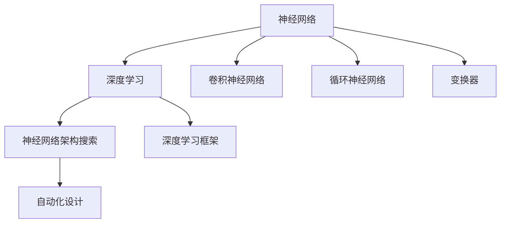

                 

# 神经网络架构设计：从简单到复杂

> 关键词：神经网络，深度学习，卷积神经网络，循环神经网络，变换器，神经网络架构搜索，自动化设计，深度学习框架

## 1. 背景介绍

### 1.1 问题由来
神经网络作为一种强大的模式识别工具，已经在图像处理、语音识别、自然语言处理等领域取得了显著的成果。然而，如何设计有效的神经网络架构，是实现这些成果的关键。传统的神经网络架构设计主要依赖于人工经验，但随着数据量的增加和模型复杂度的提高，这种设计方法已经难以满足实际需求。

### 1.2 问题核心关键点
神经网络架构设计的核心在于选择合适的神经元类型、层级结构、激活函数、优化算法等，以实现对特定数据的有效处理和特征提取。神经网络架构设计的目标是通过组合不同的组件，构造出高效、准确、鲁棒的模型。

## 2. 核心概念与联系

### 2.1 核心概念概述

为了更好地理解神经网络架构设计，本节将介绍几个密切相关的核心概念：

- 神经网络：一种由大量神经元组成的计算模型，用于模拟人类神经系统的信息处理机制。
- 深度学习：基于神经网络的一种机器学习技术，通过多层次的特征提取，实现对复杂数据的高级抽象和表示。
- 卷积神经网络（CNN）：一种专门用于处理图像、视频等数据的神经网络，具有局部连接和权值共享的特性。
- 循环神经网络（RNN）：一种用于处理序列数据的神经网络，能够保持序列中的信息状态，适用于文本生成、语音识别等任务。
- 变换器（Transformer）：一种用于处理序列数据的神经网络架构，通过自注意力机制实现对输入序列的并行处理，适用于自然语言处理、机器翻译等任务。
- 神经网络架构搜索（NAS）：一种自动设计神经网络架构的方法，通过搜索算法寻找最优的神经网络结构。
- 深度学习框架：如TensorFlow、PyTorch等，提供高效的工具和接口，方便开发者构建和训练神经网络模型。

这些核心概念之间的逻辑关系可以通过以下Mermaid流程图来展示：



这个流程图展示出神经网络架构设计的核心概念及其之间的关系：

1. 神经网络是深度学习的核心基础。
2. 卷积神经网络和循环神经网络是神经网络的两种主要架构。
3. 变换器架构适用于处理序列数据。
4. 神经网络架构搜索和自动化设计方法，用于自动化寻找最优的神经网络结构。
5. 深度学习框架提供了高效的神经网络构建和训练工具。

## 3. 核心算法原理 & 具体操作步骤

### 3.1 算法原理概述

神经网络架构设计的核心在于找到最优的神经网络结构，以适应特定任务的特征提取和表示。常用的设计方法包括手动设计、遗传算法、贝叶斯优化等。下面以遗传算法为例，介绍神经网络架构设计的基本原理。

遗传算法是一种模拟自然进化过程的优化算法，通过模拟自然选择、交叉、变异等过程，逐步优化出最优的解决方案。在神经网络架构设计中，遗传算法通过迭代生成多个神经网络架构，并根据其在特定任务上的性能进行评估和选择，最终选出最优的架构。

### 3.2 算法步骤详解

以下是基于遗传算法的神经网络架构设计的一般步骤：

**Step 1: 定义搜索空间**
- 确定神经网络架构的超参数，如神经元数量、层数、激活函数等，作为遗传算法的搜索空间。
- 定义交叉、变异操作的具体实现方式，如单点交叉、多点交叉、随机变异等。

**Step 2: 初始化种群**
- 随机生成一定数量的初始神经网络架构，构成初始种群。
- 每个神经网络架构可以表示为一系列超参数的组合，如神经元数量、层数、激活函数等。

**Step 3: 评估适应度**
- 对每个神经网络架构，在特定任务上进行前向传播，计算其性能指标，如准确率、损失值等。
- 根据性能指标，计算每个架构的适应度值，作为遗传算法的选择依据。

**Step 4: 选择和交叉**
- 使用选择操作从当前种群中选择一部分适应度较高的架构。
- 对选择的架构进行交叉操作，生成新的架构。
- 交叉操作可以通过单点交叉、多点交叉等方式实现。

**Step 5: 变异**
- 对交叉生成的新的架构，进行变异操作，引入新的随机变化。
- 变异操作可以通过随机修改某些超参数来实现。

**Step 6: 迭代优化**
- 重复Step 3至Step 5，进行多轮迭代，逐步优化出最优的神经网络架构。
- 在迭代过程中，可以设定提前停止的条件，如达到最大迭代次数、适应度不再提升等。

### 3.3 算法优缺点

基于遗传算法的神经网络架构设计具有以下优点：
1. 自动搜索：无需人工经验，通过算法自动搜索最优的架构。
2. 多目标优化：能够同时优化多个性能指标，如准确率、速度、鲁棒性等。
3. 可扩展性：能够处理复杂的多层神经网络架构，具有较强的扩展性。

同时，该方法也存在一定的局限性：
1. 时间成本高：算法复杂度较高，需要大量计算资源和时间。
2. 局部最优：可能会陷入局部最优解，难以找到全局最优解。
3. 超参数敏感：算法性能依赖于超参数的选择，需要人工调整。

尽管存在这些局限性，但就目前而言，基于遗传算法的神经网络架构设计仍然是一种主流的方法。未来相关研究的重点在于如何进一步提高算法的效率和性能，同时兼顾可扩展性和可解释性等因素。

### 3.4 算法应用领域

神经网络架构设计在深度学习中得到了广泛的应用，涵盖了几乎所有常见任务，例如：

- 图像分类：如卷积神经网络（CNN）在ImageNet等数据集上取得了优异表现。
- 目标检测：如Faster R-CNN、YOLO等架构，在PASCAL VOC、COCO等数据集上取得了最佳效果。
- 自然语言处理：如LSTM、Transformer等架构，在机器翻译、文本分类、情感分析等任务上表现出色。
- 语音识别：如RNN、Transformer等架构，在语音识别任务中取得了显著提升。

除了上述这些经典任务外，神经网络架构设计也被创新性地应用到更多场景中，如可控生成、自适应学习等，为深度学习技术带来了新的突破。随着神经网络架构设计和优化方法的不断进步，相信深度学习技术将在更广阔的应用领域大放异彩。

## 4. 数学模型和公式 & 详细讲解 & 举例说明

### 4.1 数学模型构建

在神经网络架构设计中，数学模型主要用于描述神经网络的结构和行为。常见的数学模型包括神经网络的结构图、神经元的激活函数、损失函数等。

以卷积神经网络（CNN）为例，其数学模型可以表示为：

$$
y = \sigma(W*x + b)
$$

其中 $y$ 为输出，$x$ 为输入，$W$ 为权重矩阵，$b$ 为偏置向量，$\sigma$ 为激活函数。

### 4.2 公式推导过程

以卷积神经网络（CNN）为例，其数学模型可以表示为：

$$
y_{c} = \sigma(W_{c}*x + b_{c})
$$

$$
y_{p} = \sigma(W_{p}*y_{c} + b_{p})
$$

其中 $y_{c}$ 为卷积层的输出，$y_{p}$ 为池化层的输出，$W_{c}$ 和 $W_{p}$ 分别为卷积核和池化核的权重矩阵，$b_{c}$ 和 $b_{p}$ 分别为卷积核和池化核的偏置向量，$\sigma$ 为激活函数。

### 4.3 案例分析与讲解

以下以LeNet-5为例，分析其神经网络架构设计的数学模型。

LeNet-5是一种经典的卷积神经网络架构，用于手写数字识别任务。其数学模型可以表示为：

$$
y_{conv1} = \sigma(W_{conv1}*x + b_{conv1})
$$

$$
y_{pool1} = \sigma(W_{pool1}*y_{conv1} + b_{pool1})
$$

$$
y_{conv2} = \sigma(W_{conv2}*y_{pool1} + b_{conv2})
$$

$$
y_{pool2} = \sigma(W_{pool2}*y_{conv2} + b_{pool2})
$$

$$
y_{fc1} = \sigma(W_{fc1}*y_{pool2} + b_{fc1})
$$

$$
y_{fc2} = \sigma(W_{fc2}*y_{fc1} + b_{fc2})
$$

其中 $y_{conv1}$ 和 $y_{conv2}$ 为卷积层的输出，$y_{pool1}$ 和 $y_{pool2}$ 为池化层的输出，$y_{fc1}$ 和 $y_{fc2}$ 为全连接层的输出，$W_{conv1}$ 至 $W_{fc2}$ 分别为各层的权重矩阵，$b_{conv1}$ 至 $b_{fc2}$ 分别为各层的偏置向量，$\sigma$ 为激活函数。

## 5. 项目实践：代码实例和详细解释说明

### 5.1 开发环境搭建

在进行神经网络架构设计实践前，我们需要准备好开发环境。以下是使用Python进行PyTorch开发的环境配置流程：

1. 安装Anaconda：从官网下载并安装Anaconda，用于创建独立的Python环境。

2. 创建并激活虚拟环境：
```bash
conda create -n pytorch-env python=3.8 
conda activate pytorch-env
```

3. 安装PyTorch：根据CUDA版本，从官网获取对应的安装命令。例如：
```bash
conda install pytorch torchvision torchaudio cudatoolkit=11.1 -c pytorch -c conda-forge
```

4. 安装深度学习框架：
```bash
pip install torch
```

5. 安装TensorFlow：
```bash
pip install tensorflow
```

6. 安装TensorBoard：
```bash
pip install tensorboard
```

7. 安装Keras：
```bash
pip install keras
```

完成上述步骤后，即可在`pytorch-env`环境中开始神经网络架构设计实践。

### 5.2 源代码详细实现

以下是使用Keras实现卷积神经网络（CNN）架构设计的代码实现：

```python
from keras.models import Sequential
from keras.layers import Conv2D, MaxPooling2D, Flatten, Dense

# 构建卷积神经网络模型
model = Sequential()
model.add(Conv2D(32, (3, 3), activation='relu', input_shape=(28, 28, 1)))
model.add(MaxPooling2D((2, 2)))
model.add(Conv2D(64, (3, 3), activation='relu'))
model.add(MaxPooling2D((2, 2)))
model.add(Conv2D(64, (3, 3), activation='relu'))
model.add(MaxPooling2D((2, 2)))
model.add(Flatten())
model.add(Dense(64, activation='relu'))
model.add(Dense(10, activation='softmax'))

# 编译模型
model.compile(optimizer='adam', loss='categorical_crossentropy', metrics=['accuracy'])

# 训练模型
model.fit(train_images, train_labels, epochs=10, validation_data=(test_images, test_labels))
```

以上代码实现了一个简单的卷积神经网络，用于MNIST手写数字识别任务。

### 5.3 代码解读与分析

让我们再详细解读一下关键代码的实现细节：

**Sequential模型**：
- 使用Keras的Sequential模型，按照顺序逐层添加神经网络组件。

**卷积层和池化层**：
- 使用Conv2D层实现卷积操作，使用MaxPooling2D层实现池化操作，分别设置神经元数量和卷积核大小。

**全连接层**：
- 使用Flatten层将卷积层和池化层的输出展平为一维向量。
- 使用Dense层实现全连接操作，分别设置神经元数量和激活函数。

**模型编译**：
- 使用adam优化器和交叉熵损失函数进行模型编译，同时设置准确率作为评估指标。

**模型训练**：
- 使用fit方法对模型进行训练，设置训练轮数和验证集数据。

可以看到，Keras提供了高效的神经网络组件和便捷的模型训练接口，使得神经网络架构设计的代码实现变得简洁高效。开发者可以将更多精力放在架构设计、模型优化等高层逻辑上，而不必过多关注底层的实现细节。

当然，工业级的系统实现还需考虑更多因素，如模型的保存和部署、超参数的自动搜索、更灵活的架构组件等。但核心的神经网络架构设计基本与此类似。

## 6. 实际应用场景

### 6.1 图像分类

基于卷积神经网络（CNN）的图像分类技术，已经在图像识别、医学影像分析、自动驾驶等领域得到了广泛的应用。CNN通过多层卷积和池化操作，能够有效地提取图像特征，实现对图像的高效分类。

在技术实现上，可以收集各类图像数据，将图像和标签构建成监督数据，在此基础上对预训练的卷积神经网络进行微调。微调后的卷积神经网络能够自动学习图像特征，快速适应新类别的图像。对于测试样本，只需进行前向传播，即可得到分类结果。

### 6.2 语音识别

基于循环神经网络（RNN）的语音识别技术，已经在语音助手、电话客服、语音翻译等领域取得了显著成果。RNN通过时间序列上的信息传递，能够有效地处理语音信号的上下文关系，实现对语音的准确识别。

在技术实现上，可以收集语音信号数据，将音频和文本构建成监督数据，在此基础上对预训练的循环神经网络进行微调。微调后的循环神经网络能够自动学习语音特征，实现对新语音的准确识别。对于测试样本，只需进行前向传播，即可得到识别结果。

### 6.3 自然语言处理

基于变换器（Transformer）的自然语言处理技术，已经在机器翻译、文本生成、情感分析等领域取得了显著成果。Transformer通过自注意力机制，能够有效地处理序列数据的复杂关系，实现对自然语言的深度理解。

在技术实现上，可以收集自然语言数据，将文本和标签构建成监督数据，在此基础上对预训练的变换器进行微调。微调后的变换器能够自动学习自然语言特征，实现对新文本的准确生成和分类。对于测试样本，只需进行前向传播，即可得到生成或分类结果。

### 6.4 未来应用展望

随着神经网络架构设计和优化方法的不断发展，基于神经网络的设计范式将在更多领域得到应用，为各行各业带来变革性影响。

在智慧医疗领域，基于神经网络的设计范式可以应用于医学影像分析、病历分析、药物研发等任务，提升医疗服务的智能化水平，辅助医生诊疗，加速新药开发进程。

在智能教育领域，神经网络设计范式可应用于作业批改、学情分析、知识推荐等方面，因材施教，促进教育公平，提高教学质量。

在智慧城市治理中，神经网络设计范式可应用于城市事件监测、舆情分析、应急指挥等环节，提高城市管理的自动化和智能化水平，构建更安全、高效的未来城市。

此外，在企业生产、社会治理、文娱传媒等众多领域，神经网络设计范式也将不断涌现，为传统行业数字化转型升级提供新的技术路径。相信随着技术的日益成熟，神经网络设计范式必将成为人工智能落地应用的重要手段，推动人工智能技术在更广阔的领域大放异彩。

## 7. 工具和资源推荐
### 7.1 学习资源推荐

为了帮助开发者系统掌握神经网络架构设计的理论基础和实践技巧，这里推荐一些优质的学习资源：

1. 《深度学习》（Ian Goodfellow著）：全面介绍了深度学习的基本概念、算法和应用。
2. 《动手学深度学习》（李沐、戴伟城著）：通过代码实现，深入浅出地介绍了深度学习的基本原理和实践技巧。
3. 《TensorFlow实战Google深度学习》（杨晓曦著）：介绍TensorFlow的深度学习应用实例，适合初学者和实践者。
4. 《PyTorch入门与实践》（王东辉著）：全面介绍PyTorch的深度学习应用实例，适合PyTorch用户。
5. 《Python深度学习》（Francois Chollet著）：介绍Keras的深度学习应用实例，适合Keras用户。

通过对这些资源的学习实践，相信你一定能够快速掌握神经网络架构设计的精髓，并用于解决实际的深度学习问题。
###  7.2 开发工具推荐

高效的开发离不开优秀的工具支持。以下是几款用于神经网络架构设计开发的常用工具：

1. PyTorch：基于Python的开源深度学习框架，灵活动态的计算图，适合快速迭代研究。提供了丰富的神经网络组件和便捷的模型训练接口。
2. TensorFlow：由Google主导开发的开源深度学习框架，生产部署方便，适合大规模工程应用。提供了强大的计算图和分布式训练能力。
3. Keras：基于TensorFlow、Theano等深度学习框架构建的高层次神经网络API，易于上手和调试。
4. Weights & Biases：模型训练的实验跟踪工具，可以记录和可视化模型训练过程中的各项指标，方便对比和调优。与主流深度学习框架无缝集成。
5. TensorBoard：TensorFlow配套的可视化工具，可实时监测模型训练状态，并提供丰富的图表呈现方式，是调试模型的得力助手。
6. Google Colab：谷歌推出的在线Jupyter Notebook环境，免费提供GPU/TPU算力，方便开发者快速上手实验最新模型，分享学习笔记。

合理利用这些工具，可以显著提升神经网络架构设计的开发效率，加快创新迭代的步伐。

### 7.3 相关论文推荐

神经网络架构设计和优化技术的发展源于学界的持续研究。以下是几篇奠基性的相关论文，推荐阅读：

1. Deep Neural Networks with Large Energy-Based Priors（LeNet-5）：提出了LeNet-5卷积神经网络，用于手写数字识别任务。
2. Learning Deep Architectures for AI（AlexNet）：介绍了AlexNet卷积神经网络，在ImageNet图像分类任务中取得了最佳效果。
3. Google's Inception Architecture for Computer Vision（Inception）：提出了Inception架构，用于Google Image Search项目，提升了图像分类的准确率。
4. Convolutional Neural Networks for Sentence Classification（CNN for NLP）：介绍了CNN在文本分类任务中的应用，提升了NLP任务的准确率。
5. Attention is All You Need（Transformer）：提出了Transformer架构，用于机器翻译、文本生成等任务，取得了最佳效果。

这些论文代表了大神经网络架构设计的最新进展。通过学习这些前沿成果，可以帮助研究者把握学科前进方向，激发更多的创新灵感。

## 8. 总结：未来发展趋势与挑战

### 8.1 总结

本文对神经网络架构设计方法进行了全面系统的介绍。首先阐述了神经网络架构设计的背景和意义，明确了设计方法在深度学习中的核心地位。其次，从原理到实践，详细讲解了神经网络架构设计的数学模型和优化算法，给出了神经网络架构设计的完整代码实例。同时，本文还广泛探讨了神经网络架构设计在图像分类、语音识别、自然语言处理等领域的广泛应用，展示了其巨大潜力。此外，本文精选了神经网络架构设计的各类学习资源，力求为读者提供全方位的技术指引。

通过本文的系统梳理，可以看到，神经网络架构设计方法已经成为深度学习领域的重要范式，极大地拓展了神经网络的应用边界，催生了更多的落地场景。受益于神经网络架构设计的不断发展，深度学习技术将在更广阔的应用领域大放异彩，深刻影响人类的生产生活方式。

### 8.2 未来发展趋势

展望未来，神经网络架构设计技术将呈现以下几个发展趋势：

1. 模型规模持续增大。随着算力成本的下降和数据规模的扩张，神经网络架构的设计将更加复杂，更多层次和组件将被加入，以实现更高效的特征提取和表示。
2. 自动化设计方法崛起。神经网络架构搜索（NAS）和自动化设计方法，将取代传统的手动设计方法，通过算法自动生成最优的神经网络架构。
3. 多模态融合加速。未来神经网络将融合视觉、语音、文本等多模态信息，实现更全面、准确的信息建模和表示。
4. 端到端优化技术发展。神经网络架构设计和优化方法将进一步融合，形成端到端优化技术，实现高效、鲁棒的神经网络设计。
5. 分布式训练加速。随着大规模神经网络的普及，分布式训练方法将进一步优化，提升训练效率和效果。
6. 模型压缩和优化技术提升。神经网络压缩和优化技术将进一步发展，实现更高效、更轻量级的神经网络设计。

以上趋势凸显了神经网络架构设计技术的广阔前景。这些方向的探索发展，必将进一步提升深度学习系统的性能和应用范围，为人工智能技术带来新的突破。

### 8.3 面临的挑战

尽管神经网络架构设计技术已经取得了瞩目成就，但在迈向更加智能化、普适化应用的过程中，它仍面临着诸多挑战：

1. 计算资源瓶颈。当前神经网络架构设计通常需要大量计算资源和时间，难以应对大规模数据和高复杂度模型的需求。如何提升计算效率，降低计算成本，仍需进一步优化。
2. 模型可解释性不足。神经网络架构设计方法通常缺乏可解释性，难以理解模型的决策机制和推理过程。如何在保证性能的同时，提升模型的可解释性，也将是一大难题。
3. 模型泛化性不足。神经网络架构设计方法在特定任务上表现优异，但在泛化到新任务时，往往需要重新设计或微调。如何提升模型的泛化能力，避免过拟合，仍需进一步研究。
4. 超参数敏感。神经网络架构设计方法依赖于超参数的选择，需要人工调整。如何在自动搜索最优架构的同时，确保超参数的合理选择，仍需进一步优化。
5. 硬件资源限制。神经网络架构设计方法通常需要高性能硬件支持，如何利用低成本硬件实现高效计算，仍需进一步探索。

正视神经网络架构设计面临的这些挑战，积极应对并寻求突破，将使神经网络架构设计技术走向成熟，为人工智能技术带来新的突破。相信随着学界和产业界的共同努力，这些挑战终将一一被克服，神经网络架构设计必将在构建人机协同的智能时代中扮演越来越重要的角色。

### 8.4 研究展望

面对神经网络架构设计所面临的种种挑战，未来的研究需要在以下几个方面寻求新的突破：

1. 探索自动化设计方法。通过神经网络架构搜索（NAS）和自动化设计方法，自动生成最优的神经网络架构，提升设计效率和效果。
2. 研究端到端优化技术。将神经网络架构设计和优化方法融合，形成端到端优化技术，实现高效、鲁棒的神经网络设计。
3. 引入先验知识。将符号化的先验知识，如知识图谱、逻辑规则等，与神经网络模型进行巧妙融合，引导神经网络架构设计过程。
4. 融合多模态信息。将视觉、语音、文本等多模态信息融合，实现更全面、准确的信息建模和表示。
5. 探索分布式训练技术。利用分布式计算方法，提升神经网络架构设计的计算效率和效果。
6. 研究模型压缩和优化技术。通过模型压缩、量化等技术，实现更高效、更轻量级的神经网络设计。

这些研究方向的研究，必将引领神经网络架构设计技术迈向更高的台阶，为人工智能技术带来新的突破。面向未来，神经网络架构设计技术还需要与其他人工智能技术进行更深入的融合，如知识表示、因果推理、强化学习等，多路径协同发力，共同推动人工智能技术的发展。只有勇于创新、敢于突破，才能不断拓展神经网络架构设计的边界，让智能技术更好地造福人类社会。

## 9. 附录：常见问题与解答

**Q1：如何选择合适的神经网络架构？**

A: 选择合适的神经网络架构需要考虑多个因素，如数据量、任务类型、模型复杂度等。通常可以通过以下方法选择：
1. 观察前人研究：参考相关论文和实践经验，选择已有模型进行微调或改进。
2. 数据驱动：根据数据集的特点，选择适合的神经网络架构。如小规模数据集适合简单网络结构，大规模数据集适合复杂网络结构。
3. 实验对比：通过实验对比不同架构的性能，选择最优的架构。

**Q2：神经网络架构设计的超参数如何选择？**

A: 神经网络架构设计的超参数选择对模型性能有重要影响。通常可以通过以下方法选择：
1. 经验法：根据经验选择初始值，如神经元数量、层数、学习率等。
2. 网格搜索：在一定范围内选择多个超参数组合，通过实验对比选择最优的超参数。
3. 贝叶斯优化：利用贝叶斯方法自动搜索最优的超参数组合，提升搜索效率和效果。

**Q3：神经网络架构设计的计算资源需求如何优化？**

A: 神经网络架构设计的计算资源需求通常较高，可以通过以下方法优化：
1. 硬件加速：使用GPU、TPU等高性能硬件加速计算。
2. 分布式训练：利用分布式计算方法，加速神经网络架构设计的计算过程。
3. 模型压缩：通过模型压缩、量化等技术，减小模型参数量，降低计算资源需求。

**Q4：神经网络架构设计的可解释性不足如何解决？**

A: 神经网络架构设计的可解释性不足可以通过以下方法解决：
1. 可视化：使用可视化工具，展示神经网络架构和模型推理过程。
2. 解释模型：引入解释模型或后处理技术，解释模型的决策机制和推理过程。
3. 手动调试：在模型训练过程中，手动调试网络结构和超参数，确保模型的合理性和可解释性。

**Q5：如何提升神经网络架构设计的泛化能力？**

A: 提升神经网络架构设计的泛化能力可以通过以下方法：
1. 数据增强：通过数据增强技术，扩充训练数据集，提升模型的泛化能力。
2. 正则化：使用正则化技术，如L2正则、Dropout等，避免过拟合。
3. 迁移学习：利用已有预训练模型，通过迁移学习提升模型的泛化能力。
4. 多任务学习：通过多任务学习，提升模型的泛化能力和鲁棒性。

这些研究方向的探索，必将引领神经网络架构设计技术迈向更高的台阶，为人工智能技术带来新的突破。面向未来，神经网络架构设计技术还需要与其他人工智能技术进行更深入的融合，如知识表示、因果推理、强化学习等，多路径协同发力，共同推动人工智能技术的发展。只有勇于创新、敢于突破，才能不断拓展神经网络架构设计的边界，让智能技术更好地造福人类社会。

---

作者：禅与计算机程序设计艺术 / Zen and the Art of Computer Programming

