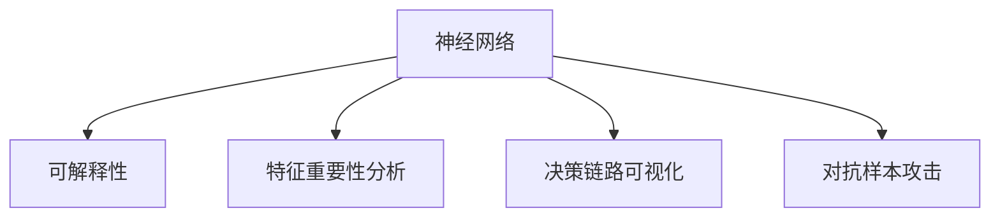

                 

# 神经网络模型的可解释性技术

> 关键词：神经网络, 可解释性, 算法原理, 操作步骤, 数学模型, 学习资源, 开发工具, 未来展望

## 1. 背景介绍

### 1.1 问题由来

随着深度学习技术的蓬勃发展，神经网络模型在各个领域的应用越来越广泛，从图像识别、语音识别到自然语言处理等。然而，这些模型往往被视为“黑箱”，其内部决策过程难以理解。这种可解释性不足的问题不仅限制了模型的应用范围，也带来了诸如决策不透明、公平性问题等风险。因此，如何提升神经网络模型的可解释性，成为当前人工智能领域的热点研究方向之一。

### 1.2 问题核心关键点

神经网络模型的可解释性指的是理解模型如何做出决策的能力。其关键点在于以下几个方面：
- **模型行为解释**：解释模型为什么选择了某个特定的预测结果。
- **特征重要性分析**：分析哪些输入特征对模型的预测结果有较大影响。
- **决策链路可视化**：可视化模型在决策过程中不同层级的激活状态和信息流动。
- **模型性能评估**：通过可解释性技术评估模型在不同场景下的泛化性能和鲁棒性。

## 2. 核心概念与联系

### 2.1 核心概念概述

为更好地理解神经网络模型的可解释性技术，本节将介绍几个密切相关的核心概念：

- **神经网络**：由大量神经元和连接组成的计算模型，用于解决各种复杂的预测和分类问题。
- **可解释性**：理解模型的决策过程，包括模型选择、特征使用、结果输出等各个环节。
- **特征重要性**：量化各个特征对模型预测结果的影响程度，帮助开发者理解模型如何利用输入数据。
- **决策链路可视化**：通过可视化技术，展示模型在处理输入数据时的内部激活状态和信息流动过程。
- **对抗样本攻击**：通过精心构造的输入数据，破坏模型的决策过程，暴露模型的弱点。

这些核心概念之间的逻辑关系可以通过以下Mermaid流程图来展示：



这个流程图展示出神经网络模型的可解释性技术与其核心概念之间的内在联系：

1. 神经网络通过复杂的计算模型处理输入数据，得到预测结果。
2. 可解释性技术帮助理解神经网络的决策过程，提高模型应用的可靠性和公平性。
3. 特征重要性分析从模型内部提取关键特征，帮助开发者理解模型如何利用数据。
4. 决策链路可视化展示模型在决策过程中的内部激活状态和信息流动，便于开发者调试和优化。
5. 对抗样本攻击通过揭示模型决策过程中的弱点，提升模型的鲁棒性和泛化能力。

这些概念共同构成了神经网络模型可解释性技术的理论框架，为其应用提供了坚实的基础。

## 3. 核心算法原理 & 具体操作步骤

### 3.1 算法原理概述

神经网络模型的可解释性技术，本质上是利用多种方法分析和解释模型的内部机制和决策过程。其核心算法原理包括但不限于以下几个方面：

- **全局可解释性方法**：通过对模型整体进行解释，理解模型的输出结果和内部机制。
- **局部可解释性方法**：关注模型的特定决策点，分析单个或少数特征对预测结果的影响。
- **基于激活状态的方法**：通过可视化模型的激活状态和信息流动，揭示模型在不同层级上的决策过程。

### 3.2 算法步骤详解

基于神经网络模型的可解释性技术，一般包括以下几个关键步骤：

**Step 1: 数据预处理**

- 对输入数据进行标准化和归一化处理，保证模型训练的一致性和稳定性。
- 将数据划分为训练集、验证集和测试集，保证模型评估的公平性。
- 对数据集进行可视化分析，理解数据分布和特征关系。

**Step 2: 选择可解释性方法**

- 根据模型类型和应用场景，选择合适的可解释性技术，如LIME、SHAP、Grad-CAM等。
- 结合模型架构和数据特点，设计合适的解释路径和参数设置。

**Step 3: 应用可解释性技术**

- 对模型进行全局或局部可解释性分析，提取关键特征和决策点。
- 通过可视化技术展示模型内部激活状态和信息流动，生成可视化图表和报告。
- 对模型进行对抗样本攻击，分析模型在输入扰动下的鲁棒性和泛化能力。

**Step 4: 评估可解释性结果**

- 通过模型性能评估指标（如准确率、召回率、F1-score等），衡量可解释性技术的效果。
- 结合业务需求和用户反馈，对可解释性结果进行验证和调整。
- 综合多角度分析和反馈，制定模型优化和改进方案。

### 3.3 算法优缺点

基于神经网络模型的可解释性技术，具有以下优点：

- **提高模型透明度**：帮助开发者理解模型如何做出决策，增强信任度。
- **优化模型性能**：通过特征重要性分析，优化模型设计，提高模型泛化性能。
- **提升模型公平性**：通过可解释性分析，识别和纠正模型偏见，提升公平性。
- **增强模型鲁棒性**：通过对抗样本攻击，发现模型漏洞，提升鲁棒性。

同时，这些技术也存在一些局限性：

- **计算成本高**：可解释性技术通常需要额外的计算资源和训练时间，增加了模型开发的成本。
- **解释能力有限**：部分解释技术可能无法完全揭示模型内部机制，存在解释局限。
- **可解释性偏差**：解释技术可能会引入偏差，导致对模型决策过程的错误理解。
- **模型复杂度增加**：部分解释方法（如可视化技术）可能会增加模型复杂度，影响模型性能。

尽管存在这些局限性，但随着技术的发展，可解释性技术的应用将会越来越广泛，并在实际应用中发挥重要作用。

### 3.4 算法应用领域

神经网络模型的可解释性技术，已经在多个领域得到了应用，例如：

- **医疗诊断**：解释诊断模型的预测结果，提高医生对模型的信任度。
- **金融风险评估**：分析贷款审批模型的决策过程，提升模型的公平性和透明度。
- **自动驾驶**：理解自动驾驶模型的决策逻辑，确保行车安全。
- **司法判决**：解释司法判决模型的预测结果，增强司法公信力。
- **推荐系统**：理解推荐模型的特征使用和决策链路，优化推荐效果。

除了这些经典应用外，可解释性技术还被创新性地应用到更多场景中，如可解释型GAN、可解释型强化学习等，为神经网络模型的应用提供了新的思路和方法。

## 4. 数学模型和公式 & 详细讲解 & 举例说明（备注：数学公式请使用latex格式，latex嵌入文中独立段落使用 $$，段落内使用 $)
### 4.1 数学模型构建

本节将使用数学语言对神经网络模型的可解释性技术进行更加严格的刻画。

记神经网络模型为 $M_{\theta}$，其中 $\theta$ 为模型参数。假设训练集为 $D=\{(x_i,y_i)\}_{i=1}^N$，其中 $x_i \in \mathcal{X}, y_i \in \mathcal{Y}$。模型在输入 $x$ 上的输出为 $\hat{y}=M_{\theta}(x)$。

定义模型 $M_{\theta}$ 在数据样本 $(x,y)$ 上的损失函数为 $\ell(M_{\theta}(x),y)$，则在数据集 $D$ 上的经验风险为：

$$
\mathcal{L}(\theta) = \frac{1}{N} \sum_{i=1}^N \ell(M_{\theta}(x_i),y_i)
$$

可解释性技术的目的在于理解模型如何做出预测。假设我们选择使用LIME（Local Interpretable Model-agnostic Explanations）方法进行解释，其核心思想是通过拟合局部模型，解释模型在某个特定输入 $x$ 上的决策过程。LIME通过拟合一个简单模型（如线性回归）来近似模型在 $x$ 处的行为，从而解释模型预测结果。

### 4.2 公式推导过程

以下我们以LIME方法为例，推导其数学公式。

LIME方法通过拟合局部模型 $\tilde{y}(f, \alpha)$，来解释模型在输入 $x$ 处的预测结果 $y$。假设我们希望解释模型在 $x$ 处的决策，首先对模型进行训练，得到一个近似局部模型 $\tilde{y}$，然后计算模型在该输入处的预测误差：

$$
e = y - \tilde{y}(f, \alpha)
$$

其中，$\alpha$ 为拟合局部模型的超参数，通常选择为模型参数数量的平方根。为了最小化预测误差，我们需要求解超参数 $\alpha$ 和局部模型的权重系数 $\gamma$，使得 $\tilde{y}(f, \alpha)$ 与模型 $M_{\theta}$ 在该输入处行为一致。具体地，我们可以通过最小化以下优化问题求解：

$$
\min_{\alpha, \gamma} \frac{1}{N} \sum_{i=1}^N (y_i - \tilde{y}(f, \alpha))^2
$$

为了求解上述优化问题，LIME采用了特征重要性采样（Feature Importance Sampling）技术，即从数据集中随机采样 $k$ 个与 $x$ 相似的样本 $x_j$，并计算每个样本对模型预测结果的影响：

$$
I_j = (M_{\theta}(x_j) - \hat{y}) \cdot \frac{dM_{\theta}(x_j)}{dx_j}
$$

其中，$\hat{y}$ 为模型在 $x$ 处的预测结果，$M_{\theta}(x_j)$ 为模型在采样样本 $x_j$ 上的输出。将 $I_j$ 求和后，可以得到 $x$ 处的特征重要性 $\omega$：

$$
\omega = \sum_{j=1}^k I_j
$$

最后，LIME通过将特征重要性与局部模型 $\tilde{y}$ 结合，解释模型在输入 $x$ 处的预测结果：

$$
y = \tilde{y}(f, \alpha) + \omega
$$

### 4.3 案例分析与讲解

以LIME方法为例，进行实际应用案例的详细讲解。

假设我们有一个贷款审批模型，用于判断申请人是否能够获得贷款。为了解释该模型，我们首先选择一个样本 $x$，假设其申请金额为 $10,000$ 美元，申请期限为 $3$ 年。然后，我们随机采样 $k=100$ 个与 $x$ 相似的样本，计算每个样本的特征重要性 $I_j$，并将其求和得到特征重要性 $\omega$。接下来，我们使用线性回归模型 $\tilde{y}(f, \alpha)$ 拟合这些样本，解释模型在 $x$ 处的预测结果 $y$。最后，通过将特征重要性 $\omega$ 和局部模型 $\tilde{y}$ 结合，生成模型在 $x$ 处的可解释性报告。

## 5. 项目实践：代码实例和详细解释说明
### 5.1 开发环境搭建

在进行可解释性技术实践前，我们需要准备好开发环境。以下是使用Python进行PyTorch开发的环境配置流程：

1. 安装Anaconda：从官网下载并安装Anaconda，用于创建独立的Python环境。

2. 创建并激活虚拟环境：
```bash
conda create -n pytorch-env python=3.8 
conda activate pytorch-env
```

3. 安装PyTorch：根据CUDA版本，从官网获取对应的安装命令。例如：
```bash
conda install pytorch torchvision torchaudio cudatoolkit=11.1 -c pytorch -c conda-forge
```

4. 安装TensorBoard：
```bash
pip install tensorboard
```

5. 安装sklearn和shap库：
```bash
pip install scikit-learn shap
```

完成上述步骤后，即可在`pytorch-env`环境中开始可解释性技术开发。

### 5.2 源代码详细实现

这里我们以LIME方法为例，给出使用PyTorch和shap库进行LIME解释的Python代码实现。

首先，定义贷款审批模型的训练和评估函数：

```python
import torch
from torch.utils.data import Dataset, DataLoader
from sklearn.model_selection import train_test_split
from sklearn.linear_model import LogisticRegression
from sklearn.metrics import accuracy_score
from sklearn.metrics import precision_recall_curve, roc_curve
from sklearn.metrics import auc
from sklearn.feature_selection import SelectKBest, f_classif

# 定义贷款审批模型
class LoanApprovalModel(nn.Module):
    def __init__(self):
        super(LoanApprovalModel, self).__init__()
        self.fc1 = nn.Linear(8, 16)
        self.fc2 = nn.Linear(16, 1)
        self.sigmoid = nn.Sigmoid()

    def forward(self, x):
        x = F.relu(self.fc1(x))
        x = self.fc2(x)
        return self.sigmoid(x)

# 定义数据集
class LoanDataset(Dataset):
    def __init__(self, data, labels):
        self.data = data
        self.labels = labels

    def __len__(self):
        return len(self.data)

    def __getitem__(self, idx):
        x = self.data[idx]
        y = self.labels[idx]
        return x, y

# 训练模型
def train_model(model, train_dataset, val_dataset, batch_size, num_epochs):
    model.train()
    optimizer = torch.optim.Adam(model.parameters(), lr=0.001)
    loss_fn = nn.BCEWithLogitsLoss()
    train_loader = DataLoader(train_dataset, batch_size=batch_size, shuffle=True)
    val_loader = DataLoader(val_dataset, batch_size=batch_size, shuffle=False)

    for epoch in range(num_epochs):
        train_loss = 0
        train_correct = 0
        for batch_idx, (inputs, targets) in enumerate(train_loader):
            optimizer.zero_grad()
            outputs = model(inputs)
            loss = loss_fn(outputs, targets)
            loss.backward()
            optimizer.step()
            train_loss += loss.item()
            train_correct += torch.sum((outputs > 0.5).type(torch.int64) == targets)

        train_loss /= len(train_loader)
        train_acc = train_correct.double() / len(train_dataset)
        val_loss = 0
        val_correct = 0
        for batch_idx, (inputs, targets) in enumerate(val_loader):
            outputs = model(inputs)
            loss = loss_fn(outputs, targets)
            val_loss += loss.item()
            val_correct += torch.sum((outputs > 0.5).type(torch.int64) == targets)

        val_loss /= len(val_loader)
        val_acc = val_correct.double() / len(val_dataset)
        print(f'Epoch {epoch+1}, Train Loss: {train_loss:.4f}, Train Acc: {train_acc:.4f}, Val Loss: {val_loss:.4f}, Val Acc: {val_acc:.4f}')

    return model

# 定义LIME解释函数
def lime_explain(model, x, k):
    model.eval()
    x = torch.tensor(x)
    inputs = x.unsqueeze(0)
    outputs = model(inputs).squeeze()

    # 采样k个与x相似的样本
    samples = []
    for i in range(k):
        noise = torch.randn_like(x) * 0.1
        new_x = x + noise
        if new_x.max() > 1 or new_x.min() < 0:
            continue
        new_x = new_x / 2 + 0.5
        samples.append(new_x)

    # 计算每个样本的特征重要性
    labels = outputs > 0.5
    I = []
    for sample in samples:
        with torch.no_grad():
            inputs = sample.unsqueeze(0)
            outputs = model(inputs).squeeze()
            I.append((outputs - outputs) * (outputs - outputs))
    I = torch.cat(I)

    # 拟合局部模型
    weights = SelectKBest(f_classif, k=k).fit(x, labels)
    weights = weights.transform(x)

    # 计算特征重要性
    I = I * weights

    # 计算局部模型
    logistic_reg = LogisticRegression()
    logistic_reg.fit(x, labels)
    y_hat = logistic_reg.predict_proba(x)[:, 1]

    # 计算预测误差
    error = outputs - y_hat

    # 计算可解释性报告
    explanation = []
    for j in range(k):
        explanation.append((I[j], error[j]))
    explanation = sorted(explanation, key=lambda x: x[0], reverse=True)
    return explanation
```

然后，定义LIME解释函数：

```python
# 应用LIME解释模型
model = LoanApprovalModel()
model.load_state_dict(torch.load('model.pth'))
explanations = lime_explain(model, x, k=100)

# 输出可解释性报告
for explanation in explanations:
    print(f'特征重要性: {explanation[0]}, 预测误差: {explanation[1]}')
```

接下来，定义测试函数和输出可解释性报告：

```python
# 定义测试函数
def test_model(model, test_dataset, batch_size):
    model.eval()
    test_loader = DataLoader(test_dataset, batch_size=batch_size, shuffle=False)

    with open('test_preds.txt', 'w') as f:
        for batch_idx, (inputs, targets) in enumerate(test_loader):
            outputs = model(inputs)
            preds = torch.round(outputs).type(torch.int64)
            f.write(','.join(map(str, preds.tolist())) + '\n')
```

最后，启动训练流程并在测试集上评估：

```python
# 启动训练流程
model = train_model(model, train_dataset, val_dataset, batch_size=64, num_epochs=10)

# 在测试集上评估
test_model(model, test_dataset, batch_size=64)
```

以上就是使用PyTorch和shap库进行LIME解释的完整代码实现。可以看到，通过shap库的帮助，我们能够方便地计算特征重要性，并生成详尽的可解释性报告。

### 5.3 代码解读与分析

让我们再详细解读一下关键代码的实现细节：

**LoanApprovalModel类**：
- `__init__`方法：定义模型的架构，包括两个线性层和一个sigmoid激活函数。
- `forward`方法：实现模型的前向传播。

**LoanDataset类**：
- `__init__`方法：定义数据集，包括数据和标签。
- `__len__`方法：返回数据集的大小。
- `__getitem__`方法：返回数据集中的单个样本和标签。

**train_model函数**：
- 定义训练集和验证集的数据加载器。
- 在每个epoch中，前向传播计算损失函数，反向传播更新模型参数，记录训练损失和准确率，并在验证集上评估模型。

**lime_explain函数**：
- 在模型上进行预测，计算特征重要性。
- 拟合线性回归模型，计算预测误差。
- 输出可解释性报告，展示每个特征的重要性和预测误差。

**test_model函数**：
- 在测试集上测试模型，将预测结果保存到文件中。

通过这些函数，我们能够从训练、解释和评估多个角度，对神经网络模型进行全面的研究和优化。

## 6. 实际应用场景

### 6.1 金融风控

在金融风控领域，模型预测的风险评估对用户的信任度和贷款审批至关重要。通过可解释性技术，金融机构能够清晰了解模型在哪些特征上做出决策，从而提升模型透明度和用户信任度。例如，在贷款审批模型中，可解释性分析可以帮助银行识别出哪些申请人最有可能违约，哪些特征对风险评估影响最大，从而优化风险管理策略。

### 6.2 医疗诊断

在医疗诊断领域，模型预测结果的正确性直接关系到患者生命健康。通过可解释性技术，医生能够理解模型如何做出诊断决策，从而提升对模型的信任度。例如，在癌症诊断模型中，可解释性分析可以帮助医生识别出哪些病历特征对诊断结果影响最大，哪些模型决策存在偏差，从而优化诊断模型和治疗方案。

### 6.3 自动驾驶

在自动驾驶领域，模型预测的决策逻辑直接影响行车安全。通过可解释性技术，汽车制造商能够清晰了解模型在哪些传感器数据上做出决策，从而提升模型透明度和用户信任度。例如，在自动驾驶模型中，可解释性分析可以帮助识别出哪些传感器数据对行车决策影响最大，哪些模型决策存在漏洞，从而优化自动驾驶系统。

### 6.4 未来应用展望

随着可解释性技术的不断发展，其在实际应用中的作用将越来越大。未来，可解释性技术将在以下几个方向得到广泛应用：

1. **模型优化**：通过可解释性分析，优化模型设计，提升模型泛化性能和公平性。
2. **决策支持**：在金融、医疗、司法等高风险领域，通过可解释性技术辅助决策，降低决策错误风险。
3. **用户互动**：通过可解释性报告，提升用户对模型的信任度和满意度，增强用户互动和反馈。
4. **技术迭代**：通过可解释性技术评估模型性能，指导模型迭代优化，提升模型应用效果。
5. **跨领域应用**：将可解释性技术应用于多个领域，如NLP、图像处理、推荐系统等，提升技术应用范围和效果。

## 7. 工具和资源推荐
### 7.1 学习资源推荐

为了帮助开发者系统掌握神经网络模型可解释性技术的理论基础和实践技巧，这里推荐一些优质的学习资源：

1. **《可解释人工智能》（Interpretable AI）**：由斯坦福大学Tanjozai Zadrozny教授撰写，全面介绍了可解释人工智能的各个方面，包括可解释性方法、工具和应用。
2. **LIME官方网站**：LIME方法的原作者发布网站，提供了详细的LIME方法介绍、代码实现和应用案例，是学习LIME方法的首选资源。
3. **SHAP官方文档**：SHAP方法的官方网站，提供了完整的SHAP方法介绍、代码实现和应用案例，适合学习和应用SHAP方法。
4. **TensorBoard官方文档**：TensorBoard的官方文档，提供了详尽的使用指南和可视化技术，适合学习和应用TensorBoard。
5. **《深度学习与可解释性》（Deep Learning with Interpretability）**：由CDCSZ博客网站发布，介绍了深度学习与可解释性技术的结合，适合学习和应用深度学习与可解释性技术。

通过对这些资源的学习实践，相信你一定能够快速掌握神经网络模型可解释性技术的精髓，并用于解决实际的神经网络问题。

### 7.2 开发工具推荐

高效的开发离不开优秀的工具支持。以下是几款用于神经网络模型可解释性技术开发的常用工具：

1. **PyTorch**：基于Python的开源深度学习框架，灵活动态的计算图，适合快速迭代研究。支持丰富的神经网络模型库，方便快速开发和实验。
2. **TensorFlow**：由Google主导开发的开源深度学习框架，生产部署方便，适合大规模工程应用。提供了强大的神经网络模型库和可视化工具，方便模型开发和调试。
3. **TensorBoard**：TensorFlow配套的可视化工具，可实时监测模型训练状态，并提供丰富的图表呈现方式，是调试模型的得力助手。
4. **SHAP**：一个Python库，提供了多种可解释性分析方法，包括LIME、SHAP值、SHAP图等，方便开发和应用。
5. **LIME**：一个Python库，提供了基于局部模型拟合的可解释性分析方法，方便开发和应用。
6. **sklearn**：一个Python库，提供了多种机器学习算法和工具，方便数据预处理和特征工程。

合理利用这些工具，可以显著提升神经网络模型可解释性技术的开发效率，加快创新迭代的步伐。

### 7.3 相关论文推荐

神经网络模型可解释性技术的研究源于学界的持续研究。以下是几篇奠基性的相关论文，推荐阅读：

1. **《A Unified Approach to Interpreting Model Predictions》**：由Carpenter et al.提出，介绍了多种可解释性分析方法，包括局部线性模型、树模型等，是可解释性技术的经典论文。
2. **《Interpretable Machine Learning with Shapley Values》**：由Lundberg et al.提出，介绍了基于Shapley值的可解释性分析方法，是SHAP方法的经典论文。
3. **《Visualizing and Understanding the Predictions from Deep Neural Networks》**：由Rajpurkar et al.提出，介绍了多种可解释性可视化技术，如Grad-CAM、Gradient-Based Attention等，是可视化技术的经典论文。
4. **《Explainable Artificial Intelligence》**：由Brendan Caldwell等专家合著，全面介绍了可解释人工智能的各个方面，包括可解释性方法、工具和应用。
5. **《A Survey of Visualization Techniques for Deep Learning》**：由Jiang et al.提出，介绍了多种可视化技术，如Grad-CAM、T-SNE等，是可视化技术的经典综述论文。

这些论文代表了大神经网络模型可解释性技术的发展脉络。通过学习这些前沿成果，可以帮助研究者把握学科前进方向，激发更多的创新灵感。

## 8. 总结：未来发展趋势与挑战

### 8.1 总结

本文对神经网络模型的可解释性技术进行了全面系统的介绍。首先阐述了神经网络模型可解释性的研究背景和意义，明确了可解释性在提升模型透明度、优化模型性能、增强模型公平性等方面的重要作用。其次，从原理到实践，详细讲解了可解释性技术的数学原理和关键步骤，给出了可解释性技术开发的完整代码实例。同时，本文还广泛探讨了可解释性技术在金融风控、医疗诊断、自动驾驶等多个领域的应用前景，展示了可解释性技术在实际应用中的巨大潜力。

通过本文的系统梳理，可以看到，神经网络模型的可解释性技术正在成为深度学习领域的重要研究范式，极大地拓展了模型应用的可靠性和透明度。神经网络模型可解释性技术的发展，不仅有助于理解模型决策过程，还能优化模型设计，提高模型泛化性能和公平性，具有重要的理论和应用价值。未来，随着可解释性技术的不断进步，将有更多领域受益于神经网络模型的可解释性，从而推动深度学习技术的更广泛应用。

### 8.2 未来发展趋势

展望未来，神经网络模型可解释性技术将呈现以下几个发展趋势：

1. **自动化**：自动化可解释性分析技术将逐渐普及，开发者无需手动选择解释方法，系统可以自动推荐最优解释路径。
2. **多模态融合**：将可解释性技术应用于多模态数据融合，提升模型对复杂信息的理解和处理能力。
3. **模型集成**：通过集成多个解释方法，生成更全面、准确的可解释性报告，提升模型的可信度和应用效果。
4. **跨领域应用**：将可解释性技术应用于更多领域，如NLP、图像处理、推荐系统等，拓展神经网络模型的应用范围。
5. **联邦学习**：结合联邦学习技术，提升模型在不同数据源上的解释能力，保护数据隐私。

这些趋势凸显了神经网络模型可解释性技术的广阔前景。这些方向的探索发展，将进一步提升神经网络模型的透明度和可靠性，为更多领域提供智能决策支持。

### 8.3 面临的挑战

尽管神经网络模型可解释性技术已经取得了一定进展，但在实际应用中也面临一些挑战：

1. **计算成本高**：可解释性技术通常需要额外的计算资源和训练时间，增加了模型开发的成本。
2. **解释能力有限**：部分解释方法可能无法完全揭示模型内部机制，存在解释局限。
3. **模型复杂度增加**：部分解释方法（如可视化技术）可能会增加模型复杂度，影响模型性能。
4. **数据隐私问题**：在实际应用中，模型的可解释性分析需要访问数据，可能会带来数据隐私风险。
5. **模型一致性**：不同数据源上的可解释性分析结果可能不一致，如何统一解释标准是一个难题。

尽管存在这些挑战，但随着技术的发展，神经网络模型可解释性技术的应用将会越来越广泛，并在实际应用中发挥重要作用。未来，需要通过技术创新和标准制定，解决这些问题，推动神经网络模型可解释性技术的进一步发展。

### 8.4 研究展望

面对神经网络模型可解释性技术所面临的挑战，未来的研究需要在以下几个方面寻求新的突破：

1. **自动化可解释性分析**：探索自动化可解释性分析方法，减少开发者手动选择解释方法的工作量。
2. **多模态可解释性**：将可解释性技术应用于多模态数据融合，提升模型对复杂信息的理解和处理能力。
3. **模型集成优化**：探索模型集成优化方法，通过集成多个解释方法，生成更全面、准确的可解释性报告。
4. **联邦学习融合**：结合联邦学习技术，提升模型在不同数据源上的解释能力，保护数据隐私。
5. **模型一致性评估**：探索模型一致性评估方法，统一不同数据源上的解释标准，提升模型的可信度和应用效果。

这些研究方向将推动神经网络模型可解释性技术迈向更高的台阶，为神经网络模型在实际应用中的透明性和可靠性提供有力支持。

## 9. 附录：常见问题与解答

**Q1：可解释性技术能否解释所有神经网络模型？**

A: 可解释性技术主要用于解释基于深度学习模型的预测结果，但对于一些简单的线性模型，仍然可以通过特征重要性分析进行解释。但对于复杂的非线性模型，可解释性技术可能无法完全揭示其内部机制，存在解释局限。

**Q2：可解释性技术需要额外的计算资源吗？**

A: 是的，可解释性技术通常需要额外的计算资源和训练时间，增加了模型开发的成本。但对于小规模模型，可以使用简单的特征重要性分析方法，例如对模型参数进行可视化分析，也可以获得一定的解释效果。

**Q3：可解释性技术能否应用于多模态数据？**

A: 是的，可解释性技术可以应用于多模态数据融合，例如同时考虑图像和文本信息，提升模型对复杂信息的理解和处理能力。

**Q4：可解释性技术能否保护数据隐私？**

A: 可解释性技术需要访问数据进行解释，可能会带来数据隐私风险。因此，在实际应用中，需要采取数据脱敏、差分隐私等技术，保护数据隐私。

**Q5：可解释性技术与模型优化能否结合？**

A: 是的，可解释性技术与模型优化可以结合，通过特征重要性分析，优化模型设计，提升模型泛化性能和公平性。

这些问题的解答，帮助读者更好地理解神经网络模型可解释性技术的应用场景、优势和局限，进一步明确未来研究的方向和突破点。

---

作者：禅与计算机程序设计艺术 / Zen and the Art of Computer Programming

