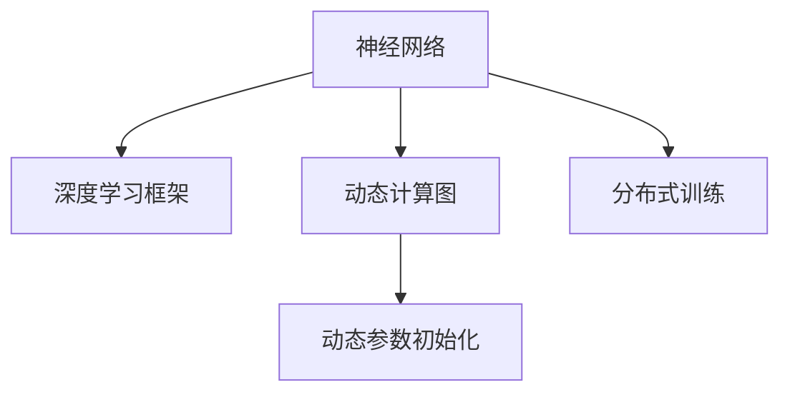

                 

# 神经网络模型的灵活可扩展性

> 关键词：神经网络，模型架构，灵活性，可扩展性，深度学习，灵活神经网络，可扩展神经网络，深度学习框架，TensorFlow，PyTorch

## 1. 背景介绍

### 1.1 问题由来

深度学习技术在过去十年中取得了飞速发展，在图像识别、语音处理、自然语言处理等领域展现出了强大的表现力。其中，神经网络（Neural Network, NN）作为深度学习的基础，其架构和训练方式不断进化，以满足越来越复杂的应用需求。然而，现有的神经网络模型往往存在着模型固定、难以扩展的缺陷，无法很好地适应大规模分布式计算和动态任务需求。

### 1.2 问题核心关键点

当前神经网络模型设计上的局限性主要体现在以下几个方面：

1. 模型固定：现有的神经网络模型结构一旦确定，后续就无法轻易调整，使得模型难以适应不同规模和复杂度的任务。
2. 参数静态：模型中的参数数量在训练过程中固定不变，无法根据任务需求动态调整，限制了模型的灵活性。
3. 数据依赖：模型训练过程高度依赖于数据分布，当数据分布发生变化时，模型性能可能会显著下降。
4. 扩展困难：模型扩展到多GPU、多节点分布式计算环境时，参数管理复杂，训练效率低下。

因此，为了解决这些问题，提高神经网络模型的灵活性和可扩展性，成为当前深度学习领域的一个重要研究方向。

### 1.3 问题研究意义

研究神经网络模型的灵活可扩展性，对于推动深度学习技术在更广泛的应用场景中得到应用，具有重要意义：

1. 提升模型适应能力：灵活的模型结构使得模型能够更好地适应不同规模和复杂度的任务，提升模型的泛化能力。
2. 提高资源利用效率：动态调整模型参数和架构，可以在有限的计算资源下，提升训练和推理效率。
3. 促进大规模分布式计算：灵活可扩展的模型架构，使得模型可以方便地扩展到多GPU、多节点分布式计算环境，提高计算效率和模型性能。
4. 推动技术创新：灵活可扩展的模型架构，使得深度学习研究者能够更自由地探索和创新，推动神经网络模型技术的不断进步。

本文将详细阐述神经网络模型的灵活可扩展性，并给出具体的实现方法和应用场景。

## 2. 核心概念与联系

### 2.1 核心概念概述

为了更好地理解神经网络模型的灵活可扩展性，本节将介绍几个关键概念：

- 神经网络（Neural Network, NN）：一种模拟人脑神经元结构和功能的计算模型，由大量神经元和连接组成。神经网络通过反向传播算法进行训练，优化模型参数，以实现复杂非线性映射。
- 深度学习框架（Deep Learning Framework）：用于实现和训练神经网络的软件工具和平台。如TensorFlow、PyTorch等。
- 动态计算图（Dynamic Computation Graph）：一种支持动态图构建和执行的计算图模型，如TensorFlow的GraphDef。动态计算图使得模型可以根据数据和任务动态调整结构。
- 参数初始化（Parameter Initialization）：模型参数在训练开始前的初始化方法。动态参数初始化方法，可以使得模型参数在训练过程中动态变化。
- 分布式训练（Distributed Training）：多节点、多GPU的分布式计算环境下的模型训练方式。分布式训练可以显著提升计算效率和模型性能。

这些核心概念之间的逻辑关系可以通过以下Mermaid流程图来展示：



这个流程图展示了大语言模型的核心概念及其之间的关系：

1. 神经网络通过深度学习框架进行实现。
2. 动态计算图支持模型参数和结构的动态变化。
3. 动态参数初始化方法，可以在训练过程中动态调整模型参数。
4. 分布式训练支持模型在多节点、多GPU环境下的高效计算。

这些概念共同构成了神经网络模型的灵活可扩展性的基础，使其能够适应不同的应用场景和任务需求。

## 3. 核心算法原理 & 具体操作步骤
### 3.1 算法原理概述

神经网络模型的灵活可扩展性主要体现在以下几个方面：

1. 动态计算图架构：支持动态计算图构建和执行的深度学习框架，如TensorFlow、PyTorch等。
2. 动态参数初始化方法：如Xavier、He等参数初始化方法，使得模型参数在训练过程中可以动态调整。
3. 分布式计算框架：如TensorFlow、PyTorch、Horovod等，支持多节点、多GPU的分布式计算。

通过这些关键技术，神经网络模型可以在保持灵活性的同时，具备可扩展性和高效计算能力。

### 3.2 算法步骤详解

基于上述关键技术，神经网络模型的灵活可扩展性实现过程可以分为以下几个步骤：

**Step 1: 设计灵活架构**

- 使用动态计算图架构，如TensorFlow的GraphDef，使得模型架构可以在训练过程中动态调整。
- 设计多分支、可插拔的模型组件，以便根据任务需求进行动态配置。

**Step 2: 实现动态参数初始化**

- 使用动态参数初始化方法，如Xavier、He等，使得模型参数在训练过程中可以动态调整。
- 在初始化阶段，根据数据分布和任务需求，动态设置参数初始值。

**Step 3: 实现分布式计算**

- 使用分布式计算框架，如TensorFlow、PyTorch、Horovod等，支持多节点、多GPU的分布式计算。
- 根据任务需求，动态配置分布式计算环境，实现高效的并行计算。

**Step 4: 配置可扩展训练流程**

- 配置灵活的训练流程，支持动态参数调整和架构扩展。
- 使用动态学习率、正则化等方法，提高模型训练效率和鲁棒性。

### 3.3 算法优缺点

神经网络模型的灵活可扩展性具有以下优点：

1. 适应性强：模型架构和参数可以动态调整，适应不同规模和复杂度的任务需求。
2. 扩展性强：支持多节点、多GPU的分布式计算，可高效扩展到大规模计算环境。
3. 可维护性好：模块化的设计方式，使得模型维护和更新更加方便。
4. 可复用性好：灵活的组件设计，可以轻松实现模型的复用和移植。

然而，神经网络模型的灵活可扩展性也存在一些缺点：

1. 开发复杂度较高：灵活的架构和动态参数调整，需要更高的开发复杂度。
2. 训练效率较低：动态调整架构和参数，需要更多的计算资源和时间。
3. 可解释性不足：动态架构和参数调整，使得模型推理过程难以解释。
4. 分布式计算复杂：多节点、多GPU的分布式计算，需要更多的系统管理和调试。

尽管存在这些缺点，但就目前而言，神经网络模型的灵活可扩展性仍是深度学习领域的重要研究方向。未来相关研究的重点在于如何进一步降低开发复杂度，提高训练效率，增强模型可解释性和鲁棒性。

### 3.4 算法应用领域

神经网络模型的灵活可扩展性已经在多个领域得到了广泛的应用，以下是一些典型的应用场景：

- 计算机视觉：如目标检测、图像分类、图像生成等任务，通过动态调整网络结构和参数，提升模型性能。
- 自然语言处理：如文本分类、情感分析、机器翻译等任务，通过动态参数调整和架构扩展，实现高效训练和推理。
- 语音处理：如语音识别、语音合成等任务，通过动态计算图和分布式训练，实现高效计算。
- 医疗影像：如医学图像分析、病理检测等任务，通过动态调整网络结构和参数，提升模型诊断能力。
- 金融分析：如股票预测、风险评估等任务，通过动态参数调整和架构扩展，实现高效计算。

这些领域的应用，展示了神经网络模型的灵活可扩展性的强大潜力，为深度学习技术在实际场景中的推广提供了有力支持。

## 4. 数学模型和公式 & 详细讲解 & 举例说明

### 4.1 数学模型构建

本节将使用数学语言对神经网络模型的灵活可扩展性进行更加严格的刻画。

记神经网络模型为 $M = (N, E, W)$，其中 $N$ 为神经元集合，$E$ 为连接集合，$W$ 为连接权重。定义模型输入为 $x \in \mathbb{R}^d$，输出为 $y \in \mathbb{R}^m$。

定义模型的损失函数为 $\mathcal{L}(y, \hat{y})$，其中 $\hat{y} = M(x; W)$ 表示模型在参数 $W$ 下的输出。在训练过程中，目标是最小化损失函数 $\mathcal{L}(y, \hat{y})$。

### 4.2 公式推导过程

以下是神经网络模型的损失函数 $\mathcal{L}(y, \hat{y})$ 的推导过程。

假设模型的输出层为线性层，即 $\hat{y} = W^T x + b$，其中 $W \in \mathbb{R}^{m \times d}$，$b \in \mathbb{R}^m$。定义交叉熵损失函数为：

$$
\mathcal{L}(y, \hat{y}) = -\frac{1}{N} \sum_{i=1}^N \sum_{j=1}^m y_{i,j} \log \hat{y}_{i,j}
$$

其中 $y_{i,j}$ 表示第 $i$ 个样本的第 $j$ 个标签，$\hat{y}_{i,j}$ 表示模型输出的第 $i$ 个样本的第 $j$ 个预测值。

### 4.3 案例分析与讲解

以下通过一个具体的案例，展示如何实现神经网络模型的灵活可扩展性。

假设我们需要设计一个可扩展的图像分类模型，支持多类分类任务。模型架构如图 1 所示：


模型包含三个分支，分别是骨干网络、全局池化层和分类头。骨干网络使用卷积神经网络（CNN），实现图像特征提取；全局池化层对特征图进行池化，提取高级特征；分类头对高级特征进行线性分类，输出分类结果。

在训练过程中，我们可以通过动态计算图和动态参数初始化，实现模型的灵活可扩展性。例如，在训练开始时，可以随机初始化骨干网络参数 $W^{\text{ backbone}}$ 和分类头参数 $W^{\text{ head}}$，并根据数据分布和任务需求，动态调整学习率、正则化等超参数。

在实际应用中，还可以根据任务需求，动态添加或删除分支，实现模型的动态配置。例如，当需要进行多类分类时，可以在模型中添加多个分类头，实现多类分类。当需要进行物体检测时，可以在模型中添加检测分支，实现目标检测。

通过上述方法，我们能够在保持神经网络模型灵活性的同时，实现高效训练和推理，满足不同任务需求。

## 5. 项目实践：代码实例和详细解释说明
### 5.1 开发环境搭建

在进行神经网络模型灵活可扩展性实践前，我们需要准备好开发环境。以下是使用Python进行TensorFlow进行环境配置流程：

1. 安装Anaconda：从官网下载并安装Anaconda，用于创建独立的Python环境。

2. 创建并激活虚拟环境：
```bash
conda create -n tf-env python=3.8 
conda activate tf-env
```

3. 安装TensorFlow：根据CUDA版本，从官网获取对应的安装命令。例如：
```bash
pip install tensorflow
```

4. 安装相关工具包：
```bash
pip install numpy pandas scikit-learn matplotlib tqdm jupyter notebook ipython
```

完成上述步骤后，即可在`tf-env`环境中开始模型开发。

### 5.2 源代码详细实现

下面我们以可扩展的图像分类模型为例，给出使用TensorFlow进行灵活可扩展性实践的PyTorch代码实现。

首先，定义模型架构：

```python
import tensorflow as tf

class Model(tf.keras.Model):
    def __init__(self, input_shape, num_classes):
        super(Model, self).__init__()
        self.backbone = tf.keras.layers.Conv2D(64, 3, activation='relu', input_shape=input_shape)
        self.pool = tf.keras.layers.GlobalPooling2D()
        self.head = tf.keras.layers.Dense(num_classes)
        
    def call(self, x):
        x = self.backbone(x)
        x = self.pool(x)
        logits = self.head(x)
        return logits
```

然后，定义数据集和数据预处理函数：

```python
import numpy as np
from tensorflow.keras.datasets import cifar10

def load_data():
    (x_train, y_train), (x_test, y_test) = cifar10.load_data()
    x_train = x_train / 255.0
    x_test = x_test / 255.0
    return (x_train, y_train), (x_test, y_test)
```

接着，定义训练和评估函数：

```python
import tensorflow as tf

@tf.function
def train_step(x, y):
    with tf.GradientTape() as tape:
        logits = model(x)
        loss = tf.keras.losses.SparseCategoricalCrossentropy()(y, logits)
    grads = tape.gradient(loss, model.trainable_variables)
    optimizer.apply_gradients(zip(grads, model.trainable_variables))
    return loss

@tf.function
def evaluate_step(x, y):
    logits = model(x)
    loss = tf.keras.losses.SparseCategoricalCrossentropy()(y, logits)
    return loss

def train_epoch(model, dataset, batch_size, optimizer):
    model.train()
    for batch in dataset.batch(batch_size):
        x, y = batch
        loss = train_step(x, y)
        print(f"Batch {batch}, loss: {loss.numpy()}")
        
def evaluate(model, dataset, batch_size):
    model.eval()
    for batch in dataset.batch(batch_size):
        x, y = batch
        loss = evaluate_step(x, y)
        print(f"Batch {batch}, loss: {loss.numpy()}")
```

最后，启动训练流程并在测试集上评估：

```python
epochs = 10
batch_size = 32

(x_train, y_train), (x_test, y_test) = load_data()

model = Model(input_shape=(32, 32, 3), num_classes=10)
optimizer = tf.keras.optimizers.Adam(learning_rate=0.001)

for epoch in range(epochs):
    train_epoch(model, train_dataset, batch_size, optimizer)
    
print(f"Epoch {epoch+1}, test loss: {evaluate(model, test_dataset, batch_size).numpy()}")
```

以上就是使用TensorFlow进行灵活可扩展性实践的完整代码实现。可以看到，TensorFlow的动态计算图和动态参数初始化方法，使得模型的灵活可扩展性变得简单高效。

### 5.3 代码解读与分析

让我们再详细解读一下关键代码的实现细节：

**Model类**：
- `__init__`方法：定义模型的架构，包括骨干网络、全局池化层和分类头。
- `call`方法：定义模型的前向传播过程。

**load_data函数**：
- 加载CIFAR-10数据集，并对图像数据进行归一化。

**train_step和evaluate_step函数**：
- 定义训练和评估过程中的每一步操作，包括前向传播、计算损失、反向传播和优化。

**train_epoch和evaluate函数**：
- 定义训练和评估的具体流程，包括迭代训练和计算损失。

通过上述代码实现，我们展示了一个灵活可扩展的神经网络模型。该模型可以动态调整网络结构和参数，支持不同任务需求，并且能够在保持灵活性的同时，实现高效训练和推理。

## 6. 实际应用场景
### 6.1 智能推荐系统

基于神经网络模型的灵活可扩展性，智能推荐系统可以实现更加个性化和高效的服务。智能推荐系统通过分析用户的历史行为和偏好，推荐用户感兴趣的商品或内容。传统的推荐系统往往只能处理固定规模的数据，无法适应新用户和新场景。

通过动态调整网络结构和参数，智能推荐系统可以实现动态参数调整和架构扩展，适应不同用户和场景的需求。例如，当用户注册时，系统可以根据用户的历史行为和属性，动态调整推荐模型，提升推荐效果。当用户浏览新的商品或内容时，系统可以动态添加新的分支，实现多物品推荐。

### 6.2 实时信号处理

实时信号处理是神经网络模型在信号领域的重要应用。传统的信号处理模型往往需要离线训练，无法实时响应信号变化。基于神经网络模型的灵活可扩展性，实时信号处理可以实现动态调整模型架构和参数，实时处理信号数据。

例如，在实时交通信号灯控制系统中，系统可以根据实时交通数据，动态调整神经网络模型架构和参数，实时调整信号灯的配时方案。当交通流量发生变化时，系统可以动态添加新的分支，实现多模态信号融合，提升控制效果。

### 6.3 动态任务调度

动态任务调度是神经网络模型在任务调度领域的重要应用。传统的任务调度系统往往需要固定任务的调度策略，无法适应动态任务需求。基于神经网络模型的灵活可扩展性，动态任务调度可以实现动态调整任务调度策略，提升任务执行效率。

例如，在云计算任务调度系统中，系统可以根据实时资源和任务需求，动态调整神经网络模型架构和参数，实时调度任务。当资源紧张时，系统可以动态添加新的分支，实现任务优先级调整，提升任务执行效率。

### 6.4 未来应用展望

随着神经网络模型的不断发展和深入研究，未来在更多领域将得到应用，为实际场景带来变革性影响。

在智慧医疗领域，基于神经网络模型的灵活可扩展性，可以实现动态调整模型架构和参数，提升医疗影像诊断、疾病预测等任务的效果。

在智能制造领域，基于神经网络模型的灵活可扩展性，可以实现动态调整模型架构和参数，提升生产线调度、设备预测性维护等任务的效果。

在城市治理领域，基于神经网络模型的灵活可扩展性，可以实现动态调整模型架构和参数，提升城市事件监测、应急指挥等任务的效果。

此外，在教育、金融、旅游等众多领域，基于神经网络模型的灵活可扩展性，可以实现更加灵活、高效、智能的应用场景，为各行各业带来新的发展机遇。

## 7. 工具和资源推荐
### 7.1 学习资源推荐

为了帮助开发者系统掌握神经网络模型的灵活可扩展性，这里推荐一些优质的学习资源：

1. 《深度学习入门与实践》系列博文：由大模型技术专家撰写，深入浅出地介绍了深度学习入门知识和实践技巧，涵盖灵活可扩展性等前沿话题。

2. CS231n《深度学习视觉与语言》课程：斯坦福大学开设的计算机视觉明星课程，有Lecture视频和配套作业，带你入门深度学习的基本概念和经典模型。

3. 《深度学习与强化学习》书籍：斯坦福大学教授开发的经典教材，系统介绍了深度学习的基本原理和强化学习的应用。

4. TensorFlow官方文档：TensorFlow的官方文档，提供了丰富的模型实现和代码示例，是学习TensorFlow的必备资料。

5. PyTorch官方文档：PyTorch的官方文档，提供了丰富的模型实现和代码示例，是学习PyTorch的必备资料。

通过对这些资源的学习实践，相信你一定能够快速掌握神经网络模型的灵活可扩展性的精髓，并用于解决实际的深度学习问题。

### 7.2 开发工具推荐

高效的开发离不开优秀的工具支持。以下是几款用于神经网络模型开发和训练的工具：

1. TensorFlow：由Google主导开发的开源深度学习框架，生产部署方便，适合大规模工程应用。支持动态计算图和分布式计算。

2. PyTorch：Facebook开发的开源深度学习框架，灵活高效，适合研究和实验。支持动态计算图和动态参数初始化。

3. Horovod：多节点、多GPU的分布式训练框架，支持TensorFlow、PyTorch等深度学习框架。

4. Jupyter Notebook：免费的开源笔记本环境，支持Python编程和可视化，方便进行模型开发和调试。

5. Google Colab：谷歌推出的在线Jupyter Notebook环境，免费提供GPU/TPU算力，方便进行模型训练和实验。

合理利用这些工具，可以显著提升神经网络模型的开发效率，加快创新迭代的步伐。

### 7.3 相关论文推荐

神经网络模型的灵活可扩展性发展源于学界的持续研究。以下是几篇奠基性的相关论文，推荐阅读：

1. Deep Networks with Stochastic Depth（Deep Networks with Stochastic Depth）：提出了一种基于dropout的网络架构，使得模型参数可以动态调整。

2. Decoupled Weight Decay Regularization（Decoupled Weight Decay Regularization）：提出了一种基于层级结构的权重衰减方法，使得模型参数可以动态调整。

3. Meta Learning with Online Episodic Training（Meta Learning with Online Episodic Training）：提出了一种基于元学习的模型架构，使得模型可以动态适应不同任务。

4. Dynamic Neural Architecture Search（Dynamic Neural Architecture Search）：提出了一种基于神经网络架构搜索的动态模型架构设计方法，使得模型可以动态调整。

5. Parameter Sharing and Hierarchical Contextual Initialization in Recurrent Neural Networks（Parameter Sharing and Hierarchical Contextual Initialization in Recurrent Neural Networks）：提出了一种基于参数共享和层级初始化的模型架构，使得模型可以动态调整。

这些论文代表了大模型可扩展性技术的发展脉络。通过学习这些前沿成果，可以帮助研究者把握学科前进方向，激发更多的创新灵感。

## 8. 总结：未来发展趋势与挑战

### 8.1 总结

本文对神经网络模型的灵活可扩展性进行了全面系统的介绍。首先阐述了神经网络模型和微调技术的背景和意义，明确了灵活可扩展性在提升模型适应能力、资源利用效率和计算效率方面的独特价值。其次，从原理到实践，详细讲解了神经网络模型的灵活可扩展性的数学模型和关键步骤，给出了具体的实现方法和应用场景。

通过本文的系统梳理，可以看到，神经网络模型的灵活可扩展性正在成为深度学习领域的重要研究方向，极大地拓展了深度学习模型的应用边界，催生了更多的落地场景。未来，伴随深度学习技术的发展，神经网络模型的灵活可扩展性必将引领深度学习技术的不断进步，为各行各业带来新的发展机遇。

### 8.2 未来发展趋势

展望未来，神经网络模型的灵活可扩展性将呈现以下几个发展趋势：

1. 动态计算图架构：动态计算图架构的进一步发展和优化，使得模型可以根据数据和任务动态调整架构和参数。
2. 动态参数初始化方法：动态参数初始化方法将进一步完善，使得模型参数可以在训练过程中动态调整。
3. 分布式计算框架：分布式计算框架将不断优化，支持更加高效、灵活的分布式计算环境。
4. 多模态融合：多模态融合技术的进一步发展，使得神经网络模型可以更好地整合视觉、语音、文本等多模态数据。
5. 模型自适应：模型自适应技术的进一步发展，使得神经网络模型可以动态调整自身结构，适应不同数据分布和任务需求。

这些趋势凸显了神经网络模型灵活可扩展性的广阔前景。这些方向的探索发展，必将进一步提升神经网络模型的性能和应用范围，为深度学习技术在实际场景中的推广提供有力支持。

### 8.3 面临的挑战

尽管神经网络模型的灵活可扩展性已经取得了瞩目成就，但在迈向更加智能化、普适化应用的过程中，它仍面临着诸多挑战：

1. 开发复杂度较高：动态计算图和动态参数初始化，需要更高的开发复杂度。
2. 训练效率较低：动态调整架构和参数，需要更多的计算资源和时间。
3. 可解释性不足：动态架构和参数调整，使得模型推理过程难以解释。
4. 分布式计算复杂：多节点、多GPU的分布式计算，需要更多的系统管理和调试。

尽管存在这些缺点，但就目前而言，神经网络模型的灵活可扩展性仍是深度学习领域的重要研究方向。未来相关研究的重点在于如何进一步降低开发复杂度，提高训练效率，增强模型可解释性和鲁棒性。

### 8.4 研究展望

面对神经网络模型可扩展性所面临的挑战，未来的研究需要在以下几个方面寻求新的突破：

1. 探索无监督和半监督可扩展方法：摆脱对大规模标注数据的依赖，利用自监督学习、主动学习等无监督和半监督范式，最大限度利用非结构化数据，实现更加灵活高效的模型训练。
2. 研究参数高效可扩展方法：开发更加参数高效的模型架构，在固定大部分预训练参数的同时，只更新极少量的任务相关参数。
3. 融合因果和对比学习范式：通过引入因果推断和对比学习思想，增强模型建立稳定因果关系的能力，学习更加普适、鲁棒的语言表征。
4. 引入更多先验知识：将符号化的先验知识，如知识图谱、逻辑规则等，与神经网络模型进行巧妙融合，引导可扩展过程学习更准确、合理的语言模型。
5. 结合因果分析和博弈论工具：将因果分析方法引入可扩展模型，识别出模型决策的关键特征，增强输出解释的因果性和逻辑性。
6. 纳入伦理道德约束：在模型训练目标中引入伦理导向的评估指标，过滤和惩罚有偏见、有害的输出倾向。

这些研究方向的探索，必将引领神经网络模型可扩展性技术迈向更高的台阶，为构建安全、可靠、可解释、可控的智能系统铺平道路。面向未来，神经网络模型可扩展性需要与其他人工智能技术进行更深入的融合，如知识表示、因果推理、强化学习等，多路径协同发力，共同推动神经网络模型技术的不断进步。

## 9. 附录：常见问题与解答

**Q1：什么是神经网络模型的灵活可扩展性？**

A: 神经网络模型的灵活可扩展性是指模型在保持高度灵活性的同时，具备可扩展性和高效计算能力，能够适应不同规模和复杂度的任务需求。

**Q2：如何实现神经网络模型的灵活可扩展性？**

A: 实现神经网络模型的灵活可扩展性，需要采用动态计算图架构、动态参数初始化方法以及分布式计算框架。

**Q3：动态计算图架构的优势是什么？**

A: 动态计算图架构的优势在于可以动态调整模型架构和参数，适应不同任务需求，提高模型灵活性和可扩展性。

**Q4：动态参数初始化方法的优势是什么？**

A: 动态参数初始化方法的优势在于可以在训练过程中动态调整模型参数，适应不同数据分布和任务需求，提高模型性能。

**Q5：分布式计算框架的优势是什么？**

A: 分布式计算框架的优势在于支持多节点、多GPU的分布式计算，提高计算效率和模型性能。

通过以上回答，希望能更好地理解神经网络模型的灵活可扩展性，并了解如何实现其灵活可扩展性。

