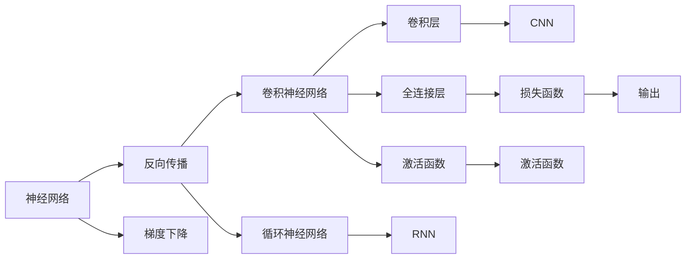

                 

# 神经网络：人工智能的基石

> 关键词：神经网络,深度学习,反向传播,梯度下降,卷积神经网络,循环神经网络,卷积层,全连接层,激活函数,损失函数

## 1. 背景介绍

### 1.1 问题由来
神经网络（Neural Network），作为深度学习（Deep Learning）的核心组件，自从1958年提出以来，一直是人工智能（AI）领域的研究热点。从最初的感知器模型（Perceptron）到多层感知器（MLP），再到卷积神经网络（CNN）和循环神经网络（RNN），神经网络技术在图像识别、语音识别、自然语言处理等多个领域取得了革命性突破。

进入21世纪，随着大数据和计算力的迅猛发展，深度学习技术得到了广泛应用，深度神经网络（DNN）、卷积神经网络（CNN）、循环神经网络（RNN）等成为AI领域的主流模型，推动了人工智能技术从研究向应用的大跨越。

### 1.2 问题核心关键点
神经网络的核心在于其模拟人脑神经元之间的连接关系，通过数据的逐层传递和不断调整权重，实现复杂的非线性映射和特征提取。其核心思想是通过反向传播（Backpropagation）算法，不断优化模型参数，最小化预测误差。

神经网络的学习过程主要包括以下几个关键步骤：

1. 前向传播：输入数据经过神经网络的逐层处理，最终输出预测结果。
2. 损失计算：计算预测结果与真实标签之间的误差，如均方误差（MSE）、交叉熵（Cross-Entropy）等。
3. 反向传播：根据损失函数计算梯度，反向传播更新网络权重。
4. 参数更新：使用梯度下降等优化算法，更新模型参数，最小化预测误差。

神经网络的强大之处在于其可以学习非常复杂的非线性关系，适应各种非线性的映射任务。但由于其高度非线性，模型的训练往往需要大量的数据和计算资源，且训练过程复杂，模型调试难度较大。

### 1.3 问题研究意义
神经网络作为深度学习的基础，是人工智能技术发展的重要基石。掌握神经网络原理和技术，对于理解和应用人工智能技术具有重要意义：

1. 揭示人脑工作机制：神经网络模型为理解人脑神经元之间的连接和交互提供了重要思路，推动了对人类认知机理的研究。
2. 推动人工智能应用：神经网络为图像识别、语音识别、自然语言处理等多个领域的深度学习应用提供了强大工具，推动了人工智能技术的产业化进程。
3. 拓展算法创新：神经网络的非线性特性激发了更多算法创新，如卷积神经网络（CNN）、循环神经网络（RNN）、生成对抗网络（GAN）等。
4. 增强模型泛化能力：神经网络模型通过大量数据的学习，可以提取高层次的特征表示，提高模型泛化能力，适应不同的任务场景。
5. 促进跨学科研究：神经网络的学习理论和算法设计涉及数学、统计学、计算机科学等多个学科，推动了多学科的交叉和融合。

## 2. 核心概念与联系

### 2.1 核心概念概述

为更好地理解神经网络的原理和结构，本节将介绍几个关键核心概念：

- 神经网络（Neural Network）：由大量人工神经元（或节点）组成，通过逐层传递信息，实现复杂非线性映射的网络结构。
- 反向传播（Backpropagation）：一种基于梯度的优化算法，通过反向计算误差梯度，更新神经网络中的权重和偏置，最小化预测误差。
- 梯度下降（Gradient Descent）：一种常用的优化算法，通过沿着负梯度方向迭代更新参数，以最小化损失函数。
- 卷积神经网络（CNN）：一种特殊类型的神经网络，主要用于图像处理，通过卷积和池化操作提取特征。
- 循环神经网络（RNN）：一种适用于序列数据处理的神经网络，通过循环连接实现时间上的信息传递和记忆。
- 卷积层（Convolutional Layer）：CNN中的核心组件，通过卷积操作提取图像特征。
- 全连接层（Fully Connected Layer）：将卷积层的特征向量进行全连接，输出最终的预测结果。
- 激活函数（Activation Function）：用于引入非线性因素，如ReLU、Sigmoid等。
- 损失函数（Loss Function）：衡量模型预测结果与真实标签之间差异的函数，如MSE、Cross-Entropy等。

这些概念之间的逻辑关系可以通过以下Mermaid流程图来展示：



这个流程图展示了几类主要神经网络模型之间的关系：

1. 神经网络通过反向传播进行参数优化。
2. 卷积神经网络（CNN）和循环神经网络（RNN）是神经网络的两种重要形式，分别适用于图像和序列数据处理。
3. CNN中的卷积层和全连接层通过激活函数引入非线性因素，提取图像特征。
4. RNN中的循环层通过时间步传递信息，实现序列数据的建模。
5. 损失函数用于评估模型预测结果，指导参数更新。

这些核心概念共同构成了神经网络的基本结构和算法框架，为深度学习技术的发展提供了坚实的基础。

## 3. 核心算法原理 & 具体操作步骤
### 3.1 算法原理概述

神经网络的训练过程是一个复杂的多变量优化问题，其核心在于通过反向传播算法，不断调整权重和偏置，最小化预测误差。以下是神经网络训练过程的详细描述：

1. **前向传播**：将输入数据依次传递通过网络中的每一层，输出最终预测结果。
2. **损失计算**：将预测结果与真实标签进行比较，计算误差，如均方误差（MSE）、交叉熵（Cross-Entropy）等。
3. **反向传播**：根据损失函数计算误差梯度，从输出层开始，逐层反向传播，更新权重和偏置。
4. **参数更新**：使用梯度下降等优化算法，沿着负梯度方向更新参数，最小化预测误差。

这一过程可以形式化描述为：

- 设神经网络 $N$ 的输入为 $x$，权重为 $\theta$，激活函数为 $\sigma$，损失函数为 $L$，则预测结果 $y$ 可表示为：
$$ y = \sigma(W_L x + b_L) $$

其中 $W_L$ 和 $b_L$ 为第 $L$ 层的权重和偏置。

- 计算损失 $L(y, t)$，其中 $t$ 为真实标签。

- 反向传播误差梯度 $\nabla L$，更新权重和偏置：
$$ \frac{\partial L}{\partial W_L} = \frac{\partial L}{\partial y} \frac{\partial y}{\partial x} $$
$$ \frac{\partial L}{\partial b_L} = \frac{\partial L}{\partial y} $$

- 重复上述过程，直到所有层都更新完毕。

### 3.2 算法步骤详解

神经网络的训练过程主要包括以下几个关键步骤：

1. **准备数据集**：收集和处理训练数据，分为训练集、验证集和测试集。
2. **定义模型结构**：选择合适的神经网络结构，如卷积神经网络（CNN）、循环神经网络（RNN）等，定义网络各层的参数。
3. **设置超参数**：选择合适的优化算法（如SGD、Adam等）、学习率、批大小等超参数。
4. **前向传播**：输入数据通过网络各层，输出预测结果。
5. **损失计算**：计算预测结果与真实标签之间的误差。
6. **反向传播**：根据损失函数计算误差梯度，反向传播更新权重和偏置。
7. **参数更新**：使用梯度下降等优化算法，更新模型参数，最小化预测误差。
8. **评估模型**：在验证集和测试集上评估模型性能，防止过拟合。

### 3.3 算法优缺点

神经网络的训练过程具有以下优点：

- 强大的非线性映射能力：通过多层非线性变换，神经网络可以学习复杂的非线性关系。
- 广泛的适用性：适用于图像、语音、文本等多种类型的数据，具有强大的泛化能力。
- 高效的特征提取：自动学习输入数据的特征表示，减少人工特征工程的工作量。

同时，神经网络也存在一些局限性：

- 训练难度大：模型参数多，训练过程复杂，需要大量数据和计算资源。
- 容易过拟合：模型复杂，易在训练数据上过拟合，泛化能力不足。
- 可解释性差：神经网络黑箱特性明显，难以解释模型内部工作机制和决策逻辑。

尽管存在这些局限性，神经网络仍然是深度学习技术的重要基石，在各个领域得到了广泛应用。

### 3.4 算法应用领域

神经网络的应用领域非常广泛，以下是几个典型的应用场景：

1. **图像识别**：神经网络通过卷积层和池化层提取图像特征，全连接层进行分类，广泛应用于人脸识别、图像分类等任务。
2. **语音识别**：神经网络通过卷积层和RNN提取语音特征，全连接层进行分类，广泛应用于语音助手、自动字幕生成等任务。
3. **自然语言处理**：神经网络通过RNN或Transformer模型处理文本序列，实现语言模型、机器翻译、情感分析等任务。
4. **推荐系统**：神经网络通过学习用户行为和物品特征，构建推荐模型，应用于个性化推荐、广告投放等任务。
5. **游戏AI**：神经网络通过学习游戏规则和玩家行为，构建游戏AI，应用于游戏智能、对战策略等任务。
6. **自动驾驶**：神经网络通过学习视觉、雷达数据，构建自动驾驶系统，应用于车辆导航、环境感知等任务。

神经网络技术在各个领域的成功应用，证明了其在复杂数据处理和模式识别方面的强大能力。

## 4. 数学模型和公式 & 详细讲解  
### 4.1 数学模型构建

神经网络的数学模型主要包括以下几个部分：

- 输入层：将原始数据转换为神经网络可处理的形式。
- 隐藏层：通过神经元之间的连接，进行特征提取和特征映射。
- 输出层：根据隐藏层的特征表示，输出最终预测结果。

以一个简单的全连接神经网络为例，其数学模型可以表示为：

- 输入层：$x = [x_1, x_2, ..., x_n]$
- 隐藏层：$h = \sigma(Wx + b)$
- 输出层：$y = W'h + b'$

其中 $x$ 为输入向量，$h$ 为隐藏层输出，$y$ 为输出向量。$W$ 和 $b$ 为权重和偏置矩阵。$\sigma$ 为激活函数，如ReLU、Sigmoid等。$W'$ 和 $b'$ 为输出层的权重和偏置矩阵。

### 4.2 公式推导过程

以全连接神经网络为例，推导其前向传播和反向传播过程的公式。

**前向传播**：
$$ z = Wx + b $$
$$ h = \sigma(z) $$
$$ y = W'f(h) + b' $$

其中 $z$ 为线性变换后的结果，$h$ 为激活函数处理后的结果，$f(h)$ 为输出层激活函数，如Softmax、Sigmoid等。

**反向传播**：
$$ \frac{\partial L}{\partial y} = \frac{\partial L}{\partial f(h)} \frac{\partial f(h)}{\partial h} $$
$$ \frac{\partial L}{\partial z} = \frac{\partial L}{\partial y} \frac{\partial y}{\partial f(h)} \frac{\partial f(h)}{\partial h} $$
$$ \frac{\partial L}{\partial W} = \frac{\partial L}{\partial z} \frac{\partial z}{\partial x} $$
$$ \frac{\partial L}{\partial b} = \frac{\partial L}{\partial z} $$

其中 $\frac{\partial L}{\partial y}$ 为损失函数对输出层的梯度，$\frac{\partial y}{\partial f(h)}$ 为输出层激活函数的导数，$\frac{\partial f(h)}{\partial h}$ 为激活函数的导数，$\frac{\partial z}{\partial x}$ 为线性变换的导数。

### 4.3 案例分析与讲解

以图像分类为例，展示神经网络模型的具体实现。

假设输入图像为 $28 \times 28 = 784$ 维的像素向量，网络结构如下：

- 输入层：$x = [x_1, x_2, ..., x_{784}]$
- 隐藏层1：$h_1 = \sigma(W_1x + b_1)$
- 隐藏层2：$h_2 = \sigma(W_2h_1 + b_2)$
- 输出层：$y = W_3h_2 + b_3$

其中 $W_1$ 和 $b_1$ 为隐藏层1的权重和偏置矩阵，$W_2$ 和 $b_2$ 为隐藏层2的权重和偏置矩阵，$W_3$ 和 $b_3$ 为输出层的权重和偏置矩阵。

网络的前向传播过程如下：

$$ z_1 = W_1x + b_1 $$
$$ h_1 = \sigma(z_1) $$
$$ z_2 = W_2h_1 + b_2 $$
$$ h_2 = \sigma(z_2) $$
$$ z_3 = W_3h_2 + b_3 $$
$$ y = \text{Softmax}(z_3) $$

其中 $\text{Softmax}$ 为输出层激活函数，将输出映射到类别概率分布。

网络的反向传播过程如下：

$$ \frac{\partial L}{\partial y} = \frac{\partial L}{\partial f(h_2)} \frac{\partial f(h_2)}{\partial h_2} $$
$$ \frac{\partial L}{\partial h_2} = \frac{\partial L}{\partial y} \frac{\partial y}{\partial f(h_2)} \frac{\partial f(h_2)}{\partial h_2} $$
$$ \frac{\partial L}{\partial z_2} = \frac{\partial L}{\partial h_2} \frac{\partial h_2}{\partial z_2} $$
$$ \frac{\partial L}{\partial W_2} = \frac{\partial L}{\partial z_2} \frac{\partial z_2}{\partial h_1} \frac{\partial h_1}{\partial z_1} $$
$$ \frac{\partial L}{\partial b_2} = \frac{\partial L}{\partial z_2} $$
$$ \frac{\partial L}{\partial W_1} = \frac{\partial L}{\partial z_1} \frac{\partial z_1}{\partial x} $$
$$ \frac{\partial L}{\partial b_1} = \frac{\partial L}{\partial z_1} $$

通过上述公式，可以计算出所有权重和偏置的梯度，从而进行参数更新。

## 5. 项目实践：代码实例和详细解释说明
### 5.1 开发环境搭建

在进行神经网络训练前，需要准备好开发环境。以下是使用Python进行TensorFlow开发的环境配置流程：

1. 安装Anaconda：从官网下载并安装Anaconda，用于创建独立的Python环境。

2. 创建并激活虚拟环境：
```bash
conda create -n tf-env python=3.8 
conda activate tf-env
```

3. 安装TensorFlow：根据CUDA版本，从官网获取对应的安装命令。例如：
```bash
conda install tensorflow -c tf -c conda-forge
```

4. 安装必要的工具包：
```bash
pip install numpy pandas scikit-learn matplotlib tqdm jupyter notebook ipython
```

完成上述步骤后，即可在`tf-env`环境中开始神经网络训练实践。

### 5.2 源代码详细实现

下面我们以手写数字识别为例，给出使用TensorFlow对神经网络进行训练的Python代码实现。

首先，定义模型：

```python
import tensorflow as tf
from tensorflow.keras import layers

model = tf.keras.Sequential([
    layers.Dense(128, activation='relu'),
    layers.Dense(10, activation='softmax')
])
```

然后，准备数据集：

```python
(x_train, y_train), (x_test, y_test) = tf.keras.datasets.mnist.load_data()
x_train = x_train.reshape((60000, 784))
x_test = x_test.reshape((10000, 784))
x_train, x_test = x_train / 255.0, x_test / 255.0
```

接着，定义损失函数和优化器：

```python
loss_fn = tf.keras.losses.SparseCategoricalCrossentropy(from_logits=True)
optimizer = tf.keras.optimizers.Adam(learning_rate=0.001)
```

最后，定义训练和评估函数：

```python
def train_step(inputs, targets):
    with tf.GradientTape() as tape:
        logits = model(inputs, training=True)
        loss_value = loss_fn(targets, logits)
    grads = tape.gradient(loss_value, model.trainable_variables)
    optimizer.apply_gradients(zip(grads, model.trainable_variables))
    return loss_value

def evaluate_step(inputs, targets):
    logits = model(inputs, training=False)
    return loss_fn(targets, logits)
```

启动训练流程：

```python
epochs = 10

for epoch in range(epochs):
    for (x, y) in train_dataset:
        loss_value = train_step(x, y)
    for (x, y) in eval_dataset:
        loss_value = evaluate_step(x, y)
    print(f"Epoch {epoch+1}, loss: {loss_value:.4f}")
```

以上就是一个简单的神经网络训练的完整代码实现。可以看到，使用TensorFlow进行神经网络训练非常简洁高效。

### 5.3 代码解读与分析

让我们再详细解读一下关键代码的实现细节：

**Sequential模型**：
- 定义神经网络结构，包含两层全连接层，激活函数分别为ReLU和Softmax。

**数据预处理**：
- 将原始图像数据转换为模型可处理的形式，通过reshape调整维度。
- 将像素值归一化到[0,1]区间，便于模型训练。

**损失函数**：
- 使用SparseCategoricalCrossentropy损失函数，用于计算多分类任务上的交叉熵损失。

**优化器**：
- 使用Adam优化器，设置学习率。

**训练函数**：
- 定义前向传播和损失计算过程，使用梯度下降更新模型参数。
- 返回当前epoch的平均损失值。

**评估函数**：
- 与训练类似，不同点在于模型不更新参数，直接输出损失值。

**训练流程**：
- 循环迭代每个epoch，在训练集上训练模型，在验证集上评估模型。
- 输出每个epoch的平均损失值。

可以看到，TensorFlow为神经网络训练提供了强大的框架支持，开发者可以轻松实现和优化神经网络模型。

当然，工业级的系统实现还需考虑更多因素，如模型保存和部署、超参数的自动搜索、更灵活的任务适配层等。但核心的训练范式基本与此类似。

## 6. 实际应用场景
### 6.1 智能客服系统

神经网络技术在智能客服系统中的应用非常广泛。传统客服往往需要配备大量人力，高峰期响应缓慢，且一致性和专业性难以保证。而使用训练好的神经网络模型，可以7x24小时不间断服务，快速响应客户咨询，用自然流畅的语言解答各类常见问题。

在技术实现上，可以收集企业内部的历史客服对话记录，将问题和最佳答复构建成监督数据，在此基础上对神经网络模型进行训练。训练好的模型能够自动理解用户意图，匹配最合适的答案模板进行回复。对于客户提出的新问题，还可以接入检索系统实时搜索相关内容，动态组织生成回答。如此构建的智能客服系统，能大幅提升客户咨询体验和问题解决效率。

### 6.2 金融舆情监测

金融机构需要实时监测市场舆论动向，以便及时应对负面信息传播，规避金融风险。传统的人工监测方式成本高、效率低，难以应对网络时代海量信息爆发的挑战。基于神经网络的文本分类和情感分析技术，为金融舆情监测提供了新的解决方案。

具体而言，可以收集金融领域相关的新闻、报道、评论等文本数据，并对其进行主题标注和情感标注。在此基础上对神经网络模型进行训练，使其能够自动判断文本属于何种主题，情感倾向是正面、中性还是负面。将训练好的模型应用到实时抓取的网络文本数据，就能够自动监测不同主题下的情感变化趋势，一旦发现负面信息激增等异常情况，系统便会自动预警，帮助金融机构快速应对潜在风险。

### 6.3 个性化推荐系统

当前的推荐系统往往只依赖用户的历史行为数据进行物品推荐，无法深入理解用户的真实兴趣偏好。基于神经网络技术的个性化推荐系统可以更好地挖掘用户行为背后的语义信息，从而提供更精准、多样的推荐内容。

在实践中，可以收集用户浏览、点击、评论、分享等行为数据，提取和用户交互的物品标题、描述、标签等文本内容。将文本内容作为模型输入，用户的后续行为（如是否点击、购买等）作为监督信号，在此基础上训练神经网络模型。训练好的模型能够从文本内容中准确把握用户的兴趣点。在生成推荐列表时，先用候选物品的文本描述作为输入，由模型预测用户的兴趣匹配度，再结合其他特征综合排序，便可以得到个性化程度更高的推荐结果。

### 6.4 未来应用展望

随着神经网络技术的不断进步，其在各个领域的应用前景广阔。未来，神经网络技术将在以下几个方面继续发展：

1. **深度学习算法的创新**：神经网络的核心算法如反向传播、梯度下降等仍需不断优化，以提高训练效率和模型性能。
2. **多模态学习**：神经网络将与视觉、语音、文本等多种数据模态结合，提升模型的通用性和泛化能力。
3. **联邦学习**：在保证数据隐私的前提下，利用分布式计算资源，提升模型的训练效率和鲁棒性。
4. **自监督学习**：通过无监督学习方式，训练神经网络，减少对标注数据的需求。
5. **知识图谱与神经网络融合**：将符号化的先验知识与神经网络结合，提高模型的可解释性和可控性。

总之，神经网络技术将继续推动人工智能技术的深度应用，为各行业提供更高效、更智能的解决方案。

## 7. 工具和资源推荐
### 7.1 学习资源推荐

为了帮助开发者系统掌握神经网络原理和技术，这里推荐一些优质的学习资源：

1. **《深度学习》课程**：斯坦福大学开设的深度学习课程，有Lecture视频和配套作业，适合初学者入门。

2. **《神经网络与深度学习》书籍**：Michael Nielsen所著，详细介绍了神经网络的工作原理和实现细节，是学习神经网络的经典教材。

3. **TensorFlow官方文档**：TensorFlow的官方文档，提供了全面的神经网络模型和优化算法，是实际应用的重要参考。

4. **Keras官方文档**：Keras的官方文档，提供了简单易用的神经网络API，适合快速上手深度学习项目。

5. **Coursera深度学习系列课程**：Coursera平台上的深度学习课程，由多位领域专家授课，涵盖了从基础到高级的深度学习内容。

通过对这些资源的学习实践，相信你一定能够快速掌握神经网络的精髓，并用于解决实际的深度学习问题。

### 7.2 开发工具推荐

高效的开发离不开优秀的工具支持。以下是几款用于神经网络开发和训练的常用工具：

1. TensorFlow：由Google主导开发的开源深度学习框架，生产部署方便，适合大规模工程应用。

2. PyTorch：基于Python的开源深度学习框架，灵活动态的计算图，适合快速迭代研究。

3. Keras：高层深度学习API，支持TensorFlow、Theano等后端，适合快速搭建和调试神经网络模型。

4. Jupyter Notebook：开源的交互式编程环境，支持多种编程语言，适合数据科学和机器学习项目开发。

5. Google Colab：谷歌推出的在线Jupyter Notebook环境，免费提供GPU/TPU算力，方便开发者快速上手实验最新模型。

合理利用这些工具，可以显著提升神经网络开发和训练的效率，加快创新迭代的步伐。

### 7.3 相关论文推荐

神经网络技术的发展源于学界的持续研究。以下是几篇奠基性的相关论文，推荐阅读：

1. **深度学习的三大经典论文**：Hinton、LeCun和Bengio三位大佬分别发表的深度学习相关论文，奠定了深度学习的基础。

2. **ImageNet大规模视觉识别挑战赛（ILSVRC）**：ILSVRC比赛推动了深度学习在图像识别领域的应用，催生了AlexNet、VGGNet、ResNet等经典模型。

3. **Transformer模型**：Attention机制的引入，极大地提升了神经网络的计算效率和模型性能，推动了NLP、图像处理等领域的突破。

4. **GAN生成对抗网络**：Generator和Discriminator两部分的博弈对抗，推动了生成模型在图像生成、风格转换等任务上的应用。

5. **自适应梯度算法**：如AdaGrad、Adadelta等，优化了梯度下降算法，提高了神经网络的训练效率和收敛速度。

这些论文代表了大神经网络技术的发展脉络。通过学习这些前沿成果，可以帮助研究者把握学科前进方向，激发更多的创新灵感。

## 8. 总结：未来发展趋势与挑战
### 8.1 总结

本文对神经网络技术进行了全面系统的介绍。首先阐述了神经网络的核心原理和算法框架，明确了其在学习任务和非线性映射方面的独特优势。其次，从原理到实践，详细讲解了神经网络训练的具体步骤，给出了训练任务开发的完整代码实例。同时，本文还广泛探讨了神经网络在智能客服、金融舆情、个性化推荐等多个行业领域的应用前景，展示了其强大的数据处理和模式识别能力。

通过本文的系统梳理，可以看到，神经网络作为深度学习的重要基石，是人工智能技术发展的重要推动力。它为复杂的非线性问题提供了可行的解决方案，推动了人工智能技术在图像识别、语音识别、自然语言处理等多个领域的广泛应用。未来，伴随神经网络技术的不断演进，人工智能技术必将在更多领域实现突破性进展。

### 8.2 未来发展趋势

展望未来，神经网络技术将呈现以下几个发展趋势：

1. **模型结构复杂化**：随着任务复杂度的提升，神经网络模型的结构将进一步复杂化，包含更多层和参数。
2. **硬件加速普及**：随着GPU、TPU等硬件加速设备的普及，神经网络模型的训练效率将进一步提升。
3. **多模态学习融合**：神经网络将与视觉、语音、文本等多种数据模态结合，提升模型的通用性和泛化能力。
4. **自监督学习应用**：通过无监督学习方式，训练神经网络，减少对标注数据的需求。
5. **联邦学习推广**：在保证数据隐私的前提下，利用分布式计算资源，提升模型的训练效率和鲁棒性。
6. **知识图谱与神经网络融合**：将符号化的先验知识与神经网络结合，提高模型的可解释性和可控性。

这些趋势凸显了神经网络技术的强大潜力和广阔前景。通过不断优化模型结构和算法，推动硬件加速，结合多模态数据，神经网络技术必将在更多领域实现突破性进展，为人工智能技术的发展提供更强大的支持。

### 8.3 面临的挑战

尽管神经网络技术已经取得了显著进展，但在迈向更加智能化、普适化应用的过程中，仍面临诸多挑战：

1. **数据需求大**：神经网络模型的训练需要大量标注数据，获取高质量标注数据成本较高。
2. **过拟合风险高**：模型结构复杂，易在训练数据上过拟合，泛化能力不足。
3. **计算资源消耗大**：大规模神经网络模型训练和推理消耗大量计算资源，对硬件设备有较高要求。
4. **可解释性差**：神经网络黑箱特性明显，难以解释模型内部工作机制和决策逻辑。
5. **偏见和公平性问题**：神经网络模型可能学习到数据中的偏见，导致输出结果不公平。
6. **安全性风险**：神经网络模型易被恶意攻击，输出结果可能被篡改。

尽管存在这些挑战，但通过不断的技术创新和算法优化，神经网络技术在各个领域的应用将不断深化和拓展，推动人工智能技术向更高层次发展。

### 8.4 研究展望

面对神经网络技术所面临的挑战，未来的研究需要在以下几个方面寻求新的突破：

1. **数据增强与生成对抗网络**：通过数据增强和生成对抗网络（GAN）技术，增加训练数据的多样性，减少过拟合风险。
2. **模型压缩与优化**：通过模型压缩和优化技术，减少模型参数和计算资源消耗，提高训练和推理效率。
3. **可解释性增强**：通过引入可解释性技术，如LIME、SHAP等，增强神经网络模型的可解释性，提高模型可信度。
4. **公平性与偏见消除**：通过公平性约束和偏见消除技术，提升神经网络模型的公平性和鲁棒性。
5. **安全性保障**：通过对抗样本生成和防御技术，提高神经网络模型的安全性，防止恶意攻击。

通过在这些方面的不断努力，神经网络技术必将在各个领域实现更广泛的应用，为人工智能技术的普及和落地提供更强大的技术支持。

## 9. 附录：常见问题与解答

**Q1：神经网络模型的训练过程是否需要大量的计算资源？**

A: 是的，神经网络模型的训练通常需要大量的计算资源。模型参数多，计算复杂，且需要大规模的标注数据。为了提高训练效率，通常采用GPU、TPU等高性能设备，并使用分布式计算资源，如Distributed TensorFlow等。

**Q2：神经网络模型在实际应用中是否容易过拟合？**

A: 是的，神经网络模型通常容易在训练数据上过拟合。为了避免过拟合，可以采用数据增强、正则化、Dropout等技术，限制模型的复杂度。

**Q3：如何提高神经网络模型的可解释性？**

A: 神经网络模型的可解释性通常较低，但可以通过引入可解释性技术，如LIME、SHAP等，对模型进行局部解释。同时，可以通过设计任务描述、输出格式等方式，增强模型的可理解性。

**Q4：神经网络模型在实际应用中是否存在偏见问题？**

A: 是的，神经网络模型可能学习到数据中的偏见，导致输出结果不公平。为避免偏见，可以通过公平性约束和偏见消除技术，对模型进行优化。

**Q5：神经网络模型在实际应用中是否容易被攻击？**

A: 是的，神经网络模型易被恶意攻击，如对抗样本攻击等。为提高安全性，可以采用对抗样本生成和防御技术，提高模型的鲁棒性。

通过以上系统的分析和解答，相信你对神经网络技术的核心原理、应用场景和未来发展方向有了更全面的了解。未来，随着神经网络技术的不断进步和创新，人工智能技术必将在更多领域实现突破性进展，为人类社会的进步提供更强大的支持。

