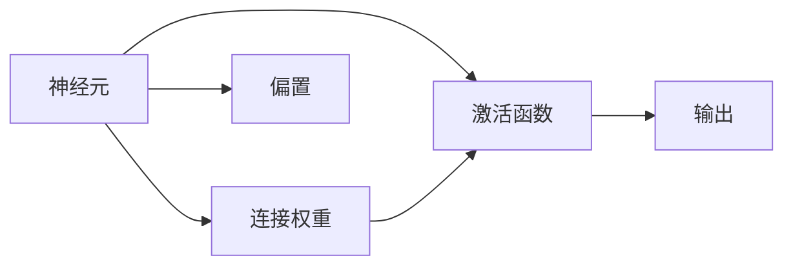

                 

# 神经网络：人工智能的基石

## 1. 背景介绍

### 1.1 问题由来

人工智能(AI)是人类智慧的结晶，其核心技术包括机器学习、深度学习、计算机视觉、自然语言处理(NLP)等。在深度学习领域，神经网络(即人工神经网络)作为核心算法，扮演了极其重要的角色。它通过模仿人脑的神经元结构和功能，实现了复杂数据的表示、处理和预测，在图像识别、语音识别、文本生成等任务上取得了卓越成果。

近年来，随着深度学习框架如TensorFlow、PyTorch等的出现，神经网络模型更加易于开发和应用。与此同时，得益于计算资源的激增和海量数据的积累，神经网络模型在诸多领域取得了革命性的突破。从AlphaGo击败世界围棋冠军，到GPT-3在NLP领域的惊艳表现，神经网络不断刷新人们对其能力的认知。

然而，尽管神经网络在许多任务上表现出色，但仍存在一些瓶颈问题，如黑盒特性、泛化能力不足、计算成本高等。这些问题限制了神经网络的应用范围，使得其在实际工程中的推广和部署仍面临挑战。因此，本文旨在深入探讨神经网络的原理、优势与挑战，为更好地理解和应用神经网络提供参考。

### 1.2 问题核心关键点

神经网络的核心思想是通过多层非线性变换，将输入数据映射到输出空间，并学习复杂的输入输出映射关系。其核心组件包括神经元、连接权重、激活函数等。神经网络的训练过程是通过反向传播算法，优化连接权重和偏置，最小化预测误差。

神经网络的优点包括：
1. 强大的非线性表达能力。能够处理复杂的非线性关系，适应各种输入输出映射。
2. 鲁棒性。在一定范围内的噪声和扰动下仍能保持较高的预测准确率。
3. 可扩展性。通过增加神经元层数和节点数，可以逐渐提升模型的复杂度和表达能力。
4. 适用性广泛。可以应用于各种领域，如图像识别、语音处理、自然语言处理等。

神经网络的主要缺点包括：
1. 黑盒特性。模型内部的工作机制难以解释，难以理解模型为何做出特定预测。
2. 过拟合。在大规模训练数据上训练过拟合风险较高，泛化能力较弱。
3. 计算资源消耗大。模型参数量大，计算复杂度高，训练和推理成本较高。
4. 模型训练过程复杂。需要处理大量的数据和超参数，训练过程较为繁琐。

尽管存在上述缺点，神经网络仍因其强大的表达能力和泛化能力，成为当前人工智能领域的研究热点。本节将从神经网络的基本概念、算法原理、操作步骤、数学模型、项目实践、实际应用、资源推荐等方面，系统介绍神经网络的原理与实践。

## 2. 核心概念与联系

### 2.1 核心概念概述

神经网络由大量人工神经元(神经元)组成，这些神经元通过连接权重和偏置相互连接，形成层次化的网络结构。每一层的输出作为下一层的输入，经过多层的非线性变换，最终输出预测结果。

- **神经元**：神经网络的基本组成单元，接收输入并输出。每个神经元由连接权重和偏置组成，连接权重决定了输入对输出的影响，偏置表示神经元的基本活动水平。
- **连接权重**：神经元之间的连接参数，反映了输入和输出之间的关系。权重通过训练过程不断调整。
- **偏置**：每个神经元的偏置项，用于补偿激活函数的非线性部分，使得神经元在未接受输入时能够产生一个固定的输出。
- **激活函数**：用于非线性变换的函数，将神经元的线性加权和映射到非线性输出空间。常见的激活函数包括Sigmoid、ReLU、Tanh等。
- **反向传播算法**：用于优化连接权重和偏置的算法，通过梯度下降等方法最小化预测误差。

这些核心概念构成了神经网络的基本框架，通过多层非线性变换，神经网络能够处理各种复杂的输入输出映射。

### 2.2 核心概念原理和架构的 Mermaid 流程图



### 2.3 核心概念联系

神经网络中的各个组件通过连接权重和偏置相互连接，形成层次化的网络结构。每一层的输出作为下一层的输入，通过多层的非线性变换，最终输出预测结果。这种层次化和非线性变换的特性，使得神经网络能够适应各种复杂的输入输出映射。

## 3. 核心算法原理 & 具体操作步骤
### 3.1 算法原理概述

神经网络的训练过程是通过反向传播算法，优化连接权重和偏置，最小化预测误差。其核心思想是：

1. 将输入数据输入神经网络，通过多层非线性变换，得到预测结果。
2. 将预测结果与真实标签进行比较，计算预测误差。
3. 通过反向传播算法，计算连接权重和偏置的梯度，更新参数。
4. 重复步骤2-3，直至达到预设的训练轮数或收敛条件。

### 3.2 算法步骤详解

神经网络的训练过程主要包括以下几个步骤：

**Step 1: 数据准备**
- 收集并准备训练数据集和测试数据集，确保数据质量和高多样性。
- 将数据进行标准化、归一化处理，以便于模型的训练。

**Step 2: 网络搭建**
- 定义神经网络的层次结构，包括输入层、隐藏层和输出层。
- 初始化连接权重和偏置，通常使用随机初始化或Xavier初始化。
- 选择激活函数，如ReLU、Sigmoid、Tanh等。

**Step 3: 前向传播**
- 将输入数据通过网络进行前向传播，计算各层的输出。
- 使用激活函数对输出进行非线性变换。
- 输出最终的预测结果。

**Step 4: 损失计算**
- 将预测结果与真实标签进行比较，计算损失函数值。
- 常见的损失函数包括均方误差、交叉熵等。

**Step 5: 反向传播**
- 计算预测误差对连接权重和偏置的梯度。
- 使用梯度下降等优化算法，更新模型参数。
- 迭代多次，直至达到收敛条件或预设的训练轮数。

**Step 6: 测试评估**
- 在测试数据集上评估模型的性能。
- 计算模型的准确率、召回率、F1-score等指标。
- 分析模型性能的优劣，确定优化策略。

### 3.3 算法优缺点

神经网络的优点包括：
1. 强大的表达能力。能够处理各种复杂的输入输出映射，适用于各种NLP任务。
2. 鲁棒性。在一定范围内的噪声和扰动下仍能保持较高的预测准确率。
3. 可扩展性。通过增加神经元层数和节点数，可以逐渐提升模型的复杂度和表达能力。
4. 适用性广泛。可以应用于各种领域，如图像识别、语音处理、自然语言处理等。

神经网络的主要缺点包括：
1. 黑盒特性。模型内部的工作机制难以解释，难以理解模型为何做出特定预测。
2. 过拟合。在大规模训练数据上训练过拟合风险较高，泛化能力较弱。
3. 计算资源消耗大。模型参数量大，计算复杂度高，训练和推理成本较高。
4. 模型训练过程复杂。需要处理大量的数据和超参数，训练过程较为繁琐。

尽管存在上述缺点，神经网络仍因其强大的表达能力和泛化能力，成为当前人工智能领域的研究热点。

### 3.4 算法应用领域

神经网络在人工智能领域有着广泛的应用，涵盖各个领域，包括但不限于：

1. 图像识别：通过卷积神经网络(CNN)进行图像分类、物体检测等任务。
2. 语音处理：通过循环神经网络(RNN)进行语音识别、文本生成等任务。
3. 自然语言处理：通过长短期记忆网络(LSTM)、Transformer等进行语言模型、机器翻译等任务。
4. 推荐系统：通过协同过滤、基于矩阵分解的方法进行推荐。
5. 强化学习：通过深度强化学习进行游戏AI、机器人控制等任务。

## 4. 数学模型和公式 & 详细讲解 & 举例说明

### 4.1 数学模型构建

神经网络的数学模型通常可以表示为：

$$
y = \sigma\left(\sum_{i=1}^{n}w_i x_i + b\right)
$$

其中，$x_i$ 为输入数据，$w_i$ 为连接权重，$b$ 为偏置项，$\sigma$ 为激活函数。多层的神经网络可以表示为：

$$
y^{[l]} = \sigma\left(\sum_{i=1}^{n}w^{[l]} x^{[l-1]} + b^{[l]}\right)
$$

其中，$x^{[l]}$ 为第 $l$ 层的输入，$w^{[l]}$ 和 $b^{[l]}$ 分别为第 $l$ 层的连接权重和偏置项。最终的输出结果为 $y^{[1]}$。

### 4.2 公式推导过程

神经网络的训练过程主要通过反向传播算法实现。假设输入数据为 $x$，真实标签为 $y$，输出结果为 $y'$，则损失函数可以表示为：

$$
L(y, y') = \frac{1}{2}(y - y')^2
$$

前向传播过程如下：

$$
y^{[1]} = \sigma\left(\sum_{i=1}^{n}w^{[1]} x_i + b^{[1]}\right)
$$

$$
y^{[2]} = \sigma\left(\sum_{i=1}^{n}w^{[2]} y^{[1]} + b^{[2]}\right)
$$

...

$$
y^{[L]} = \sigma\left(\sum_{i=1}^{n}w^{[L]} y^{[L-1]} + b^{[L]}\right)
$$

其中，$L$ 为网络层数。

反向传播算法计算梯度如下：

$$
\frac{\partial L}{\partial y^{[L]}} = \frac{\partial L}{\partial y'} \frac{\partial y'}{\partial y^{[L]}}
$$

$$
\frac{\partial L}{\partial y^{[L-1]}} = \frac{\partial L}{\partial y^{[L]}} \frac{\partial y^{[L]}}{\partial y^{[L-1]}}
$$

...

$$
\frac{\partial L}{\partial w^{[1]}} = \frac{\partial L}{\partial y^{[1]}} \frac{\partial y^{[1]}}{\partial w^{[1]}}
$$

其中，$\frac{\partial L}{\partial y^{[l]}}$ 为第 $l$ 层的梯度，$\frac{\partial y^{[l]}}{\partial y^{[l-1]}}$ 为激活函数的导数，$\frac{\partial y^{[l]}}{\partial w^{[l]}}$ 为连接权重的导数。

### 4.3 案例分析与讲解

以MNIST手写数字识别为例，使用神经网络进行训练和预测。具体步骤如下：

1. 数据准备：收集并准备MNIST数据集，并进行标准化处理。
2. 网络搭建：定义三层神经网络，包括输入层、两个隐藏层和输出层。
3. 前向传播：将训练数据输入网络，计算各层输出。
4. 损失计算：计算均方误差损失。
5. 反向传播：计算连接权重和偏置的梯度，使用梯度下降算法更新参数。
6. 测试评估：在测试数据集上评估模型性能。

## 5. 项目实践：代码实例和详细解释说明

### 5.1 开发环境搭建

在进行神经网络项目实践前，我们需要准备好开发环境。以下是使用Python进行TensorFlow进行神经网络开发的典型环境配置流程：

1. 安装Anaconda：从官网下载并安装Anaconda，用于创建独立的Python环境。

2. 创建并激活虚拟环境：
```bash
conda create -n tf-env python=3.8 
conda activate tf-env
```

3. 安装TensorFlow：根据CUDA版本，从官网获取对应的安装命令。例如：
```bash
pip install tensorflow
```

4. 安装各类工具包：
```bash
pip install numpy pandas scikit-learn matplotlib tqdm jupyter notebook ipython
```

完成上述步骤后，即可在`tf-env`环境中开始神经网络项目的开发。

### 5.2 源代码详细实现

下面我们以手写数字识别(MNIST)为例，给出使用TensorFlow搭建并训练神经网络的PyTorch代码实现。

```python
import tensorflow as tf
from tensorflow.keras import datasets, layers, models

# 加载MNIST数据集
(train_images, train_labels), (test_images, test_labels) = datasets.mnist.load_data()

# 数据预处理
train_images = train_images.reshape((60000, 28 * 28))
train_images = train_images / 255.0

test_images = test_images.reshape((10000, 28 * 28))
test_images = test_images / 255.0

# 构建神经网络模型
model = models.Sequential([
    layers.Flatten(input_shape=(28, 28)),
    layers.Dense(128, activation='relu'),
    layers.Dense(10)
])

# 编译模型
model.compile(optimizer='adam',
              loss=tf.keras.losses.SparseCategoricalCrossentropy(from_logits=True),
              metrics=['accuracy'])

# 训练模型
model.fit(train_images, train_labels, epochs=10, validation_data=(test_images, test_labels))
```

### 5.3 代码解读与分析

让我们再详细解读一下关键代码的实现细节：

1. **数据预处理**：将MNIST数据集的图片数据从二维数组形式重构为一维数组，并进行标准化处理。
2. **模型定义**：使用Sequential模型定义三层神经网络，包括一个Flatten层将二维图片数据展平为一维向量，两个全连接层(Dense)，其中第一个层采用ReLU激活函数。
3. **模型编译**：设置优化器为Adam，损失函数为交叉熵，评价指标为准确率。
4. **模型训练**：在训练集上训练模型，设置训练轮数为10。

## 6. 实际应用场景

### 6.1 智能推荐系统

神经网络在推荐系统中的应用非常广泛，通过学习和分析用户的历史行为数据，预测用户对新物品的偏好，推荐个性化的商品或内容。具体而言，可以通过对用户行为数据进行编码，输入到神经网络中进行训练，得到用户兴趣向量，再根据该向量推荐最相关的物品。

### 6.2 图像识别

神经网络在图像识别领域取得了显著进展，通过卷积神经网络(CNN)可以处理大规模图像数据，学习图像特征，实现物体检测、分类等任务。常见的应用场景包括人脸识别、自动驾驶、医学影像分析等。

### 6.3 语音识别

循环神经网络(RNN)在语音识别领域也有广泛应用。通过将语音数据输入神经网络，学习声音特征，实现语音识别、语音合成等任务。神经网络还可以应用于语音情感分析、语音指令识别等场景。

### 6.4 自然语言处理

神经网络在自然语言处理领域也有广泛应用。通过循环神经网络(RNN)和长短时记忆网络(LSTM)可以实现语言模型、机器翻译、文本分类等任务。此外，基于Transformer的模型如BERT、GPT等，在自然语言理解、生成等方面也取得了突破性进展。

## 7. 工具和资源推荐

### 7.1 学习资源推荐

为了帮助开发者系统掌握神经网络的理论基础和实践技巧，这里推荐一些优质的学习资源：

1. 《深度学习》（Ian Goodfellow等著）：全面介绍深度学习理论、算法和应用，是深度学习领域的经典教材。
2. 《动手学深度学习》（李沐等著）：提供丰富的代码实例和实验，适合动手实践学习。
3. 《神经网络与深度学习》（Michael Nielsen）：通俗易懂地介绍了神经网络的基本原理和实现方法。
4. 《深度学习入门：基于Python的理论与实现》（斋藤康毅）：适合初学者，内容浅显易懂，实用性强。
5. 《机器学习实战》（Peter Harrington）：涵盖机器学习、深度学习的经典案例，适合实战练习。

通过对这些资源的学习实践，相信你一定能够快速掌握神经网络的精髓，并用于解决实际的AI问题。

### 7.2 开发工具推荐

高效的开发离不开优秀的工具支持。以下是几款用于神经网络开发的常用工具：

1. TensorFlow：由Google主导开发的开源深度学习框架，生产部署方便，适合大规模工程应用。
2. PyTorch：由Facebook主导开发的开源深度学习框架，灵活性强，支持动态计算图。
3. Keras：高层神经网络API，简单易用，支持TensorFlow、Theano等后端。
4. JAX：基于JIT编译的深度学习框架，支持自动微分、向量化解构等高级特性。
5. MXNet：由Amazon开发的支持多语言、分布式计算的深度学习框架。
6. Caffe：由Berkeley开发的开源深度学习框架，适合图像处理任务。

合理利用这些工具，可以显著提升神经网络开发的效率，加快创新迭代的步伐。

### 7.3 相关论文推荐

神经网络在人工智能领域的研究历史悠久，以下是几篇奠基性的相关论文，推荐阅读：

1. 《深度学习》（Goodfellow等著）：深度学习领域的经典教材，涵盖神经网络的基础理论、算法和应用。
2. 《AlexNet：ImageNet分类挑战赛2012胜者》：介绍AlexNet模型的结构和训练方法，标志着深度学习在图像识别领域的应用突破。
3. 《ImageNet分类挑战赛2012报告》：介绍了ImageNet数据集及其在深度学习中的应用。
4. 《Long Short-Term Memory》：提出LSTM模型，解决了RNN模型在长序列上的梯度消失问题，提升了序列建模能力。
5. 《ImageNet分类挑战赛2015报告》：介绍了深度学习在图像识别领域的最新进展和应用。

这些论文代表了大神经网络的研究进展，通过学习这些前沿成果，可以帮助研究者把握学科前进方向，激发更多的创新灵感。

## 8. 总结：未来发展趋势与挑战

### 8.1 总结

本文对神经网络的基本概念、算法原理、操作步骤、数学模型、项目实践、实际应用、资源推荐等方面进行了系统介绍。通过本文的介绍，希望能帮助你更好地理解和应用神经网络，解决实际AI问题。

### 8.2 未来发展趋势

展望未来，神经网络将继续在人工智能领域发挥重要作用，以下是几个主要的发展趋势：

1. 深度学习模型的不断进化：随着计算资源的增加，神经网络模型将逐渐向更深、更宽的维度发展，提高模型的复杂度和表达能力。
2. 自监督学习的兴起：自监督学习通过未标记数据进行预训练，降低对标注数据的依赖，提升模型的泛化能力。
3. 混合模型和融合技术的应用：混合模型结合神经网络和传统方法，提升模型的鲁棒性和泛化能力。
4. 多模态学习和跨领域知识整合：多模态学习结合图像、语音、文本等多种数据，提升模型的理解和表达能力。
5. 神经网络模型的解释性和可解释性：研究神经网络模型的解释性，提升模型的透明性和可解释性。
6. 模型压缩和优化技术的发展：研究神经网络模型的压缩和优化技术，降低模型计算复杂度和内存消耗。

### 8.3 面临的挑战

尽管神经网络在各个领域取得了显著进展，但仍面临一些挑战：

1. 数据需求量大：神经网络模型需要大量的标注数据进行训练，数据采集和标注成本较高。
2. 计算资源消耗大：神经网络模型参数量大，计算复杂度高，训练和推理成本较高。
3. 黑盒特性难以解释：神经网络模型的内部工作机制难以解释，难以理解模型为何做出特定预测。
4. 泛化能力不足：神经网络模型在未见过的数据上表现较差，泛化能力有限。
5. 鲁棒性不足：神经网络模型对输入数据和噪声的鲁棒性较差，容易受到干扰。

### 8.4 研究展望

未来的研究需要在以下几个方向进行突破：

1. 发展高效、可解释的神经网络模型。研究高效的神经网络结构，提升模型的解释性和可解释性。
2. 探索自监督和混合学习方法。结合自监督学习和混合学习方法，降低对标注数据的依赖，提升模型的泛化能力。
3. 研究多模态学习和跨领域知识整合。结合图像、语音、文本等多种数据，提升模型的理解和表达能力。
4. 发展混合模型和融合技术。结合神经网络和传统方法，提升模型的鲁棒性和泛化能力。
5. 研究模型压缩和优化技术。研究神经网络模型的压缩和优化技术，降低模型计算复杂度和内存消耗。

总之，未来的研究需要在多个方向进行突破，才能将神经网络模型推向更高的台阶，为构建安全、可靠、可解释、可控的智能系统铺平道路。

## 9. 附录：常见问题与解答

**Q1：神经网络是否适用于所有AI任务？**

A: 神经网络适用于各种AI任务，如图像识别、语音识别、自然语言处理等。但对于一些特定领域的任务，如金融风险评估、医学诊断等，神经网络可能难以直接应用。此时需要结合领域知识，设计合适的神经网络结构，进行任务特定的训练。

**Q2：如何优化神经网络模型？**

A: 神经网络模型的优化可以从多个方面进行，包括：
1. 数据预处理：进行标准化、归一化处理，提升数据质量。
2. 模型结构设计：增加网络层数和节点数，调整激活函数和连接权重。
3. 优化算法：选择合适优化器，设置合适的学习率和批量大小。
4. 正则化技术：使用L2正则、Dropout等技术，防止过拟合。
5. 数据增强：通过回译、近义替换等方式扩充训练集。
6. 模型压缩：通过剪枝、量化等技术，减少模型参数量和计算复杂度。

这些优化方法需要根据具体任务和数据特点进行灵活组合，才能最大化模型的性能。

**Q3：神经网络模型训练过程复杂，如何降低计算成本？**

A: 降低神经网络模型训练过程的计算成本，可以从以下几个方面进行：
1. 模型压缩：通过剪枝、量化等技术，减少模型参数量和计算复杂度。
2. 混合精度训练：使用半精度浮点数进行训练，降低内存消耗和计算成本。
3. 分布式训练：利用分布式计算技术，加速模型训练过程。
4. 梯度累积：通过将多个batch的梯度累加，减小每个batch的计算量，提升训练速度。
5. 数据预处理：进行数据预处理，提升数据处理效率，降低训练成本。

合理利用这些方法，可以显著降低神经网络模型的训练成本，加速模型开发和应用。

**Q4：神经网络模型如何解释？**

A: 神经网络模型的解释性可以从以下几个方面进行：
1. 可视化：通过可视化神经网络的结构和训练过程，理解模型的内部工作机制。
2. 特征重要性：分析神经网络模型的特征重要性，理解模型对各个特征的依赖关系。
3. 可解释模型：使用可解释性较强的模型结构，如线性回归、决策树等，提升模型的透明性和可解释性。
4. 模型压缩：通过模型压缩技术，减少模型参数量和计算复杂度，提升模型的可解释性。

这些方法需要根据具体任务和数据特点进行灵活组合，才能提升模型的解释性和透明性。

**Q5：神经网络模型如何应对噪声和扰动？**

A: 神经网络模型应对噪声和扰动的方法可以从以下几个方面进行：
1. 数据增强：通过回译、近义替换等方式扩充训练集，提升模型鲁棒性。
2. 正则化技术：使用L2正则、Dropout等技术，防止过拟合，提升模型泛化能力。
3. 对抗训练：引入对抗样本，提升模型鲁棒性，防止模型过拟合。
4. 模型压缩：通过模型压缩技术，减少模型参数量和计算复杂度，提升模型的鲁棒性。
5. 混合模型：结合神经网络和传统方法，提升模型的鲁棒性和泛化能力。

这些方法需要根据具体任务和数据特点进行灵活组合，才能提升模型的鲁棒性和泛化能力。

---

作者：禅与计算机程序设计艺术 / Zen and the Art of Computer Programming

