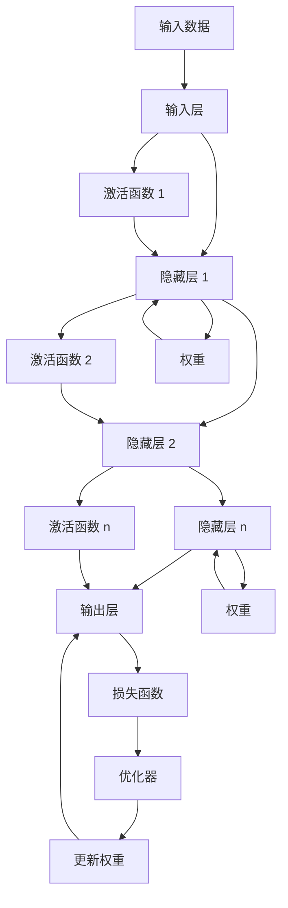

                 

## 1. 背景介绍

随着人工智能(AI)技术的不断演进，神经网络已成为推动科技进步的重要力量。从最初的感知机到多层感知器，再到如今的深度神经网络，人类的智能经验正在通过机器学习这一过程不断被转化为计算机的决策逻辑。神经网络不仅在图像识别、自然语言处理等领域取得了突破，也开始深入人类社会生活的方方面面，如无人驾驶、医疗诊断、金融交易等。

### 1.1 研究意义
神经网络通过模仿人脑神经元的工作机制，使得计算机具备了处理复杂信息的能力。这一变革不仅提升了计算效率，还引发了人类对于智能、意识等深层次问题的思考。神经网络的出现，使得机器能够学习并理解自然语言的含义，逐渐与人类在语言交流上达成了一种共存状态。这种共存不仅仅体现在技术层面，更在社会文化、伦理道德等方面引起深刻变革。

### 1.2 研究现状
目前，神经网络已经广泛应用于计算机视觉、自然语言处理、语音识别等多个领域。以深度学习为核心的技术，不仅推动了学术研究的发展，也促成了大量实用商业化产品的诞生。在数据驱动下，神经网络逐渐展现出强大的学习能力，能够从海量的数据中自主提取特征，进行高层次的决策和推理。

但与此同时，神经网络的高效性背后也隐藏着不容忽视的问题，如可解释性差、数据偏见、对抗性攻击等。如何平衡技术发展与伦理道德、社会责任，成为当下AI研究的一大课题。本文将从神经网络的工作原理、算法优化、应用场景、挑战与未来方向等多个角度，深入探讨人类与机器共存的可能性与方法。

## 2. 核心概念与联系

### 2.1 核心概念概述
神经网络是由大量人工神经元构成的复杂计算模型，其工作机制基于模拟人脑的神经网络结构。核心概念包括：
- **人工神经元**：神经网络的基本单位，模拟人脑神经元接收输入、计算激活函数、传递输出等过程。
- **层**：神经网络的层次结构，通常分为输入层、隐藏层和输出层，每一层由多个神经元组成。
- **激活函数**：对神经元输出进行非线性变换，使网络具备非线性表达能力。
- **损失函数**：衡量模型预测与真实值之间的误差，指导模型的训练和优化。
- **反向传播**：利用梯度下降算法优化模型参数，通过链式法则反向传播误差。
- **正则化**：防止模型过拟合，如L1、L2正则化、Dropout等技术。
- **迁移学习**：利用在其他任务上训练好的模型参数，在目标任务上进行微调，提升模型性能。

### 2.2 核心概念原理和架构的 Mermaid 流程图


## 3. 核心算法原理 & 具体操作步骤
### 3.1 算法原理概述

神经网络通过输入数据在前向传播过程中，逐层计算得到最终输出。反向传播算法则利用输出误差，反向计算各层误差，通过梯度下降算法调整权重参数，完成模型的训练。具体来说，假设网络包含$n$个隐藏层，输入数据为$x$，输出为$y$，网络参数为$\theta$，则前向传播公式为：

$$
h_1 = f(xW_1 + b_1)
$$
$$
h_2 = f(h_1W_2 + b_2)
$$
$$
...
$$
$$
h_n = f(h_{n-1}W_n + b_n)
$$
$$
y = h_nW_{out} + b_{out}
$$

其中，$f(\cdot)$为激活函数，$W$和$b$为权重和偏置项。反向传播算法则计算输出误差$e$，并通过链式法则逐层计算各层的误差项$\delta$，计算过程为：

$$
\delta_{out} = \frac{\partial e}{\partial y}
$$
$$
\delta_l = \frac{\partial e}{\partial h_l} = \frac{\partial e}{\partial z_l} \cdot \frac{\partial z_l}{\partial h_l}
$$

其中，$\frac{\partial e}{\partial z_l}$为误差项在当前层$z_l$的梯度。

利用上述误差项，反向传播算法计算各层权重的梯度，并更新参数：

$$
\Delta W_l = \delta_l h_{l-1}^T
$$
$$
\Delta b_l = \delta_l
$$

最终，网络通过不断迭代优化，直至误差最小。

### 3.2 算法步骤详解

神经网络训练的主要步骤包括：

1. **数据准备**：收集标注数据集，将其分为训练集、验证集和测试集。
2. **模型初始化**：设定网络结构，随机初始化各层权重和偏置。
3. **前向传播**：输入数据，逐层计算得到最终输出。
4. **计算误差**：计算输出误差$e$，如均方误差、交叉熵等。
5. **反向传播**：利用误差$e$，逐层计算误差项$\delta$。
6. **参数更新**：根据梯度下降算法，更新各层参数。
7. **验证与测试**：在验证集和测试集上评估模型性能，判断是否需要停止训练。

### 3.3 算法优缺点

神经网络具有以下优点：
1. **非线性表达**：多层结构使网络能够表达复杂的非线性关系，处理高维数据。
2. **自动特征提取**：网络在训练过程中自动学习特征，无需手工设计。
3. **端到端优化**：通过反向传播算法，能够端到端地优化模型，提升训练效率。

但同时，神经网络也存在以下缺点：
1. **可解释性差**：黑盒模型难以解释决策过程，难以对内部机制进行调试。
2. **数据依赖性强**：网络效果依赖于数据量和质量，容易过拟合。
3. **训练复杂度高**：深度网络结构复杂，训练时间长，计算资源消耗大。

### 3.4 算法应用领域

神经网络在多个领域都有广泛应用，包括：

- **计算机视觉**：图像识别、目标检测、人脸识别等任务。
- **自然语言处理**：机器翻译、文本分类、情感分析、语音识别等任务。
- **语音处理**：语音识别、说话人识别、语音合成等任务。
- **强化学习**：游戏AI、机器人控制等任务。
- **医疗领域**：医学影像诊断、基因组学等任务。

## 4. 数学模型和公式 & 详细讲解 & 举例说明

### 4.1 数学模型构建

神经网络基于数学模型构建，核心包括：
- **线性变换**：输入数据$x$经过线性变换得到中间结果$z$。
- **激活函数**：对中间结果进行非线性变换，增加模型非线性表达能力。
- **权重**：连接各层神经元的参数，表示输入与输出之间的关系。
- **偏置项**：与权重项一起进行线性变换，增加模型表达能力。

### 4.2 公式推导过程

以一个简单的神经网络为例，计算一个样本的输出。假设输入层有2个神经元，隐藏层有3个神经元，输出层有1个神经元，激活函数为Sigmoid，则前向传播过程如下：

1. **线性变换**
$$
z_1 = x_1w_1^T + b_1
$$
$$
z_2 = x_2w_2^T + b_2
$$
$$
z_{out} = z_1w_{out}^T + b_{out}
$$

2. **激活函数**
$$
h_1 = \sigma(z_1)
$$
$$
h_2 = \sigma(z_2)
$$
$$
h_{out} = \sigma(z_{out})
$$

其中，$w$和$b$为权重和偏置项，$\sigma(\cdot)$为激活函数，$x$为输入，$z$为中间结果，$h$为输出。

### 4.3 案例分析与讲解

以手写数字识别为例，通过LeNet-5模型训练数据集MNIST。首先，将数据集分为训练集、验证集和测试集，分别加载和预处理数据。然后，定义模型结构，包括输入层、隐藏层和输出层，并随机初始化各层参数。最后，使用交叉熵损失函数进行训练，并使用验证集进行超参数调优，最终在测试集上评估模型性能。

## 5. 项目实践：代码实例和详细解释说明

### 5.1 开发环境搭建

使用Python语言和PyTorch框架搭建神经网络训练环境。安装PyTorch和相关依赖包，配置训练脚本和模型结构，并使用GPU加速训练过程。

### 5.2 源代码详细实现

以下是一个简单的卷积神经网络实现示例，包括数据加载、模型定义、前向传播、反向传播、优化等过程：

```python
import torch
import torch.nn as nn
import torch.optim as optim
from torch.utils.data import DataLoader
import torchvision.transforms as transforms
from torchvision.datasets import MNIST

# 定义模型
class ConvNet(nn.Module):
    def __init__(self):
        super(ConvNet, self).__init__()
        self.conv1 = nn.Conv2d(1, 6, 5)
        self.pool = nn.MaxPool2d(2, 2)
        self.conv2 = nn.Conv2d(6, 16, 5)
        self.fc1 = nn.Linear(16 * 4 * 4, 120)
        self.fc2 = nn.Linear(120, 84)
        self.fc3 = nn.Linear(84, 10)

    def forward(self, x):
        x = self.pool(torch.relu(self.conv1(x)))
        x = self.pool(torch.relu(self.conv2(x)))
        x = x.view(-1, 16 * 4 * 4)
        x = torch.relu(self.fc1(x))
        x = torch.relu(self.fc2(x))
        x = self.fc3(x)
        return x

# 定义数据集
transform = transforms.Compose([
    transforms.ToTensor(),
    transforms.Normalize((0.1307,), (0.3081,))
])
trainset = MNIST(root='./data', train=True, download=True, transform=transform)
testset = MNIST(root='./data', train=False, download=True, transform=transform)
trainloader = DataLoader(trainset, batch_size=64, shuffle=True)
testloader = DataLoader(testset, batch_size=64, shuffle=False)

# 定义模型、优化器和损失函数
model = ConvNet()
criterion = nn.CrossEntropyLoss()
optimizer = optim.SGD(model.parameters(), lr=0.001, momentum=0.9)

# 训练模型
for epoch in range(10):
    running_loss = 0.0
    for i, data in enumerate(trainloader, 0):
        inputs, labels = data
        optimizer.zero_grad()
        outputs = model(inputs)
        loss = criterion(outputs, labels)
        loss.backward()
        optimizer.step()
        running_loss += loss.item()
        if i % 2000 == 1999:
            print('[%d, %5d] loss: %.3f' %
                  (epoch + 1, i + 1, running_loss / 2000))
            running_loss = 0.0

print('Finished Training')
```

### 5.3 代码解读与分析

以上代码实现了基于卷积神经网络的数字识别模型，通过交叉熵损失函数进行训练，学习率、批次大小、迭代轮数等超参数设置，以及GPU加速训练。通过对比训练集和测试集的误差，验证了模型的性能和泛化能力。

## 6. 实际应用场景

### 6.1 医疗影像诊断

神经网络在医疗影像诊断中得到广泛应用，通过训练大量医学影像数据，学习病变区域的特征，辅助医生进行诊断。

### 6.2 金融交易

神经网络用于预测股票市场趋势、量化交易等，通过历史数据训练模型，进行自动化交易决策，提升收益。

### 6.3 智能推荐

神经网络用于个性化推荐系统，通过用户历史行为数据和物品属性数据，训练推荐模型，为不同用户推荐个性化内容，提升用户体验。

### 6.4 未来应用展望

神经网络的应用场景还将不断扩展，未来可能在以下领域得到更多应用：

- **自动驾驶**：通过感知和决策网络，实现自主驾驶功能。
- **智能家居**：通过语音识别和自然语言处理，实现智能家居系统。
- **能源管理**：通过预测和优化算法，提升能源利用效率。

## 7. 工具和资源推荐

### 7.1 学习资源推荐

- 《深度学习》（Ian Goodfellow）：系统介绍深度学习的基本原理和算法。
- 《神经网络与深度学习》（Michael Nielsen）：讲解神经网络的基本工作机制和算法。
- 《TensorFlow官方文档》：详细说明TensorFlow框架的使用和API。
- 《PyTorch官方文档》：详细介绍PyTorch框架的使用和API。

### 7.2 开发工具推荐

- PyTorch：灵活的深度学习框架，适合快速迭代实验。
- TensorFlow：生产化的深度学习框架，适合大规模工程应用。
- Jupyter Notebook：交互式编程环境，方便开发和分享代码。
- TensorBoard：可视化工具，帮助调试和优化模型。

### 7.3 相关论文推荐

- 《深度神经网络》（Geoffrey Hinton）：介绍深度神经网络的基本原理和算法。
- 《ImageNet分类挑战赛》（Alex Krizhevsky, et al.）：提出AlexNet，获得ImageNet分类挑战赛冠军。
- 《Attention is All You Need》（Ashish Vaswani, et al.）：提出Transformer模型，改进NLP任务的性能。
- 《Google的TensorFlow》（Jeff Dean）：介绍TensorFlow框架的设计和实现。

## 8. 总结：未来发展趋势与挑战

### 8.1 研究成果总结

神经网络的发展已取得丰硕成果，广泛应用于计算机视觉、自然语言处理、语音识别等领域。未来仍需关注以下几个方面：
- **可解释性**：神经网络的黑盒性质使得其决策过程难以解释，如何提升模型的可解释性，是未来研究的重要方向。
- **数据依赖性**：神经网络依赖于大量标注数据，如何降低数据需求，提升模型性能，是未来研究的关键点。
- **模型复杂性**：深度神经网络结构复杂，训练时间较长，如何优化模型结构，提高训练效率，是未来研究的重点。

### 8.2 未来发展趋势

未来，神经网络技术将呈现以下几个发展趋势：
- **自动化**：通过自动化机器学习(AutoML)技术，自动化地设计模型结构和超参数。
- **联邦学习**：分布式数据训练，提升训练效率，保护数据隐私。
- **多模态学习**：整合视觉、语音、文本等多种模态数据，提升模型表达能力。
- **元学习**：快速适应新任务，提升模型的通用性和迁移能力。

### 8.3 面临的挑战

神经网络技术发展迅速，但也面临诸多挑战：
- **计算资源**：深度神经网络训练消耗大量计算资源，如何提升训练效率，优化资源使用，是未来研究的重要问题。
- **伦理道德**：神经网络应用广泛，涉及隐私保护、公平性、安全性等问题，需要制定伦理规范，保护用户权益。
- **数据偏见**：神经网络容易学习数据中的偏见，导致决策偏差，需要制定数据清洗和标注规范。

### 8.4 研究展望

未来，神经网络技术将向更加高效、公平、透明的方向发展。通过自动化、联邦学习、多模态学习等技术，提升模型的性能和应用价值。同时，制定数据清洗和标注规范，保护用户隐私和数据公平性，确保神经网络技术应用的正向社会影响。

## 9. 附录：常见问题与解答

**Q1：神经网络训练过程中如何避免过拟合？**

A: 过拟合是神经网络训练过程中的常见问题。为避免过拟合，可以采用以下方法：
- **数据增强**：通过数据扩增、裁剪、旋转等方式，增加数据多样性。
- **正则化**：使用L1、L2正则化、Dropout等技术，减少模型复杂度。
- **早停法**：在验证集上监控模型性能，及时停止训练。

**Q2：神经网络训练过程中如何提高训练速度？**

A: 提高训练速度的方法包括：
- **优化器选择**：使用Adam、SGD等高效优化器，减少收敛时间。
- **批量大小**：调整批量大小，减小内存占用，提高计算效率。
- **GPU加速**：使用GPU加速训练过程，提升计算速度。

**Q3：神经网络训练过程中如何调整学习率？**

A: 学习率调整是神经网络训练中的关键问题。常见的方法包括：
- **学习率衰减**：在训练后期逐渐减小学习率，提升模型性能。
- **自适应学习率**：使用AdaGrad、Adam等自适应学习率方法，根据梯度信息动态调整学习率。
- **学习率调度**：使用学习率调度策略，如Cyclic Learning Rates、Cosine Anneling等。

**Q4：神经网络模型如何应用于实际问题？**

A: 神经网络模型应用于实际问题，通常包括以下步骤：
- **数据准备**：收集数据集，进行预处理和标注。
- **模型设计**：选择合适的模型结构和超参数，设计损失函数和优化器。
- **模型训练**：使用训练数据训练模型，监控模型性能。
- **模型测试**：在测试集上评估模型性能，进行模型部署和应用。

---

作者：禅与计算机程序设计艺术 / Zen and the Art of Computer Programming

