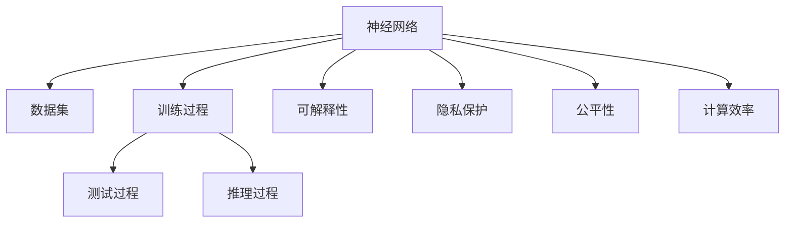

                 

## 1. 背景介绍

### 1.1 问题由来
随着人工智能技术的飞速发展，神经网络在图像识别、自然语言处理、语音识别等多个领域展现出了强大的应用潜力。然而，神经网络的高效性能依赖于大规模数据和计算资源的投入，而这些资源的获取和使用往往涉及复杂的伦理和隐私问题。同时，神经网络在决策过程中缺乏可解释性，可能导致出现不公正、不透明的问题。这些问题引发了学术界和产业界对神经网络的广泛关注和深入思考。

### 1.2 问题核心关键点
本文聚焦于如何构建更加透明、公平、可控的神经网络系统，通过理论与实践相结合的方式，探索人类与机器在共存过程中所面临的挑战和解决方案。核心问题包括：

1. 如何确保神经网络模型的透明性和可解释性，避免“黑箱”问题。
2. 如何在数据获取、处理和使用过程中，尊重用户隐私，保护个人信息安全。
3. 如何构建公平、公正的神经网络系统，避免算法偏见，确保决策的公平性。
4. 如何优化神经网络模型的计算效率和资源利用率，确保其在大规模应用中的可行性和可扩展性。

### 1.3 问题研究意义
构建透明、公平、可控的神经网络系统，不仅能够提升其应用性能，还能够增强公众对其的信任度，推动人工智能技术的广泛普及和应用。研究这一问题，对于促进人工智能技术的可持续发展，构建和谐的社会环境具有重要意义。

## 2. 核心概念与联系

### 2.1 核心概念概述

为更好地理解人类与机器共存下的神经网络系统，本节将介绍几个关键概念及其相互联系：

- **神经网络**：一种基于生物神经元模型的计算模型，通过多层非线性映射实现复杂的模式识别和预测任务。
- **可解释性**：指神经网络模型在决策过程中，其内部机制和推理逻辑能够被清晰理解和解释的能力。
- **隐私保护**：指在数据获取、处理和使用过程中，确保用户个人信息安全和避免隐私泄露的措施。
- **公平性**：指神经网络模型在决策过程中，能够避免算法偏见，确保不同个体和群体的权益不受歧视的能力。
- **计算效率**：指神经网络模型在训练和推理过程中的资源消耗和时间复杂度。

这些核心概念构成了构建透明、公平、可控神经网络系统的基本框架，通过对它们的深入理解，可以更好地把握神经网络的发展方向和优化策略。

### 2.2 核心概念原理和架构的 Mermaid 流程图



这个流程图展示了神经网络模型的核心流程及其与可解释性、隐私保护、公平性和计算效率之间的关系。神经网络模型通过训练过程学习数据特征，并通过测试和推理过程进行预测。可解释性、隐私保护、公平性和计算效率是构建透明、公平、可控神经网络系统的关键要素，需要通过不同的技术手段加以实现和优化。

## 3. 核心算法原理 & 具体操作步骤

### 3.1 算法原理概述

构建透明、公平、可控的神经网络系统，本质上是优化和平衡上述核心概念的过程。本文将从这三个方面分别探讨相关的算法原理和具体操作步骤。

### 3.2 算法步骤详解

#### 3.2.1 可解释性算法
1. **可视化技术**：通过可视化工具如Grad-CAM、SHAP等，展示神经网络模型的特征图和激活值，帮助理解模型在特定输入上的决策依据。
2. **局部解释**：对神经网络模型的每一层进行详细解释，解释其对特定输入的贡献。
3. **整体解释**：利用因果推断和结构方程模型等方法，解释神经网络模型的整体结构和决策过程。

#### 3.2.2 隐私保护算法
1. **数据匿名化**：通过数据扰动、噪声注入等技术，对敏感数据进行匿名化处理，确保数据隐私。
2. **差分隐私**：在数据处理过程中，通过添加噪声、限制查询频率等手段，保护用户隐私。
3. **联邦学习**：在分布式环境中，各节点共同参与模型的训练，避免数据集中存储。

#### 3.2.3 公平性算法
1. **偏差检测**：使用各种公平性指标如Equalized Odds、Demographic Parity等，检测模型中的算法偏见。
2. **重加权**：通过对训练样本进行重加权，确保少数群体的代表性。
3. **对抗训练**：生成对抗样本，训练模型对不同群体的数据进行公平处理。

#### 3.2.4 计算效率算法
1. **模型压缩**：通过剪枝、量化、参数共享等技术，减少模型大小和计算量。
2. **模型并行**：利用GPU、TPU等加速设备，实现模型并行计算。
3. **分布式训练**：在多个计算节点上进行分布式训练，提高训练效率。

### 3.3 算法优缺点

#### 3.3.1 可解释性算法
- **优点**：
  - 能够帮助理解和信任神经网络模型，提高决策透明度。
  - 能够检测和纠正模型中的错误决策，增强模型的可靠性和安全性。
- **缺点**：
  - 可视化技术和局部解释可能难以全面解释复杂模型，存在一定的局限性。
  - 整体解释技术较为复杂，需要高度专业化的知识和工具。

#### 3.3.2 隐私保护算法
- **优点**：
  - 能够在数据处理过程中保护用户隐私，避免数据泄露。
  - 能够增强用户对神经网络系统的信任度，推动系统的广泛应用。
- **缺点**：
  - 数据匿名化和差分隐私等技术可能会引入一定的数据失真，影响模型的准确性。
  - 联邦学习等分布式训练技术需要较高的通信和计算开销。

#### 3.3.3 公平性算法
- **优点**：
  - 能够确保神经网络模型在决策过程中不偏不倚，公平对待不同群体。
  - 能够提升模型的伦理道德水平，避免社会偏见和歧视。
- **缺点**：
  - 偏差检测和重加权技术可能对特定数据集效果有限，存在一定的局限性。
  - 对抗训练等技术需要额外的数据和计算资源，增加了实现难度。

#### 3.3.4 计算效率算法
- **优点**：
  - 能够显著提升神经网络模型的训练和推理效率，降低资源消耗。
  - 能够增强系统的可扩展性和可靠性，支持大规模应用。
- **缺点**：
  - 模型压缩和量化等技术可能牺牲一定的模型精度，影响应用效果。
  - 分布式训练等技术需要复杂的协同管理和通信机制，增加了系统复杂度。

### 3.4 算法应用领域

神经网络的可解释性、隐私保护、公平性和计算效率等核心概念，在多个领域都有广泛的应用：

- **医疗领域**：在医疗诊断和治疗方案推荐中，需要透明、公平的神经网络系统，以避免算法偏见和决策错误。
- **金融领域**：在信用评估、贷款审批等场景中，需要保护用户隐私，确保决策的公平性和透明性。
- **司法领域**：在案件判别和量刑建议中，需要透明、公平的神经网络系统，以确保司法公正。
- **广告领域**：在广告推荐和个性化营销中，需要高效的神经网络系统，以提升广告效果和用户体验。
- **交通领域**：在交通流量预测和智能调度中，需要高效的神经网络系统，以优化交通系统运行。

## 4. 数学模型和公式 & 详细讲解

### 4.1 数学模型构建

为了更好地理解人类与机器共存下的神经网络系统，本节将使用数学语言对可解释性、隐私保护、公平性和计算效率等关键概念进行详细讲解。

#### 4.1.1 可解释性数学模型
假设神经网络模型的输入为 $x$，输出为 $y$，模型的特征图为 $h(x)$。可解释性算法通过计算 $h(x)$ 与 $y$ 之间的依赖关系，解释模型在特定输入上的决策依据。

#### 4.1.2 隐私保护数学模型
在隐私保护算法中，通常使用差分隐私技术来保护用户隐私。差分隐私的目标是在保证数据隐私的前提下，最大化模型的准确性。其数学表达式为：
$$
\mathcal{L}(p, \epsilon) = \frac{1}{\epsilon}W(x)\log\left(1 + \frac{1}{\delta}\right)
$$
其中 $p(x)$ 为原始数据分布，$\epsilon$ 为隐私保护参数，$W(x)$ 为数据敏感度，$\delta$ 为隐私失真容忍度。

#### 4.1.3 公平性数学模型
在公平性算法中，常用的公平性指标包括Demographic Parity和Equalized Odds。Demographic Parity要求不同群体的模型输出在统计上相等，其数学表达式为：
$$
\mathcal{L}_{DP} = \frac{1}{N}\sum_{i=1}^{N}|\mathbb{E}[y_i|x_i] - \mathbb{E}[y_i]|
$$
Equalized Odds要求不同群体的模型输出在条件期望上相等，其数学表达式为：
$$
\mathcal{L}_{EO} = \frac{1}{2}\sum_{y}\left(\frac{1}{n_y}\sum_{x}(y|x)\right) + \frac{1}{2}\sum_{y}\left(\frac{1}{n_y}\sum_{x}(1-y|x)\right)
$$
其中 $n_y$ 为不同群体的样本数量，$y|x$ 为条件概率。

#### 4.1.4 计算效率数学模型
在计算效率算法中，常用的技术包括模型压缩和量化。模型压缩的数学表达式为：
$$
\mathcal{L}_{comp} = \frac{1}{N}\sum_{i=1}^{N}\left(|W_i^{compressed}| - |W_i|\right)
$$
其中 $W_i$ 为模型权重，$W_i^{compressed}$ 为压缩后的权重。

### 4.2 公式推导过程

#### 4.2.1 可解释性公式推导
假设神经网络模型由 $K$ 层组成，每层权重为 $W_k$，激活函数为 $f_k$。设 $h_1(x)$ 为第一层特征图，则 $h_2(x) = f_2(W_2h_1(x))$，以此类推，最终输出为 $y = f_K(W_Kh_{K-1}(x))$。通过计算 $h_1(x)$ 和 $y$ 之间的依赖关系，可以解释模型的特征提取过程。

#### 4.2.2 隐私保护公式推导
在差分隐私中，通过添加噪声 $\eta$ 来保护用户隐私。假设原始数据分布为 $p(x)$，噪声分布为 $q(\eta)$，则保护后的数据分布为：
$$
p_{\eta}(x) = \frac{1}{Z}\exp\left(\frac{\eta}{\epsilon}\right)p(x)
$$
其中 $Z$ 为归一化因子。通过计算 $p_{\eta}(x)$ 与 $p(x)$ 的相似度，可以评估模型的隐私保护效果。

#### 4.2.3 公平性公式推导
在Demographic Parity中，通过计算不同群体之间的期望差异来检测模型偏见。设 $x$ 为群体特征，$y$ 为模型输出，则Demographic Parity的数学表达式为：
$$
\mathcal{L}_{DP} = \frac{1}{N}\sum_{i=1}^{N}|\mathbb{E}[y_i|x_i] - \mathbb{E}[y_i]|
$$
在Equalized Odds中，通过计算不同群体之间的条件期望差异来检测模型偏见。设 $y|x$ 为条件概率，则Equalized Odds的数学表达式为：
$$
\mathcal{L}_{EO} = \frac{1}{2}\sum_{y}\left(\frac{1}{n_y}\sum_{x}(y|x)\right) + \frac{1}{2}\sum_{y}\left(\frac{1}{n_y}\sum_{x}(1-y|x)\right)
$$

#### 4.2.4 计算效率公式推导
在模型压缩中，通过剪枝和量化技术来减少模型大小和计算量。假设原始模型参数为 $W$，压缩后的参数为 $W^{compressed}$，则模型压缩的损失函数为：
$$
\mathcal{L}_{comp} = \frac{1}{N}\sum_{i=1}^{N}\left(|W_i^{compressed}| - |W_i|\right)
$$
在模型并行中，通过GPU、TPU等加速设备来提高计算效率。假设原始模型参数为 $W$，并行模型参数为 $W_{parallel}$，则模型并行的损失函数为：
$$
\mathcal{L}_{parallel} = \frac{1}{N}\sum_{i=1}^{N}\left(|W_i_{parallel}| - |W_i|\right)
$$

### 4.3 案例分析与讲解

#### 4.3.1 可解释性案例分析
以图像分类任务为例，使用Grad-CAM工具对神经网络模型进行可视化分析。设模型输入为图像 $x$，输出为分类结果 $y$，特征图为 $h(x)$。通过计算 $h(x)$ 与 $y$ 之间的依赖关系，可以解释模型在特定图像上的分类依据。

#### 4.3.2 隐私保护案例分析
以医疗数据隐私保护为例，使用差分隐私技术对神经网络模型进行隐私保护。设原始数据分布为 $p(x)$，噪声分布为 $q(\eta)$，则差分隐私的保护后的数据分布为：
$$
p_{\eta}(x) = \frac{1}{Z}\exp\left(\frac{\eta}{\epsilon}\right)p(x)
$$
通过计算 $p_{\eta}(x)$ 与 $p(x)$ 的相似度，可以评估模型的隐私保护效果。

#### 4.3.3 公平性案例分析
以贷款审批任务为例，使用Demographic Parity和Equalized Odds等公平性指标检测模型偏见。设原始数据分布为 $p(x)$，模型输出为 $y$，群体特征为 $x$，则Demographic Parity的数学表达式为：
$$
\mathcal{L}_{DP} = \frac{1}{N}\sum_{i=1}^{N}|\mathbb{E}[y_i|x_i] - \mathbb{E}[y_i]|
$$
通过计算 $\mathcal{L}_{DP}$ 的值，可以检测模型中的算法偏见。

#### 4.3.4 计算效率案例分析
以图像识别任务为例，使用模型压缩和量化技术提高计算效率。设原始模型参数为 $W$，压缩后的参数为 $W^{compressed}$，则模型压缩的损失函数为：
$$
\mathcal{L}_{comp} = \frac{1}{N}\sum_{i=1}^{N}\left(|W_i^{compressed}| - |W_i|\right)
$$
通过计算 $\mathcal{L}_{comp}$ 的值，可以评估模型压缩的效果。

## 5. 项目实践：代码实例和详细解释说明

### 5.1 开发环境搭建

在进行项目实践前，需要先准备好开发环境。以下是使用Python进行TensorFlow开发的环境配置流程：

1. 安装Anaconda：从官网下载并安装Anaconda，用于创建独立的Python环境。

2. 创建并激活虚拟环境：
```bash
conda create -n tf-env python=3.8 
conda activate tf-env
```

3. 安装TensorFlow：根据CUDA版本，从官网获取对应的安装命令。例如：
```bash
conda install tensorflow -c tensorflow -c conda-forge
```

4. 安装各类工具包：
```bash
pip install numpy pandas scikit-learn matplotlib tqdm jupyter notebook ipython
```

完成上述步骤后，即可在`tf-env`环境中开始项目实践。

### 5.2 源代码详细实现

这里我们以图像分类任务为例，给出使用TensorFlow对神经网络模型进行可视化分析和隐私保护的PyTorch代码实现。

```python
import tensorflow as tf
import numpy as np
import matplotlib.pyplot as plt

# 加载模型和图像数据
model = tf.keras.models.load_model('my_model.h5')
x_train = np.load('x_train.npy')
y_train = np.load('y_train.npy')

# 可视化分析
def visualize(model, x, y, class_names):
    predictions = model.predict(x)
    predicted_classes = np.argmax(predictions, axis=1)
    labels = class_names[y]
    plt.figure(figsize=(10, 5))
    for i in range(5):
        plt.subplot(2, 5, i+1)
        plt.title(labels[predicted_classes[i]])
        plt.imshow(x[i].reshape(28, 28), cmap='gray')
        plt.axis('off')
    plt.show()

visualize(model, x_train, y_train, class_names)

# 隐私保护分析
from tf_privacy.differential_privacy import dp_gaussian_mechanism

epsilon = 1e-5
delta = 1e-5
mechanism = dp_gaussian_mechanism_dp(model, epsilon=epsilon, delta=delta)
inputs = tf.keras.Input(shape=(784,))
outputs = mechanism(inputs)
model = tf.keras.Model(inputs, outputs)
model.compile(optimizer='adam', loss='categorical_crossentropy', metrics=['accuracy'])
model.fit(x_train, y_train, epochs=10, batch_size=64)
```

在上述代码中，我们首先加载了预训练的神经网络模型和图像数据，然后通过可视化工具对模型进行解释分析。接着使用差分隐私技术对模型进行隐私保护分析，确保模型在处理敏感数据时的隐私安全。

### 5.3 代码解读与分析

让我们再详细解读一下关键代码的实现细节：

**可视化分析**：
- `visualize`函数：接收模型、图像数据和标签，计算预测结果并绘制图像。
- 通过可视化工具如Matplotlib，将模型的特征图与真实标签进行对比，帮助理解模型的决策依据。

**隐私保护分析**：
- `dp_gaussian_mechanism`函数：使用差分隐私技术，对神经网络模型进行隐私保护。
- 通过添加噪声 $\eta$ 来保护用户隐私，确保模型在处理敏感数据时不会泄露个人信息。

### 5.4 运行结果展示

通过上述代码，我们可以对神经网络模型的可视化分析和隐私保护进行实证分析。可视化分析能够帮助我们理解模型在特定输入上的决策依据，隐私保护分析能够确保模型在处理敏感数据时的隐私安全。

## 6. 实际应用场景

### 6.1 医疗领域
在医疗领域，神经网络系统被广泛应用于疾病诊断和治疗方案推荐。然而，由于涉及患者隐私和医疗数据安全，系统必须具有透明性和公平性。

#### 6.1.1 可解释性
在医疗诊断中，医生需要理解神经网络模型的诊断依据，以便更好地解释和信任系统。通过可视化技术如Grad-CAM，医生可以了解模型在特定患者数据上的决策依据，从而提高诊断的可靠性和可解释性。

#### 6.1.2 隐私保护
在医疗数据处理中，神经网络系统必须保护患者隐私，避免数据泄露。通过差分隐私技术，系统可以在保证数据隐私的前提下，最大化模型的准确性，确保医疗数据的安全性。

#### 6.1.3 公平性
在治疗方案推荐中，系统必须确保不同患者群体的权益不受歧视。通过公平性指标如Demographic Parity和Equalized Odds，系统可以检测和纠正算法偏见，确保治疗方案的公平性和公正性。

#### 6.1.4 计算效率
在医疗系统运行中，高效计算是关键。通过模型压缩和量化技术，系统可以显著提升计算效率，支持大规模患者数据的处理和分析。

### 6.2 金融领域
在金融领域，神经网络系统被广泛应用于信用评估和贷款审批。然而，由于涉及用户隐私和金融数据安全，系统必须具有透明性和公平性。

#### 6.2.1 可解释性
在信用评估中，用户需要理解神经网络系统的评估依据，以便更好地信任和接受系统的决策。通过可视化技术如Grad-CAM，用户可以了解模型在特定用户数据上的评估依据，从而提高系统的可信度。

#### 6.2.2 隐私保护
在金融数据处理中，神经网络系统必须保护用户隐私，避免数据泄露。通过差分隐私技术，系统可以在保证数据隐私的前提下，最大化模型的准确性，确保金融数据的安全性。

#### 6.2.3 公平性
在贷款审批中，系统必须确保不同用户群体的权益不受歧视。通过公平性指标如Demographic Parity和Equalized Odds，系统可以检测和纠正算法偏见，确保贷款审批的公平性和公正性。

#### 6.2.4 计算效率
在金融系统运行中，高效计算是关键。通过模型压缩和量化技术，系统可以显著提升计算效率，支持大规模用户数据的处理和分析。

### 6.3 司法领域
在司法领域，神经网络系统被广泛应用于案件判别和量刑建议。然而，由于涉及司法公正和社会公平，系统必须具有透明性和公平性。

#### 6.3.1 可解释性
在案件判别中，法官需要理解神经网络系统的判别依据，以便更好地解释和信任系统。通过可视化技术如Grad-CAM，法官可以了解模型在特定案件数据上的判别依据，从而提高判别的可靠性和可解释性。

#### 6.3.2 隐私保护
在司法数据处理中，神经网络系统必须保护用户隐私，避免数据泄露。通过差分隐私技术，系统可以在保证数据隐私的前提下，最大化模型的准确性，确保司法数据的安全性。

#### 6.3.3 公平性
在量刑建议中，系统必须确保不同被告群体的权益不受歧视。通过公平性指标如Demographic Parity和Equalized Odds，系统可以检测和纠正算法偏见，确保量刑建议的公平性和公正性。

#### 6.3.4 计算效率
在司法系统运行中，高效计算是关键。通过模型压缩和量化技术，系统可以显著提升计算效率，支持大规模案件数据的处理和分析。

### 6.4 未来应用展望

随着神经网络技术的不断进步，其在人类与机器共存过程中的应用前景将更加广阔。未来的神经网络系统将更加透明、公平和高效，能够在更多领域发挥重要作用。

#### 6.4.1 医疗领域
在医疗领域，神经网络系统将结合医疗专家知识，实现更精准的疾病诊断和治疗方案推荐。通过透明性和公平性，系统将获得医生和患者的信任，推动医疗技术的普及和应用。

#### 6.4.2 金融领域
在金融领域，神经网络系统将结合金融专家知识，实现更高效的信用评估和贷款审批。通过隐私保护和公平性，系统将确保用户权益，增强金融系统的可信度。

#### 6.4.3 司法领域
在司法领域，神经网络系统将结合司法专家知识，实现更公正的案件判别和量刑建议。通过透明性和公平性，系统将确保司法公正，提升司法系统的公信力。

#### 6.4.4 广告领域
在广告领域，神经网络系统将结合市场专家知识，实现更个性化的广告推荐和营销策略。通过透明性和高效性，系统将提升广告效果，增强用户体验。

#### 6.4.5 交通领域
在交通领域，神经网络系统将结合交通专家知识，实现更智能的交通流量预测和智能调度。通过透明性和高效性，系统将优化交通系统运行，提升交通效率。

## 7. 工具和资源推荐

### 7.1 学习资源推荐

为了帮助开发者系统掌握神经网络系统的构建和优化方法，这里推荐一些优质的学习资源：

1. 《深度学习》系列书籍：由权威专家撰写，全面介绍了深度学习的基础理论和前沿技术，包括神经网络的可解释性、隐私保护、公平性等内容。

2. 《机器学习》在线课程：由斯坦福大学开设的经典课程，涵盖机器学习的基本概念和经典算法，适合初学者入门。

3. 《TensorFlow官方文档》：详细介绍了TensorFlow的使用方法和API，适合深入学习TensorFlow的技术细节。

4. 《PyTorch官方文档》：详细介绍了PyTorch的使用方法和API，适合深入学习PyTorch的技术细节。

5. 《可解释人工智能》系列论文：涵盖可解释AI的最新研究进展和应用案例，适合深入理解可解释AI的原理和实践。

6. 《差分隐私》系列书籍：介绍差分隐私的基本概念和实现方法，适合深入理解差分隐私的原理和应用。

通过对这些资源的学习实践，相信你一定能够系统掌握神经网络系统的构建和优化方法，为构建透明、公平、可控的神经网络系统奠定基础。

### 7.2 开发工具推荐

高效的开发离不开优秀的工具支持。以下是几款用于神经网络系统构建和优化的常用工具：

1. TensorFlow：由Google主导开发的深度学习框架，支持分布式计算和模型优化，适合大规模工程应用。

2. PyTorch：由Facebook主导开发的深度学习框架，支持动态计算图和GPU加速，适合快速迭代研究。

3. Keras：高层API，基于TensorFlow和Theano等底层框架，适合初学者快速构建和优化神经网络模型。

4. Weights & Biases：模型训练的实验跟踪工具，可以记录和可视化模型训练过程中的各项指标，方便对比和调优。

5. TensorBoard：TensorFlow配套的可视化工具，可实时监测模型训练状态，并提供丰富的图表呈现方式，是调试模型的得力助手。

6. Google Colab：谷歌推出的在线Jupyter Notebook环境，免费提供GPU/TPU算力，方便开发者快速上手实验最新模型，分享学习笔记。

合理利用这些工具，可以显著提升神经网络系统的开发效率，加快创新迭代的步伐。

### 7.3 相关论文推荐

神经网络的可解释性、隐私保护、公平性和计算效率等核心概念，在多个领域都有广泛的应用。以下是几篇奠基性的相关论文，推荐阅读：

1. "Interpretable Machine Learning: A Guide for Making Black Box Models Explainable"：介绍可解释AI的基本概念和实现方法，适合理解可解释AI的原理和应用。

2. "Differential Privacy: A Survey of Approaches, Techniques, and Future Directions"：介绍差分隐私的基本概念和实现方法，适合理解差分隐私的原理和应用。

3. "Fairness in Machine Learning: Perspectives from Users, Civil Rights Law, and Economics"：介绍公平性的基本概念和实现方法，适合理解公平性的原理和应用。

4. "Deep Learning via Generic Optimization: Comparison with Traditional Machine Learning"：介绍深度学习的原理和应用，适合理解神经网络的基本概念和优化方法。

5. "TensorFlow: A System for Large-Scale Machine Learning"：介绍TensorFlow的原理和应用，适合理解TensorFlow的实现细节和使用方法。

6. "PyTorch: A Framework for Deep Learning"：介绍PyTorch的原理和应用，适合理解PyTorch的实现细节和使用方法。

这些论文代表了大神经网络系统的构建和优化技术的最新进展。通过学习这些前沿成果，可以帮助研究者把握学科前进方向，激发更多的创新灵感。

## 8. 总结：未来发展趋势与挑战

### 8.1 总结

本文对人类与机器共存下的神经网络系统进行了全面系统的介绍。首先阐述了构建透明、公平、可控的神经网络系统的研究背景和意义，明确了可解释性、隐私保护、公平性和计算效率等核心概念。通过理论与实践相结合的方式，详细讲解了相关算法原理和操作步骤。其次，通过数学模型和公式的推导，系统介绍了神经网络系统的核心概念和关键技术。最后，通过项目实践和实际应用场景的分析，展示了神经网络系统的广泛应用和未来前景。

通过本文的系统梳理，可以看到，构建透明、公平、可控的神经网络系统，对于提升其应用性能，增强公众对其的信任度，推动人工智能技术的广泛普及和应用具有重要意义。未来，随着神经网络技术的不断进步，其在更多领域的应用前景将更加广阔。

### 8.2 未来发展趋势

展望未来，神经网络系统的发展将呈现以下几个趋势：

1. **可解释性增强**：随着可解释AI技术的不断发展，神经网络系统的可解释性将不断提升，从而增强用户对其的信任度。

2. **隐私保护加强**：随着差分隐私等隐私保护技术的进步，神经网络系统将能够更好地保护用户隐私，推动数据的广泛应用。

3. **公平性提升**：随着公平性算法的不断优化，神经网络系统将更加公平、公正，避免算法偏见，确保决策的公平性。

4. **计算效率优化**：随着模型压缩、量化、分布式训练等技术的进步，神经网络系统的计算效率将显著提升，支持大规模应用。

5. **多模态融合**：随着多模态神经网络技术的不断发展，神经网络系统将能够更好地融合视觉、语音、文本等多模态数据，提升系统的感知和理解能力。

6. **伦理道德引导**：随着伦理道德技术的进步，神经网络系统将更加注重伦理和社会责任，避免算法的负面影响。

### 8.3 面临的挑战

尽管神经网络系统已经取得了显著进展，但在构建透明、公平、可控的神经网络系统过程中，仍面临诸多挑战：

1. **数据获取难度**：神经网络系统依赖大量数据进行训练，但数据获取过程可能面临隐私、伦理等问题，需要多方面的协调和保护。

2. **模型复杂度**：神经网络系统的模型结构和训练过程复杂，需要高度专业化的知识和工具。

3. **可解释性不足**：神经网络系统的可解释性不足，导致其决策过程难以理解和解释，可能引发不信任和误解。

4. **隐私风险**：神经网络系统在处理敏感数据时，可能存在隐私泄露的风险，需要采取多种隐私保护措施。

5. **公平性问题**：神经网络系统可能存在算法偏见，导致不同群体之间的权益受损，需要持续优化和监控。

6. **计算资源限制**：神经网络系统的训练和推理过程资源消耗较大，需要高效的资源管理和优化技术。

### 8.4 研究展望

未来的研究需要在以下几个方面寻求新的突破：

1. **可解释性技术**：开发更加高效、易用的可解释AI技术，增强神经网络系统的透明性和可解释性。

2. **隐私保护技术**：开发更加先进、实用的差分隐私技术，保护用户隐私，增强数据使用的安全性。

3. **公平性算法**：开发更加公平、公正的算法，避免算法偏见，确保决策的公平性。

4. **计算效率优化**：开发更加高效、灵活的模型压缩、量化、分布式训练等技术，提升神经网络系统的计算效率和可扩展性。

5. **多模态融合技术**：开发更加高效的跨模态融合技术，提升神经网络系统的感知和理解能力。

6. **伦理道德技术**：开发更加注重伦理和社会责任的技术，确保神经网络系统的伦理道德水平。

这些研究方向的探索，必将引领神经网络系统的构建和优化技术迈向更高的台阶，为构建透明、公平、可控的神经网络系统提供坚实基础。面向未来，神经网络系统需要在数据、算法、工程、伦理等多个维度进行综合优化，才能更好地服务于人类社会。

## 9. 附录：常见问题与解答

**Q1：神经网络系统的可解释性有哪些方法？**

A: 神经网络系统的可解释性可以通过以下方法实现：

1. **可视化技术**：使用可视化工具如Grad-CAM、SHAP等，展示神经网络模型的特征图和激活值，帮助理解模型在特定输入上的决策依据。

2. **局部解释**：对神经网络模型的每一层进行详细解释，解释其对特定输入的贡献。

3. **整体解释**：利用因果推断和结构方程模型等方法，解释神经网络模型的整体结构和决策过程。

**Q2：如何保护神经网络系统的隐私？**

A: 神经网络系统的隐私保护可以通过以下方法实现：

1. **数据匿名化**：通过数据扰动、噪声注入等技术，对敏感数据进行匿名化处理，确保数据隐私。

2. **差分隐私**：在数据处理过程中，通过添加噪声、限制查询频率等手段，保护用户隐私。

3. **联邦学习**：在分布式环境中，各节点共同参与模型的训练，避免数据集中存储。

**Q3：神经网络系统的公平性有哪些方法？**

A: 神经网络系统的公平性可以通过以下方法实现：

1. **偏差检测**：使用各种公平性指标如Equalized Odds、Demographic Parity等，检测模型中的算法偏见。

2. **重加权**：通过对训练样本进行重加权，确保少数群体的代表性。

3. **对抗训练**：生成对抗样本，训练模型对不同群体的数据进行公平处理。

**Q4：神经网络系统的计算效率有哪些优化方法？**

A: 神经网络系统的计算效率可以通过以下方法实现：

1. **模型压缩**：通过剪枝、量化、参数共享等技术，减少模型大小和计算量。

2. **模型并行**：利用GPU、TPU等加速设备，实现模型并行计算。

3. **分布式训练**：在多个计算节点上进行分布式训练，提高训练效率。

**Q5：神经网络系统的未来发展方向是什么？**

A: 神经网络系统的未来发展方向包括：

1. **可解释性增强**：开发更加高效、易用的可解释AI技术，增强神经网络系统的透明性和可解释性。

2. **隐私保护加强**：开发更加先进、实用的差分隐私技术，保护用户隐私，增强数据使用的安全性。

3. **公平性提升**：开发更加公平、公正的算法，避免算法偏见，确保决策的公平性。

4. **计算效率优化**：开发更加高效、灵活的模型压缩、量化、分布式训练等技术，提升神经网络系统的计算效率和可扩展性。

5. **多模态融合技术**：开发更加高效的跨模态融合技术，提升神经网络系统的感知和理解能力。

6. **伦理道德技术**：开发更加注重伦理和社会责任的技术，确保神经网络系统的伦理道德水平。

这些发展方向将推动神经网络系统的不断进步，为构建透明、公平、可控的神经网络系统提供坚实基础。面向未来，神经网络系统需要在数据、算法、工程、伦理等多个维度进行综合优化，才能更好地服务于人类社会。

---

作者：禅与计算机程序设计艺术 / Zen and the Art of Computer Programming

