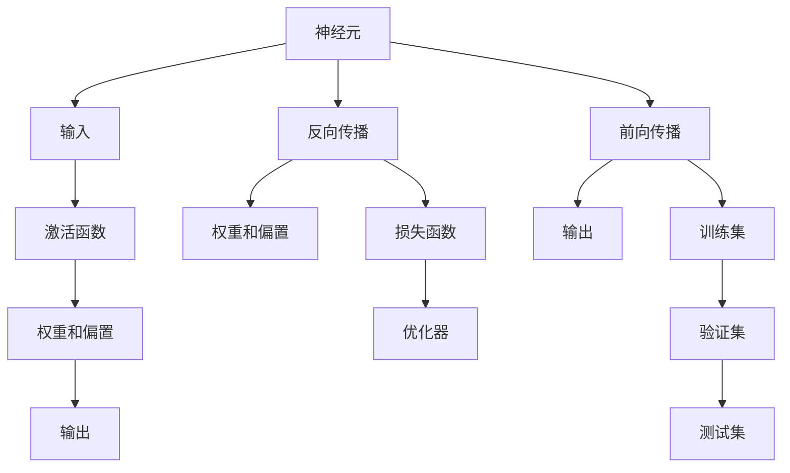

                 

# 神经网络：人类智慧的解放

神经网络，这一现代人工智能的核心技术，正在以势不可挡的趋势重塑人类的智慧与能力。从信息处理、图像识别到自然语言处理，神经网络在众多领域展现出卓越的性能和潜在的无限可能。本文将深入探讨神经网络的核心概念与原理，详细讲解其工作机制、操作步骤与应用场景，揭示神经网络如何逐步解放人类智慧，成为推动人类认知边界不断扩展的强大引擎。

## 1. 背景介绍

### 1.1 问题由来

随着计算机科学和人工智能的迅猛发展，神经网络技术以其强大的数据处理能力和卓越的性能表现，逐渐成为现代信息科学的核心。从1990年代神经网络的发展热潮，到深度学习技术的崛起，再到当前大模型和大语言模型的兴起，神经网络技术的演进不断拓展其应用边界，为人类智慧的解放提供新的可能性。

### 1.2 问题核心关键点

神经网络技术的主要核心关键点在于其强大的学习能力和泛化能力，以及其能够处理非结构化数据的优势。以下是神经网络技术的几个核心关键点：

1. **分布式存储与并行计算**：神经网络通过分布式存储和并行计算，实现了高效率的数据处理与计算，加速了深度学习的迭代优化。

2. **自动特征学习**：神经网络具备自动学习数据特征的能力，通过多层次的结构设计，能够从原始数据中提取出抽象的特征表示。

3. **多层网络结构**：神经网络通常由多层结构组成，每一层都对数据进行不同的抽象和处理，形成具有不同抽象级别的特征表示。

4. **反向传播算法**：神经网络的训练依赖于反向传播算法，通过反向传播梯度信息，不断调整模型参数，优化模型性能。

5. **端到端训练**：神经网络采用端到端训练方法，将原始数据直接映射到目标输出，避免了中间特征提取和编码的过程。

6. **深度学习与大数据的结合**：神经网络在大数据和深度学习的结合下，能够处理复杂数据结构，在图像、语音、自然语言处理等领域展现出卓越的性能。

### 1.3 问题研究意义

神经网络技术不仅在科学研究和技术开发中扮演了重要角色，更在实际应用中展现出了巨大的价值。神经网络技术的应用涵盖智能家居、自动驾驶、医疗诊断、金融风控、客户服务等众多领域，极大地提升了各个行业的生产效率和智能化水平。

研究神经网络技术，不仅有助于推动人工智能技术的发展，还为人类智慧的解放提供了新的途径。通过深入探索和优化神经网络技术，可以更好地理解人类认知过程，推动人机协同的进一步发展，实现更高效、更智能的自动化系统。

## 2. 核心概念与联系

### 2.1 核心概念概述

神经网络的核心概念包括：

1. **神经元 (Neuron)**：神经元是神经网络的基本单元，通过接受输入信号、进行加权运算并生成输出信号，构成网络的基本结构。

2. **激活函数 (Activation Function)**：激活函数用于增强神经元的非线性特性，使网络能够学习复杂的函数映射。

3. **损失函数 (Loss Function)**：损失函数用于衡量模型预测输出与真实标签之间的差异，通过最小化损失函数优化模型。

4. **反向传播 (Backpropagation)**：反向传播算法通过链式法则计算梯度，用于优化模型参数。

5. **前向传播 (Forward Propagation)**：前向传播算法从输入到输出，逐层进行数据处理和特征提取，生成模型预测。

6. **权重和偏置 (Weights and Biases)**：权重和偏置是神经网络中的可训练参数，通过反向传播算法不断优化，提升模型性能。

7. **学习率 (Learning Rate)**：学习率用于控制模型参数更新的步长，过大的学习率可能导致收敛问题，过小的学习率可能降低优化效率。

8. **正则化 (Regularization)**：正则化技术如L1、L2正则、Dropout等，用于防止模型过拟合，提升泛化能力。

9. **训练集 (Training Set)**：训练集用于模型训练，生成优化目标。

10. **验证集 (Validation Set)**：验证集用于模型评估，防止过拟合。

11. **测试集 (Test Set)**：测试集用于模型最终性能评估，验证模型在新数据上的泛化能力。

### 2.2 核心概念原理和架构的 Mermaid 流程图



## 3. 核心算法原理 & 具体操作步骤

### 3.1 算法原理概述

神经网络的训练过程主要包括以下几个步骤：

1. **数据预处理**：将原始数据转换为网络可处理的格式，如归一化、标准化、离散化等。

2. **前向传播**：将数据输入网络，通过逐层处理生成输出。

3. **计算损失**：使用损失函数计算模型输出与真实标签之间的差异，衡量模型预测误差。

4. **反向传播**：通过反向传播算法计算梯度，更新模型参数。

5. **参数更新**：根据梯度信息调整权重和偏置，优化模型性能。

6. **评估和优化**：使用验证集评估模型性能，根据评估结果调整模型参数，防止过拟合。

7. **测试集验证**：使用测试集验证模型泛化能力，确定最终模型性能。

### 3.2 算法步骤详解

#### 3.2.1 数据预处理

数据预处理步骤主要包括以下几个方面：

1. **数据归一化**：将数据映射到[0,1]或[-1,1]等标准范围内，避免梯度消失或爆炸问题。

2. **数据标准化**：对数据进行零均值和方差归一化，使数据分布稳定，提高模型收敛速度。

3. **数据增强**：通过对数据进行随机裁剪、旋转、翻转等操作，增加数据多样性，提高模型泛化能力。

4. **数据分割**：将数据集分为训练集、验证集和测试集，确保模型评估和验证的独立性。

#### 3.2.2 前向传播

前向传播过程主要包括以下几个步骤：

1. **输入数据**：将数据输入网络，逐层传递，生成网络输出。

2. **加权求和**：对输入数据进行加权求和，生成激活函数的输入。

3. **激活函数**：对激活函数的输入进行非线性变换，生成激活函数输出。

4. **输出层**：对激活函数输出进行线性变换，生成网络最终输出。

#### 3.2.3 反向传播

反向传播过程主要包括以下几个步骤：

1. **计算损失**：使用损失函数计算模型预测输出与真实标签之间的差异，生成损失值。

2. **反向传播梯度**：使用链式法则计算梯度，从输出层反向传播到输入层，生成每个参数的梯度。

3. **更新参数**：根据梯度信息，使用优化器更新模型参数，优化模型性能。

#### 3.2.4 参数更新

参数更新过程主要包括以下几个步骤：

1. **初始化权重和偏置**：将模型参数初始化为小随机数，防止梯度消失或爆炸。

2. **设置学习率**：确定学习率，控制参数更新的步长，防止梯度下降过快或过慢。

3. **梯度下降**：根据梯度信息，使用梯度下降算法更新模型参数，优化模型性能。

4. **正则化**：引入正则化技术，防止模型过拟合，提高泛化能力。

### 3.3 算法优缺点

#### 3.3.1 算法优点

神经网络技术具有以下几个优点：

1. **强大的特征学习能力**：神经网络能够自动学习数据的特征表示，无需人工特征工程，降低开发难度。

2. **灵活的数据适应性**：神经网络能够处理多种类型的数据，包括图像、语音、文本等非结构化数据，具有广泛的适用性。

3. **高精度与泛化能力**：神经网络在多种任务上展现出卓越的性能，能够处理复杂的数据结构和多样化的任务。

4. **端到端训练**：神经网络采用端到端训练方法，能够直接从原始数据生成目标输出，减少中间特征提取过程。

5. **可扩展性**：神经网络能够通过增加层数和节点数，实现网络的深度和宽度扩展，提升模型性能。

#### 3.3.2 算法缺点

神经网络技术也存在以下几个缺点：

1. **计算资源消耗大**：神经网络模型参数量巨大，需要大量计算资源进行训练和推理，可能面临计算瓶颈。

2. **训练时间较长**：神经网络训练过程时间较长，需要较长的时间和大量的计算资源。

3. **模型复杂度高**：神经网络结构复杂，难以调试和优化，可能出现梯度消失或爆炸问题。

4. **过拟合风险高**：神经网络模型容易发生过拟合，特别是面对小样本数据时，可能出现泛化能力不足的问题。

5. **可解释性不足**：神经网络模型通常被视为"黑盒"系统，难以解释其内部工作机制和决策逻辑，缺乏可解释性。

6. **训练数据依赖性强**：神经网络模型训练需要大量高质量标注数据，数据获取和标注成本较高。

### 3.4 算法应用领域

神经网络技术在多个领域展现出卓越的性能和广泛的应用前景，以下是几个典型应用领域：

#### 3.4.1 图像识别

神经网络在图像识别领域取得了显著成果，广泛应用于物体检测、人脸识别、图像分类等任务。

#### 3.4.2 自然语言处理

神经网络在自然语言处理领域也展现出了卓越的性能，包括语言模型、文本分类、机器翻译、情感分析等任务。

#### 3.4.3 语音识别

神经网络在语音识别领域也具有广泛应用，能够实现语音识别、语音合成、语音情感分析等任务。

#### 3.4.4 推荐系统

神经网络在推荐系统领域也表现出显著优势，能够通过用户行为数据生成个性化推荐结果。

#### 3.4.5 金融风控

神经网络在金融风控领域也具有广泛应用，能够对客户行为进行预测，防范金融风险。

## 4. 数学模型和公式 & 详细讲解

### 4.1 数学模型构建

神经网络的数学模型主要包括以下几个部分：

1. **输入层**：将原始数据输入网络，生成模型输入。

2. **隐藏层**：对输入数据进行加权求和和非线性变换，生成激活函数输出。

3. **输出层**：对激活函数输出进行线性变换，生成网络最终输出。

4. **权重和偏置**：用于调整输入数据和输出数据之间的映射关系，优化模型性能。

5. **损失函数**：用于衡量模型预测输出与真实标签之间的差异。

6. **优化器**：用于调整模型参数，最小化损失函数，优化模型性能。

### 4.2 公式推导过程

以下是神经网络中常用的数学公式：

1. **前向传播公式**：

$$
h_l = f(\sum_{i=1}^n w_{i}^l x_l^{l-1} + b^l)
$$

其中，$h_l$ 表示第 $l$ 层的输出，$f$ 表示激活函数，$w_{i}^l$ 表示第 $i$ 个节点与第 $l$ 层之间的权重，$x_l^{l-1}$ 表示第 $l-1$ 层的输出，$b^l$ 表示第 $l$ 层的偏置。

2. **损失函数公式**：

$$
\mathcal{L} = \frac{1}{m} \sum_{i=1}^m \ell(y_i, h_m)
$$

其中，$\mathcal{L}$ 表示模型损失函数，$m$ 表示样本数量，$\ell$ 表示损失函数，$y_i$ 表示样本真实标签，$h_m$ 表示模型输出。

3. **反向传播公式**：

$$
\frac{\partial \mathcal{L}}{\partial w_{ij}^l} = \frac{\partial \mathcal{L}}{\partial z_j^l} \frac{\partial z_j^l}{\partial w_{ij}^l}
$$

其中，$\frac{\partial \mathcal{L}}{\partial w_{ij}^l}$ 表示损失函数对权重 $w_{ij}^l$ 的梯度，$\frac{\partial \mathcal{L}}{\partial z_j^l}$ 表示损失函数对隐藏层节点 $z_j^l$ 的梯度，$\frac{\partial z_j^l}{\partial w_{ij}^l}$ 表示隐藏层节点 $z_j^l$ 对权重 $w_{ij}^l$ 的梯度。

### 4.3 案例分析与讲解

#### 4.3.1 图像分类案例

以图像分类任务为例，假设输入图像为 $x$，通过卷积层和池化层生成特征图 $x^l$，再经过全连接层生成类别概率分布 $y$。模型的损失函数为交叉熵损失：

$$
\mathcal{L} = -\frac{1}{m} \sum_{i=1}^m y_i \log y_i
$$

其中，$m$ 表示样本数量，$y_i$ 表示样本真实标签，$y_i$ 表示模型输出概率。

模型的反向传播公式为：

$$
\frac{\partial \mathcal{L}}{\partial w_{ij}^l} = \frac{\partial \mathcal{L}}{\partial z_j^l} \frac{\partial z_j^l}{\partial w_{ij}^l}
$$

其中，$\frac{\partial \mathcal{L}}{\partial z_j^l}$ 表示损失函数对隐藏层节点 $z_j^l$ 的梯度，$\frac{\partial z_j^l}{\partial w_{ij}^l}$ 表示隐藏层节点 $z_j^l$ 对权重 $w_{ij}^l$ 的梯度。

## 5. 项目实践：代码实例和详细解释说明

### 5.1 开发环境搭建

在Python环境中，使用TensorFlow搭建神经网络模型。首先，安装TensorFlow库：

```bash
pip install tensorflow
```

然后，创建虚拟环境并激活：

```bash
conda create -n tf-env python=3.8
conda activate tf-env
```

### 5.2 源代码详细实现

以下是一个简单的卷积神经网络实现，用于图像分类任务：

```python
import tensorflow as tf
from tensorflow.keras import layers

# 定义模型结构
model = tf.keras.Sequential([
    layers.Conv2D(32, (3, 3), activation='relu', input_shape=(28, 28, 1)),
    layers.MaxPooling2D((2, 2)),
    layers.Flatten(),
    layers.Dense(64, activation='relu'),
    layers.Dense(10)
])

# 编译模型
model.compile(optimizer='adam',
              loss=tf.keras.losses.SparseCategoricalCrossentropy(from_logits=True),
              metrics=['accuracy'])

# 训练模型
model.fit(train_images, train_labels, epochs=10, validation_data=(test_images, test_labels))

# 评估模型
test_loss, test_acc = model.evaluate(test_images, test_labels)
print('Test accuracy:', test_acc)
```

### 5.3 代码解读与分析

#### 5.3.1 模型结构

该模型包括三个卷积层和两个全连接层，用于提取图像特征并进行分类。第一层为卷积层，输出特征图；第二层为池化层，用于减小特征图尺寸；第三层为全连接层，用于提取特征；第四层为输出层，用于分类。

#### 5.3.2 编译与训练

编译模型时，设置优化器、损失函数和评估指标，确保模型能够正常训练和评估。使用训练集和验证集进行模型训练，通过反向传播算法更新模型参数，最小化损失函数。

#### 5.3.3 评估与测试

评估模型性能，计算测试集上的损失和准确率，确保模型在新数据上的泛化能力。

## 6. 实际应用场景

### 6.4 未来应用展望

神经网络技术在未来的应用场景中，将展现出更加广泛和深远的影响：

1. **智能家居**：神经网络将用于智能家居设备，实现语音识别、物体检测、行为分析等功能，提升家居生活智能化水平。

2. **自动驾驶**：神经网络将用于自动驾驶系统，实现环境感知、路径规划、决策控制等功能，推动智能交通发展。

3. **医疗诊断**：神经网络将用于医疗诊断系统，实现图像识别、疾病预测、个性化治疗等功能，提升医疗服务质量。

4. **金融风控**：神经网络将用于金融风控系统，实现信用评估、欺诈检测、风险预警等功能，保障金融安全。

5. **客户服务**：神经网络将用于客户服务系统，实现自动问答、情感分析、客户行为预测等功能，提升客户服务体验。

## 7. 工具和资源推荐

### 7.1 学习资源推荐

1. **Deep Learning Specialization**：由Andrew Ng教授主讲的Coursera深度学习课程，涵盖神经网络基础、卷积神经网络、循环神经网络等重要内容，是学习神经网络技术的经典入门课程。

2. **Deep Learning with PyTorch**：PyTorch官方提供的深度学习教程，详细介绍PyTorch框架的使用方法和神经网络模型设计，是深度学习实践的重要参考。

3. **TensorFlow教程**：TensorFlow官方提供的深度学习教程，涵盖TensorFlow框架的使用方法和神经网络模型设计，是深度学习实践的重要参考。

4. **NeurIPS**：神经信息处理系统会议，展示最新的神经网络研究进展和应用成果，是神经网络技术前沿发展的风向标。

5. **IJCAI**：国际人工智能联合会议，涵盖人工智能的各个领域，包括神经网络技术，是神经网络技术的重要学术会议。

### 7.2 开发工具推荐

1. **PyTorch**：Facebook开发的深度学习框架，易于使用，支持动态计算图和自动微分，是神经网络模型的主要实现工具。

2. **TensorFlow**：Google开发的深度学习框架，支持静态计算图和分布式训练，是神经网络模型的重要实现工具。

3. **Keras**：Keras是一个高级神经网络API，支持多种深度学习框架，包括TensorFlow和PyTorch，是神经网络模型的快速开发工具。

4. **MXNet**：Apache MXNet是一个高效的深度学习框架，支持多种编程语言和分布式训练，是神经网络模型的重要实现工具。

### 7.3 相关论文推荐

1. **Convolutional Neural Networks for Visual Recognition**：AlexNet论文，提出卷积神经网络在图像识别任务中的突破性表现，奠定了深度学习在计算机视觉领域的基础。

2. **ImageNet Classification with Deep Convolutional Neural Networks**：AlexNet论文，提出使用多层卷积神经网络进行图像分类的技术，实现了图像识别领域的突破性进展。

3. **Deep Residual Learning for Image Recognition**：ResNet论文，提出残差网络结构，解决了深度神经网络中的梯度消失问题，推动了深度学习的发展。

4. **Attention is All You Need**：Transformer论文，提出Transformer结构，通过自注意力机制实现序列建模，开启了自然语言处理领域的预训练大模型时代。

5. **BERT: Pre-training of Deep Bidirectional Transformers for Language Understanding**：BERT论文，提出BERT模型，通过预训练和微调实现语言模型在大规模文本数据上的性能突破，推动了自然语言处理领域的发展。

## 8. 总结：未来发展趋势与挑战

### 8.1 研究成果总结

神经网络技术在人工智能领域的发展已经取得了显著的成果，广泛应用于图像识别、自然语言处理、语音识别等多个领域，极大地提升了各个行业的智能化水平。

### 8.2 未来发展趋势

1. **深度学习与大数据的结合**：未来神经网络技术将与大数据技术结合，实现更加高效的数据处理和模型训练，提升模型性能和泛化能力。

2. **多模态数据融合**：未来神经网络技术将支持多模态数据的融合，实现视觉、语音、文本等多模态数据的协同建模，提升模型的综合性能。

3. **知识表示与推理**：未来神经网络技术将与知识表示和推理技术结合，实现更加全面、准确的智能系统，提升模型的逻辑推理能力。

4. **强化学习与游戏智能**：未来神经网络技术将与强化学习技术结合，实现智能游戏、智能机器人等应用，推动人工智能技术的进一步发展。

5. **量子计算与神经网络**：未来神经网络技术将与量子计算结合，实现更加高效的计算和推理，提升模型的性能和可扩展性。

### 8.3 面临的挑战

1. **计算资源瓶颈**：神经网络模型参数量巨大，需要大量计算资源进行训练和推理，可能面临计算瓶颈。

2. **模型复杂度高**：神经网络模型结构复杂，难以调试和优化，可能出现梯度消失或爆炸问题。

3. **数据依赖性强**：神经网络模型训练需要大量高质量标注数据，数据获取和标注成本较高。

4. **可解释性不足**：神经网络模型通常被视为"黑盒"系统，难以解释其内部工作机制和决策逻辑，缺乏可解释性。

5. **过拟合风险高**：神经网络模型容易发生过拟合，特别是面对小样本数据时，可能出现泛化能力不足的问题。

### 8.4 研究展望

未来神经网络技术的研究方向包括：

1. **参数高效与计算高效神经网络**：开发更加参数高效的神经网络结构，如知识蒸馏、子空间学习等，在固定大部分预训练参数的情况下，只更新极少量的任务相关参数。同时优化神经网络模型的计算图，减少前向传播和反向传播的资源消耗，实现更加轻量级、实时性的部署。

2. **端到端优化与模型压缩**：开发更加端到端的优化方法，如神经网络压缩、稀疏化存储等，提高模型推理效率和资源利用率。

3. **多任务学习与联合训练**：开发多任务学习与联合训练方法，实现单一模型在多个任务上的高效训练和推理。

4. **自适应学习与在线学习**：开发自适应学习和在线学习方法，实现模型对新数据的实时学习与适应，提升模型的通用性和灵活性。

5. **联邦学习与分布式训练**：开发联邦学习和分布式训练方法，实现多个设备或服务器上的数据协同训练，提升模型的可扩展性和安全性。

6. **零样本学习与元学习**：开发零样本学习和元学习方法，实现模型对新任务的快速适应，提升模型的泛化能力和适应性。

## 9. 附录：常见问题与解答

### Q1: 神经网络技术的优点和缺点有哪些？

A: 神经网络技术的优点包括：

1. **强大的特征学习能力**：神经网络能够自动学习数据的特征表示，无需人工特征工程，降低开发难度。

2. **灵活的数据适应性**：神经网络能够处理多种类型的数据，包括图像、语音、文本等非结构化数据，具有广泛的适用性。

3. **高精度与泛化能力**：神经网络在多种任务上展现出卓越的性能，能够处理复杂的数据结构和多样化的任务。

4. **端到端训练**：神经网络采用端到端训练方法，能够直接从原始数据生成目标输出，减少中间特征提取过程。

5. **可扩展性**：神经网络能够通过增加层数和节点数，实现网络的深度和宽度扩展，提升模型性能。

神经网络技术的缺点包括：

1. **计算资源消耗大**：神经网络模型参数量巨大，需要大量计算资源进行训练和推理，可能面临计算瓶颈。

2. **训练时间较长**：神经网络训练过程时间较长，需要较长的时间和大量的计算资源。

3. **模型复杂度高**：神经网络结构复杂，难以调试和优化，可能出现梯度消失或爆炸问题。

4. **过拟合风险高**：神经网络模型容易发生过拟合，特别是面对小样本数据时，可能出现泛化能力不足的问题。

5. **可解释性不足**：神经网络模型通常被视为"黑盒"系统，难以解释其内部工作机制和决策逻辑，缺乏可解释性。

6. **数据依赖性强**：神经网络模型训练需要大量高质量标注数据，数据获取和标注成本较高。

### Q2: 神经网络技术在实际应用中有哪些案例？

A: 神经网络技术在实际应用中涉及多个领域，以下是几个典型案例：

1. **图像分类**：使用卷积神经网络进行图像分类，广泛应用于人脸识别、物体检测、图像检索等任务。

2. **自然语言处理**：使用循环神经网络、Transformer等模型进行文本分类、机器翻译、情感分析等任务。

3. **语音识别**：使用循环神经网络进行语音识别，广泛应用于语音助手、语音输入、语音情感分析等任务。

4. **推荐系统**：使用神经网络进行用户行为预测，生成个性化推荐结果，广泛应用于电商、新闻、社交网络等平台。

5. **金融风控**：使用神经网络进行客户行为预测，防范金融风险，应用于信用评估、欺诈检测、风险预警等任务。

### Q3: 如何提高神经网络的泛化能力？

A: 提高神经网络的泛化能力，可以采取以下措施：

1. **数据增强**：通过对数据进行随机裁剪、旋转、翻转等操作，增加数据多样性，提高模型泛化能力。

2. **正则化技术**：使用L1、L2正则、Dropout等技术，防止模型过拟合，提高泛化能力。

3. **迁移学习**：将在大规模数据上训练的模型迁移到小规模数据上，提升模型的泛化能力。

4. **模型压缩**：使用神经网络压缩技术，如权重剪枝、量化等，减少模型复杂度，提高泛化能力。

5. **端到端训练**：采用端到端训练方法，直接从原始数据生成目标输出，减少中间特征提取过程，提高泛化能力。

6. **多任务学习**：开发多任务学习方法，实现单一模型在多个任务上的高效训练和推理，提高泛化能力。

通过以上措施，可以有效提升神经网络的泛化能力，使其在新数据上表现更好。

---

作者：禅与计算机程序设计艺术 / Zen and the Art of Computer Programming

