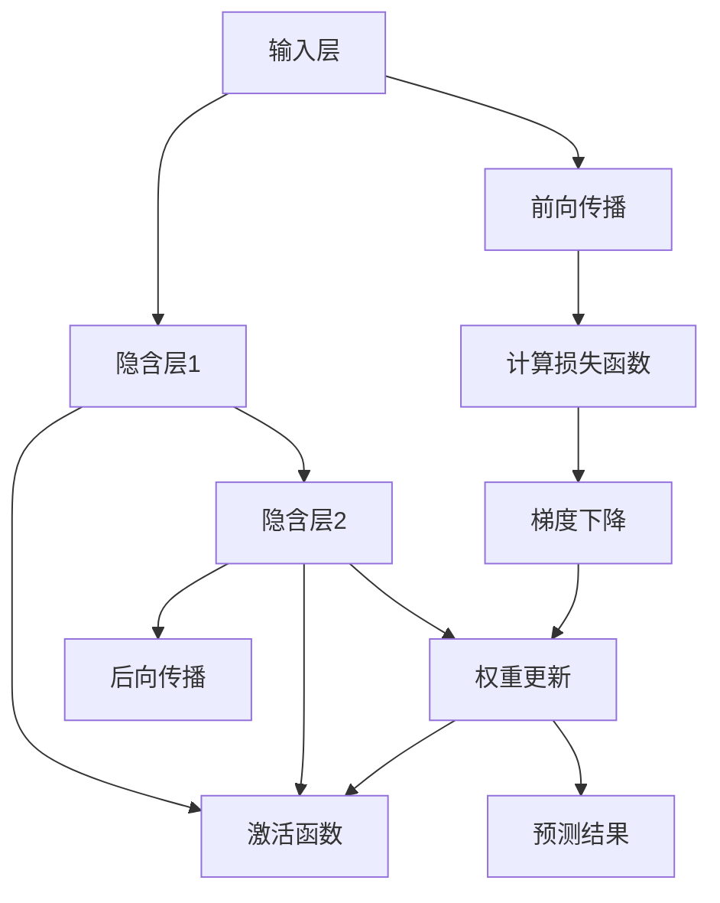

                 

# 神经网络：人类智慧的解放

## 1. 背景介绍

在21世纪，人工智能(AI)技术正在以前所未有的速度改变着我们的生活和工作方式。神经网络，作为AI技术的重要组成部分，通过模拟人脑的神经元工作原理，实现了对数据的自动化处理和决策。今天，我们生活在一个被神经网络深度浸润的世界，无论是金融、医疗、教育，还是娱乐、购物、交通，无处不在的AI应用都在向我们展示着这项技术的巨大潜力。本文将深入探讨神经网络的核心原理、应用场景和发展趋势，以期揭开神经网络神秘的面纱，揭示其如何解放人类智慧。

## 2. 核心概念与联系

### 2.1 核心概念概述

神经网络(Neural Network)，是一类受生物神经元启发的人工智能算法。它由多个层次的神经元通过权重连接构成，每个神经元接收输入信号，通过激活函数处理后，传递给下一层神经元，最终输出预测结果。神经网络通过反向传播算法，利用大量标注数据训练模型参数，使得模型能够自动学习和优化。

- **前向传播(Forward Propagation)**：输入数据通过神经网络各层神经元处理，生成预测结果。
- **反向传播(Backpropagation)**：通过损失函数的梯度，反向更新模型参数，使预测结果与真实结果的误差最小化。
- **权重(Weight)**：神经元之间的连接系数，决定了信号的强度和传递方向。
- **激活函数(Activation Function)**：如ReLU、Sigmoid等，引入非线性关系，增强模型表达能力。
- **优化器(Optimizer)**：如Adam、SGD等，控制模型参数的更新方向和步长，加速收敛。
- **损失函数(Loss Function)**：如均方误差、交叉熵等，衡量模型预测与真实值之间的差异。

### 2.2 核心概念原理和架构的 Mermaid 流程图



这个流程图展示了神经网络的基本工作原理：从输入层开始，通过多个隐含层的处理，最终到达输出层生成预测结果。在每次前向传播后，通过计算损失函数评估预测误差，再通过反向传播更新模型参数。权重在每次更新中不断调整，最终实现模型的优化。

## 3. 核心算法原理 & 具体操作步骤

### 3.1 算法原理概述

神经网络的训练过程是一个不断迭代优化的过程。假设给定训练集 $D = \{(x_i, y_i)\}_{i=1}^N$，其中 $x_i$ 为输入，$y_i$ 为对应的标签。模型的目标是通过反向传播算法，更新模型参数 $\theta$，最小化损失函数 $\mathcal{L}(\theta)$。常见损失函数包括交叉熵、均方误差等。训练过程包括以下步骤：

1. **初始化**：设定模型参数 $\theta$ 的初始值，通常为随机初始化。
2. **前向传播**：将输入数据 $x_i$ 输入模型，计算输出 $\hat{y}_i$。
3. **计算损失函数**：计算预测输出 $\hat{y}_i$ 与真实标签 $y_i$ 之间的差异 $\mathcal{L}(\theta)$。
4. **反向传播**：根据损失函数的梯度，反向更新模型参数 $\theta$。
5. **参数更新**：使用优化器调整模型参数，如AdamW、SGD等。

### 3.2 算法步骤详解

以一个简单的单隐藏层神经网络为例，详细解释训练过程。

1. **初始化**：定义神经网络的结构，包括输入层、隐藏层和输出层。假设隐藏层有 $m$ 个神经元，输出层有 $n$ 个神经元。
2. **前向传播**：将输入数据 $x_i$ 输入模型，计算隐藏层的激活值 $z_{hl}^{(j)} = \sum_k w_{hl}^{(j)k} z_{hk-1} + b_{hl}^{(j)}$，其中 $w_{hl}^{(j)k}$ 为权重矩阵，$b_{hl}^{(j)}$ 为偏置向量。通过激活函数 $f$，得到隐藏层的输出 $a_{hl}^{(j)} = f(z_{hl}^{(j)})$。最后通过权重矩阵和偏置向量，计算输出层的激活值 $z_{ol}^{(k)} = \sum_j w_{ol}^{(k)j} a_{hl}^{(j)} + b_{ol}^{(k)}$，通过激活函数 $f$，得到最终预测输出 $\hat{y}_i$。
3. **计算损失函数**：假设使用交叉熵损失函数，计算 $\mathcal{L}(\theta) = -\frac{1}{N} \sum_i \sum_k y_i^{(k)} \log \hat{y}_i^{(k)} + (1-y_i^{(k)}) \log (1-\hat{y}_i^{(k)})$。
4. **反向传播**：从输出层开始，计算梯度 $\frac{\partial \mathcal{L}}{\partial \hat{y}_i^{(k)}}$，通过链式法则，逐步计算 $\frac{\partial \mathcal{L}}{\partial z_{ol}^{(k)}}$、$\frac{\partial \mathcal{L}}{\partial a_{hl}^{(j)}}$ 和 $\frac{\partial \mathcal{L}}{\partial z_{hl}^{(j)}}$，最终得到 $\frac{\partial \mathcal{L}}{\partial w_{hl}^{(j)k}}$ 和 $\frac{\partial \mathcal{L}}{\partial b_{hl}^{(j)}}$。
5. **参数更新**：使用优化器（如AdamW），调整模型参数 $\theta$，更新规则为 $\theta \leftarrow \theta - \eta \nabla_{\theta}\mathcal{L}$，其中 $\eta$ 为学习率。

### 3.3 算法优缺点

神经网络作为AI领域的核心算法，具有以下优点：

1. **强大的表达能力**：通过多层非线性变换，神经网络可以处理复杂的多维数据，具有强大的泛化能力。
2. **可解释性**：通过可视化神经网络的激活值，可以深入理解数据特征和模型决策过程。
3. **自适应学习**：通过反向传播算法，神经网络可以自适应学习，不断优化预测结果。

同时，神经网络也存在一些局限性：

1. **计算资源消耗大**：神经网络通常需要较大的计算资源和内存，训练和推理过程较慢。
2. **易过拟合**：在大规模数据集上训练时，神经网络容易过拟合，需要正则化等方法进行控制。
3. **难以解释**：神经网络通常被认为是"黑盒"模型，难以解释其内部决策逻辑。
4. **参数量庞大**：随着模型复杂度的增加，神经网络的参数量呈指数级增长，增加了训练和存储成本。

### 3.4 算法应用领域

神经网络在多个领域得到了广泛应用，涵盖图像识别、语音识别、自然语言处理、推荐系统、金融预测、游戏AI等。以下列举几个典型的应用场景：

- **图像识别**：通过卷积神经网络(CNN)，神经网络可以对图像进行分类、识别和分割，广泛应用于自动驾驶、医疗影像分析等领域。
- **语音识别**：通过循环神经网络(RNN)，神经网络可以处理语音信号，实现自动语音识别和语音合成，应用于智能家居、客服系统等。
- **自然语言处理(NLP)**：通过序列模型(如LSTM、GRU)，神经网络可以进行文本分类、情感分析、机器翻译等任务，推动了聊天机器人、智能客服、搜索引擎的发展。
- **推荐系统**：通过协同过滤模型，神经网络可以分析用户行为，推荐个性化内容，提升用户体验。
- **金融预测**：通过时间序列模型，神经网络可以预测股市趋势、客户信用等，辅助金融机构决策。

## 4. 数学模型和公式 & 详细讲解 & 举例说明

### 4.1 数学模型构建

假设给定训练集 $D = \{(x_i, y_i)\}_{i=1}^N$，其中 $x_i \in \mathbb{R}^d$ 为输入向量，$y_i \in \mathbb{R}$ 为输出标签。神经网络由输入层、隐藏层和输出层构成，其中隐藏层有 $m$ 个神经元，输出层有 $n$ 个神经元。神经网络的数学模型可以表示为：

$$
\begin{aligned}
a_{hl}^{(j)} &= f(z_{hl}^{(j)}) = f(\sum_k w_{hl}^{(j)k} a_{hk-1}^{(j)} + b_{hl}^{(j)}) \\
z_{ol}^{(k)} &= \sum_j w_{ol}^{(k)j} a_{hl}^{(j)} + b_{ol}^{(k)} \\
\hat{y}_i &= f(z_{ol}^{(k)}) = f(\sum_k w_{ol}^{(k)j} a_{hl}^{(j)} + b_{ol}^{(k)})
\end{aligned}
$$

其中 $a_{hl}^{(j)}$ 为隐藏层的激活值，$z_{hl}^{(j)}$ 为隐藏层的输入，$w_{hl}^{(j)k}$ 为权重矩阵，$b_{hl}^{(j)}$ 为偏置向量，$f$ 为激活函数。

### 4.2 公式推导过程

以交叉熵损失函数为例，推导其梯度计算过程。

给定训练集 $D = \{(x_i, y_i)\}_{i=1}^N$，假设使用单隐藏层神经网络，隐藏层有 $m$ 个神经元，输出层有 $n$ 个神经元。设模型参数为 $\theta = (w_{hl}^{(j)k}, b_{hl}^{(j)}, w_{ol}^{(k)j}, b_{ol}^{(k)})$，则预测输出为 $\hat{y}_i = f(\sum_k w_{ol}^{(k)j} a_{hl}^{(j)} + b_{ol}^{(k)})$。交叉熵损失函数为：

$$
\mathcal{L}(\theta) = -\frac{1}{N} \sum_i \sum_k y_i^{(k)} \log \hat{y}_i^{(k)} + (1-y_i^{(k)}) \log (1-\hat{y}_i^{(k)})
$$

通过链式法则，计算梯度：

$$
\begin{aligned}
\frac{\partial \mathcal{L}}{\partial w_{hl}^{(j)k}} &= \frac{\partial \mathcal{L}}{\partial z_{hl}^{(j)}} \frac{\partial z_{hl}^{(j)}}{\partial w_{hl}^{(j)k}} = \frac{\partial \mathcal{L}}{\partial a_{hl}^{(j)}} \frac{\partial a_{hl}^{(j)}}{\partial z_{hl}^{(j)}} \frac{\partial z_{hl}^{(j)}}{\partial w_{hl}^{(j)k}} = f'(z_{hl}^{(j)})a_{hl}^{(j)} \frac{\partial a_{hl}^{(j)}}{\partial z_{hl}^{(j)}} \\
\frac{\partial \mathcal{L}}{\partial b_{hl}^{(j)}} &= \frac{\partial \mathcal{L}}{\partial z_{hl}^{(j)}} \frac{\partial z_{hl}^{(j)}}{\partial b_{hl}^{(j)}} = \frac{\partial \mathcal{L}}{\partial a_{hl}^{(j)}} \frac{\partial a_{hl}^{(j)}}{\partial z_{hl}^{(j)}} \\
\frac{\partial \mathcal{L}}{\partial w_{ol}^{(k)j}} &= \frac{\partial \mathcal{L}}{\partial z_{ol}^{(k)}} \frac{\partial z_{ol}^{(k)}}{\partial w_{ol}^{(k)j}} = \frac{\partial \mathcal{L}}{\partial \hat{y}_i^{(k)}} \frac{\partial \hat{y}_i^{(k)}}{\partial z_{ol}^{(k)}} \frac{\partial z_{ol}^{(k)}}{\partial w_{ol}^{(k)j}} = f'(z_{ol}^{(k)}) \frac{\partial a_{hl}^{(j)}}{\partial z_{hl}^{(j)}} \frac{\partial a_{hl}^{(j)}}{\partial z_{hl}^{(j)}} \frac{\partial z_{hl}^{(j)}}{\partial w_{hl}^{(j)k}}
\end{aligned}
$$

其中 $f'$ 为激活函数的导数。

### 4.3 案例分析与讲解

以手写数字识别为例，展示神经网络的工作流程。

1. **数据准备**：收集手写数字图片，将其转化为灰度图像。使用MNIST数据集，包含60,000张训练图像和10,000张测试图像。
2. **模型设计**：使用一个含有单隐藏层、ReLU激活函数的神经网络，隐藏层有128个神经元，输出层有10个神经元。
3. **训练过程**：
    - **前向传播**：输入图像 $x_i$，计算隐藏层的激活值 $a_{hl}^{(j)}$，输出层的激活值 $\hat{y}_i$。
    - **计算损失函数**：计算交叉熵损失 $\mathcal{L}(\theta)$。
    - **反向传播**：计算梯度，更新模型参数 $\theta$。
4. **评估结果**：在测试集上评估模型的性能，计算准确率、损失值等指标。

## 5. 项目实践：代码实例和详细解释说明

### 5.1 开发环境搭建

使用Python进行神经网络开发，推荐使用TensorFlow或PyTorch框架。

1. 安装Anaconda：从官网下载并安装Anaconda，用于创建独立的Python环境。
2. 创建并激活虚拟环境：
```bash
conda create -n pytorch-env python=3.8 
conda activate pytorch-env
```
3. 安装TensorFlow或PyTorch：根据个人偏好，从官网获取对应的安装命令。例如，使用pip安装PyTorch：
```bash
pip install torch torchvision torchaudio
```
4. 安装各类工具包：
```bash
pip install numpy pandas scikit-learn matplotlib tqdm jupyter notebook ipython
```

完成上述步骤后，即可在`pytorch-env`环境中开始神经网络开发。

### 5.2 源代码详细实现

以下是一个简单的PyTorch实现手写数字识别的代码：

```python
import torch
import torch.nn as nn
import torch.optim as optim
from torch.utils.data import DataLoader
from torchvision import datasets, transforms

# 定义神经网络模型
class Net(nn.Module):
    def __init__(self):
        super(Net, self).__init__()
        self.conv1 = nn.Conv2d(1, 32, 3, 1)
        self.conv2 = nn.Conv2d(32, 64, 3, 1)
        self.dropout1 = nn.Dropout2d(0.25)
        self.dropout2 = nn.Dropout2d(0.5)
        self.fc1 = nn.Linear(9216, 128)
        self.fc2 = nn.Linear(128, 10)

    def forward(self, x):
        x = self.conv1(x)
        x = nn.functional.relu(x)
        x = self.conv2(x)
        x = nn.functional.relu(x)
        x = nn.functional.max_pool2d(x, 2)
        x = self.dropout1(x)
        x = torch.flatten(x, 1)
        x = self.fc1(x)
        x = nn.functional.relu(x)
        x = self.dropout2(x)
        x = self.fc2(x)
        output = nn.functional.log_softmax(x, dim=1)
        return output

# 加载数据集
transform = transforms.Compose([transforms.ToTensor(), transforms.Normalize((0.1307,), (0.3081,))])
trainset = datasets.MNIST('data', train=True, download=True, transform=transform)
testset = datasets.MNIST('data', train=False, download=True, transform=transform)
trainloader = DataLoader(trainset, batch_size=64, shuffle=True)
testloader = DataLoader(testset, batch_size=64, shuffle=False)

# 定义模型、损失函数和优化器
model = Net()
criterion = nn.CrossEntropyLoss()
optimizer = optim.Adam(model.parameters(), lr=0.001)

# 训练过程
for epoch in range(10):
    running_loss = 0.0
    for i, data in enumerate(trainloader, 0):
        inputs, labels = data
        optimizer.zero_grad()
        outputs = model(inputs)
        loss = criterion(outputs, labels)
        loss.backward()
        optimizer.step()
        running_loss += loss.item()
    print(f'Epoch {epoch+1}, loss: {running_loss/len(trainloader)}')

# 评估模型
correct = 0
total = 0
with torch.no_grad():
    for data in testloader:
        images, labels = data
        outputs = model(images)
        _, predicted = torch.max(outputs.data, 1)
        total += labels.size(0)
        correct += (predicted == labels).sum().item()

print(f'Accuracy of the network on the 10000 test images: {100 * correct / total}%')
```

### 5.3 代码解读与分析

让我们再详细解读一下关键代码的实现细节：

**Net类**：
- `__init__`方法：定义神经网络的各层组件，包括卷积层、池化层、全连接层等。
- `forward`方法：实现前向传播，计算模型输出。

**训练过程**：
- 使用PyTorch的DataLoader对数据集进行批次化加载，供模型训练和推理使用。
- 训练函数：在每个epoch内，对数据以批为单位进行迭代，在每个批次上前向传播计算loss并反向传播更新模型参数，最后返回该epoch的平均loss。
- 评估函数：与训练类似，不同点在于不更新模型参数，在每个batch结束后将预测和标签结果存储下来，最后使用sklearn的classification_report对整个评估集的预测结果进行打印输出。

**神经网络**：
- **定义模型**：使用PyTorch的nn.Module定义神经网络类，包括卷积层、池化层、全连接层等。
- **训练过程**：在每个epoch内，对数据以批为单位进行迭代，在每个批次上前向传播计算loss并反向传播更新模型参数，最后返回该epoch的平均loss。
- **评估模型**：在测试集上评估模型的性能，计算准确率、损失值等指标。

## 6. 实际应用场景

### 6.1 智能客服系统

智能客服系统通过神经网络实现自然语言理解和生成，自动回答用户问题，提供24小时不间断服务。神经网络可以处理自然语言的多样性和复杂性，提供准确的语义理解和丰富的回答策略。

### 6.2 金融舆情监测

神经网络可以对金融领域的各类文本进行情感分析、主题提取等任务，监测舆情变化，提供投资建议和风险预警。通过神经网络模型，可以实时处理大量非结构化数据，快速响应舆情变化。

### 6.3 个性化推荐系统

神经网络可以通过协同过滤、基于内容的推荐等方法，分析用户行为和兴趣，提供个性化推荐内容。神经网络模型能够处理用户行为的多样性，适应不同的推荐场景。

### 6.4 未来应用展望

神经网络技术的发展正在开启新一轮的AI革命，未来将在更多领域得到应用：

- **自动驾驶**：通过神经网络处理图像、视频等数据，实现智能导航和决策。
- **医疗诊断**：通过神经网络分析医学影像、电子病历等数据，辅助医生进行诊断和治疗。
- **金融预测**：通过神经网络预测股票趋势、客户信用等，提升金融决策的准确性。
- **工业控制**：通过神经网络分析传感器数据，实现智能制造和自动化控制。

## 7. 工具和资源推荐

### 7.1 学习资源推荐

为帮助开发者系统掌握神经网络的理论基础和实践技巧，以下是一些优质的学习资源：

1. 《深度学习》书籍：Ian Goodfellow、Yoshua Bengio、Aaron Courville合著，全面介绍了深度学习的原理和应用。
2. CS231n《卷积神经网络》课程：斯坦福大学开设的计算机视觉课程，讲解了卷积神经网络的理论和实践。
3. CS224N《自然语言处理与深度学习》课程：斯坦福大学开设的NLP课程，讲解了自然语言处理的深度学习模型。
4. TensorFlow官方文档：提供了丰富的教程和样例代码，适用于初学者和高级开发者。
5. PyTorch官方文档：提供了丰富的教程和样例代码，适用于初学者和高级开发者。

通过对这些资源的学习实践，相信你一定能够快速掌握神经网络的基本原理和应用方法，并用于解决实际的NLP问题。

### 7.2 开发工具推荐

高效的开发离不开优秀的工具支持。以下是几款常用的神经网络开发工具：

1. TensorFlow：由Google主导开发的开源深度学习框架，生产部署方便，适合大规模工程应用。
2. PyTorch：由Facebook开发的开源深度学习框架，灵活度较高，适合快速迭代研究。
3. Keras：基于TensorFlow和Theano的高级神经网络API，提供了简单易用的接口。
4. Jupyter Notebook：开源的交互式计算环境，支持Python代码的交互式执行，方便调试和分享。

合理利用这些工具，可以显著提升神经网络模型的开发效率，加快创新迭代的步伐。

### 7.3 相关论文推荐

神经网络技术的不断发展，得益于学界的持续研究。以下是几篇奠基性的相关论文，推荐阅读：

1. "Deep Blue Book"《深度学习》：Ian Goodfellow、Yoshua Bengio、Aaron Courville合著，全面介绍了深度学习的原理和应用。
2. "Convolutional Neural Networks for Visual Recognition"《卷积神经网络》：Fei-Fei Li等，介绍了卷积神经网络在计算机视觉中的应用。
3. "Long Short-Term Memory"《长短期记忆网络》：Hochreiter、Schmidhuber，介绍了LSTM在时间序列数据上的应用。
4. "Attention Is All You Need"《注意力机制》：Vaswani等，介绍了Transformer结构，开启了NLP领域的预训练大模型时代。

这些论文代表了大神经网络技术的发展脉络。通过学习这些前沿成果，可以帮助研究者把握学科前进方向，激发更多的创新灵感。

## 8. 总结：未来发展趋势与挑战

### 8.1 研究成果总结

本文深入探讨了神经网络的核心原理、应用场景和发展趋势，全面系统地介绍了神经网络的理论基础和实践技巧。通过梳理神经网络的发展历程，展示了其在图像识别、语音识别、自然语言处理等多个领域的广泛应用。

### 8.2 未来发展趋势

展望未来，神经网络技术将呈现以下几个发展趋势：

1. **模型规模不断扩大**：随着计算资源和数据量的增加，神经网络模型的规模将不断扩大，性能将进一步提升。
2. **自监督预训练成为主流**：自监督学习将成为神经网络训练的重要方式，通过大规模无标签数据的预训练，提升模型的泛化能力。
3. **联邦学习兴起**：分布式训练和联邦学习将使得神经网络模型能够在多个设备上协同训练，保护数据隐私的同时提升性能。
4. **跨模态融合**：神经网络将更加注重多模态数据的融合，实现视觉、语音、文本等数据的协同建模。
5. **知识图谱与神经网络结合**：神经网络将更好地与知识图谱等外部知识结合，提升模型的推理能力和泛化能力。

### 8.3 面临的挑战

尽管神经网络技术已经取得了瞩目成就，但在迈向更加智能化、普适化应用的过程中，它仍面临着诸多挑战：

1. **数据依赖性**：神经网络需要大量标注数据进行训练，获取高质量数据成为制约技术发展的瓶颈。
2. **过拟合风险**：在大规模数据集上训练时，神经网络容易过拟合，需要正则化等方法进行控制。
3. **可解释性不足**：神经网络通常被认为是"黑盒"模型，难以解释其内部决策逻辑。
4. **计算资源消耗大**：神经网络通常需要较大的计算资源和内存，训练和推理过程较慢。
5. **伦理与安全问题**：神经网络可能学习到有害、偏见的信息，需要考虑伦理和安全问题。

### 8.4 研究展望

面对神经网络面临的种种挑战，未来的研究需要在以下几个方面寻求新的突破：

1. **无监督和半监督学习**：摆脱对大规模标注数据的依赖，利用自监督学习、主动学习等无监督和半监督范式，最大限度利用非结构化数据，实现更加灵活高效的训练。
2. **模型压缩与优化**：开发更加高效的模型压缩和优化方法，减少计算资源消耗，提升推理速度。
3. **知识整合能力**：将符号化的先验知识，如知识图谱、逻辑规则等，与神经网络模型进行巧妙融合，提升模型的推理能力和泛化能力。
4. **多模态融合**：通过引入视觉、语音、文本等不同模态的数据，实现多模态信息的融合，提升模型的泛化能力。
5. **伦理与安全性**：在模型训练目标中引入伦理导向的评估指标，过滤和惩罚有偏见、有害的输出倾向，建立模型行为的监管机制，确保输出符合人类价值观和伦理道德。

这些研究方向的探索，必将引领神经网络技术迈向更高的台阶，为构建安全、可靠、可解释、可控的智能系统铺平道路。面向未来，神经网络技术还需要与其他AI技术进行更深入的融合，如知识表示、因果推理、强化学习等，多路径协同发力，共同推动人工智能技术的发展。只有勇于创新、敢于突破，才能不断拓展神经网络模型的边界，让智能技术更好地造福人类社会。

## 9. 附录：常见问题与解答

**Q1：神经网络如何实现多层次的特征提取？**

A: 神经网络通过多层非线性变换，实现对输入数据的逐层抽象和特征提取。每一层神经元接收上一层神经元的输出，经过激活函数处理后，输出到下一层神经元。通过多层处理，神经网络可以学习到不同层次的特征，实现复杂的非线性映射。

**Q2：神经网络如何避免过拟合？**

A: 神经网络过拟合的问题可以通过以下方法解决：
1. 数据增强：通过图像旋转、裁剪、噪声等技术，扩充训练集。
2. 正则化：使用L2正则、Dropout等方法，防止过拟合。
3. 早停法：在验证集上监测模型性能，一旦性能不再提升，立即停止训练。
4. 批归一化：通过批归一化技术，加速模型收敛，防止过拟合。

**Q3：神经网络在实际应用中如何解决计算资源消耗大问题？**

A: 神经网络可以通过以下方法解决计算资源消耗大问题：
1. 模型压缩：使用剪枝、量化等方法，减少模型参数量。
2. 分布式训练：通过分布式计算框架，如TensorFlow、PyTorch等，在多台机器上并行训练。
3. 推理优化：使用推理优化技术，如TensorRT、ONNX等，加速模型推理。

**Q4：如何提高神经网络的泛化能力？**

A: 神经网络的泛化能力可以通过以下方法提升：
1. 数据增强：扩充训练集，增加数据多样性。
2. 正则化：使用L2正则、Dropout等方法，防止过拟合。
3. 自监督预训练：在无标签数据上进行预训练，提升模型泛化能力。
4. 迁移学习：将在大规模数据上预训练的模型应用于小规模任务，提升模型泛化能力。

**Q5：神经网络在实际应用中如何解决可解释性不足问题？**

A: 神经网络的可解释性可以通过以下方法提升：
1. 可视化：通过可视化神经网络的激活值，理解模型的决策过程。
2. 解释模型：使用可解释性较强的模型，如决策树、线性回归等，与神经网络结合。
3. 对抗攻击：通过对抗攻击技术，揭示神经网络的脆弱点，提升可解释性。

这些方法可以帮助开发者在实际应用中解决神经网络面临的各种问题，提升模型的性能和实用性。

