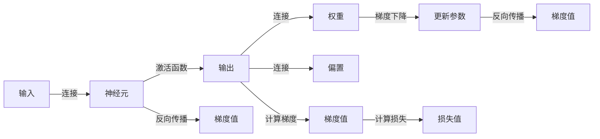

                 

## 1. 背景介绍

神经网络作为人工智能的核心技术之一，其发展历程凝结了人类智慧的结晶，逐步展现了无尽的可能性。神经网络不仅仅是一种算法模型，更是一种思想的飞跃，它尝试以生物神经网络为灵感，模拟出能够自动学习、适应环境、做出决策的机器。

在20世纪60年代，人工智能先驱们就开始探索神经网络，最早的研究集中在感知器（Perceptron）上。然而，早期的神经网络结构过于简单，其性能受到限制。随着时间推移，神经网络的架构不断优化，深度学习（Deep Learning）的概念应运而生，特别是基于反向传播（Backpropagation）算法的多层神经网络。

2010年代以来，深度学习的技术快速发展，神经网络应用于图像识别、自然语言处理、语音识别等领域，取得了空前的成果。这些成功证明了神经网络在解决复杂问题上的强大潜力。

然而，神经网络的发展也并非一帆风顺。随着网络层数的增加，模型复杂度急剧上升，训练时间和计算资源消耗成倍增加。神经网络学习过程中的梯度消失问题、过拟合问题、泛化能力不足等问题亟待解决。

## 2. 核心概念与联系

### 2.1 核心概念概述

神经网络是一种通过多个层次来处理数据的学习模型。其核心思想是通过模拟人类大脑神经元的活动，使机器能够从数据中学习，并做出预测或决策。

- 神经元（Neuron）：神经网络的基本组成部分，与生物神经元类似，接收输入、处理信息、传递信号。
- 激活函数（Activation Function）：决定神经元输出值的非线性函数。
- 损失函数（Loss Function）：衡量模型预测结果与真实值之间差异的函数，用于指导模型的训练。
- 反向传播（Backpropagation）：一种利用链式法则自动计算梯度的算法，使神经网络能够高效地进行模型训练。
- 权重（Weight）和偏置（Bias）：神经元之间的连接参数，用于调节信号的强度和偏置。
- 梯度下降（Gradient Descent）：一种常用的优化算法，通过不断迭代调整模型参数，最小化损失函数。
- 反向传播算法（Backpropagation Algorithm）：利用链式法则计算梯度的算法，使神经网络能够高效地进行模型训练。

神经网络的构成和功能可用以下示意图表示：

```mermaid
graph TD
    Subgraph 输入层
        A[输入] -->|连接| B[神经元]
    End
    Subgraph 隐藏层
        B -->|连接| C[神经元]
    End
    Subgraph 输出层
        C -->|连接| D[神经元]
    End
    Subgraph 权重和偏置
        E[权重] -->|连接| B
        F[偏置] -->|连接| B
    End
    Subgraph 激活函数
        G[激活函数] -->|连接| C
    End
    Subgraph 损失函数
        H[损失函数] -->|计算| I[梯度]
    End
    Subgraph 梯度下降
        I -->|更新参数| J[权重和偏置]
    End
    Subgraph 反向传播
        B -->|计算梯度| K[梯度值]
        C -->|计算梯度| L[梯度值]
    End
```

### 2.2 核心概念原理和架构的 Mermaid 流程图



## 3. 核心算法原理 & 具体操作步骤

### 3.1 算法原理概述

神经网络的训练过程本质上是通过梯度下降（Gradient Descent）算法，不断调整模型的权重和偏置，以最小化损失函数（Loss Function）。神经网络通过反向传播（Backpropagation）算法，反向计算梯度，并应用梯度下降更新模型参数。这一过程不断迭代，直到损失函数收敛或达到预设的迭代次数。

### 3.2 算法步骤详解

1. **数据准备**：准备训练集、验证集和测试集，并对数据进行预处理，如归一化、标准化等。
2. **模型搭建**：根据任务需求选择合适的网络结构，如全连接网络、卷积神经网络（CNN）、循环神经网络（RNN）等。
3. **参数初始化**：初始化神经网络各层参数，如权重、偏置等。
4. **前向传播**：将输入数据通过神经网络计算输出结果。
5. **计算损失**：使用损失函数计算模型预测结果与真实结果之间的误差。
6. **反向传播**：反向计算梯度，更新模型参数。
7. **重复迭代**：重复步骤4-6，直到损失函数收敛或达到预设迭代次数。
8. **模型评估**：在测试集上评估模型性能。

### 3.3 算法优缺点

**优点**：

- 强大的泛化能力：神经网络能够通过学习大量数据，提取出数据的内在规律，适用于各种复杂场景。
- 高度可扩展性：通过增加网络层数、节点数，可以有效提高模型的性能。
- 强大的非线性处理能力：通过引入激活函数，神经网络能够处理非线性关系，适用于多种任务。

**缺点**：

- 训练时间长：神经网络模型参数众多，训练过程时间较长。
- 需要大量标注数据：神经网络的训练依赖大量标注数据，且标注成本较高。
- 易受噪声干扰：输入数据中的噪声可能会影响模型的输出。

### 3.4 算法应用领域

神经网络在多个领域都有广泛应用，包括但不限于：

- **计算机视觉**：用于图像分类、目标检测、图像分割等任务，如卷积神经网络（CNN）。
- **自然语言处理**：用于语言翻译、情感分析、文本生成等任务，如循环神经网络（RNN）、长短期记忆网络（LSTM）等。
- **语音识别**：用于语音转文本、语音情感识别等任务，如递归神经网络（RNN）、卷积神经网络（CNN）等。
- **机器人控制**：用于机器人路径规划、动作生成等任务，如深度强化学习（Deep Reinforcement Learning）。
- **推荐系统**：用于个性化推荐、广告投放等任务，如深度神经网络（DNN）。

## 4. 数学模型和公式 & 详细讲解 & 举例说明

### 4.1 数学模型构建

神经网络可以看作一个有向无环图（DAG），其中每个节点代表一个神经元，边代表神经元之间的连接。假设神经网络有$n$个输入、$m$个隐藏层神经元、$p$个输出，其中每个神经元的激活函数为$f(x)$。

记输入层为$x$，输出层为$y$，隐藏层的神经元表示为$h$，权重表示为$w$，偏置表示为$b$。神经网络的数学模型可表示为：

$$
y = f_{out}(f_{L}(f_{L-1}(\dots f_2(f_1(x))\dots)),
$$

其中，每一层$L$的激活函数为$f_L(x)$，可表示为：

$$
f_L(x) = f(w_L x + b_L)
$$

输出层的激活函数$f_{out}$应根据具体任务选择，如Sigmoid函数用于二分类，Softmax函数用于多分类。

### 4.2 公式推导过程

以一个简单的单隐藏层神经网络为例，输入$x$、权重$w$、偏置$b$、隐藏层激活函数$f$、输出层激活函数$g$、输出$y$可以表示为：

$$
y = g(w_2 f(w_1 x + b_1) + b_2)
$$

其中，$w_1$、$w_2$、$b_1$、$b_2$分别为隐藏层和输出层的权重和偏置。使用梯度下降更新模型参数$\theta$时，有：

$$
\theta \leftarrow \theta - \eta \nabla_{\theta} L(y, \hat{y})
$$

其中$\eta$为学习率，$\nabla_{\theta} L(y, \hat{y})$为损失函数$L(y, \hat{y})$对参数$\theta$的梯度。梯度可通过反向传播算法计算得到：

$$
\frac{\partial L(y, \hat{y})}{\partial w} = \frac{\partial L(y, \hat{y})}{\partial y} \frac{\partial y}{\partial \hat{y}} \frac{\partial \hat{y}}{\partial x} \frac{\partial x}{\partial w}
$$

在实际计算中，反向传播过程需要迭代多个步骤，并利用链式法则计算每个参数的梯度。

### 4.3 案例分析与讲解

以手写数字识别为例，使用卷积神经网络（CNN）对MNIST数据集进行分类。训练集包含60000张28x28的灰度图像，测试集包含10000张，每个图像对应0到9中的一个数字。

首先搭建卷积神经网络模型，包含两个卷积层和两个全连接层：

```python
import torch
import torch.nn as nn
import torch.optim as optim

class ConvNet(nn.Module):
    def __init__(self):
        super(ConvNet, self).__init__()
        self.conv1 = nn.Conv2d(1, 32, 3, 1)
        self.conv2 = nn.Conv2d(32, 64, 3, 1)
        self.fc1 = nn.Linear(64 * 28 * 28, 128)
        self.fc2 = nn.Linear(128, 10)

    def forward(self, x):
        x = nn.functional.relu(self.conv1(x))
        x = nn.functional.max_pool2d(x, 2)
        x = nn.functional.relu(self.conv2(x))
        x = nn.functional.max_pool2d(x, 2)
        x = x.view(-1, 64 * 28 * 28)
        x = nn.functional.relu(self.fc1(x))
        x = self.fc2(x)
        return nn.functional.softmax(x, dim=1)

model = ConvNet()
criterion = nn.CrossEntropyLoss()
optimizer = optim.SGD(model.parameters(), lr=0.001, momentum=0.9)
```

然后，使用训练集训练模型：

```python
def train(model, device, train_loader, optimizer, epoch):
    model.train()
    for batch_idx, (data, target) in enumerate(train_loader):
        data, target = data.to(device), target.to(device)
        optimizer.zero_grad()
        output = model(data)
        loss = criterion(output, target)
        loss.backward()
        optimizer.step()
```

最后，在测试集上评估模型性能：

```python
def test(model, device, test_loader):
    model.eval()
    correct = 0
    total = 0
    with torch.no_grad():
        for data, target in test_loader:
            data, target = data.to(device), target.to(device)
            output = model(data)
            _, predicted = torch.max(output.data, 1)
            total += target.size(0)
            correct += (predicted == target).sum().item()
    print('Accuracy of the network on the 10000 test images: {} %'.format(100 * correct / total))
```

通过上述代码实现，可以构建、训练并评估卷积神经网络模型，对MNIST数据集进行手写数字识别任务。

## 5. 项目实践：代码实例和详细解释说明

### 5.1 开发环境搭建

首先，安装PyTorch库：

```bash
pip install torch torchvision torchaudio
```

接着，安装TensorBoard进行模型调试：

```bash
pip install tensorboard
```

最后，运行以下代码搭建训练环境：

```python
import torch
import torch.nn as nn
import torch.optim as optim
import torchvision.transforms as transforms
from torch.utils.data import DataLoader
from torchvision.datasets import MNIST

transform = transforms.Compose([
    transforms.ToTensor(),
    transforms.Normalize((0.1307,), (0.3081,))
])

trainset = MNIST(root='./data', train=True, download=True, transform=transform)
trainloader = DataLoader(trainset, batch_size=64, shuffle=True)

testset = MNIST(root='./data', train=False, download=True, transform=transform)
testloader = DataLoader(testset, batch_size=64, shuffle=False)

device = torch.device("cuda" if torch.cuda.is_available() else "cpu")

class Net(nn.Module):
    def __init__(self):
        super(Net, self).__init__()
        self.conv1 = nn.Conv2d(1, 32, 3, 1)
        self.conv2 = nn.Conv2d(32, 64, 3, 1)
        self.dropout = nn.Dropout(0.25)
        self.fc1 = nn.Linear(9216, 128)
        self.fc2 = nn.Linear(128, 10)

    def forward(self, x):
        x = self.conv1(x)
        x = nn.functional.relu(x)
        x = self.conv2(x)
        x = nn.functional.relu(x)
        x = nn.functional.max_pool2d(x, 2)
        x = self.dropout(x)
        x = torch.flatten(x, 1)
        x = self.fc1(x)
        x = nn.functional.relu(x)
        x = self.dropout(x)
        x = self.fc2(x)
        output = nn.functional.log_softmax(x, dim=1)
        return output

net = Net()
net.to(device)
criterion = nn.CrossEntropyLoss()
optimizer = optim.SGD(net.parameters(), lr=0.001, momentum=0.5)

for epoch in range(10):
    running_loss = 0.0
    for i, data in enumerate(trainloader, 0):
        inputs, labels = data[0].to(device), data[1].to(device)
        optimizer.zero_grad()
        outputs = net(inputs)
        loss = criterion(outputs, labels)
        loss.backward()
        optimizer.step()
        running_loss += loss.item()
        if i % 2000 == 1999:
            print('Epoch: %d, Loss: %.3f' % (epoch + 1, running_loss / 2000))
            running_loss = 0.0
```

### 5.2 源代码详细实现

在搭建好训练环境后，使用TensorBoard进行模型调试和可视化：

```python
from tensorboard import SummaryWriter

writer = SummaryWriter()

for epoch in range(10):
    running_loss = 0.0
    for i, data in enumerate(trainloader, 0):
        inputs, labels = data[0].to(device), data[1].to(device)
        optimizer.zero_grad()
        outputs = net(inputs)
        loss = criterion(outputs, labels)
        loss.backward()
        optimizer.step()
        writer.add_scalar('Loss/train', loss.item(), epoch)
        running_loss += loss.item()
        if i % 2000 == 1999:
            print('Epoch: %d, Loss: %.3f' % (epoch + 1, running_loss / 2000))
            running_loss = 0.0

writer.close()
```

### 5.3 代码解读与分析

代码中，我们首先搭建了MNIST数据集的训练和测试集，并定义了卷积神经网络模型Net。然后，使用SGD优化器进行模型训练，并记录了训练过程中的损失。最后，通过TensorBoard进行模型调试和可视化。

在实际应用中，神经网络的构建和训练往往需要复杂的工程实践，包括数据预处理、模型调优、硬件资源配置等。因此，开发者需要根据具体任务，不断迭代和优化模型、数据和算法，方能得到理想的效果。

## 6. 实际应用场景

神经网络在多个领域都有广泛应用，包括但不限于：

- **计算机视觉**：用于图像分类、目标检测、图像分割等任务，如卷积神经网络（CNN）。
- **自然语言处理**：用于语言翻译、情感分析、文本生成等任务，如循环神经网络（RNN）、长短期记忆网络（LSTM）等。
- **语音识别**：用于语音转文本、语音情感识别等任务，如递归神经网络（RNN）、卷积神经网络（CNN）等。
- **机器人控制**：用于机器人路径规划、动作生成等任务，如深度强化学习（Deep Reinforcement Learning）。
- **推荐系统**：用于个性化推荐、广告投放等任务，如深度神经网络（DNN）。

## 7. 工具和资源推荐

### 7.1 学习资源推荐

为帮助开发者系统掌握神经网络的理论基础和实践技巧，这里推荐一些优质的学习资源：

1. 《深度学习》（Ian Goodfellow等著）：全面介绍深度学习的基本原理和核心算法，是神经网络领域的重要参考书。
2. CS231n《卷积神经网络》课程：斯坦福大学开设的深度学习课程，有Lecture视频和配套作业，带你入门计算机视觉领域的基本概念和经典模型。
3. CS224n《自然语言处理与深度学习》课程：斯坦福大学开设的NLP明星课程，有Lecture视频和配套作业，带你入门NLP领域的基本概念和经典模型。
4. PyTorch官方文档：全面介绍PyTorch的使用方法和实例代码，是神经网络领域的重要学习资源。
5. TensorFlow官方文档：全面介绍TensorFlow的使用方法和实例代码，是神经网络领域的重要学习资源。
6. 《深度学习实战》（Alexey Grigorevsky著）：基于TensorFlow和Keras的深度学习实战指南，适合初学者和开发者实践。

通过这些资源的学习实践，相信你一定能够快速掌握神经网络的理论基础和实践技巧，并用于解决实际的NLP问题。

### 7.2 开发工具推荐

高效的开发离不开优秀的工具支持。以下是几款用于神经网络开发的常用工具：

1. PyTorch：基于Python的开源深度学习框架，灵活动态的计算图，适合快速迭代研究。
2. TensorFlow：由Google主导开发的开源深度学习框架，生产部署方便，适合大规模工程应用。
3. Keras：基于TensorFlow的高级API，提供简单易用的接口，适合初学者和快速原型开发。
4. Weights & Biases：模型训练的实验跟踪工具，可以记录和可视化模型训练过程中的各项指标，方便对比和调优。
5. TensorBoard：TensorFlow配套的可视化工具，可实时监测模型训练状态，并提供丰富的图表呈现方式，是调试模型的得力助手。
6. Jupyter Notebook：Python和R语言的交互式开发环境，支持代码执行和数据可视化，是科研和工程开发的必备工具。

合理利用这些工具，可以显著提升神经网络开发的效率，加快创新迭代的步伐。

### 7.3 相关论文推荐

神经网络的发展离不开学界的持续研究。以下是几篇奠基性的相关论文，推荐阅读：

1. A Neural Network for Machine Translation（机器翻译的神经网络）：提出使用卷积神经网络进行机器翻译，是深度学习在NLP领域的早期成功应用。
2. ImageNet Classification with Deep Convolutional Neural Networks（使用深度卷积神经网络进行图像分类）：提出使用卷积神经网络进行图像分类，是深度学习在计算机视觉领域的早期成功应用。
3. Deep Learning（深度学习）：Ian Goodfellow等著，全面介绍深度学习的基本原理和核心算法，是神经网络领域的重要参考书。
4. Rethinking the Inception Architecture for Computer Vision（重新思考Inception架构用于计算机视觉）：提出使用Inception模块优化卷积神经网络，提升了深度学习在图像分类中的性能。
5. Attention is All You Need（注意力机制：你需要的只有注意力）：提出使用Transformer模型进行自然语言处理，开启了NLP领域的预训练大模型时代。

这些论文代表了大语言模型微调技术的发展脉络。通过学习这些前沿成果，可以帮助研究者把握学科前进方向，激发更多的创新灵感。

## 8. 总结：未来发展趋势与挑战

### 8.1 研究成果总结

本文对神经网络技术进行了全面系统的介绍，阐述了其核心概念和应用场景。首先介绍了神经网络的架构和训练过程，并结合实际应用案例，展示了神经网络在计算机视觉、自然语言处理等领域的强大能力。其次，通过详细的代码实现，展示了如何搭建和训练卷积神经网络模型，并使用TensorBoard进行模型调试和可视化。最后，讨论了神经网络面临的挑战和未来发展方向，展望了神经网络技术的未来应用前景。

### 8.2 未来发展趋势

展望未来，神经网络技术将呈现以下几个发展趋势：

1. 模型规模持续增大。随着算力成本的下降和数据规模的扩张，神经网络的参数量还将持续增长。超大规模神经网络蕴含的丰富知识，有望支撑更加复杂多变的下游任务。
2. 训练方法和优化算法不断改进。神经网络训练过程中的梯度消失、过拟合等问题将得到进一步解决，新的优化算法和训练方法将不断涌现。
3. 多模态深度学习不断拓展。神经网络将拓展到更多的模态，如音频、视频、文本等，形成多模态深度学习技术。
4. 神经网络与更多领域技术的融合。神经网络将与其他技术进行更深入的融合，如知识图谱、因果推理、强化学习等，形成新的技术突破。
5. 神经网络模型的可解释性和可控性将提升。如何赋予神经网络模型更强的可解释性和可控性，将是未来研究的重要方向。

### 8.3 面临的挑战

尽管神经网络技术已经取得了瞩目成就，但在迈向更加智能化、普适化应用的过程中，仍面临诸多挑战：

1. 计算资源和算法复杂度。神经网络模型参数众多，训练时间较长，需要强大的计算资源支持。此外，算法的复杂度也随着模型规模的增长而增加。
2. 数据标注成本。神经网络依赖大量标注数据进行训练，标注成本较高。对于小样本学习和新领域数据，数据获取和标注难度大。
3. 过拟合和泛化能力不足。神经网络模型在训练集上表现良好，但在测试集上泛化能力不足，容易过拟合。
4. 模型可解释性不足。神经网络模型往往被视为"黑盒"系统，难以解释其内部工作机制和决策逻辑。对于医疗、金融等高风险应用，模型的可解释性和可审计性尤为重要。
5. 安全性问题。神经网络模型可能会学习到有害信息，用于恶意用途，如生成虚假新闻、传播谣言等。

### 8.4 研究展望

面对神经网络技术面临的挑战，未来的研究需要在以下几个方面寻求新的突破：

1. 探索新的模型结构。如卷积神经网络（CNN）、循环神经网络（RNN）、长短期记忆网络（LSTM）、Transformer等，以适应不同任务的需求。
2. 研究新的训练方法和优化算法。如梯度裁剪、批标准化、自适应学习率等，以解决梯度消失、过拟合等问题。
3. 开发新的数据增强和数据预处理技术。如数据扩增、数据清洗、数据筛选等，以提高数据质量和标注效率。
4. 提升模型的可解释性和可控性。如可视化技术、特征重要性分析等，以解释模型决策过程，增强用户信任。
5. 保障模型的安全性。如对抗样本检测、异常检测等，以识别和防范模型的恶意行为。

这些研究方向的探索，必将引领神经网络技术迈向更高的台阶，为构建安全、可靠、可解释、可控的智能系统铺平道路。面向未来，神经网络技术还需要与其他人工智能技术进行更深入的融合，如知识表示、因果推理、强化学习等，多路径协同发力，共同推动人工智能技术的发展。

## 9. 附录：常见问题与解答

**Q1：神经网络在实际应用中需要考虑哪些因素？**

A: 神经网络在实际应用中需要考虑以下因素：

1. 数据质量：神经网络依赖大量高质量标注数据进行训练，因此需要确保数据的准确性和多样性。
2. 数据预处理：数据预处理包括归一化、标准化、数据扩增等，对神经网络的性能和稳定性有重要影响。
3. 模型选择：根据任务需求选择合适的神经网络结构，如CNN、RNN、LSTM、Transformer等。
4. 超参数调优：如学习率、批大小、迭代次数等超参数的选择和调整，对模型的训练效果有重要影响。
5. 模型评估：使用测试集对模型进行评估，选择性能最优的模型。
6. 部署环境：考虑模型的推理速度、内存占用等，选择合适的部署环境。

**Q2：如何避免神经网络中的梯度消失和梯度爆炸问题？**

A: 梯度消失和梯度爆炸问题是神经网络训练中的常见问题。为了避免这些问题，可以采取以下措施：

1. 使用激活函数：如ReLU、LeakyReLU、ELU等，以增强神经元的非线性特性，避免梯度消失。
2. 使用批量归一化（Batch Normalization）：在每一层的输入上进行归一化，使梯度流动更加稳定。
3. 使用梯度裁剪（Gradient Clipping）：限制梯度的范数，避免梯度爆炸。
4. 使用残差连接（Residual Connection）：在网络中引入残差连接，提高模型的稳定性和收敛速度。

**Q3：神经网络在训练过程中容易出现过拟合，如何避免过拟合？**

A: 过拟合是神经网络训练中的常见问题。为了避免过拟合，可以采取以下措施：

1. 数据扩增（Data Augmentation）：通过对训练数据进行旋转、翻转、缩放等操作，增加数据多样性，避免模型对训练数据的过拟合。
2. 正则化（Regularization）：如L2正则、Dropout等，增加模型复杂度，避免模型对训练数据的过度拟合。
3. 早停（Early Stopping）：在验证集上监测模型性能，当性能不再提升时停止训练，避免模型在训练集上过拟合。
4. 集成学习（Ensemble Learning）：使用多个模型进行投票或平均，减少单个模型的过拟合风险。

这些措施通常需要根据具体任务和数据特点进行灵活组合，才能最大限度地避免过拟合问题。

**Q4：神经网络在训练过程中如何调整学习率？**

A: 学习率是神经网络训练中的一个重要参数，调整学习率可以优化训练效果。常用的学习率调整策略包括：

1. 固定学习率：在训练过程中保持学习率不变，适用于数据集较小、模型复杂度不高的情况。
2. 学习率衰减：如指数衰减、线性衰减等，逐步降低学习率，避免模型过拟合。
3. 自适应学习率：如Adam、Adagrad、RMSprop等，根据梯度变化动态调整学习率，适用于大规模数据集和复杂模型。
4. 学习率调度：如Cyclical Learning Rates、Cosine Annealing等，在训练过程中调整学习率，以优化训练效果。

合理选择和调整学习率，可以有效提高神经网络的训练效果和泛化性能。

**Q5：神经网络在实际应用中如何优化推理速度？**

A: 神经网络在实际应用中，推理速度是一个重要的考量指标。为了优化推理速度，可以采取以下措施：

1. 模型剪枝（Model Pruning）：去除冗余的参数和连接，减小模型规模，提升推理速度。
2. 模型量化（Model Quantization）：将浮点模型转为定点模型，压缩存储空间，提高计算效率。
3. 模型并行（Model Parallelism）：使用GPU/TPU等硬件加速，并行计算，提高推理速度。
4. 模型压缩（Model Compression）：使用剪枝、量化、蒸馏等方法，减小模型规模，提升推理速度。

这些措施可以显著提升神经网络的推理速度，使其能够在实际应用中高效运行。

