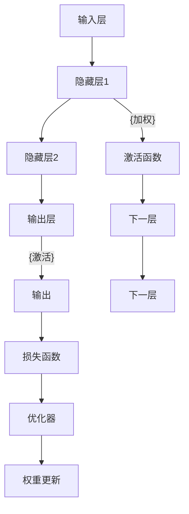

                 

## 1. 背景介绍

### 1.1 问题由来

人工智能(AI)作为21世纪最具变革性的技术之一，正在深刻地改变着人类的生产和生活方式。其中，神经网络（Neural Networks, NNs）作为AI的重要组成部分，在图像识别、语音处理、自然语言处理（NLP）等领域展现出了强大的能力。但神经网络的发展历程，不仅仅是技术演进的历程，更是推动社会进步的重要力量。

### 1.2 问题核心关键点

神经网络之所以能推动社会进步，在于其具备以下几大核心特点：

1. **强大的泛化能力**：神经网络能够通过海量的无标签数据进行预训练，学习出复杂的特征表示，进而对新的数据集进行高效泛化。

2. **高效的自动化处理**：神经网络能够自动化处理图像、语音、文本等非结构化数据，为各行各业带来便利。

3. **广泛的应用领域**：神经网络已经广泛应用于自动驾驶、医疗诊断、金融预测等领域，推动了产业升级。

4. **技术的不断突破**：通过不断的研究和优化，神经网络在深度、宽度、模型结构上不断取得突破，提升了性能。

### 1.3 问题研究意义

理解神经网络的发展历程及其对社会的影响，对于把握AI技术的前沿方向，推动技术的进一步应用，具有重要意义：

1. 加快AI技术普及。通过深入研究神经网络，可以更好地理解其原理和应用，加速AI技术的普及和应用。

2. 优化AI系统性能。神经网络的研究不断推动模型性能的提升，从而更好地服务于各行各业。

3. 赋能产业升级。神经网络技术的突破，为传统行业带来了新的技术路径，推动了产业的数字化转型。

4. 提升人类认知。神经网络的研究促进了对人类大脑和认知的深入理解，对科学和哲学带来了新的启示。

## 2. 核心概念与联系

### 2.1 核心概念概述

神经网络由大量的人工神经元（或称为节点）组成，通过前向传播和反向传播的机制学习数据特征。每个神经元接收来自其他神经元的输入，经过加权、激活等操作，产生输出。通过多层神经元的堆叠，可以构建复杂的非线性映射，用于分类、回归等任务。

神经网络的核心概念包括：

- **前向传播**：输入数据经过神经网络各层的线性变换和非线性激活，生成输出。
- **反向传播**：输出误差反向传播回神经网络各层，计算梯度并更新权重，从而调整模型参数，减小误差。
- **损失函数**：用于衡量模型预测值与真实值之间的差异，常用的损失函数包括均方误差、交叉熵等。
- **优化算法**：用于更新模型参数，使损失函数最小化，常用的优化算法包括梯度下降、Adam等。

这些概念之间相互关联，共同构成了神经网络的工作机制。

### 2.2 核心概念原理和架构的 Mermaid 流程图



### 2.3 核心概念联系

神经网络的各层之间通过加权、激活等操作，构建起复杂的非线性映射，从而实现对复杂输入数据的有效处理和泛化。前向传播和反向传播机制通过优化算法不断调整模型参数，提高模型的准确性。损失函数作为评价指标，指导优化算法不断改进模型，而权重更新则确保了模型的可训练性和泛化能力。

## 3. 核心算法原理 & 具体操作步骤

### 3.1 算法原理概述

神经网络的训练过程可以分为两个主要步骤：前向传播和反向传播。在前向传播中，输入数据经过各层神经元的线性变换和非线性激活，生成输出；在反向传播中，输出误差反向传播回各层，计算梯度并更新权重。

具体而言，假设神经网络模型为 $M_{\theta}$，其中 $\theta$ 为模型参数。给定输入数据 $x$，通过前向传播计算输出 $y$：

$$
y = M_{\theta}(x)
$$

定义损失函数 $\mathcal{L}(y, y_{true})$，其中 $y_{true}$ 为真实标签。在训练集上对模型进行迭代优化，最小化损失函数：

$$
\theta^* = \mathop{\arg\min}_{\theta} \mathcal{L}(y, y_{true})
$$

常用的优化算法包括梯度下降、Adam等。以梯度下降为例，其更新公式为：

$$
\theta_{new} = \theta_{old} - \eta \nabla_{\theta}\mathcal{L}(y, y_{true})
$$

其中 $\eta$ 为学习率，$\nabla_{\theta}\mathcal{L}(y, y_{true})$ 为损失函数对参数 $\theta$ 的梯度。

### 3.2 算法步骤详解

神经网络的训练步骤如下：

1. **数据准备**：收集训练集 $D=\{(x_i, y_i)\}_{i=1}^N$，分为训练集、验证集和测试集。

2. **模型定义**：使用深度学习框架定义神经网络模型 $M_{\theta}$，包括输入层、隐藏层、输出层等。

3. **损失函数选择**：根据任务类型选择适当的损失函数，如交叉熵损失、均方误差损失等。

4. **优化器选择**：选择常用的优化算法如Adam、SGD等，设置学习率等超参数。

5. **模型训练**：使用训练集数据，通过前向传播和反向传播不断更新模型参数，最小化损失函数。

6. **模型评估**：在验证集上评估模型性能，调整超参数，防止过拟合。

7. **模型测试**：在测试集上评估模型性能，输出最终结果。

### 3.3 算法优缺点

神经网络在图像识别、语音处理、自然语言处理等领域展现了强大的能力，但也存在一些缺点：

1. **需要大量数据**：神经网络需要大量的数据进行预训练，数据获取成本较高。

2. **计算资源消耗大**：神经网络的训练和推理过程需要大量的计算资源，难以在资源受限的设备上运行。

3. **模型复杂度高**：神经网络模型的参数量和计算量随着层数的增加而增加，可能导致过拟合和训练时间过长。

4. **可解释性差**：神经网络的黑盒性质使得其决策过程难以解释和调试，存在一定的技术壁垒。

5. **依赖超参数**：神经网络的性能高度依赖于超参数的选择，需要反复调试才能得到最佳效果。

### 3.4 算法应用领域

神经网络在多个领域得到了广泛应用，包括：

1. **计算机视觉**：用于图像分类、物体检测、人脸识别等任务，推动了智能监控、自动驾驶等技术的发展。

2. **自然语言处理**：用于文本分类、语言翻译、问答系统等任务，提升了机器翻译、智能客服等应用的效果。

3. **语音处理**：用于语音识别、语音合成、情感分析等任务，推动了智能音箱、智能语音助手等应用的发展。

4. **医疗健康**：用于医学影像分析、病历分析、药物研发等任务，提升了医疗诊断和治疗效果。

5. **金融分析**：用于股票预测、信用评估、风险管理等任务，推动了金融科技的发展。

## 4. 数学模型和公式 & 详细讲解 & 举例说明

### 4.1 数学模型构建

神经网络模型的数学模型包括输入、输出、隐藏层和激活函数等。以全连接神经网络为例，其数学模型为：

$$
\begin{aligned}
\mathbf{z}^{(1)} &= \mathbf{W}^{(1)}\mathbf{x} + \mathbf{b}^{(1)} \\
\mathbf{a}^{(1)} &= f(\mathbf{z}^{(1)}) \\
\mathbf{z}^{(2)} &= \mathbf{W}^{(2)}\mathbf{a}^{(1)} + \mathbf{b}^{(2)} \\
\mathbf{a}^{(2)} &= f(\mathbf{z}^{(2)}) \\
&\vdots \\
\mathbf{a}^{(L)} &= f(\mathbf{z}^{(L)})
\end{aligned}
$$

其中，$\mathbf{W}^{(l)}$ 和 $\mathbf{b}^{(l)}$ 为第 $l$ 层的权重和偏置，$f(\cdot)$ 为激活函数。输出层根据任务需求选择不同的激活函数，如Sigmoid、Softmax等。

### 4.2 公式推导过程

以二分类问题为例，神经网络的输出层为Sigmoid函数，其推导过程如下：

$$
\begin{aligned}
\mathbf{z}^{(L)} &= \mathbf{W}^{(L)}\mathbf{a}^{(L-1)} + \mathbf{b}^{(L)} \\
\mathbf{a}^{(L)} &= f(\mathbf{z}^{(L)}) \\
&= \frac{1}{1+\exp(-\mathbf{z}^{(L)})}
\end{aligned}
$$

定义损失函数为交叉熵损失：

$$
\mathcal{L}(\mathbf{a}^{(L)}, \mathbf{y}) = -\frac{1}{N}\sum_{i=1}^N y_i\log\mathbf{a}^{(L)}_i + (1-y_i)\log(1-\mathbf{a}^{(L)}_i)
$$

其中，$y_i$ 为真实标签，$\mathbf{a}^{(L)}_i$ 为模型预测概率。

### 4.3 案例分析与讲解

以手写数字识别为例，说明神经网络的应用过程：

1. **数据准备**：收集手写数字图片和标签，进行预处理和增强。

2. **模型定义**：定义多层感知器（MLP）模型，包括输入层、隐藏层、输出层。

3. **损失函数选择**：选择交叉熵损失函数。

4. **优化器选择**：选择Adam优化器，设置学习率。

5. **模型训练**：在训练集上训练模型，不断调整权重，最小化损失函数。

6. **模型评估**：在验证集上评估模型性能，调整超参数。

7. **模型测试**：在测试集上测试模型，输出识别结果。

## 5. 项目实践：代码实例和详细解释说明

### 5.1 开发环境搭建

在进行神经网络开发前，需要先搭建开发环境。以下是使用Python进行TensorFlow开发的环境配置流程：

1. 安装Anaconda：从官网下载并安装Anaconda，用于创建独立的Python环境。

2. 创建并激活虚拟环境：
```bash
conda create -n tf-env python=3.8 
conda activate tf-env
```

3. 安装TensorFlow：从官网获取对应的安装命令，安装TensorFlow。

4. 安装各类工具包：
```bash
pip install numpy pandas scikit-learn matplotlib tqdm jupyter notebook ipython
```

5. 安装相关库：
```bash
pip install tensorflow tensorflow-addons
```

完成上述步骤后，即可在`tf-env`环境中开始神经网络开发。

### 5.2 源代码详细实现

以下是使用TensorFlow进行手写数字识别任务的完整代码实现：

```python
import tensorflow as tf
import numpy as np
from tensorflow.keras.datasets import mnist

# 加载数据集
(x_train, y_train), (x_test, y_test) = mnist.load_data()

# 数据预处理
x_train = x_train / 255.0
x_test = x_test / 255.0

# 定义模型
model = tf.keras.models.Sequential([
    tf.keras.layers.Flatten(input_shape=(28, 28)),
    tf.keras.layers.Dense(128, activation='relu'),
    tf.keras.layers.Dense(10, activation='softmax')
])

# 编译模型
model.compile(optimizer='adam',
              loss='sparse_categorical_crossentropy',
              metrics=['accuracy'])

# 训练模型
model.fit(x_train, y_train, epochs=5, batch_size=32, validation_data=(x_test, y_test))

# 评估模型
model.evaluate(x_test, y_test)
```

### 5.3 代码解读与分析

**数据预处理**：
- 将像素值归一化到[0,1]范围内。

**模型定义**：
- 使用Sequential模型定义多层感知器，包括输入层、一个隐藏层和一个输出层。

**模型编译**：
- 使用Adam优化器，设置损失函数为交叉熵，评估指标为准确率。

**模型训练**：
- 在训练集上训练模型，设置迭代轮数和批大小。

**模型评估**：
- 在测试集上评估模型性能，输出测试集上的准确率。

## 6. 实际应用场景

### 6.1 智能监控

神经网络在智能监控领域得到了广泛应用，用于目标检测、行为识别等任务。通过摄像头采集的视频数据，神经网络可以实时检测到异常行为，并发出警报，提升公共安全。

### 6.2 智能驾驶

神经网络在自动驾驶领域用于图像识别、路径规划等任务，帮助车辆实现自主导航和避障。通过在车身上安装摄像头和传感器，神经网络可以实时分析交通情况，做出智能决策。

### 6.3 医疗影像分析

神经网络在医学影像分析中用于肿瘤检测、病变诊断等任务，提升了医生的工作效率和诊断准确率。通过分析X光片、CT等影像数据，神经网络可以自动识别异常区域，辅助医生做出诊断。

### 6.4 金融预测

神经网络在金融领域用于股票预测、风险管理等任务，帮助投资者做出更明智的投资决策。通过分析历史股价和市场数据，神经网络可以预测未来趋势，评估风险。

### 6.5 语音识别

神经网络在语音识别领域用于语音识别、语音合成等任务，推动了智能音箱、智能语音助手等应用的发展。通过分析音频数据，神经网络可以实现高效的语音识别和合成。

## 7. 工具和资源推荐

### 7.1 学习资源推荐

为了帮助开发者系统掌握神经网络的技术基础和实践技巧，这里推荐一些优质的学习资源：

1. 《深度学习》系列书籍：由深度学习专家Ian Goodfellow、Yoshua Bengio和Aaron Courville共同撰写，深入浅出地介绍了深度学习的原理和应用。

2. CS231n《卷积神经网络》课程：斯坦福大学开设的计算机视觉课程，涵盖深度学习在图像识别、物体检测等方面的应用。

3. CS224n《序列模型》课程：斯坦福大学开设的自然语言处理课程，涵盖深度学习在语言模型、机器翻译等方面的应用。

4. 《动手学深度学习》书籍：由李沐等人编写，包含深度学习框架介绍、模型实现、实战案例等。

5. TensorFlow官方文档：TensorFlow官方文档，提供了完整的模型实现和调试方法，是学习神经网络的重要资源。

6. PyTorch官方文档：PyTorch官方文档，提供了丰富的模型实现和代码示例，是学习神经网络的重要资源。

通过对这些资源的学习实践，相信你一定能够快速掌握神经网络的核心原理和应用技巧，并用于解决实际的NLP问题。

### 7.2 开发工具推荐

高效的开发离不开优秀的工具支持。以下是几款用于神经网络开发常用的工具：

1. TensorFlow：由Google主导开发的开源深度学习框架，生产部署方便，适合大规模工程应用。

2. PyTorch：由Facebook主导开发的深度学习框架，支持动态图和静态图，适合研究和快速迭代。

3. Keras：高级神经网络API，基于TensorFlow和Theano，提供了简单易用的接口，适合初学者。

4. Weights & Biases：模型训练的实验跟踪工具，可以记录和可视化模型训练过程中的各项指标，方便对比和调优。

5. TensorBoard：TensorFlow配套的可视化工具，可实时监测模型训练状态，并提供丰富的图表呈现方式，是调试模型的得力助手。

6. Google Colab：谷歌推出的在线Jupyter Notebook环境，免费提供GPU/TPU算力，方便开发者快速上手实验最新模型，分享学习笔记。

合理利用这些工具，可以显著提升神经网络开发效率，加快创新迭代的步伐。

### 7.3 相关论文推荐

神经网络的发展源于学界的持续研究。以下是几篇奠基性的相关论文，推荐阅读：

1. Deep Neural Networks for Image Recognition（ImageNet论文）：提出了深度卷积神经网络，在ImageNet图像识别任务上刷新了SOTA。

2. Rectified Linear Units Improve Neural Network Acoustic Models（ReLU论文）：提出了ReLU激活函数，提升了神经网络在语音处理中的表现。

3. Attention is All You Need（Transformer论文）：提出了Transformer结构，开启了神经网络在自然语言处理领域的应用。

4. BERT: Pre-training of Deep Bidirectional Transformers for Language Understanding（BERT论文）：提出BERT模型，引入自监督预训练任务，刷新了多项NLP任务SOTA。

5. Parameter-Efficient Training of Deep Learning Models（PELT论文）：提出了参数高效的神经网络训练方法，在不增加模型参数量的情况下，也能取得不错的训练效果。

这些论文代表了大规模神经网络的研究脉络。通过学习这些前沿成果，可以帮助研究者把握学科前进方向，激发更多的创新灵感。

## 8. 总结：未来发展趋势与挑战

### 8.1 总结

本文对神经网络的发展历程及其对社会的影响进行了全面系统的介绍。首先阐述了神经网络的基本原理和应用，明确了其在推动社会进步中的重要地位。其次，从原理到实践，详细讲解了神经网络的数学模型和训练过程，给出了神经网络任务开发的完整代码实例。同时，本文还广泛探讨了神经网络在多个行业领域的应用前景，展示了神经网络范式的巨大潜力。

通过本文的系统梳理，可以看到，神经网络已经广泛应用于多个领域，推动了各行各业的智能化升级。未来，伴随技术的不断突破和应用的不断深入，神经网络必将在更广阔的领域发挥更大的作用，为人类带来更多的便利和福祉。

### 8.2 未来发展趋势

展望未来，神经网络的发展将呈现以下几个趋势：

1. **模型规模持续增大**：随着算力成本的下降和数据规模的扩张，神经网络模型将变得更加庞大，蕴含的特征表示将更加丰富。

2. **模型结构更加复杂**：神经网络的结构将不断进化，出现更多高效的模型设计，如ResNet、Inception等。

3. **更多先验知识融合**：神经网络将更多地引入知识图谱、逻辑规则等先验知识，提升模型的泛化能力和可解释性。

4. **多模态信息整合**：神经网络将更多地融合视觉、语音、文本等模态数据，实现跨模态的智能交互。

5. **联邦学习与边缘计算**：神经网络将更多地应用于联邦学习与边缘计算场景，提升数据隐私和安全。

6. **计算模型并行化**：神经网络将更多地采用模型并行、分布式计算等技术，提升计算效率和资源利用率。

这些趋势凸显了神经网络技术的发展方向，预示着未来AI技术将更加高效、普适、智能。

### 8.3 面临的挑战

尽管神经网络技术取得了瞩目成就，但在迈向更加智能化、普适化应用的过程中，它仍面临诸多挑战：

1. **数据获取成本高**：神经网络需要大量的标注数据进行预训练，数据获取成本较高。

2. **计算资源消耗大**：神经网络的训练和推理过程需要大量的计算资源，难以在资源受限的设备上运行。

3. **可解释性差**：神经网络的黑盒性质使得其决策过程难以解释和调试，存在一定的技术壁垒。

4. **依赖超参数**：神经网络的性能高度依赖于超参数的选择，需要反复调试才能得到最佳效果。

5. **数据隐私与安全**：神经网络的应用涉及大量的个人数据，如何保障数据隐私和安全是一个重要问题。

### 8.4 研究展望

面对神经网络面临的挑战，未来的研究需要在以下几个方面寻求新的突破：

1. **自监督学习与弱监督学习**：摆脱对大规模标注数据的依赖，利用自监督学习、弱监督学习等方法，实现更加高效、鲁棒的模型训练。

2. **知识图谱与符号学习**：引入符号化的先验知识，如知识图谱、逻辑规则等，提升神经网络的泛化能力和可解释性。

3. **多模态信息融合**：融合视觉、语音、文本等模态数据，实现跨模态的智能交互，提升系统的理解和表达能力。

4. **联邦学习与边缘计算**：将神经网络应用于联邦学习与边缘计算场景，提升数据隐私和安全，实现智能设备之间的协同学习。

5. **计算模型并行化**：采用模型并行、分布式计算等技术，提升神经网络的计算效率和资源利用率。

这些研究方向将推动神经网络技术的进一步突破，为构建更加智能、普适、安全的AI系统铺平道路。总之，神经网络的研究仍需持续深入，不断探索新的技术路径，方能在未来的应用场景中发挥更大的作用。

## 9. 附录：常见问题与解答

**Q1：神经网络需要大量数据进行预训练，如何获得这些数据？**

A: 神经网络需要大量的标注数据进行预训练，数据获取成本较高。可以通过以下方式获取数据：
1. 利用公开数据集，如MNIST、ImageNet等。
2. 数据众包平台，如Amazon Mechanical Turk，可以低成本获取标注数据。
3. 自建数据集，收集实际应用中的数据，标注后用于模型训练。

**Q2：神经网络在训练和推理过程中需要大量的计算资源，如何优化？**

A: 神经网络需要大量的计算资源进行训练和推理，可以通过以下方式优化：
1. 使用GPU/TPU等高性能设备，提升计算效率。
2. 采用模型并行、分布式计算等技术，提高资源利用率。
3. 采用量化加速、剪枝等技术，减小模型规模，提升推理速度。

**Q3：神经网络的决策过程难以解释，如何提高其可解释性？**

A: 神经网络的黑盒性质使得其决策过程难以解释，可以采用以下方式提高其可解释性：
1. 使用可解释性模型，如决策树、线性回归等。
2. 使用模型可视化工具，如TensorBoard、Netron等，可视化神经网络的中间表示。
3. 引入先验知识，如知识图谱、逻辑规则等，提高模型的可解释性。

**Q4：神经网络高度依赖超参数的选择，如何优化超参数？**

A: 神经网络的性能高度依赖于超参数的选择，可以通过以下方式优化超参数：
1. 使用超参数调优工具，如Hyperopt、Optuna等，自动搜索最优超参数组合。
2. 采用网格搜索、随机搜索等方法，手动搜索最优超参数。
3. 结合领域知识，进行人工干预和优化。

通过合理选择和优化超参数，可以提高神经网络的性能，使其更好地适应实际应用场景。

**Q5：神经网络的应用涉及大量的个人数据，如何保障数据隐私和安全？**

A: 神经网络的应用涉及大量的个人数据，保障数据隐私和安全是一个重要问题，可以通过以下方式保障数据隐私和安全：
1. 数据脱敏技术，将敏感信息进行加密处理，保护用户隐私。
2. 联邦学习，在多个设备之间进行分布式训练，不共享原始数据。
3. 数据使用合规，遵守数据保护法律法规，如GDPR等。

通过合理的技术手段和法律法规保障，可以提升神经网络应用的可信度和安全性。

---

作者：禅与计算机程序设计艺术 / Zen and the Art of Computer Programming

