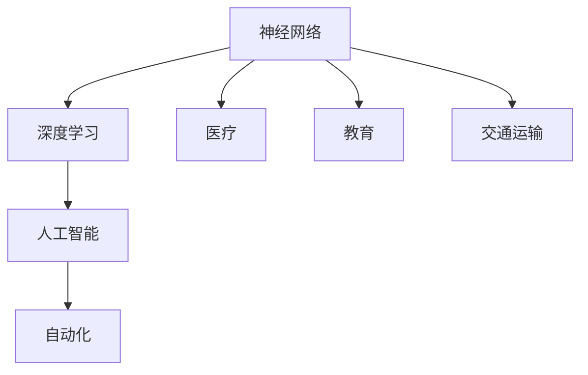

                 

# 神经网络：推动社会进步的力量

> 关键词：神经网络,深度学习,人工智能,社会进步,自动化,医疗,教育,交通运输

## 1. 背景介绍

### 1.1 问题由来
现代社会的进步离不开科技的推动，尤其是信息技术的革命。在过去几十年中，计算机技术的飞速发展，给人们的生活和工作带来了翻天覆地的变化。其中，神经网络作为深度学习中的重要组成部分，不仅推动了人工智能(AI)技术的发展，也为各行各业的自动化和智能化提供了强有力的工具。

神经网络最早由心理学家冯·诺伊曼在1940年代提出，用于模仿人脑的神经元网络结构。经过几十年的发展，神经网络已经从简单的感知器模型，演变为复杂的深度神经网络(Deep Neural Networks, DNNs)。深度学习框架TensorFlow、PyTorch等的出现，更是使得神经网络技术变得易于使用和普及，开启了AI时代的序幕。

### 1.2 问题核心关键点
神经网络技术的发展，不仅推动了计算机科学的进步，也带来了诸多深远的社会影响。它已经在医疗、教育、交通运输、智能制造等多个领域得到广泛应用，极大地提升了这些行业的效率和生产力。同时，神经网络技术也在改变人类的工作方式，推动社会向更加智能化、高效化的方向发展。

神经网络技术的发展，不仅仅是一种技术的突破，更是一种力量的象征。它代表了人类对自然界的深刻理解，对复杂系统的建模能力，以及改变世界的巨大潜力。

## 2. 核心概念与联系

### 2.1 核心概念概述

为更好地理解神经网络技术及其在社会进步中的作用，本节将介绍几个密切相关的核心概念：

- **神经网络**：由许多相互连接的计算单元组成，每个单元通过权重与相邻单元相连，模拟人脑神经元间的信号传递过程。
- **深度学习**：一种利用多层神经网络进行学习的机器学习方法，通过多层次的信息提取和抽象，实现对复杂数据的处理和建模。
- **人工智能**：模拟人类智能行为的技术，包括感知、学习、推理、决策等。
- **自动化**：利用计算机技术代替人工操作的过程，包括制造自动化、管理自动化、服务自动化等。
- **医疗**：使用神经网络技术进行疾病诊断、个性化治疗、药物研发等。
- **教育**：利用智能教育系统进行个性化学习、自动批改作业、智能辅导等。
- **交通运输**：在自动驾驶、交通预测、路网优化等领域应用神经网络技术。

这些核心概念之间的逻辑关系可以通过以下Mermaid流程图来展示：



这个流程图展示神经网络、深度学习、人工智能、自动化以及其在医疗、教育、交通运输等不同领域的应用。

## 3. 核心算法原理 & 具体操作步骤
### 3.1 算法原理概述

神经网络的基本原理是通过多层神经元的组合，模拟人脑的信息处理方式。每一层神经元接收来自上一层的输入，通过加权求和和激活函数的处理，产生输出传递给下一层。最终的输出层将计算结果映射到具体的任务目标，如分类、回归、生成等。

深度学习在此基础上，通过增加网络深度和宽度，实现更强的信息提取和抽象能力。深度学习神经网络通常由多个隐藏层组成，每个隐藏层都会对输入数据进行一次非线性变换，最终输出一个接近任务目标的表示。这种多层次的抽象表示能力，使得深度神经网络在图像识别、语音识别、自然语言处理等领域取得了显著的成果。

### 3.2 算法步骤详解

深度学习神经网络的训练通常包括以下几个关键步骤：

**Step 1: 数据准备**
- 收集和标注数据集，包括训练集、验证集和测试集。
- 对数据进行预处理，如归一化、标准化、数据增强等。

**Step 2: 网络构建**
- 定义网络结构，包括输入层、隐藏层和输出层。
- 选择合适的激活函数、损失函数、优化器等。
- 对神经网络的权重进行随机初始化。

**Step 3: 前向传播**
- 将训练数据输入神经网络，计算每个神经元的输出。
- 使用激活函数进行非线性变换，得到中间层的特征表示。

**Step 4: 反向传播**
- 计算损失函数对每个参数的梯度。
- 使用优化算法，如梯度下降、Adam等，更新网络权重。

**Step 5: 模型评估**
- 在验证集上评估模型性能，选择合适的超参数。
- 在测试集上评估模型泛化能力，输出最终结果。

以上是深度学习神经网络训练的一般流程。在实际应用中，还需要针对具体任务的特点，对网络结构和训练过程进行优化设计，如改进激活函数、添加正则化项、引入迁移学习等。

### 3.3 算法优缺点

深度学习神经网络技术具有以下优点：
1. 强大的表达能力：通过多层次的抽象表示，能够处理复杂的数据结构。
2. 鲁棒性强：在图像、语音、自然语言等领域，具有很强的泛化能力。
3. 自动化程度高：一旦模型训练完成，能够自动处理新数据，无需人工干预。
4. 应用广泛：在医疗、教育、交通运输等众多领域都有应用，提升了各行业的效率和生产力。

同时，神经网络技术也存在一些局限性：
1. 对标注数据依赖性强：神经网络需要大量标注数据进行训练，标注成本高。
2. 模型复杂度高：深度神经网络参数量大，计算复杂度高。
3. 模型黑箱性：神经网络内部的计算过程不透明，难以解释。
4. 过拟合风险高：模型容易对训练集过度拟合，泛化能力不足。
5. 计算资源要求高：神经网络训练和推理需要高性能计算设备。

尽管存在这些局限性，但就目前而言，深度学习神经网络技术仍是目前解决复杂问题的主流方法。未来相关研究的重点在于如何进一步降低神经网络的计算资源需求，提高模型的可解释性，优化模型泛化能力等方面。

### 3.4 算法应用领域

深度学习神经网络技术已经在医疗、教育、交通运输等多个领域得到广泛应用，带来了显著的社会效益：

- **医疗**：通过神经网络进行图像诊断、自然语言处理、药物研发等，提高了医疗诊断的准确性和效率。
- **教育**：利用智能教育系统进行个性化学习、自动批改作业、智能辅导等，提升了教育质量和学习效率。
- **交通运输**：在自动驾驶、交通预测、路网优化等领域应用神经网络技术，提高了交通安全和效率。
- **智能制造**：在质量检测、工艺优化、设备维护等方面，利用神经网络技术实现智能化管理。
- **金融服务**：在风险评估、交易预测、欺诈检测等领域，利用神经网络技术提升金融服务的准确性和安全性。
- **安全监控**：在视频监控、异常行为检测等领域，利用神经网络技术实现智能监控和预警。

此外，神经网络技术还在智慧城市、环境保护、社交网络等领域得到了广泛应用，为各行各业的发展提供了强有力的技术支持。

## 4. 数学模型和公式 & 详细讲解 & 举例说明

### 4.1 数学模型构建

在深度学习中，常用的数学模型包括前向传播模型和反向传播模型。下面以二分类问题为例，详细讲解这两种模型。

设训练集为 $(x_i, y_i)$，其中 $x_i \in \mathbb{R}^n$ 为输入，$y_i \in \{0,1\}$ 为标签。定义神经网络模型为 $f_\theta(x)$，其中 $\theta$ 为模型参数。

前向传播模型用于计算输入 $x$ 在网络中的传播过程，其数学模型为：

$$
h_i = f_{w_i}(z_{i-1}) = \sigma(W_i z_{i-1} + b_i), \quad i = 1, \cdots, L
$$

其中 $h_i \in \mathbb{R}$ 为第 $i$ 层神经元的输出，$z_{i-1} \in \mathbb{R}^m$ 为第 $i-1$ 层的输入，$w_i \in \mathbb{R}^{m \times n}$ 为第 $i$ 层的权重，$b_i \in \mathbb{R}^m$ 为第 $i$ 层的偏置，$\sigma$ 为激活函数。

反向传播模型用于计算损失函数对每个参数的梯度，其数学模型为：

$$
\frac{\partial L}{\partial w_i} = \frac{\partial L}{\partial h_i} \frac{\partial h_i}{\partial z_{i-1}} \frac{\partial z_{i-1}}{\partial w_i} = \frac{\partial L}{\partial h_i} \frac{\partial f_{w_i}(z_{i-1})}{\partial z_{i-1}} W_i^T
$$

其中 $\frac{\partial L}{\partial h_i}$ 为损失函数对第 $i$ 层输出 $h_i$ 的梯度，$\frac{\partial h_i}{\partial z_{i-1}}$ 为输出对输入的梯度，$\frac{\partial z_{i-1}}{\partial w_i}$ 为输入对权重的梯度。

### 4.2 公式推导过程

以下我们以二分类任务为例，推导交叉熵损失函数及其梯度的计算公式。

设模型 $f_\theta(x)$ 在输入 $x$ 上的输出为 $\hat{y}=M_{\theta}(x) \in [0,1]$，表示样本属于正类的概率。真实标签 $y \in \{0,1\}$。则二分类交叉熵损失函数定义为：

$$
\ell(M_{\theta}(x),y) = -[y\log \hat{y} + (1-y)\log (1-\hat{y})]
$$

将其代入损失函数公式，得：

$$
\mathcal{L}(\theta) = -\frac{1}{N}\sum_{i=1}^N [y_i\log M_{\theta}(x_i)+(1-y_i)\log(1-M_{\theta}(x_i))]
$$

根据链式法则，损失函数对权重 $\theta$ 的梯度为：

$$
\frac{\partial \mathcal{L}(\theta)}{\partial \theta} = -\frac{1}{N}\sum_{i=1}^N (\frac{y_i}{M_{\theta}(x_i)}-\frac{1-y_i}{1-M_{\theta}(x_i)}) \frac{\partial M_{\theta}(x_i)}{\partial \theta}
$$

其中 $\frac{\partial M_{\theta}(x_i)}{\partial \theta}$ 可进一步递归展开，利用自动微分技术完成计算。

在得到损失函数的梯度后，即可带入优化算法，完成模型的迭代优化。重复上述过程直至收敛，最终得到适应下游任务的最优模型参数 $\theta^*$。

### 4.3 案例分析与讲解

假设我们有一个二分类问题，训练集为 $(x_i, y_i)$，其中 $x_i \in \mathbb{R}^n$ 为输入，$y_i \in \{0,1\}$ 为标签。定义神经网络模型为 $f_\theta(x)$，其中 $\theta$ 为模型参数。

1. **数据准备**：
   - 收集和标注数据集，包括训练集、验证集和测试集。
   - 对数据进行预处理，如归一化、标准化、数据增强等。

2. **网络构建**：
   - 定义神经网络结构，包括输入层、隐藏层和输出层。
   - 选择合适的激活函数、损失函数、优化器等。
   - 对神经网络的权重进行随机初始化。

3. **前向传播**：
   - 将训练数据输入神经网络，计算每个神经元的输出。
   - 使用激活函数进行非线性变换，得到中间层的特征表示。

4. **反向传播**：
   - 计算损失函数对每个参数的梯度。
   - 使用优化算法，如梯度下降、Adam等，更新网络权重。

5. **模型评估**：
   - 在验证集上评估模型性能，选择合适的超参数。
   - 在测试集上评估模型泛化能力，输出最终结果。

具体代码实现如下：

```python
import tensorflow as tf
from tensorflow.keras import layers, models

# 定义神经网络模型
def create_model(input_shape):
    model = models.Sequential([
        layers.Dense(64, activation='relu', input_shape=input_shape),
        layers.Dense(64, activation='relu'),
        layers.Dense(1, activation='sigmoid')
    ])
    return model

# 定义损失函数
def cross_entropy_loss(y_true, y_pred):
    return tf.keras.losses.binary_crossentropy(y_true, y_pred)

# 定义优化器
optimizer = tf.keras.optimizers.Adam()

# 定义训练函数
def train_model(model, train_dataset, validation_dataset, epochs=10, batch_size=32):
    model.compile(optimizer=optimizer, loss=cross_entropy_loss, metrics=['accuracy'])
    history = model.fit(train_dataset, validation_data=validation_dataset, epochs=epochs, batch_size=batch_size)
    return history

# 定义测试函数
def test_model(model, test_dataset, batch_size=32):
    test_loss, test_acc = model.evaluate(test_dataset, batch_size=batch_size)
    return test_loss, test_acc
```

在上述代码中，我们使用Keras框架构建了一个简单的神经网络模型，包含两个隐藏层和一个输出层。定义了交叉熵损失函数和Adam优化器，并使用训练函数对模型进行训练。在训练完成后，使用测试函数评估模型性能。

## 5. 项目实践：代码实例和详细解释说明

### 5.1 开发环境搭建

在进行深度学习项目实践前，我们需要准备好开发环境。以下是使用Python进行TensorFlow开发的环境配置流程：

1. 安装Anaconda：从官网下载并安装Anaconda，用于创建独立的Python环境。

2. 创建并激活虚拟环境：
```bash
conda create -n tf-env python=3.8 
conda activate tf-env
```

3. 安装TensorFlow：根据CUDA版本，从官网获取对应的安装命令。例如：
```bash
conda install tensorflow -c conda-forge
```

4. 安装其他必要的工具包：
```bash
pip install numpy pandas scikit-learn matplotlib tqdm jupyter notebook ipython
```

完成上述步骤后，即可在`tf-env`环境中开始深度学习实践。

### 5.2 源代码详细实现

下面我们以手写数字识别(MNIST)为例，给出使用TensorFlow进行深度学习项目开发的代码实现。

首先，导入必要的库和数据集：

```python
import tensorflow as tf
from tensorflow.keras.datasets import mnist
from tensorflow.keras.models import Sequential
from tensorflow.keras.layers import Dense, Flatten

# 加载MNIST数据集
(x_train, y_train), (x_test, y_test) = mnist.load_data()
```

接着，定义模型和训练函数：

```python
model = Sequential([
    Flatten(input_shape=(28, 28)),
    Dense(64, activation='relu'),
    Dense(10, activation='softmax')
])

model.compile(optimizer=tf.keras.optimizers.Adam(),
              loss=tf.keras.losses.SparseCategoricalCrossentropy(from_logits=True),
              metrics=['accuracy'])

def train(model, x_train, y_train, batch_size=32, epochs=10):
    history = model.fit(x_train, y_train, batch_size=batch_size, epochs=epochs, validation_split=0.2)
    return history

history = train(model, x_train, y_train)
```

最后，评估模型性能并在测试集上验证：

```python
test_loss, test_acc = model.evaluate(x_test, y_test, verbose=2)
print(f'Test loss: {test_loss}')
print(f'Test accuracy: {test_acc}')
```

以上就是使用TensorFlow进行手写数字识别任务的深度学习项目开发的完整代码实现。可以看到，TensorFlow提供了强大的工具和接口，可以轻松地构建、训练和评估深度学习模型。

### 5.3 代码解读与分析

让我们再详细解读一下关键代码的实现细节：

**Flatten层**：
- 将二维的28x28的手写数字图片，展平为向量形式，方便后续全连接层的处理。

**Dense层**：
- 定义全连接层，输入维度为784，输出维度为64，使用ReLU激活函数。
- 定义输出层，输入维度为64，输出维度为10，使用Softmax激活函数，用于分类输出。

**SparseCategoricalCrossentropy**：
- 定义损失函数，使用稀疏类交叉熵损失函数，因为标签为整数形式。

**Adam优化器**：
- 定义优化器，使用Adam算法，学习率自动调整，效果较好。

**train函数**：
- 定义训练函数，指定训练集、验证集、批次大小和轮数，调用fit函数训练模型。

**evaluate函数**：
- 定义评估函数，评估模型在测试集上的表现，输出损失和准确率。

可以看到，TensorFlow提供了简单易用的接口，使得深度学习模型的开发变得轻便高效。开发者可以根据需要快速搭建模型，并进行训练和评估。

## 6. 实际应用场景

### 6.1 智能医疗

深度学习神经网络技术在医疗领域得到了广泛应用，提升了医疗诊断和治疗的准确性和效率。

在图像识别方面，深度学习可以自动分析医学影像，进行疾病诊断和分期。如卷积神经网络(CNN)在X光片、CT、MRI等医学影像中的应用，已经显著提高了癌症、心脏病等疾病的诊断准确率。此外，通过迁移学习和模型微调，可以在不同医院和医生之间共享知识，提升诊断的一致性。

在自然语言处理方面，深度学习可以处理病历记录、医生笔记等文本数据，提取关键信息，辅助医生进行诊断和治疗决策。如基于BERT模型的自然语言处理技术，已经广泛应用于电子病历的分析和理解，提高了医疗信息的管理效率。

### 6.2 智能教育

深度学习神经网络技术在教育领域的应用，正在改变传统的教育方式，提升个性化学习的质量和效率。

在智能辅导方面，深度学习可以分析学生的学习行为和反馈，提供个性化的学习建议和资源推荐。如基于RNN和Transformer的智能辅导系统，已经在多门学科中应用，帮助学生更好地掌握知识点。此外，基于深度学习模型的在线答疑系统，可以24小时不间断地回答学生的问题，提高教学效率。

在作业批改方面，深度学习可以自动批改学生的作业，给出详细的评分和反馈。如基于CNN和RNN的作业批改系统，已经在高中和大学中得到应用，帮助教师减轻负担。

### 6.3 智能制造

深度学习神经网络技术在智能制造领域的应用，提高了生产效率和产品质量。

在质量检测方面，深度学习可以自动分析生产过程中的数据，检测产品缺陷和质量问题。如基于卷积神经网络(CNN)的图像识别技术，已经在汽车制造、电子设备生产等领域得到应用，提高了产品的一致性和稳定性。

在工艺优化方面，深度学习可以分析生产过程的历史数据，优化工艺参数和生产流程。如基于LSTM和RNN的工艺优化系统，已经在钢铁生产、化工制造等领域得到应用，提高了生产效率和资源利用率。

### 6.4 未来应用展望

随着深度学习技术的不断发展，神经网络的应用领域将更加广泛。未来，神经网络技术将在更多行业得到应用，为社会进步提供新的动力。

在智慧医疗方面，深度学习将继续推动医疗诊断和治疗的自动化和智能化，减少人为错误，提升医疗服务的质量和效率。

在智能教育方面，深度学习将进一步提升个性化学习的效果，辅助教师进行教学管理，为学生提供更好的学习体验。

在智能制造方面，深度学习将继续优化生产过程，提高产品质量和生产效率，推动制造业的智能化转型。

在自动驾驶方面，深度学习将继续推动自动驾驶技术的发展，提升驾驶安全性和可靠性，加速汽车自动化的进程。

## 7. 工具和资源推荐
### 7.1 学习资源推荐

为了帮助开发者系统掌握深度学习神经网络技术及其在社会进步中的作用，这里推荐一些优质的学习资源：

1. **《深度学习》**：Ian Goodfellow等人所著，深入浅出地介绍了深度学习的基本概念和算法，适合初学者入门。

2. **《动手学深度学习》**：李沐等人所著，基于PyTorch实现，提供了丰富的代码示例和实践指导，适合实战练习。

3. **DeepLearning.ai课程**：Andrew Ng教授主讲的深度学习课程，涵盖深度学习的基本原理和实践技巧，适合系统学习。

4. **Coursera深度学习专业证书**：由DeepMind和IBM联合推出的深度学习专业证书，涵盖深度学习的基础和应用，适合获取认证。

5. **arXiv论文**：深度学习领域的顶级会议和期刊，如ICML、NIPS、CVPR等，是学习最新研究进展的重要渠道。

通过对这些资源的学习实践，相信你一定能够快速掌握深度学习神经网络技术的精髓，并用于解决实际的深度学习问题。

### 7.2 开发工具推荐

高效的深度学习开发离不开优秀的工具支持。以下是几款用于深度学习开发常用的工具：

1. **TensorFlow**：Google开发的深度学习框架，支持GPU/TPU加速，支持分布式训练，适合大规模工程应用。

2. **PyTorch**：Facebook开发的深度学习框架，灵活易用，适合研究和原型开发。

3. **Keras**：高层神经网络API，支持TensorFlow、Theano和CNTK后端，适合快速搭建模型。

4. **JAX**：基于Python的深度学习库，支持自动微分和向量运算，适合高性能计算。

5. **MXNet**：由Apache开发的深度学习框架，支持分布式训练和多语言支持，适合多平台部署。

6. **Google Colab**：谷歌提供的在线Jupyter Notebook环境，免费提供GPU/TPU算力，适合快速实验。

合理利用这些工具，可以显著提升深度学习项目的开发效率，加速创新迭代的步伐。

### 7.3 相关论文推荐

深度学习神经网络的发展源于学界的持续研究。以下是几篇奠基性的相关论文，推荐阅读：

1. **ImageNet Classification with Deep Convolutional Neural Networks**：AlexNet论文，展示了深度卷积神经网络在图像分类任务上的强大性能。

2. **LeNet-5: A Convolutional Neural Network for Handwritten Digit Recognition**：LeNet论文，展示了卷积神经网络在手写数字识别任务上的应用。

3. **A Learning Framework for Deep Neural Networks**：Hinton等人提出的深度学习框架，奠定了深度神经网络研究的基础。

4. **BERT: Pre-training of Deep Bidirectional Transformers for Language Understanding**：BERT论文，展示了深度双向Transformer在自然语言处理任务上的突破。

5. **AlphaGo Zero**：DeepMind开发的围棋AI，展示了深度强化学习在游戏领域的巨大潜力。

这些论文代表了大深度学习神经网络的发展脉络。通过学习这些前沿成果，可以帮助研究者把握学科前进方向，激发更多的创新灵感。

## 8. 总结：未来发展趋势与挑战

### 8.1 总结

本文对深度学习神经网络技术及其在社会进步中的作用进行了全面系统的介绍。首先阐述了深度学习的基本原理和核心概念，明确了神经网络在现代科技中的重要地位。其次，从原理到实践，详细讲解了深度学习神经网络的数学模型和训练流程，给出了深度学习项目开发的完整代码实例。同时，本文还广泛探讨了深度学习在医疗、教育、智能制造等领域的应用前景，展示了神经网络技术对社会进步的深远影响。

通过本文的系统梳理，可以看到，深度学习神经网络技术不仅是一种技术突破，更是一种推动社会进步的力量。它在医疗、教育、智能制造等多个领域的应用，正在改变人们的生活方式，提升社会的生产力和效率。未来，随着深度学习技术的不断发展，神经网络的应用领域将更加广泛，为社会进步带来更大的价值。

### 8.2 未来发展趋势

展望未来，深度学习神经网络技术将呈现以下几个发展趋势：

1. **多模态融合**：神经网络将进一步扩展到图像、语音、视频等多个模态数据的处理，实现多模态数据的协同建模。

2. **端到端学习**：深度学习将进一步融合感知、决策、控制等环节，实现从感知到执行的端到端学习，提升系统的整体性能。

3. **无监督学习和自监督学习**：深度学习将更多地利用无监督学习和自监督学习的思想，提高数据的使用效率，降低对标注数据的依赖。

4. **联邦学习和边缘计算**：深度学习将更多地应用于联邦学习和边缘计算场景，提升数据隐私保护和系统效率。

5. **深度强化学习**：深度强化学习将在更多领域得到应用，如自动驾驶、机器人控制、游戏AI等，推动AI技术向更加智能和自主化的方向发展。

6. **人工智能伦理和社会影响**：深度学习技术的发展将带来更多伦理和社会问题，如就业影响、数据隐私、算法偏见等，需要更多的社会关注和规范。

以上趋势凸显了深度学习神经网络技术的广阔前景。这些方向的探索发展，必将进一步提升深度学习系统的性能和应用范围，为社会进步带来更大的价值。

### 8.3 面临的挑战

尽管深度学习神经网络技术已经取得了瞩目成就，但在迈向更加智能化、普适化应用的过程中，它仍面临诸多挑战：

1. **数据隐私问题**：深度学习模型需要大量的标注数据进行训练，如何保护用户隐私，防止数据泄露，是一个重要的研究课题。

2. **模型鲁棒性不足**：深度学习模型在面对域外数据时，泛化性能往往大打折扣，容易受到对抗样本和噪声的影响。

3. **计算资源需求高**：深度学习模型需要高性能计算设备进行训练和推理，如何降低计算资源需求，提高计算效率，是一个重要的研究方向。

4. **模型复杂度高**：深度学习模型参数量大，难以解释，如何提高模型的可解释性，是一个重要的研究方向。

5. **模型公平性不足**：深度学习模型容易学习到有偏见的数据，导致模型输出不公平。如何提高模型的公平性，是一个重要的研究方向。

6. **社会影响复杂**：深度学习技术的应用将带来复杂的社会影响，如就业影响、数据隐私、算法偏见等，需要更多的社会关注和规范。

正视深度学习面临的这些挑战，积极应对并寻求突破，将使得神经网络技术能够更好地服务于社会，推动社会进步。

### 8.4 研究展望

面向未来，深度学习神经网络技术需要在以下几个方面寻求新的突破：

1. **模型简化和优化**：通过模型简化和优化，降低计算资源需求，提高计算效率，增强模型的可解释性。

2. **数据隐私保护**：研究隐私保护技术，保护用户隐私，防止数据泄露，提升数据安全。

3. **公平性和鲁棒性**：研究公平性、鲁棒性、对抗性等方向，提高模型的公平性，增强模型的鲁棒性。

4. **多模态融合**：研究多模态数据的融合方法，实现多模态数据的协同建模，提升系统的整体性能。

5. **端到端学习**：研究端到端学习方法，提升系统从感知到执行的性能，实现更加智能和自主化的应用。

6. **伦理和社会影响**：研究人工智能伦理和社会影响问题，确保深度学习技术的应用符合人类价值观和伦理道德，提升技术应用的公平性和可持续性。

这些研究方向将引领深度学习神经网络技术迈向更高的台阶，为构建安全、可靠、可解释、可控的智能系统铺平道路。

## 9. 附录：常见问题与解答

**Q1：深度学习神经网络是否适用于所有NLP任务？**

A: 深度学习神经网络在大多数NLP任务上都能取得不错的效果，特别是对于数据量较小的任务。但对于一些特定领域的任务，如医学、法律等，仅仅依靠通用语料预训练的模型可能难以很好地适应。此时需要在特定领域语料上进一步预训练，再进行微调，才能获得理想效果。此外，对于一些需要时效性、个性化很强的任务，如对话、推荐等，深度学习方法也需要针对性的改进优化。

**Q2：深度学习神经网络面临哪些资源瓶颈？**

A: 目前主流的深度学习模型动辄以亿计的参数规模，对算力、内存、存储都提出了很高的要求。高性能计算设备是必不可少的，但即便如此，超大批次的训练和推理也可能遇到显存不足的问题。因此需要采用一些资源优化技术，如梯度积累、混合精度训练、模型并行等，来突破硬件瓶颈。同时，模型的存储和读取也可能占用大量时间和空间，需要采用模型压缩、稀疏化存储等方法进行优化。

**Q3：深度学习神经网络在实际应用中需要注意哪些问题？**

A: 将深度学习神经网络技术转化为实际应用，还需要考虑以下因素：
1. 模型裁剪：去除不必要的层和参数，减小模型尺寸，加快推理速度。
2. 量化加速：将浮点模型转为定点模型，压缩存储空间，提高计算效率。
3. 服务化封装：将模型封装为标准化服务接口，便于集成调用。
4. 弹性伸缩：根据请求流量动态调整资源配置，平衡服务质量和成本。
5. 监控告警：实时采集系统指标，设置异常告警阈值，确保服务稳定性。
6. 安全防护：采用访问鉴权、数据脱敏等措施，保障数据和模型安全。

深度学习神经网络技术为各行各业的发展提供了强有力的技术支持，但如何将强大的性能转化为稳定、高效、安全的业务价值，还需要工程实践的不断打磨。

总之，深度学习神经网络技术已经深刻改变了现代社会的面貌，推动了各行各业的智能化转型。未来，随着技术的不断进步，深度学习神经网络将在更多领域得到应用，为社会进步带来更大的价值。

