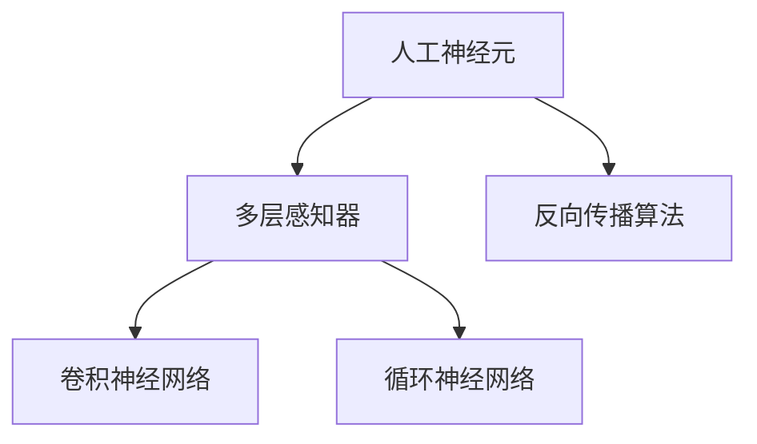

                 

# 神经网络：改变世界的技术

> 关键词：神经网络,深度学习,机器学习,人工神经元,反向传播算法,卷积神经网络(CNN),循环神经网络(RNN),自然语言处理(NLP)

## 1. 背景介绍

### 1.1 问题由来
在现代科技的推动下，人工智能(AI)领域迎来了飞速的发展。从智能机器视觉、智能语音识别，到智能推荐系统、自然语言处理(NLP)，都在持续刷新着人们对于计算机能力的认知。这一切技术变革的背后，是神经网络的推动。

神经网络，这个由20世纪40年代提出的概念，在21世纪初期，通过深度学习技术再次成为重大的科研与工程突破点。现在，我们正站在神经网络技术发展的黄金时代，越来越多的领域被神经网络所变革。

### 1.2 问题核心关键点
深度学习技术的兴起，使得神经网络技术逐渐走入人们的视野。深度学习的核心理念是构建多层神经元网络，通过反向传播算法实现对复杂模式的学习。这一技术突破，让计算机能够处理更加复杂、大规模的数据集，使AI模型在某些任务上超越了人类的表现。

深度学习的核心组件包括人工神经元、多层感知器(Multilayer Perceptron, MLP)、卷积神经网络(CNN)、循环神经网络(RNN)等。这些组件分别对应不同的数据结构与任务类型。

随着技术不断成熟，神经网络已经被广泛应用于图像识别、语音识别、自然语言处理、推荐系统等众多领域。在这些领域中，神经网络展现出了强大的学习和泛化能力。

### 1.3 问题研究意义
研究神经网络的核心算法和模型，对于提升人工智能应用的质量，推动相关领域的产业升级，具有重要意义：

1. 提高模型性能。神经网络通过多层结构实现复杂特征的提取与分析，使得模型在处理复杂任务时表现卓越。
2. 加速技术落地。神经网络技术的成熟，大大降低了应用开发的技术门槛，加快了AI技术的产业部署。
3. 推动新领域的创新。神经网络技术已经渗透到传统行业的各个角落，如医疗、教育、金融等，带来了新的业务模式和应用场景。
4. 助力科研发展。神经网络技术为科学研究提供了新的工具和视角，推动了人工智能理论的不断进步。
5. 增强国际竞争力。在全球科技竞争激烈的今天，掌握神经网络技术，能够占据AI发展的制高点。

## 2. 核心概念与联系

### 2.1 核心概念概述

为了更好地理解神经网络的原理，本节将介绍几个核心的概念：

- 人工神经元(Artificial Neuron)：神经网络的基本单位，接收输入信号，通过加权求和和激活函数输出。
- 多层感知器(Multilayer Perceptron, MLP)：由多个神经元层堆叠组成的前馈神经网络，用于处理分类、回归等线性可分问题。
- 卷积神经网络(Convolutional Neural Network, CNN)：用于处理图像数据的神经网络，通过卷积核提取局部特征，实现图像识别等任务。
- 循环神经网络(Recurrent Neural Network, RNN)：处理序列数据的神经网络，通过时间步的循环连接，捕捉数据序列的时序关系。
- 反向传播算法(Backpropagation)：神经网络的训练算法，通过链式法则计算每个神经元的梯度，更新网络权重。

这些核心概念之间的逻辑关系可以通过以下Mermaid流程图来展示：



这个流程图展示了几大神经网络组件及其相互关系：

1. 人工神经元是神经网络的基本构成单元。
2. 多层感知器是最常见的前馈神经网络，适用于各类分类、回归任务。
3. 卷积神经网络针对图像数据设计，通过卷积层、池化层提取局部特征，用于图像识别等任务。
4. 循环神经网络用于处理序列数据，通过循环层捕捉时间序列依赖。
5. 反向传播算法是神经网络的训练方法，通过梯度下降优化模型参数。

## 3. 核心算法原理 & 具体操作步骤
### 3.1 算法原理概述

神经网络的核心算法是反向传播算法，其核心思想是通过链式法则计算误差对各个参数的导数，从而更新权重，最小化模型的预测误差。

神经网络的训练目标是通过反向传播算法，找到一组参数使得模型预测结果与真实标签尽可能接近。具体地，设模型的损失函数为 $\mathcal{L}$，模型的预测结果为 $h_{\theta}(x)$，其中 $\theta$ 是模型参数。训练目标为最小化损失函数：

$$
\theta^* = \mathop{\arg\min}_{\theta} \mathcal{L}(h_{\theta}(x), y)
$$

其中 $y$ 是训练样本的真实标签。

训练过程分为前向传播和反向传播两个阶段：

1. 前向传播：将输入数据 $x$ 送入神经网络，通过各层神经元的计算，得到模型预测结果 $h_{\theta}(x)$。
2. 反向传播：计算预测结果与真实标签之间的误差，利用链式法则计算每个神经元的梯度，并通过优化算法更新权重，最小化损失函数。

### 3.2 算法步骤详解

以下是使用反向传播算法进行神经网络训练的一般步骤：

1. 准备训练数据集，划分为训练集、验证集和测试集。
2. 定义神经网络模型，包括网络结构、激活函数、损失函数等。
3. 随机初始化网络参数 $\theta$。
4. 通过前向传播计算预测结果 $h_{\theta}(x)$。
5. 计算预测结果与真实标签之间的误差 $\mathcal{L}(h_{\theta}(x), y)$。
6. 利用链式法则计算每个神经元的梯度，更新权重 $\theta$。
7. 重复步骤4到6，直至模型收敛或达到预设轮数。
8. 在测试集上评估模型性能，对比训练前后的精度提升。

### 3.3 算法优缺点

神经网络在处理复杂任务时具有显著优势，但也存在一些局限性：

优点：

1. 强大的泛化能力。神经网络能够学习数据中的复杂模式，处理多变量数据，适用于各种复杂任务。
2. 高精度。神经网络的复杂结构使得其在许多任务中超过了传统机器学习算法，精度表现卓越。
3. 适用于大数据。神经网络能够处理大规模数据集，具有较好的扩展性。

缺点：

1. 高计算资源需求。神经网络训练和推理需要大量的计算资源，存在计算瓶颈。
2. 过拟合风险。神经网络模型容易发生过拟合，特别是在数据量不足的情况下。
3. 难以解释。神经网络的决策过程通常缺乏可解释性，难以理解其内部工作机制。
4. 参数量大。神经网络模型需要大量参数，模型调试和存储成本较高。

尽管存在这些局限性，但神经网络在实际应用中已经取得了巨大成功，其强大的学习和泛化能力使得其在诸多领域中扮演了重要角色。

### 3.4 算法应用领域

神经网络已经被广泛应用于各个领域，以下是其中几个主要应用：

- 计算机视觉：如图像分类、目标检测、人脸识别等。
- 自然语言处理：如机器翻译、情感分析、问答系统等。
- 语音识别：如自动语音识别、语音合成等。
- 推荐系统：如电商推荐、新闻推荐等。
- 游戏AI：如AlphaGo等。

此外，神经网络还被应用于金融、医疗、自动驾驶、机器人等领域，为各行各业带来了巨大的变革。

## 4. 数学模型和公式 & 详细讲解  
### 4.1 数学模型构建

本节将使用数学语言对神经网络的训练过程进行更加严格的刻画。

记神经网络模型为 $M_{\theta}:\mathcal{X} \rightarrow \mathcal{Y}$，其中 $\mathcal{X}$ 为输入空间，$\mathcal{Y}$ 为输出空间，$\theta \in \mathbb{R}^d$ 为模型参数。假设训练数据集为 $D=\{(x_i, y_i)\}_{i=1}^N, x_i \in \mathcal{X}, y_i \in \mathcal{Y}$。

定义模型 $M_{\theta}$ 在输入 $x$ 上的预测结果为 $h_{\theta}(x)$。训练目标是最小化模型在训练数据集上的损失函数：

$$
\theta^* = \mathop{\arg\min}_{\theta} \frac{1}{N}\sum_{i=1}^N \mathcal{L}(h_{\theta}(x_i), y_i)
$$

其中 $\mathcal{L}$ 为损失函数，通常是交叉熵损失、均方误差等。

### 4.2 公式推导过程

以下是神经网络损失函数及其梯度计算的详细推导。

假设神经网络模型由 $L$ 层组成，每一层都包括多个神经元。记第 $l$ 层的输入为 $a_l$，输出为 $h_l$，第 $l$ 层的权重矩阵为 $W_l$，偏置项为 $b_l$。

前向传播过程如下：

$$
h_1 = W_1 a_0 + b_1
$$

$$
a_l = g(h_l) = g(W_l h_{l-1} + b_l), \quad l=2,...,L
$$

$$
h_L = g(W_L a_{L-1} + b_L)
$$

其中 $g$ 为激活函数，如 sigmoid、ReLU 等。

交叉熵损失函数为：

$$
\mathcal{L}(y, \hat{y}) = -\frac{1}{N} \sum_{i=1}^N \sum_{j=1}^C y_{i,j} \log \hat{y}_{i,j}
$$

其中 $C$ 为类别数，$y$ 为真实标签，$\hat{y}$ 为模型预测结果。

反向传播过程如下：

$$
\frac{\partial \mathcal{L}}{\partial \theta_{l,m}} = \frac{\partial \mathcal{L}}{\partial h_l} \frac{\partial h_l}{\partial z_{l-1}} \frac{\partial z_{l-1}}{\partial \theta_{l,m}}
$$

其中 $\theta_{l,m}$ 为第 $l$ 层的第 $m$ 个权重参数。

将损失函数对 $h_L$ 求导，通过链式法则逐步向前传播，得到每个参数的梯度：

$$
\frac{\partial \mathcal{L}}{\partial W_L} = \frac{\partial \mathcal{L}}{\partial h_L} \frac{\partial h_L}{\partial z_L} \frac{\partial z_L}{\partial W_L}
$$

$$
\frac{\partial \mathcal{L}}{\partial b_L} = \frac{\partial \mathcal{L}}{\partial h_L} \frac{\partial h_L}{\partial z_L}
$$

$$
\frac{\partial \mathcal{L}}{\partial W_l} = \frac{\partial \mathcal{L}}{\partial h_l} \frac{\partial h_l}{\partial z_l} \frac{\partial z_l}{\partial W_l}
$$

$$
\frac{\partial \mathcal{L}}{\partial b_l} = \frac{\partial \mathcal{L}}{\partial h_l} \frac{\partial h_l}{\partial z_l}
$$

其中 $\frac{\partial \mathcal{L}}{\partial z_l}$ 为损失函数对第 $l$ 层输入 $z_l$ 的梯度。

### 4.3 案例分析与讲解

以图像分类为例，解释神经网络的前向传播和反向传播过程。

假设输入数据 $x$ 为一张 $28 \times 28$ 的灰度图像，经过卷积层和池化层处理后，输出一个 $10$ 维的特征向量 $z_L$，表示图像的类别。设神经网络的损失函数为交叉熵损失，训练数据集为 MNIST 数据集，包含 $60,000$ 张训练图像和 $10,000$ 张测试图像。

前向传播过程如下：

1. 输入图像 $x$ 通过卷积层和池化层，得到特征图 $a_1$。
2. 特征图 $a_1$ 通过全连接层，得到类别预测结果 $h_L$。
3. 通过交叉熵损失函数，计算预测结果 $h_L$ 与真实标签 $y$ 之间的误差 $\mathcal{L}$。

反向传播过程如下：

1. 计算损失函数 $\mathcal{L}$ 对 $z_L$ 的梯度 $\frac{\partial \mathcal{L}}{\partial z_L}$。
2. 通过链式法则计算第 $L$ 层的权重参数 $W_L$ 和偏置项 $b_L$ 的梯度。
3. 逐步向前传播，计算每一层的梯度，并更新权重参数和偏置项。
4. 重复步骤1到3，直至模型收敛或达到预设轮数。

在实际应用中，反向传播算法的计算量很大，因此可以使用一些优化算法，如随机梯度下降(SGD)、Adam 等，来加速训练过程。同时，也可以通过参数共享、权重初始化等手段，提高模型的泛化能力和训练效率。

## 5. 项目实践：代码实例和详细解释说明
### 5.1 开发环境搭建

在进行神经网络开发前，我们需要准备好开发环境。以下是使用Python进行TensorFlow开发的环境配置流程：

1. 安装Anaconda：从官网下载并安装Anaconda，用于创建独立的Python环境。

2. 创建并激活虚拟环境：
```bash
conda create -n tf-env python=3.8 
conda activate tf-env
```

3. 安装TensorFlow：根据CUDA版本，从官网获取对应的安装命令。例如：
```bash
pip install tensorflow==2.5
```

4. 安装各类工具包：
```bash
pip install numpy pandas scikit-learn matplotlib tqdm jupyter notebook ipython
```

完成上述步骤后，即可在`tf-env`环境中开始神经网络实践。

### 5.2 源代码详细实现

这里我们以图像分类任务为例，给出使用TensorFlow对卷积神经网络(CNN)进行训练的Python代码实现。

首先，定义数据集和模型：

```python
import tensorflow as tf
from tensorflow.keras.datasets import mnist
from tensorflow.keras.models import Sequential
from tensorflow.keras.layers import Dense, Flatten, Conv2D, MaxPooling2D

# 加载MNIST数据集
(x_train, y_train), (x_test, y_test) = mnist.load_data()

# 数据预处理
x_train = x_train.reshape(-1, 28, 28, 1) / 255.0
x_test = x_test.reshape(-1, 28, 28, 1) / 255.0

# 模型定义
model = Sequential([
    Conv2D(32, kernel_size=(3, 3), activation='relu', input_shape=(28, 28, 1)),
    MaxPooling2D(pool_size=(2, 2)),
    Flatten(),
    Dense(10, activation='softmax')
])
```

然后，编译模型并训练：

```python
# 模型编译
model.compile(optimizer='adam', loss='sparse_categorical_crossentropy', metrics=['accuracy'])

# 训练模型
model.fit(x_train, y_train, epochs=10, batch_size=32, validation_data=(x_test, y_test))
```

最后，在测试集上评估模型：

```python
# 模型评估
test_loss, test_acc = model.evaluate(x_test, y_test)
print('Test accuracy:', test_acc)
```

以上就是使用TensorFlow进行卷积神经网络图像分类任务训练的完整代码实现。可以看到，TensorFlow库提供了丰富的层和函数，可以快速搭建并训练神经网络模型。

### 5.3 代码解读与分析

让我们再详细解读一下关键代码的实现细节：

**定义模型层次**：
- `Sequential`：顺序模型，用于堆叠多层神经元。
- `Conv2D`：卷积层，用于提取图像特征。
- `MaxPooling2D`：池化层，用于降采样，减少特征图尺寸。
- `Flatten`：展平层，用于将特征图转换为一维向量。
- `Dense`：全连接层，用于分类预测。

**模型编译与训练**：
- `compile`方法：定义模型的优化器、损失函数和评估指标。
- `fit`方法：执行模型训练，定义训练轮数和批次大小。
- `evaluate`方法：在测试集上评估模型性能，输出模型精度。

**数据预处理**：
- 将输入数据转换为符合模型要求的形状。
- 对像素值进行归一化，避免模型过拟合。

可以看到，TensorFlow库封装了神经网络模型的构建和训练过程，极大简化了模型开发流程。同时，TensorFlow提供了丰富的优化器和激活函数，方便模型调参。

当然，工业级的系统实现还需考虑更多因素，如模型的保存和部署、超参数的自动搜索、更加灵活的任务适配层等。但核心的神经网络构建与训练逻辑基本与此类似。

## 6. 实际应用场景
### 6.1 智能图像识别

神经网络在图像识别领域已经取得了显著成果。基于卷积神经网络(CNN)的图像分类、目标检测、人脸识别等技术，已经广泛应用于安防、医疗、零售等行业。

例如，基于深度学习的人脸识别系统可以自动识别人脸，用于门禁、支付、安全监控等场景。通过在大型图像数据集上进行预训练，模型能够学习到丰富的面部特征，从而识别出不同的人脸。

### 6.2 自然语言处理

神经网络在自然语言处理(NLP)领域也有广泛应用，包括机器翻译、情感分析、问答系统等。

机器翻译系统通过神经网络模型将一种语言的句子翻译成另一种语言。例如，基于序列到序列(Seq2Seq)模型和注意力机制的翻译系统，已经在多个语料库上取得了优异的翻译效果。

情感分析系统可以自动识别文本的情感倾向，分为正面、负面和中性。例如，基于卷积神经网络(CNN)和长短期记忆网络(LSTM)的情感分析模型，已经在情感评论、新闻分析等任务上取得了不错的效果。

### 6.3 医疗影像诊断

神经网络在医疗影像诊断领域也有重要应用，例如基于卷积神经网络(CNN)的医学影像分类和分割。

医学影像分类系统可以自动诊断X光片、CT扫描、MRI等医学影像中的病变区域，例如肿瘤、骨折等。通过在大规模医学影像数据集上进行预训练，模型能够学习到各类病变的特征，从而进行准确诊断。

医学影像分割系统可以将病变区域与正常组织进行分割，生成详细的病灶图谱。例如，基于U-Net等结构的网络，已经被用于分割肺部和脑部的病变区域。

### 6.4 未来应用展望

随着神经网络技术的不断成熟，其在未来将有更多应用场景。

1. 多模态融合。未来的神经网络将不仅限于处理单一模态数据，而是能够融合视觉、语音、文本等多模态信息，实现更全面的智能感知。

2. 强化学习。神经网络与强化学习技术的结合，将使AI系统能够通过试错的方式，自主学习和优化决策策略，实现更加智能的交互与控制。

3. 个性化推荐。神经网络结合推荐算法，可以更加精准地为用户推荐个性化内容，例如新闻、商品、音乐等。

4. 自动化设计。神经网络将用于设计复杂的系统与产品，例如自动生成代码、智能设计软件等。

5. 智能合约。神经网络将用于自动执行合同条款，例如自动支付、自动调整价格等。

6. 智能交通。神经网络将用于智能交通管理，例如自动驾驶、交通流量预测等。

以上趋势凸显了神经网络技术未来的广阔前景。这些方向的探索发展，必将进一步提升神经网络的应用深度和广度，为社会带来更多变革性影响。

## 7. 工具和资源推荐
### 7.1 学习资源推荐

为了帮助开发者系统掌握神经网络的理论基础和实践技巧，这里推荐一些优质的学习资源：

1. 《深度学习》（Ian Goodfellow等著）：深度学习领域的经典教材，涵盖神经网络基础、深度学习模型、优化算法等知识点。

2. 《TensorFlow实战》（Manning等著）：TensorFlow官方出版的实战指南，涵盖TensorFlow基础、模型构建、训练优化等技能。

3. 《PyTorch深度学习入门》（张磊等著）：PyTorch官方出版的入门教程，涵盖PyTorch基础、模型构建、训练优化等技能。

4. 《深度学习框架比较与实践》（O'Sullivan等著）：比较了多种深度学习框架（如TensorFlow、PyTorch等），提供了丰富的实战案例和代码。

5. 《神经网络与深度学习》（Michael Nielsen著）：深入浅出地介绍了神经网络的基础概念和实现细节，适合初学者入门。

通过对这些资源的学习实践，相信你一定能够快速掌握神经网络技术的精髓，并用于解决实际的AI问题。

### 7.2 开发工具推荐

高效的开发离不开优秀的工具支持。以下是几款用于神经网络开发的常用工具：

1. TensorFlow：由Google主导开发的深度学习框架，生产部署方便，适合大规模工程应用。

2. PyTorch：Facebook开发的深度学习框架，灵活高效，适合快速迭代研究。

3. Keras：高层次的深度学习库，封装了TensorFlow、Theano等底层框架，适合初学者使用。

4. MXNet：由Apache主导的深度学习框架，支持多种编程语言，并行计算能力强。

5. Caffe：基于C++开发的深度学习框架，适合大规模数据集处理，性能表现优异。

6. OpenCV：开源计算机视觉库，提供了丰富的图像处理工具，方便神经网络图像数据的处理。

合理利用这些工具，可以显著提升神经网络开发的效率，加快创新迭代的步伐。

### 7.3 相关论文推荐

神经网络技术的不断发展得益于学界的持续研究。以下是几篇奠基性的相关论文，推荐阅读：

1. "Deep Learning"（Hinton等，2012）：提出了深度学习的基本概念和算法框架。

2. "ImageNet Classification with Deep Convolutional Neural Networks"（Krizhevsky等，2012）：展示了卷积神经网络在图像识别任务上的强大能力。

3. "Learning Phrase Representations using RNN Encoder–Decoder for Statistical Machine Translation"（Cho等，2014）：提出了序列到序列模型，用于机器翻译等任务。

4. "Long Short-Term Memory"（Hochreiter等，1997）：提出了长短时记忆网络，用于处理序列数据。

5. "Attention Is All You Need"（Vaswani等，2017）：提出了Transformer结构，用于自然语言处理任务。

这些论文代表了大神经网络技术的发展脉络。通过学习这些前沿成果，可以帮助研究者把握学科前进方向，激发更多的创新灵感。

## 8. 总结：未来发展趋势与挑战

### 8.1 总结

本文对神经网络的核心算法和模型进行了全面系统的介绍。首先阐述了神经网络的基本概念和结构，明确了其在深度学习中的重要地位。其次，从原理到实践，详细讲解了神经网络的训练过程，给出了神经网络训练的完整代码实现。同时，本文还广泛探讨了神经网络在图像识别、自然语言处理、医疗影像诊断等领域的实际应用场景，展示了神经网络技术的巨大潜力。

通过本文的系统梳理，可以看到，神经网络技术已经成为深度学习领域的核心，其强大的学习和泛化能力使得其在诸多领域中扮演了重要角色。未来，伴随神经网络技术的不断发展，将会在更多领域产生革命性影响。

### 8.2 未来发展趋势

展望未来，神经网络技术将呈现以下几个发展趋势：

1. 模型规模持续增大。随着算力成本的下降和数据规模的扩张，神经网络模型将持续增大，能够处理更加复杂、大规模的数据集。

2. 深度学习范式不断演进。未来的神经网络将结合更多技术手段，如迁移学习、强化学习、自监督学习等，提升模型的泛化能力和训练效率。

3. 融合多模态数据。神经网络将融合视觉、语音、文本等多模态数据，实现更全面的智能感知。

4. 引入因果推断和逻辑推理。未来的神经网络将结合因果推断和逻辑推理技术，提升模型决策的透明性和可解释性。

5. 结合知识图谱和外部数据。神经网络将与知识图谱、外部数据等相结合，实现更全面、准确的信息整合。

6. 自动化设计。神经网络将用于自动设计复杂的系统与产品，例如自动生成代码、智能设计软件等。

以上趋势凸显了神经网络技术未来的广阔前景。这些方向的探索发展，必将进一步提升神经网络的应用深度和广度，为社会带来更多变革性影响。

### 8.3 面临的挑战

尽管神经网络技术已经取得了显著成果，但在迈向更加智能化、普适化应用的过程中，仍面临一些挑战：

1. 过拟合问题。神经网络模型容易发生过拟合，特别是在数据量不足的情况下。如何通过正则化、数据增强等手段，缓解过拟合风险，需要更多研究。

2. 计算资源需求高。神经网络训练和推理需要大量的计算资源，存在计算瓶颈。如何通过模型压缩、参数共享等手段，优化计算资源使用，需要更多探索。

3. 模型解释性不足。神经网络的决策过程通常缺乏可解释性，难以理解其内部工作机制。如何通过可视化、可解释模型等手段，提升模型的可解释性，需要更多研究。

4. 泛化能力不足。神经网络模型在不同数据集上的泛化能力仍需提升，特别是对于长尾数据集，如何提高模型的泛化能力，需要更多研究。

5. 安全性问题。神经网络模型在面对恶意输入时，容易产生有害输出，如毒化攻击、对抗样本等。如何通过对抗训练、模型鲁棒化等手段，提升模型的安全性，需要更多研究。

6. 算法公平性问题。神经网络模型在训练数据存在偏差的情况下，容易学习到有偏见、有害的输出，如何通过数据预处理、公平性约束等手段，提升模型的公平性，需要更多研究。

这些挑战需要学界和产业界的共同努力，不断优化算法和模型，提升神经网络技术的性能和稳定性。

### 8.4 研究展望

面对神经网络技术面临的挑战，未来的研究需要在以下几个方面寻求新的突破：

1. 探索无监督和半监督学习范式。摆脱对大规模标注数据的依赖，利用自监督学习、主动学习等无监督和半监督范式，最大限度利用非结构化数据。

2. 研究模型压缩与优化技术。开发更加轻量级、高效的神经网络模型，减少计算资源消耗，提高训练效率。

3. 引入因果推断与逻辑推理。结合因果推断和逻辑推理技术，提升神经网络的决策透明性和可解释性。

4. 融合多模态数据与知识图谱。将多模态数据与知识图谱相结合，提升神经网络的信息整合能力，实现更加全面、准确的模型。

5. 探索新的优化算法与训练策略。结合强化学习、对抗训练等技术，提升神经网络的训练效率和鲁棒性。

6. 提升模型的公平性与安全稳定性。通过公平性约束、对抗训练等手段，提升神经网络的公平性与安全稳定性，保障其应用价值。

这些研究方向将引领神经网络技术的进一步发展，提升其在各领域的性能和应用价值。未来，随着神经网络技术的不断演进，必将为社会带来更多变革性影响。

## 9. 附录：常见问题与解答

**Q1：神经网络与传统机器学习算法有何不同？**

A: 神经网络与传统机器学习算法的最大不同在于其强大的泛化能力。传统机器学习算法通常需要手动设计特征提取器，而神经网络可以自动学习数据中的复杂模式，提取高层次特征。此外，神经网络还能够处理非线性数据，解决更加复杂的问题。

**Q2：神经网络的训练过程中如何进行正则化？**

A: 神经网络训练过程中，可以通过L2正则、Dropout等技术进行正则化，防止过拟合。L2正则通过限制权重的大小，防止权重过大导致过拟合。Dropout通过随机删除一些神经元，减少模型的复杂度。

**Q3：神经网络模型如何避免梯度消失和梯度爆炸？**

A: 神经网络模型在训练过程中，容易遇到梯度消失和梯度爆炸问题。梯度消失问题可以通过引入残差连接、激活函数等手段解决，梯度爆炸问题可以通过权重初始化、梯度裁剪等手段解决。

**Q4：神经网络在图像分类任务中如何进行迁移学习？**

A: 神经网络迁移学习通过在大规模数据集上进行预训练，然后将预训练的模型应用于新的数据集。例如，在大规模图像数据集上进行预训练的卷积神经网络，可以应用于新的图像分类任务，提升分类精度。

**Q5：神经网络在医疗影像诊断中的主要应用是什么？**

A: 神经网络在医疗影像诊断中的主要应用包括医学影像分类和分割。通过在大规模医学影像数据集上进行预训练，模型能够学习到各类病变的特征，从而进行准确的诊断和分割。

通过对这些资源的学习实践，相信你一定能够快速掌握神经网络技术的精髓，并用于解决实际的AI问题。

---

作者：禅与计算机程序设计艺术 / Zen and the Art of Computer Programming

