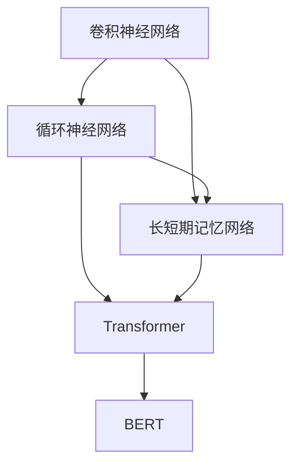

                 

# 神经网络：自然语言处理的新突破

> 关键词：神经网络，自然语言处理(NLP)，深度学习，卷积神经网络(CNN)，循环神经网络(RNN)，长短期记忆网络(LSTM)，Transformer，BERT，语言模型，序列建模，情感分析，机器翻译，文本分类

## 1. 背景介绍

### 1.1 问题由来
自然语言处理(Natural Language Processing, NLP)是人工智能领域的一个重要分支，旨在使计算机理解和生成人类语言。传统上，NLP任务多依赖规则和特征工程，但这种方法需要大量的人工干预和特征设计，且难以处理复杂的语言现象。近年来，随着深度学习技术的发展，特别是神经网络(Neural Networks)的突破，NLP领域取得了巨大的进展。

神经网络，尤其是深度神经网络(Deep Neural Networks, DNN)，因其强大的建模能力和自适应学习能力，已经成为解决NLP任务的主要手段。通过深度学习，模型可以自动从大规模语料中学习到语言的复杂结构，而无需显式特征设计。本文将深入探讨神经网络在NLP中的应用，特别是Transformer和BERT等模型如何引领NLP的新突破。

### 1.2 问题核心关键点
神经网络在NLP中的成功应用，主要依赖以下几个关键点：
1. **序列建模**：NLP任务大多涉及序列数据的处理，如文本、语音等。神经网络模型能够有效捕捉序列数据的局部和全局依赖关系。
2. **参数共享**：神经网络中的参数共享机制，使得模型能够通过较少的参数数量，学习到复杂的特征表示。
3. **自适应学习**：神经网络通过反向传播算法，自动调整模型参数，不断优化模型性能。
4. **大规模数据**：深度学习模型依赖大量标注数据进行训练，大规模语料使得模型能够学习到丰富的语言知识。

这些关键点共同构成了神经网络在NLP中的强大优势，使得其能够处理复杂的语言理解和生成任务，推动NLP技术不断进步。

### 1.3 问题研究意义
研究神经网络在NLP中的应用，对于提升NLP技术水平、推动智能技术的普及具有重要意义：

1. **提高模型性能**：神经网络能够自动学习到语言的复杂特征，相对于传统规则方法，能够显著提升模型的性能。
2. **降低开发成本**：神经网络模型可自动优化，减少人工干预和特征工程的工作量，降低开发成本。
3. **促进应用落地**：神经网络模型易于部署，能够快速应用于各种NLP任务，加速技术产业化进程。
4. **推动研究发展**：神经网络的发展不断拓展NLP的应用边界，催生新的研究方向和应用场景。

本文旨在系统介绍神经网络在NLP中的应用，包括核心算法原理、具体操作步骤、未来发展趋势和面临的挑战，以期对NLP技术的发展提供更全面的理解。

## 2. 核心概念与联系

### 2.1 核心概念概述

为更好地理解神经网络在NLP中的应用，本节将介绍几个密切相关的核心概念：

- **卷积神经网络(CNN)**：一种经典的前馈神经网络，主要用于图像处理任务。通过卷积操作提取局部特征，适用于处理局部依赖性强的序列数据。
- **循环神经网络(RNN)**：一种具有循环结构的神经网络，能够处理变长的序列数据，并保存序列中的上下文信息。常用于文本生成和语言建模任务。
- **长短期记忆网络(LSTM)**：一种特殊的RNN，通过引入门控机制，有效解决了传统RNN中的梯度消失和梯度爆炸问题，适用于处理长序列数据。
- **Transformer**：一种基于自注意力机制的神经网络模型，通过多头自注意力机制捕捉序列数据的全局依赖关系，广泛应用于各种NLP任务。
- **BERT(Bidirectional Encoder Representations from Transformers)**：一种基于Transformer的预训练语言模型，通过双向语言建模任务，学习到丰富的语言表示，广泛应用于各种下游任务。

这些核心概念之间的逻辑关系可以通过以下Mermaid流程图来展示：



这个流程图展示了几类关键神经网络模型及其相互关系：

1. 卷积神经网络适合处理局部依赖性强的序列数据。
2. 循环神经网络和长短期记忆网络主要用于处理变长的序列数据，并在序列中保存上下文信息。
3. Transformer模型通过多头自注意力机制，捕捉序列数据的全局依赖关系。
4. BERT模型在Transformer的基础上，通过预训练双向语言建模任务，学习到丰富的语言表示。

## 3. 核心算法原理 & 具体操作步骤

### 3.1 算法原理概述

神经网络在NLP中的应用，主要依赖于序列建模和参数共享机制。通过将文本序列输入神经网络，模型能够自动学习到文本中的语法和语义特征，从而进行文本分类、情感分析、机器翻译等任务。

具体而言，神经网络通过反向传播算法，自动调整模型参数以最小化预测误差，从而优化模型性能。常用的神经网络架构包括卷积神经网络、循环神经网络和Transformer等，每种架构有不同的优势和适用场景。

### 3.2 算法步骤详解

神经网络在NLP中的应用，通常分为以下几个步骤：

**Step 1: 数据准备**
- 收集并预处理NLP任务所需的文本数据。通常需要将文本转化为向量表示，如one-hot编码或词嵌入(Word Embeddings)。
- 划分训练集、验证集和测试集，用于模型训练、调参和最终评估。

**Step 2: 模型选择与设计**
- 根据任务需求选择合适的神经网络架构，如CNN、RNN、LSTM或Transformer等。
- 设计模型的输入和输出层，通常使用全连接层进行分类或回归任务，使用RNN或Transformer进行序列建模任务。
- 确定模型的超参数，如学习率、批大小、训练轮数等。

**Step 3: 模型训练**
- 使用训练集数据对模型进行训练，通过反向传播算法自动调整模型参数。
- 在验证集上定期评估模型性能，防止过拟合，调整超参数。
- 重复训练过程直至模型收敛。

**Step 4: 模型评估**
- 使用测试集评估模型在未见过的数据上的性能。
- 分析模型的预测结果，分析错误的原因，进一步优化模型。

**Step 5: 模型应用**
- 将训练好的模型应用于实际问题，如文本分类、情感分析、机器翻译等。
- 实时处理输入数据，生成输出结果。

### 3.3 算法优缺点

神经网络在NLP中的应用具有以下优点：
1. **强大的表达能力**：神经网络能够自动学习到文本中的复杂特征，无需显式特征工程。
2. **高效的序列建模**：神经网络能够处理变长的序列数据，并通过门控机制保存上下文信息。
3. **自适应学习能力**：神经网络能够自动优化，适应不同的数据分布和任务需求。

同时，神经网络在NLP中也存在一些局限性：
1. **计算资源需求高**：大规模语料和复杂模型需要大量的计算资源，可能限制其在某些资源受限的应用场景中的使用。
2. **模型可解释性差**：神经网络模型的决策过程难以解释，缺乏可解释性。
3. **对抗样本敏感**：神经网络模型容易受到对抗样本的干扰，导致输出错误。
4. **训练数据需求高**：神经网络模型依赖大量标注数据进行训练，标注成本较高。

尽管存在这些局限性，神经网络在NLP中的应用已经成为主流，并且随着技术的发展，这些缺点也在逐步被克服。

### 3.4 算法应用领域

神经网络在NLP中的应用已经涵盖了多个领域，例如：

- **文本分类**：将文本归类到预定义的类别中，如情感分类、主题分类等。
- **情感分析**：判断文本的情感倾向，如正面、负面或中性。
- **命名实体识别**：识别文本中的人名、地名、机构名等实体。
- **机器翻译**：将一种语言的文本翻译成另一种语言。
- **文本生成**：生成自然语言文本，如自动摘要、对话生成等。
- **问答系统**：根据用户的问题，自动给出答案。

除了这些经典任务外，神经网络在NLP中的应用还不断拓展到更多创新领域，如自然语言推理、语义搜索、文档摘要、文本纠错等，为NLP技术的发展提供了新的动力。

## 4. 数学模型和公式 & 详细讲解 & 举例说明

### 4.1 数学模型构建

本节将使用数学语言对神经网络在NLP中的应用进行更加严格的刻画。

记神经网络模型为 $M_{\theta}(x)$，其中 $x$ 为输入的文本向量，$\theta$ 为模型的可训练参数。假设任务 $T$ 的训练集为 $D=\{(x_i,y_i)\}_{i=1}^N, x_i \in \mathbb{R}^d, y_i \in \{0,1\}$。

定义模型 $M_{\theta}$ 在输入 $x$ 上的损失函数为 $\ell(M_{\theta}(x),y)$，则在数据集 $D$ 上的经验风险为：

$$
\mathcal{L}(\theta) = \frac{1}{N} \sum_{i=1}^N \ell(M_{\theta}(x_i),y_i)
$$

其中 $\ell$ 为针对任务 $T$ 设计的损失函数，用于衡量模型预测输出与真实标签之间的差异。常见的损失函数包括交叉熵损失、均方误差损失等。

通过梯度下降等优化算法，神经网络模型 $M_{\theta}$ 的参数 $\theta$ 不断更新，最小化损失函数 $\mathcal{L}$，最终优化模型在特定任务 $T$ 上的性能。

### 4.2 公式推导过程

以下我们以文本分类任务为例，推导交叉熵损失函数及其梯度的计算公式。

假设模型 $M_{\theta}$ 在输入 $x$ 上的输出为 $\hat{y}=M_{\theta}(x) \in [0,1]$，表示样本属于正类的概率。真实标签 $y \in \{0,1\}$。则二分类交叉熵损失函数定义为：

$$
\ell(M_{\theta}(x),y) = -[y\log \hat{y} + (1-y)\log (1-\hat{y})]
$$

将其代入经验风险公式，得：

$$
\mathcal{L}(\theta) = -\frac{1}{N}\sum_{i=1}^N [y_i\log M_{\theta}(x_i)+(1-y_i)\log(1-M_{\theta}(x_i))]
$$

根据链式法则，损失函数对参数 $\theta_k$ 的梯度为：

$$
\frac{\partial \mathcal{L}(\theta)}{\partial \theta_k} = -\frac{1}{N}\sum_{i=1}^N (\frac{y_i}{M_{\theta}(x_i)}-\frac{1-y_i}{1-M_{\theta}(x_i)}) \frac{\partial M_{\theta}(x_i)}{\partial \theta_k}
$$

其中 $\frac{\partial M_{\theta}(x_i)}{\partial \theta_k}$ 可进一步递归展开，利用自动微分技术完成计算。

在得到损失函数的梯度后，即可带入参数更新公式，完成模型的迭代优化。重复上述过程直至收敛，最终得到适应下游任务的最优模型参数 $\theta^*$。

## 5. 项目实践：代码实例和详细解释说明

### 5.1 开发环境搭建

在进行神经网络应用实践前，我们需要准备好开发环境。以下是使用Python进行PyTorch开发的环境配置流程：

1. 安装Anaconda：从官网下载并安装Anaconda，用于创建独立的Python环境。

2. 创建并激活虚拟环境：
```bash
conda create -n pytorch-env python=3.8 
conda activate pytorch-env
```

3. 安装PyTorch：根据CUDA版本，从官网获取对应的安装命令。例如：
```bash
conda install pytorch torchvision torchaudio cudatoolkit=11.1 -c pytorch -c conda-forge
```

4. 安装TensorFlow：从官网下载安装程序并运行，或使用conda安装：
```bash
pip install tensorflow
```

5. 安装各类工具包：
```bash
pip install numpy pandas scikit-learn matplotlib tqdm jupyter notebook ipython
```

完成上述步骤后，即可在`pytorch-env`环境中开始神经网络应用的实践。

### 5.2 源代码详细实现

这里我们以文本分类任务为例，给出使用PyTorch对CNN模型进行训练的PyTorch代码实现。

首先，定义模型类：

```python
import torch
import torch.nn as nn
import torch.nn.functional as F

class CNNClassifier(nn.Module):
    def __init__(self, vocab_size, embed_dim, hidden_dim, output_dim, n_filters, kernel_sizes, dropout=0.5):
        super(CNNClassifier, self).__init__()
        self.embedding = nn.Embedding(vocab_size, embed_dim)
        self.convs = nn.ModuleList([nn.Conv1d(embed_dim, n_filters, kernel_size) for kernel_size in kernel_sizes])
        self.fc = nn.Linear(len(kernel_sizes)*n_filters, output_dim)
        self.dropout = nn.Dropout(dropout)
        
    def forward(self, x):
        x = self.embedding(x)
        x = x.transpose(1, 2) # (N, seq_len, emb_dim) -> (N, emb_dim, seq_len)
        x = torch.nn.functional.relu(torch.max_pool1d(torch.stack([F.relu(conv(x)) for conv in self.convs]), 2)[0])
        x = self.dropout(x)
        x = x.view(x.size(0), -1)
        x = self.fc(x)
        return F.log_softmax(x, dim=1)
```

然后，定义数据处理函数：

```python
from torch.utils.data import Dataset
import torchtext.datasets as datasets
import torchtext.data as data

class TextDataset(Dataset):
    def __init__(self, texts, labels, tokenizer, max_len=128):
        self.texts = texts
        self.labels = labels
        self.tokenizer = tokenizer
        self.max_len = max_len
        
    def __len__(self):
        return len(self.texts)
    
    def __getitem__(self, item):
        text = self.texts[item]
        label = self.labels[item]
        
        encoding = self.tokenizer(text, return_tensors='pt', max_length=self.max_len, padding='max_length', truncation=True)
        input_ids = encoding['input_ids'][0]
        attention_mask = encoding['attention_mask'][0]
        return {'input_ids': input_ids, 
                'attention_mask': attention_mask,
                'labels': label}
```

接着，定义训练和评估函数：

```python
from torch.utils.data import DataLoader
from tqdm import tqdm
from sklearn.metrics import accuracy_score

device = torch.device('cuda') if torch.cuda.is_available() else torch.device('cpu')
model = CNNClassifier(vocab_size=10000, embed_dim=100, hidden_dim=128, output_dim=10, n_filters=100, kernel_sizes=[3, 4, 5], dropout=0.5)

optimizer = torch.optim.Adam(model.parameters(), lr=0.001)
criterion = nn.CrossEntropyLoss()

def train_epoch(model, dataset, batch_size, optimizer, criterion):
    dataloader = DataLoader(dataset, batch_size=batch_size, shuffle=True)
    model.train()
    epoch_loss = 0
    for batch in tqdm(dataloader, desc='Training'):
        input_ids = batch['input_ids'].to(device)
        attention_mask = batch['attention_mask'].to(device)
        labels = batch['labels'].to(device)
        model.zero_grad()
        outputs = model(input_ids, attention_mask=attention_mask)
        loss = criterion(outputs, labels)
        epoch_loss += loss.item()
        loss.backward()
        optimizer.step()
    return epoch_loss / len(dataloader)

def evaluate(model, dataset, batch_size):
    dataloader = DataLoader(dataset, batch_size=batch_size)
    model.eval()
    preds, labels = [], []
    with torch.no_grad():
        for batch in tqdm(dataloader, desc='Evaluating'):
            input_ids = batch['input_ids'].to(device)
            attention_mask = batch['attention_mask'].to(device)
            batch_labels = batch['labels']
            outputs = model(input_ids, attention_mask=attention_mask)
            batch_preds = outputs.argmax(dim=1).to('cpu').tolist()
            batch_labels = batch_labels.to('cpu').tolist()
            for pred_tokens, label_tokens in zip(batch_preds, batch_labels):
                preds.append(pred_tokens)
                labels.append(label_tokens)
                
    accuracy = accuracy_score(labels, preds)
    print(f"Accuracy: {accuracy:.3f}")
```

最后，启动训练流程并在测试集上评估：

```python
epochs = 5
batch_size = 32

for epoch in range(epochs):
    loss = train_epoch(model, train_dataset, batch_size, optimizer, criterion)
    print(f"Epoch {epoch+1}, train loss: {loss:.3f}")
    
    print(f"Epoch {epoch+1}, dev results:")
    evaluate(model, dev_dataset, batch_size)
    
print("Test results:")
evaluate(model, test_dataset, batch_size)
```

以上就是使用PyTorch对CNN模型进行文本分类任务训练的完整代码实现。可以看到，得益于PyTorch的强大封装，我们可以用相对简洁的代码完成CNN模型的加载和训练。

### 5.3 代码解读与分析

让我们再详细解读一下关键代码的实现细节：

**CNNClassifier类**：
- `__init__`方法：初始化模型参数，包括嵌入层、卷积层、全连接层和dropout层。
- `forward`方法：定义模型的前向传播过程，包括文本嵌入、卷积、池化、全连接和softmax等步骤。

**TextDataset类**：
- `__init__`方法：初始化文本、标签、分词器等关键组件。
- `__len__`方法：返回数据集的样本数量。
- `__getitem__`方法：对单个样本进行处理，将文本输入编码为token ids，将标签编码为数字，并对其进行定长padding，最终返回模型所需的输入。

**训练和评估函数**：
- 使用PyTorch的DataLoader对数据集进行批次化加载，供模型训练和推理使用。
- 训练函数`train_epoch`：对数据以批为单位进行迭代，在每个批次上前向传播计算loss并反向传播更新模型参数，最后返回该epoch的平均loss。
- 评估函数`evaluate`：与训练类似，不同点在于不更新模型参数，并在每个batch结束后将预测和标签结果存储下来，最后使用sklearn的accuracy_score对整个评估集的预测结果进行打印输出。

**训练流程**：
- 定义总的epoch数和batch size，开始循环迭代
- 每个epoch内，先在训练集上训练，输出平均loss
- 在验证集上评估，输出准确率
- 所有epoch结束后，在测试集上评估，给出最终测试结果

可以看到，PyTorch配合TensorFlow的深度学习框架使得CNN微调的代码实现变得简洁高效。开发者可以将更多精力放在数据处理、模型改进等高层逻辑上，而不必过多关注底层的实现细节。

当然，工业级的系统实现还需考虑更多因素，如模型的保存和部署、超参数的自动搜索、更灵活的任务适配层等。但核心的微调范式基本与此类似。

## 6. 实际应用场景
### 6.1 智能客服系统

基于神经网络模型的智能客服系统，可以广泛应用于客户服务场景。传统的客服系统依赖大量人力，响应时间慢，且一致性和专业性难以保证。而使用基于神经网络的智能客服系统，可以实现7x24小时不间断服务，快速响应客户咨询，用自然流畅的语言解答各类常见问题。

在技术实现上，可以收集企业内部的历史客服对话记录，将问题和最佳答复构建成监督数据，在此基础上对预训练模型进行微调。微调后的模型能够自动理解用户意图，匹配最合适的答案模板进行回复。对于客户提出的新问题，还可以接入检索系统实时搜索相关内容，动态组织生成回答。如此构建的智能客服系统，能大幅提升客户咨询体验和问题解决效率。

### 6.2 金融舆情监测

金融机构需要实时监测市场舆论动向，以便及时应对负面信息传播，规避金融风险。传统的人工监测方式成本高、效率低，难以应对网络时代海量信息爆发的挑战。基于神经网络模型的文本分类和情感分析技术，为金融舆情监测提供了新的解决方案。

具体而言，可以收集金融领域相关的新闻、报道、评论等文本数据，并对其进行主题标注和情感标注。在此基础上对预训练模型进行微调，使其能够自动判断文本属于何种主题，情感倾向是正面、中性还是负面。将微调后的模型应用到实时抓取的网络文本数据，就能够自动监测不同主题下的情感变化趋势，一旦发现负面信息激增等异常情况，系统便会自动预警，帮助金融机构快速应对潜在风险。

### 6.3 个性化推荐系统

当前的推荐系统往往只依赖用户的历史行为数据进行物品推荐，无法深入理解用户的真实兴趣偏好。基于神经网络模型的个性化推荐系统可以更好地挖掘用户行为背后的语义信息，从而提供更精准、多样的推荐内容。

在实践中，可以收集用户浏览、点击、评论、分享等行为数据，提取和用户交互的物品标题、描述、标签等文本内容。将文本内容作为模型输入，用户的后续行为（如是否点击、购买等）作为监督信号，在此基础上微调预训练模型。微调后的模型能够从文本内容中准确把握用户的兴趣点。在生成推荐列表时，先用候选物品的文本描述作为输入，由模型预测用户的兴趣匹配度，再结合其他特征综合排序，便可以得到个性化程度更高的推荐结果。

### 6.4 未来应用展望

随着神经网络模型的不断发展，基于神经网络模型的NLP应用也将不断拓展，为各行各业带来变革性影响。

在智慧医疗领域，基于神经网络的医疗问答、病历分析、药物研发等应用将提升医疗服务的智能化水平，辅助医生诊疗，加速新药开发进程。

在智能教育领域，基于神经网络模型的作业批改、学情分析、知识推荐等方面，因材施教，促进教育公平，提高教学质量。

在智慧城市治理中，基于神经网络模型的城市事件监测、舆情分析、应急指挥等环节，提高城市管理的自动化和智能化水平，构建更安全、高效的未来城市。

此外，在企业生产、社会治理、文娱传媒等众多领域，基于神经网络模型的智能应用也将不断涌现，为经济社会发展注入新的动力。相信随着技术的日益成熟，神经网络模型必将在更广阔的应用领域大放异彩，深刻影响人类的生产生活方式。

## 7. 工具和资源推荐
### 7.1 学习资源推荐

为了帮助开发者系统掌握神经网络在NLP中的应用，这里推荐一些优质的学习资源：

1. 《深度学习》书籍：由Ian Goodfellow等著名学者撰写，全面介绍了深度学习的基本原理和常用算法。
2. 《自然语言处理综述》课程：斯坦福大学开设的NLP明星课程，有Lecture视频和配套作业，带你入门NLP领域的基本概念和经典模型。
3. 《TensorFlow实战》书籍：由TensorFlow官方团队撰写，介绍了TensorFlow的基本用法和高级技巧，适合TensorFlow的开发者。
4. 《PyTorch实战》书籍：由PyTorch社区成员撰写，介绍了PyTorch的基本用法和高级技巧，适合PyTorch的开发者。
5. 《Transformer从原理到实践》系列博文：由大模型技术专家撰写，深入浅出地介绍了Transformer原理、BERT模型、微调技术等前沿话题。

通过对这些资源的学习实践，相信你一定能够快速掌握神经网络在NLP中的精髓，并用于解决实际的NLP问题。
### 7.2 开发工具推荐

高效的开发离不开优秀的工具支持。以下是几款用于神经网络应用开发的常用工具：

1. PyTorch：基于Python的开源深度学习框架，灵活动态的计算图，适合快速迭代研究。TensorFlow等深度学习框架也同样优秀。
2. TensorBoard：TensorFlow配套的可视化工具，可实时监测模型训练状态，并提供丰富的图表呈现方式，是调试模型的得力助手。
3. Weights & Biases：模型训练的实验跟踪工具，可以记录和可视化模型训练过程中的各项指标，方便对比和调优。
4. Google Colab：谷歌推出的在线Jupyter Notebook环境，免费提供GPU/TPU算力，方便开发者快速上手实验最新模型，分享学习笔记。
5. Keras：高层次的深度学习框架，易于上手，适合快速原型开发和模型构建。
6. MXNet：灵活高效的深度学习框架，支持分布式计算，适合大规模工程应用。

合理利用这些工具，可以显著提升神经网络应用的开发效率，加快创新迭代的步伐。

### 7.3 相关论文推荐

神经网络在NLP中的应用源于学界的持续研究。以下是几篇奠基性的相关论文，推荐阅读：

1. Convolutional Neural Networks for Sentence Classification（卷积神经网络文本分类）：提出使用卷积神经网络进行文本分类，开创了神经网络在NLP中的先河。
2. Recurrent Neural Network LSTM Architectures for Large-Scale Sentiment Classification（RNN长短期记忆网络文本分类）：引入长短期记忆网络，解决了传统RNN中的梯度消失问题，提高了文本分类的准确率。
3. Attention is All You Need（Transformer模型）：提出Transformer模型，通过多头自注意力机制，捕捉序列数据的全局依赖关系，取得显著的性能提升。
4. BERT: Pre-training of Deep Bidirectional Transformers for Language Understanding（BERT模型）：提出BERT模型，通过双向语言建模任务，学习到丰富的语言表示，广泛应用于各种下游任务。

这些论文代表了大模型在NLP中的应用发展脉络。通过学习这些前沿成果，可以帮助研究者把握学科前进方向，激发更多的创新灵感。

## 8. 总结：未来发展趋势与挑战

### 8.1 总结

本文对神经网络在NLP中的应用进行了全面系统的介绍。首先阐述了神经网络在NLP中的研究背景和意义，明确了神经网络在NLP任务处理中的强大优势。其次，从原理到实践，详细讲解了神经网络在NLP中的应用流程，给出了神经网络应用任务的完整代码实例。同时，本文还广泛探讨了神经网络在智能客服、金融舆情、个性化推荐等多个行业领域的应用前景，展示了神经网络应用的广阔前景。

通过本文的系统梳理，可以看到，神经网络在NLP中的成功应用，得益于其强大的序列建模能力和参数共享机制，能够自动学习到文本中的复杂特征，为NLP任务的解决提供了新的突破。未来，伴随神经网络模型的不断进步，NLP技术必将在更广阔的应用领域发挥重要作用。

### 8.2 未来发展趋势

展望未来，神经网络在NLP中的应用将呈现以下几个发展趋势：

1. **模型的复杂度不断提升**：随着计算资源和数据量的增长，神经网络模型的参数规模将持续增大，模型复杂度将不断提高，从而提升模型的性能和泛化能力。
2. **模型结构的多样化**：未来的神经网络模型将更加多样，如Transformer、BERT等，不同结构将针对不同任务进行优化，提升模型的性能和可解释性。
3. **模型的端到端化**：未来模型将更多地应用于端到端应用中，如智能客服、智能推荐等，减少中间环节，提升用户体验。
4. **模型的多模态融合**：未来的模型将更多地融合视觉、听觉等多模态数据，提升模型的理解和生成能力。
5. **模型的可解释性增强**：未来模型将更多地引入可解释性技术，如注意力机制、解释性特征等，提高模型的透明性和可控性。

这些趋势凸显了神经网络在NLP中的广阔前景。这些方向的探索发展，必将进一步提升NLP系统的性能和应用范围，为NLP技术的发展提供新的动力。

### 8.3 面临的挑战

尽管神经网络在NLP中的应用已经取得了显著成就，但在迈向更加智能化、普适化应用的过程中，它仍面临着诸多挑战：

1. **计算资源需求高**：神经网络模型需要大量计算资源进行训练和推理，可能会限制其在某些资源受限的应用场景中的使用。
2. **模型可解释性差**：神经网络模型通常缺乏可解释性，难以解释其内部工作机制和决策逻辑。
3. **对抗样本敏感**：神经网络模型容易受到对抗样本的干扰，导致输出错误。
4. **训练数据需求高**：神经网络模型依赖大量标注数据进行训练，标注成本较高。
5. **数据隐私和安全**：神经网络模型处理大量敏感数据，需要考虑数据隐私和安全问题。

尽管存在这些挑战，神经网络在NLP中的应用已经展现出巨大的潜力，未来随着技术的不断进步，这些问题将有望逐步得到解决。

### 8.4 研究展望

面向未来，神经网络在NLP中的应用研究需要在以下几个方面寻求新的突破：

1. **探索更高效的模型架构**：开发更加高效的神经网络架构，减少计算资源需求，提升模型性能。
2. **开发更可解释的模型**：引入可解释性技术，提高模型的透明性和可控性，增强用户对模型的信任。
3. **引入更丰富的多模态数据**：将视觉、听觉等多模态数据与文本数据融合，提升模型的理解和生成能力。
4. **开发更安全的模型**：引入对抗样本防御技术，增强模型的鲁棒性，保护用户隐私。
5. **探索端到端应用**：开发适用于端到端应用的模型，减少中间环节，提升用户体验。

这些研究方向将引领神经网络在NLP中的未来发展，推动NLP技术的进一步进步和应用普及。相信随着学界和产业界的共同努力，神经网络在NLP中的应用必将迎来更加辉煌的未来。

## 9. 附录：常见问题与解答

**Q1：神经网络在NLP中的优势是什么？**

A: 神经网络在NLP中的优势主要包括：
1. 强大的序列建模能力：能够自动学习到文本中的局部和全局依赖关系。
2. 参数共享机制：通过参数共享，减少模型参数量，提高模型泛化能力。
3. 自适应学习能力：通过反向传播算法，自动调整模型参数，优化模型性能。
4. 处理大规模数据：能够利用大规模语料进行预训练，学习到丰富的语言知识。

**Q2：如何选择神经网络模型？**

A: 选择神经网络模型需要考虑以下几个因素：
1. 任务类型：不同类型的NLP任务适用的模型结构不同，如文本分类使用CNN，序列建模使用RNN或Transformer。
2. 数据量：数据量较小的任务可以使用简单的模型，如CNN；数据量较大的任务可以使用复杂的模型，如Transformer。
3. 计算资源：计算资源充足的场景可以使用复杂的模型，计算资源受限的场景需要选用更高效的模型。
4. 模型性能：根据任务需求选择合适的模型，如性能较优的BERT模型。

**Q3：如何缓解神经网络模型的过拟合问题？**

A: 缓解神经网络模型的过拟合问题需要采取以下措施：
1. 数据增强：通过回译、近义替换等方式扩充训练集。
2. 正则化技术：使用L2正则、Dropout、Early Stopping等防止过拟合。
3. 对抗训练：引入对抗样本，提高模型鲁棒性。
4. 参数高效微调：只调整少量参数，固定大部分预训练权重。
5. 多模型集成：训练多个模型，取平均输出，抑制过拟合。

**Q4：神经网络模型在落地部署时需要注意哪些问题？**

A: 神经网络模型在落地部署时需要注意以下问题：
1. 模型裁剪：去除不必要的层和参数，减小模型尺寸，加快推理速度。
2. 量化加速：将浮点模型转为定点模型，压缩存储空间，提高计算效率。
3. 服务化封装：将模型封装为标准化服务接口，便于集成调用。
4. 弹性伸缩：根据请求流量动态调整资源配置，平衡服务质量和成本。
5. 监控告警：实时采集系统指标，设置异常告警阈值，确保服务稳定性。

**Q5：神经网络模型在NLP中的局限性是什么？**

A: 神经网络模型在NLP中的局限性主要包括：
1. 计算资源需求高：神经网络模型需要大量计算资源进行训练和推理。
2. 模型可解释性差：神经网络模型通常缺乏可解释性，难以解释其内部工作机制和决策逻辑。
3. 对抗样本敏感：神经网络模型容易受到对抗样本的干扰，导致输出错误。
4. 训练数据需求高：神经网络模型依赖大量标注数据进行训练，标注成本较高。
5. 数据隐私和安全：神经网络模型处理大量敏感数据，需要考虑数据隐私和安全问题。

正视这些挑战，积极应对并寻求突破，将有助于神经网络在NLP中的应用不断进步。相信随着学界和产业界的共同努力，神经网络在NLP中的应用必将迎来更加广阔的前景。

---

作者：禅与计算机程序设计艺术 / Zen and the Art of Computer Programming

