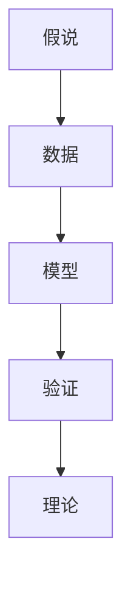

                 

# 科学发现：从假说到理论

> 关键词：科学发现,假说,理论,验证,人工智能,机器学习

## 1. 背景介绍

### 1.1 问题由来
科学发现的本质是从观察到假设，从假设到验证，从验证到理论的过程。这一过程不仅仅适用于自然科学，在计算机科学领域，特别是在人工智能（AI）和机器学习（ML）的发展中，也遵循这一规律。本文将探讨如何通过假说形成、验证和理论构建的科学方法论，来推进AI和ML领域的技术突破和创新。

### 1.2 问题核心关键点
科学发现的关键在于创新思维和严谨验证。在AI和ML中，这一过程体现为从数据驱动的假设提出，到模型验证，再到理论构建的全流程。这一流程中，假设的合理性、验证的严谨性、理论的普适性是决定科学发现质量的关键因素。

### 1.3 问题研究意义
在AI和ML领域，科学发现的应用直接关系到技术的创新能力和产业的竞争力。通过系统地学习和应用科学发现的方法论，AI和ML的研究人员可以更有效地提出新的理论和技术，推动AI和ML技术的进步，加速其在各行各业的应用。

## 2. 核心概念与联系

### 2.1 核心概念概述

在AI和ML领域，科学发现涉及以下几个核心概念：

- **假说**：基于已有知识和技术，对问题提出的一种可能的解释或解决方案。
- **验证**：通过实验或测试，检验假说的真实性和有效性。
- **理论**：经过验证和不断完善的假说，形成对问题系统性的理解和解释。
- **数据**：提供假说验证的基础，通过数据驱动的方式，验证假说的合理性。
- **模型**：用于实现假说，通过模型训练和优化，验证假说的有效性。

这些概念之间的联系可以通过以下Mermaid流程图来展示：



这个流程图展示了从假说到理论的全流程：首先基于已有知识提出假说，通过数据训练模型，验证模型的效果，最终形成系统的理论。

## 3. 核心算法原理 & 具体操作步骤
### 3.1 算法原理概述

在AI和ML领域，科学发现的过程可以概括为以下几个步骤：

1. **数据收集与预处理**：收集与问题相关的数据，并进行清洗和预处理。
2. **特征工程**：从原始数据中提取有意义的特征，供模型训练使用。
3. **模型选择与训练**：选择合适的模型架构和优化算法，对数据进行训练。
4. **模型验证与调整**：通过交叉验证等方法，评估模型性能，并进行必要的调整。
5. **理论构建与推广**：基于模型验证的结果，构建理论模型，并推广应用于更多场景。

### 3.2 算法步骤详解

**Step 1: 数据收集与预处理**

数据收集是科学发现的基础。在这个步骤中，我们需要收集与问题相关的数据，并对数据进行清洗和预处理，以确保数据的质量和一致性。

- **数据收集**：收集与问题相关的数据，如文本数据、图像数据、时间序列数据等。
- **数据清洗**：去除数据中的噪声和异常值，确保数据的一致性和完整性。
- **数据增强**：通过数据增强技术，扩充数据集，提高模型的泛化能力。

**Step 2: 特征工程**

特征工程是模型训练的关键。在这个步骤中，我们需要从原始数据中提取有意义的特征，供模型训练使用。

- **特征提取**：选择或设计合适的特征提取方法，如词袋模型、卷积神经网络（CNN）、循环神经网络（RNN）等。
- **特征选择**：从提取的特征中筛选出最具代表性的特征，去除冗余和无关特征。
- **特征变换**：对特征进行标准化、归一化、降维等操作，提升模型的训练效果。

**Step 3: 模型选择与训练**

模型选择和训练是科学发现的核心。在这个步骤中，我们需要选择合适的模型架构和优化算法，对数据进行训练。

- **模型选择**：根据问题的特点，选择合适的模型架构，如线性回归、逻辑回归、决策树、随机森林、神经网络等。
- **模型训练**：使用训练数据对模型进行训练，调整模型参数，优化模型性能。
- **模型评估**：通过交叉验证等方法，评估模型性能，选择最优模型。

**Step 4: 模型验证与调整**

模型验证和调整是科学发现的重要环节。在这个步骤中，我们需要通过验证数据验证模型的效果，并进行必要的调整。

- **模型验证**：使用验证数据集评估模型性能，如准确率、精确率、召回率、F1-score等。
- **模型调整**：根据验证结果，调整模型参数，优化模型性能。
- **模型集成**：通过集成多个模型，提升模型的整体性能。

**Step 5: 理论构建与推广**

理论构建与推广是科学发现的最终目标。在这个步骤中，我们需要基于模型验证的结果，构建理论模型，并推广应用于更多场景。

- **理论构建**：根据模型验证的结果，构建理论模型，形成系统的解释。
- **模型推广**：将构建的理论模型推广应用于其他数据集和场景，验证其普适性。
- **模型优化**：通过持续学习和优化，提升理论模型的性能和效果。

### 3.3 算法优缺点

科学发现的算法具有以下优点：

- **灵活性**：能够根据问题特点，灵活选择和调整模型架构和优化算法。
- **可解释性**：通过理论构建，使得模型具有可解释性，易于理解和应用。
- **泛化能力**：通过数据驱动的方式，模型具有较强的泛化能力，适用于不同场景。

同时，科学发现也存在以下局限性：

- **数据依赖**：模型的性能和效果高度依赖于数据的数量和质量。
- **计算资源**：模型训练和验证需要大量的计算资源，可能面临计算瓶颈。
- **模型复杂性**：模型复杂度高，可能存在局部最优解，不易找到全局最优解。
- **过度拟合**：在训练数据有限的情况下，模型可能出现过拟合现象。

尽管存在这些局限性，但科学发现仍是AI和ML领域最为基本和有效的方法论之一，其应用范围广泛，适用于多种类型的科学问题。

### 3.4 算法应用领域

科学发现方法在AI和ML领域的应用非常广泛，涵盖了以下主要领域：

- **自然语言处理（NLP）**：通过文本分类、情感分析、机器翻译等任务，构建语言模型和语义理解模型。
- **计算机视觉（CV）**：通过图像识别、目标检测、图像生成等任务，构建图像处理和理解模型。
- **语音识别（ASR）**：通过语音转文本、语音合成等任务，构建语音处理和理解模型。
- **强化学习（RL）**：通过智能决策、游戏智能、机器人控制等任务，构建决策和控制模型。
- **推荐系统**：通过用户行为预测、物品推荐等任务，构建推荐模型。

## 4. 数学模型和公式 & 详细讲解 & 举例说明（备注：数学公式请使用latex格式，latex嵌入文中独立段落使用 $$，段落内使用 $)
### 4.1 数学模型构建

在AI和ML领域，科学发现可以通过数学模型来描述和验证。以下是几个常见的数学模型：

- **线性回归模型**：$$y = \theta_0 + \theta_1 x_1 + \theta_2 x_2 + \cdots + \theta_n x_n$$
- **逻辑回归模型**：$$\text{logit}(y) = \theta_0 + \theta_1 x_1 + \theta_2 x_2 + \cdots + \theta_n x_n$$
- **决策树模型**：通过树形结构，对特征进行分割，最终输出分类结果。
- **神经网络模型**：通过多层非线性变换，构建复杂的特征映射关系。

### 4.2 公式推导过程

以线性回归模型为例，推导其公式和推导过程：

- **最小二乘法**：$$\hat{\theta} = \arg\min_{\theta} \frac{1}{2N} \sum_{i=1}^N (y_i - (\theta_0 + \theta_1 x_{1,i} + \theta_2 x_{2,i} + \cdots + \theta_n x_{n,i}))^2$$
- **梯度下降法**：$$\theta_j = \theta_j - \alpha \frac{1}{N} \sum_{i=1}^N (y_i - (\theta_0 + \theta_1 x_{1,i} + \theta_2 x_{2,i} + \cdots + \theta_n x_{n,i})) \cdot x_{j,i}$$

### 4.3 案例分析与讲解

以线性回归模型为例，分析其在现实中的应用和效果：

- **案例1：房价预测**：通过收集历史房价数据，使用线性回归模型预测新房产的价格。
- **案例2：股票价格预测**：通过收集历史股票价格数据，使用线性回归模型预测未来股票价格。
- **案例3：商品推荐**：通过收集用户购买历史数据，使用线性回归模型预测用户对商品的兴趣。

## 5. 项目实践：代码实例和详细解释说明
### 5.1 开发环境搭建

在进行科学发现项目实践前，我们需要准备好开发环境。以下是使用Python进行Scikit-learn开发的环境配置流程：

1. 安装Anaconda：从官网下载并安装Anaconda，用于创建独立的Python环境。

2. 创建并激活虚拟环境：
```bash
conda create -n sk-env python=3.8 
conda activate sk-env
```

3. 安装Scikit-learn：
```bash
pip install scikit-learn
```

4. 安装各类工具包：
```bash
pip install numpy pandas scikit-learn matplotlib tqdm jupyter notebook ipython
```

完成上述步骤后，即可在`sk-env`环境中开始科学发现实践。

### 5.2 源代码详细实现

这里我们以线性回归模型为例，给出使用Scikit-learn进行房价预测的代码实现。

首先，定义数据处理函数：

```python
from sklearn.model_selection import train_test_split
from sklearn.preprocessing import StandardScaler
from sklearn.linear_model import LinearRegression
from sklearn.metrics import mean_squared_error

def prepare_data(X, y):
    # 数据标准化
    scaler = StandardScaler()
    X_scaled = scaler.fit_transform(X)
    # 划分训练集和测试集
    X_train, X_test, y_train, y_test = train_test_split(X_scaled, y, test_size=0.2, random_state=42)
    # 返回标准化后的训练集和测试集
    return X_train, X_test, y_train, y_test
```

然后，定义模型训练函数：

```python
def train_model(X_train, y_train):
    # 初始化模型
    model = LinearRegression()
    # 训练模型
    model.fit(X_train, y_train)
    # 返回模型
    return model
```

接着，定义模型验证函数：

```python
def evaluate_model(model, X_test, y_test):
    # 预测测试集
    y_pred = model.predict(X_test)
    # 计算均方误差
    mse = mean_squared_error(y_test, y_pred)
    # 返回均方误差
    return mse
```

最后，启动训练流程并在测试集上评估：

```python
from sklearn.datasets import load_boston

# 加载波士顿房价数据
data = load_boston()
X, y = data.data, data.target

# 数据预处理
X_train, X_test, y_train, y_test = prepare_data(X, y)

# 模型训练
model = train_model(X_train, y_train)

# 模型验证
mse = evaluate_model(model, X_test, y_test)
print(f"均方误差：{mse:.2f}")
```

以上就是使用Scikit-learn对线性回归模型进行房价预测的完整代码实现。可以看到，得益于Scikit-learn的强大封装，我们可以用相对简洁的代码完成模型的训练和评估。

### 5.3 代码解读与分析

让我们再详细解读一下关键代码的实现细节：

**prepare_data函数**：
- 对数据进行标准化，消除不同特征之间的量级差异。
- 使用train_test_split函数将数据集划分训练集和测试集，保持数据集的随机性。

**train_model函数**：
- 使用LinearRegression模型对训练数据进行训练，得到模型对象。
- 训练过程中，模型会根据损失函数最小化目标，自动调整模型参数。

**evaluate_model函数**：
- 使用训练好的模型对测试数据进行预测，计算均方误差。
- 均方误差是评估回归模型性能的常用指标，反映了模型预测值与真实值之间的差异。

**启动训练流程**：
- 从波士顿房价数据集中加载数据。
- 数据预处理，使用prepare_data函数标准化数据并划分训练集和测试集。
- 使用train_model函数训练线性回归模型。
- 使用evaluate_model函数评估模型性能，输出均方误差。

可以看到，Scikit-learn提供了完整的机器学习工具链，从数据预处理、模型训练到模型评估，开发者可以非常方便地进行科学发现项目实践。

## 6. 实际应用场景
### 6.1 金融风险评估

在金融领域，科学发现方法可以用于风险评估和信用评分。通过收集客户的财务数据和行为数据，构建机器学习模型，预测客户的信用风险和违约概率。

具体而言，可以收集客户的收入、债务、信用历史等数据，使用线性回归或决策树模型，预测客户的违约概率。通过持续收集客户数据，不断优化模型，可以更准确地评估客户的信用风险。

### 6.2 医疗诊断

在医疗领域，科学发现方法可以用于疾病诊断和治疗方案推荐。通过收集患者的症状、病历、基因数据等，构建机器学习模型，预测患者的疾病类型和推荐治疗方案。

具体而言，可以收集患者的症状描述、病历记录、基因测序数据，使用深度学习模型，预测患者的疾病类型和推荐治疗方案。通过不断积累患者数据，优化模型，可以更准确地预测患者的疾病类型和推荐治疗方案。

### 6.3 智能推荐系统

在电子商务领域，科学发现方法可以用于商品推荐和用户画像构建。通过收集用户的历史行为数据，构建机器学习模型，预测用户对商品的兴趣和需求。

具体而言，可以收集用户的历史购买记录、浏览记录、搜索记录等数据，使用协同过滤或内容推荐模型，预测用户对商品的兴趣和需求。通过不断优化模型，可以更准确地推荐商品，提升用户体验和满意度。

### 6.4 未来应用展望

随着科学发现方法的不断演进，其在AI和ML领域的应用将更加广泛和深入。未来，科学发现方法将在以下几个方面得到更多应用：

- **多模态数据融合**：将文本、图像、语音等不同模态的数据融合，构建更加全面和准确的模型。
- **模型集成与优化**：通过模型集成和优化技术，构建更加鲁棒和高效的模型。
- **知识图谱构建**：将符号化的先验知识与机器学习模型结合，构建知识图谱，提升模型的理解能力。
- **分布式计算**：利用分布式计算技术，加速模型训练和推理，处理大规模数据集。

科学发现方法的应用前景广阔，将在各个领域为AI和ML技术带来新的突破和创新。

## 7. 工具和资源推荐
### 7.1 学习资源推荐

为了帮助开发者系统掌握科学发现的方法论，这里推荐一些优质的学习资源：

1. 《机器学习》课程：斯坦福大学开设的机器学习课程，提供了详尽的理论知识和实践技巧。

2. 《深度学习》书籍：深度学习领域的经典教材，涵盖了从基础到高级的深度学习技术。

3. 《Python数据科学手册》书籍：介绍Python在数据科学中的应用，包含大量代码示例和案例分析。

4. Kaggle竞赛：全球最大的数据科学竞赛平台，提供了丰富的数据集和竞赛任务，锻炼实战能力。

5. Coursera平台：提供了多门机器学习和深度学习的课程，包括课程讲义、视频讲座和实践项目。

通过学习这些资源，相信你一定能够掌握科学发现的方法论，并应用于实际问题解决。

### 7.2 开发工具推荐

高效的开发离不开优秀的工具支持。以下是几款用于科学发现开发的常用工具：

1. Python：灵活的动态语言，适合快速迭代研究。大部分机器学习库和框架都基于Python开发。

2. R：专门用于统计分析和机器学习的语言，拥有丰富的数据处理和建模库。

3. Scikit-learn：基于Python的机器学习库，提供了丰富的算法和模型实现，适合快速原型开发。

4. TensorFlow：由Google主导开发的深度学习框架，生产部署方便，适合大规模工程应用。

5. PyTorch：基于Python的深度学习框架，灵活动态的计算图，适合快速研究。

6. Weights & Biases：模型训练的实验跟踪工具，可以记录和可视化模型训练过程中的各项指标，方便对比和调优。

合理利用这些工具，可以显著提升科学发现项目的开发效率，加快创新迭代的步伐。

### 7.3 相关论文推荐

科学发现方法在AI和ML领域的发展依赖于持续的研究和创新。以下是几篇奠基性的相关论文，推荐阅读：

1. 《机器学习》：Tom Mitchell著，涵盖了机器学习的基础理论和应用实践。

2. 《深度学习》：Ian Goodfellow、Yoshua Bengio、Aaron Courville著，深度学习领域的经典教材。

3. 《TensorFlow: A System for Large-Scale Machine Learning》：由TensorFlow团队编写的技术报告，介绍了TensorFlow的设计理念和实现细节。

4. 《A Survey on Transfer Learning》：Lakshmiya、Nakal、Harman等人的综述论文，总结了各类转移学习方法和应用。

5. 《A Brief History of Artificial Intelligence》：John McCarthy的论文，回顾了人工智能的发展历程和前沿技术。

这些论文代表了大数据和机器学习领域的研究进展，通过学习这些前沿成果，可以帮助研究者把握学科前进方向，激发更多的创新灵感。

## 8. 总结：未来发展趋势与挑战
### 8.1 研究成果总结

本文对科学发现的方法论进行了系统介绍，涵盖了从假说到理论的全流程。通过深入分析，揭示了科学发现的关键环节和步骤，帮助读者理解科学发现的基本原理和应用方法。

### 8.2 未来发展趋势

展望未来，科学发现的方法论将在以下几个方面得到进一步发展：

1. **自动化**：通过自动化技术，简化科学发现的过程，降低人工干预的难度。
2. **多模态**：将文本、图像、语音等不同模态的数据融合，构建更加全面和准确的模型。
3. **迁移学习**：通过迁移学习技术，提升模型在多场景下的适应能力。
4. **模型压缩**：通过模型压缩技术，提高模型的计算效率和推理速度。
5. **分布式计算**：利用分布式计算技术，处理大规模数据集，加速模型训练和推理。

这些趋势将推动科学发现方法论的进步，为AI和ML技术带来新的突破和创新。

### 8.3 面临的挑战

尽管科学发现的方法论在AI和ML领域得到了广泛应用，但在实现科学发现的过程中，仍面临诸多挑战：

1. **数据质量**：科学发现的效果高度依赖于数据的质量和数量，如何获取高质量的数据是关键问题。
2. **计算资源**：科学发现通常需要大量的计算资源，如何优化计算资源的使用是重要挑战。
3. **模型复杂性**：科学发现模型通常较为复杂，如何简化模型结构和优化模型性能是关键问题。
4. **可解释性**：科学发现模型的决策过程缺乏可解释性，如何增强模型的可解释性和可审计性是重要问题。
5. **安全性**：科学发现模型可能存在安全漏洞，如何保障模型和数据的安全性是重要问题。

这些挑战需要研究者不断探索和创新，才能推动科学发现方法论的进步。

### 8.4 研究展望

未来，科学发现方法论需要在以下几个方面进行深入研究：

1. **自动化技术**：开发更加自动化和智能化的科学发现工具，降低人工干预的难度。
2. **多模态数据融合**：将文本、图像、语音等不同模态的数据融合，构建更加全面和准确的模型。
3. **模型压缩与优化**：开发更加高效和轻量化的模型压缩和优化方法，提升模型的计算效率和推理速度。
4. **模型可解释性**：开发更加可解释和可审计的科学发现模型，增强模型的透明性和可信度。
5. **模型安全性**：开发更加安全可靠的多模态科学发现模型，保障模型和数据的安全性。

这些研究方向将推动科学发现方法论的进步，为AI和ML技术带来新的突破和创新。

## 9. 附录：常见问题与解答
### 9.1 问题与解答

本文对科学发现的方法论进行了系统介绍，以下是一些常见问题的解答：

**Q1: 科学发现的过程如何确保数据的公平性和可信度？**

A: 科学发现过程需要保证数据的质量和可靠性。可以通过以下方式确保数据的公平性和可信度：

1. **数据来源**：选择权威和可信的数据来源，避免数据污染和失真。
2. **数据清洗**：对数据进行清洗和预处理，去除噪声和异常值，确保数据的一致性和完整性。
3. **数据标注**：对数据进行标注和验证，确保标注的准确性和一致性。
4. **数据共享**：采用开放数据共享和标准化数据格式，提高数据的可复用性和可靠性。

**Q2: 科学发现过程如何处理数据缺失和噪声？**

A: 数据缺失和噪声是科学发现过程中常见的问题，可以通过以下方式进行处理：

1. **数据补全**：使用插值、均值填充等方法，补全缺失数据。
2. **数据清洗**：使用统计方法和异常检测技术，清洗噪声数据。
3. **数据增强**：通过数据增强技术，扩充数据集，提高模型的泛化能力。
4. **数据转换**：对数据进行标准化和归一化处理，提升模型的训练效果。

**Q3: 科学发现过程如何避免过拟合现象？**

A: 过拟合是科学发现过程中常见的问题，可以通过以下方式避免：

1. **数据增强**：通过数据增强技术，扩充数据集，提高模型的泛化能力。
2. **正则化**：使用L2正则、Dropout等正则化技术，避免模型过拟合。
3. **模型集成**：通过模型集成技术，构建更加鲁棒和稳定的模型。
4. **交叉验证**：使用交叉验证技术，评估模型的泛化性能。

**Q4: 科学发现过程中如何选择合适的模型？**

A: 选择合适的模型是科学发现过程的关键。可以通过以下方式进行选择：

1. **任务类型**：根据任务类型选择适合的模型，如回归任务选择线性回归模型，分类任务选择逻辑回归模型，图像任务选择卷积神经网络模型等。
2. **数据特点**：根据数据特点选择适合的模型，如高维数据选择降维模型，小样本数据选择参数高效模型等。
3. **模型复杂度**：根据模型复杂度和计算资源选择适合的模型，如计算资源有限选择轻量级模型，计算资源充足选择复杂模型。

**Q5: 科学发现过程中如何评估模型性能？**

A: 评估模型性能是科学发现过程中的重要环节。可以通过以下方式进行评估：

1. **交叉验证**：使用交叉验证技术，评估模型的泛化性能。
2. **均方误差**：用于回归任务，计算模型预测值与真实值之间的差异。
3. **准确率、精确率、召回率、F1-score**：用于分类任务，评估模型的分类性能。
4. **ROC曲线、AUC值**：用于二分类任务，评估模型的分类性能。

**Q6: 科学发现过程中如何构建理论模型？**

A: 构建理论模型是科学发现过程的最终目标。可以通过以下方式进行构建：

1. **模型验证**：通过大量实验和验证，评估模型的泛化性能和稳定性。
2. **理论构建**：根据模型的验证结果，构建理论模型，形成系统的解释。
3. **模型优化**：通过持续学习和优化，提升模型的性能和效果。

通过以上问题和解答，相信你一定能够更好地理解科学发现的方法论，并将其应用于实际问题解决。

---

作者：禅与计算机程序设计艺术 / Zen and the Art of Computer Programming

