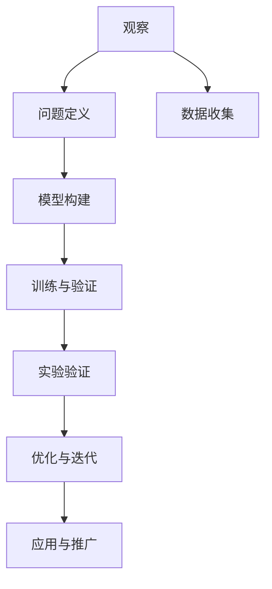

                 

# 科学方法：从观察到实验

> 关键词：科学方法, 观察, 实验, 验证, 数据, 统计, 算法, 模型, 预测, 应用

## 1. 背景介绍

### 1.1 问题由来

科学研究是人类文明进步的基石。从古代的农耕观察到现代的基因工程，科学的探索从未停止。在数据驱动的今天，科学方法的核心在于通过数据观察和实验验证，寻找潜在的规律和模式，驱动创新和变革。

在计算机科学领域，算法和模型是我们解决问题的工具。然而，如何通过科学的方法，构建有效的算法和模型，并应用于实际问题中，是每个研究者、工程师必须面对的挑战。本文将从科学方法的视角出发，探讨从观察到实验的完整流程，希望能为读者提供深入的理解和借鉴。

### 1.2 问题核心关键点

科学方法的核心步骤包括：

1. **观察与问题定义**：通过观察现实世界现象，定义明确的问题和假设。
2. **数据收集与处理**：获取高质量数据，并通过预处理和特征工程提升数据质量。
3. **模型构建与训练**：选择合适的模型，进行训练和验证。
4. **实验验证与优化**：在实验数据上验证模型效果，并通过优化提升模型表现。
5. **应用与推广**：将模型应用于实际问题中，并进行效果评估和推广。

## 2. 核心概念与联系

### 2.1 核心概念概述

为了更好地理解科学方法，本节将介绍几个密切相关的核心概念：

- **观察(Observation)**：通过直接感知或实验手段获取的现象和数据。
- **问题定义(Problem Definition)**：基于观察结果，明确需要解决的问题和目标。
- **数据收集(Data Collection)**：获取高质量的训练数据，是科学实验的基础。
- **模型构建(Model Construction)**：选择合适的模型架构，构建算法。
- **训练与验证(Training and Validation)**：在数据集上训练模型，并使用验证集评估模型效果。
- **实验验证(Experiment Validation)**：在独立数据集上验证模型的泛化能力。
- **优化与迭代(Optimization and Iteration)**：根据实验结果，优化模型和算法。
- **应用与推广(Adaptation and Scaling)**：将模型应用于实际问题，并在更大规模数据上推广应用。

这些概念之间的逻辑关系可以通过以下Mermaid流程图来展示：



这个流程图展示了科学方法的主要步骤：

1. 观察获取现象。
2. 定义明确问题。
3. 收集相关数据。
4. 构建模型框架。
5. 训练和验证模型。
6. 进行实验验证。
7. 优化和迭代改进。
8. 推广到实际应用。

## 3. 核心算法原理 & 具体操作步骤
### 3.1 算法原理概述

科学方法中的模型构建和训练，本质上是基于数据驱动的算法和模型学习。其核心思想是：通过大量观察数据，构建一个能解释这些数据的模型，并在新数据上进行验证和优化，以泛化到未知数据集。

形式化地，假设观察到的数据集为 $D=\{(x_i, y_i)\}_{i=1}^N$，其中 $x_i$ 为输入，$y_i$ 为输出。我们的目标是通过训练，找到一个模型 $M$，使得 $M(x)$ 能够准确预测 $y$。这通常通过最小化预测误差来实现：

$$
\min_{M} \sum_{i=1}^N \ell(M(x_i), y_i)
$$

其中 $\ell$ 为损失函数，表示预测值与真实值之间的差异。常见的损失函数包括均方误差损失（回归任务）、交叉熵损失（分类任务）等。

### 3.2 算法步骤详解

科学方法中的模型构建和训练，通常包括以下几个关键步骤：

**Step 1: 问题定义与数据收集**
- 定义具体的问题和目标，如分类、回归、聚类等。
- 收集相关的数据集，并预处理为模型所需格式，如去噪、归一化、特征选择等。

**Step 2: 模型选择与初始化**
- 选择合适的模型架构，如线性回归、决策树、神经网络等。
- 初始化模型参数，如权重、偏置等。

**Step 3: 训练与验证**
- 使用训练集数据 $D_{train}$ 训练模型 $M$，最小化损失函数。
- 使用验证集数据 $D_{val}$ 评估模型性能，调整模型超参数。

**Step 4: 实验验证**
- 使用独立的测试集数据 $D_{test}$ 验证模型泛化能力，评估最终性能。
- 根据实验结果，优化模型架构和参数。

**Step 5: 应用与推广**
- 将优化后的模型应用于实际问题中，进行效果评估。
- 在更大规模数据上推广应用，不断迭代优化。

### 3.3 算法优缺点

科学方法中的模型构建和训练，具有以下优点：

1. **数据驱动**：模型构建和训练过程基于大量数据，能够发现数据的潜藏模式和规律。
2. **泛化能力强**：通过验证集和测试集的评估，模型在未知数据上也能保持良好表现。
3. **自动化优化**：利用自动化的训练流程，能够快速迭代优化模型性能。

同时，该方法也存在一定的局限性：

1. **模型依赖**：模型的选择和优化需要经验和专业知识，对研究者的水平要求较高。
2. **过拟合风险**：在训练集上过拟合的模型，可能在新数据上泛化能力不足。
3. **计算资源消耗大**：大规模数据集和复杂模型的训练，需要大量计算资源。
4. **模型解释性差**：复杂模型往往难以解释其内部工作机制和决策逻辑。

尽管存在这些局限性，但就目前而言，数据驱动的模型训练是科学研究中应用最广泛、效果最好的方法。未来相关研究的方向在于如何进一步提高模型解释性和泛化能力，同时降低计算资源消耗，提高模型的自动化水平。

### 3.4 算法应用领域

基于科学方法的模型构建和训练，在各个领域中都有广泛应用，例如：

- **机器学习**：通过数据驱动的算法，训练各种类型的模型，如线性回归、决策树、随机森林、神经网络等，解决分类、回归、聚类等问题。
- **自然语言处理**：构建基于深度学习的语言模型，进行文本分类、情感分析、机器翻译等任务。
- **计算机视觉**：使用卷积神经网络（CNN）等模型，进行图像分类、目标检测、图像生成等任务。
- **推荐系统**：构建基于协同过滤、内容推荐等算法的推荐模型，提升用户个性化推荐体验。
- **金融分析**：利用机器学习模型，进行市场预测、风险评估、欺诈检测等金融应用。
- **医疗健康**：构建基于深度学习的医疗诊断模型，辅助医生进行疾病诊断、治疗方案推荐等。

除了上述这些经典应用外，科学方法在更多前沿领域中也得到了广泛应用，如自动驾驶、智能制造、社交网络分析等，为各行各业带来了新的突破。随着数据量的增长和计算能力的提升，科学方法在各个领域的落地应用前景广阔。

## 4. 数学模型和公式 & 详细讲解 & 举例说明

### 4.1 数学模型构建

本节将使用数学语言对科学方法中的模型训练过程进行更加严格的刻画。

假设我们有一个回归问题，数据集为 $D=\{(x_i, y_i)\}_{i=1}^N$，其中 $x_i$ 为输入特征，$y_i$ 为输出标签。我们的目标是通过训练，找到一个线性回归模型 $M(x)=\theta^T x + b$，使得模型预测值与真实值尽可能接近。

我们定义损失函数为均方误差损失：

$$
\ell(M(x), y) = (M(x) - y)^2
$$

训练目标是最小化预测误差，即：

$$
\min_{\theta, b} \sum_{i=1}^N \ell(M(x_i), y_i)
$$

### 4.2 公式推导过程

以下是线性回归模型的训练过程推导：

1. **损失函数**：

$$
\ell(\theta, b; x_i, y_i) = (M(x_i) - y_i)^2 = (\theta^T x_i + b - y_i)^2
$$

2. **梯度**：

$$
\frac{\partial \ell}{\partial \theta} = -2(x_i^T y_i - \theta^T x_i)
$$

$$
\frac{\partial \ell}{\partial b} = -2(y_i - \theta^T x_i)
$$

3. **梯度下降更新**：

$$
\theta_{new} = \theta - \eta \frac{\partial \ell}{\partial \theta}
$$

$$
b_{new} = b - \eta \frac{\partial \ell}{\partial b}
$$

其中 $\eta$ 为学习率，控制每次迭代更新的步长。

4. **随机梯度下降**：

在实际应用中，通常使用随机梯度下降（SGD）来更新参数。每个样本的梯度计算方式为：

$$
\frac{\partial \ell}{\partial \theta_i} = -2(x_i^T y_i - \theta^T x_i) x_i
$$

5. **批量梯度下降**：

在内存资源允许的情况下，也可以采用批量梯度下降，计算整个数据集的梯度：

$$
\frac{\partial \ell}{\partial \theta_i} = -2\frac{1}{N} \sum_{j=1}^N (y_j - \theta^T x_j) x_{i,j}
$$

6. **参数初始化**：

为了避免梯度消失或爆炸，通常需要对模型参数进行适当的初始化。如使用Xavier初始化，将每个层的权重初始化为 $U(\mathcal{N}(0, \frac{2}{n+1})$，其中 $n$ 为前一层神经元数量。

### 4.3 案例分析与讲解

下面以一个简单的线性回归为例，展示如何使用Python和Scikit-learn实现模型训练：

```python
from sklearn.linear_model import LinearRegression
import numpy as np

# 创建数据集
X = np.array([[1, 2, 3], [4, 5, 6], [7, 8, 9]])
y = np.array([2, 4, 6])

# 初始化模型
model = LinearRegression()

# 训练模型
model.fit(X, y)

# 预测
y_pred = model.predict(X)

# 输出模型系数和截距
print(model.coef_)
print(model.intercept_)
```

在这个例子中，我们使用Scikit-learn库中的LinearRegression模型，通过数据集 $X$ 和 $y$ 进行线性回归训练。模型训练后，我们得到模型的系数和截距，并使用模型进行预测。

## 5. 项目实践：代码实例和详细解释说明
### 5.1 开发环境搭建

在进行科学方法模型训练的实践前，我们需要准备好开发环境。以下是使用Python进行Scikit-learn开发的环境配置流程：

1. 安装Anaconda：从官网下载并安装Anaconda，用于创建独立的Python环境。

2. 创建并激活虚拟环境：
```bash
conda create -n sklearn-env python=3.8 
conda activate sklearn-env
```

3. 安装Scikit-learn：
```bash
conda install scikit-learn
```

4. 安装各类工具包：
```bash
pip install numpy pandas scikit-learn matplotlib tqdm jupyter notebook ipython
```

完成上述步骤后，即可在`sklearn-env`环境中开始模型训练实践。

### 5.2 源代码详细实现

下面我们以线性回归为例，给出使用Scikit-learn进行模型训练的PyTorch代码实现。

首先，定义数据处理函数：

```python
import numpy as np
from sklearn.linear_model import LinearRegression

def load_data():
    X = np.array([[1, 2, 3], [4, 5, 6], [7, 8, 9]])
    y = np.array([2, 4, 6])
    return X, y
```

然后，定义模型和优化器：

```python
from sklearn.linear_model import LinearRegression

model = LinearRegression()

# 训练参数
learning_rate = 0.01
batch_size = 1
num_epochs = 1000

# 训练函数
def train(model, X, y, learning_rate, batch_size, num_epochs):
    for epoch in range(num_epochs):
        for i in range(len(X)):
            # 随机选择一个样本
            batch_X = X[i:i+batch_size]
            batch_y = y[i:i+batch_size]
            
            # 前向传播计算损失
            y_pred = model.predict(batch_X)
            
            # 计算损失
            loss = (y_pred - batch_y) ** 2
            
            # 反向传播计算梯度
            gradient = 2 * (y_pred - batch_y)
            
            # 更新模型参数
            model.coef_ -= learning_rate * gradient
            model.intercept_ -= learning_rate * gradient.sum()
```

接着，启动训练流程并在测试集上评估：

```python
X, y = load_data()

# 训练模型
train(model, X, y, learning_rate, batch_size, num_epochs)

# 预测并评估
y_pred = model.predict(X)
print("预测结果：", y_pred)
print("真实结果：", y)
```

以上就是使用Scikit-learn进行线性回归模型训练的完整代码实现。可以看到，Scikit-learn库提供了简单易用的API接口，使得模型训练过程变得非常高效和便捷。

### 5.3 代码解读与分析

让我们再详细解读一下关键代码的实现细节：

**load_data函数**：
- 定义数据集 $X$ 和 $y$，并返回给训练函数。

**train函数**：
- 使用随机梯度下降（SGD）算法更新模型参数，最小化损失函数。
- 在每个epoch内，随机选择一部分样本作为一个小批，进行前向传播和反向传播。
- 根据损失函数的梯度更新模型参数。

**训练流程**：
- 使用`load_data`函数获取训练数据。
- 调用`train`函数，训练线性回归模型。
- 在训练结束后，输出模型预测结果和真实结果。

可以看出，使用Scikit-learn进行模型训练，显著降低了代码实现的复杂度，使得开发者能够专注于算法和模型的优化。

## 6. 实际应用场景
### 6.1 智能推荐系统

基于科学方法的推荐系统，能够利用用户历史行为数据和物品特征，构建用户-物品关联模型，提供个性化推荐服务。推荐系统在电商、社交媒体、视频网站等众多领域都有广泛应用，极大地提升了用户体验和满意度。

在技术实现上，可以通过构建基于协同过滤、矩阵分解等算法的推荐模型，对用户行为数据和物品特征进行建模，预测用户对新物品的评分，进而生成推荐列表。使用科学方法进行模型训练，可以有效提升推荐系统的精确度和覆盖率。

### 6.2 医疗健康预测

医学领域面临海量患者数据和复杂疾病预测问题，科学方法在医疗健康预测中具有重要应用价值。通过构建基于深度学习的预测模型，利用患者的历史病历、体检数据、基因信息等，对疾病进行早期预测和诊断。

在实际应用中，可以收集患者的各类医疗数据，利用科学方法训练模型，识别出患者可能的疾病风险，并给出相应的健康建议和治疗方案。这将显著提高医疗服务的精准性和可及性，助力医疗行业的数字化转型。

### 6.3 自然灾害预警

自然灾害预警是科学方法在公共安全领域的重要应用。通过构建基于时间序列分析、图像识别等算法的预警模型，利用传感器、气象卫星等数据，对自然灾害进行实时监测和预测。

在实际应用中，可以收集大量的气象数据、地质数据、遥感图像等，利用科学方法训练模型，实时监测和预测地震、洪水、台风等自然灾害，提前发出预警，减少灾害带来的损失。

### 6.4 未来应用展望

随着科学方法在各个领域的深入应用，未来的发展趋势包括：

1. **数据驱动的决策支持**：通过科学方法构建的模型，能够从数据中发现规律和模式，为决策提供科学依据。
2. **智能系统的优化**：利用科学方法对系统进行优化，提高系统效率和可靠性，如智能交通、智能制造等。
3. **跨领域融合**：将不同领域的知识进行融合，构建更加全面和智能的系统，如智慧城市、智慧农业等。
4. **模型可解释性**：开发更加可解释的模型，提升模型的可信度和应用范围。
5. **数据隐私保护**：在模型训练和应用过程中，加强数据隐私保护，确保用户数据的安全性。

这些趋势展示了科学方法在各行各业中广阔的应用前景，预示着未来科学方法将进一步推动智能社会的建设和发展。

## 7. 工具和资源推荐
### 7.1 学习资源推荐

为了帮助开发者系统掌握科学方法的理论基础和实践技巧，这里推荐一些优质的学习资源：

1. 《统计学习方法》：李航教授的经典著作，全面介绍了各种机器学习算法及其应用。
2. 《深度学习》：Goodfellow等人的开源教材，介绍了深度学习的原理和实践。
3. Coursera的机器学习课程：由斯坦福大学Andrew Ng教授主讲，涵盖了机器学习的基础知识和经典算法。
4. Udacity的深度学习课程：提供从零开始的深度学习课程，包括卷积神经网络、循环神经网络等。
5. Kaggle数据科学竞赛：通过参与实际数据竞赛，提升数据处理和模型训练能力。

通过对这些资源的学习实践，相信你一定能够系统掌握科学方法的理论基础和实践技巧，为解决实际问题提供坚实的方法论支持。

### 7.2 开发工具推荐

高效的开发离不开优秀的工具支持。以下是几款用于科学方法模型训练开发的常用工具：

1. Jupyter Notebook：交互式笔记本，支持代码编写、数据可视化、报告生成等。
2. TensorBoard：TensorFlow配套的可视化工具，用于模型训练过程中的指标监控和图表呈现。
3. Weights & Biases：模型训练的实验跟踪工具，记录和可视化训练过程中的各项指标，方便对比和调优。
4. Scikit-learn：Python的机器学习库，提供简单易用的API接口，支持多种算法和模型。
5. PyTorch：灵活的深度学习框架，支持GPU加速，适用于大规模深度学习模型训练。
6. Keras：高层深度学习框架，提供简洁的API接口，方便快速构建和训练模型。

合理利用这些工具，可以显著提升科学方法模型训练的开发效率，加快创新迭代的步伐。

### 7.3 相关论文推荐

科学方法的发展离不开学界的持续研究。以下是几篇奠基性的相关论文，推荐阅读：

1. "Pattern Recognition and Machine Learning" by Christopher Bishop：全面介绍了机器学习的基础理论和算法。
2. "Deep Learning" by Ian Goodfellow et al：介绍了深度学习的原理和实践，涵盖了卷积神经网络、循环神经网络等。
3. "The Elements of Statistical Learning" by Trevor Hastie et al：全面介绍了统计学习方法，包括线性回归、逻辑回归、决策树等。
4. "An Introduction to Statistical Learning" by Gareth James et al：介绍了统计学习的基础理论和算法，适合入门学习。
5. "Statistical Learning with Sparsity: The Lasso and Generalizations" by Bradley Efron et al：介绍了稀疏性方法在统计学习中的应用。

这些论文代表了大规模数据驱动方法的发展脉络，为未来的研究提供了坚实的基础和方向。

## 8. 总结：未来发展趋势与挑战
### 8.1 总结

本文对科学方法中的模型构建和训练进行了全面系统的介绍。首先阐述了科学方法的核心步骤，明确了从观察到实验的完整流程。其次，从原理到实践，详细讲解了模型构建的数学原理和关键步骤，给出了模型训练任务开发的完整代码实例。同时，本文还广泛探讨了科学方法在推荐系统、医疗健康、自然灾害预警等多个领域的应用前景，展示了科学方法的巨大潜力。此外，本文精选了科学方法的相关学习资源，力求为读者提供全方位的技术指引。

通过本文的系统梳理，可以看到，科学方法中的模型构建和训练，在数据驱动的今天，仍然是最为重要和有效的研究范式。它不仅在学术界取得了丰硕的成果，也在工业界得到了广泛的应用，成为了推动科技创新的重要工具。未来，科学方法还将进一步拓展其应用边界，与更多领域的技术进行深度融合，带来更广阔的发展空间。

### 8.2 未来发展趋势

展望未来，科学方法中的模型构建和训练，将呈现以下几个发展趋势：

1. **深度学习算法的进一步发展**：随着深度学习技术的发展，将涌现更多高效、可解释的深度学习算法，提升模型性能和泛化能力。
2. **跨领域融合**：将不同领域的知识进行融合，构建更加全面和智能的系统，如智慧城市、智慧农业等。
3. **模型可解释性**：开发更加可解释的模型，提升模型的可信度和应用范围。
4. **数据隐私保护**：在模型训练和应用过程中，加强数据隐私保护，确保用户数据的安全性。
5. **自动化优化**：利用自动化算法和工具，进一步优化模型训练过程，降低人工干预。

这些趋势展示了科学方法在各个领域的广阔前景，预示着未来科学方法将进一步推动智能社会的建设和发展。

### 8.3 面临的挑战

尽管科学方法在各个领域中得到了广泛应用，但在迈向更加智能化、普适化应用的过程中，它仍面临着诸多挑战：

1. **数据质量**：数据质量是科学方法的核心，但如何获取高质量的数据仍然是一个难题。
2. **计算资源**：大规模数据集和复杂模型的训练，需要大量计算资源，资源瓶颈难以突破。
3. **模型复杂性**：复杂模型往往难以解释其内部工作机制和决策逻辑，导致模型可解释性差。
4. **算法选择**：模型的选择和优化需要经验和专业知识，对研究者的水平要求较高。
5. **模型泛化性**：在训练集上过拟合的模型，可能在新数据上泛化能力不足。

尽管存在这些挑战，但科学方法作为数据驱动的模型构建和训练方法，仍是最为有效和广泛应用的研究范式。未来，相关研究需要在数据质量、计算资源、模型复杂性、算法选择和模型泛化性等方面进行全面优化和改进，以推动科学方法在更多领域的落地应用。

### 8.4 研究展望

面对科学方法面临的挑战，未来的研究需要在以下几个方面寻求新的突破：

1. **数据增强**：通过数据增强技术，提升数据集的多样性和质量，解决数据质量瓶颈。
2. **模型压缩**：开发更加高效的模型压缩和优化算法，降低模型复杂性和计算资源消耗。
3. **模型可解释性**：开发更加可解释的模型，提升模型的可信度和应用范围。
4. **自动化优化**：利用自动化算法和工具，进一步优化模型训练过程，降低人工干预。
5. **跨领域融合**：将不同领域的知识进行融合，构建更加全面和智能的系统。

这些研究方向的探索，必将引领科学方法走向更高的台阶，为构建安全、可靠、可解释、可控的智能系统铺平道路。面向未来，科学方法还需要与其他人工智能技术进行更深入的融合，如知识表示、因果推理、强化学习等，多路径协同发力，共同推动人工智能技术的进步。

## 9. 附录：常见问题与解答

**Q1：科学方法中的模型构建和训练有哪些步骤？**

A: 科学方法中的模型构建和训练，主要包括以下步骤：

1. **问题定义与数据收集**：定义具体的问题和目标，收集相关的数据集。
2. **模型选择与初始化**：选择合适的模型架构，初始化模型参数。
3. **训练与验证**：使用训练集数据训练模型，并使用验证集评估模型性能，调整模型超参数。
4. **实验验证**：使用独立的测试集数据验证模型泛化能力，评估最终性能。
5. **应用与推广**：将优化后的模型应用于实际问题中，并在更大规模数据上推广应用。

**Q2：科学方法中的模型训练有哪些常见的优化技巧？**

A: 科学方法中的模型训练，常见优化技巧包括：

1. **正则化**：如L1正则、L2正则，防止模型过拟合。
2. **Dropout**：随机丢弃一部分神经元，防止神经元之间的共适应。
3. **学习率调度**：如学习率衰减、学习率重启，提升模型收敛速度和泛化能力。
4. **批处理**：如批量梯度下降、随机梯度下降，提升模型训练效率。
5. **数据增强**：如回译、数据扩充，提升数据多样性。
6. **模型压缩**：如模型剪枝、量化，降低模型复杂性和计算资源消耗。

**Q3：科学方法在推荐系统中有哪些应用？**

A: 科学方法在推荐系统中应用广泛，具体包括：

1. **协同过滤**：利用用户-物品关联矩阵，对用户行为数据进行建模，预测用户对新物品的评分。
2. **矩阵分解**：将用户-物品关联矩阵分解为用户和物品两个低维矩阵，进行推荐预测。
3. **基于深度学习的模型**：如神经网络、深度神经网络，对用户和物品特征进行建模，提升推荐系统的精度和覆盖率。
4. **混合推荐模型**：将协同过滤、内容推荐等多种推荐方法进行混合，提升推荐系统的多样性和鲁棒性。

**Q4：科学方法在医疗健康预测中有哪些应用？**

A: 科学方法在医疗健康预测中应用广泛，具体包括：

1. **时间序列分析**：利用时间序列数据，对疾病发展趋势进行预测。
2. **图像识别**：利用图像数据，对疾病影像进行诊断和分析。
3. **深度学习模型**：如卷积神经网络、循环神经网络，对患者数据进行建模，进行疾病预测和诊断。
4. **混合模型**：将传统统计方法和深度学习模型进行混合，提升预测的精度和鲁棒性。

**Q5：科学方法在自然灾害预警中有哪些应用？**

A: 科学方法在自然灾害预警中应用广泛，具体包括：

1. **时间序列分析**：利用时间序列数据，对地震、洪水等自然灾害进行预测。
2. **图像识别**：利用遥感图像数据，对地质灾害进行监测和分析。
3. **深度学习模型**：如卷积神经网络、循环神经网络，对气象数据进行建模，进行灾害预警。
4. **混合模型**：将传统统计方法和深度学习模型进行混合，提升预警的精度和鲁棒性。

以上是科学方法在推荐系统、医疗健康、自然灾害预警等领域的典型应用，展示了科学方法在各个领域的巨大潜力。

---

作者：禅与计算机程序设计艺术 / Zen and the Art of Computer Programming

