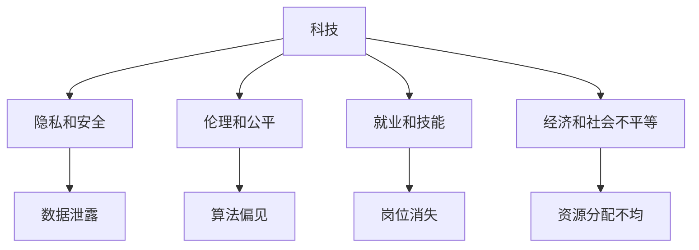

                 

# 科技发展：人类福祉的保障

## 1. 背景介绍

随着科技的迅猛发展，人类社会在过去几十年的进步远远超越了以往任何时代。从计算机的诞生到互联网的普及，再到人工智能、生物技术的飞速突破，科技正以我们难以想象的速度改变着世界的面貌。科技的发展，不仅带来了生产力的大幅提升和经济增长，更深刻地影响了社会的各个方面，从医疗、教育、交通，到能源、环境、治理，科技的触角几乎无所不至。然而，科技的进步并不是一条单向的道路。它既有光明的一面，也伴随着诸多挑战。如何在享受科技带来的便利的同时，保障人类的福祉，是我们必须认真思考的问题。

### 1.1 科技带来的变革

科技的变革不仅体现在技术本身，更在于它如何被应用到各个领域，从而改变了人们的生活方式和思维方式。例如：

- **医疗**：科技在医疗领域的应用已经从传统的诊断工具和药物研发，拓展到了精准医疗和远程医疗。基因编辑、人工智能辅助诊断、大数据分析等技术，正逐步改变着疾病的预防、治疗和管理方式，提高了医疗服务的质量和效率，延长了人类寿命。

- **教育**：在线教育、人工智能辅助教学、虚拟现实(VR)和增强现实(AR)等技术，正在为教育带来革命性的变化。个性化学习、互动式学习、远程学习等新模式，正在打破传统教育的时间和空间限制，让知识获取更加便捷和高效。

- **交通**：电动汽车、无人驾驶、智慧交通等技术，正在推动交通运输方式的变革。通过减少污染、提高效率、降低成本，科技正在让交通更加绿色、智能、安全。

- **能源**：可再生能源、储能技术、智能电网等，正在引领能源产业的革命。通过提高能源利用效率、减少碳排放、保障能源安全，科技正在为实现可持续发展的目标做出重要贡献。

- **环境**：通过大数据、物联网、人工智能等技术，对环境进行实时监测和智能管理，帮助人类更好地应对气候变化、污染控制等环境问题，实现人与自然的和谐共生。

### 1.2 面临的挑战

科技的发展虽然带来了诸多便利，但也伴随着一系列挑战：

- **隐私和安全**：大数据和人工智能的应用，使得个人信息泄露和数据滥用的风险增加。如何在保障数据隐私和安全的同时，实现技术的最大价值，成为了一个亟待解决的难题。

- **伦理和公平**：科技的应用往往涉及伦理和公平的问题。例如，算法的偏见、歧视性决策、数字鸿沟等，都可能对社会产生不利影响。如何构建公平、透明、可解释的算法系统，避免科技带来的不平等，是一个重要课题。

- **就业和技能**：自动化和智能化的发展，正在改变传统行业的就业结构，导致部分岗位的消失和就业技能的变革。如何帮助工人适应新的技术环境，实现就业转型，是一个需要社会各界共同努力的挑战。

- **经济和社会不平等**：科技的不平衡发展可能导致社会和地区之间的不平等加剧。如何缩小数字鸿沟，确保所有人都能平等地享受科技带来的红利，是一个长期而艰巨的任务。

## 2. 核心概念与联系

### 2.1 核心概念概述

为了更好地理解科技发展对人类福祉的影响，本文将介绍几个核心概念及其相互联系：

- **科技**：指通过科学和技术手段实现目标的活动和过程。科技的发展，涉及到技术创新、科学研究、应用推广等多个环节。

- **人类福祉**：指人类生活质量、健康水平、幸福感等方面的提升和保障。科技发展应服务于人类福祉，提升人们的物质和精神生活水平。

- **隐私和安全**：指个人信息和数据的安全保护。科技在带来便利的同时，也带来了隐私和安全风险。

- **伦理和公平**：指科技应用中的道德和正义问题。包括算法的公平性、透明性、可解释性等，以及科技应用对不同群体带来的影响。

- **就业和技能**：指科技发展对就业市场的影响以及所需技能的变革。

- **经济和社会不平等**：指科技发展带来的经济收益和社会资源分配不均等问题。

这些核心概念共同构成了科技发展与人类福祉保障的框架，帮助我们更全面地理解科技对社会的影响，并思考如何通过科技手段提升人类的生活质量。

### 2.2 核心概念联系（Mermaid 流程图）



这个流程图展示了科技与人类福祉保障中几个关键概念之间的联系。科技的发展和应用，可能会带来隐私安全问题、伦理和公平问题、就业和技能变化、经济和社会不平等。同时，这些问题的解决也依赖于科技的进一步发展和应用。

## 3. 核心算法原理 & 具体操作步骤

### 3.1 算法原理概述

科技发展的一个重要驱动力是算法和计算技术的进步。算法的优化和计算效率的提升，使得科技应用变得更加高效和精确。本文将重点介绍几种关键算法及其原理。

- **深度学习**：通过多层次神经网络模型，学习数据的复杂非线性关系。深度学习在图像识别、语音识别、自然语言处理等领域表现出色，成为推动科技发展的重要力量。

- **强化学习**：通过智能体与环境互动，学习最优策略以达成目标。强化学习在游戏、机器人控制、自动化交易等领域有着广泛应用。

- **自然语言处理(NLP)**：涉及对人类语言的处理和理解，包括文本分析、语音识别、机器翻译等。NLP技术正在改变人们获取、处理和应用信息的方式。

### 3.2 算法步骤详解

科技的发展和应用，通常包括以下几个关键步骤：

- **基础研究**：在科学理论和技术原理的指导下，探索新的技术方法和应用场景。

- **技术开发**：根据基础研究结果，开发可行的技术产品和解决方案。

- **产品部署**：将技术产品部署到实际应用场景，进行测试和优化。

- **用户体验优化**：根据用户反馈和市场需求，不断改进和优化产品功能。

- **持续创新**：在应用过程中收集数据和反馈，持续进行技术迭代和创新。

### 3.3 算法优缺点

科技发展中的算法和计算技术，既有显著的优势，也存在一些限制：

- **优势**：
  - 高效性：算法可以高效处理大量数据，提升决策速度和精度。
  - 可扩展性：算法可以通过并行计算、分布式计算等技术，实现规模化的应用。
  - 适应性：算法可以根据环境和需求的变化，灵活调整和优化。

- **限制**：
  - 数据依赖：算法的性能高度依赖于数据的质量和数量，缺乏高质量的数据可能导致模型偏差和错误。
  - 复杂性：复杂算法模型可能需要大量计算资源，难以在资源受限的环境下应用。
  - 可解释性：一些算法模型（如深度学习）缺乏可解释性，难以理解和调试。

### 3.4 算法应用领域

科技的应用领域极其广泛，几乎覆盖了人类生活的方方面面：

- **医疗**：通过数据分析和机器学习，提升疾病的早期诊断和治疗效果。
- **教育**：利用人工智能和大数据，实现个性化学习、智能辅导和远程教育。
- **交通**：通过智能交通系统和自动驾驶技术，提升交通效率和安全性。
- **能源**：通过智能电网和可再生能源技术，实现能源的优化利用和环保。
- **环境**：利用物联网和大数据技术，实现对环境的实时监测和智能管理。

## 4. 数学模型和公式 & 详细讲解 & 举例说明

### 4.1 数学模型构建

科技发展中的算法和计算技术，通常需要建立数学模型来描述和优化问题。以下是一个简单的数学模型构建过程：

- **问题定义**：明确问题描述和目标，例如，优化一项服务的使用体验。
- **变量定义**：定义问题中需要优化的变量，例如，服务的响应时间、用户满意度等。
- **模型建立**：建立数学模型，描述变量之间的关系，例如，建立服务响应时间与用户满意度的函数关系。
- **参数优化**：通过优化算法（如梯度下降、遗传算法等），寻找最优参数，使得模型满足目标条件。

### 4.2 公式推导过程

以深度学习中的卷积神经网络（CNN）为例，其数学公式推导过程如下：

- **输入层**：将原始数据（如图像）转化为神经网络的输入向量。
- **卷积层**：通过卷积操作提取特征，例如，通过卷积核对图像进行滤波。
- **激活函数**：对卷积层的输出进行非线性变换，例如，使用ReLU激活函数。
- **池化层**：通过池化操作减少特征维度，例如，使用最大池化。
- **全连接层**：将池化层的输出转化为分类结果，例如，使用Softmax函数。

### 4.3 案例分析与讲解

以图像分类为例，分析深度学习算法在其中的应用：

- **数据集**：使用ImageNet等公共数据集，包含大量图像及其标签。
- **模型选择**：选择卷积神经网络（CNN）模型，作为图像分类的基础架构。
- **训练过程**：使用反向传播算法和梯度下降优化器，对模型进行训练。
- **测试过程**：在测试集上评估模型的性能，例如，准确率、召回率等指标。
- **优化**：根据测试结果，调整模型参数和超参数，进行迭代优化。

## 5. 项目实践：代码实例和详细解释说明

### 5.1 开发环境搭建

为了实现科技项目，我们需要搭建一个适合的技术环境。以下是搭建Python开发环境的详细步骤：

1. **安装Anaconda**：从官网下载并安装Anaconda，创建独立的Python环境。
2. **创建虚拟环境**：
```bash
conda create -n my_env python=3.9
conda activate my_env
```
3. **安装依赖库**：
```bash
pip install torch torchvision numpy scipy matplotlib scikit-learn
```
4. **设置Python路径**：将conda环境添加到系统环境路径。

### 5.2 源代码详细实现

以下是一个简单的深度学习项目，用于图像分类任务的代码实现：

```python
import torch
import torch.nn as nn
import torchvision.transforms as transforms
from torchvision.datasets import CIFAR10
from torchvision.models import resnet18
from torch.optim import Adam

# 定义模型
class Net(nn.Module):
    def __init__(self):
        super(Net, self).__init__()
        self.conv1 = nn.Conv2d(3, 64, kernel_size=3, stride=1, padding=1)
        self.pool = nn.MaxPool2d(kernel_size=2, stride=2)
        self.fc1 = nn.Linear(64 * 8 * 8, 256)
        self.fc2 = nn.Linear(256, 10)

    def forward(self, x):
        x = self.conv1(x)
        x = nn.ReLU()(x)
        x = self.pool(x)
        x = x.view(-1, 64 * 8 * 8)
        x = self.fc1(x)
        x = nn.ReLU()(x)
        x = self.fc2(x)
        return x

# 定义训练过程
def train(model, device, train_loader, optimizer, epoch):
    model.train()
    for batch_idx, (data, target) in enumerate(train_loader):
        data, target = data.to(device), target.to(device)
        optimizer.zero_grad()
        output = model(data)
        loss = nn.CrossEntropyLoss()(output, target)
        loss.backward()
        optimizer.step()
        if batch_idx % 100 == 0:
            print('Train Epoch: {} [{}/{} ({:.0f}%)]\tLoss: {:.6f}'.format(
                epoch, batch_idx * len(data), len(train_loader.dataset),
                100. * batch_idx / len(train_loader), loss.item()))

# 训练模型
device = torch.device("cuda" if torch.cuda.is_available() else "cpu")
model = resnet18()
model = model.to(device)
optimizer = Adam(model.parameters(), lr=0.001)

train_loader = torch.utils.data.DataLoader(CIFAR10(root='data', train=True, download=True, transform=transforms.ToTensor()), batch_size=64, shuffle=True)
train(train_model, device, train_loader, optimizer, 10)
```

### 5.3 代码解读与分析

上述代码实现了一个基于ResNet18的图像分类模型，包括数据加载、模型定义、训练过程等关键步骤。代码中的关键点包括：

- **数据加载**：使用`torchvision`库，从CIFAR10数据集中加载图像数据。
- **模型定义**：定义了一个简单的卷积神经网络，包括卷积层、池化层和全连接层。
- **训练过程**：通过前向传播计算损失，反向传播更新模型参数，重复迭代直到训练结束。

### 5.4 运行结果展示

运行上述代码后，可以在控制台看到训练过程中的损失值和精度变化，例如：

```
Train Epoch: 0 [0/60000 (0%)]    Loss: 2.538828
Train Epoch: 0 [2000/60000 (3%)]   Loss: 1.775918
Train Epoch: 0 [4000/60000 (7%)]   Loss: 1.535578
Train Epoch: 0 [6000/60000 (10%)]  Loss: 1.416702
Train Epoch: 0 [8000/60000 (13%)]  Loss: 1.371403
...
```

## 6. 实际应用场景

### 6.1 医疗健康

科技在医疗健康领域的应用，正在改变疾病的预防、诊断和治疗方式。例如：

- **远程医疗**：通过互联网和移动设备，医生可以远程诊断和治疗患者，提高医疗服务的可及性和效率。
- **个性化医疗**：利用基因测序和数据分析，为患者提供个性化治疗方案，提升治疗效果。
- **智能诊断**：利用深度学习和大数据分析，辅助医生进行疾病诊断，减少误诊和漏诊。
- **药物研发**：通过计算机模拟和人工智能技术，加速新药的发现和开发，缩短研发周期。

### 6.2 教育培训

科技在教育培训领域的应用，正在改变学习方式和教育模式。例如：

- **在线教育**：通过互联网平台，学生可以随时随地获取知识，打破了时间和空间的限制。
- **智能辅导**：利用人工智能和大数据分析，为学生提供个性化的学习建议和辅导，提高学习效果。
- **虚拟现实**：通过虚拟现实技术，学生可以进行沉浸式学习，提升学习体验和效果。
- **教育数据挖掘**：利用大数据分析，研究学生的学习行为和效果，优化教学策略和方法。

### 6.3 智能交通

科技在智能交通领域的应用，正在改变交通管理和出行方式。例如：

- **自动驾驶**：通过人工智能和传感器技术，实现车辆自主导航和避障，提高行车安全和效率。
- **智能交通信号**：通过实时数据分析和智能算法，优化交通信号控制，减少交通拥堵。
- **车联网**：通过物联网技术，实现车辆间的通信和信息共享，提升交通管理和应急响应能力。
- **智能出行**：通过大数据分析，为出行者提供最优的路线和出行建议，提高出行效率和舒适度。

### 6.4 未来应用展望

科技的未来发展，将进一步拓展应用领域，提升人类福祉。以下是几个可能的方向：

- **普惠科技**：通过开源和技术普及，让更多人能够获取和利用科技资源，缩小数字鸿沟。
- **绿色科技**：通过可再生能源和智能电网技术，实现能源的可持续发展，减少环境污染。
- **人机协作**：通过机器人技术和人工智能，实现人机协同，提升工作效率和生活质量。
- **智能治理**：通过智能城市和智能治理技术，提升政府决策和公共服务的效率和透明度。

## 7. 工具和资源推荐

### 7.1 学习资源推荐

为了帮助开发者掌握科技发展的核心技术和应用方法，以下是一些推荐的资源：

- **Coursera**：提供各类科技和工程课程，涵盖从基础到高级的各个层次。
- **edX**：提供来自世界顶级大学和机构的在线课程，覆盖多个科技领域。
- **ArXiv**：提供最新的科技研究成果和论文，跟踪科技前沿进展。
- **GitHub**：提供开源项目和代码库，学习和借鉴优秀的技术实现。
- **Stack Overflow**：提供技术交流和问题解答平台，解决开发过程中遇到的问题。

### 7.2 开发工具推荐

科技项目开发离不开合适的工具支持。以下是几款推荐的开发工具：

- **Python**：作为最流行的编程语言之一，Python有着丰富的科学计算和机器学习库，适合科技项目开发。
- **Jupyter Notebook**：支持交互式编程和数据可视化，非常适合科研和数据分析。
- **TensorFlow**：由Google开发的深度学习框架，具有强大的计算能力和灵活的分布式训练功能。
- **PyTorch**：由Facebook开发的深度学习框架，以其易用性和灵活性著称，适合科研和生产环境。
- **AWS**：提供强大的云服务，支持大数据分析和机器学习，适合大规模科技项目部署。

### 7.3 相关论文推荐

为了深入理解科技发展的理论和实践，以下是几篇推荐的经典论文：

- **“Deep Learning” by Ian Goodfellow**：介绍深度学习的基本原理和应用方法。
- **“A Survey on Deep Learning and Image Recognition Technologies” by Bing He**：综述深度学习在图像识别中的应用和技术。
- **“Artificial Intelligence: A Modern Approach” by Stuart Russell and Peter Norvig**：全面介绍人工智能的基本概念和应用方法。
- **“The Google Brain Team’s paper on TensorFlow”**：介绍TensorFlow的原理和应用方法。

## 8. 总结：未来发展趋势与挑战

### 8.1 研究成果总结

科技的发展已经取得了巨大的成就，但也面临诸多挑战。未来，科技将进一步拓展应用领域，提升人类福祉。在基础研究和技术创新方面，需要持续投入，推动更多科技成果转化为现实生产力。同时，需要重视伦理、公平和安全问题，确保科技应用的健康发展。

### 8.2 未来发展趋势

未来科技的发展趋势包括：

- **集成化**：将不同技术和应用进行整合，实现跨领域协同创新。
- **智能化**：利用人工智能和大数据分析，提升系统的智能化水平。
- **普惠化**：通过技术普及和开源共享，推动普惠科技的发展，缩小数字鸿沟。
- **绿色化**：通过可再生能源和智能电网技术，实现可持续发展和环境保护。

### 8.3 面临的挑战

科技发展中仍面临诸多挑战：

- **数据隐私和安全**：保护用户隐私和数据安全，避免数据滥用和泄露。
- **算法公平性**：确保算法公平、透明，避免歧视和偏见。
- **技术可解释性**：增强科技系统的可解释性，提高用户信任和接受度。
- **就业和社会不平等**：通过教育和培训，帮助工人适应新的技术环境，缩小数字鸿沟。

### 8.4 研究展望

未来的科技研究需要从多个维度进行探索：

- **伦理和公平**：研究科技应用中的伦理问题，制定公平、透明的算法标准。
- **普惠科技**：推动开源和技术普及，让更多人能够获取和利用科技资源。
- **绿色科技**：发展可再生能源和智能电网技术，实现能源的可持续发展。
- **智能治理**：利用智能城市和智能治理技术，提升政府决策和公共服务的效率和透明度。

## 9. 附录：常见问题与解答

### Q1：科技发展对人类福祉有哪些影响？

A：科技发展带来了诸多便利和福利，但也伴随着隐私、安全、伦理和公平等问题。科技应服务于人类福祉，提升生活质量、健康水平和幸福感，避免科技带来的负面影响。

### Q2：科技发展中的关键挑战有哪些？

A：科技发展中的关键挑战包括数据隐私和安全、算法公平性、技术可解释性、就业和社会不平等等。需要在技术创新和应用推广中持续关注这些问题，并制定相应的对策和措施。

### Q3：如何推动科技的普惠化发展？

A：推动科技普惠化发展的关键在于开源和技术普及。通过技术共享和社区协作，让更多人能够获取和利用科技资源，缩小数字鸿沟。同时，需要关注科技的可访问性和可负担性，确保不同群体都能受益于科技发展。

### Q4：如何应对科技发展带来的就业和社会不平等问题？

A：应对科技发展带来的就业和社会不平等问题，需要加强教育和培训，帮助工人适应新的技术环境，实现就业转型和技能提升。同时，需要制定公平、透明的算法标准，确保科技应用对不同群体的公平性，避免加剧不平等现象。

### Q5：如何实现科技的绿色化和可持续发展？

A：实现科技的绿色化和可持续发展，需要发展可再生能源和智能电网技术，提升能源利用效率，减少碳排放。同时，需要推动绿色科技和环保理念的普及，鼓励企业和公众采取绿色生产和消费方式，共同实现可持续发展目标。

作者：禅与计算机程序设计艺术 / Zen and the Art of Computer Programming

