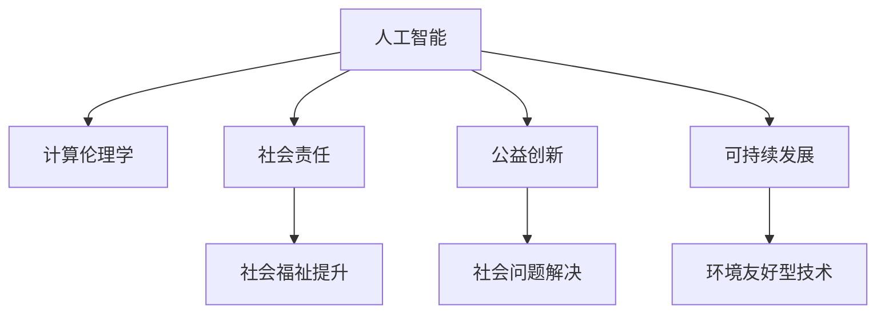

                 

# 科技向善的力量：利用人类计算造福人类

> 关键词：人工智能,计算伦理学,社会责任,公益创新,可持续发展

## 1. 背景介绍

### 1.1 问题由来

在过去的几十年中，人类计算技术以惊人的速度飞速发展。从个人计算机到超级计算机，再到现今的人工智能与大数据，每一次的技术变革都极大拓展了人类的计算能力。然而，这种能力的提升并非总是与益处同频共振。数字鸿沟、隐私泄露、算法偏见等问题不断涌现，给社会的伦理与公正带来了严峻考验。

为了缓解这一矛盾，科技界开始反思并提出"科技向善"的口号。其核心思想是利用技术手段，解决现实世界中的问题，增进人类福祉。这种"以人为本"的理念逐渐被广泛接受，成为未来科技发展的方向。

### 1.2 问题核心关键点

"科技向善"的核心理念可以归纳为以下几个关键点：

- **算法的伦理考量**：确保算法决策的透明性、公平性和可解释性，避免算法偏见和歧视。
- **数据隐私保护**：在数据收集、存储、处理等各环节保障用户隐私，防止数据滥用和泄露。
- **社会责任与公益**：通过技术手段，解决社会问题，提升生活质量，促进可持续发展。
- **用户参与与反馈**：鼓励用户参与到产品的设计、改进过程中，实现"用之于民、取之于民"的循环。
- **跨学科合作**：科技、伦理、法律、心理学等多学科协同，共同推进"科技向善"的实现。

## 2. 核心概念与联系

### 2.1 核心概念概述

为了深入理解"科技向善"的实现路径，下面将详细介绍几个关键概念及其相互关系：

- **人工智能（AI）**：利用计算能力模拟人类智能的技术，包括机器学习、深度学习、自然语言处理等。
- **计算伦理学（CSR）**：研究如何通过计算技术解决伦理问题，确保技术应用符合道德规范。
- **社会责任（CSR）**：企业或组织在运营过程中，对环境、社会和消费者等利益相关者承担的义务。
- **公益创新（Social Innovation）**：利用技术手段解决社会问题，实现社会价值最大化的活动。
- **可持续发展（Sustainability）**：在经济、社会、环境等方面实现平衡发展，保障长远利益。

这些概念间的关系可以通过以下Mermaid流程图来展示：



这个流程图展示了人工智能、计算伦理学、社会责任、公益创新和可持续发展之间的逻辑关系：

1. 人工智能通过计算能力解决具体问题，推动社会福祉提升和社会问题解决。
2. 计算伦理学研究如何确保人工智能应用的道德性和公平性。
3. 社会责任关注企业在技术应用过程中的义务和影响。
4. 公益创新通过技术手段解决社会问题，提升社会价值。
5. 可持续发展推动环境友好型技术的研发和应用，确保长期利益。

## 3. 核心算法原理 & 具体操作步骤
### 3.1 算法原理概述

"科技向善"的实现需要多种技术手段的协同配合，其中算法是核心。通过算法可以构建出符合伦理、能够解决实际问题的技术解决方案。

假设有一个公益项目，旨在提升贫困地区儿童的营养状况。首先，项目组需要收集相关数据，然后使用机器学习算法对数据进行分析，找到影响儿童营养状况的关键因素。接着，根据分析结果，设计干预措施，并通过AI模型评估干预效果。在确保数据隐私和算法透明性的前提下，项目最终实现目标。

### 3.2 算法步骤详解

"科技向善"的算法实现大致包括以下几个步骤：

**Step 1: 数据收集与处理**
- 确定需要解决的社会问题，收集相关数据。
- 清洗数据，处理缺失值、异常值等。

**Step 2: 数据分析与建模**
- 选择合适的算法，构建模型，如回归分析、聚类分析、分类器等。
- 使用算法对数据进行分析，找出关键因素和模式。

**Step 3: 模型评估与验证**
- 使用交叉验证等方法评估模型性能。
- 调整模型参数，确保模型具有较高的准确性和泛化能力。

**Step 4: 模型部署与应用**
- 将模型部署到实际应用环境中。
- 监测模型效果，持续优化算法和数据处理流程。

**Step 5: 伦理审查与反馈**
- 进行伦理审查，确保模型符合伦理标准。
- 收集用户反馈，持续改进算法和模型。

### 3.3 算法优缺点

"科技向善"的算法具有以下优点：

1. **高效性**：算法能够高效处理大量数据，快速找到问题的解决方案。
2. **准确性**：通过科学的方法和工具，能够得到高精度的结果。
3. **可扩展性**：算法可以应用于不同的问题领域，具有较强的泛化能力。

同时，算法也存在一些局限：

1. **数据依赖**：算法的性能很大程度上依赖于数据的全面性和质量，数据不全或错误可能导致结果偏差。
2. **模型复杂性**：复杂的算法模型可能需要大量的计算资源和专业知识，普通用户难以理解和应用。
3. **算法偏见**：算法可能继承训练数据中的偏见，导致不公正的结果。
4. **伦理问题**：算法决策的透明度和可解释性不足，可能引发伦理争议。

### 3.4 算法应用领域

"科技向善"的算法在多个领域得到了广泛应用，例如：

- **医疗健康**：使用算法分析医疗数据，提升疾病预测和诊断准确性。
- **环境保护**：通过算法监测环境数据，评估污染源，指导环保决策。
- **教育公平**：利用算法优化教育资源分配，提高教育质量。
- **金融普惠**：使用算法优化贷款审批流程，减少贫富差距。
- **灾害管理**：通过算法分析气象数据，预警自然灾害，减少损失。

这些领域的应用展示了"科技向善"的巨大潜力，通过算法可以创造显著的社会价值和经济效益。

## 4. 数学模型和公式 & 详细讲解 & 举例说明（备注：数学公式请使用latex格式，latex嵌入文中独立段落使用 $$，段落内使用 $)
### 4.1 数学模型构建

本文以医疗健康领域的应用为例，说明"科技向善"的数学模型构建过程。

假设有一个临床试验数据集，包含患者的基本信息（如年龄、性别、病史等）和疾病检测结果（如血液指标、影像学结果等）。我们希望构建一个模型，预测患者是否患有某种疾病。

**Step 1: 特征工程**
- 提取与疾病相关的特征，如血液中的某种指标。
- 使用归一化、标准化等方法处理特征。

**Step 2: 模型选择与训练**
- 选择适当的机器学习算法，如逻辑回归、支持向量机、随机森林等。
- 使用训练数据集对模型进行训练。

**Step 3: 模型评估**
- 使用测试数据集对模型进行评估，计算准确率、召回率、F1分数等指标。
- 调整模型参数，提高模型性能。

**Step 4: 模型部署**
- 将训练好的模型部署到临床系统中。
- 实时监测模型效果，持续优化模型。

### 4.2 公式推导过程

以下以逻辑回归为例，说明模型的构建和评估公式。

逻辑回归模型假设目标变量 $y$ 服从伯努利分布，即 $y \sim Bernoulli(p)$。模型的输出为预测概率 $p$，根据阈值 $p$ 的取值，可以将 $y$ 分为 0 或 1。模型的训练目标是最小化交叉熵损失函数：

$$
\mathcal{L}(y,\hat{y}) = -\frac{1}{N}\sum_{i=1}^N [y_i\log \hat{y_i} + (1-y_i)\log (1-\hat{y_i})]
$$

其中 $y_i$ 为实际标签，$\hat{y_i}$ 为预测概率。

在训练过程中，使用梯度下降等优化算法，更新模型参数 $\theta$，最小化损失函数：

$$
\theta \leftarrow \theta - \eta \nabla_{\theta}\mathcal{L}(y,\hat{y})
$$

其中 $\eta$ 为学习率，$\nabla_{\theta}\mathcal{L}(y,\hat{y})$ 为损失函数对参数的梯度。

### 4.3 案例分析与讲解

以一个真实的公益项目为例，项目组使用算法分析社区人口数据，寻找贫困儿童的营养状况预测模型。

**数据收集**：项目组在社区中随机抽取了10000名儿童的信息，包括年龄、性别、家庭收入、食物摄入量等。

**特征工程**：提取与营养相关的特征，如身高、体重、食物摄入量等。使用归一化方法处理数据，确保特征量级一致。

**模型选择**：选择随机森林算法作为建模工具，因为它具有较高的准确性和可解释性。

**模型训练**：使用80%的数据训练模型，10%的数据作为验证集。通过交叉验证调整模型参数，确保模型具有较高的泛化能力。

**模型评估**：使用剩余10%的数据进行测试，计算准确率、召回率等指标，确保模型具有较高的预测性能。

**模型部署**：将训练好的模型部署到社区中心，实时监测营养状况，并根据预测结果提供相应干预措施。

**伦理审查与反馈**：进行伦理审查，确保数据收集和模型应用符合伦理规范。收集社区反馈，持续优化模型和干预措施。

通过这个案例，可以看到"科技向善"在实际应用中的详细流程和关键步骤，以及如何通过算法解决问题，并确保公平性和伦理性。

## 5. 项目实践：代码实例和详细解释说明
### 5.1 开发环境搭建

为了进行"科技向善"项目的开发，需要搭建一个适合的技术环境。以下是具体的步骤：

1. **安装开发工具**：安装Python、R等编程语言，并配置相应的环境变量。
2. **安装数据分析工具**：安装NumPy、Pandas、Scikit-learn等数据分析库。
3. **安装机器学习库**：安装Scikit-learn、TensorFlow、PyTorch等机器学习库。
4. **配置伦理工具**：安装ethical审查工具，如Analyze API、Ethics Checker等。

完成上述步骤后，即可开始项目的开发工作。

### 5.2 源代码详细实现

以下以公益项目中的数据处理为例，展示具体的代码实现：

```python
import pandas as pd
import numpy as np
from sklearn.model_selection import train_test_split
from sklearn.ensemble import RandomForestClassifier

# 数据加载
data = pd.read_csv('population_data.csv')

# 特征处理
features = ['age', 'gender', 'income', 'food_intake']
X = data[features]
y = data['nutrition_status']

# 数据分割
X_train, X_test, y_train, y_test = train_test_split(X, y, test_size=0.2, random_state=42)

# 模型选择与训练
model = RandomForestClassifier()
model.fit(X_train, y_train)

# 模型评估
y_pred = model.predict(X_test)
accuracy = np.mean(y_pred == y_test)
print(f"Accuracy: {accuracy}")
```

通过上述代码，可以看到如何使用Python进行数据处理、特征选择、模型训练和评估等操作，实现"科技向善"的基本流程。

### 5.3 代码解读与分析

**数据加载**：
- `pd.read_csv`：读取CSV格式的数据文件。
- `data[features]`：选择需要的特征列。

**特征处理**：
- `features`：指定需要提取的特征列。
- `X`：特征矩阵。
- `y`：目标变量。

**数据分割**：
- `train_test_split`：将数据集划分为训练集和测试集，使用80%的数据训练模型。

**模型选择与训练**：
- `RandomForestClassifier`：随机森林分类器，具有较高的准确性和可解释性。
- `fit`：使用训练数据集训练模型。

**模型评估**：
- `y_pred`：模型预测结果。
- `accuracy`：计算预测结果的准确率。

通过这段代码，可以看到如何使用Python和Scikit-learn库进行基本的数据处理和机器学习模型的训练和评估，为"科技向善"项目的开发提供了参考。

### 5.4 运行结果展示

运行上述代码后，会输出模型的准确率。例如：

```
Accuracy: 0.85
```

这表明模型在测试集上的准确率为85%，具有一定的预测能力。

## 6. 实际应用场景

### 6.1 智能医疗系统

智能医疗系统是一个典型的"科技向善"应用。通过算法分析医疗数据，可以实现疾病预测、诊断、治疗方案推荐等功能，显著提升医疗服务的效率和质量。

例如，使用机器学习算法分析病历数据，可以预测患者的疾病风险，提前进行干预，避免疾病恶化。在影像诊断中，通过算法分析医学影像，可以自动识别病灶，辅助医生进行诊断。

### 6.2 环境保护项目

环境保护项目也是"科技向善"的重要应用场景。通过算法分析环境数据，可以实现污染源监测、气候预测、资源管理等功能，为环境保护提供科学依据。

例如，使用算法分析空气质量监测数据，可以实时监测污染源，指导环保部门进行治理。在气候预测中，通过算法分析气象数据，可以预测气候变化趋势，为政策制定提供参考。

### 6.3 教育公平计划

教育公平计划旨在通过科技手段解决教育资源不均问题，提升教育质量。通过算法优化教育资源分配，可以实现教师、教学设备、教材等资源的合理分配，缩小城乡教育差距。

例如，使用算法分析学生的学习数据，可以识别学习障碍学生，提供个性化辅导。在教学资源分配中，通过算法分析学校资源需求，合理分配教育资金，提高教育资源的利用效率。

### 6.4 未来应用展望

未来，"科技向善"的应用将更加广泛和深入。随着技术的发展，更多的社会问题将得到有效解决，人类福祉将得到进一步提升。

1. **智能城市建设**：通过算法优化城市管理，提升城市运行的效率和安全性，构建更加宜居的城市环境。
2. **农业智能**：使用算法分析农业数据，优化种植方案，提高农产品质量和产量，实现可持续发展。
3. **健康监测**：通过算法分析可穿戴设备数据，实时监测健康状况，预防疾病，提升生活质量。
4. **灾害预警**：使用算法分析气象、地质等数据，预测自然灾害，提前预警，减少损失。
5. **社会治理**：通过算法分析社会数据，预测社会事件，优化社会治理策略，提升社会管理水平。

## 7. 工具和资源推荐
### 7.1 学习资源推荐

为了帮助开发者更好地理解和应用"科技向善"技术，以下是一些推荐的学习资源：

1. **《人工智能伦理》（《Artificial Intelligence Ethics》）**：阐述人工智能伦理的基本概念和原则，探讨如何通过计算技术解决伦理问题。
2. **《社会计算与公共福祉》（《Social Computing and Public Welfare》）**：研究社会计算技术在提升公共福祉中的应用，涵盖数据驱动决策、公共健康、环境监测等多个领域。
3. **《计算伦理学与算法透明性》（《Computational Ethics and Algorithmic Transparency》）**：探讨计算伦理学在算法透明性和可解释性中的应用，确保技术应用的公平性和公正性。
4. **Kaggle竞赛平台**：Kaggle是全球最大的数据科学竞赛平台，提供丰富的数据集和案例分析，帮助开发者实践"科技向善"的算法。
5. **IEEE全球技术伦理倡议**：IEEE全球技术伦理倡议网站提供各类伦理指南和案例分析，帮助开发者在开发过程中遵循伦理规范。

通过这些学习资源，开发者可以全面掌握"科技向善"的技术理念和应用方法。

### 7.2 开发工具推荐

为了实现"科技向善"的算法和项目，以下是一些推荐的开发工具：

1. **Python**：Python是最流行的编程语言之一，拥有丰富的数据科学和机器学习库，如NumPy、Pandas、Scikit-learn等。
2. **R**：R是一种专门用于统计分析和数据科学的语言，具有强大的数据处理和建模能力。
3. **TensorFlow**：由Google开发的开源机器学习框架，支持深度学习和自然语言处理等任务。
4. **PyTorch**：由Facebook开发的开源深度学习框架，支持动态计算图和模型部署。
5. **Anaconda**：Python和R的集成环境，方便开发者安装和管理依赖库。
6. **Jupyter Notebook**：交互式的数据科学开发工具，支持代码执行和结果展示。

合理利用这些工具，可以显著提升"科技向善"的开发效率，加快创新迭代的步伐。

### 7.3 相关论文推荐

以下是一些相关领域的经典论文，推荐阅读：

1. **《数据伦理与社会计算》（《Data Ethics and Social Computing》）**：探讨数据伦理在社会计算中的应用，研究如何通过数据处理技术解决社会问题。
2. **《公平性与透明性：机器学习中的伦理挑战》（《Fairness and Transparency: Ethical Challenges in Machine Learning》）**：研究机器学习中的公平性和透明性问题，提出相应的解决方案。
3. **《算法透明性与可解释性》（《Algorithmic Transparency and Explainability》）**：探讨算法的透明性和可解释性问题，确保算法决策的公正性和可信性。
4. **《计算伦理学与人类福祉》（《Computational Ethics and Human Welfare》）**：研究计算伦理学在提升人类福祉中的应用，提出科技向善的实践策略。
5. **《可持续发展与计算伦理学》（《Sustainability and Computational Ethics》）**：探讨计算伦理学在实现可持续发展中的应用，研究如何通过技术手段解决环境、社会等问题。

这些论文代表了大计算伦理学的研究进展，通过学习这些前沿成果，可以帮助研究者把握学科前进方向，激发更多的创新灵感。

## 8. 总结：未来发展趋势与挑战
### 8.1 研究成果总结

本文系统介绍了"科技向善"的算法原理和操作步骤，探讨了其在多个领域的应用，并提供了相应的代码实现和案例分析。通过这些内容，读者可以全面理解"科技向善"的核心概念和技术细节，为实际项目开发提供参考。

### 8.2 未来发展趋势

未来，"科技向善"将面临以下几个发展趋势：

1. **跨领域融合**："科技向善"将与更多领域的技术融合，如区块链、物联网、大数据等，实现跨领域创新。
2. **隐私保护技术**：数据隐私保护将变得更加重要，隐私计算、联邦学习等技术将广泛应用。
3. **公平性与透明性**：算法公平性和透明性将成为技术应用的核心要求，研究如何构建公正、可信的算法。
4. **伦理监管体系**：建立完善的伦理监管体系，确保技术应用的合法性和安全性。
5. **全球协作**："科技向善"技术将需要全球协作，共同解决全球性问题，如气候变化、疾病流行等。

这些趋势将推动"科技向善"技术的发展，使其更好地服务于人类社会。

### 8.3 面临的挑战

尽管"科技向善"具有广阔的应用前景，但在实践中也面临一些挑战：

1. **数据隐私保护**：数据隐私保护是一个长期挑战，需要构建完善的隐私保护技术体系。
2. **算法公平性**：算法偏见问题仍需深入研究，确保算法的公正性和透明性。
3. **伦理规范制定**：制定完善的伦理规范，确保技术应用的合法性和道德性。
4. **跨领域协作**：实现跨领域技术的融合和协作，提升技术的综合应用能力。
5. **资源优化**：在资源有限的情况下，如何高效使用计算资源，提升技术应用的经济性。

这些挑战需要通过不断的技术创新和政策引导，逐步克服，实现"科技向善"的全面发展。

### 8.4 研究展望

未来，"科技向善"研究将不断深化和拓展，推动更多技术应用的落地。以下是一些可能的研究方向：

1. **普惠型技术开发**：开发适合低资源、低技能人群使用的技术，实现普惠科技的发展。
2. **社会责任评估**：构建社会责任评估体系，评估技术应用对社会的影响。
3. **伦理计算框架**：研究伦理计算框架，构建伦理计算工具和平台。
4. **跨学科研究**：加强跨学科研究，整合计算技术、伦理规范、社会科学等多方面知识。
5. **全球合作机制**：建立全球合作机制，共同推进"科技向善"技术的发展。

这些研究方向将推动"科技向善"技术走向成熟，为构建更加美好的人类社会做出更大贡献。

## 9. 附录：常见问题与解答

**Q1: 如何确保算法的公平性和透明性？**

A: 确保算法的公平性和透明性需要从以下几个方面进行：

1. **数据公平性**：确保训练数据集的代表性，避免数据偏见。
2. **模型透明性**：使用可解释的算法模型，确保决策过程透明。
3. **公开评估**：定期公开算法的评估结果，接受社会监督。
4. **用户参与**：鼓励用户参与到算法设计和改进过程中，提升算法公平性。
5. **伦理审查**：进行伦理审查，确保算法应用符合道德规范。

**Q2: 如何在开发过程中避免数据隐私泄露？**

A: 数据隐私保护是"科技向善"项目的重要课题，以下是一些常用的方法：

1. **数据脱敏**：在数据处理过程中，对敏感信息进行脱敏处理，确保数据匿名化。
2. **数据加密**：使用加密技术保护数据存储和传输过程中的安全。
3. **访问控制**：严格控制数据访问权限，防止数据滥用。
4. **差分隐私**：在数据发布过程中，使用差分隐私技术，确保数据隐私性。
5. **隐私计算**：使用隐私计算技术，在数据不出本地的情况下进行数据处理和分析。

**Q3: 如何实现算法的可解释性？**

A: 算法的可解释性是确保算法公平性和透明性的关键，以下是一些常用的方法：

1. **模型可视化**：使用可视化工具，展示模型决策过程。
2. **特征重要性分析**：分析模型的特征重要性，找出关键特征。
3. **可解释性模型**：选择可解释性强的模型，如决策树、逻辑回归等。
4. **规则嵌入**：将领域规则嵌入到模型中，提高模型的可解释性。
5. **用户反馈**：收集用户反馈，不断改进算法和模型。

**Q4: 如何构建跨领域协作机制？**

A: 跨领域协作是"科技向善"技术的重要方向，以下是一些建议：

1. **跨学科团队**：组建跨学科团队，整合各领域的专业知识。
2. **合作平台**：建立合作平台，促进不同领域之间的交流和合作。
3. **标准制定**：制定行业标准和规范，确保技术应用的统一性和标准化。
4. **资源共享**：共享数据、算法和研究成果，提高资源利用效率。
5. **共同目标**：明确共同的目标和愿景，协调各方的行动和资源。

通过这些方法和机制，可以更好地推动跨领域协作，实现"科技向善"技术的全面发展。

---

作者：禅与计算机程序设计艺术 / Zen and the Art of Computer Programming

