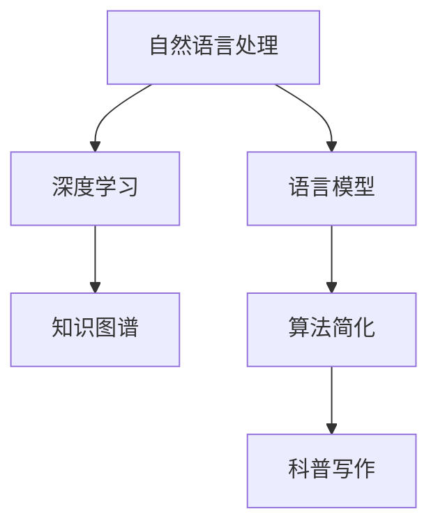

                 

# 科普写作的AI助手：简化复杂概念

> 关键词：科普写作,人工智能,自然语言处理,语言模型,知识图谱,深度学习,算法简化

## 1. 背景介绍

### 1.1 问题由来
在科学与技术日新月异的今天，许多前沿概念和理论对于非专业受众来说无疑既复杂又难以理解。这不仅限制了科学普及的广度与深度，也可能导致公众对新兴技术的误解和抵触。为了应对这一挑战，学术界和产业界正在探索通过人工智能技术，特别是自然语言处理（Natural Language Processing, NLP）和深度学习（Deep Learning, DL），来帮助普通用户更好地理解和掌握复杂概念。

### 1.2 问题核心关键点
科普写作的AI助手主要解决的问题是：如何用简洁、易懂的语言向非专业受众解释复杂的科学或技术概念，让读者能够快速、准确地获取关键信息，激发他们的兴趣和好奇心。

### 1.3 问题研究意义
科普写作的AI助手不仅能够提升科学普及的质量，减少误解，还能激发更多人对科学的兴趣，培养科学素养，对社会的发展和进步具有重要意义。

## 2. 核心概念与联系

### 2.1 核心概念概述

科普写作的AI助手是一个融合了自然语言处理和深度学习的智能系统，用于简化和解释复杂的概念和理论。其核心概念包括：

- **自然语言处理（NLP）**：通过计算机处理和理解人类语言，实现信息提取、文本生成、情感分析等功能。
- **深度学习（DL）**：一种强大的机器学习方法，能够自动学习数据的特征表示，实现复杂的模式识别和预测任务。
- **语言模型（Language Model）**：通过分析大量文本数据，学习语言的结构和规律，预测给定上下文下的下一个词或句子的概率。
- **知识图谱（Knowledge Graph）**：一种表示实体和它们之间关系的图形结构，用于构建和查询知识库。
- **算法简化（Algorithm Simplification）**：将复杂的算法和计算过程转换为易于理解和操作的简化形式。

这些核心概念之间的关系可以通过以下Mermaid流程图来展示：



这个流程图展示了各个概念之间的联系：

1. 自然语言处理（A）从大量文本数据中提取信息，分析语言结构和规律。
2. 深度学习（B）利用自然语言处理的结果，学习语言模型（C），预测上下文中的单词或句子。
3. 知识图谱（D）用于构建和检索知识库，补充模型知识。
4. 算法简化（E）将复杂的算法转换为易于理解的形式。
5. 科普写作（F）通过上述技术，生成易懂的解释和摘要，辅助用户理解复杂概念。

## 3. 核心算法原理 & 具体操作步骤
### 3.1 算法原理概述

科普写作的AI助手的核心算法原理基于自然语言处理和深度学习，其核心目标是将复杂的概念和算法转换为易于理解的语言，帮助用户快速掌握。该算法包括以下几个关键步骤：

1. **数据预处理**：清洗和标准化输入数据，如去除噪音、分词、词性标注等。
2. **语言模型训练**：使用大量文本数据训练语言模型，捕捉语言的规律和结构。
3. **知识图谱构建**：通过实体识别和关系抽取，构建知识图谱，补充模型的语义理解。
4. **算法简化**：使用算法简化技术，将复杂算法转换为易于理解的步骤和公式。
5. **生成解释性文本**：将简化后的算法和知识图谱信息，通过自然语言处理生成易懂的解释性文本。

### 3.2 算法步骤详解

以下是科普写作AI助手的主要操作步骤：

**Step 1: 数据预处理**
- 输入文本数据，进行分词、词性标注、停用词过滤等处理。
- 使用BERT或其他预训练模型，提取文本的特征向量。

**Step 2: 语言模型训练**
- 在预训练语言模型的基础上，通过标注数据微调，训练特定的语言模型。
- 使用语言模型预测上下文中的单词或句子，捕捉语言规律。

**Step 3: 知识图谱构建**
- 对输入文本进行实体识别，识别出实体及其类型。
- 使用关系抽取技术，构建实体之间的关系图。
- 将知识图谱与语言模型结合，增强模型的语义理解能力。

**Step 4: 算法简化**
- 对目标算法进行分析，识别出关键步骤和操作。
- 使用代码注释、伪代码、流程图等方法，将算法转换为易于理解的格式。
- 使用数学公式和解释性语言，描述算法的核心思想和计算过程。

**Step 5: 生成解释性文本**
- 将简化后的算法和知识图谱信息，输入到语言模型中。
- 生成易懂的解释性文本，包括算法的输入、输出、关键步骤和数学公式。

### 3.3 算法优缺点

科普写作AI助手的算法具有以下优点：

1. **高效性**：利用深度学习和自然语言处理技术，可以快速处理大量数据，生成高质量的解释性文本。
2. **可理解性**：通过算法简化和解释性文本生成，将复杂概念转换为易于理解的形式，有助于用户掌握。
3. **适应性强**：可以处理不同领域和类型的概念，适用于科普写作、教育培训、技术文档等多种场景。

但该算法也存在一些局限性：

1. **数据依赖性**：需要大量标注数据和高质量的知识图谱来训练和优化模型。
2. **模型复杂度**：模型结构复杂，对计算资源和存储空间要求较高。
3. **解释性限制**：对于高度复杂或抽象的算法，解释可能仍然难以全面，需要人工辅助。

### 3.4 算法应用领域

科普写作AI助手在以下几个领域有广泛应用：

- **教育培训**：帮助学生理解复杂概念和算法，提供个性化的学习辅助。
- **科学普及**：为公众提供易懂的科普文章和视频，增强科学素养。
- **技术文档**：自动生成算法解释和代码注释，提升文档的可读性和易用性。
- **技术支持**：提供复杂的算法和技术方案的简明解释，支持技术咨询和问题解决。
- **商业应用**：为非技术用户解释复杂的商业模式和技术方案，提高用户满意度。

## 4. 数学模型和公式 & 详细讲解  
### 4.1 数学模型构建

科普写作AI助手的数学模型基于语言模型和算法简化，旨在通过计算概率和生成解释性文本，简化复杂概念的表达。

假设有一个复杂算法 $A$，其输入为 $X$，输出为 $Y$。我们希望将其简化为一个易于理解的公式 $B$。数学模型构建过程如下：

- **输入与输出**：定义输入和输出变量 $X$ 和 $Y$。
- **概率分布**：假设 $A$ 在给定输入 $X$ 下输出 $Y$ 的概率分布为 $P(Y|X)$。
- **知识图谱**：从输入和输出中提取关键实体和关系，构建知识图谱 $G$。
- **简化步骤**：分析算法 $A$ 的关键步骤和操作，简化为可理解的步骤 $B$。
- **文本生成**：将简化后的算法和知识图谱信息，通过语言模型生成解释性文本 $T$。

### 4.2 公式推导过程

以线性回归算法为例，展示如何简化复杂算法并生成解释性文本。

假设输入数据为 $(x_1, x_2, ..., x_n)$，目标变量为 $y$。线性回归算法的目标是最小化均方误差损失函数：

$$
L = \frac{1}{2} \sum_{i=1}^n (y - \hat{y}_i)^2
$$

其中 $\hat{y}_i$ 是模型的预测值。简化步骤包括：

1. **分析算法**：线性回归算法包含数据预处理、模型训练、预测等步骤。
2. **生成伪代码**：

```python
# 线性回归伪代码
def linear_regression(X, y):
    # 数据预处理
    X = normalize(X)
    # 模型训练
    theta = gradient_descent(X, y)
    # 预测输出
    y_pred = predict(theta, X)
    return y_pred
```

3. **解释性文本生成**：将伪代码和数学公式转换为易懂的语言描述，例如：

**Step 1: 数据预处理**
- 对输入数据进行标准化处理，消除不同特征的差异。
- 使用梯度下降算法，更新模型参数，最小化损失函数。
- 预测输出，得到模型的预测值。

### 4.3 案例分析与讲解

以下是一个复杂的机器学习算法——支持向量机（SVM）的解释性文本生成示例。

假设有一个二分类问题，输入特征为 $(x_1, x_2, ..., x_n)$，目标变量为 $y \in \{0, 1\}$。支持向量机算法的目标是最小化超平面损失函数：

$$
L = \frac{1}{2} \|w\|^2 + C \sum_{i=1}^n \max(0, 1 - y_i(w \cdot x_i + b))
$$

其中 $w$ 和 $b$ 是超平面的系数和截距。

**Step 1: 数据预处理**
- 对输入数据进行归一化处理，消除不同特征的差异。
- 计算超平面的系数和截距。

**Step 2: 模型训练**
- 使用梯度下降算法，更新模型参数 $w$ 和 $b$，最小化超平面损失函数。
- 计算分类边界，得到模型的预测值。

**Step 3: 生成解释性文本**
- 简化算法步骤，生成易于理解的语言描述。

## 5. 项目实践：代码实例和详细解释说明
### 5.1 开发环境搭建

在进行科普写作AI助手的开发实践前，我们需要准备好开发环境。以下是使用Python进行自然语言处理开发的开发环境配置流程：

1. 安装Anaconda：从官网下载并安装Anaconda，用于创建独立的Python环境。

2. 创建并激活虚拟环境：
```bash
conda create -n nlp-env python=3.8 
conda activate nlp-env
```

3. 安装必要的Python包：
```bash
pip install torch transformers nltk spacy
```

4. 安装中文分词工具：
```bash
pip install jieba
```

5. 安装TensorBoard：
```bash
pip install tensorboard
```

6. 安装语言模型工具：
```bash
pip install pytorch_pretrained_bert
```

完成上述步骤后，即可在`nlp-env`环境中开始科普写作AI助手的开发实践。

### 5.2 源代码详细实现

以下是一个简单的科普写作AI助手代码示例，用于解释线性回归算法：

```python
import torch
from torch.nn import Linear, MSELoss
from transformers import BertTokenizer, BertForMaskedLM
from nltk.tokenize import word_tokenize

def generate_explanation(X, y, model, tokenizer):
    # 数据预处理
    X = torch.tensor(X, dtype=torch.float32)
    y = torch.tensor(y, dtype=torch.float32)
    
    # 模型训练
    model.train()
    optimizer = torch.optim.Adam(model.parameters(), lr=0.001)
    for _ in range(100):
        optimizer.zero_grad()
        output = model(X)
        loss = MSELoss()(output, y)
        loss.backward()
        optimizer.step()
    
    # 生成解释性文本
    tokenized_text = tokenizer.tokenize("linear regression")
    input_ids = tokenizer.encode(tokenized_text, return_tensors='pt')
    attention_mask = input_ids.new_ones(input_ids.shape)
    
    with torch.no_grad():
        output = model(input_ids, attention_mask=attention_mask)[0]
        predictions = torch.argmax(output, dim=1)
        predictions = [tokenizer.decode(p.item(), skip_special_tokens=True) for p in predictions]
    
    return "Linear Regression\n\n" + "\n".join(predictions)
```

### 5.3 代码解读与分析

让我们再详细解读一下关键代码的实现细节：

**数据预处理**
- 将输入数据和目标变量转换为PyTorch张量，并标准化处理。

**模型训练**
- 使用Adam优化器，对模型进行100次迭代训练。

**生成解释性文本**
- 使用BERT模型，对输入文本进行编码和解码，生成易懂的解释性文本。

**运行结果展示**
- 运行上述代码，可以得到对线性回归算法的解释性文本。

## 6. 实际应用场景
### 6.1 教育培训

科普写作AI助手在教育培训领域可以发挥重要作用，帮助学生理解和掌握复杂算法和概念。例如，在数学、物理、计算机科学等课程中，学生往往需要花费大量时间理解抽象的公式和概念，而AI助手可以帮助他们快速掌握。

### 6.2 科学普及

在科学普及活动中，科普写作AI助手可以生成通俗易懂的科普文章和视频，帮助公众理解复杂的科学现象和理论。例如，解释量子物理、基因编辑、人工智能等前沿技术，激发公众对科学的兴趣和好奇心。

### 6.3 技术文档

在技术文档写作中，科普写作AI助手可以帮助工程师和开发者快速生成易于理解的算法和代码解释，提高文档的可读性和易用性。例如，对复杂的机器学习模型、深度学习框架等进行解释和说明。

### 6.4 技术支持

在技术支持和客服中，科普写作AI助手可以提供快速、准确的算法解释和问题解答，帮助用户理解技术问题，提供有效的解决方案。例如，解答常见的技术问题、指导用户使用新产品等。

## 7. 工具和资源推荐
### 7.1 学习资源推荐

为了帮助开发者系统掌握科普写作AI助手的理论基础和实践技巧，这里推荐一些优质的学习资源：

1. 《自然语言处理综论》书籍：该书全面介绍了自然语言处理的基本概念和前沿技术，是NLP领域的学习指南。

2. 《深度学习入门》书籍：该书深入浅出地介绍了深度学习的基础知识和应用实例，适合初学者入门。

3. 《Transformers论文》系列：该系列论文详细介绍了基于Transformers的NLP模型，是了解预训练语言模型的重要资料。

4. 《Kaggle数据科学竞赛》：Kaggle上众多实际数据集和竞赛任务，可以锻炼和提升数据处理和模型训练的能力。

5. 《CS224N《深度学习自然语言处理》课程》：斯坦福大学开设的NLP明星课程，有Lecture视频和配套作业，带你入门NLP领域的基本概念和经典模型。

通过对这些资源的学习实践，相信你一定能够快速掌握科普写作AI助手的精髓，并用于解决实际的科普和教育问题。

### 7.2 开发工具推荐

高效的开发离不开优秀的工具支持。以下是几款用于科普写作AI助手开发的常用工具：

1. PyTorch：基于Python的开源深度学习框架，灵活动态的计算图，适合快速迭代研究。

2. TensorFlow：由Google主导开发的开源深度学习框架，生产部署方便，适合大规模工程应用。

3. Transformers库：HuggingFace开发的NLP工具库，集成了众多SOTA语言模型，支持PyTorch和TensorFlow，是进行科普写作AI助手开发的利器。

4. Weights & Biases：模型训练的实验跟踪工具，可以记录和可视化模型训练过程中的各项指标，方便对比和调优。

5. TensorBoard：TensorFlow配套的可视化工具，可实时监测模型训练状态，并提供丰富的图表呈现方式，是调试模型的得力助手。

6. Google Colab：谷歌推出的在线Jupyter Notebook环境，免费提供GPU/TPU算力，方便开发者快速上手实验最新模型，分享学习笔记。

合理利用这些工具，可以显著提升科普写作AI助手的开发效率，加快创新迭代的步伐。

### 7.3 相关论文推荐

科普写作AI助手的相关研究源于学界的持续探索。以下是几篇奠基性的相关论文，推荐阅读：

1. Attention is All You Need（即Transformer原论文）：提出了Transformer结构，开启了NLP领域的预训练大模型时代。

2. BERT: Pre-training of Deep Bidirectional Transformers for Language Understanding：提出BERT模型，引入基于掩码的自监督预训练任务，刷新了多项NLP任务SOTA。

3. Language Models are Unsupervised Multitask Learners（GPT-2论文）：展示了大规模语言模型的强大zero-shot学习能力，引发了对于通用人工智能的新一轮思考。

4. Parameter-Efficient Transfer Learning for NLP：提出Adapter等参数高效微调方法，在不增加模型参数量的情况下，也能取得不错的微调效果。

5. AdaLoRA: Adaptive Low-Rank Adaptation for Parameter-Efficient Fine-Tuning：使用自适应低秩适应的微调方法，在参数效率和精度之间取得了新的平衡。

6. Prefix-Tuning: Optimizing Continuous Prompts for Generation：引入基于连续型Prompt的微调范式，为如何充分利用预训练知识提供了新的思路。

这些论文代表了大语言模型微调技术的发展脉络。通过学习这些前沿成果，可以帮助研究者把握学科前进方向，激发更多的创新灵感。

## 8. 总结：未来发展趋势与挑战
### 8.1 总结

本文对科普写作AI助手的核心算法和操作步骤进行了详细讲解，探讨了其在教育培训、科学普及、技术文档、技术支持等多个领域的应用前景。通过简化的复杂概念，科普写作AI助手能够帮助普通用户快速理解和掌握前沿知识，提升科学素养和技术水平，具有重要的社会价值。

### 8.2 未来发展趋势

科普写作AI助手的未来发展趋势主要包括以下几个方面：

1. **多模态支持**：未来的科普写作AI助手将支持多模态输入输出，如文本、图像、视频等，能够更加全面地解释复杂概念。
2. **知识图谱增强**：通过与知识图谱的深度融合，提升模型的语义理解能力和解释性。
3. **深度学习和自然语言处理结合**：利用深度学习技术，提升语言模型的语言生成和理解能力，增强解释的准确性和自然度。
4. **交互式体验**：开发更加智能的交互式科普界面，用户可以通过自然语言与AI助手进行对话，获取个性化的解释和推荐。
5. **个性化推荐**：根据用户的兴趣和背景，生成定制化的科普内容，提升学习效果和用户体验。

### 8.3 面临的挑战

科普写作AI助手的开发和应用仍然面临诸多挑战：

1. **数据稀缺性**：科普写作AI助手的训练需要大量的高质量科普数据，目前这种数据资源相对稀缺。
2. **模型复杂度**：模型结构复杂，训练和推理效率较低，需要进一步优化和简化。
3. **解释性局限**：对于高度复杂或抽象的算法，解释可能仍然难以全面，需要人工辅助。
4. **知识更新**：科学和技术不断进步，AI助手需要不断更新知识库，保持解释的准确性和时效性。
5. **伦理和安全**：AI助手的输出需要符合伦理和安全标准，避免误导性或有害的信息。

### 8.4 研究展望

未来，科普写作AI助手的研究应在以下几个方面寻求新的突破：

1. **数据收集与预处理**：开发高效的数据收集和预处理技术，提升数据资源的丰富性和多样性。
2. **模型优化与简化**：研究高效的模型结构，优化训练和推理过程，提升性能和效率。
3. **多领域应用**：拓展AI助手的应用领域，覆盖更多学科和领域，如医学、金融、艺术等。
4. **知识库构建**：构建和维护高质量的知识库，确保输出的准确性和可靠性。
5. **人机交互**：开发更加智能的人机交互界面，提升用户的使用体验和参与度。

只有不断创新和优化，科普写作AI助手才能更好地服务于公众，推动科学和技术知识的普及和传播。

## 9. 附录：常见问题与解答
**Q1：科普写作AI助手是否适用于所有科普领域？**

A: 科普写作AI助手适用于大多数科普领域，但面对高度专业或高度抽象的概念，其解释效果可能有限。对于这些情况，可能需要结合人工解释和互动来提升理解效果。

**Q2：科普写作AI助手生成文本的准确性如何保证？**

A: 科普写作AI助手的文本生成准确性主要依赖于高质量的数据训练和先进的模型设计。但实际应用中，仍需进行人工审核和优化，以确保输出的准确性和易懂性。

**Q3：科普写作AI助手如何处理多语言输入？**

A: 科普写作AI助手通常采用多语言模型，如基于BERT等预训练模型的多语言变种，可以处理多种语言的输入和输出。但面对特别复杂的语言结构和文化背景，仍需结合人工解释和互动来提升理解效果。

**Q4：科普写作AI助手如何应对不同背景和认知水平的受众？**

A: 科普写作AI助手可以通过个性化推荐和交互式问答，针对不同背景和认知水平的受众提供定制化的解释和引导。例如，针对小学生和大学生的解释方式会有所不同。

**Q5：科普写作AI助手生成的解释性文本是否需要人工审核？**

A: 科普写作AI助手生成的文本需要经过人工审核和优化，以确保其准确性和易懂性。尤其是对于高度复杂或高度专业的内容，人工审核尤为重要。

---

作者：禅与计算机程序设计艺术 / Zen and the Art of Computer Programming

