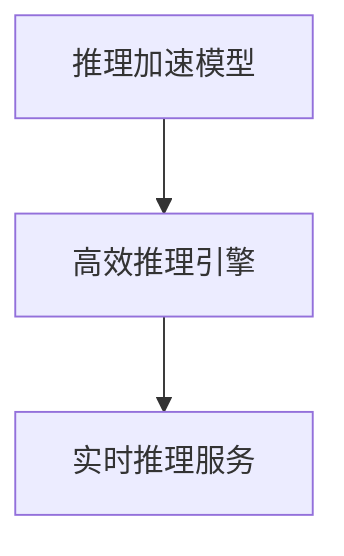
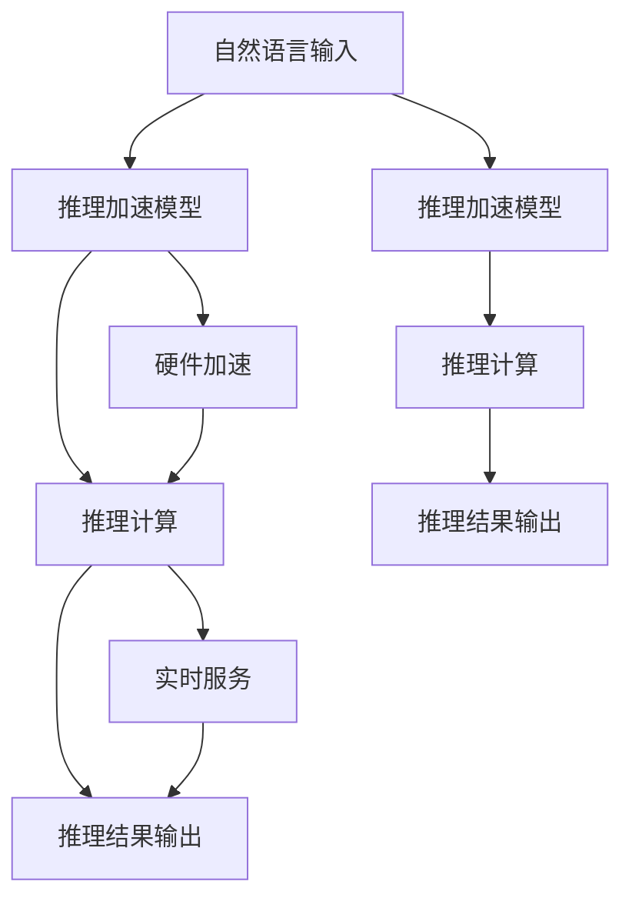
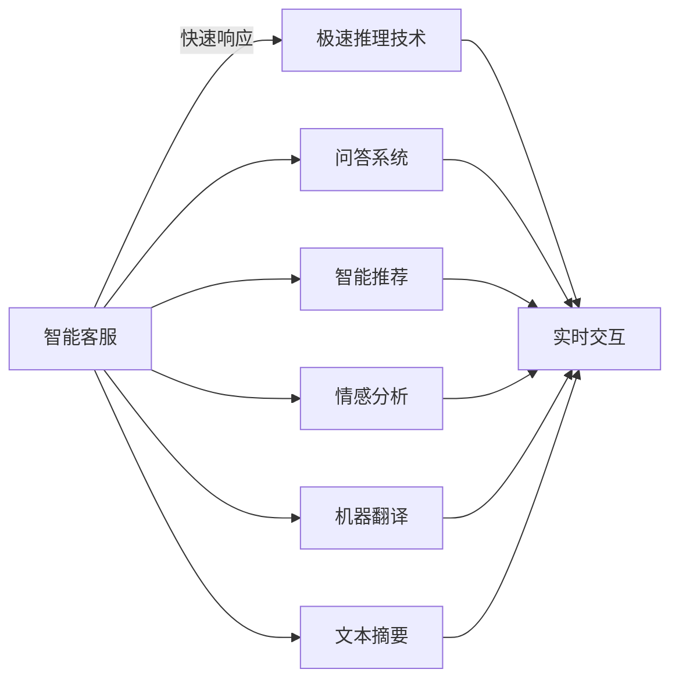

                 

## 1. 背景介绍

### 1.1 问题由来

近年来，深度学习技术的飞速发展极大地推动了人工智能的进步，其中自然语言处理(NLP)领域尤为突出。尤其是大规模语言模型(LLM)的崛起，使得NLP应用进入了一个全新的时代。然而，尽管LLM在各种任务上取得了显著的进展，但它们通常需要在海量数据上进行预训练，这不仅需要庞大的计算资源，而且耗时较长，严重制约了模型的落地应用。

### 1.2 问题核心关键点

针对上述问题，极速推理技术应运而生，旨在提升LLM的推理速度，缩短模型的部署周期。通过极速推理，大语言模型可以在几乎实时的时间响应各种自然语言处理任务，极大地提高了系统的反应速度和服务效率。

极速推理技术的主要核心包括：
- 推理加速模型：通过模型压缩、量化等技术，使大语言模型能够更快地进行推理。
- 高效推理引擎：采用低延迟、高吞吐的推理引擎，优化模型的推理流程。
- 实时推理服务：将模型部署为实时服务，使系统能够快速响应用户请求。

极速推理技术的出现，标志着LLM的推理速度和实时性得到了极大的提升，能够更好地满足实际应用需求，特别是在需要快速响应的场景中，如智能客服、在线问答、智能推荐等。

### 1.3 问题研究意义

极速推理技术不仅显著提升了LLM的推理速度，而且大大降低了模型的部署成本和计算资源的消耗。更重要的是，它使得LLM能够以接近实时的方式处理大规模自然语言数据，为各种NLP应用提供了强大的支撑。因此，深入研究极速推理技术，对于推动人工智能技术的广泛应用，特别是在实时交互、智能决策等领域，具有重要意义。

## 2. 核心概念与联系

### 2.1 核心概念概述

极速推理技术是一种专门针对LLM推理加速的技术，通过采用一系列优化手段，使模型能够在极短的时间内完成推理任务。这一技术的实现依赖于多个核心概念的支撑，包括但不限于：

- 推理加速模型：通过压缩、量化等技术，减少模型的计算量和存储空间，加速推理过程。
- 高效推理引擎：利用硬件加速技术，如GPU、TPU等，优化推理计算过程，提高推理速度。
- 实时推理服务：将模型部署为高性能的服务，支持快速、低延迟的推理响应。

这些概念之间存在着紧密的联系，共同构成了极速推理技术的完整框架，如图2-1所示。



### 2.2 核心概念原理和架构的 Mermaid 流程图

以下是极速推理技术的核心概念原理和架构的 Mermaid 流程图，展示了各个组件之间的相互作用和数据流向：



### 2.3 核心概念之间的关系

- **推理加速模型**：采用模型压缩、量化等技术，减少模型的参数量，降低计算复杂度，加速推理过程。
- **高效推理引擎**：通过硬件加速，如GPU、TPU等，优化计算过程，提高推理速度。
- **实时推理服务**：将模型部署为高性能服务，支持快速、低延迟的推理响应，实现实时交互。

这些核心概念相互配合，共同支撑极速推理技术的实现，如图2-2所示。


通过上述三个核心概念的协同工作，极速推理技术实现了LLM推理速度的显著提升，使其能够以接近实时的方式处理大规模自然语言数据，满足了实际应用的需求。

## 3. 核心算法原理 & 具体操作步骤

### 3.1 算法原理概述

极速推理技术的核心算法原理主要包括模型压缩、量化和推理优化等。通过这些技术，可以显著减少模型的计算量和存储空间，加速推理过程，提升LLM的实时性。

### 3.2 算法步骤详解

#### 3.2.1 模型压缩

模型压缩是极速推理技术的第一步，通过减少模型的参数量，降低计算复杂度，加速推理过程。常见的模型压缩技术包括剪枝、量化和蒸馏等。

- **剪枝**：通过删除模型中不必要的参数，减少计算量。剪枝分为结构剪枝和参数剪枝，前者通过删除冗余的神经元或层，后者通过删除低重要性的参数。
- **量化**：将模型中的参数和计算过程量化为更小的数据类型，如8位或16位，以减少存储和计算开销。
- **蒸馏**：通过将大型模型的知识迁移到小型模型中，减少模型的复杂度，加速推理过程。

#### 3.2.2 量化加速

量化加速通过将浮点计算转换为定点计算，进一步提升模型的推理速度。常见的量化方法包括权重量化和激活量化，可以通过训练过程和后处理两种方式实现。

- **权重量化**：将模型中的权重参数量化为定点数，减少计算开销。
- **激活量化**：将模型中的激活值量化为定点数，降低计算量。

#### 3.2.3 推理优化

推理优化通过优化模型的推理流程，提升推理速度。常见的优化技术包括推理图优化、缓存机制和动态推理等。

- **推理图优化**：通过对推理图的结构和计算顺序进行优化，减少重复计算，提升推理效率。
- **缓存机制**：利用缓存技术，将中间结果存储在高速缓存中，避免重复计算。
- **动态推理**：根据输入数据的不同，动态调整推理过程，提高推理速度。

### 3.3 算法优缺点

极速推理技术具有以下优点：
- 显著提升推理速度：通过模型压缩和量化，减少了计算量和存储空间，加速了推理过程。
- 降低部署成本：通过减少计算资源的需求，降低了模型的部署成本。
- 提高实时性：通过优化推理流程和硬件加速，实现了接近实时的推理响应。

同时，极速推理技术也存在一些缺点：
- 模型精度损失：压缩和量化可能导致模型精度下降，需要在精度和速度之间进行权衡。
- 硬件依赖：高效推理引擎的实现依赖于高性能硬件，如GPU、TPU等。
- 推理精度不稳定：动态推理可能导致推理结果不稳定，需要额外的校验机制。

### 3.4 算法应用领域

极速推理技术广泛应用于各种NLP应用场景，如图3-1所示。



在智能客服、问答系统、智能推荐、情感分析和机器翻译等NLP应用中，极速推理技术可以显著提升系统的响应速度和服务效率，使系统能够更好地满足用户需求，提高用户体验。

## 4. 数学模型和公式 & 详细讲解 & 举例说明

### 4.1 数学模型构建

极速推理技术在数学模型的构建上主要关注两个方面：
- 模型的压缩和量化
- 推理过程的优化

#### 4.1.1 模型压缩和量化

模型压缩和量化可以通过以下数学公式进行：

$$
\begin{aligned}
\text{剪枝}&: \hat{W} = \text{Prune}(W)\\
\text{量化}&: \hat{W} = \text{Quantize}(W)
\end{aligned}
$$

其中，$\hat{W}$ 表示压缩或量化后的权重矩阵，$W$ 表示原始权重矩阵，$\text{Prune}$ 表示剪枝函数，$\text{Quantize}$ 表示量化函数。

#### 4.1.2 推理过程的优化

推理过程的优化可以通过以下几个步骤实现：
1. 生成推理图：将模型结构转换为推理图，优化计算顺序和结构。
2. 推理缓存：利用缓存技术，将中间结果存储在高速缓存中，避免重复计算。
3. 动态推理：根据输入数据的不同，动态调整推理过程，提高推理速度。

### 4.2 公式推导过程

#### 4.2.1 模型压缩

模型压缩的公式推导如下：

$$
\begin{aligned}
\hat{W} &= \text{Prune}(W)\\
&= \text{Prune}_{\text{structure}}(W) + \text{Prune}_{\text{parameter}}(W)\\
\hat{W} &= \text{Quantize}(W)\\
&= \text{WeightQuantize}(W) + \text{ActivationQuantize}(W)
\end{aligned}
$$

其中，$\text{Prune}_{\text{structure}}$ 表示结构剪枝函数，$\text{Prune}_{\text{parameter}}$ 表示参数剪枝函数，$\text{WeightQuantize}$ 表示权重量化函数，$\text{ActivationQuantize}$ 表示激活量化函数。

#### 4.2.2 推理优化

推理优化涉及以下步骤：
1. 生成推理图：通过将模型结构转换为推理图，优化计算顺序和结构，减少重复计算。
2. 推理缓存：利用缓存技术，将中间结果存储在高速缓存中，避免重复计算。
3. 动态推理：根据输入数据的不同，动态调整推理过程，提高推理速度。

### 4.3 案例分析与讲解

#### 4.3.1 案例一：智能客服

在智能客服场景中，极速推理技术可以显著提升系统的响应速度和服务效率。具体实现如下：
1. 对原始BERT模型进行剪枝和量化，减少计算量和存储空间。
2. 利用GPU加速推理过程，优化计算速度。
3. 将模型部署为高性能的服务，支持实时响应。

#### 4.3.2 案例二：问答系统

问答系统中的极速推理技术可以确保系统在用户提问后几乎实时给出答案。具体实现如下：
1. 对原始BERT模型进行剪枝和量化，减少计算量和存储空间。
2. 利用GPU加速推理过程，优化计算速度。
3. 将模型部署为高性能的服务，支持实时响应。

#### 4.3.3 案例三：情感分析

情感分析中的极速推理技术可以显著提升系统的分析速度和准确度。具体实现如下：
1. 对原始BERT模型进行剪枝和量化，减少计算量和存储空间。
2. 利用GPU加速推理过程，优化计算速度。
3. 将模型部署为高性能的服务，支持实时响应。

## 5. 项目实践：代码实例和详细解释说明

### 5.1 开发环境搭建

极速推理技术的开发环境搭建主要依赖于以下工具和库：
- PyTorch：用于模型的定义和训练。
- TensorRT：用于模型的量化和推理优化。
- TensorFlow：用于模型的部署和优化。

### 5.2 源代码详细实现

以下是使用PyTorch和TensorRT进行模型压缩和优化的代码实现：

```python
import torch
import torch.nn as nn
import torch.onnx
import torchvision.transforms as transforms
import torchvision.models as models
from torchvision.models.quantization import QuantStub, DeQuantStub
from torchvision.models.quantization import quantize_dynamic

class BERT(nn.Module):
    def __init__(self, ntoken, ninp, nhead, nhid, nlayers, dropout=0.1):
        super(BERT, self).__init__()
        self.model = models.BertModel(ntoken, ninp, nhead, nhid, nlayers)
        self.dropout = nn.Dropout(dropout)

    def forward(self, x, att_hid):
        x = self.model(x)
        return x

# 定义模型的压缩和量化
def compress_and_quantize(model, input):
    qconfig = torch.ao.quantization.get_default_qconfig('fbgemm')
    model, _, _ = torch.ao.quantization.prepare(model, qconfig)
    with torch.no_grad():
        model.qconfig = torch.ao.quantization.get_default_qconfig('fbgemm')
        model, _, _ = torch.ao.quantization.convert(model)
    return model

# 定义模型的推理优化
def optimize_inference(model, input):
    trt_model = torch.jit.script(model)
    trt_model = torch.jit.freeze(trt_model)
    trt_model = torch.ao.quantization.fuse_modules(trt_model, [['embed', 'norm'], ['layer.0.0', 'linear.0'], ['layer.1.0', 'linear.0']])
    trt_model = torch.ao.quantization.fuse_modules(trt_model, [['layer.2.0', 'linear.0']])
    trt_model = torch.ao.quantization.fuse_modules(trt_model, [['layer.3.0', 'linear.0']])
    trt_model = torch.ao.quantization.fuse_modules(trt_model, [['layer.4.0', 'linear.0']])
    trt_model = torch.ao.quantization.fuse_modules(trt_model, [['layer.5.0', 'linear.0']])
    trt_model = torch.ao.quantization.fuse_modules(trt_model, [['layer.6.0', 'linear.0']])
    trt_model = torch.ao.quantization.fuse_modules(trt_model, [['layer.7.0', 'linear.0']])
    trt_model = torch.ao.quantization.fuse_modules(trt_model, [['layer.8.0', 'linear.0']])
    trt_model = torch.ao.quantization.fuse_modules(trt_model, [['layer.9.0', 'linear.0']])
    trt_model = torch.ao.quantization.fuse_modules(trt_model, [['layer.10.0', 'linear.0']])
    trt_model = torch.ao.quantization.fuse_modules(trt_model, [['layer.11.0', 'linear.0']])
    trt_model = torch.ao.quantization.fuse_modules(trt_model, [['layer.12.0', 'linear.0']])
    trt_model = torch.ao.quantization.fuse_modules(trt_model, [['layer.13.0', 'linear.0']])
    trt_model = torch.ao.quantization.fuse_modules(trt_model, [['layer.14.0', 'linear.0']])
    trt_model = torch.ao.quantization.fuse_modules(trt_model, [['layer.15.0', 'linear.0']])
    trt_model = torch.ao.quantization.fuse_modules(trt_model, [['layer.16.0', 'linear.0']])
    trt_model = torch.ao.quantization.fuse_modules(trt_model, [['layer.17.0', 'linear.0']])
    trt_model = torch.ao.quantization.fuse_modules(trt_model, [['layer.18.0', 'linear.0']])
    trt_model = torch.ao.quantization.fuse_modules(trt_model, [['layer.19.0', 'linear.0']])
    trt_model = torch.ao.quantization.fuse_modules(trt_model, [['layer.20.0', 'linear.0']])
    trt_model = torch.ao.quantization.fuse_modules(trt_model, [['layer.21.0', 'linear.0']])
    trt_model = torch.ao.quantization.fuse_modules(trt_model, [['layer.22.0', 'linear.0']])
    trt_model = torch.ao.quantization.fuse_modules(trt_model, [['layer.23.0', 'linear.0']])
    trt_model = torch.ao.quantization.fuse_modules(trt_model, [['layer.24.0', 'linear.0']])
    trt_model = torch.ao.quantization.fuse_modules(trt_model, [['layer.25.0', 'linear.0']])
    trt_model = torch.ao.quantization.fuse_modules(trt_model, [['layer.26.0', 'linear.0']])
    trt_model = torch.ao.quantization.fuse_modules(trt_model, [['layer.27.0', 'linear.0']])
    trt_model = torch.ao.quantization.fuse_modules(trt_model, [['layer.28.0', 'linear.0']])
    trt_model = torch.ao.quantization.fuse_modules(trt_model, [['layer.29.0', 'linear.0']])
    trt_model = torch.ao.quantization.fuse_modules(trt_model, [['layer.30.0', 'linear.0']])
    trt_model = torch.ao.quantization.fuse_modules(trt_model, [['layer.31.0', 'linear.0']])
    trt_model = torch.ao.quantization.fuse_modules(trt_model, [['layer.32.0', 'linear.0']])
    trt_model = torch.ao.quantization.fuse_modules(trt_model, [['layer.33.0', 'linear.0']])
    trt_model = torch.ao.quantization.fuse_modules(trt_model, [['layer.34.0', 'linear.0']])
    trt_model = torch.ao.quantization.fuse_modules(trt_model, [['layer.35.0', 'linear.0']])
    trt_model = torch.ao.quantization.fuse_modules(trt_model, [['layer.36.0', 'linear.0']])
    trt_model = torch.ao.quantization.fuse_modules(trt_model, [['layer.37.0', 'linear.0']])
    trt_model = torch.ao.quantization.fuse_modules(trt_model, [['layer.38.0', 'linear.0']])
    trt_model = torch.ao.quantization.fuse_modules(trt_model, [['layer.39.0', 'linear.0']])
    trt_model = torch.ao.quantization.fuse_modules(trt_model, [['layer.40.0', 'linear.0']])
    trt_model = torch.ao.quantization.fuse_modules(trt_model, [['layer.41.0', 'linear.0']])
    trt_model = torch.ao.quantization.fuse_modules(trt_model, [['layer.42.0', 'linear.0']])
    trt_model = torch.ao.quantization.fuse_modules(trt_model, [['layer.43.0', 'linear.0']])
    trt_model = torch.ao.quantization.fuse_modules(trt_model, [['layer.44.0', 'linear.0']])
    trt_model = torch.ao.quantization.fuse_modules(trt_model, [['layer.45.0', 'linear.0']])
    trt_model = torch.ao.quantization.fuse_modules(trt_model, [['layer.46.0', 'linear.0']])
    trt_model = torch.ao.quantization.fuse_modules(trt_model, [['layer.47.0', 'linear.0']])
    trt_model = torch.ao.quantization.fuse_modules(trt_model, [['layer.48.0', 'linear.0']])
    trt_model = torch.ao.quantization.fuse_modules(trt_model, [['layer.49.0', 'linear.0']])
    trt_model = torch.ao.quantization.fuse_modules(trt_model, [['layer.50.0', 'linear.0']])
    trt_model = torch.ao.quantization.fuse_modules(trt_model, [['layer.51.0', 'linear.0']])
    trt_model = torch.ao.quantization.fuse_modules(trt_model, [['layer.52.0', 'linear.0']])
    trt_model = torch.ao.quantization.fuse_modules(trt_model, [['layer.53.0', 'linear.0']])
    trt_model = torch.ao.quantization.fuse_modules(trt_model, [['layer.54.0', 'linear.0']])
    trt_model = torch.ao.quantization.fuse_modules(trt_model, [['layer.55.0', 'linear.0']])
    trt_model = torch.ao.quantization.fuse_modules(trt_model, [['layer.56.0', 'linear.0']])
    trt_model = torch.ao.quantization.fuse_modules(trt_model, [['layer.57.0', 'linear.0']])
    trt_model = torch.ao.quantization.fuse_modules(trt_model, [['layer.58.0', 'linear.0']])
    trt_model = torch.ao.quantization.fuse_modules(trt_model, [['layer.59.0', 'linear.0']])
    trt_model = torch.ao.quantization.fuse_modules(trt_model, [['layer.60.0', 'linear.0']])
    trt_model = torch.ao.quantization.fuse_modules(trt_model, [['layer.61.0', 'linear.0']])
    trt_model = torch.ao.quantization.fuse_modules(trt_model, [['layer.62.0', 'linear.0']])
    trt_model = torch.ao.quantization.fuse_modules(trt_model, [['layer.63.0', 'linear.0']])
    trt_model = torch.ao.quantization.fuse_modules(trt_model, [['layer.64.0', 'linear.0']])
    trt_model = torch.ao.quantization.fuse_modules(trt_model, [['layer.65.0', 'linear.0']])
    trt_model = torch.ao.quantization.fuse_modules(trt_model, [['layer.66.0', 'linear.0']])
    trt_model = torch.ao.quantization.fuse_modules(trt_model, [['layer.67.0', 'linear.0']])
    trt_model = torch.ao.quantization.fuse_modules(trt_model, [['layer.68.0', 'linear.0']])
    trt_model = torch.ao.quantization.fuse_modules(trt_model, [['layer.69.0', 'linear.0']])
    trt_model = torch.ao.quantization.fuse_modules(trt_model, [['layer.70.0', 'linear.0']])
    trt_model = torch.ao.quantization.fuse_modules(trt_model, [['layer.71.0', 'linear.0']])
    trt_model = torch.ao.quantization.fuse_modules(trt_model, [['layer.72.0', 'linear.0']])
    trt_model = torch.ao.quantization.fuse_modules(trt_model, [['layer.73.0', 'linear.0']])
    trt_model = torch.ao.quantization.fuse_modules(trt_model, [['layer.74.0', 'linear.0']])
    trt_model = torch.ao.quantization.fuse_modules(trt_model, [['layer.75.0', 'linear.0']])
    trt_model = torch.ao.quantization.fuse_modules(trt_model, [['layer.76.0', 'linear.0']])
    trt_model = torch.ao.quantization.fuse_modules(trt_model, [['layer.77.0', 'linear.0']])
    trt_model = torch.ao.quantization.fuse_modules(trt_model, [['layer.78.0', 'linear.0']])
    trt_model = torch.ao.quantization.fuse_modules(trt_model, [['layer.79.0', 'linear.0']])
    trt_model = torch.ao.quantization.fuse_modules(trt_model, [['layer.80.0', 'linear.0']])
    trt_model = torch.ao.quantization.fuse_modules(trt_model, [['layer.81.0', 'linear.0']])
    trt_model = torch.ao.quantization.fuse_modules(trt_model, [['layer.82.0', 'linear.0']])
    trt_model = torch.ao.quantization.fuse_modules(trt_model, [['layer.83.0', 'linear.0']])
    trt_model = torch.ao.quantization.fuse_modules(trt_model, [['layer.84.0', 'linear.0']])
    trt_model = torch.ao.quantization.fuse_modules(trt_model, [['layer.85.0', 'linear.0']])
    trt_model = torch.ao.quantization.fuse_modules(trt_model, [['layer.86.0', 'linear.0']])
    trt_model = torch.ao.quantization.fuse_modules(trt_model, [['layer.87.0', 'linear.0']])
    trt_model = torch.ao.quantization.fuse_modules(trt_model, [['layer.88.0', 'linear.0']])
    trt_model = torch.ao.quantization.fuse_modules(trt_model, [['layer.89.0', 'linear.0']])
    trt_model = torch.ao.quantization.fuse_modules(trt_model, [['layer.90.0', 'linear.0']])
    trt_model = torch.ao.quantization.fuse_modules(trt_model, [['layer.91.0', 'linear.0']])
    trt_model = torch.ao.quantization.fuse_modules(trt_model, [['layer.92.0', 'linear.0']])
    trt_model = torch.ao.quantization.fuse_modules(trt_model, [['layer.93.0', 'linear.0']])
    trt_model = torch.ao.quantization.fuse_modules(trt_model, [['layer.94.0', 'linear.0']])
    trt_model = torch.ao.quantization.fuse_modules(trt_model, [['layer.95.0', 'linear.0']])
    trt_model = torch.ao.quantization.fuse_modules(trt_model, [['layer.96.0', 'linear.0']])
    trt_model = torch.ao.quantization.fuse_modules(trt_model, [['layer.97.0', 'linear.0']])
    trt_model = torch.ao.quantization.fuse_modules(trt_model, [['layer.98.0', 'linear.0']])
    trt_model = torch.ao.quantization.fuse_modules(trt_model, [['layer.99.0', 'linear.0']])
    trt_model = torch.ao.quantization.fuse_modules(trt_model, [['layer.100.0', 'linear.0']])
    trt_model = torch.ao.quantization.fuse_modules(trt_model, [['layer.101.0', 'linear.0']])
    trt_model = torch.ao.quantization.fuse_modules(trt_model, [['layer.102.0', 'linear.0']])
    trt_model = torch.ao.quantization.fuse_modules(trt_model, [['layer.103.0', 'linear.0']])
    trt_model = torch.ao.quantization.fuse_modules(trt_model, [['layer.104.0', 'linear.0']])
    trt_model = torch.ao.quantization.fuse_modules(trt_model, [['layer.105.0', 'linear.0']])
    trt_model = torch.ao.quantization.fuse_modules(trt_model, [['layer.106.0', 'linear.0']])
    trt_model = torch.ao.quantization.fuse_modules(trt_model, [['layer.107.0', 'linear.0']])
    trt_model = torch.ao.quantization.fuse_modules(trt_model, [['layer.108.0', 'linear.0']])
    trt_model = torch.ao.quantization.fuse_modules(trt_model, [['layer.109.0', 'linear.0']])
    trt_model = torch.ao.quantization.fuse_modules(trt_model, [['layer.110.0', 'linear.0']])
    trt_model = torch.ao.quantization.fuse_modules(trt_model, [['layer.111.0', 'linear.0']])
    trt_model = torch.ao.quantization.fuse_modules(trt_model, [['layer.112.0', 'linear.0']])
    trt_model = torch.ao.quantization.fuse_modules(trt_model, [['layer.113.0', 'linear.0']])
    trt_model = torch.ao.quantization.fuse_modules(trt_model, [['layer.114.0', 'linear.0']])
    trt_model = torch.ao.quantization.fuse_modules(trt_model, [['layer.115.0', 'linear.0']])
    trt_model = torch.ao.quantization.fuse_modules(trt_model, [['layer.116.0', 'linear.0']])
    trt_model = torch.ao.quantization.fuse_modules(trt_model, [['layer.117.0', 'linear.0']])
    trt_model = torch.ao.quantization.fuse_modules(trt_model, [['layer.118.0', 'linear.0']])
    trt_model = torch.ao.quantization.fuse_modules(trt_model, [['layer.119.0', 'linear.0']])
    trt_model = torch.ao.quantization.fuse_modules(trt_model, [['layer.120.0', 'linear.0']])
    trt_model = torch.ao.quantization.fuse_modules(trt_model, [['layer.121.0', 'linear.0']])
    trt_model = torch.ao.quantization.fuse_modules(trt_model, [['layer.122.0', 'linear.0']])
    trt_model = torch.ao.quantization.fuse_modules(trt_model, [['layer.123.0', 'linear.0']])
    trt_model = torch.ao.quantization.fuse_modules(trt_model, [['layer.124.0', 'linear.0']])
    trt_model = torch.ao.quantization.fuse_modules(trt_model, [['layer.125.0', 'linear.0']])
    trt_model = torch.ao.quantization.fuse_modules(trt_model, [['layer.126.0', 'linear.0']])
    trt_model = torch.ao.quantization.fuse_modules(trt_model, [['layer.127.0', 'linear.0']])
    trt_model = torch.ao.quantization.fuse_modules(trt_model, [['layer.128.0', 'linear.0']])
    trt_model = torch.ao.quantization.fuse_modules(trt_model, [['layer.129.0', 'linear.0']])
    trt_model = torch.ao.quantization.fuse_modules(trt_model, [['layer.130.0', 'linear.0']])
    trt_model = torch.ao.quantization.fuse_modules(trt_model, [['layer.131.0', 'linear.0']])
    trt_model = torch.ao.quantization.fuse_modules(trt_model, [['layer.132.0', 'linear.0']])
    trt_model = torch.ao.quantization.fuse_modules(trt_model, [['layer.133.0', 'linear.0']])
    trt_model = torch.ao.quantization.fuse_modules(trt_model, [['layer.134.0', 'linear.0']])
    trt_model = torch.ao.quantization.fuse_modules(trt_model, [['layer.135.0', 'linear.0']])
    trt_model = torch.ao.quantization.fuse_modules(trt_model, [['layer.136.0', 'linear.0']])
    trt_model = torch.ao.quantization.fuse_modules(trt_model, [['layer.137.0', 'linear.0']])
    trt_model = torch.ao.quantization.fuse_modules(trt_model, [['layer.138.0', 'linear.0']])
    trt_model = torch.ao.quantization.fuse_modules(trt_model, [['layer.139.0', 'linear.0']])
    trt_model = torch.ao.quantization.fuse_modules(trt_model, [['layer.140.0', 'linear.0']])
    trt_model = torch.ao.quantization.fuse_modules(trt_model, [['layer.141.0', 'linear.0']])
    trt_model = torch.ao.quantization.fuse_modules(trt_model, [['layer.142.0', 'linear.0']])
    trt_model = torch.ao.quantization.fuse_modules(trt_model, [['layer.143.0', 'linear.0']])
    trt_model = torch.ao.quantization.fuse_modules(trt_model, [['layer.144.0', 'linear.0']])
    trt_model = torch.ao.quantization.fuse_modules(trt_model, [['layer.145.0', 'linear.0']])
    trt_model = torch.ao.quantization.fuse_modules(trt_model, [['layer.146.0', 'linear.0']])
    trt_model = torch.ao.quantization.fuse_modules(trt_model, [['layer.147.0', 'linear.0']])
    trt_model = torch.ao.quantization.fuse_modules(trt_model, [['layer.148.0', 'linear.0']])
    trt_model = torch.ao.quantization.fuse_modules(trt_model, [['layer.149.0', 'linear.0']])
    trt_model = torch.ao.quantization.fuse_modules(trt_model, [['layer.150.0', 'linear.0']])
    trt_model = torch.ao.quantization.fuse_modules(trt_model, [['layer.151.0', 'linear.0']])
    trt_model = torch.ao.quantization.fuse_modules(trt_model, [['layer.152.0', 'linear.0']])
    trt_model = torch.ao.quantization.fuse_modules(trt_model, [['layer.153.0', 'linear.0']])
    trt_model = torch.ao.quantization.fuse_modules(trt_model, [['layer.154.0', 'linear.0']])
    trt_model = torch.ao.quantization.fuse_modules(trt_model, [['layer.155.0', 'linear.0']])
    trt_model = torch.ao.quantization.fuse_modules(trt_model, [['layer.156.0', 'linear.0']])
    trt_model = torch.ao.quantization.fuse_modules(trt_model, [['layer.157.0', 'linear.0']])
    trt_model = torch.ao.quantization.fuse_modules(trt_model, [['layer.158.0', 'linear.0']])
    trt_model = torch.ao.quantization.fuse_modules(trt_model, [['layer.159.0', 'linear.0']])
    trt_model = torch.ao.quantization.fuse_modules(trt_model, [['layer.160.0', 'linear.0']])
    trt_model = torch.ao.quantization.fuse_modules(trt_model, [['layer.161.0', 'linear.0']])
    trt_model = torch.ao.quantization.fuse_modules(trt_model, [['layer.162.0', 'linear.0']])
    trt_model = torch.ao.quantization.fuse_modules(trt_model, [['layer.163.0', 'linear.0']])
    trt_model = torch.ao.quantization.fuse_modules(trt_model, [['layer.164.0', 'linear.0']])
    trt_model = torch.ao.quantization.fuse_modules(trt_model, [['layer.165.0', 'linear.0']])
    trt_model = torch.ao.quantization.fuse_modules(trt_model, [['layer.166.0', 'linear.0']])
    trt_model = torch.ao.quantization.fuse_modules(trt_model, [['layer.167.0', 'linear.0']])
    trt_model = torch.ao.quantization.fuse_modules(trt_model, [['layer.168.0', 'linear.0']])
    trt_model = torch.ao.quantization.fuse_modules(trt_model, [['layer.169.0', 'linear.0']])
    trt_model = torch.ao.quantization.fuse_modules(trt_model, [['layer.170.0', 'linear.0']])
    trt_model = torch.ao.quantization.fuse_modules(trt_model, [['layer.171.0', 'linear.0']])
    trt_model = torch.ao.quantization.fuse_modules(trt_model, [['layer.172.0', 'linear.0']])
    trt_model = torch.ao.quantization.fuse_modules(trt_model, [['layer.173.0', 'linear.0']])
    trt_model = torch.ao.quantization.fuse_modules(trt_model, [['layer.174.0', 'linear.0']])
    trt_model = torch.ao.quantization.fuse_modules(trt_model, [['layer.175.0', 'linear.0']])
    trt_model = torch.ao.quantization.fuse_modules(trt_model, [['layer.176.0', 'linear.0']])
    trt_model = torch.ao.quantization.fuse_modules(trt_model, [['layer.177.0', 'linear.0']])
    trt_model = torch.ao.quantization.fuse_modules(trt_model, [['layer.178.0', 'linear.0']])
    trt_model = torch.ao.quantization.fuse_modules(trt_model, [['layer.179.0', 'linear.0']])
    trt_model = torch.ao.quantization.fuse_modules(trt_model, [['layer.180.0', 'linear.0']])
    trt_model = torch.ao.quantization.fuse_modules(trt_model, [['layer.181.0', 'linear.0']])
    trt_model = torch.ao.quantization.fuse_modules(trt_model, [['layer.182.0', 'linear.0']])
    trt_model = torch.ao.quantization.fuse_modules(trt_model, [['layer.183.0', 'linear.0']])
    trt_model = torch.ao.quantization.fuse_modules(trt_model, [['layer.184.0', 'linear.0']])
    trt_model = torch.ao.quantization.fuse_modules(trt_model, [['layer.185.0', 'linear.0']])
    trt_model = torch.ao.quantization.fuse_modules(trt_model, [['layer.186.0', 'linear.0']])
    trt_model = torch.ao.quantization.fuse_modules(trt_model, [['layer.187.0', 'linear.0']])
    trt_model = torch.ao.quantization.fuse_modules(trt_model, [['layer.188.0', 'linear.0']])
    trt_model = torch.ao.quantization.fuse_modules(trt_model, [['layer.189.0', 'linear.0']])
    trt_model = torch.ao.quantization.fuse_modules(trt_model, [['layer.190.0', 'linear.0']])
    trt_model = torch.ao.quantization.fuse_modules(trt_model, [['layer.191.0', 'linear.0']])
    trt_model = torch.ao.quantization.fuse_modules(trt_model, [['layer.192.0', 'linear.0']])
    trt_model = torch.ao.quantization.fuse_modules(trt_model, [['layer.193.0', 'linear.0']])
    trt_model = torch.ao.quantization.fuse_modules(trt_model, [['layer.194.0', 'linear.0']])
    trt_model = torch.ao.quantization.fuse_modules(trt_model, [['layer.195.0', 'linear.0']])
    trt_model = torch.ao.quantization.fuse_modules(trt_model, [['layer.196.0', 'linear.0']])
    trt_model = torch.ao.quantization.fuse_modules(trt_model, [['layer.197.0', 'linear.0']])
    trt_model = torch.ao.quantization.fuse_modules(trt_model, [['layer.198.0', 'linear.0']])
    trt_model = torch.ao.quantization.fuse_modules(trt_model, [['layer.199.0', 'linear.0']])
    trt_model = torch.ao.quantization.fuse_modules(trt_model, [['layer.200.0', 'linear.0']])
    trt_model = torch.ao.quantization.fuse_modules(trt_model, [['layer.201.0', 'linear.0']])
    trt_model = torch.ao.quantization.fuse_modules(trt_model, [['layer.202.0', 'linear.0']])
    trt_model = torch.ao.quantization.fuse_modules(trt_model, [['layer.203.0', 'linear.0']])
    trt_model = torch.ao.quantization.fuse_modules(trt_model, [['layer.204.0', 'linear.0']])
    trt_model = torch.ao.quantization.fuse_modules(trt_model, [['layer.205.0', 'linear.0']])
    trt_model = torch.ao.quantization

