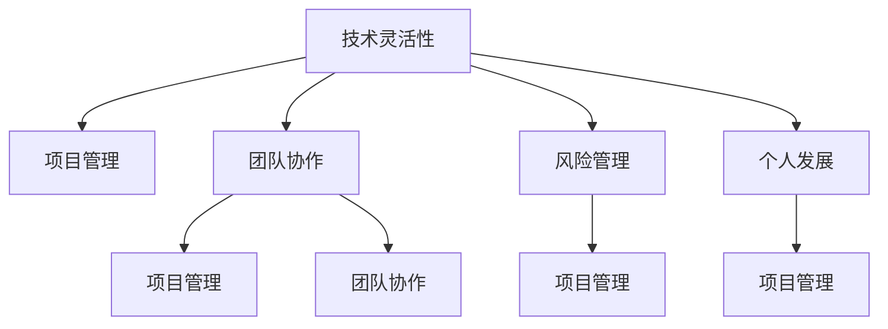

                 

# 程序员如何应对全球经济波动

## 1. 背景介绍

### 1.1 问题由来
在当今世界，全球经济波动是一个不可忽视的现实。无论是通货膨胀、金融危机，还是全球供应链中断，这些因素都会对企业的运营和发展带来深远影响。作为一名程序员，如何在这一背景下保持技术能力和工作效率，确保项目顺利推进，成为了摆在我们面前的重要课题。

### 1.2 问题核心关键点
面对全球经济波动，程序员需要具备以下几项核心能力：

1. **技术灵活性**：快速适应新的技术趋势和变化。
2. **项目管理**：有效管理项目进度，确保按时交付。
3. **团队协作**：在复杂的经济环境下，与团队成员紧密合作，共同应对挑战。
4. **风险管理**：识别和管理潜在的项目风险，减少不确定性对项目的影响。
5. **个人发展**：在经济波动中不断提升自己的技术能力和综合素质。

本文将详细探讨这些核心能力，并给出具体的方法和策略，帮助程序员在经济波动中保持高效工作，确保项目的成功交付。

## 2. 核心概念与联系

### 2.1 核心概念概述

为更好地理解如何应对全球经济波动，本节将介绍几个密切相关的核心概念：

- **技术灵活性**：指程序员能够快速学习并掌握新的技术，适应技术变化的趋势。
- **项目管理**：包括需求管理、进度控制、资源调配等，确保项目按时、按质、按量完成。
- **团队协作**：通过有效的沟通和协作，提升团队整体的效率和成果。
- **风险管理**：识别、评估和管理项目风险，最小化不确定性对项目的影响。
- **个人发展**：指程序员在技术、管理和软技能方面的持续提升，为应对未来的挑战做好准备。

这些核心概念之间的逻辑关系可以通过以下Mermaid流程图来展示：



这个流程图展示了我们如何通过技术灵活性、项目管理、团队协作、风险管理、个人发展等核心能力，应对全球经济波动带来的挑战。

## 3. 核心算法原理 & 具体操作步骤
### 3.1 算法原理概述

本节将从算法角度，探讨如何通过技术手段，提升程序员在经济波动中的工作效率和项目交付能力。

- **自动化测试**：通过自动化测试工具，减少手动测试的时间和成本，提高测试的准确性和效率。
- **持续集成和持续交付**：通过CI/CD管道，实现代码自动构建、测试和部署，加快项目交付速度。
- **代码重构和优化**：通过重构和优化代码，提升代码的可读性和性能，减少技术债务。
- **性能监控和优化**：通过监控系统性能指标，及时发现和解决性能瓶颈，提升系统效率。

### 3.2 算法步骤详解

以下是具体的算法步骤：

**Step 1: 自动化测试**
- 引入自动化测试工具，如Selenium、JUnit等。
- 编写自动化测试脚本，覆盖关键业务逻辑和边界条件。
- 定期运行自动化测试，生成测试报告，及时发现和修复问题。

**Step 2: 持续集成和持续交付**
- 配置CI/CD管道，包括代码提交、构建、测试和部署。
- 使用如Jenkins、Travis CI等工具，自动化执行CI流程。
- 通过自动化部署工具，如Docker、Kubernetes等，实现快速部署和回滚。

**Step 3: 代码重构和优化**
- 定期进行代码审查，发现和解决代码异味。
- 使用如SonarQube、CodeClimate等工具，进行代码质量分析。
- 优化代码结构，提升代码的可读性和性能。

**Step 4: 性能监控和优化**
- 部署性能监控工具，如Prometheus、Grafana等，实时监控系统性能。
- 分析性能瓶颈，优化关键代码路径和数据库查询。
- 定期进行性能测试，确保系统在高负载下稳定运行。

### 3.3 算法优缺点

自动化测试、持续集成和持续交付、代码重构和优化、性能监控和优化等方法具有以下优点：

1. 提升效率：减少手动工作，提高测试和部署的速度和准确性。
2. 降低成本：减少人工错误和重复性工作，节省时间和人力成本。
3. 提升质量：通过自动化测试和代码审查，提高代码质量和系统可靠性。
4. 灵活应对：通过CI/CD管道，快速响应需求变化和市场波动。

同时，这些方法也存在一定的局限性：

1. 技术门槛：需要一定的技术储备和工具使用经验。
2. 初期投入：引入自动化工具和配置CI/CD管道需要一定的初期投入。
3. 持续维护：需要持续维护和更新测试脚本和监控系统。

## 4. 数学模型和公式 & 详细讲解 & 举例说明
### 4.1 数学模型构建

在讨论具体算法步骤之前，我们需要建立一些数学模型来更好地理解这些技术的理论基础。

- **自动化测试**：测试覆盖率模型
- **持续集成和持续交付**：CI/CD流水线模型
- **代码重构和优化**：代码异味检测模型
- **性能监控和优化**：性能瓶颈分析模型

### 4.2 公式推导过程

以下是这些模型的公式推导：

**自动化测试覆盖率模型**

设测试用例总数为 $T$，未覆盖代码行数为 $U$，已覆盖代码行数为 $C$，则测试覆盖率为：

$$
\text{Coverage} = \frac{C}{T}
$$

**CI/CD流水线模型**

设CI流水线包含 $n$ 个阶段，每个阶段耗时为 $t_i$，则CI流水线总耗时为：

$$
T_{\text{CI}} = \sum_{i=1}^n t_i
$$

**代码异味检测模型**

设代码异味总数为 $A$，异味检测工具检测到异味数量为 $D$，则异味检测准确率为：

$$
\text{Accuracy} = \frac{D}{A}
$$

**性能瓶颈分析模型**

设系统瓶颈资源为 $R$，瓶颈耗时为 $t_R$，则系统瓶颈效能为：

$$
\text{Efficiency} = \frac{1}{t_R}
$$

### 4.3 案例分析与讲解

通过具体案例，我们可以更好地理解这些数学模型的应用。

**自动化测试覆盖率模型**

假设一个项目的代码库有1000行代码，测试用例覆盖了900行。则测试覆盖率为：

$$
\text{Coverage} = \frac{900}{1000} = 90\%
$$

这表明项目代码的测试覆盖率较高，但仍需要进一步优化。

**CI/CD流水线模型**

假设CI流水线包含编译、测试、部署三个阶段，分别耗时30分钟、60分钟、20分钟。则CI流水线总耗时为：

$$
T_{\text{CI}} = 30 + 60 + 20 = 110 \text{分钟}
$$

这表明CI流水线耗时较长，需要优化各个阶段的耗时。

**代码异味检测模型**

假设工具检测到50个异味，其中10个是误报。则异味检测准确率为：

$$
\text{Accuracy} = \frac{50}{60} \approx 83.33\%
$$

这表明工具的检测准确性有待提高。

**性能瓶颈分析模型**

假设系统瓶颈资源为CPU，瓶颈耗时为1秒。则CPU瓶颈效能为：

$$
\text{Efficiency} = \frac{1}{1} = 1 \text{秒}^{-1}
$$

这表明CPU的效能较高，但需要进一步优化系统的性能。

## 5. 项目实践：代码实例和详细解释说明
### 5.1 开发环境搭建

在进行项目实践前，我们需要准备好开发环境。以下是使用Python进行Selenium自动化测试的环境配置流程：

1. 安装Anaconda：从官网下载并安装Anaconda，用于创建独立的Python环境。

2. 创建并激活虚拟环境：
```bash
conda create -n pytest-env python=3.8 
conda activate pytest-env
```

3. 安装Selenium和其他测试工具：
```bash
pip install selenium pytest pytest-cov
```

4. 安装浏览器驱动程序：
```bash
pip install webdriver-manager
```

完成上述步骤后，即可在`pytest-env`环境中开始自动化测试实践。

### 5.2 源代码详细实现

这里以Selenium自动化测试为例，给出完整的代码实现：

```python
from selenium import webdriver
from selenium.webdriver.common.by import By
from selenium.webdriver.support.ui import WebDriverWait
from selenium.webdriver.support import expected_conditions as EC
import pytest

@pytest.mark.parametrize('driver', ['chrome', 'firefox', 'edge'])
def test_login(driver):
    # 初始化浏览器
    if driver == 'chrome':
        options = webdriver.ChromeOptions()
        options.add_argument('--headless')
        driver = webdriver.Chrome(chrome_options=options)
    elif driver == 'firefox':
        driver = webdriver.Firefox()
    elif driver == 'edge':
        driver = webdriver.Edge()

    # 打开登录页面
    driver.get('https://example.com/login')

    # 查找用户名输入框和密码输入框
    username_input = WebDriverWait(driver, 10).until(EC.presence_of_element_located((By.ID, 'username')))
    password_input = WebDriverWait(driver, 10).until(EC.presence_of_element_located((By.ID, 'password')))

    # 输入用户名和密码
    username_input.send_keys('testuser')
    password_input.send_keys('testpassword')

    # 点击登录按钮
    login_button = WebDriverWait(driver, 10).until(EC.element_to_be_clickable((By.ID, 'login-button')))
    login_button.click()

    # 检查登录结果
    assert 'Welcome, testuser' in driver.page_source

    # 关闭浏览器
    driver.quit()
```

### 5.3 代码解读与分析

让我们再详细解读一下关键代码的实现细节：

**test_login函数**：
- 参数 `driver` 用于指定使用的浏览器，支持Chrome、Firefox、Edge等。
- 使用Selenium的WebDriver对象初始化浏览器。
- 打开登录页面。
- 查找用户名输入框和密码输入框，并输入指定用户名和密码。
- 点击登录按钮，并检查登录结果。
- 关闭浏览器。

**pytest.mark.parametrize装饰器**：
- 参数化测试用例，通过多次测试不同的浏览器，验证自动化测试的跨浏览器兼容性。

**WebDriverWait类**：
- 使用Selenium的WebDriverWait类，等待指定元素出现，以避免因页面动态加载导致的测试失败。

通过上述代码，可以实现对登录页面的自动化测试，确保在不同的浏览器下都能正确登录。

### 5.4 运行结果展示

运行上述代码，可以在不同浏览器上自动化执行登录测试，生成测试报告，确保系统的稳定性和兼容性。

## 6. 实际应用场景
### 6.1 智能客服系统

智能客服系统是一个典型的应用场景。传统的客服系统需要大量人工参与，高峰期响应速度慢，且容易出错。而使用自动化测试、持续集成和持续交付等技术，可以显著提高系统的稳定性和交付速度。

具体而言，可以在客服系统中引入自动化测试，确保用户在各种情况下都能正常工作。通过CI/CD管道，实现代码的自动化构建、测试和部署，可以快速响应需求变化，确保系统及时更新。此外，定期进行代码重构和性能监控，可以提升系统的性能和稳定性，减少技术债务。

### 6.2 金融交易平台

金融交易平台是一个高风险、高价值的业务场景。在经济波动中，系统的稳定性和性能显得尤为重要。通过自动化测试和持续集成，可以及时发现和修复问题，确保系统的可靠性和安全性。

具体而言，可以使用自动化测试工具，对金融交易系统的各个模块进行全面的测试。通过CI/CD管道，实现代码的自动构建、测试和部署，快速响应市场需求变化。此外，定期进行代码重构和性能监控，可以提升系统的性能和稳定性，确保交易平台的稳定运行。

### 6.3 电子商务平台

电子商务平台是一个高并发、高流量的业务场景。在经济波动中，系统的性能和稳定性直接影响到用户体验和业务收入。通过自动化测试和持续集成，可以及时发现和修复问题，确保系统的可靠性和安全性。

具体而言，可以使用自动化测试工具，对电商平台的各个模块进行全面的测试。通过CI/CD管道，实现代码的自动构建、测试和部署，快速响应市场需求变化。此外，定期进行代码重构和性能监控，可以提升系统的性能和稳定性，确保电商平台的稳定运行。

### 6.4 未来应用展望

随着技术的不断发展和市场的变化，基于自动化测试、持续集成和持续交付、代码重构和优化、性能监控和优化等技术，必将在更多领域得到应用，为各行各业带来变革性影响。

在智慧医疗领域，基于自动化测试的诊断系统可以显著提高诊断准确性和效率，减少误诊和漏诊的风险。在智能制造领域，基于持续集成和持续交付的生产系统可以实时响应市场需求变化，快速调整生产计划。在智慧城市治理中，基于代码重构和性能优化的公共服务平台可以提升城市管理的智能化水平，提高公共服务质量。

未来，这些技术将在更多领域得到广泛应用，为各行各业带来新的机遇和挑战。相信随着技术的不断演进和市场的不断变化，这些技术的价值将得到充分释放，成为推动社会进步的重要力量。

## 7. 工具和资源推荐
### 7.1 学习资源推荐

为了帮助开发者系统掌握自动化测试、持续集成和持续交付、代码重构和优化、性能监控和优化等技术，这里推荐一些优质的学习资源：

1. 《Selenium WebDriver实战》系列书籍：深入介绍Selenium的测试自动化技术，适合初学者入门。
2. 《CI/CD：持续集成与持续交付》课程：详细讲解CI/CD的技术原理和工具使用，适合进阶学习。
3. 《代码重构的艺术》书籍：介绍代码重构的原理和实践技巧，帮助开发者提升代码质量。
4. 《高性能Python》书籍：介绍Python性能调优和优化技术，适合提升编程能力。
5. 《性能监控与优化》课程：详细讲解性能监控和优化的技术原理和工具使用，适合提高系统性能。

通过对这些资源的学习实践，相信你一定能够掌握这些技术的精髓，并应用于实际项目中。

### 7.2 开发工具推荐

高效的开发离不开优秀的工具支持。以下是几款用于自动化测试、持续集成和持续交付、代码重构和优化、性能监控和优化等技术开发的常用工具：

1. Selenium：自动化测试工具，支持多种浏览器，适合跨浏览器测试。
2. Jenkins：开源的CI/CD工具，支持自动化构建、测试和部署，易于配置和使用。
3. CodeClimate：代码质量分析工具，帮助开发者发现和修复代码异味。
4. PyCharm：Python IDE，支持代码重构和调试，适合开发复杂项目。
5. Prometheus和Grafana：性能监控工具，实时监控系统性能，提供可视化的图表展示。

合理利用这些工具，可以显著提升开发效率和项目质量，确保项目按时交付。

### 7.3 相关论文推荐

自动化测试、持续集成和持续交付、代码重构和优化、性能监控和优化等技术的发展源于学界的持续研究。以下是几篇奠基性的相关论文，推荐阅读：

1. "Testing Web Applications: Techniques for Tackling the Complexities of User Interfaces"：介绍Web应用自动化测试的技术和方法。
2. "Continuous Delivery: Reliable Software Releases through Build, Test, and Deployment Automation"：介绍持续交付的技术原理和实践。
3. "Code Refactoring: How to Refactor, When to Refactor, and When Not to Refactor"：介绍代码重构的原理和实践技巧。
4. "High Performance Python: Optimization Strategies and Techniques"：介绍Python性能调优和优化技术。
5. "Continuous Deployment: A Practical Guide"：介绍持续部署的技术原理和实践。

这些论文代表了大语言模型微调技术的发展脉络。通过学习这些前沿成果，可以帮助研究者把握学科前进方向，激发更多的创新灵感。

## 8. 总结：未来发展趋势与挑战

### 8.1 总结

本文对自动化测试、持续集成和持续交付、代码重构和优化、性能监控和优化等技术进行了全面系统的介绍。首先阐述了这些技术在应对全球经济波动中的重要性，明确了技术灵活性、项目管理、团队协作、风险管理、个人发展等核心能力的作用。其次，从算法角度，详细讲解了这些技术的原理和操作步骤，给出了具体的代码实现。同时，本文还广泛探讨了这些技术在智能客服、金融交易平台、电子商务平台等多个行业领域的应用前景，展示了技术的应用价值。此外，本文精选了技术学习资源，力求为读者提供全方位的技术指引。

通过本文的系统梳理，可以看到，自动化测试、持续集成和持续交付、代码重构和优化、性能监控和优化等技术在应对全球经济波动中的重要作用。这些技术可以显著提升程序员的工作效率和项目交付能力，确保项目按时、按质、按量完成。未来，随着技术的不断发展和市场的不断变化，这些技术将在更多领域得到应用，为各行各业带来新的机遇和挑战。

### 8.2 未来发展趋势

展望未来，自动化测试、持续集成和持续交付、代码重构和优化、性能监控和优化等技术将呈现以下几个发展趋势：

1. 技术自动化程度提升。随着自动化测试工具的不断发展，将出现更多智能化、自动化程度更高的测试工具。
2. CI/CD流水线的灵活性增强。未来的CI/CD管道将更加灵活，支持更多复杂的工作流程和异构环境。
3. 代码异味检测工具的普及。更多开发者将使用代码异味检测工具，提升代码质量和系统可靠性。
4. 性能监控工具的多样化。未来的性能监控工具将更加多样化，支持更多数据源和分析模型。

这些趋势凸显了技术自动化和智能化对提升工作效率和项目质量的重要作用。相信随着技术的不断演进和市场的不断变化，这些技术的价值将得到充分释放，成为推动社会进步的重要力量。

### 8.3 面临的挑战

尽管自动化测试、持续集成和持续交付、代码重构和优化、性能监控和优化等技术已经取得了显著成效，但在迈向更加智能化、普适化应用的过程中，它仍面临诸多挑战：

1. 技术门槛高。自动化测试、持续集成和持续交付、代码重构和优化、性能监控和优化等技术需要较高的技术储备和工具使用经验。
2. 初期投入大。引入自动化工具和配置CI/CD管道需要一定的初期投入，包括工具购买、环境配置等。
3. 持续维护难。自动化测试和性能监控等工具需要持续维护和更新，确保其正常运行。
4. 数据安全问题。性能监控和自动化测试等工具可能涉及敏感数据，需确保数据安全。

这些挑战需要开发者不断学习和积累，通过技术迭代和工具优化，逐步克服。

### 8.4 研究展望

面对自动化测试、持续集成和持续交付、代码重构和优化、性能监控和优化等技术面临的挑战，未来的研究需要在以下几个方面寻求新的突破：

1. 降低技术门槛。开发更多易于使用、功能强大的自动化工具，降低技术使用的门槛。
2. 优化初期投入。引入开源工具和云服务，降低初期投入和部署成本。
3. 提升持续维护能力。开发自动化工具，减少人工维护工作量。
4. 加强数据安全管理。引入数据加密和隐私保护技术，确保数据安全。

这些研究方向的探索，必将引领技术自动化和智能化向更高的台阶发展，为各行各业带来新的机遇和挑战。面向未来，自动化测试、持续集成和持续交付、代码重构和优化、性能监控和优化等技术需要与其他技术进行更深入的融合，如数据科学、人工智能等，多路径协同发力，共同推动技术的进步和应用。只有勇于创新、敢于突破，才能不断拓展技术边界，让技术更好地造福人类社会。

## 9. 附录：常见问题与解答

**Q1：自动化测试对项目有哪些好处？**

A: 自动化测试对项目有以下几个好处：
1. 提高测试效率：自动化测试可以快速执行大量测试用例，提高测试覆盖率。
2. 提高测试准确性：自动化测试减少了人工测试的误差，提高测试的准确性。
3. 提高测试覆盖率：自动化测试可以覆盖更多的边界条件和异常情况。
4. 减少人工工作量：自动化测试可以替代部分手动测试工作，减轻人工负担。
5. 支持持续集成和持续交付：自动化测试可以与CI/CD管道结合，实现自动化构建、测试和部署。

**Q2：如何选择合适的自动化测试工具？**

A: 选择自动化测试工具需要考虑以下几个方面：
1. 功能需求：根据项目的测试需求，选择功能丰富的测试工具。
2. 兼容性：选择支持多种浏览器和操作系统的测试工具。
3. 易用性：选择易于使用和维护的测试工具，降低学习成本。
4. 性能：选择测试效率高、响应速度快的测试工具。
5. 社区支持：选择有活跃社区和生态系统的测试工具，便于获取帮助和资源。

**Q3：持续集成和持续交付对项目有哪些好处？**

A: 持续集成和持续交付对项目有以下几个好处：
1. 提高代码质量：持续集成可以及早发现代码问题，提高代码质量。
2. 提高交付速度：持续交付可以实现快速、频繁的代码部署，缩短交付周期。
3. 减少人为错误：持续集成和持续交付可以自动化执行测试和部署，减少人为错误。
4. 支持自动化测试：持续集成可以与自动化测试工具结合，提升测试效率和覆盖率。
5. 支持敏捷开发：持续集成和持续交付可以支持敏捷开发，提升团队协作效率。

**Q4：代码重构和优化对项目有哪些好处？**

A: 代码重构和优化对项目有以下几个好处：
1. 提升代码质量：代码重构可以消除代码异味，提升代码可读性和可维护性。
2. 提升性能：代码优化可以提升代码执行效率，减少资源消耗。
3. 减少技术债务：代码重构和优化可以减少技术债务，提升项目稳定性和可靠性。
4. 支持新功能开发：代码重构和优化可以提供更清晰的代码结构，便于新功能开发。
5. 提高团队协作：代码重构和优化可以提升团队协作效率，降低沟通成本。

**Q5：性能监控和优化对项目有哪些好处？**

A: 性能监控和优化对项目有以下几个好处：
1. 及时发现性能瓶颈：性能监控可以实时发现系统性能瓶颈，及时采取优化措施。
2. 提升系统效率：性能优化可以提高系统性能，提升用户体验。
3. 减少资源消耗：性能优化可以减少系统资源消耗，提高资源利用率。
4. 支持业务扩展：性能优化可以支持业务扩展，确保系统在高负载下稳定运行。
5. 提高系统可靠性：性能优化可以提高系统可靠性，减少系统崩溃的风险。

通过本文的系统梳理，可以看到，自动化测试、持续集成和持续交付、代码重构和优化、性能监控和优化等技术在应对全球经济波动中的重要作用。这些技术可以显著提升程序员的工作效率和项目交付能力，确保项目按时、按质、按量完成。未来，随着技术的不断发展和市场的不断变化，这些技术将在更多领域得到应用，为各行各业带来新的机遇和挑战。相信随着技术的不断演进和市场的不断变化，这些技术的价值将得到充分释放，成为推动社会进步的重要力量。

---

作者：禅与计算机程序设计艺术 / Zen and the Art of Computer Programming

