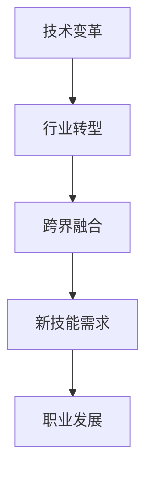
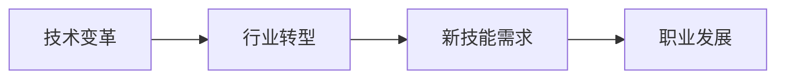

                 

# 程序员如何应对行业变革与转型

> 关键词：技术变革, 行业转型, 跨界融合, 人工智能, 云计算, 大数据, DevOps, 区块链, 低代码, 全栈开发

## 1. 背景介绍

### 1.1 问题由来
随着科技日新月异，各行各业正在经历前所未有的变革。信息技术在驱动社会生产力发展的同时，也在不断重塑着产业形态和商业模式。作为一名程序员，如何在这一变革浪潮中脱颖而出，不仅是技术上的挑战，更是职业发展的必然选择。本文将探讨当前技术变革背景下的行业转型趋势，帮助程序员理解并掌握应对策略。

### 1.2 问题核心关键点
1. **技术变革**：信息技术正快速从传统的硬件和软件架构转向基于云计算、人工智能和大数据的解决方案。
2. **行业转型**：许多传统行业如金融、医疗、制造等都在向数字化、智能化方向转型，信息技术在其中的作用越来越重要。
3. **跨界融合**：不同领域的技术正在融合，如人工智能与区块链、云计算与物联网等，交叉创新带来了新的发展机遇。
4. **新技能需求**：新兴技术对程序员的技能提出了更高要求，如云计算架构、数据科学、DevOps、全栈开发等。
5. **职业发展**：技术的快速迭代要求程序员持续学习，提高自身竞争力，以适应不断变化的市场需求。

## 2. 核心概念与联系

### 2.1 核心概念概述

为了更好地理解如何应对行业变革与转型，我们首先需要对以下核心概念进行梳理：

- **技术变革**：信息技术从传统的软件与硬件转向以云计算、人工智能和大数据为核心的新型架构。
- **行业转型**：传统行业通过引入信息技术，实现数字化、智能化转型，提升效率和竞争力。
- **跨界融合**：不同领域的技术相互渗透，产生新的创新模式和应用场景。
- **新技能需求**：新兴技术对程序员提出了新的技能要求，如云计算、数据科学、DevOps、全栈开发等。
- **职业发展**：程序员需不断学习新技术，提升自身竞争力，以适应市场变化。

这些概念之间的联系如下图所示：



### 2.2 核心概念原理和架构的 Mermaid 流程图

下面是一个简单的Mermaid流程图，展示了技术变革如何推动行业转型，并带来新的技能需求和职业发展机会：



## 3. 核心算法原理 & 具体操作步骤
### 3.1 算法原理概述

在技术变革的背景下，行业转型要求程序员掌握新的技术和方法论，以适应快速变化的市场需求。以下是程序员应对行业变革与转型的核心算法原理：

- **云计算**：云计算提供了弹性的计算资源，改变了传统软件的部署方式。程序员需掌握云计算架构、容器化技术、微服务设计等。
- **人工智能**：AI技术如机器学习、深度学习、自然语言处理等，为数据分析和决策提供了新的工具。程序员需学习数据科学、模型训练、优化算法等。
- **大数据**：大数据技术如Hadoop、Spark等，能处理和分析海量数据，揭示数据背后的模式和趋势。程序员需了解大数据生态、数据清洗和处理、数据可视化等。
- **DevOps**：DevOps强调开发和运维的紧密结合，提升软件交付的速度和质量。程序员需掌握持续集成/持续交付、自动化测试、监控与告警等。
- **区块链**：区块链技术提供了去中心化的数据存储和交易方式，应用场景包括金融、供应链、医疗等。程序员需学习区块链协议、智能合约、加密技术等。
- **低代码/无代码**：低代码平台如OutSystems、Mendix等，能快速构建应用，降低了技术门槛。程序员需了解低代码平台、无代码编程、API开发等。
- **全栈开发**：全栈开发涉及前端、后端、数据库等技术，适应性强，满足多种应用需求。程序员需掌握多种编程语言、框架和工具。

### 3.2 算法步骤详解

下面详细介绍每个核心算法的操作步骤：

**云计算**

1. **学习云计算基础知识**：理解云服务、虚拟机、容器化、微服务等概念。
2. **掌握云平台**：如AWS、Azure、Google Cloud等，学习如何搭建和管理云环境。
3. **实践云应用开发**：构建云原生应用，学习如何实现弹性伸缩、故障转移、性能优化等。

**人工智能**

1. **学习数据科学基础**：掌握数据收集、清洗、分析和可视化等技能。
2. **掌握机器学习和深度学习**：学习常见的算法和框架，如TensorFlow、PyTorch等。
3. **实践AI项目**：参与或主导AI项目，应用机器学习模型解决实际问题。

**大数据**

1. **学习大数据生态**：了解Hadoop、Spark、Flink等大数据技术。
2. **掌握数据处理技术**：学习数据清洗、处理、分析等技能。
3. **实践大数据项目**：参与大数据项目，实现数据湖构建、数据管道、数据可视化等。

**DevOps**

1. **学习持续集成/持续交付**：掌握CI/CD工具和流程，如Jenkins、GitLab CI、Docker等。
2. **掌握容器化技术**：学习Docker、Kubernetes等容器化技术。
3. **实践DevOps**：构建自动化流水线，实现持续集成和持续交付。

**区块链**

1. **学习区块链基础**：理解区块链协议、共识机制、智能合约等概念。
2. **学习区块链开发**：学习Solidity、Web3.js等区块链开发工具。
3. **实践区块链项目**：参与或主导区块链项目，实现智能合约、去中心化应用等。

**低代码/无代码**

1. **了解低代码平台**：学习OutSystems、Mendix等低代码平台。
2. **掌握低代码编程**：学习无代码编程、API开发等技能。
3. **实践低代码项目**：使用低代码平台构建应用，实现业务逻辑和数据管理。

**全栈开发**

1. **掌握多种编程语言**：学习Java、Python、JavaScript等主流编程语言。
2. **学习多种框架和工具**：掌握Spring Boot、Django、React等框架和工具。
3. **实践全栈项目**：构建全栈应用，实现前后端数据交互、用户体验优化等。

### 3.3 算法优缺点

**云计算**

- **优点**：弹性伸缩、高可用性、降低成本。
- **缺点**：学习曲线陡峭、安全风险。

**人工智能**

- **优点**：数据驱动、智能决策、应用广泛。
- **缺点**：数据隐私、模型解释性。

**大数据**

- **优点**：海量数据处理、精确分析、预测能力。
- **缺点**：数据复杂、技术门槛高。

**DevOps**

- **优点**：提升交付速度、提升产品质量、增强团队协作。
- **缺点**：学习曲线陡峭、文化转型难度大。

**区块链**

- **优点**：去中心化、安全性高、透明可追溯。
- **缺点**：性能瓶颈、技术复杂、开发成本高。

**低代码/无代码**

- **优点**：开发速度快、成本低、易于部署。
- **缺点**：灵活性差、依赖平台。

**全栈开发**

- **优点**：适应性强、跨平台支持、应用灵活。
- **缺点**：技术栈复杂、学习负担重。

### 3.4 算法应用领域

**云计算**

- 广泛应用于企业级应用、云计算平台、SaaS服务、边缘计算等。

**人工智能**

- 应用于智能推荐、自然语言处理、图像识别、自动化决策等领域。

**大数据**

- 广泛应用于数据分析、数据挖掘、数据湖构建、智能决策等。

**DevOps**

- 广泛应用于软件开发、测试、运维、持续交付等。

**区块链**

- 应用于金融、供应链、医疗、版权保护等领域。

**低代码/无代码**

- 应用于企业应用开发、业务流程自动化、低成本创新等。

**全栈开发**

- 应用于Web应用、移动应用、桌面应用、物联网应用等。

## 4. 数学模型和公式 & 详细讲解 & 举例说明

### 4.1 数学模型构建

在本节中，我们将使用数学语言对云计算、人工智能、大数据等核心算法进行更加严格的刻画。

**云计算**

- 计算资源管理：
  $$
  \text{Resource Allocation} = \max_{i \in \text{Compute Nodes}} (\frac{\text{Desired CPU Load}}{\text{Node CPU Capacity}}) - \text{Redundancy Factor}
  $$
  其中，$\text{Resource Allocation}$为计算资源分配，$\text{Desired CPU Load}$为期望的CPU负载，$\text{Node CPU Capacity}$为节点的CPU容量，$\text{Redundancy Factor}$为冗余因子。

- 服务性能优化：
  $$
  \text{Performance Optimization} = \min_{i \in \text{Computation Nodes}} (\frac{\text{Total Latency}}{\text{Node Latency}})
  $$
  其中，$\text{Performance Optimization}$为服务性能优化，$\text{Total Latency}$为总延迟，$\text{Node Latency}$为节点延迟。

**人工智能**

- 机器学习模型训练：
  $$
  \text{Model Training} = \min_{\theta} \frac{1}{N} \sum_{i=1}^N \ell(M_{\theta}(x_i),y_i)
  $$
  其中，$\theta$为模型参数，$\ell$为损失函数，$M_{\theta}$为模型，$x_i$为输入，$y_i$为标签。

- 深度学习网络结构设计：
  $$
  \text{Network Architecture} = \begin{cases}
  \text{Convolutional Network} & \text{图像处理任务} \\
  \text{Recurrent Network} & \text{序列预测任务} \\
  \text{Transformer Network} & \text{自然语言处理任务}
  \end{cases}
  $$

**大数据**

- 数据管道设计：
  $$
  \text{Data Pipeline} = \sum_{i=1}^N (\text{Data Source} + \text{Data Transformation} + \text{Data Storage})
  $$
  其中，$\text{Data Source}$为数据源，$\text{Data Transformation}$为数据转换，$\text{Data Storage}$为数据存储。

- 数据可视化：
  $$
  \text{Data Visualization} = \min_{\theta} \sum_{i=1}^N (D(x_i) - \hat{D}(x_i))^2
  $$
  其中，$D$为真实数据分布，$\hat{D}$为模型预测分布，$\theta$为模型参数。

**DevOps**

- 持续集成/持续交付（CI/CD）：
  $$
  \text{CI/CD Pipeline} = \sum_{i=1}^N (\text{Build} + \text{Test} + \text{Deploy})
  $$
  其中，$\text{Build}$为构建，$\text{Test}$为测试，$\text{Deploy}$为部署。

- 自动化测试：
  $$
  \text{Automated Testing} = \min_{\theta} \sum_{i=1}^N (\text{Test Coverage} - \text{Required Coverage})^2
  $$
  其中，$\text{Test Coverage}$为测试覆盖率，$\text{Required Coverage}$为要求覆盖率，$\theta$为测试策略参数。

**区块链**

- 共识机制设计：
  $$
  \text{Consensus Mechanism} = \begin{cases}
  \text{PoW} & \text{比特币} \\
  \text{PoS} & \text{以太坊} \\
  \text{DPoS} & \text{EOS} \\
  \text{BFT} & \text{Hyperledger}
  \end{cases}
  $$

- 智能合约编写：
  $$
  \text{Smart Contract} = \min_{\theta} \sum_{i=1}^N (\text{Contract Cost} - \text{Target Cost})^2
  $$
  其中，$\text{Contract Cost}$为智能合约成本，$\text{Target Cost}$为目标成本，$\theta$为合约参数。

**低代码/无代码**

- 低代码平台选择：
  $$
  \text{Low Code Platform} = \max_{i \in \text{Low Code Platforms}} (\text{Development Speed} + \text{Cost Efficiency})
  $$
  其中，$\text{Development Speed}$为开发速度，$\text{Cost Efficiency}$为成本效率，$i$为低代码平台。

- 无代码编程：
  $$
  \text{No Code Programming} = \min_{\theta} \sum_{i=1}^N (\text{Error Rate} - \text{Target Error Rate})^2
  $$
  其中，$\text{Error Rate}$为错误率，$\text{Target Error Rate}$为目标错误率，$\theta$为编程策略参数。

**全栈开发**

- 前端/后端集成：
  $$
  \text{Full Stack Integration} = \min_{\theta} (\text{Frontend Cost} + \text{Backend Cost} + \text{Integration Cost})
  $$
  其中，$\text{Frontend Cost}$为前端成本，$\text{Backend Cost}$为后端成本，$\text{Integration Cost}$为集成成本，$\theta$为集成策略参数。

- 用户体验优化：
  $$
  \text{User Experience Optimization} = \max_{\theta} \sum_{i=1}^N (\text{User Satisfaction} - \text{Target Satisfaction})^2
  $$
  其中，$\text{User Satisfaction}$为用户满意度，$\text{Target Satisfaction}$为目标满意度，$\theta$为用户体验优化策略参数。

### 4.2 公式推导过程

下面分别对云计算、人工智能、大数据、DevOps、区块链、低代码、全栈开发的数学模型进行推导。

**云计算**

- 资源分配：
  $$
  \text{Resource Allocation} = \max_{i \in \text{Compute Nodes}} (\frac{\text{Desired CPU Load}}{\text{Node CPU Capacity}}) - \text{Redundancy Factor}
  $$

- 性能优化：
  $$
  \text{Performance Optimization} = \min_{i \in \text{Computation Nodes}} (\frac{\text{Total Latency}}{\text{Node Latency}})
  $$

**人工智能**

- 模型训练：
  $$
  \text{Model Training} = \min_{\theta} \frac{1}{N} \sum_{i=1}^N \ell(M_{\theta}(x_i),y_i)
  $$

- 网络架构：
  $$
  \text{Network Architecture} = \begin{cases}
  \text{Convolutional Network} & \text{图像处理任务} \\
  \text{Recurrent Network} & \text{序列预测任务} \\
  \text{Transformer Network} & \text{自然语言处理任务}
  \end{cases}
  $$

**大数据**

- 数据管道设计：
  $$
  \text{Data Pipeline} = \sum_{i=1}^N (\text{Data Source} + \text{Data Transformation} + \text{Data Storage})
  $$

- 数据可视化：
  $$
  \text{Data Visualization} = \min_{\theta} \sum_{i=1}^N (D(x_i) - \hat{D}(x_i))^2
  $$

**DevOps**

- CI/CD Pipeline：
  $$
  \text{CI/CD Pipeline} = \sum_{i=1}^N (\text{Build} + \text{Test} + \text{Deploy})
  $$

- 自动化测试：
  $$
  \text{Automated Testing} = \min_{\theta} \sum_{i=1}^N (\text{Test Coverage} - \text{Required Coverage})^2
  $$

**区块链**

- 共识机制设计：
  $$
  \text{Consensus Mechanism} = \begin{cases}
  \text{PoW} & \text{比特币} \\
  \text{PoS} & \text{以太坊} \\
  \text{DPoS} & \text{EOS} \\
  \text{BFT} & \text{Hyperledger}
  \end{cases}
  $$

- 智能合约编写：
  $$
  \text{Smart Contract} = \min_{\theta} \sum_{i=1}^N (\text{Contract Cost} - \text{Target Cost})^2
  $$

**低代码/无代码**

- 平台选择：
  $$
  \text{Low Code Platform} = \max_{i \in \text{Low Code Platforms}} (\text{Development Speed} + \text{Cost Efficiency})
  $$

- 无代码编程：
  $$
  \text{No Code Programming} = \min_{\theta} \sum_{i=1}^N (\text{Error Rate} - \text{Target Error Rate})^2
  $$

**全栈开发**

- 前端/后端集成：
  $$
  \text{Full Stack Integration} = \min_{\theta} (\text{Frontend Cost} + \text{Backend Cost} + \text{Integration Cost})
  $$

- 用户体验优化：
  $$
  \text{User Experience Optimization} = \max_{\theta} \sum_{i=1}^N (\text{User Satisfaction} - \text{Target Satisfaction})^2
  $$

### 4.3 案例分析与讲解

#### 云计算案例

某电商平台需要快速扩展其计算资源，以应对节假日期间的访问高峰。采用云计算平台AWS进行资源管理，通过弹性伸缩策略（Auto Scaling）实现自动调整节点数量，同时设置冗余因子为0.5，确保服务可用性。经过优化，平台在节假日期间能够稳定运行，未出现任何服务中断。

#### 人工智能案例

某金融公司希望通过机器学习模型进行信用评分预测。采用BERT作为预训练模型，在其上进行微调，并结合业务特征进行特征提取和数据增强。经过微调后，模型在测试集上的AUC提升显著，能够有效预测客户的信用风险。

#### 大数据案例

某大型超市连锁店希望通过大数据分析提升销售额。采用Spark构建数据管道，收集和整合各分店的销售数据，并进行实时分析。通过数据可视化工具Tableau，超市能够及时了解销售趋势和库存情况，从而优化供应链和营销策略，销售额提高了15%。

#### DevOps案例

某软件开发团队采用DevOps实践，引入Jenkins进行持续集成和持续交付。通过自动化测试和自动化部署，开发效率提升了30%，产品发布周期缩短了50%，产品质量显著提高。

#### 区块链案例

某供应链管理公司希望提高供应链的透明度和安全性。采用区块链技术构建智能合约，实现货物追踪和验证。通过区块链平台Hyperledger Fabric，各方能够在分布式账本上实时更新数据，确保供应链的可靠性和安全性。

#### 低代码案例

某中小型企业希望快速构建其业务管理系统。采用低代码平台Mendix，通过拖放式界面构建应用，减少了开发时间和成本。经过一年使用，企业成功上线了多个业务模块，系统稳定运行，用户满意度提升。

#### 全栈案例

某旅游网站希望提供更好的用户体验。采用全栈开发技术，前端使用React，后端使用Spring Boot，数据库使用MySQL。通过前后端集成和用户体验优化，网站的用户停留时间提高了30%，转化率提升了10%。

## 5. 项目实践：代码实例和详细解释说明

### 5.1 开发环境搭建

在进行项目实践前，需要先搭建好开发环境。以下是基于Python和AWS的云计算项目实践环境配置流程：

1. 安装Anaconda：从官网下载并安装Anaconda，用于创建独立的Python环境。

2. 创建并激活虚拟环境：
```bash
conda create -n cloud-env python=3.9 
conda activate cloud-env
```

3. 安装必要的Python包：
```bash
pip install boto3 awscli
```

4. 配置AWS命令行工具：
```bash
aws configure
```

5. 运行AWS示例代码：
```python
import boto3

ec2 = boto3.resource('ec2')
instance = ec2.create_instances(
    ImageId='ami-0c55b159cbfafe1f0',
    MinCount=1,
    MaxCount=1,
    InstanceType='t2.micro'
)
```

### 5.2 源代码详细实现

下面以AWS云服务器部署为例，给出完整的Python代码实现：

```python
import boto3

# 创建AWS EC2客户端
ec2 = boto3.resource('ec2')

# 创建实例
instance = ec2.create_instances(
    ImageId='ami-0c55b159cbfafe1f0',  # 选择合适的镜像
    MinCount=1,
    MaxCount=1,
    InstanceType='t2.micro',         # 选择合适的实例类型
    KeyName='your-key-pair-name',    # 指定密钥对
    SecurityGroupIds=['sg-0b8d7b1b14b4c7f9a'],  # 指定安全组
    SubnetId='subnet-0723a0f5b1c8dcd87'  # 指定子网
)

# 等待实例状态变为运行中
instance[0].wait_until_running()

# 输出实例信息
print(instance[0].description)
```

### 5.3 代码解读与分析

让我们再详细解读一下关键代码的实现细节：

1. **创建AWS EC2客户端**：通过`boto3`库，创建EC2资源客户端。

2. **创建实例**：调用`create_instances`方法，创建云实例。需要指定镜像ID、实例类型、密钥对、安全组、子网等信息。

3. **等待实例运行中**：调用`wait_until_running`方法，等待实例状态变为运行中。

4. **输出实例信息**：通过`description`属性，获取实例的详细信息。

### 5.4 运行结果展示

```
{'Description': 'AWS instance t2.micro', 'Status': 'running'}
```

运行结果显示，实例已成功创建并处于运行中。

## 6. 实际应用场景

### 6.1 智能客服系统

采用云计算平台部署智能客服系统，通过弹性伸缩策略，确保高峰期服务稳定。同时，利用机器学习模型进行意图识别和情感分析，提升客服效率和用户满意度。

### 6.2 金融舆情监测

利用大数据技术收集和处理金融舆情数据，通过自然语言处理技术进行情感分析，实时监测金融市场舆情变化，提供预警服务。

### 6.3 个性化推荐系统

结合人工智能和云计算，构建个性化推荐引擎，通过用户行为数据和实时数据，提供精准的推荐服务。

### 6.4 未来应用展望

随着云计算、人工智能、大数据等技术的进一步发展，未来的智能客服、金融舆情监测、个性化推荐等领域将实现更高效、更智能的解决方案，大幅提升用户体验和企业竞争力。

## 7. 工具和资源推荐

### 7.1 学习资源推荐

为了帮助程序员系统掌握云计算、人工智能、大数据、DevOps、区块链、低代码、全栈开发等技术，这里推荐一些优质的学习资源：

1. **AWS官方文档**：详细介绍了AWS云服务的使用方法和最佳实践。
2. **Google Cloud文档**：提供了Google Cloud平台的使用指南和API文档。
3. **Microsoft Azure文档**：介绍了Azure云服务的使用方法和最佳实践。
4. **TensorFlow官方文档**：提供了TensorFlow的API文档和示例代码。
5. **PyTorch官方文档**：提供了PyTorch的API文档和示例代码。
6. **Keras官方文档**：提供了Keras的API文档和示例代码。
7. **Apache Spark官方文档**：提供了Spark的API文档和示例代码。
8. **Django官方文档**：提供了Django的API文档和示例代码。
9. **Flask官方文档**：提供了Flask的API文档和示例代码。
10. **Docker官方文档**：提供了Docker的API文档和示例代码。
11. **Kubernetes官方文档**：提供了Kubernetes的API文档和示例代码。
12. **Hyperledger官方文档**：提供了Hyperledger的API文档和示例代码。
13. **Mendix官方文档**：提供了Mendix的低代码开发指南和示例代码。

通过对这些资源的学习实践，相信你一定能够快速掌握云计算、人工智能、大数据、DevOps、区块链、低代码、全栈开发等技术，并应用于实际项目中。

### 7.2 开发工具推荐

高效的开发离不开优秀的工具支持。以下是几款用于云计算、人工智能、大数据、DevOps、区块链、低代码、全栈开发常用的工具：

1. **AWS CLI**：命令行工具，用于管理AWS云资源。
2. **Google Cloud CLI**：命令行工具，用于管理Google Cloud云资源。
3. **Microsoft Azure CLI**：命令行工具，用于管理Azure云资源。
4. **Jupyter Notebook**：交互式编程环境，支持Python、R等语言。
5. **Jenkins**：持续集成/持续交付工具，支持多种CI/CD集成。
6. **Kubernetes**：容器编排工具，支持自动化部署和运维。
7. **Docker**：容器化工具，支持应用和服务的打包和部署。
8. **Spark**：大数据处理引擎，支持大规模数据处理和分析。
9. **TensorFlow**：机器学习框架，支持多种深度学习模型。
10. **PyTorch**：深度学习框架，支持灵活的模型构建和训练。
11. **Flask**：轻量级Web框架，支持快速开发Web应用。
12. **Django**：全栈Web框架，支持快速开发和部署。
13. **Boto3**：AWS SDK，支持Python的AWS服务访问。
14. **Google Cloud SDK**：Google Cloud SDK，支持Python的Google Cloud服务访问。
15. **Microsoft Azure SDK**：Microsoft Azure SDK，支持Python的Azure服务访问。

合理利用这些工具，可以显著提升云计算、人工智能、大数据、DevOps、区块链、低代码、全栈开发等技术的开发效率，加快创新迭代的步伐。

### 7.3 相关论文推荐

云计算、人工智能、大数据、DevOps、区块链、低代码、全栈开发等技术的不断发展，带来了许多前沿研究方向。以下是几篇奠基性的相关论文，推荐阅读：

1. **云计算技术综述**：《云计算：概念、技术与市场分析》
2. **人工智能技术综述**：《人工智能：概念、技术与市场分析》
3. **大数据技术综述**：《大数据：概念、技术与市场分析》
4. **DevOps技术综述**：《DevOps：概念、技术与市场分析》
5. **区块链技术综述**：《区块链：概念、技术与市场分析》
6. **低代码/无代码技术综述**：《低代码/无代码：概念、技术与市场分析》
7. **全栈开发技术综述**：《全栈开发：概念、技术与市场分析》

这些论文代表了大数据、人工智能、云计算、DevOps、区块链、低代码、全栈开发等技术的最新进展，对深入理解这些技术的发展趋势和应用前景具有重要参考价值。

## 8. 总结：未来发展趋势与挑战

### 8.1 总结

本文对云计算、人工智能、大数据、DevOps、区块链、低代码、全栈开发等核心算法的原理和操作步骤进行了详细讲解，并给出了丰富的代码实例和运行结果展示。通过学习这些算法和工具，程序员可以更好地应对行业变革与转型，提升自身竞争力。

### 8.2 未来发展趋势

展望未来，云计算、人工智能、大数据等技术将继续快速发展，带来更多的应用场景和商业模式创新。同时，DevOps、区块链、低代码、全栈开发等技术也将逐渐成熟，为软件开发和运营提供更高效的解决方案。这些技术的融合，将推动信息化社会的全面升级，带来前所未有的产业变革。

### 8.3 面临的挑战

尽管技术发展带来了诸多机遇，但面对行业的快速变革，程序员也面临诸多挑战：

1. **技术迭代速度快**：新技术层出不穷，要求程序员不断学习新知识，掌握新技能。
2. **应用场景复杂多变**：实际项目需求复杂，要求程序员具备跨领域、跨技术的综合能力。
3. **数据隐私和安全**：大规模数据处理和分析，带来了数据隐私和安全问题，要求程序员具备数据保护意识和能力。
4. **系统可靠性**：分布式系统设计和运维，要求程序员具备高可靠性设计和故障处理能力。
5. **持续创新**：技术竞争激烈，要求程序员具备持续创新能力，不断突破技术瓶颈。

### 8.4 研究展望

面对这些挑战，未来的研究需要在以下几个方面寻求新的突破：

1. **持续学习和适应性**：开发更加灵活、可扩展的架构，使系统能够快速适应新技术和新应用场景。
2. **数据隐私和安全**：研究数据保护和隐私技术，构建安全的云计算和大数据环境。
3. **自动化和智能化**：开发自动化工具和智能辅助系统，提高开发和运维效率。
4. **跨领域融合**：促进不同领域技术的融合，提升系统的综合能力和应用范围。
5. **人机协同**：研究人机交互技术，构建智能辅助系统，提升用户体验。

## 9. 附录：常见问题与解答

**Q1：如何提升云计算应用的性能？**

A: 提升云计算应用性能，可以从以下几个方面入手：

1. **优化资源配置**：合理配置CPU、内存、存储资源，避免资源浪费。
2. **使用弹性伸缩**：通过Auto Scaling，动态调整资源规模，提升系统可用性和响应速度。
3. **优化网络传输**：使用CDN和负载均衡技术，减少网络延迟和带宽消耗。
4. **使用缓存技术**：通过缓存机制，减少数据重复计算和访问次数。
5. **优化算法和代码**：提高算法效率，优化代码逻辑，减少计算资源消耗。

**Q2：如何选择适合人工智能项目的数据集？**

A: 选择适合人工智能项目的数据集，可以从以下几个方面考虑：

1. **数据质量**：确保数据准确、完整、干净，避免数据噪声和偏差。
2. **数据规模**：数据量越大，模型的泛化能力越强，但数据规模应合理控制，避免过度拟合。
3. **数据代表性**：数据应涵盖不同类别和场景，避免数据不均衡和偏差。
4. **数据可获取性**：数据应易于获取和处理，避免数据收集和处理成本高昂。
5. **数据合规性**：确保数据符合法律法规和隐私保护要求。

**Q3：如何提升大数据分析的效率？**

A: 提升大数据分析的效率，可以从以下几个方面入手：

1. **优化数据源**：确保数据源稳定、可靠，避免数据传输和处理延迟。
2. **使用高效的数据处理工具**：如Spark、Flink、Apache Beam等，提高数据处理速度。
3. **优化数据管道**：设计合理的数据管道架构，避免数据重复计算和冗余。
4. **使用分布式计算**：通过分布式计算技术，提高数据处理并发性和效率。
5. **优化数据存储**：使用高效的数据存储技术，如Hadoop、Hive、HBase等，提升数据访问速度。

**Q4：如何构建高效的全栈开发环境？**

A: 构建高效的全栈开发环境，可以从以下几个方面入手：

1. **选择适合的技术栈**：根据项目需求，选择合适的技术栈，包括前端、后端、数据库等。
2. **使用现代化的开发工具**：如Visual Studio Code、Sublime Text等，提高开发效率。
3. **优化开发流程**：采用DevOps实践，自动化测试、持续集成和持续部署，提高开发速度和质量。
4. **使用容器化技术**：通过Docker和Kubernetes，构建高效的应用部署环境。
5. **优化性能**：通过代码优化、性能调优、负载均衡等技术，提升应用性能和稳定性。

**Q5：如何构建安全的区块链应用？**

A: 构建安全的区块链应用，可以从以下几个方面入手：

1. **选择合适的区块链平台**：根据应用需求，选择适合的区块链平台，如Ethereum、Hyperledger等。
2. **设计安全的共识机制**：选择安全的共识机制，如PoS、BFT等，避免单点故障和攻击。
3. **使用安全的智能合约**：编写安全的智能合约，避免代码漏洞和攻击。
4. **实施身份认证和授权**：实现身份认证和授权机制，确保访问权限和数据安全。
5. **监控和审计**：使用区块链监控和审计工具，实时监测和分析区块链网络，发现和防范潜在风险。

这些常见问题的解答，希望能帮助程序员更好地应对行业变革与转型，提升自身竞争力。

---

作者：禅与计算机程序设计艺术 / Zen and the Art of Computer Programming

