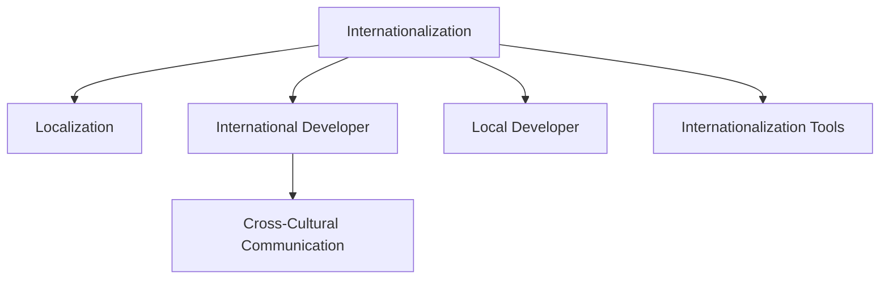

                 

# 程序员的全球化视野：机遇与挑战

## 1. 背景介绍

### 1.1 问题由来

在全球化的今天，软件开发不再局限于单一地区或国家，而是成为一个全球性的合作和竞争过程。随着互联网技术的不断进步和社交媒体的普及，全球软件开发已经成为一个复杂、多元且不断变化的环境。程序员，作为技术的执行者，必须具备全球化的视野，理解并适应不同的文化和业务需求。

这种全球化视野不仅限于软件开发的技术层面，还涉及到商业、法律、文化等诸多方面。例如，全球化软件开发的团队往往跨越多个国家，开发者需要理解和尊重不同的文化和工作习惯，同时也需要适应多样化的业务需求和技术标准。

### 1.2 问题核心关键点

全球化视野的核心关键点包括以下几个方面：

- **跨文化沟通**：开发者必须具备良好的跨文化沟通能力，以应对不同地域的团队协作和客户需求。
- **技术标准化**：全球化软件开发者需要了解并遵循不同国家和地区的技术标准和法规。
- **业务适应性**：开发者必须能够适应不同地区市场的业务需求，包括语言、货币、法规和用户习惯等。
- **云服务与平台**：全球化软件开发通常依赖云服务，开发者需要了解不同云平台的特点和最佳实践。
- **国际化开发工具**：开发者需要掌握支持国际化应用的开发工具和技术。

### 1.3 问题研究意义

具备全球化视野的程序员，可以在全球化的环境中更加高效地开发、部署和管理软件项目，提高企业的国际竞争力。具体来说，全球化视野的开发者能够：

1. **提升国际化应用的质量**：理解和适应不同地区的文化和业务需求，提升应用的本地化体验和可接受度。
2. **加速国际化项目的开发进程**：通过标准化和通用的开发实践，加速全球化项目从设计到部署的全过程。
3. **开拓新市场**：借助全球化视野，开发适应不同市场需求的解决方案，开拓新市场。
4. **加强团队协作**：跨文化团队协作能力是全球化开发的重要组成部分，能够提高团队效率和创新能力。

## 2. 核心概念与联系

### 2.1 核心概念概述

为更好地理解全球化视野，本文将介绍几个核心概念：

- **国际化（Internationalization, i18n）**：指将软件应用适配到不同的语言和地区的过程。其目的是使软件应用能够支持多种语言，适应不同地区的时间、货币和法律法规。
- **本地化（Localization, l10n）**：在国际化基础上，将软件应用适配到特定的语言、文化和地区环境，确保软件在当地市场上有良好的用户体验。
- **本地开发者（Local Developer）**：在全球化软件开发中，指在特定地区负责本地化开发和测试的程序员。
- **国际化工具（i18n Tools）**：用于支持国际化应用开发的工具，如Lokalise、Poedit等。
- **跨文化沟通（Cross-Cultural Communication）**：指不同文化背景下的沟通和协作，涉及语言、礼仪、工作习惯等方面的理解。

这些核心概念之间的逻辑关系可以通过以下Mermaid流程图来展示：



这个流程图展示了一些核心概念之间的相互关系：

1. 国际化是本地化的基础，通过国际化使软件应用支持多种语言和文化。
2. 本地开发者负责本地化开发和测试，确保软件在特定地区的适用性。
3. 跨文化沟通是确保本地化开发顺利进行的关键，涉及语言、礼仪等多方面的理解。
4. 国际化工具支持开发者进行国际化开发，提高效率和准确性。

## 3. 核心算法原理 & 具体操作步骤

### 3.1 算法原理概述

全球化视野的实现主要依赖于软件国际化和本地化的算法原理。以下是对这一过程的详细解释：

- **国际化（i18n）算法**：
  - **资源文件（Resource File）**：将应用程序的字符串、日期、时间、货币等资源信息以特定格式存放在资源文件中。资源文件支持多种语言，但格式相同。
  - **消息替换（Message Substitution）**：在运行时，根据用户指定的语言加载相应的资源文件，并将消息替换为对应的本地化字符串。
  - **多语言支持（Multi-language Support）**：通过将字符串和数值等文本信息分离到资源文件中，应用程序可以轻松地切换语言，而不需要修改代码。

- **本地化（l10n）算法**：
  - **文本翻译（Text Translation）**：将国际化的文本信息翻译成本地语言。翻译工作通常由本地开发者或专业翻译人员完成。
  - **文化适配（Culture Adaptation）**：根据特定地区的文化和习惯，对文本进行适当的调整。例如，根据地区调整日期和时间的格式，转换货币符号等。
  - **测试与优化（Testing and Optimization）**：本地化后的应用程序需要进行广泛测试，以确保在不同地区正常工作。优化包括性能调整、兼容性测试等。

### 3.2 算法步骤详解

全球化软件开发的具体步骤如下：

1. **需求分析**：
   - 确定软件需要支持的地区和语言。
   - 了解不同地区文化和业务需求，如时间格式、货币符号、法律法规等。
   - 制定国际化策略，包括资源文件格式和存储位置。

2. **资源提取**：
   - 提取应用程序中的文本、日期、时间、货币等需要国际化的资源。
   - 将这些资源存入资源文件中，如.properties、.po等格式。

3. **资源国际化**：
   - 在代码中引用资源文件中的文本和数值，而不是直接使用本地字符串。
   - 使用国际化库和工具，如gettext、i18next等，实现文本的动态替换。

4. **本地化翻译**：
   - 将国际化的文本翻译成目标语言，由本地开发者或专业翻译人员完成。
   - 调整文本格式和文化细节，以适应特定地区的用户习惯。

5. **测试与优化**：
   - 对本地化后的应用程序进行全面测试，确保其在不同地区正常工作。
   - 根据测试结果进行优化，包括性能调整、兼容性测试等。

6. **发布与部署**：
   - 在正式发布前，将本地化后的应用程序部署到目标地区。
   - 监控软件在目标地区的表现，及时进行优化和维护。

### 3.3 算法优缺点

全球化视野的实现具有以下优点：

- **适应性广**：通过国际化，软件可以适应不同语言和文化，覆盖全球市场。
- **提升用户体验**：本地化使得软件在目标地区有更好的用户体验，提高用户满意度和忠诚度。
- **降低开发成本**：国际化开发工具和库提高了开发效率，降低了翻译和测试成本。

同时，这一过程也存在一些缺点：

- **复杂性高**：国际化涉及多语言、多文化和多平台，开发和管理复杂。
- **翻译成本高**：高质量的本地化翻译需要专业翻译人员，成本较高。
- **测试工作量大**：需要对多地区进行全面测试，以确保应用程序正常工作。

### 3.4 算法应用领域

全球化视野的应用领域广泛，包括：

- **企业应用**：全球化软件企业需要支持多个语言和文化，以拓展国际市场。
- **移动应用**：移动应用需要在不同地区适配不同的语言和文化，确保用户体验。
- **电子商务**：电子商务平台需要支持全球化支付、物流和客户服务，提高跨境交易效率。
- **政府服务**：政府服务需要适应不同地区的法律法规，确保政策透明和公平。
- **游戏开发**：全球化游戏需要支持多语言和文化，以吸引不同地区的玩家。

## 4. 数学模型和公式 & 详细讲解 & 举例说明

### 4.1 数学模型构建

全球化视野的实现可以通过以下数学模型来描述：

- **资源文件模型**：
  $$
  R_{i18n} = \{text_{i18n}\}, text_{i18n} = \{text_{lang}, format\}, lang \in \mathcal{L}
  $$
  其中 $\mathcal{L}$ 表示语言集合，$text_{lang}$ 表示翻译后的文本，$format$ 表示文本的格式信息。

- **本地化翻译模型**：
  $$
  R_{l10n} = \{text_{l10n}\}, text_{l10n} = text_{i18n}\Big|_{lang} = text_{lang}, format
  $$
  表示在目标语言 $lang$ 下，本地化的文本 $text_{l10n}$ 由国际化的文本 $text_{i18n}$ 转化得到。

### 4.2 公式推导过程

**资源文件模型推导**：

假设有一个国际化的文本资源文件，其中包含多个翻译后的文本和格式信息，表示如下：

$$
R_{i18n} = \{text_{en}, format_{en}, text_{fr}, format_{fr}, \ldots\}
$$

其中 $text_{en}$ 表示英语文本，$format_{en}$ 表示英语文本的格式信息。类似地，$french$ 表示法语文本和格式信息。

**本地化翻译模型推导**：

在目标语言 $lang$ 下，本地化的文本 $text_{l10n}$ 由国际化的文本 $text_{i18n}$ 通过翻译和格式调整得到。例如，英语文本的本地化过程如下：

$$
text_{en} = \text{Translation}(text_{i18n})\Big|_{lang=en}, format_{en}
$$

**翻译与格式化模型**：

翻译和格式调整的数学模型可以表示为：

$$
text_{l10n} = \text{Translation}(text_{i18n}), format_{l10n} = \text{Adaptation}(format_{i18n}, lang)
$$

其中 $\text{Translation}$ 表示翻译函数，$\text{Adaptation}$ 表示格式调整函数。

### 4.3 案例分析与讲解

假设我们有一个国际化的电子邮件应用，需要在英语和法语环境下正常工作。我们首先提取所有需要国际化的文本和格式信息，如问候语、日期格式等，存入资源文件中。然后，使用国际化库加载相应的资源文件，并将文本替换为本地化文本。最后，进行全面的测试和优化，确保应用程序在不同语言环境下的正常工作。

## 5. 项目实践：代码实例和详细解释说明

### 5.1 开发环境搭建

在进行全球化开发之前，我们需要准备好开发环境。以下是使用Python进行国际化项目开发的环境配置流程：

1. 安装Anaconda：从官网下载并安装Anaconda，用于创建独立的Python环境。

2. 创建并激活虚拟环境：
```bash
conda create -n international-env python=3.8 
conda activate international-env
```

3. 安装Python库：
```bash
pip install django internationalize
```

4. 安装国际化工具：
```bash
pip install gettext
```

完成上述步骤后，即可在`international-env`环境中开始国际化开发。

### 5.2 源代码详细实现

下面我们以Django框架为例，给出国际化项目的PyTorch代码实现。

首先，定义国际化设置：

```python
from django.conf import settings
settings.USE_I18N = True
settings.USE_L10N = True
settings.LANGUAGE_CODE = 'en-us'
```

然后，定义国际化翻译文件：

```python
from django.utils.translation import ugettext_lazy as _
TEXTS = {
    'HELLO': _('Hello'),
    'GOODBYE': _('Goodbye'),
}
```

接着，定义国际化视图：

```python
from django.shortcuts import render
from django.utils.translation import gettext

def index(request):
    context = {
        'hello': gettext(TEXTS['HELLO']),
        'goodbye': gettext(TEXTS['GOODBYE']),
    }
    return render(request, 'index.html', context)
```

最后，启动Django开发服务器：

```bash
python manage.py runserver
```

### 5.3 代码解读与分析

让我们再详细解读一下关键代码的实现细节：

**国际化和本地化配置**：
- `settings.USE_I18N = True`：启用国际化支持。
- `settings.USE_L10N = True`：启用本地化支持。
- `settings.LANGUAGE_CODE = 'en-us'`：设置默认语言为英语。

**国际化翻译文件**：
- `TEXTS` 字典包含需要国际化的文本和格式信息。
- `_` 函数用于获取翻译文本，通过`gettext`库实现。

**国际化视图**：
- 在视图中，使用 `gettext` 函数获取翻译文本，并传递到模板中。
- 模板中使用 `` 和 `` 来显示翻译后的文本。

**启动开发服务器**：
- `python manage.py runserver` 命令启动开发服务器，可通过浏览器访问应用。

可以看到，通过Django框架的国际化支持，我们能够轻松地实现国际化和本地化功能。开发者可以根据实际需求，进一步定制国际化配置和翻译文件。

当然，工业级的系统实现还需考虑更多因素，如多语言切换的实现、URL编码等。但核心的国际化范式基本与此类似。

## 6. 实际应用场景

### 6.1 企业应用

全球化视野在企业应用中有着广泛的应用，例如：

- **国际化CRM系统**：全球化CRM系统需要支持多个语言和文化，以服务不同地区的客户。系统中的文本信息、日期时间格式、货币符号等都需要进行本地化适配。
- **全球化ERP系统**：全球化ERP系统需要支持多语言、多货币、多国家法规，以支持跨国企业的运营。
- **跨国电商平台**：全球化电商平台需要支持不同语言和文化，提供本地化的用户体验。平台中的产品描述、价格、配送信息等都需要进行本地化。

### 6.2 移动应用

移动应用通常需要在多个地区进行本地化，以适应不同用户习惯和需求。例如：

- **国际化的社交媒体应用**：如微信、Facebook等，需要在全球范围内提供本地化的服务。应用中的文本、日期时间、货币格式等都需要进行本地化适配。
- **国际化的游戏应用**：如王者荣耀、炉石传说等，需要在全球范围内提供本地化的游戏体验。游戏中的文本、角色名称、技能描述等都需要进行本地化适配。
- **国际化的导航应用**：如Google Maps、百度地图等，需要在全球范围内提供本地化的导航服务。应用的地图数据、语言、货币等都需要进行本地化适配。

### 6.3 电子商务

全球化视野在电子商务中也有着广泛的应用，例如：

- **国际化的电商平台**：如Amazon、淘宝等，需要在全球范围内提供本地化的电商服务。平台中的产品描述、价格、配送信息等都需要进行本地化适配。
- **全球化的物流系统**：全球化的物流系统需要支持多语言、多国家法规，以支持跨国物流的运营。
- **跨境支付系统**：全球化的支付系统需要支持多货币、多语言，以支持跨国支付的运营。

### 6.4 政府服务

政府服务需要适应不同地区的法律法规和文化，例如：

- **国际化的政府网站**：政府网站需要提供多语言服务，以便服务不同地区的用户。
- **全球化的电子政务系统**：电子政务系统需要支持多语言、多国家法规，以支持跨国政务的运营。

## 7. 工具和资源推荐

### 7.1 学习资源推荐

为了帮助开发者系统掌握全球化视野的理论基础和实践技巧，这里推荐一些优质的学习资源：

1. **《国际化和本地化编程》**：该书详细介绍了国际化开发的原理和实践技巧，适合开发者全面了解国际化开发。
2. **Django国际化和本地化文档**：Django框架的国际化文档，提供了详细的国际化设置和翻译功能。
3. **Microsoft Internationalization Fundamentals**：微软提供的国际化基础课程，讲解了国际化开发的理论和实践。
4. **Lokalise官方文档**：Lokalise工具的官方文档，提供了丰富的国际化开发资源和示例。
5. **Google Internationalization Resources**：谷歌提供的国际化资源，包括国际化工具、最佳实践、案例分析等。

通过对这些资源的学习实践，相信你一定能够快速掌握国际化开发的精髓，并用于解决实际的国际化问题。

### 7.2 开发工具推荐

高效的开发离不开优秀的工具支持。以下是几款用于全球化开发常用的工具：

1. **Django框架**：全球化开发的主流框架之一，提供了丰富的国际化支持，如gettext、i18n等库。
2. **Lokalise**：一款流行的国际化工具，支持多种语言和格式，提供了自动翻译、多语言测试等功能。
3. **Poedit**：一款优秀的翻译管理工具，支持多种文件格式，提供了强大的翻译管理和协作功能。
4. **Microsoft Visual Studio**：提供了强大的国际化开发工具，支持多语言测试和本地化适配。
5. **GitLab CI/CD**：支持自动化测试和部署，适用于全球化应用的持续集成和持续部署。

合理利用这些工具，可以显著提升全球化开发的效率，加快创新迭代的步伐。

### 7.3 相关论文推荐

全球化视野的发展源于学界的持续研究。以下是几篇奠基性的相关论文，推荐阅读：

1. **《Integrating Internationalization into the Software Development Lifecycle》**：详细介绍了国际化开发的最佳实践和工具。
2. **《Principles of Software Localization》**：介绍了软件本地化的基本原理和实践。
3. **《Internationalization in Software Engineering》**：介绍了软件国际化的最新研究成果和应用案例。
4. **《Cross-Cultural Software Development》**：探讨了跨文化软件开发中的挑战和解决方法。

这些论文代表了大语言模型微调技术的发展脉络。通过学习这些前沿成果，可以帮助研究者把握学科前进方向，激发更多的创新灵感。

## 8. 总结：未来发展趋势与挑战

### 8.1 总结

本文对全球化视野的实现过程进行了全面系统的介绍。首先阐述了全球化视野的重要性，明确了跨文化沟通、技术标准化、业务适应性等关键点。其次，从原理到实践，详细讲解了国际化开发的数学模型和算法步骤，给出了国际化项目开发的完整代码实例。同时，本文还广泛探讨了全球化视野在企业应用、移动应用、电子商务等领域的应用前景，展示了全球化视野的巨大潜力。此外，本文精选了全球化开发的各类学习资源，力求为读者提供全方位的技术指引。

通过本文的系统梳理，可以看到，全球化视野的实现过程虽然复杂，但在全球化的环境中具有重要意义。具备全球化视野的程序员，能够在全球化的环境中更加高效地开发、部署和管理软件项目，提高企业的国际竞争力。未来，伴随全球化技术的发展，全球化视野必将在全球化的软件开发中发挥越来越重要的作用。

### 8.2 未来发展趋势

展望未来，全球化视野的发展趋势包括：

1. **云平台国际化**：云平台如AWS、Azure等，提供强大的国际化支持，帮助开发者轻松实现全球化应用。
2. **人工智能国际化**：人工智能技术在多语言、多文化环境下发挥重要作用，如语言翻译、情感分析等。
3. **多模态国际化**：结合文本、图像、语音等多模态信息，实现更加全面和准确的本地化。
4. **机器学习国际化**：机器学习技术在本地化翻译、文化适配等方面发挥重要作用。
5. **开源国际化**：开源社区将持续推动全球化开发，提供更多的工具和资源。

### 8.3 面临的挑战

尽管全球化视野已经取得了显著进展，但在迈向更加智能化、普适化应用的过程中，它仍面临诸多挑战：

1. **文化差异复杂性**：不同文化的差异可能导致本地化翻译和格式调整的复杂性增加。
2. **测试工作量大**：全球化应用需要面对多语言、多文化环境，测试工作量大，难以全面覆盖。
3. **资源投入高**：高质量的本地化翻译和格式调整需要大量人力和时间投入。
4. **法律和法规挑战**：不同国家法律法规的差异可能导致全球化应用的法律合规风险增加。
5. **用户习惯差异**：不同地区的用户习惯和操作方式可能存在较大差异，需要适应这些差异。

### 8.4 研究展望

为了应对上述挑战，未来的全球化视野研究需要从以下几个方面进行：

1. **自动化本地化**：引入自动化工具和算法，减少人工翻译和格式调整的工作量。
2. **多语言协作**：利用协作平台，实现跨文化团队的高效沟通和协作。
3. **本地化质量评估**：引入质量评估工具，确保本地化翻译和格式调整的准确性和一致性。
4. **法律合规**：研究不同国家法律法规的差异，制定全球化应用的法律合规策略。
5. **用户习惯研究**：研究不同地区用户习惯和操作方式，优化全球化应用的体验。

## 9. 附录：常见问题与解答

**Q1：如何进行多语言切换？**

A: 多语言切换可以通过国际化框架的路由系统实现。例如，在Django框架中，可以使用`url`标签定义多语言路由，如下所示：

```python
from django.urls import path
from django.conf import settings

urlpatterns = [
    path('<hanylang>/', include('myapp.urls')),
]
```

在`urls.py`文件中，使用`include`函数将应用路由添加到多语言路由中。通过路由系统，用户可以根据选择的语言进行页面切换。

**Q2：如何处理多语言测试？**

A: 多语言测试通常需要在多个语言环境中进行。可以通过自动化测试工具和本地化测试工具进行。例如，在Selenium测试中，可以配置多个浏览器和语言环境，自动执行测试用例。同时，可以使用Lokalise等工具，生成多语言的测试用例和数据，自动执行测试。

**Q3：如何选择国际化工具？**

A: 选择合适的国际化工具需要考虑多个因素，包括支持的语种、格式、功能、易用性等。常用的国际化工具包括gettext、i18n、Poedit等。开发者可以根据项目需求选择适合的国际化工具。

**Q4：如何进行跨文化沟通？**

A: 跨文化沟通需要理解和尊重不同文化的差异。可以通过培训、文化交流、团队协作等方式进行。同时，可以使用跨文化沟通工具，如Microsoft Teams、Slack等，方便团队成员的沟通和协作。

**Q5：如何进行本地化适配？**

A: 本地化适配需要根据目标语言和文化的习惯进行调整。可以通过翻译、格式调整、测试等方式进行。同时，可以使用Lokalise等工具，自动翻译和调整文本，生成本地化资源文件。

---

作者：禅与计算机程序设计艺术 / Zen and the Art of Computer Programming

