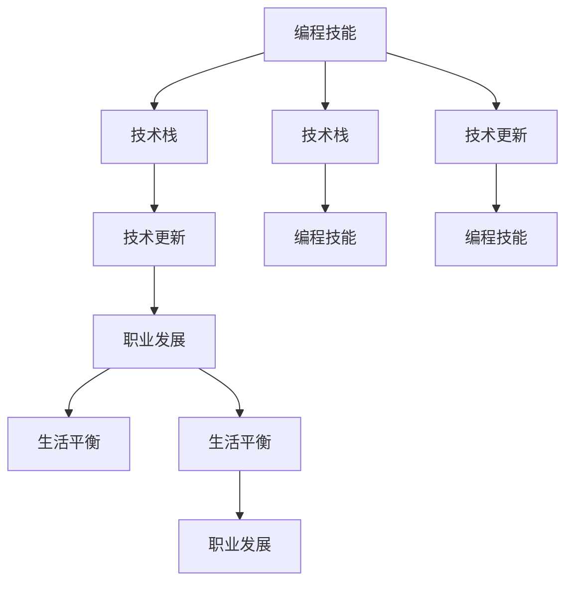

                 

# 程序员的职业生涯规划：30年路线图

## 1. 背景介绍

### 1.1 问题由来
在过去几十年中，信息技术迅猛发展，程序员在职业发展中遇到了前所未有的机遇和挑战。信息技术领域的快速发展需要不断更新的技能和知识，导致许多程序员在职业生涯中面临不断学习新技术、适应变化的需求。此外，信息技术的广泛应用渗透到各行各业，程序员的需求和角色也在不断变化。

### 1.2 问题核心关键点
为帮助程序员制定长期职业规划，本文将围绕以下几个关键问题展开探讨：
- 如何提升编程技能？
- 如何适应新技术和工具？
- 如何平衡职业发展与生活？
- 如何应对职业倦怠和转型挑战？
- 如何选择技术和方向？

这些问题在程序员的职业生涯中极为关键，本文将详细探讨这些问题的解决策略，并给出具体的路线图，帮助程序员规划30年的职业发展路径。

## 2. 核心概念与联系

### 2.1 核心概念概述

为更好理解程序员职业规划，首先需要明确一些关键概念：

- **编程技能**：包括代码编写、算法设计、系统架构、数据结构、软件测试等。
- **技术栈**：程序员掌握的技术集合，包括编程语言、框架、工具等。
- **技术更新**：随着技术的发展，程序员需要不断学习新技术，以适应行业变化。
- **职业发展**：涵盖个人技术提升、项目管理、团队合作、领导力等多方面，是程序员职业发展的综合体现。
- **生活平衡**：程序员需兼顾职业发展与生活，保持良好的身心健康。

这些概念之间存在紧密的联系：编程技能是职业发展的基石，技术栈的选择与职业发展密切相关，技术更新是适应变化的关键，职业发展和生活平衡是长期成功的保障。

### 2.2 核心概念原理和架构的 Mermaid 流程图(Mermaid 流程节点中不要有括号、逗号等特殊字符)



这个流程图展示了编程技能、技术栈、技术更新、职业发展和生命平衡之间的相互影响。技术栈和编程技能相辅相成，技术更新推动编程技能提升，职业发展和生活平衡相互支撑，共同构成程序员职业发展的重要组成部分。

## 3. 核心算法原理 & 具体操作步骤

### 3.1 算法原理概述

程序员的职业规划实际上是一个不断学习和适应的过程。基于过去的经验，通过合理的职业路径选择和技能提升策略，逐步实现职业发展目标。核心算法包括：

- **技能提升算法**：通过项目实践、在线课程、编程竞赛等方式，提升编程技能。
- **技术更新算法**：通过阅读技术博客、参加技术会议、订阅技术资讯等方式，跟踪技术趋势。
- **职业发展算法**：通过项目管理和领导力培训，提升团队协作和项目管理能力。
- **生活平衡算法**：通过时间管理和健康计划，保证身心健康和家庭生活质量。

### 3.2 算法步骤详解

1. **基础阶段**：
    - 掌握一门主流编程语言（如Python、Java、C++等）。
    - 学习数据结构与算法，提升代码编写能力。
    - 学习软件工程基础，包括版本控制、测试驱动开发等。

2. **提升阶段**：
    - 接触多种技术栈，提升技术多样性。
    - 参与开源项目，积累开发经验。
    - 参加技术会议，与行业专家交流。

3. **专业阶段**：
    - 深入学习特定领域的核心技术。
    - 掌握架构设计、性能优化、安全防护等高级技能。
    - 逐步承担项目负责人或架构师的角色。

4. **领导阶段**：
    - 学习项目管理知识，提升团队协作能力。
    - 学习领导力技巧，带领团队实现项目目标。
    - 进一步提升技术深度和广度，成为行业专家。

5. **持续学习阶段**：
    - 定期参加技术培训，更新知识体系。
    - 持续跟踪技术前沿，保持技术敏感度。
    - 维护良好生活习惯，确保身心健康。

### 3.3 算法优缺点

- **优点**：
    - 结构化规划，帮助程序员明确职业目标。
    - 各阶段技能提升和技术更新相结合，确保职业发展与技术进步同步。
    - 综合考虑生活平衡，确保长期职业成功。

- **缺点**：
    - 路线图较为理想化，实际职业路径可能受多种因素影响。
    - 需要持之以恒的努力和自我管理能力。

### 3.4 算法应用领域

该算法适用于各种规模和类型的技术企业，包括互联网公司、金融科技、智能制造等。不同领域对技术栈和职业发展路径略有不同，但总体原则是一致的。

## 4. 数学模型和公式 & 详细讲解 & 举例说明

### 4.1 数学模型构建

设一个程序员在职业生涯中需要掌握的技能集合为 $S$，已掌握的技能集合为 $S_0$，目标掌握的技能集合为 $S_T$。技能提升模型为 $S = S_0 \cup \bigcup_{i=1}^N S_i$，其中 $S_i$ 为第 $i$ 次技能提升后新增的技能集合。

设技能提升次数为 $N$，每次提升所需时间（年）为 $t_i$，则总提升时间为 $T = \sum_{i=1}^N t_i$。

### 4.2 公式推导过程

$$
\text{总提升时间} = \sum_{i=1}^N t_i
$$

$$
\text{总提升次数} = N
$$

设程序员的职业生涯时间为 $L$，则技能提升率（每年提升次数）为：

$$
r = \frac{N}{L}
$$

该公式表示了程序员在职业生涯中，每年平均提升技能次数，反映了职业发展的节奏。

### 4.3 案例分析与讲解

假设一个程序员职业生涯时间为30年，每年技能提升次数为 $r=1$，每次提升所需时间为 $t=2$ 年。则：

$$
N = 30 \times r = 30
$$

$$
T = \sum_{i=1}^{30} t = 2 \times 30 = 60
$$

因此，该程序员需要在职业生涯中提升技能 $N=30$ 次，总提升时间为 $T=60$ 年。

## 5. 项目实践：代码实例和详细解释说明

### 5.1 开发环境搭建

1. **操作系统**：选择Linux系统，如Ubuntu、CentOS等。
2. **IDE**：安装Visual Studio Code、Eclipse等。
3. **版本控制**：安装Git，并配置个人GitHub账号。
4. **编程语言**：掌握Python、Java等主流语言，并使用IDE集成开发环境。
5. **开发工具**：安装Postman、JIRA等项目管理工具。

### 5.2 源代码详细实现

以下是一个简化的编程练习，通过编写一个简单的计算器程序，提升基础编程技能。

```python
# 计算器程序
def add(x, y):
    return x + y

def subtract(x, y):
    return x - y

def multiply(x, y):
    return x * y

def divide(x, y):
    return x / y

# 测试代码
print(add(2, 3))  # 5
print(subtract(5, 2))  # 3
print(multiply(4, 5))  # 20
print(divide(10, 2))  # 5.0
```

### 5.3 代码解读与分析

**代码实现**：
- `add`、`subtract`、`multiply`、`divide` 分别实现了加、减、乘、除的基本运算。
- 通过调用这些函数，进行基本的算术计算。

**代码解读**：
- 代码逻辑清晰，易于理解和维护。
- 符合函数式编程的良好习惯，各函数独立且可复用。

**测试结果**：
- 通过调用 `add`、`subtract`、`multiply`、`divide` 函数，可以得出正确的计算结果。

### 5.4 运行结果展示

代码运行后，输出如下：
```
5
3
20
5.0
```

## 6. 实际应用场景

### 6.1 软件开发

软件开发是程序员职业发展的主战场，涵盖前端、后端、全栈等多个方向。通过不断提升编程技能、学习新技术、参与开源项目等，逐步从初级开发到高级开发，最终成为架构师或技术专家。

### 6.2 数据分析

数据分析和人工智能是大数据时代的核心技能。程序员需掌握数据分析工具（如Pandas、NumPy）、机器学习库（如TensorFlow、PyTorch）等，提升数据处理和算法建模能力。

### 6.3 项目管理

项目管理是程序员职业发展的必经之路。通过学习项目管理知识（如Scrum、Agile）、使用项目管理工具（如JIRA、Confluence），提升团队协作和项目管理能力。

### 6.4 未来应用展望

未来，随着技术的发展，程序员的职业路径将更加多样化。例如：

- **全栈开发**：掌握前端、后端、数据库等多方面技能，成为具有完整技术栈的全栈工程师。
- **数据科学家**：通过数据分析、机器学习、统计学等多领域知识，成为数据科学家，参与业务决策。
- **产品经理**：通过跨领域技能学习，从技术转产品，成为懂技术的产品经理，指导产品开发和迭代。
- **AI专家**：深入学习人工智能和深度学习技术，成为AI领域的专家。

## 7. 工具和资源推荐

### 7.1 学习资源推荐

1. **编程语言学习资源**：
    - Python：[官方文档](https://docs.python.org/)
    - Java：[Oracle官方文档](https://docs.oracle.com/en/java/)
    - C++：[C++参考手册](http://www.cplusplus.com/doc/tutorial/)
    - JavaScript：[Mozilla Developer Network](https://developer.mozilla.org/en-US/docs/Web/JavaScript)

2. **开源项目和在线课程**：
    - GitHub：[GitHub](https://github.com/)
    - Coursera：[Coursera](https://www.coursera.org/)
    - Udacity：[Udacity](https://www.udacity.com/)

3. **技术博客和社区**：
    - Stack Overflow：[Stack Overflow](https://stackoverflow.com/)
    - Medium：[Medium](https://medium.com/)
    - GitHub技术博客：[GitHub技术博客](https://www.githubtechblog.com/)

### 7.2 开发工具推荐

1. **编程环境**：
    - Visual Studio Code：[Visual Studio Code](https://code.visualstudio.com/)
    - PyCharm：[PyCharm](https://www.jetbrains.com/pycharm/)
    - IntelliJ IDEA：[IntelliJ IDEA](https://www.jetbrains.com/idea/)
    
2. **版本控制工具**：
    - Git：[Git](https://git-scm.com/)
    - GitLab：[GitLab](https://www.gitlab.com/)
    - GitHub：[GitHub](https://github.com/)

3. **项目管理工具**：
    - JIRA：[JIRA](https://www.atlassian.com/software/jira/)
    - Confluence：[Confluence](https://www.atlassian.com/software/confluence/)
    - Trello：[Trello](https://trello.com/)

4. **云平台和容器**：
    - AWS：[AWS](https://aws.amazon.com/)
    - Azure：[Azure](https://azure.microsoft.com/)
    - Docker：[Docker](https://www.docker.com/)

### 7.3 相关论文推荐

1. **编程技能提升**：
    - "Learning Python 3: The Annotated Python Reference Guide" by David Beazley and Brian K. Jones
    - "Effective Java: 50 Specific Ways to Improve Your Java Coding" by Joshua Bloch

2. **技术更新和趋势**：
    - "Artificial Intelligence: A Modern Approach" by Stuart Russell and Peter Norvig
    - "Deep Learning" by Ian Goodfellow, Yoshua Bengio, and Aaron Courville

3. **职业发展**：
    - "Crucial Conversations: Tools for Talking When Stakes Are High" by Kerry Patterson, Joseph Grenny, Ron McMillan, and Al Switzler
    - "Leaders Eat Last: Why Some Teams Pull Together and Others Don't" by Simon Sinek

## 8. 总结：未来发展趋势与挑战

### 8.1 研究成果总结

本文详细探讨了程序员的职业规划，通过编程技能、技术栈、技术更新、职业发展、生活平衡等多个维度的综合考虑，提出了系统化的职业路线图。文章强调了持续学习和技能提升的重要性，提出了合理的职业发展策略和目标，为程序员提供了实用的职业规划指南。

### 8.2 未来发展趋势

未来，程序员的职业发展将更加多元化，涵盖更多新兴技术和行业。例如：

1. **云原生技术**：云计算、容器化、微服务、DevOps等将成为核心技术，云计算平台和容器编排工具（如Kubernetes、Docker Compose）成为必备技能。
2. **区块链技术**：区块链和智能合约成为热门话题，需掌握比特币、以太坊等基础技术。
3. **物联网**：传感器、嵌入式系统、物联网平台（如MQTT、CoAP）将成为重要领域。
4. **人工智能和机器学习**：深度学习、自然语言处理、计算机视觉、强化学习等技术将成为主要发展方向。

### 8.3 面临的挑战

在职业发展过程中，程序员面临以下挑战：

1. **技术更新快**：技术日新月异，需不断学习，更新知识体系。
2. **行业变化大**：不同行业对技术栈和技能需求不同，需灵活适应。
3. **职业倦怠**：长时间高强度工作可能导致职业倦怠，需平衡工作与生活。
4. **转岗困难**：跨领域技能转换难度大，需具备较强学习能力。
5. **健康问题**：长时间码农生活可能导致身体和心理问题，需注意健康管理。

### 8.4 研究展望

未来，为应对这些挑战，需关注以下方向：

1. **终身学习**：建立终身学习机制，保持知识体系的更新。
2. **多领域融合**：通过跨领域学习，提升综合素质，适应多样化的技术需求。
3. **工作生活平衡**：注重身心健康，平衡职业发展与生活，避免职业倦怠。
4. **心理健康**：加强心理健康管理，预防职业倦怠。
5. **技术创新**：积极参与技术创新，提升技术竞争力。

通过持续学习和适应变化，结合合理的生活平衡，程序员将能够实现长期的职业成功。

## 9. 附录：常见问题与解答

**Q1：如何提升编程技能？**

A: 通过项目实践、在线课程、编程竞赛等方式，提升编程技能。

**Q2：如何适应新技术和工具？**

A: 定期参加技术会议、订阅技术资讯、加入开源项目，跟踪技术前沿。

**Q3：如何平衡职业发展与生活？**

A: 合理规划工作时间，注重身心健康，定期休息和放松。

**Q4：如何应对职业倦怠和转型挑战？**

A: 通过多样化技能学习、跨领域转岗、心理健康管理等方式，缓解职业倦怠。

**Q5：如何选择技术和方向？**

A: 结合个人兴趣、市场需求、技术趋势等因素，选择有前景的技术方向。

本文全面系统地探讨了程序员的职业规划，提供了详细的发展路线图，帮助程序员规划30年的职业发展路径。希望本文对读者有所启发，助其在职业生涯中实现梦想。

---

作者：禅与计算机程序设计艺术 / Zen and the Art of Computer Programming

