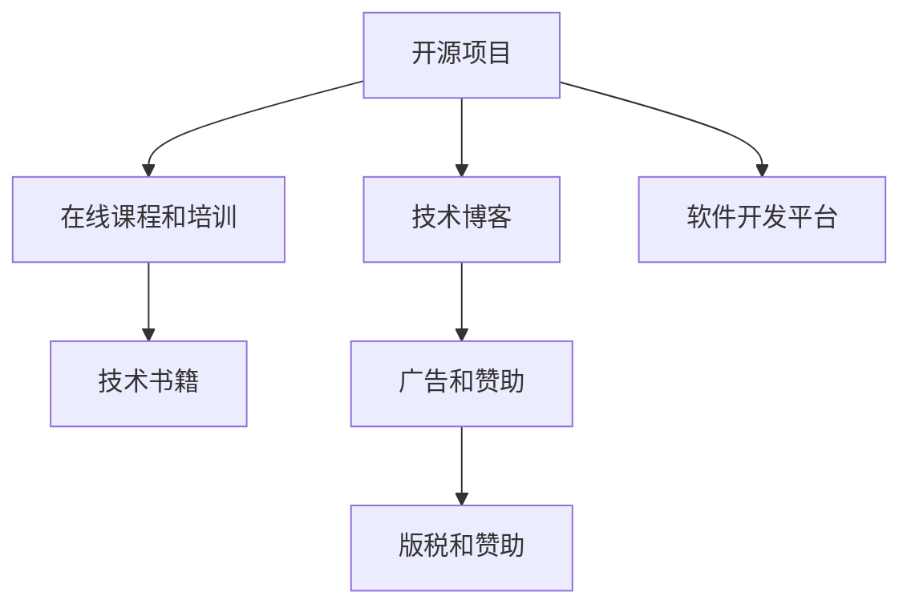

                 

# 程序员的被动收入：构建与维护

## 1. 背景介绍

### 1.1 问题由来
在科技日新月异的时代，程序员的工作不再仅限于敲代码，越来越多的人开始追求被动收入的构建与维护。被动收入是指不需要主动劳动而自动获得的收入，它可以帮助人们实现财富自由，提高生活质量。对于程序员而言，通过构建高价值的开源项目、开发有影响力的应用程序或编写经典技术书籍等方式，可以稳定地获得被动收入。

### 1.2 问题核心关键点
如何构建与维护程序员的被动收入，成为程序员关注的重要问题。以下是构建与维护被动收入的几个核心关键点：

- **开源项目**：通过开源项目贡献代码，积累技术影响力，吸引企业合作或赞助。
- **技术博客**：分享编程心得和技术文章，提高品牌知名度，吸引广告和赞助。
- **教育培训**：通过在线课程和培训，传授编程技能，建立技术权威。
- **软件开发平台**：开发有影响力的软件开发平台，吸引开发者和企业合作。
- **技术书籍**：编写经典技术书籍，建立个人品牌，获得版税和版税收入。

本文将围绕这些核心关键点，深入探讨如何构建与维护程序员的被动收入。

## 2. 核心概念与联系

### 2.1 核心概念概述

为更好地理解构建与维护程序员被动收入的过程，本节将介绍几个密切相关的核心概念：

- **开源项目**：指开发者在互联网平台上免费提供的源代码库，供他人自由使用和修改。开源项目不仅能提升技术水平，还能获得社区的支持和企业赞助。

- **技术博客**：指程序员开设的个人技术博客或网站，定期发表编程心得、技术文章、行业动态等内容，提升个人品牌和影响力。

- **在线课程和培训**：指通过在线平台（如Coursera、Udacity、Bilibili等）提供编程技能培训、技术讲座和编程面试准备等课程，建立技术权威。

- **软件开发平台**：指开发者创建的软件开发平台或工具，提供API接口、编程框架、开发文档等功能，吸引开发者和企业合作。

- **技术书籍**：指程序员编写和出版的技术书籍，通过销售版税、版权分成等方式获得被动收入。

- **版税和赞助**：指开源项目、技术博客、教育培训等活动获得的收入。

这些核心概念之间的逻辑关系可以通过以下Mermaid流程图来展示：



这个流程图展示了各个核心概念之间的相互关系：开源项目、技术博客、在线课程和培训、软件开发平台等，通过提升技术影响力，吸引广告、赞助和版税收入，构建与维护程序员的被动收入。

## 3. 核心算法原理 & 具体操作步骤

### 3.1 算法原理概述

构建与维护程序员被动收入的过程，本质上是一种基于开源和社区合作的市场策略。其核心思想是通过技术贡献和社区互动，积累个人品牌和影响力，吸引企业合作和赞助，从而获得被动收入。

形式化地，假设程序员通过开源项目、技术博客、在线课程和培训、软件开发平台等渠道获得总收益 $R$，其中 $R$ 为各项活动带来的收益之和。目标是最小化努力成本 $C$，即：

$$
\mathop{\arg\min}_{C} \mathcal{R}(R, C)
$$

其中 $\mathcal{R}$ 为收益函数，描述不同投入带来的收益变化。在实践中，我们通常使用基于梯度的优化算法（如SGD、Adam等）来近似求解上述最优化问题。

### 3.2 算法步骤详解

基于开源和社区合作的市场策略，程序员的被动收入构建与维护一般包括以下几个关键步骤：

**Step 1: 选择开源项目和技术博客平台**
- 选择开源平台（如GitHub、Apache等），以及技术博客平台（如Medium、CSDN等），根据个人兴趣和市场需求选择合适的开源项目和技术博客主题。
- 创建个人账号，并注册开源项目和技术博客。

**Step 2: 输出高质量内容**
- 在开源项目上贡献代码，提供高质量的代码示例和文档。
- 在技术博客上定期发表原创文章，分享编程心得和技术案例。
- 在在线课程和培训中录制高质量的视频内容，制作PPT课件。

**Step 3: 社区互动和品牌建设**
- 在开源项目和社区中积极互动，回答其他开发者的问题，参与技术讨论。
- 在技术博客和社交媒体上分享个人成果和观点，吸引读者关注和讨论。
- 在在线课程和培训中建立良好的师生互动，获得学员的好评和推荐。

**Step 4: 寻求合作和赞助**
- 与企业或机构联系，寻求商业合作，提供定制化解决方案或技术支持。
- 申请开源项目赞助，通过项目展示和技术成果吸引企业和社区赞助。
- 与技术出版社联系，寻求出版技术书籍的机会，获取版税收入。

**Step 5: 持续优化和扩展**
- 定期评估各项活动的效果，调整策略，提升产出质量。
- 扩大社区和市场影响力，吸引更多资源和合作伙伴。
- 不断学习和探索新领域，保持技术和知识的领先地位。

以上是构建与维护程序员被动收入的一般流程。在实际应用中，还需要针对具体任务和市场需求，对策略的各个环节进行优化设计，如改进内容质量、加强品牌建设、选择合适的合作渠道等，以进一步提升收益。

### 3.3 算法优缺点

构建与维护程序员被动收入的方法具有以下优点：
1. 降低了劳动强度。通过开源项目、技术博客、在线课程和培训等形式，程序员可以在不增加工作负担的情况下获得被动收入。
2. 提升了技术影响力。开源项目和技术博客等形式，能够展示程序员的技术水平和创意，提高个人品牌和知名度。
3. 增加了职业机会。通过与企业合作，程序员可以获得更多的项目机会和职业发展机会。
4. 实现了财务自由。通过多种收入来源，程序员可以构建多元化的被动收入体系，实现财务自由。

同时，该方法也存在一定的局限性：
1. 时间成本高。高质量的输出需要耗费大量时间和精力，可能影响主业工作。
2. 市场竞争激烈。技术博客和开源项目等领域竞争激烈，难以获得足够的关注和支持。
3. 收入不稳定。被动收入受市场因素和自身努力的影响，难以保证稳定的收入来源。
4. 技术门槛高。需要具备较强的编程能力、市场营销能力和社区互动技巧。

尽管存在这些局限性，但就目前而言，开源和社区合作的市场策略仍是大规模构建与维护程序员被动收入的主流范式。未来相关研究的重点在于如何进一步降低时间成本，提高收益稳定性，同时兼顾主业和副业的发展。

### 3.4 算法应用领域

基于开源和社区合作的市场策略，程序员的被动收入构建与维护已在多个领域得到了应用，例如：

- **开源软件开发者**：通过开源项目贡献代码，积累技术影响力，吸引企业合作或赞助。
- **技术博客作者**：通过技术博客分享编程心得和技术文章，提高品牌知名度，吸引广告和赞助。
- **在线课程讲师**：通过在线课程和培训，传授编程技能，建立技术权威。
- **软件开发平台开发者**：开发有影响力的软件开发平台或工具，吸引开发者和企业合作。
- **技术书籍作者**：编写经典技术书籍，建立个人品牌，获得版税和版税收入。

除了上述这些经典应用外，程序员的被动收入策略也被创新性地应用到更多场景中，如可控文本生成、代码生成、知识库构建等，为程序员提供了更多的收入渠道和职业发展方向。

## 4. 数学模型和公式 & 详细讲解 & 举例说明

### 4.1 数学模型构建

本节将使用数学语言对构建与维护程序员被动收入的过程进行更加严格的刻画。

假设程序员通过开源项目、技术博客、在线课程和培训、软件开发平台等渠道获得总收益 $R$，其中各项活动的收益分别为 $R_{open}、R_{blog}、R_{course}、R_{platform}$，各项活动需要的努力成本分别为 $C_{open}、C_{blog}、C_{course}、C_{platform}$。

定义收益函数 $\mathcal{R}(R, C)$ 为各项活动的收益与成本之差：

$$
\mathcal{R}(R, C) = R_{open} - C_{open} + R_{blog} - C_{blog} + R_{course} - C_{course} + R_{platform} - C_{platform}
$$

目标是最小化总努力成本 $C$，即：

$$
\mathop{\arg\min}_{C} \mathcal{R}(R, C)
$$

在实践中，我们通常使用基于梯度的优化算法（如SGD、Adam等）来近似求解上述最优化问题。设 $\eta$ 为学习率，则参数的更新公式为：

$$
C \leftarrow C - \eta \nabla_{C}\mathcal{R}(R, C) - \eta\lambda C
$$

其中 $\nabla_{C}\mathcal{R}(R, C)$ 为收益函数对努力成本 $C$ 的梯度，可通过自动微分技术高效计算。

### 4.2 公式推导过程

以下我们以技术博客为例，推导收益函数及其梯度的计算公式。

假设程序员通过技术博客获得的收益为 $R_{blog}$，包含广告收入、赞助收入和版税收入。其中，广告收入为每篇文章获得的点击收入，赞助收入为每篇文章获得的直接赞助，版税收入为技术书籍销售的版税。

设文章数量为 $n$，每篇文章的点击率为 $p$，每篇文章的点击收入为 $r$，每篇文章的赞助收入为 $s$，技术书籍的版税为 $t$。则收益函数 $\mathcal{R}_{blog}$ 为：

$$
\mathcal{R}_{blog} = n(p \cdot r + s) + t
$$

其中 $p \cdot r + s$ 为每篇文章的净收益，$n$ 为文章数量，$t$ 为技术书籍的版税。

将收益函数对 $n$ 求导，得：

$$
\frac{\partial \mathcal{R}_{blog}}{\partial n} = p \cdot r + s
$$

其中 $p \cdot r + s$ 为每篇文章的净收益，$n$ 为文章数量，$t$ 为技术书籍的版税。

将收益函数对 $p$ 求导，得：

$$
\frac{\partial \mathcal{R}_{blog}}{\partial p} = r \cdot n
$$

其中 $r \cdot n$ 为每篇文章的点击收入，$n$ 为文章数量。

将收益函数对 $s$ 求导，得：

$$
\frac{\partial \mathcal{R}_{blog}}{\partial s} = n
$$

其中 $n$ 为文章数量。

将收益函数对 $t$ 求导，得：

$$
\frac{\partial \mathcal{R}_{blog}}{\partial t} = 1
$$

其中 $t$ 为技术书籍的版税。

因此，收益函数对 $C$ 的梯度为：

$$
\nabla_{C}\mathcal{R}_{blog} = (\frac{\partial \mathcal{R}_{blog}}{\partial n}, \frac{\partial \mathcal{R}_{blog}}{\partial p}, \frac{\partial \mathcal{R}_{blog}}{\partial s}, \frac{\partial \mathcal{R}_{blog}}{\partial t})
$$

在得到收益函数的梯度后，即可带入参数更新公式，完成模型的迭代优化。重复上述过程直至收敛，最终得到理想的文章数量、点击率、赞助收入和版税收入。

## 5. 项目实践：代码实例和详细解释说明

### 5.1 开发环境搭建

在进行被动收入构建实践前，我们需要准备好开发环境。以下是使用Python进行Flask开发的环境配置流程：

1. 安装Anaconda：从官网下载并安装Anaconda，用于创建独立的Python环境。

2. 创建并激活虚拟环境：
```bash
conda create -n flask-env python=3.8 
conda activate flask-env
```

3. 安装Flask：
```bash
pip install flask
```

4. 安装各类工具包：
```bash
pip install flask-wtf flask-login flask-migrate flask-sqlalchemy psycopg2
```

5. 安装SQLite数据库：
```bash
pip install flask-sqlalchemy
```

完成上述步骤后，即可在`flask-env`环境中开始被动收入构建实践。

### 5.2 源代码详细实现

下面我们以技术博客为例，给出使用Flask框架和技术博客插件进行被动收入构建的Python代码实现。

首先，定义博客相关的数据模型：

```python
from flask_sqlalchemy import SQLAlchemy
from flask_login import UserMixin
from werkzeug.security import generate_password_hash, check_password_hash

db = SQLAlchemy()

class User(UserMixin, db.Model):
    id = db.Column(db.Integer, primary_key=True)
    email = db.Column(db.String(100), unique=True, nullable=False)
    password_hash = db.Column(db.String(100), nullable=False)

    def set_password(self, password):
        self.password_hash = generate_password_hash(password)

    def check_password(self, password):
        return check_password_hash(self.password_hash, password)

class Blog(db.Model):
    id = db.Column(db.Integer, primary_key=True)
    title = db.Column(db.String(100), nullable=False)
    content = db.Column(db.Text, nullable=False)
    timestamp = db.Column(db.DateTime, default=datetime.utcnow)
    user_id = db.Column(db.Integer, db.ForeignKey('user.id'), nullable=False)
```

然后，定义Flask应用和相关视图：

```python
from flask import Flask, render_template, request, redirect, url_for, flash
from flask_login import LoginManager, login_user, login_required, logout_user, current_user
from flask_migrate import Migrate
from blog import db

app = Flask(__name__)
app.config['SECRET_KEY'] = 'your_secret_key'
app.config['SQLALCHEMY_DATABASE_URI'] = 'sqlite:///your_db.sqlite'
app.config['SQLALCHEMY_TRACK_MODIFICATIONS'] = False
app.config['SQLALCHEMY_DATABASE_URI'] = 'sqlite:///your_db.sqlite'
db.init_app(app)
migrate = Migrate(app, db)
login_manager = LoginManager()
login_manager.init_app(app)

@login_manager.user_loader
def load_user(user_id):
    return User.query.get(int(user_id))

@app.route('/')
def home():
    blogs = Blog.query.all()
    return render_template('home.html', blogs=blogs)

@app.route('/login', methods=['GET', 'POST'])
def login():
    if request.method == 'POST':
        email = request.form.get('email')
        password = request.form.get('password')
        user = User.query.filter_by(email=email).first()
        if user and user.check_password(password):
            login_user(user)
            return redirect(url_for('home'))
        else:
            flash('Invalid credentials. Please try again.')
            return redirect(url_for('login'))
    return render_template('login.html')

@app.route('/logout')
@login_required
def logout():
    logout_user()
    return redirect(url_for('login'))

@app.route('/new_blog', methods=['GET', 'POST'])
@login_required
def new_blog():
    if request.method == 'POST':
        title = request.form.get('title')
        content = request.form.get('content')
        blog = Blog(title=title, content=content, user_id=current_user.id)
        db.session.add(blog)
        db.session.commit()
        flash('Blog created successfully.')
        return redirect(url_for('home'))
    return render_template('new_blog.html')

@app.route('/edit_blog/<int:id>', methods=['GET', 'POST'])
@login_required
def edit_blog(id):
    blog = Blog.query.get(id)
    if request.method == 'POST':
        blog.title = request.form.get('title')
        blog.content = request.form.get('content')
        db.session.commit()
        flash('Blog updated successfully.')
        return redirect(url_for('home'))
    return render_template('edit_blog.html', blog=blog)
```

最后，启动Flask应用：

```python
if __name__ == '__main__':
    app.run(debug=True)
```

以上就是使用Flask框架和技术博客插件进行被动收入构建的完整代码实现。可以看到，Flask框架提供了简单易用的接口，帮助开发者快速搭建技术博客系统。

### 5.3 代码解读与分析

让我们再详细解读一下关键代码的实现细节：

**User模型和Blog模型**：
- `User` 模型：定义了用户的基本信息，包括电子邮件和密码哈希。使用 `werkzeug.security` 库生成和验证密码。
- `Blog` 模型：定义了博客的基本信息，包括标题、内容、发布时间和所属用户。

**Flask应用和视图**：
- `app` 实例：初始化Flask应用，配置数据库和登录管理器。
- `login` 视图：处理用户登录请求，验证电子邮件和密码。
- `logout` 视图：处理用户退出请求。
- `new_blog` 视图：处理创建博客请求，保存博客信息。
- `edit_blog` 视图：处理编辑博客请求，更新博客信息。

这些代码实现了基本的技术博客功能，包括用户登录、博客创建、博客编辑等。在实际应用中，还可以进一步扩展功能，如用户注册、评论管理、文章分类、文章标签等。

## 6. 实际应用场景

### 6.1 技术博客作者

技术博客作者可以通过技术博客分享编程心得和技术案例，积累技术影响力，吸引广告和赞助。以技术博客作者为例，可以将博客文章作为开源项目，通过GitHub进行版本控制和协作。博客文章积累到一定数量后，可以申请广告和赞助，获取收益。

### 6.2 开源软件开发者

开源软件开发者可以通过开源项目贡献代码，积累技术影响力，吸引企业合作或赞助。以开源软件开发者为例，可以将开源项目上传到GitHub，通过代码贡献和文档编写，获得社区支持和企业赞助。开源项目积累到一定数量后，可以申请开源项目赞助，获取收益。

### 6.3 在线课程讲师

在线课程讲师可以通过在线课程和培训，传授编程技能，建立技术权威。以在线课程讲师为例，可以在Coursera、Udacity等平台上开设在线课程，通过学员的付费学习获得收益。在线课程积累到一定数量后，可以出版技术书籍，获取版税收入。

### 6.4 软件开发平台开发者

软件开发平台开发者可以通过软件开发平台或工具，吸引开发者和企业合作。以软件开发平台开发者为例，可以开发有影响力的软件开发平台或工具，通过API接口和社区支持，获得收益。软件开发平台积累到一定数量后，可以申请企业合作，获取收益。

### 6.5 技术书籍作者

技术书籍作者可以通过编写经典技术书籍，建立个人品牌，获得版税和版税收入。以技术书籍作者为例，可以出版技术书籍，通过技术出版社获取版税收入。技术书籍积累到一定数量后，可以申请技术书籍版权，获取收益。

## 7. 工具和资源推荐

### 7.1 学习资源推荐

为了帮助开发者系统掌握被动收入构建的理论基础和实践技巧，这里推荐一些优质的学习资源：

1. **《程序员如何构建被动收入》系列博文**：由大模型技术专家撰写，深入浅出地介绍了如何通过开源项目、技术博客、在线课程和培训、软件开发平台等方式，构建被动收入。

2. **Coursera《软件开发者经济》课程**：介绍软件开发者如何通过开源项目、技术博客、在线课程和培训等方式，构建被动收入。

3. **《如何成为技术博主》书籍**：介绍技术博客的创建、运营和推广，分享成功案例和经验技巧。

4. **Flask官方文档**：Flask框架的官方文档，提供了详细的教程和示例，帮助开发者快速上手开发技术博客系统。

5. **GitHub官方文档**：GitHub平台的使用文档，介绍了如何使用GitHub进行代码协作和开源项目管理。

通过对这些资源的学习实践，相信你一定能够快速掌握被动收入构建的精髓，并用于解决实际的被动收入问题。

### 7.2 开发工具推荐

高效的开发离不开优秀的工具支持。以下是几款用于被动收入构建开发的常用工具：

1. **Flask**：基于Python的轻量级Web框架，简单易用，适合快速开发技术博客系统。
2. **GitHub**：全球最大的代码托管平台，支持代码协作和开源项目管理。
3. **Flask-WTF**：Flask框架的安全扩展，提供表单验证和CSRF保护功能。
4. **Flask-Login**：Flask框架的登录扩展，支持用户认证和授权。
5. **Flask-Migrate**：Flask框架的数据库迁移工具，方便数据库表的创建和修改。
6. **SQLite**：轻量级数据库管理系统，适合小型Web应用的数据存储。

合理利用这些工具，可以显著提升被动收入构建的开发效率，加快创新迭代的步伐。

### 7.3 相关论文推荐

被动收入构建策略的研究源于学界的持续研究。以下是几篇奠基性的相关论文，推荐阅读：

1. **《开源软件与创新：开源软件对技术创新和就业的影响》**：分析开源软件对技术创新和就业的贡献，探讨开源社区的合作机制。

2. **《技术博客与影响力：技术博客对个人品牌和职业发展的影响》**：研究技术博客对个人品牌和职业发展的影响，提供成功案例和最佳实践。

3. **《在线课程与学习效果：在线课程对学员学习效果的影响》**：评估在线课程对学员学习效果的影响，提供课程设计和管理经验。

4. **《软件开发平台与生态系统：软件开发平台对开发者社区的影响》**：研究软件开发平台对开发者社区的影响，提供平台建设和管理经验。

5. **《技术书籍与知识传播：技术书籍对知识传播的影响》**：分析技术书籍对知识传播的贡献，探讨技术书籍的出版和传播机制。

这些论文代表了大模型构建与维护的被动收入的发展脉络。通过学习这些前沿成果，可以帮助研究者把握学科前进方向，激发更多的创新灵感。

## 8. 总结：未来发展趋势与挑战

### 8.1 总结

本文对构建与维护程序员被动收入的方法进行了全面系统的介绍。首先阐述了构建与维护被动收入的背景和意义，明确了开源、技术博客、在线课程、软件开发平台、技术书籍等核心概念对被动收入构建的贡献。其次，从原理到实践，详细讲解了收益函数的构建和优化方法，给出了被动收入构建的完整代码实现。同时，本文还广泛探讨了被动收入在技术博客作者、开源软件开发者、在线课程讲师、软件开发平台开发者、技术书籍作者等多个领域的应用前景，展示了被动收入构建的巨大潜力。

通过本文的系统梳理，可以看到，构建与维护程序员被动收入的方法正在成为程序员关注的重要话题。开源项目和技术博客等形式，不仅帮助程序员提升技术影响力，还能提供稳定的被动收入来源。未来，伴随开源社区和在线教育的不断发展，被动收入策略将会有更广阔的应用空间，为程序员带来更多职业发展机会。

### 8.2 未来发展趋势

展望未来，程序员被动收入构建与维护技术将呈现以下几个发展趋势：

1. **开源社区的发展**：开源社区的规模和影响力将不断扩大，成为程序员获取资源和机会的重要渠道。
2. **技术博客的普及**：技术博客的创建和运营将更加便捷，更多程序员将通过技术博客分享知识，积累影响力。
3. **在线教育的繁荣**：在线教育平台和课程将更加多样化，帮助程序员提高技能，获得职业发展机会。
4. **软件开发平台的多样化**：软件开发平台和工具将不断创新，提供更多功能和服务，吸引开发者和企业合作。
5. **技术书籍的精品化**：技术书籍的出版和传播将更加专业化，提供更高质量的知识和技能。

这些趋势凸显了被动收入构建与维护技术的广阔前景。这些方向的探索发展，必将进一步提升程序员的职业发展机会，为职业选择提供更多元化的选择。

### 8.3 面临的挑战

尽管被动收入构建与维护技术已经取得了一定的成果，但在迈向更加智能化、普适化应用的过程中，它仍面临着诸多挑战：

1. **时间成本高**：高质量的输出需要耗费大量时间和精力，可能影响主业工作。
2. **市场竞争激烈**：技术博客、开源项目等领域竞争激烈，难以获得足够的关注和支持。
3. **收入不稳定**：被动收入受市场因素和自身努力的影响，难以保证稳定的收入来源。
4. **技术门槛高**：需要具备较强的编程能力、市场营销能力和社区互动技巧。

尽管存在这些挑战，但就目前而言，开源和社区合作的市场策略仍是大规模构建与维护程序员被动收入的主流范式。未来相关研究的重点在于如何进一步降低时间成本，提高收益稳定性，同时兼顾主业和副业的发展。

### 8.4 研究展望

面对被动收入构建与维护所面临的种种挑战，未来的研究需要在以下几个方面寻求新的突破：

1. **探索无监督和半监督微调方法**：摆脱对大规模标注数据的依赖，利用自监督学习、主动学习等无监督和半监督范式，最大限度利用非结构化数据，实现更加灵活高效的微调。
2. **研究参数高效和计算高效的微调范式**：开发更加参数高效的微调方法，在固定大部分预训练参数的同时，只更新极少量的任务相关参数。同时优化微调模型的计算图，减少前向传播和反向传播的资源消耗，实现更加轻量级、实时性的部署。
3. **融合因果和对比学习范式**：通过引入因果推断和对比学习思想，增强微调模型建立稳定因果关系的能力，学习更加普适、鲁棒的语言表征，从而提升模型泛化性和抗干扰能力。
4. **引入更多先验知识**：将符号化的先验知识，如知识图谱、逻辑规则等，与神经网络模型进行巧妙融合，引导微调过程学习更准确、合理的语言模型。同时加强不同模态数据的整合，实现视觉、语音等多模态信息与文本信息的协同建模。
5. **结合因果分析和博弈论工具**：将因果分析方法引入微调模型，识别出模型决策的关键特征，增强输出解释的因果性和逻辑性。借助博弈论工具刻画人机交互过程，主动探索并规避模型的脆弱点，提高系统稳定性。

这些研究方向的探索，必将引领被动收入构建与维护技术迈向更高的台阶，为构建安全、可靠、可解释、可控的智能系统铺平道路。面向未来，被动收入构建与维护技术还需要与其他人工智能技术进行更深入的融合，如知识表示、因果推理、强化学习等，多路径协同发力，共同推动自然语言理解和智能交互系统的进步。只有勇于创新、敢于突破，才能不断拓展语言模型的边界，让智能技术更好地造福人类社会。

## 9. 附录：常见问题与解答

**Q1：如何选择合适的开源平台和技术博客平台？**

A: 选择开源平台和技术博客平台时，应考虑以下几点：

- **平台活跃度**：选择活跃度高的平台，确保项目和文章能够获得足够的关注和支持。
- **社区资源**：选择社区资源丰富的平台，便于获取代码协作、技术讨论等支持。
- **使用便捷性**：选择使用便捷的平台，确保能够快速创建和管理项目或文章。
- **技术支持**：选择技术支持完善的平台，确保遇到问题时能够及时解决。

**Q2：如何提升技术博客和开源项目的质量？**

A: 提升技术博客和开源项目的质量，可以从以下几个方面入手：

- **内容质量**：撰写高质量的文章和代码，确保内容准确、清晰、实用。
- **文档完善**：完善项目文档和代码注释，提供详细的说明和使用指南。
- **版本控制**：使用版本控制系统，确保代码的稳定性和可追溯性。
- **社区互动**：积极与社区互动，回答问题、参与讨论，吸引更多关注和支持。

**Q3：如何平衡被动收入和主业工作？**

A: 平衡被动收入和主业工作，可以从以下几个方面入手：

- **时间管理**：合理规划时间，确保被动收入项目和主业工作均能按时完成。
- **优先级排序**：根据项目的重要性和紧急程度，合理分配时间和精力。
- **灵活调度**：根据工作量和时间安排，灵活调整被动收入项目的时间安排，确保不会影响主业工作。
- **团队协作**：如果可能，可以组建团队进行协作，分担任务，提高效率。

这些策略可以帮助程序员在保持被动收入项目的同时，不影响主业工作，实现双赢。

---

作者：禅与计算机程序设计艺术 / Zen and the Art of Computer Programming

