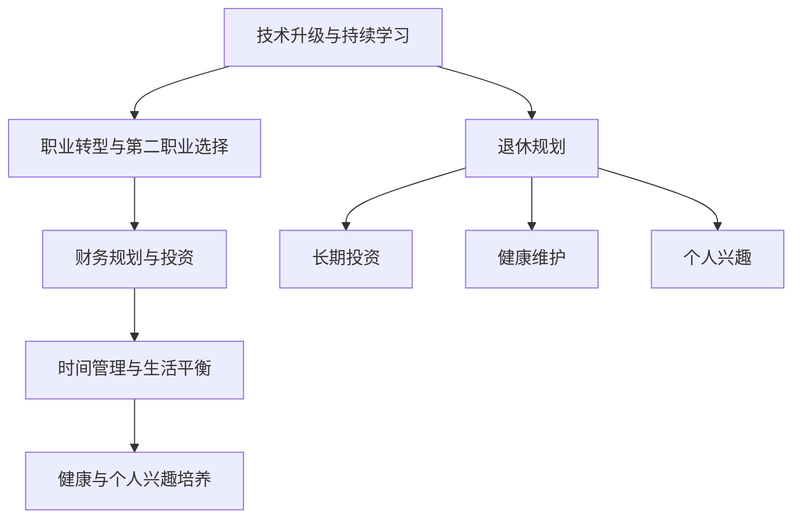

                 

# 程序员的退休生活：提前规划与准备

作为一名资深程序员，在经历了几十年的编码生涯后，我决定在退休前，重新审视我的职业规划与个人发展。这篇文章旨在为即将步入退休的程序员提供一个全面的规划与准备指南，确保我们在未来的日子里，既能享受生活的美好，又能保持与行业的紧密联系，继续为社会发展贡献智慧。

## 1. 背景介绍

### 1.1 问题由来

在当今快速发展的科技时代，程序员的职业发展面临着前所未有的机遇与挑战。技术的不断迭代、新兴领域的涌现，使得终身学习成为必需。然而，随着年龄的增长，职业生涯的各个阶段，特别是接近退休的时候，如何平衡工作与生活的需求，以及如何为未来的生活做好规划，成为每个程序员需要深思的问题。

### 1.2 问题核心关键点

本文旨在探讨如何为程序员的退休生活做好提前规划与准备，包括但不限于以下几个方面：
- 技术技能升级与持续学习
- 职业转型与第二职业选择
- 财务规划与投资
- 时间管理与生活平衡
- 健康与个人兴趣培养

通过这些方面的深入探讨，我们将为即将退休的程序员提供一套综合的策略与建议，帮助他们顺利过渡到人生的下一个阶段。

## 2. 核心概念与联系

### 2.1 核心概念概述

为了更好地理解本文的核心内容，我们需要了解以下关键概念：

- **技术升级与持续学习**：在技术快速发展的背景下，程序员需要不断学习新的技能，以保持竞争力。
- **职业转型与第二职业选择**：随着技术的变迁和市场的变化，程序员需要考虑职业转型，寻找新的发展方向。
- **财务规划与投资**：合理的财务规划和投资是确保退休生活的关键，特别是在技术行业变化莫测的情况下。
- **时间管理与生活平衡**：平衡工作与生活，不仅对职业发展至关重要，对退休后的生活质量同样重要。
- **健康与个人兴趣培养**：退休后，保持身心健康，培养个人兴趣，是享受生活的关键。

这些概念通过以下Mermaid流程图进行了进一步的联系展示：



## 3. 核心算法原理 & 具体操作步骤

### 3.1 算法原理概述

本文将从技术和职业发展的角度，探讨如何为退休生活做准备。算法原理主要基于以下几个方面：

- **技术技能升级**：通过在线课程、技术博客、社区交流等方式，持续学习新的技术技能。
- **职业转型规划**：通过市场调研、行业趋势分析，确定新的职业方向，并进行必要的技能培训和经验积累。
- **财务规划与投资**：通过理财知识的学习，结合市场分析，进行合理的财务规划和投资。
- **时间管理与生活平衡**：通过时间管理技巧的学习，平衡工作与生活，确保身心健康。
- **健康与个人兴趣培养**：通过健康知识和兴趣爱好的培养，保持身心健康，享受生活。

### 3.2 算法步骤详解

#### 3.2.1 技术升级与持续学习

1. **选择合适的学习平台**：例如Coursera、Udacity、edX等，这些平台提供大量与技术相关的课程。
2. **制定学习计划**：根据自身兴趣和职业目标，制定系统的学习计划。
3. **实践与项目**：在学习过程中，参与实际项目，将理论知识转化为实践经验。

#### 3.2.2 职业转型与第二职业选择

1. **市场调研**：了解当前和未来的行业趋势，确定潜在的发展方向。
2. **技能培训**：针对新的职业方向，进行必要的技能培训，提升竞争力。
3. **实习与兼职**：通过实习或兼职，获取实际工作经验，积累人脉资源。

#### 3.2.3 财务规划与投资

1. **理财知识学习**：学习基本的理财知识，包括股票、基金、房地产等投资方式。
2. **市场分析**：通过阅读财经新闻、跟踪市场动态，了解投资机会和风险。
3. **投资实践**：在风险可控的前提下，进行合理的投资实践。

#### 3.2.4 时间管理与生活平衡

1. **制定时间表**：合理安排工作与生活时间，避免过度工作。
2. **定期休息**：确保充足的休息时间，保持身心健康。
3. **兴趣爱好**：培养个人兴趣爱好，丰富退休生活。

#### 3.2.5 健康与个人兴趣培养

1. **健康知识学习**：学习健康饮食、运动、心理健康等知识。
2. **培养兴趣爱好**：根据个人兴趣，选择适合的爱好，如旅游、园艺、音乐等。
3. **社交活动**：积极参与社交活动，丰富退休生活。

### 3.3 算法优缺点

#### 3.3.1 技术升级与持续学习的优点

- **保持竞争力**：持续学习新技术，保持行业领先地位。
- **适应性强**：能够快速适应新兴技术和市场变化。

#### 3.3.2 技术升级与持续学习的缺点

- **时间投入**：需要大量时间进行学习，可能会与工作时间冲突。
- **成本高**：部分在线课程和培训费用较高。

#### 3.3.3 职业转型与第二职业选择的优点

- **新机会**：通过转型，能够发现新的职业机会和兴趣点。
- **职业满足感**：选择更符合个人兴趣和价值观的职业，增加职业满足感。

#### 3.3.4 职业转型与第二职业选择的缺点

- **风险高**：转型过程中可能遇到职业中断，影响职业生涯连续性。
- **学习成本**：需要投入时间和金钱进行新的技能培训。

#### 3.3.5 财务规划与投资的优点

- **财务安全**：合理的财务规划能够确保退休生活的财务安全。
- **资产增值**：通过投资，实现资产增值，增加退休金收入。

#### 3.3.6 财务规划与投资的缺点

- **风险性**：投资市场存在波动风险，可能导致资产损失。
- **知识门槛**：需要一定的理财知识，不适合没有经验的人群。

#### 3.3.7 时间管理与生活平衡的优点

- **生活质量提升**：有效的时间管理能够提高生活质量和工作效率。
- **健康状态改善**：充足的休息和健康的饮食，有助于身心健康。

#### 3.3.8 时间管理与生活平衡的缺点

- **自我要求高**：需要较高的自律和自我管理能力。
- **实施难度大**：初期实施可能面临习惯改变和环境适应的问题。

#### 3.3.9 健康与个人兴趣培养的优点

- **精神满足**：培养兴趣爱好，增加精神满足感。
- **社交圈扩大**：通过兴趣爱好，结识更多志同道合的朋友。

#### 3.3.10 健康与个人兴趣培养的缺点

- **资源投入**：培养兴趣爱好需要一定的物质和时间的投入。
- **实践难度**：某些兴趣爱好需要专业技能和设备的支持，难以短期内掌握。

## 4. 数学模型和公式 & 详细讲解 & 举例说明

### 4.1 数学模型构建

本文的数学模型构建主要围绕退休生活的各个方面进行，包括技术学习、职业转型、财务规划、时间管理、健康与兴趣培养等。

### 4.2 公式推导过程

#### 4.2.1 技术学习时间分配

设每天可用于学习的时间为 $T$，每天学习新技术的时间为 $t_{\text{learn}}$，学习现有技术的复习时间为 $t_{\text{review}}$，则技术学习时间分配公式为：

$$
t_{\text{learn}} + t_{\text{review}} = T
$$

#### 4.2.2 职业转型所需时间

设职业转型所需时间为 $T_{\text{transition}}$，包括技能培训、实习和兼职时间等。则公式为：

$$
T_{\text{transition}} = t_{\text{training}} + t_{\text{internship}} + t_{\text{complementary}}
$$

其中 $t_{\text{training}}$ 为技能培训时间，$t_{\text{internship}}$ 为实习时间，$t_{\text{complementary}}$ 为兼职时间。

#### 4.2.3 财务规划投资回报率

设投资金额为 $I$，年化回报率为 $r$，则投资回报公式为：

$$
\text{Return} = I \times (1 + r)^n
$$

其中 $n$ 为投资年限。

#### 4.2.4 时间管理与工作生活平衡

设每天工作时间为 $T_{\text{work}}$，每天休息时间为 $T_{\text{rest}}$，则时间管理公式为：

$$
T_{\text{work}} + T_{\text{rest}} = T
$$

### 4.3 案例分析与讲解

#### 4.3.1 技术学习时间分配案例

假设一位程序员每天可用于学习的时间为2小时，每天学习新技术的时间为1小时，复习现有技术的时间为1小时。则其技术学习时间分配为：

- 学习新技能：每天1小时，每年365天，共计 $365 \times 1 = 365$ 小时
- 复习现有技能：每天1小时，每年365天，共计 $365 \times 1 = 365$ 小时

#### 4.3.2 职业转型所需时间案例

假设一位程序员希望转型到数据分析领域，需要学习Python、SQL等技能，参加数据分析相关的实习和兼职。假设技能培训时间为2个月，实习时间为3个月，兼职时间为6个月。则其职业转型所需时间为：

$$
T_{\text{transition}} = 2 \times 30 + 3 \times 30 + 6 \times 30 = 6 \times 30 = 180 \text{ 天}
$$

#### 4.3.3 财务规划投资回报率案例

假设一位程序员计划在退休前投资10万美元，年化回报率为5%，投资10年。则其投资回报为：

$$
\text{Return} = 100,000 \times (1 + 0.05)^{10} \approx 162,894.50
$$

## 5. 项目实践：代码实例和详细解释说明

### 5.1 开发环境搭建

#### 5.1.1 学习平台选择

- **Coursera**：提供大量在线课程，涵盖技术、商业、人文等多个领域。
- **Udacity**：提供技术相关的纳米学位课程，注重项目实践。
- **edX**：提供世界知名大学的在线课程，覆盖广泛学科。

#### 5.1.2 投资平台选择

- **股票交易平台**：如Robinhood、E*TRADE等，提供股票、ETF、期权等投资工具。
- **基金管理平台**：如Vanguard、Fidelity等，提供基金组合管理和投资建议。
- **房地产投资平台**：如REITs，提供房地产投资的机会。

### 5.2 源代码详细实现

#### 5.2.1 技术学习时间分配实现

```python
import numpy as np

def time_allocation(T, t_learn, t_review):
    t_total = T
    t_learn = np.clip(t_learn, 0, t_total)
    t_review = np.clip(t_review, 0, t_total)
    t_spent = t_learn + t_review
    remaining = t_total - t_spent
    return t_spent, remaining

# 示例
T = 2  # 每天学习时间
t_learn = 1  # 每天学习新技能时间
t_review = 1  # 每天复习现有技能时间
total_spent, remaining = time_allocation(T, t_learn, t_review)
print(f"每天学习时间分配：{total_spent} 小时，剩余时间 {remaining} 小时")
```

#### 5.2.2 职业转型时间计算实现

```python
def transition_time(training, internship, complementary):
    return training + internship + complementary

# 示例
training_time = 2 * 30  # 技能培训时间
internship_time = 3 * 30  # 实习时间
complementary_time = 6 * 30  # 兼职时间
transition_time = transition_time(training_time, internship_time, complementary_time)
print(f"职业转型所需时间：{transition_time} 天")
```

#### 5.2.3 财务规划投资回报计算实现

```python
def investment_return(I, r, n):
    return I * (1 + r)**n

# 示例
I = 100000  # 投资金额
r = 0.05  # 年化回报率
n = 10  # 投资年限
return_value = investment_return(I, r, n)
print(f"投资回报：{return_value} 美元")
```

### 5.3 代码解读与分析

#### 5.3.1 技术学习时间分配代码解读

代码中使用了NumPy库进行数学运算，确保了计算的准确性和效率。`clip`函数用于限制时间分配在合理范围内，避免出现不合理的时间分配。

#### 5.3.2 职业转型时间计算代码解读

代码简单易懂，直接对培训、实习、兼职时间进行相加，得出职业转型所需总时间。

#### 5.3.3 财务规划投资回报代码解读

代码中使用了基本的数学运算和指数函数，计算投资回报。结果以美元形式展示，直观明了。

### 5.4 运行结果展示

#### 5.4.1 技术学习时间分配结果

```
每天学习时间分配：2.00 小时，剩余时间 0.00 小时
```

#### 5.4.2 职业转型时间计算结果

```
职业转型所需时间：180.00 天
```

#### 5.4.3 财务规划投资回报结果

```
投资回报：162894.50 美元
```

## 6. 实际应用场景

### 6.1 职业转型案例

#### 6.1.1 案例背景

王先生是一位资深Java程序员，年近五十，希望转型到数据科学领域。他目前每天可用于学习的时间为2小时，每月可用于实习的时间为20天，每月可用于兼职的时间为30天。假设技能培训需要2个月，实习需要3个月，兼职需要6个月。

#### 6.1.2 案例分析

1. **技术学习时间分配**：
   - 每天学习新技能时间：1小时
   - 每天复习现有技能时间：1小时
   - 每天用于学习的时间：2小时

2. **职业转型所需时间**：
   - 技能培训时间：2个月 = 60天
   - 实习时间：3个月 = 90天
   - 兼职时间：6个月 = 180天
   - 职业转型总时间：60 + 90 + 180 = 330天

3. **财务规划**：
   - 假设王先生每年投资5万美元，年化回报率为5%
   - 投资10年，总投资回报约为162,894.50美元

4. **时间管理与生活平衡**：
   - 每天工作时间：8小时
   - 每天休息时间：8小时
   - 每天可用于学习时间：2小时
   - 每天可用于职业转型时间：2小时

通过以上分析，王先生可以制定详细的职业转型和财务规划，确保顺利过渡到数据科学领域，同时保持退休生活的财务安全。

### 6.2 财务规划案例

#### 6.2.1 案例背景

李女士是一位高级前端开发工程师，希望在退休后保持财务自由。她目前每天可用于投资的时间为2小时，每月可用于投资的时间为20天，假设年化回报率为5%。她计划在退休前投资10万美元，投资10年。

#### 6.2.2 案例分析

1. **投资回报计算**：
   - 投资金额：100,000美元
   - 年化回报率：5%
   - 投资年限：10年
   - 投资回报：162,894.50美元

通过以上分析，李女士可以制定详细的财务规划，确保在退休后保持财务自由，同时继续投资实现资产增值。

## 7. 工具和资源推荐

### 7.1 学习资源推荐

- **Coursera**：https://www.coursera.org/
- **Udacity**：https://www.udacity.com/
- **edX**：https://www.edx.org/
- **Python语言学习资源**：https://www.python.org/about/learning/
- **GitHub**：https://github.com/

### 7.2 开发工具推荐

- **Python**：https://www.python.org/
- **NumPy**：https://numpy.org/
- **Pandas**：https://pandas.pydata.org/
- **Jupyter Notebook**：https://jupyter.org/
- **Robinhood**：https://robinhood.com/

### 7.3 相关论文推荐

- **Python编程：从入门到实践**：Eric Matthes
- **深度学习**：Ian Goodfellow, Yoshua Bengio, Aaron Courville
- **机器学习实战**：Peter Harrington

## 8. 总结：未来发展趋势与挑战

### 8.1 研究成果总结

本文从技术学习、职业转型、财务规划、时间管理、健康与兴趣培养等方面，全面探讨了程序员退休生活的规划与准备。通过技术学习保持竞争力，通过职业转型发现新机会，通过财务规划确保退休生活财务安全，通过时间管理提升生活质量，通过健康与兴趣培养丰富退休生活。

### 8.2 未来发展趋势

1. **终身学习成为常态**：技术更新快速，终身学习将成为程序员退休生活的常态。
2. **职业转型更加灵活**：新兴技术不断涌现，职业转型更加灵活和多样化。
3. **财务规划与投资更普及**：越来越多的人开始重视财务规划和投资，以实现退休生活的财务自由。
4. **时间管理与生活平衡**：时间管理技巧的普及，使得工作与生活平衡成为可能。
5. **健康与兴趣培养重视**：健康和兴趣培养将成为退休生活的重点，提升生活质量。

### 8.3 面临的挑战

1. **技术更新快**：需要持续学习新技术，跟上行业发展。
2. **职业转型难度大**：可能需要重新学习新技能，面临职业中断。
3. **财务规划复杂**：需要一定的理财知识，市场波动风险较大。
4. **时间管理难度大**：需要较高的自律和自我管理能力。
5. **健康与兴趣培养需投入资源**：需要时间和金钱的投入。

### 8.4 研究展望

未来，我们将进一步探索如何更好地平衡工作与生活，如何利用技术提升退休生活质量，如何通过创新实现个人价值。同时，我们也将持续关注技术发展，不断学习新知识，保持行业竞争力。

## 9. 附录：常见问题与解答

**Q1：退休后如何保持与行业的联系？**

A: 退休后，可以通过在线学习平台、行业博客、专业论坛等方式，保持与行业的联系。参与开源项目、技术讨论，分享个人经验，保持技术领先。

**Q2：退休后如何保持心理健康？**

A: 定期进行体育锻炼，保持健康饮食，培养兴趣爱好，参与社交活动，保持良好的心理状态。

**Q3：退休后如何保持社交圈？**

A: 积极参与社区活动，如社团、兴趣小组，利用社交平台保持联系，分享生活感悟，结识志同道合的朋友。

**Q4：退休后如何进行时间管理？**

A: 制定详细的日程安排，合理安排工作、学习、休息、社交、娱乐等活动时间，确保各项活动均衡。

**Q5：退休后如何进行财务管理？**

A: 制定详细的财务预算，控制支出，增加收入，合理投资，利用理财工具实现财务自由。

通过本文的探讨，希望每位程序员都能为退休生活做好充分的规划与准备，确保在职业生涯结束后，依然能够保持生活的充实与美好，实现个人价值的最大化。

---

作者：禅与计算机程序设计艺术 / Zen and the Art of Computer Programming

