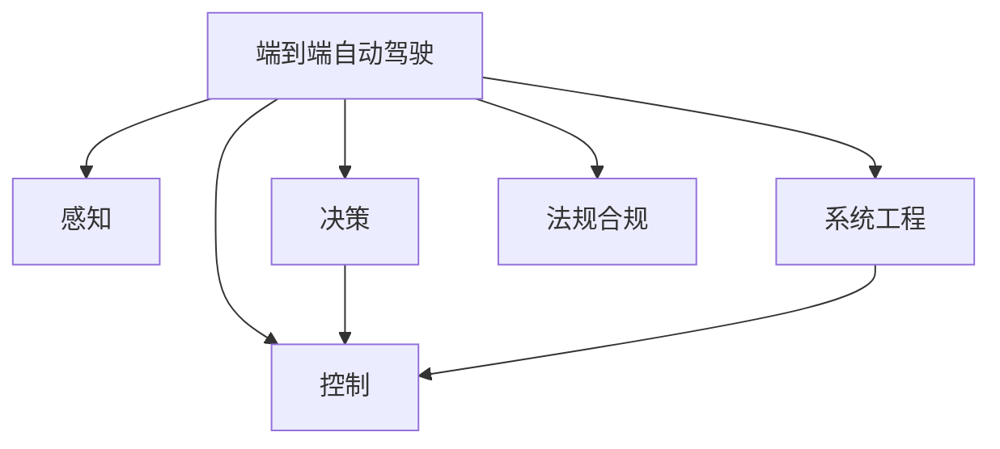

                 

# 端到端自动驾驶的全栈自研挑战

## 1. 背景介绍

### 1.1 问题由来
自动驾驶技术近年来取得了快速进展，得益于高精度地图、传感器融合、智能决策等多个领域的突破。然而，实现端到端的完全自主驾驶仍然面临诸多挑战。这些挑战不仅涉及算法复杂度、计算资源，还涉及硬件集成、系统验证、法规合规等多个层面。本文将从全栈自研的角度，探讨端到端自动驾驶的挑战和突破路径。

### 1.2 问题核心关键点
端到端自动驾驶的全栈自研涉及感知、决策、控制、系统工程等多个环节，每个环节都需要细致入微的设计和优化。以下是全栈自研的核心关键点：

- **感知**：实现高精度、实时、鲁棒的车辆环境感知能力，包括摄像头、雷达、激光雷达等传感器的数据融合。
- **决策**：构建高效、稳定、安全的驾驶决策算法，包含路径规划、行为预测、动作执行等。
- **控制**：实现对车辆的动作控制，包括转向、加速、刹车等，保证动作的精确性和安全性。
- **系统工程**：将各子系统集成，构建完整、健壮、可扩展的系统架构，实现从感知到控制的全流程自动驾驶。
- **法规合规**：确保系统在法规约束下运行，实现道路环境下的安全可靠。

## 2. 核心概念与联系

### 2.1 核心概念概述

为更好地理解端到端自动驾驶全栈自研的挑战，本节将介绍几个密切相关的核心概念：

- **端到端自动驾驶**：从传感器数据输入到车辆动作控制的全流程自主驾驶系统。
- **感知**：通过摄像头、雷达、激光雷达等传感器获取车辆周围环境信息。
- **决策**：基于感知数据，进行路径规划、行为预测、动作执行等决策过程。
- **控制**：根据决策结果，生成具体的控制指令，实现对车辆的动力学控制。
- **全栈自研**：涵盖感知、决策、控制、系统工程等多个环节的自主研发能力。
- **法规合规**：保证系统在法律和标准约束下的运行安全性和合法性。

这些概念之间的逻辑关系可以通过以下Mermaid流程图来展示：



这个流程图展示端到端自动驾驶的核心概念及其之间的关系：

1. 端到端自动驾驶系统基于感知数据，进行决策和控制。
2. 感知模块通过多种传感器获取车辆环境信息。
3. 决策模块基于感知数据，进行路径规划、行为预测等决策。
4. 控制模块根据决策结果，生成具体的控制指令，实现车辆动作。
5. 系统工程模块将各子系统集成，构建完整、健壮的系统架构。
6. 法规合规模块确保系统在法律和标准约束下运行。

## 3. 核心算法原理 & 具体操作步骤
### 3.1 算法原理概述

端到端自动驾驶的核心算法原理包括感知、决策和控制三个方面。

- **感知算法**：通过摄像头、雷达、激光雷达等传感器获取车辆周围环境信息，并将其融合为高精度、实时的感知结果。感知算法通常包括图像处理、目标检测、语义分割、点云处理等多个环节。
- **决策算法**：基于感知结果，进行路径规划、行为预测、动作执行等决策过程。决策算法通常包含规则驱动、深度学习等多种策略。
- **控制算法**：根据决策结果，生成具体的控制指令，实现对车辆的动力学控制。控制算法通常包括模型预测控制、PID控制等。

### 3.2 算法步骤详解

端到端自动驾驶的全栈自研可以分为以下几个关键步骤：

**Step 1: 硬件选型与集成**

- 选择合适的传感器和执行器，并搭建相应的硬件平台。
- 进行多传感器数据融合，实现高精度的环境感知。
- 实现传感器与决策、控制系统的无缝对接，保证数据实时传输。

**Step 2: 软件架构设计与优化**

- 设计高效的感知、决策、控制等模块架构，实现模块化和可扩展性。
- 优化各模块的通信机制，保证实时性。
- 进行代码和性能优化，确保系统的高效运行。

**Step 3: 系统集成与测试**

- 集成各子系统，构建完整的自动驾驶系统。
- 进行全面的系统测试，包括仿真测试和实际道路测试。
- 收集测试结果，不断优化系统性能。

**Step 4: 法规合规与验证**

- 确保系统符合相关法规和标准，如自动驾驶分级标准、道路交通安全法规等。
- 进行详细的法规合规验证，确保系统在实际道路环境下的安全性。
- 与行业、政府机构进行沟通，推动法规和标准的制定和更新。

### 3.3 算法优缺点

端到端自动驾驶的全栈自研方法具有以下优点：

- 集成化程度高，从感知到控制形成闭环，系统可靠性好。
- 各子系统可以根据需求进行定制，灵活性高。
- 可以深入优化各子系统的性能，提升系统整体效率。

同时，该方法也存在一定的局限性：

- 需要较强的硬件和软件资源支持，成本较高。
- 各子系统集成复杂，调试和优化难度大。
- 系统可靠性提升需要较长时间和大量实验验证，风险高。

尽管存在这些局限性，但就目前而言，端到端自动驾驶的全栈自研方法仍是最主流的技术路径。未来相关研究的重点在于如何降低硬件成本，提高集成效率，同时兼顾系统性能和安全性等因素。

### 3.4 算法应用领域

端到端自动驾驶的全栈自研方法已经在多个领域得到应用，例如：

- **物流配送**：通过自动驾驶车辆实现高效率、低成本的物流配送服务。
- **公共交通**：自动驾驶公交、出租车等公共交通工具，提升城市交通效率。
- **智能城市**：在智能城市中实现自动驾驶交通管理，提升交通安全性。
- **货运运输**：实现大宗货物的自动驾驶运输，降低物流成本，提高运输效率。
- **智慧农业**：在智慧农业中实现自动驾驶农机，提高农业生产效率。
- **无人驾驶车队**：构建无人驾驶车队，为智能停车、智能清洁等提供基础保障。

除了上述这些经典应用外，端到端自动驾驶的全栈自研技术还在不断拓展，为各个垂直行业的数字化转型提供新的技术路径。

## 4. 数学模型和公式 & 详细讲解 & 举例说明

### 4.1 数学模型构建

为了更好地理解端到端自动驾驶的感知、决策和控制算法，本节将介绍几个关键数学模型：

- **感知模型**：包括图像处理模型、目标检测模型、点云处理模型等。
- **决策模型**：包括路径规划模型、行为预测模型等。
- **控制模型**：包括模型预测控制模型、PID控制模型等。

### 4.2 公式推导过程

以目标检测为例，我们采用YOLO（You Only Look Once）模型进行目标检测。假设输入图像大小为$H \times W$，模型输出包含多个网格和预测框，每个预测框包含类别概率和边界框信息。

YOLO模型的目标函数为：

$$
\mathcal{L}=\mathcal{L}_{\text{class}}+\mathcal{L}_{\text{box}}+\mathcal{L}_{\text{obj}}
$$

其中$\mathcal{L}_{\text{class}}$为类别损失函数，$\mathcal{L}_{\text{box}}$为边界框损失函数，$\mathcal{L}_{\text{obj}}$为目标检测损失函数。

类别损失函数通常采用交叉熵损失函数：

$$
\mathcal{L}_{\text{class}}=-\frac{1}{N}\sum_{i=1}^N\sum_{j=1}^C y_j\log(\hat{y}_j)+(1-y_j)\log(1-\hat{y}_j)
$$

边界框损失函数通常采用平滑L1损失函数：

$$
\mathcal{L}_{\text{box}}=\frac{1}{N}\sum_{i=1}^N\sum_{j=1}^C |b_j-\hat{b}_j|^p
$$

目标检测损失函数通常采用二分类交叉熵损失函数：

$$
\mathcal{L}_{\text{obj}}=\frac{1}{N}\sum_{i=1}^N\sum_{j=1}^C b_j\log(\hat{b}_j)+(1-b_j)\log(1-\hat{b}_j)
$$

其中$b_j$为第$j$个预测框的置信度，$\hat{b}_j$为模型预测的置信度。

### 4.3 案例分析与讲解

以图像处理为例，常用的图像处理模型包括RCNN、Fast R-CNN、Faster R-CNN、YOLO、SSD等。这里以YOLO为例，展示其核心算法流程。

YOLO模型将图像划分为$S \times S$个网格，每个网格预测$B$个目标框，每个目标框包含$K$个特征。输入图像通过卷积神经网络（CNN）提取特征，并进行非极大值抑制（NMS）处理，最终输出目标框和类别概率。

以YOLOv3为例，其基本流程如下：

1. 将输入图像划分为$S \times S$个网格，每个网格预测$B$个目标框。
2. 对每个目标框，预测$K$个特征，包括类别概率和边界框信息。
3. 通过多尺度卷积层提取不同尺度的特征。
4. 对每个特征图，使用反卷积层生成多个预测框。
5. 对每个预测框，计算置信度和预测类别。
6. 进行非极大值抑制，筛选出置信度高的目标框。

通过YOLO模型，可以实现实时、高效的目标检测，适用于自动驾驶等对实时性要求高的场景。

## 5. 项目实践：代码实例和详细解释说明

### 5.1 开发环境搭建

在进行端到端自动驾驶全栈自研实践前，我们需要准备好开发环境。以下是使用Python进行TensorFlow开发的设备配置流程：

1. 安装Anaconda：从官网下载并安装Anaconda，用于创建独立的Python环境。

2. 创建并激活虚拟环境：
```bash
conda create -n tf-env python=3.8 
conda activate tf-env
```

3. 安装TensorFlow：根据CUDA版本，从官网获取对应的安装命令。例如：
```bash
conda install tensorflow==2.7-cu111_8.0
```

4. 安装PyTorch：
```bash
pip install torch torchvision torchaudio
```

5. 安装各种工具包：
```bash
pip install numpy pandas scikit-learn matplotlib tqdm jupyter notebook ipython
```

完成上述步骤后，即可在`tf-env`环境中开始全栈自研实践。

### 5.2 源代码详细实现

这里我们以自动驾驶路径规划为例，给出使用TensorFlow进行端到端自动驾驶路径规划的代码实现。

首先，定义路径规划的目标函数：

```python
import tensorflow as tf
import numpy as np

def path_planning_cost(pose, target):
    dx = target[0] - pose[0]
    dy = target[1] - pose[1]
    return (dx**2 + dy**2)**0.5
```

然后，定义路径规划的优化目标：

```python
def optimize_path_planning(pose, target, max_iterations=1000, learning_rate=0.01):
    cost = path_planning_cost(pose, target)
    gradients = tf.gradients(cost, pose)
    for i in range(max_iterations):
        pose -= learning_rate * gradients
        cost = path_planning_cost(pose, target)
        if cost < 1e-6:
            break
    return pose
```

接着，定义路径规划的模拟测试函数：

```python
def simulate_path_planning(pose, target, iterations=100):
    result = []
    for i in range(iterations):
        target = optimize_path_planning(pose, target)
        result.append(target)
    return np.array(result)
```

最后，启动路径规划的模拟测试：

```python
pose = [0, 0]
target = [10, 0]
result = simulate_path_planning(pose, target)
print(result)
```

以上就是使用TensorFlow进行端到端自动驾驶路径规划的完整代码实现。可以看到，通过TensorFlow的低级API，可以灵活定义目标函数、优化目标，并实现路径规划的模拟测试。

### 5.3 代码解读与分析

让我们再详细解读一下关键代码的实现细节：

**path_planning_cost函数**：
- 定义了路径规划的目标函数，计算当前位置与目标位置之间的距离。

**optimize_path_planning函数**：
- 定义了路径规划的优化目标，通过梯度下降法最小化目标函数，不断调整当前位置，直至达到目标位置。
- 通过tf.gradients函数计算目标函数对当前位置的梯度，并使用梯度下降法更新当前位置。
- 设置最大迭代次数和迭代次数，以保证优化过程收敛。

**simulate_path_planning函数**：
- 定义了路径规划的模拟测试，通过多次调用optimize_path_planning函数，模拟路径规划的过程，并记录每次优化后的位置。

**模拟测试**：
- 设置初始位置和目标位置，调用simulate_path_planning函数，模拟路径规划过程，并输出最终结果。

可以看到，TensorFlow的低级API提供了强大的计算和优化功能，可以灵活定义复杂的算法模型和优化过程。在全栈自研实践时，可以通过TensorFlow的低级API实现高性能的模型构建和优化，从而提升系统性能。

当然，全栈自研的实际开发中，还需要考虑更多的因素，如多线程并发、分布式训练、硬件资源优化等，但这核心算法流程大致与此类似。

## 6. 实际应用场景
### 6.1 物流配送

基于端到端自动驾驶的全栈自研技术，可以构建高效率、低成本的物流配送系统。传统物流配送依赖人工驾驶，存在路线规划不合理、配送效率低等问题。自动驾驶车辆能够自主规划最优路径，避开拥堵区域，提升配送效率，降低运营成本。

在技术实现上，可以部署多辆自动驾驶车辆，进行集群调度。车辆配备高精度摄像头、雷达、激光雷达等传感器，实现全面的环境感知。通过路径规划算法生成最优路径，使用控制算法实现车辆动作控制。系统还可以实时监测车辆状态和环境信息，保障配送过程的安全性。

### 6.2 智能交通

智能交通是自动驾驶的重要应用场景，基于端到端自动驾驶的全栈自研技术，可以实现智能交通管理。智能交通系统可以实时监测交通流量、路况信息，实现智能信号灯控制、车道自动调整等功能。自动驾驶车辆能够自主遵循交通规则，减少交通事故，提升交通效率。

在技术实现上，智能交通系统需要与城市基础设施、交通管理平台等进行深度集成。车辆配备多传感器，实时采集交通数据。通过感知模块进行环境感知，决策模块进行路径规划和行为预测，控制模块实现车辆动作控制。系统还应具备自动紧急避障、车道保持等高级功能，保障行车安全。

### 6.3 无人驾驶出租车

无人驾驶出租车是自动驾驶的重要应用方向，基于端到端自动驾驶的全栈自研技术，可以实现无人驾驶出租车的运营。无人驾驶出租车能够24小时不间断运营，提供全天候的出行服务，提升出行便捷性。

在技术实现上，无人驾驶出租车需要具备高精度环境感知、路径规划、行为预测、车辆控制等能力。系统需要与城市交通管理系统、计费系统等进行深度集成，实现精准调度。车辆配备高精度摄像头、雷达、激光雷达等传感器，实时感知环境信息。通过感知模块进行环境感知，决策模块进行路径规划和行为预测，控制模块实现车辆动作控制。系统还需要具备自动泊车、自动充电等功能，提升用户体验。

### 6.4 未来应用展望

随着端到端自动驾驶全栈自研技术的不断发展，其在更多领域的应用前景将进一步拓展。

在智慧医疗领域，自动驾驶车辆能够自主执行医疗物资配送、紧急救援等任务，提升医疗服务效率。在智慧农业领域，自动驾驶农机能够自主进行农作物种植、收获、病虫害防治等操作，提高农业生产效率。在智慧城市治理中，自动驾驶车辆能够执行交通管理、垃圾清运、环境监测等任务，提升城市管理水平。

此外，端到端自动驾驶的全栈自研技术还将应用于更多场景中，如无人驾驶车队、无人驾驶无人机、无人驾驶机器人等，为各行各业带来新的发展机遇。相信随着技术的不断进步，端到端自动驾驶全栈自研技术必将在更广阔的领域大放异彩，推动智能技术的普及应用。

## 7. 工具和资源推荐
### 7.1 学习资源推荐

为了帮助开发者系统掌握端到端自动驾驶的全栈自研技术，这里推荐一些优质的学习资源：

1. 《深度学习》系列课程：由斯坦福大学等机构开设的深度学习课程，涵盖神经网络、卷积神经网络、循环神经网络等多个主题，是深度学习的入门基础。

2. 《自动驾驶技术》系列书籍：由国内外知名专家编写，涵盖自动驾驶技术的多个方向，如感知、决策、控制、系统工程等。

3. 《自动驾驶实战》系列视频：由自动驾驶技术专家讲解，通过实际案例和代码实现，详细讲解自动驾驶技术实现过程中的各种挑战和解决方案。

4. Udacity《自动驾驶纳米学位》：Udacity与Coursera合作推出的自动驾驶课程，通过在线学习、项目实践，帮助学员掌握自动驾驶技术。

5. 《OpenCV计算机视觉实战》书籍：该书详细介绍了计算机视觉技术，包括图像处理、目标检测、语义分割等多个方面，是计算机视觉技术的入门基础。

通过对这些资源的学习实践，相信你一定能够快速掌握端到端自动驾驶的全栈自研技术，并用于解决实际的自动驾驶问题。

### 7.2 开发工具推荐

高效的开发离不开优秀的工具支持。以下是几款用于端到端自动驾驶全栈自研开发的常用工具：

1. TensorFlow：由Google主导开发的深度学习框架，支持分布式计算、自动微分等特性，适合大规模模型训练。

2. PyTorch：由Facebook主导开发的深度学习框架，支持动态计算图、GPU加速等特性，适合灵活的模型构建。

3. ROS（Robot Operating System）：开源的机器人操作系统，支持多传感器数据融合、运动控制等，适合自动驾驶车辆的开发。

4. Docker：容器化技术，支持快速部署、管理应用程序，适合分布式系统的开发和运维。

5. GitLab：代码托管平台，支持版本控制、CI/CD、项目管理等功能，适合团队协作开发。

6. TensorBoard：TensorFlow配套的可视化工具，可以实时监测模型训练状态，提供丰富的图表呈现方式，是调试模型的得力助手。

合理利用这些工具，可以显著提升端到端自动驾驶全栈自研开发的效率，加快创新迭代的步伐。

### 7.3 相关论文推荐

端到端自动驾驶的全栈自研技术源于学界的持续研究。以下是几篇奠基性的相关论文，推荐阅读：

1. 《End-to-End Deep Learning for Self-Driving Cars》：提出使用深度学习实现端到端自动驾驶，突破传统传感器融合、路径规划等技术瓶颈。

2. 《Towards Autonomous Driving: An Overview of the Computing and Algorithms》：全面概述了自动驾驶的各个环节，包括感知、决策、控制等，并讨论了其技术挑战。

3. 《Deep Neural Networks for Autonomous Driving》：详细介绍了深度学习在自动驾驶中的应用，包括目标检测、路径规划、控制等，并讨论了其模型和算法。

4. 《A Survey on Adaptive Control for Intelligent Vehicle》：综述了智能车辆控制技术，包括模型预测控制、PID控制、模糊控制等。

5. 《Understanding the Design of Autonomous Vehicles》：介绍了自动驾驶车辆的设计和集成，包括感知、决策、控制等子系统的设计和实现。

这些论文代表了大规模自动驾驶全栈自研技术的发展脉络。通过学习这些前沿成果，可以帮助研究者把握学科前进方向，激发更多的创新灵感。

## 8. 总结：未来发展趋势与挑战

### 8.1 总结

本文对端到端自动驾驶的全栈自研方法进行了全面系统的介绍。首先阐述了端到端自动驾驶全栈自研的背景和意义，明确了从感知到控制各个环节的重要性。其次，从原理到实践，详细讲解了感知、决策、控制的算法原理和具体操作步骤，给出了全栈自研任务的代码实现。同时，本文还探讨了全栈自研在多个行业领域的应用前景，展示了全栈自研技术的巨大潜力。

通过本文的系统梳理，可以看到，端到端自动驾驶的全栈自研技术正在成为自动驾驶领域的重要范式，极大地拓展了自动驾驶系统的应用边界，催生了更多的落地场景。受益于高精度感知、高效决策和精确控制，端到端自动驾驶全栈自研技术必将在未来的智能交通、无人驾驶出租车、物流配送等多个领域大放异彩，深刻影响人类的出行和生活方式。

### 8.2 未来发展趋势

展望未来，端到端自动驾驶的全栈自研技术将呈现以下几个发展趋势：

1. 传感器融合技术将进一步优化，通过多传感器数据融合，实现更高精度的环境感知。
2. 深度学习技术将更广泛应用，通过深度学习实现更加高效的感知、决策和控制算法。
3. 分布式计算和分布式系统将得到广泛应用，通过分布式计算提升系统处理能力和可靠性。
4. 智能算法将不断涌现，通过AI算法优化感知、决策和控制过程，提升系统性能。
5. 系统集成和测试技术将不断优化，通过系统集成测试提升系统稳定性和可靠性。

这些趋势凸显了端到端自动驾驶全栈自研技术的广阔前景。这些方向的探索发展，必将进一步提升自动驾驶系统的性能和应用范围，为智能交通、无人驾驶出租车、物流配送等提供新的技术路径。

### 8.3 面临的挑战

尽管端到端自动驾驶的全栈自研技术已经取得了瞩目成就，但在迈向更加智能化、普适化应用的过程中，它仍面临诸多挑战：

1. 硬件成本高昂。当前自动驾驶车辆配备的传感器和执行器价格昂贵，限制了自动驾驶技术的大规模部署。如何降低硬件成本，是未来技术突破的关键。

2. 安全性和可靠性不足。自动驾驶系统在复杂环境中，仍面临一定的安全风险和可靠性问题。如何提升系统的鲁棒性和可靠性，是未来的重要研究方向。

3. 法规和标准不完善。自动驾驶技术的法规和标准尚不完善，限制了技术的应用和推广。如何制定统一的法规和标准，推动技术规范化和标准化，将是未来的重要课题。

4. 多传感器数据融合复杂。多传感器数据融合技术需要考虑数据采集、数据同步、数据融合等多个环节，技术复杂度高。如何简化数据融合过程，提升数据融合效率，是未来的重要研究方向。

5. 系统集成和测试难度大。系统集成和测试过程复杂，涉及多子系统的集成和调试，效率低。如何优化系统集成和测试流程，提升系统开发效率，是未来的重要研究方向。

这些挑战凸显了端到端自动驾驶全栈自研技术的复杂性和难度。尽管如此，随着技术的不断进步和产业界的持续努力，相信这些挑战终将一一被克服，端到端自动驾驶全栈自研技术必将在未来的智能交通、无人驾驶出租车、物流配送等众多领域发挥重要作用。

### 8.4 研究展望

面对端到端自动驾驶全栈自研所面临的挑战，未来的研究需要在以下几个方面寻求新的突破：

1. 探索更高效的传感器融合技术，降低硬件成本，提升环境感知能力。

2. 研究更加智能化的算法，提升系统的感知、决策和控制能力。

3. 开发分布式计算和分布式系统，提升系统处理能力和可靠性。

4. 优化系统集成和测试流程，提升系统开发效率和稳定性。

5. 制定统一的法规和标准，推动技术规范化和标准化。

6. 结合人工智能技术，开发更加智能化的自动驾驶系统。

这些研究方向的探索，必将引领端到端自动驾驶全栈自研技术迈向更高的台阶，为智能交通、无人驾驶出租车、物流配送等众多领域提供新的技术路径。

## 9. 附录：常见问题与解答

**Q1：端到端自动驾驶的全栈自研方法是否适用于所有应用场景？**

A: 端到端自动驾驶的全栈自研方法适用于多种应用场景，如智能交通、无人驾驶出租车、物流配送等。但不同场景下，对系统性能、成本、安全性等要求不同，需要进行针对性的优化和改进。例如，在智能交通中，系统需要处理复杂的城市交通环境，需要更高精度的感知和决策能力；在物流配送中，系统需要处理多辆车辆的调度和管理，需要高效的路径规划和资源分配算法。

**Q2：如何优化端到端自动驾驶的感知模块？**

A: 优化端到端自动驾驶的感知模块，可以从以下几个方面入手：

1. 优化传感器硬件。选择高精度的传感器，如高分辨率摄像头、高精度雷达、高精度激光雷达等。

2. 优化传感器数据融合算法。通过多传感器数据融合，提升环境感知能力。

3. 优化目标检测算法。使用深度学习算法，如YOLO、SSD等，实现实时、高效的目标检测。

4. 优化语义分割算法。使用语义分割算法，如U-Net、FCN等，实现对场景的精确分割。

5. 优化环境建模算法。使用环境建模算法，如VoxelGrid等，实现对环境的三维建模。

**Q3：如何优化端到端自动驾驶的决策模块？**

A: 优化端到端自动驾驶的决策模块，可以从以下几个方面入手：

1. 优化路径规划算法。使用A\*、RRT等算法，实现高效的路径规划。

2. 优化行为预测算法。使用行为预测算法，如回归模型、深度学习模型等，实现对行人、车辆等行为的预测。

3. 优化决策算法。使用决策算法，如强化学习、动态规划等，实现对复杂环境的决策。

4. 优化动作执行算法。使用动作执行算法，如PID控制、模型预测控制等，实现对车辆的动力学控制。

**Q4：如何优化端到端自动驾驶的控制模块？**

A: 优化端到端自动驾驶的控制模块，可以从以下几个方面入手：

1. 优化车辆动力学模型。使用车辆动力学模型，如车辆模型、轮胎模型等，实现对车辆动力学的精确建模。

2. 优化控制器算法。使用控制器算法，如PID控制、模型预测控制等，实现对车辆的动力学控制。

3. 优化动作执行算法。使用动作执行算法，如PID控制、模型预测控制等，实现对车辆的动力学控制。

4. 优化实时控制策略。通过实时控制策略，实现对车辆动作的实时控制。

**Q5：如何优化端到端自动驾驶的全栈系统？**

A: 优化端到端自动驾驶的全栈系统，可以从以下几个方面入手：

1. 优化感知模块。优化传感器硬件和数据融合算法，提升环境感知能力。

2. 优化决策模块。优化路径规划、行为预测和决策算法，提升决策能力。

3. 优化控制模块。优化车辆动力学模型、控制器和动作执行算法，提升控制能力。

4. 优化系统集成。优化系统集成流程和工具，提升系统集成效率。

5. 优化测试流程。优化测试流程和工具，提升系统测试效率和可靠性。

6. 优化法规合规。制定统一的法规和标准，推动技术规范化和标准化。

通过优化感知、决策、控制和系统集成等各个环节，可以提升端到端自动驾驶系统的性能和可靠性，确保其在实际应用中的安全和稳定。

---

作者：禅与计算机程序设计艺术 / Zen and the Art of Computer Programming

