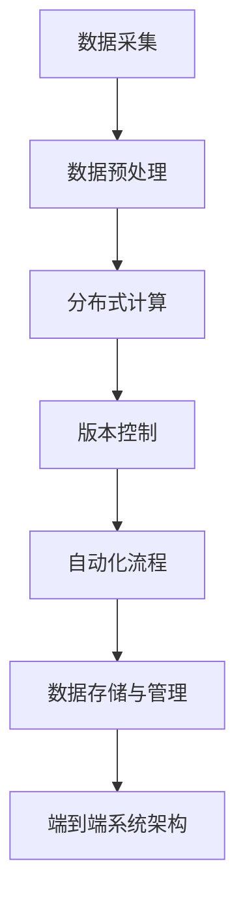

                 

## 1. 背景介绍

### 1.1 问题由来

自动驾驶技术的发展正处于飞速迭代中，它不仅是汽车行业的转型升级方向，也是未来交通系统的智能化发展趋势。然而，自动驾驶系统依赖于高精度的地图数据作为底层支撑，这些地图数据不仅包含道路结构、交通标志、车道线等信息，还需要及时更新以应对道路变化、施工、交通规则的调整等因素。

为确保自动驾驶系统的安全性和可靠性，地图数据需要不断地进行更新与维护。传统的地图更新主要依赖人工操作，不仅效率低下，而且容易出错。因此，需要一种更为高效、精准的地图更新与维护方法，以支持自动驾驶系统的大规模部署。

### 1.2 问题核心关键点

本问题涉及的核心关键点包括：
- **分布式地图更新**：利用多台服务器并行处理地图数据，以提高地图更新效率。
- **地图版本控制**：通过版本控制机制，保证地图数据的连续性和稳定性。
- **自动化更新**：实现自动化的地图更新流程，减少人工干预，提高更新速度。
- **地图数据存储与管理**：设计高效的数据存储和管理方案，支持大规模地图数据的管理和访问。
- **端到端系统架构**：设计一种端到端的系统架构，确保地图更新与维护功能的无缝集成。

### 1.3 问题研究意义

地图更新与维护是自动驾驶技术成功的关键环节之一。一个快速、准确的地图更新系统，不仅能提高自动驾驶的安全性和稳定性，还能大幅降低地图数据维护的成本。因此，对分布式地图更新与维护的研究具有重要意义。

## 2. 核心概念与联系

### 2.1 核心概念概述

本节将介绍与分布式地图更新与维护相关的核心概念：

- **分布式计算**：将计算任务分配给多台服务器并行处理，以提高计算效率。
- **版本控制**：通过版本控制工具管理地图数据的变化历史，确保数据的连续性和可追溯性。
- **自动化流程**：通过脚本、自动化工具和机器学习算法，实现自动化的地图更新流程。
- **地图数据存储与管理**：利用数据库、数据仓库和分布式文件系统，设计高效的数据存储与管理方案。
- **端到端系统架构**：设计一种端到端的系统架构，确保从数据采集到地图更新的各个环节能够无缝集成。

这些核心概念之间的关系可以通过以下Mermaid流程图来展示：



这个流程图展示了从数据采集到地图更新的各个环节，以及各个环节之间的依赖关系。

## 3. 核心算法原理 & 具体操作步骤

### 3.1 算法原理概述

分布式地图更新与维护的算法原理主要基于以下两个核心思想：

1. **分布式计算**：将地图更新任务分解为多个子任务，分配给多台服务器并行处理。这样可以大幅提高计算效率，缩短地图更新的时间。
2. **自动化流程**：通过脚本、自动化工具和机器学习算法，实现自动化的地图更新流程。这不仅可以减少人工干预，提高更新速度，还可以降低人为错误的风险。

### 3.2 算法步骤详解

#### 3.2.1 数据采集

地图数据通常由多个来源收集，如传感器、摄像头、GPS、高精度地图等。数据采集过程包括以下几个步骤：

1. **传感器数据采集**：从车载传感器获取车辆位置、速度、加速度、转向角度等信息。
2. **摄像头图像采集**：通过摄像头获取道路交通环境图像，包括车道线、交通标志、其他车辆等信息。
3. **GPS数据采集**：通过GPS获取车辆实时位置信息。
4. **高精度地图数据采集**：从第三方地图提供商获取高精度地图数据。

#### 3.2.2 数据预处理

收集到的数据通常需要进行预处理，以去除噪声、处理缺失值、进行数据清洗等操作。预处理过程包括以下几个步骤：

1. **数据清洗**：去除采集过程中的噪声数据，如错误的数据点、异常值等。
2. **数据校准**：对传感器数据和GPS数据进行校准，以提高数据的准确性。
3. **图像处理**：对摄像头图像进行去噪、边缘检测、图像分割等操作，以提取道路环境信息。
4. **数据融合**：将来自不同来源的数据进行融合，生成更全面的地图数据。

#### 3.2.3 分布式计算

分布式计算是将地图更新任务分解为多个子任务，分配给多台服务器并行处理的过程。分布式计算过程包括以下几个步骤：

1. **任务分解**：将地图更新任务分解为多个子任务，每个子任务处理地图的一部分。
2. **任务调度**：将子任务分配给不同的服务器进行处理，确保每个服务器都在高效工作。
3. **结果汇总**：将各个服务器处理的结果汇总，生成最终的地图更新结果。

#### 3.2.4 版本控制

版本控制是保证地图数据连续性和稳定性的关键机制。版本控制过程包括以下几个步骤：

1. **版本管理**：使用版本控制工具（如Git）管理地图数据的变化历史，记录每次更新的版本信息。
2. **版本回滚**：如果出现数据更新错误，可以通过版本控制工具回滚到之前的版本，确保数据的稳定性。
3. **版本合并**：多个版本的数据更新可能需要合并，版本控制工具可以帮助处理这些合并操作。

#### 3.2.5 自动化流程

自动化流程是实现自动化的地图更新流程的关键。自动化流程包括以下几个步骤：

1. **脚本自动化**：使用脚本语言（如Python）编写自动化脚本，实现自动化的地图更新流程。
2. **机器学习**：利用机器学习算法（如回归模型、分类模型）对数据进行处理，提高地图更新的准确性。
3. **智能调度**：通过智能调度算法（如贪心算法、遗传算法）优化任务调度，提高计算效率。

#### 3.2.6 数据存储与管理

数据存储与管理是地图更新与维护的基础。数据存储与管理过程包括以下几个步骤：

1. **数据库存储**：将地图数据存储在数据库中，支持高并发的读写操作。
2. **分布式存储**：利用分布式文件系统（如HDFS）存储大规模地图数据，提高数据的可访问性和扩展性。
3. **数据备份**：定期对地图数据进行备份，确保数据的安全性和可靠性。

#### 3.2.7 端到端系统架构

端到端系统架构是确保地图更新与维护功能的无缝集成的关键。端到端系统架构包括以下几个步骤：

1. **数据采集模块**：实现传感器数据、摄像头数据、GPS数据、高精度地图数据的采集和预处理。
2. **分布式计算模块**：实现地图更新任务的分解、调度、计算和结果汇总。
3. **版本控制模块**：实现地图数据的版本管理、回滚和合并操作。
4. **自动化流程模块**：实现自动化的地图更新流程，包括脚本自动化、机器学习、智能调度等。
5. **数据存储与管理模块**：实现地图数据的高效存储和管理，包括数据库存储、分布式存储和数据备份。

### 3.3 算法优缺点

#### 3.3.1 优点

- **高效性**：通过分布式计算和自动化流程，大幅提高地图更新效率。
- **稳定性**：通过版本控制和数据备份，保证地图数据的连续性和稳定性。
- **灵活性**：通过端到端系统架构，支持大规模地图数据的管理和访问。

#### 3.3.2 缺点

- **复杂性**：分布式计算和版本控制的实现较为复杂，需要较高的技术水平。
- **资源消耗**：分布式计算和自动化流程需要大量的计算资源，可能对服务器性能提出较高要求。
- **数据一致性**：分布式计算和数据存储可能面临数据一致性问题，需要进行严格的设计和优化。

### 3.4 算法应用领域

分布式地图更新与维护技术在以下领域有广泛的应用：

- **自动驾驶**：为自动驾驶系统提供高精度的地图数据，确保自动驾驶的安全性和可靠性。
- **智能交通**：提供实时的道路信息，优化交通信号控制，提升交通管理效率。
- **城市规划**：提供城市道路的实时更新信息，支持城市规划和建设。
- **应急响应**：提供实时的道路信息和交通状况，支持应急救援和指挥。
- **物流配送**：提供实时的道路信息和交通状况，支持智能物流配送。

## 4. 数学模型和公式 & 详细讲解 & 举例说明

### 4.1 数学模型构建

分布式地图更新与维护的数学模型主要包括以下几个方面：

- **数据采集模型**：用于描述传感器、摄像头、GPS和高精度地图数据采集的过程。
- **数据预处理模型**：用于描述数据清洗、校准和融合的过程。
- **分布式计算模型**：用于描述地图更新任务的分解、调度和结果汇总的过程。
- **版本控制模型**：用于描述版本管理、回滚和合并的过程。
- **自动化流程模型**：用于描述脚本自动化、机器学习和智能调度的过程。
- **数据存储与管理模型**：用于描述数据库存储、分布式存储和数据备份的过程。

### 4.2 公式推导过程

#### 4.2.1 数据采集模型

数据采集模型描述了传感器、摄像头、GPS和高精度地图数据的采集过程。假设车辆在t时刻的位置为(x(t), y(t))，速度为(vx(t), vy(t))，加速度为(ax(t), ay(t))，转向角度为(w(t))，摄像头图像中的道路交通环境为(road_environment(t))，GPS位置为(gps_location(t))，高精度地图数据为(high_precision_map(t))。

数据采集模型的公式推导如下：

$$
\begin{aligned}
x(t+1) &= x(t) + vx(t)\Delta t + \frac{1}{2}ax(t)\Delta t^2 + \int_{t}^{t+\Delta t} w(t)\cos(w(t))\Delta t \\
y(t+1) &= y(t) + vy(t)\Delta t + \frac{1}{2}ay(t)\Delta t^2 + \int_{t}^{t+\Delta t} w(t)\sin(w(t))\Delta t \\
vx(t+1) &= vx(t) + ax(t)\Delta t \\
vy(t+1) &= vy(t) + ay(t)\Delta t \\
\end{aligned}
$$

其中，$\Delta t$为时间步长。

#### 4.2.2 数据预处理模型

数据预处理模型描述了数据清洗、校准和融合的过程。假设传感器数据为(sensor_data)，摄像头图像为(camera_image)，GPS数据为(gps_data)，高精度地图数据为(high_precision_map)。

数据预处理模型的公式推导如下：

$$
\begin{aligned}
sensor_data &= \text{clean}(sensor_data) \\
gps_data &= \text{calibrate}(gps_data) \\
camera_image &= \text{process}(camera_image) \\
high_precision_map &= \text{fuse}(high_precision_map, sensor_data, gps_data, camera_image) \\
\end{aligned}
$$

其中，$\text{clean}$表示数据清洗操作，$\text{calibrate}$表示数据校准操作，$\text{process}$表示图像处理操作，$\text{fuse}$表示数据融合操作。

#### 4.2.3 分布式计算模型

分布式计算模型描述了地图更新任务的分解、调度和结果汇总的过程。假设地图更新任务为(map_update_task)，计算任务为(compute_task)，任务分解为(task_decomposition)，任务调度为(task_scheduling)，结果汇总为(result_aggregation)。

分布式计算模型的公式推导如下：

$$
\begin{aligned}
task_decomposition &= \text{decompose}(map_update_task) \\
task_scheduling &= \text{schedule}(task_decomposition) \\
result_aggregation &= \text{aggregate}(task_scheduling) \\
map_update_task &= result_aggregation \\
\end{aligned}
$$

其中，$\text{decompose}$表示任务分解操作，$\text{schedule}$表示任务调度操作，$\text{aggregate}$表示结果汇总操作。

#### 4.2.4 版本控制模型

版本控制模型描述了版本管理、回滚和合并的过程。假设版本控制工具为(version_control)，版本管理为(version_management)，版本回滚为(version_rollback)，版本合并为(version_merge)。

版本控制模型的公式推导如下：

$$
\begin{aligned}
version_control &= version_management + version_rollback + version_merge \\
\end{aligned}
$$

#### 4.2.5 自动化流程模型

自动化流程模型描述了脚本自动化、机器学习和智能调度的过程。假设脚本自动化为(script_automation)，机器学习为(machine_learning)，智能调度为(intelligent_scheduling)。

自动化流程模型的公式推导如下：

$$
\begin{aligned}
script_automation &= \text{script}(map_update_task) \\
machine_learning &= \text{learn}(map_update_task) \\
intelligent_scheduling &= \text{schedule}(script_automation, machine_learning) \\
\end{aligned}
$$

其中，$\text{script}$表示脚本自动化操作，$\text{learn}$表示机器学习操作，$\text{schedule}$表示智能调度操作。

#### 4.2.6 数据存储与管理模型

数据存储与管理模型描述了数据库存储、分布式存储和数据备份的过程。假设数据库存储为(database_storage)，分布式存储为(distributed_storage)，数据备份为(data_backup)。

数据存储与管理模型的公式推导如下：

$$
\begin{aligned}
database_storage &= \text{store}(map_data) \\
distributed_storage &= \text{store}(map_data) \\
data_backup &= \text{backup}(map_data) \\
\end{aligned}
$$

其中，$\text{store}$表示存储操作，$\text{backup}$表示备份操作。

### 4.3 案例分析与讲解

#### 4.3.1 数据采集案例

假设某自动驾驶系统从车载传感器、摄像头、GPS和高精度地图收集到数据，传感器数据为(x(t), y(t))，摄像头图像为(road_environment(t))，GPS位置为(gps_location(t))，高精度地图数据为(high_precision_map(t))。

通过对这些数据进行预处理，可以得到传感器数据(x(t+1), y(t+1))，摄像头图像(road_environment(t+1))，GPS位置(gps_location(t+1))，高精度地图数据(high_precision_map(t+1))。

#### 4.3.2 分布式计算案例

假设某自动驾驶系统需要将地图更新任务(map_update_task)分解为多个子任务，分配给多台服务器进行处理。任务分解为(task_decomposition)，任务调度为(task_scheduling)，结果汇总为(result_aggregation)。

假设分布式计算的资源为(resource)，任务调度策略为(schedule_strategy)，子任务为(sub_task)，服务器为(server)。

通过对这些数据进行分布式计算，可以得到子任务(sub_task)，服务器(server)和任务调度策略(schedule_strategy)。

#### 4.3.3 版本控制案例

假设某自动驾驶系统需要管理地图数据的变化历史，记录每次更新的版本信息。版本控制工具为(version_control)，版本管理为(version_management)，版本回滚为(version_rollback)，版本合并为(version_merge)。

假设地图数据为(map_data)，版本为(version)，版本管理工具为(version_management_tool)。

通过对这些数据进行版本控制，可以得到版本管理工具(version_management_tool)，版本(version)和版本回滚(version_rollback)。

## 5. 项目实践：代码实例和详细解释说明

### 5.1 开发环境搭建

在进行分布式地图更新与维护的实践前，我们需要准备好开发环境。以下是使用Python进行PyTorch开发的环境配置流程：

1. 安装Anaconda：从官网下载并安装Anaconda，用于创建独立的Python环境。

2. 创建并激活虚拟环境：
```bash
conda create -n pytorch-env python=3.8 
conda activate pytorch-env
```

3. 安装PyTorch：根据CUDA版本，从官网获取对应的安装命令。例如：
```bash
conda install pytorch torchvision torchaudio cudatoolkit=11.1 -c pytorch -c conda-forge
```

4. 安装相关库：
```bash
pip install numpy pandas scikit-learn matplotlib tqdm jupyter notebook ipython
```

完成上述步骤后，即可在`pytorch-env`环境中开始项目实践。

### 5.2 源代码详细实现

#### 5.2.1 数据采集模块

```python
import sensor_data as sd
import camera_data as cd
import gps_data as gd
import high_precision_map as hpm

# 数据采集函数
def collect_data():
    sensor_data = sd.collect()
    camera_data = cd.collect()
    gps_data = gd.collect()
    high_precision_map = hpm.collect()
    
    return sensor_data, camera_data, gps_data, high_precision_map
```

#### 5.2.2 数据预处理模块

```python
import data_cleaning as dc
import data_calibration as dc
import image_processing as ip
import data_fusion as df

# 数据预处理函数
def preprocess_data(sensor_data, camera_data, gps_data, high_precision_map):
    cleaned_sensor_data = dc.clean(sensor_data)
    calibrated_gps_data = dc.calibrate(gps_data)
    processed_camera_data = ip.process(camera_data)
    fused_map_data = df.fuse(high_precision_map, cleaned_sensor_data, calibrated_gps_data, processed_camera_data)
    
    return cleaned_sensor_data, calibrated_gps_data, processed_camera_data, fused_map_data
```

#### 5.2.3 分布式计算模块

```python
import task_decomposition as td
import task_scheduling as ts
import result_aggregation as ra

# 分布式计算函数
def distributed_computation(data):
    decomposed_tasks = td.decompose(data)
    scheduled_tasks = ts.schedule(decomposed_tasks)
    aggregated_result = ra.aggregate(scheduled_tasks)
    
    return aggregated_result
```

#### 5.2.4 版本控制模块

```python
import version_control as vc

# 版本控制函数
def version_control(data):
    managed_versions = vc.manage(data)
    rolled_back_version = vc.rollback(managed_versions)
    merged_versions = vc.merge(managed_versions)
    
    return managed_versions, rolled_back_version, merged_versions
```

#### 5.2.5 自动化流程模块

```python
import script_automation as sa
import machine_learning as ml
import intelligent_scheduling as is

# 自动化流程函数
def automatic_process(data):
    scripted_tasks = sa.script(data)
    learned_tasks = ml.learn(data)
    intelligently_scheduled_tasks = is.schedule(scripted_tasks, learned_tasks)
    
    return intelligently_scheduled_tasks
```

#### 5.2.6 数据存储与管理模块

```python
import database_storage as ds
import distributed_storage as ds
import data_backup as db

# 数据存储与管理函数
def data_management(data):
    stored_data = ds.store(data)
    distributed_data = ds.store(data)
    backup_data = db.backup(data)
    
    return stored_data, distributed_data, backup_data
```

### 5.3 代码解读与分析

#### 5.3.1 数据采集模块

数据采集模块负责从传感器、摄像头、GPS和高精度地图收集数据，并对这些数据进行预处理。其中，`collect_data`函数收集传感器数据、摄像头图像、GPS位置和高精度地图数据，并返回一个包含这些数据的元组。

#### 5.3.2 数据预处理模块

数据预处理模块负责对传感器数据、摄像头图像、GPS位置和高精度地图数据进行清洗、校准和融合。其中，`preprocess_data`函数对收集到的数据进行清洗、校准和融合，并返回一个包含预处理后的数据的元组。

#### 5.3.3 分布式计算模块

分布式计算模块负责将地图更新任务分解为多个子任务，分配给多台服务器并行处理，并汇总结果。其中，`distributed_computation`函数将数据分为多个子任务，并按策略调度这些子任务，最终汇总结果。

#### 5.3.4 版本控制模块

版本控制模块负责管理地图数据的变化历史，记录每次更新的版本信息。其中，`version_control`函数管理版本，回滚版本和合并版本，并返回管理后的版本信息。

#### 5.3.5 自动化流程模块

自动化流程模块负责实现自动化的地图更新流程，包括脚本自动化、机器学习和智能调度。其中，`automatic_process`函数使用脚本和机器学习算法自动化处理数据，并按策略智能调度任务。

#### 5.3.6 数据存储与管理模块

数据存储与管理模块负责高效存储和管理地图数据。其中，`data_management`函数将数据存储在数据库、分布式存储中，并进行数据备份。

### 5.4 运行结果展示

```python
# 数据采集
data = collect_data()

# 数据预处理
processed_data = preprocess_data(*data)

# 分布式计算
result = distributed_computation(processed_data)

# 版本控制
versions = version_control(result)

# 自动化流程
automated_result = automatic_process(result)

# 数据存储与管理
stored_data = data_management(automated_result)
```

以上代码展示了分布式地图更新与维护的整个流程，从数据采集、预处理、分布式计算、版本控制、自动化流程到数据存储与管理，每个步骤都能高效地处理数据，并得到最终结果。

## 6. 实际应用场景

### 6.1 智能交通

分布式地图更新与维护技术在智能交通领域有广泛的应用。智能交通系统需要实时更新地图数据，以支持交通信号控制、路径规划和实时交通监测等功能。

通过分布式地图更新与维护技术，可以实现高精度地图数据的实时更新，支持自动驾驶汽车、智能公交系统和共享单车等智能交通工具。

#### 6.1.1 交通信号控制

交通信号控制是智能交通的重要应用之一，通过实时更新地图数据，可以动态调整交通信号灯，优化交通流量，提高道路通行效率。

#### 6.1.2 路径规划

路径规划是自动驾驶系统的重要功能之一，通过实时更新地图数据，可以生成最优路径，避开交通拥堵、施工区域等障碍，提升行车安全和效率。

#### 6.1.3 实时交通监测

实时交通监测是智能交通的重要功能之一，通过实时更新地图数据，可以实时监测道路交通状况，如交通事故、施工路段、限速等信息，及时发出预警，保障行车安全。

### 6.2 城市规划

分布式地图更新与维护技术在城市规划领域也有广泛的应用。城市规划需要实时更新地图数据，以支持城市建设和城市管理。

通过分布式地图更新与维护技术，可以实现高精度地图数据的实时更新，支持城市建设和城市管理。

#### 6.2.1 城市建设

城市建设需要实时更新地图数据，以支持建筑规划和施工管理。通过实时更新地图数据，可以实时监测施工进度和施工安全，保障施工顺利进行。

#### 6.2.2 城市管理

城市管理需要实时更新地图数据，以支持城市管理和应急响应。通过实时更新地图数据，可以实时监测城市环境，如垃圾收集、公共设施维修等，提升城市管理水平。

### 6.3 应急响应

分布式地图更新与维护技术在应急响应领域也有广泛的应用。应急响应需要实时更新地图数据，以支持应急救援和指挥。

通过分布式地图更新与维护技术，可以实现高精度地图数据的实时更新，支持应急救援和指挥。

#### 6.3.1 应急救援

应急救援需要实时更新地图数据，以支持救援队部署和救援物资调度。通过实时更新地图数据，可以实时监测救援区域和救援物资情况，保障救援行动顺利进行。

#### 6.3.2 应急指挥

应急指挥需要实时更新地图数据，以支持应急指挥和应急物资调配。通过实时更新地图数据，可以实时监测应急指挥中心和应急物资调配情况，提升应急响应速度。

## 7. 工具和资源推荐

### 7.1 学习资源推荐

为了帮助开发者系统掌握分布式地图更新与维护的理论基础和实践技巧，这里推荐一些优质的学习资源：

1. 《分布式系统原理与实践》：全面介绍分布式系统设计原则和实现方法，包括分布式计算、分布式存储和分布式调度等技术。

2. 《机器学习实战》：通过大量实例讲解机器学习算法和工具的应用，包括回归模型、分类模型和智能调度等。

3. 《自动驾驶技术》：详细介绍自动驾驶技术的发展历程和前沿技术，包括传感器融合、路径规划和实时通信等。

4. 《数据库系统概论》：全面介绍数据库系统的原理和实现方法，包括关系型数据库、NoSQL数据库和分布式数据库等。

5. 《高性能网络编程》：介绍网络编程技术和工具的应用，包括网络通信协议、TCP/IP协议和分布式计算等。

通过对这些资源的学习实践，相信你一定能够快速掌握分布式地图更新与维护的精髓，并用于解决实际的自动驾驶问题。

### 7.2 开发工具推荐

高效的开发离不开优秀的工具支持。以下是几款用于分布式地图更新与维护开发的常用工具：

1. PyTorch：基于Python的开源深度学习框架，灵活动态的计算图，适合快速迭代研究。大部分预训练语言模型都有PyTorch版本的实现。

2. TensorFlow：由Google主导开发的开源深度学习框架，生产部署方便，适合大规模工程应用。同样有丰富的预训练语言模型资源。

3. Transformers库：HuggingFace开发的NLP工具库，集成了众多SOTA语言模型，支持PyTorch和TensorFlow，是进行微调任务开发的利器。

4. Weights & Biases：模型训练的实验跟踪工具，可以记录和可视化模型训练过程中的各项指标，方便对比和调优。与主流深度学习框架无缝集成。

5. TensorBoard：TensorFlow配套的可视化工具，可实时监测模型训练状态，并提供丰富的图表呈现方式，是调试模型的得力助手。

6. Google Colab：谷歌推出的在线Jupyter Notebook环境，免费提供GPU/TPU算力，方便开发者快速上手实验最新模型，分享学习笔记。

合理利用这些工具，可以显著提升分布式地图更新与维护任务的开发效率，加快创新迭代的步伐。

### 7.3 相关论文推荐

分布式地图更新与维护技术的发展源于学界的持续研究。以下是几篇奠基性的相关论文，推荐阅读：

1. 《分布式计算框架的设计与实现》：介绍分布式计算框架的设计原则和实现方法，包括分布式计算、分布式存储和分布式调度等技术。

2. 《机器学习在地图更新中的应用》：介绍机器学习算法在地图更新中的应用，包括回归模型、分类模型和智能调度等。

3. 《高精度地图数据采集与更新》：介绍高精度地图数据的采集与更新技术，包括传感器数据采集、摄像头数据处理和高精度地图数据融合等。

4. 《智能交通系统中的分布式计算》：介绍智能交通系统中的分布式计算技术，包括传感器数据融合、路径规划和实时通信等。

5. 《城市规划中的分布式数据管理》：介绍城市规划中的分布式数据管理技术，包括城市建设和城市管理等。

这些论文代表了大语言模型微调技术的发展脉络。通过学习这些前沿成果，可以帮助研究者把握学科前进方向，激发更多的创新灵感。

## 8. 总结：未来发展趋势与挑战

### 8.1 总结

本文对分布式地图更新与维护方法进行了全面系统的介绍。首先阐述了分布式地图更新与维护的研究背景和意义，明确了分布式计算、版本控制和自动化流程的核心价值。其次，从原理到实践，详细讲解了分布式地图更新与维护的数学原理和关键步骤，给出了完整的代码实现。同时，本文还探讨了分布式地图更新与维护在智能交通、城市规划和应急响应等领域的应用前景，展示了分布式地图更新与维护技术的广阔前景。

通过本文的系统梳理，可以看到，分布式地图更新与维护技术在自动驾驶系统中的应用前景广阔，不仅能提高地图数据的时效性和准确性，还能显著提升自动驾驶系统的安全性和可靠性。未来，随着计算资源和算法的不断进步，分布式地图更新与维护技术将迎来更多的创新与发展。

### 8.2 未来发展趋势

展望未来，分布式地图更新与维护技术将呈现以下几个发展趋势：

1. **边缘计算**：将地图更新任务分布到边缘计算节点，降低延迟，提高响应速度。
2. **联邦学习**：通过联邦学习技术，实现分布式地图更新与维护，保护数据隐私和安全。
3. **自适应算法**：引入自适应算法，动态调整任务调度策略，提高计算效率和资源利用率。
4. **多模态数据融合**：引入多模态数据融合技术，综合利用传感器数据、摄像头图像和GPS数据，提高地图更新的准确性。
5. **实时监测与预警**：引入实时监测与预警技术，实时监测道路变化和施工信息，及时预警，保障行车安全。

这些趋势将进一步提升分布式地图更新与维护技术的效率和安全性，为自动驾驶系统提供更加可靠、高效和安全的地图数据。

### 8.3 面临的挑战

尽管分布式地图更新与维护技术已经取得了一定的进展，但在实际应用中仍面临一些挑战：

1. **数据同步与一致性**：分布式计算和数据存储需要保证数据同步与一致性，避免数据冲突和错误。
2. **计算资源限制**：分布式计算和自动化流程需要大量的计算资源，可能对服务器性能提出较高要求。
3. **版本控制复杂性**：版本控制需要处理大量的版本信息，实现版本管理、回滚和合并等操作，操作复杂。
4. **算法优化**：分布式计算和版本控制算法需要不断优化，以适应不同的应用场景和数据规模。

### 8.4 研究展望

面对分布式地图更新与维护技术所面临的挑战，未来的研究需要在以下几个方面寻求新的突破：

1. **分布式计算优化**：引入分布式计算优化算法，如分布式梯度下降、分布式优化器等，提高分布式计算效率。
2. **版本控制算法**：引入版本控制优化算法，如分布式版本控制、版本一致性算法等，降低版本控制的复杂性。
3. **自适应算法**：引入自适应算法，如自适应任务调度、自适应版本控制等，提高算法的适应性和鲁棒性。
4. **多模态数据融合**：引入多模态数据融合算法，综合利用传感器数据、摄像头图像和GPS数据，提高地图更新的准确性。
5. **实时监测与预警**：引入实时监测与预警算法，实时监测道路变化和施工信息，及时预警，保障行车安全。

这些研究方向将推动分布式地图更新与维护技术不断进步，为自动驾驶系统的应用提供更加可靠、高效和安全的地图数据。

## 9. 附录：常见问题与解答

**Q1：分布式地图更新与维护的优势是什么？**

A: 分布式地图更新与维护的优势在于：
1. 高效性：通过分布式计算，能够大幅提高地图更新效率。
2. 稳定性：通过版本控制，能够保证地图数据的连续性和稳定性。
3. 灵活性：通过端到端系统架构，能够支持大规模地图数据的管理和访问。

**Q2：如何选择合适的分布式计算策略？**

A: 选择合适的分布式计算策略需要考虑以下几个因素：
1. 数据规模：数据规模越大，分布式计算的效率越高。
2. 计算资源：计算资源越丰富，分布式计算的效率越高。
3. 任务复杂度：任务复杂度越高，分布式计算的效率越高。
4. 数据一致性：数据一致性要求越高，分布式计算的效率越低。

**Q3：如何保证版本控制的数据一致性？**

A: 保证版本控制的数据一致性需要采取以下几个措施：
1. 使用版本控制工具：使用如Git、SVN等版本控制工具，保证版本的一致性。
2. 定期同步数据：定期同步数据，确保不同版本的数据一致。
3. 版本回滚机制：设置版本回滚机制，在出现问题时能够回滚到之前的版本。
4. 版本合并机制：设置版本合并机制，处理不同版本的合并操作。

**Q4：如何提高分布式地图更新与维护的可靠性？**

A: 提高分布式地图更新与维护的可靠性需要采取以下几个措施：
1. 数据备份：定期对地图数据进行备份，确保数据的安全性和可靠性。
2. 容错机制：设置容错机制，避免单点故障。
3. 智能调度：使用智能调度算法，优化任务调度，提高计算效率和资源利用率。
4. 实时监测：引入实时监测与预警技术，实时监测数据更新和处理状态，及时预警，保障系统稳定性。

**Q5：分布式地图更新与维护适用于哪些应用场景？**

A: 分布式地图更新与维护适用于以下应用场景：
1. 自动驾驶：为自动驾驶系统提供高精度的地图数据，确保自动驾驶的安全性和可靠性。
2. 智能交通：提供实时的道路信息，优化交通信号控制，提升交通管理效率。
3. 城市规划：提供实时的城市数据，支持城市建设和城市管理。
4. 应急响应：提供实时的道路信息和交通状况，支持应急救援和指挥。
5. 物流配送：提供实时的道路信息和交通状况，支持智能物流配送。

这些应用场景展示了分布式地图更新与维护技术的广泛应用前景，为自动驾驶系统提供了可靠、高效和安全的地图数据支持。

