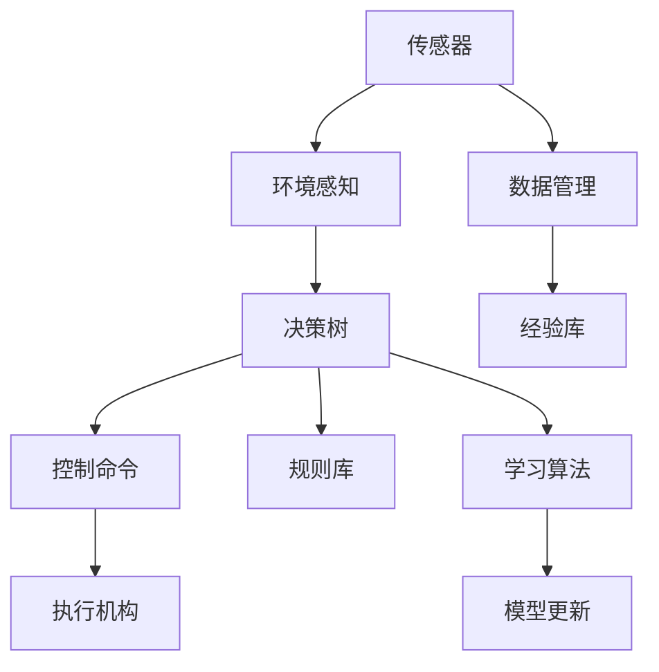

                 

## 1. 背景介绍

随着自动驾驶技术的快速发展，构建一个安全、可靠、高效的自驾驶系统，需要理解并处理复杂的交通场景和行为，这不仅仅涉及车辆的感知和控制，还包括了道路环境、交通法规、驾驶习惯等多种因素。传统自动驾驶系统依赖传感器和规则库进行决策，但在复杂和动态场景下，这样的系统难以兼顾鲁棒性和准确性。本文将介绍一种端到端自动驾驶的自主决策机制设计，利用深度学习和大数据技术，通过强化学习，使车辆能够自主学习和优化决策策略。

## 2. 核心概念与联系

### 2.1 核心概念概述

为了更清晰地理解端到端自动驾驶的自主决策机制，我们首先介绍几个核心概念：

- **强化学习(Reinforcement Learning, RL)**：一种通过奖励和惩罚信号，使智能体在环境中学习最优策略的学习方式。在自动驾驶中，智能体即为车辆，其决策对应动作，而奖励则与交通法规、安全距离等有关。

- **深度强化学习(Deep Reinforcement Learning, DRL)**：结合深度学习与强化学习的技术，通过神经网络对复杂环境进行建模，学习复杂决策策略。

- **端到端学习(End-to-End Learning)**：在模型训练中，从输入到输出的全过程都由同一模型完成，避免了传统方法中层次化设计和手动调整规则的复杂性。

- **自驾驶决策树(Decision Tree)**：将决策过程分解为多个子任务，通过层次化的决策节点，对复杂决策问题进行建模和处理。

- **路径规划(Path Planning)**：在了解环境与目标的前提下，通过优化算法找出最优的行驶路径。

### 2.2 核心概念原理和架构的 Mermaid 流程图

以下是一个简单的 Mermaid 流程图，展示了端到端自动驾驶的自主决策机制：



这个流程图展示了从传感器输入到车辆执行的决策链条。具体来说：

1. **传感器** 感知车辆周围的环境，并将其转化为可处理的信号。
2. **环境感知** 通过传感器数据，构建车辆所处环境的模型。
3. **决策树** 根据感知数据，通过一系列决策节点，选择最佳驾驶动作。
4. **控制命令** 根据决策结果，生成具体的控制指令。
5. **执行机构** 根据控制指令，实际调整车辆的行驶状态。
6. **数据管理** 记录所有传感器数据和决策过程，为后续的模型优化和经验积累提供数据。
7. **经验库** 存储过去驾驶经验，帮助模型学习。
8. **规则库** 包含交通法规和行为规范，对模型决策进行约束。
9. **学习算法** 通过奖励机制，对模型进行强化学习。
10. **模型更新** 根据经验库和规则库，更新决策模型。

通过以上各个组件的协同工作，车辆能够从感知到执行的全过程中，自主学习并优化决策策略。

## 3. 核心算法原理 & 具体操作步骤

### 3.1 算法原理概述

端到端自动驾驶的自主决策机制基于强化学习和深度学习的原理，结合自驾驶决策树进行设计。该系统首先通过环境感知模块获取车辆周围环境的信息，并将其转化为车辆可以理解的格式。接着，决策树根据感知数据和目标，生成一系列决策节点，每个节点对应一个具体的驾驶动作，如加速、刹车、变道等。最后，车辆根据决策树输出的控制命令，调整行驶状态。

在强化学习过程中，系统通过模拟环境，根据奖励信号调整决策树的节点策略。奖励信号可以是安全驾驶、遵守交通规则、提高行驶效率等，而惩罚信号则可能包括交通事故、超速、违反法规等。在每个时间步长内，车辆会通过一个策略网络预测最优动作，并通过模型更新模块不断调整策略，以达到最优决策效果。

### 3.2 算法步骤详解

以下详细介绍了端到端自动驾驶自主决策机制的设计步骤：

**Step 1: 环境感知模块设计**

环境感知模块需要处理来自传感器的大量数据，如雷达、摄像头、GPS等。将传感器数据进行预处理和融合，得到车辆所处环境的可视化表示，如图像、点云等。这里可以使用深度学习技术，如卷积神经网络(CNN)、点云卷积网络(PVN)等，对多模态数据进行高效处理。

**Step 2: 决策树构建**

决策树的设计是自主决策机制的核心。根据任务需求和环境特点，设计层次化的决策节点，每个节点代表一种可能的驾驶动作。节点之间通过连接关系表示决策依赖，即一个节点的决策取决于前一个节点的输出。决策树的构建需要考虑多种因素，如交通法规、驾驶规则、环境动态变化等。

**Step 3: 策略网络训练**

策略网络用于预测在给定环境状态下的最优动作。可以选择基于深度强化学习的方法，如深度Q网络(DQN)、策略梯度(SPG)等，对策略网络进行训练。通过模拟环境中的多次试驾，策略网络能够学习到在各种环境条件下的最佳驾驶策略。

**Step 4: 模型更新和经验积累**

模型更新模块负责根据奖励信号和惩罚信号，更新决策树中的策略参数。可以使用在线学习算法，如Q-learning、SARSA等，实时更新策略网络。同时，将每次试驾过程中的经验数据存储到经验库中，为后续的模型优化和策略调整提供数据支持。

**Step 5: 控制命令生成和执行**

根据决策树的输出，生成具体的控制命令，如加速度、方向、速度等，并将其发送给车辆的执行机构。执行机构根据控制命令，调整车辆的行驶状态，最终实现自主驾驶。

### 3.3 算法优缺点

**优点**：

- **端到端设计**：无需手工设计复杂的决策规则，减少规则库的维护成本。
- **自适应性强**：能够根据环境和目标动态调整策略，适应不同驾驶场景。
- **鲁棒性好**：在面对不确定性和复杂环境时，具有较高的鲁棒性和泛化能力。
- **可扩展性强**：易于扩展和集成新的传感器、决策节点和执行机构。

**缺点**：

- **训练成本高**：需要大量的试驾数据和计算资源进行模型训练。
- **环境复杂性**：在复杂和动态环境下，模型的决策过程可能出现偏差。
- **安全性问题**：自主决策过程中，如果模型未能正确处理极端情况，可能存在安全隐患。

### 3.4 算法应用领域

端到端自动驾驶的自主决策机制在以下几个领域具有广泛的应用前景：

- **城市驾驶**：在城市复杂交通环境中，自主决策机制能够优化交通流量，提高行车效率，并降低事故率。
- **高速公路驾驶**：在高速公路等相对单一的驾驶场景中，自主决策机制能够实现更高效、更安全的行驶。
- **特殊道路**：如山地、沙漠、乡村等特殊道路，自主决策机制能够适应不同路况，保障行车安全。
- **自动停车**：在停车场、狭小空间等需要高精度控制的区域，自主决策机制能够实现自动泊车。
- **物流运输**：在物流配送中，自主决策机制能够实现高效路径规划，优化货物配送路线。

## 4. 数学模型和公式 & 详细讲解 & 举例说明

### 4.1 数学模型构建

端到端自动驾驶的自主决策机制可以通过以下数学模型进行描述：

设车辆在当前状态 $s_t$ 下的动作策略为 $a_t$，奖励信号为 $r_t$，状态转移为 $s_{t+1}$，则强化学习的目标是最大化长期累积奖励，即：

$$
\max_{\pi} \mathbb{E}\left[\sum_{t=1}^{\infty} \gamma^t r_t \right]
$$

其中 $\pi$ 表示策略，$\gamma$ 为折扣因子。在每个时间步长 $t$，车辆根据策略网络 $\pi(a_t|s_t)$ 预测最优动作 $a_t$，并根据状态转移模型 $p(s_{t+1}|s_t,a_t)$ 更新状态。

### 4.2 公式推导过程

以下推导强化学习的核心公式：

**策略网络**：

- **策略梯度**：使用策略梯度方法，最大化对数似然，即：

$$
\max_{\pi} \mathbb{E}\left[\log\pi(a_t|s_t) \right]
$$

**模型更新**：

- **Q-learning**：通过Q-learning算法更新策略网络，即：

$$
Q(s_t,a_t) \leftarrow Q(s_t,a_t) + \alpha \left[ r_t + \gamma \max_{a'} Q(s_{t+1},a') - Q(s_t,a_t) \right]
$$

其中 $\alpha$ 为学习率。

**决策树**：

- **层次化决策**：决策树通过层次化设计，将决策过程分解为多个子任务，每个子任务对应一个决策节点。节点策略 $p(a_t|s_t)$ 可以通过学习算法得到。

### 4.3 案例分析与讲解

考虑一个简单的交通信号灯场景，车辆在交叉口需要进行选择。决策树可以设计为：

- **决策节点1**：判断信号灯状态。
- **决策节点2**：选择通过或等待。
- **决策节点3**：判断是否允许转弯。

在每个节点，车辆通过策略网络预测最优动作，并通过Q-learning算法更新节点策略。在模型更新过程中，奖励信号包括信号灯的合法性、安全行驶、等待时间等。通过多次训练和测试，决策树能够学习到最优的驾驶策略。

## 5. 项目实践：代码实例和详细解释说明

### 5.1 开发环境搭建

**Step 1: 环境配置**

1. **安装 Python**：选择 Python 3.7 或更高版本，建议使用 Anaconda 进行管理。

2. **安装 TensorFlow**：使用 pip 或 conda 安装 TensorFlow 2.0 以上版本，建议使用 GPU 版本以提高计算效率。

3. **安装 OpenAI Gym**：Gym 提供了各种模拟环境和训练工具，方便强化学习模型的训练。

4. **安装其他依赖**：如 NumPy、SciPy、Pillow 等，用于数据处理和图像显示。

**Step 2: 设置虚拟环境**

1. 使用虚拟环境隔离依赖，保证项目的稳定性和可重复性。

```bash
conda create -n auto_driving python=3.7
conda activate auto_driving
```

2. 安装所有依赖。

```bash
pip install tensorflow gym numpy scipy pillow
```

### 5.2 源代码详细实现

以下是一个简单的端到端自动驾驶决策机制的 Python 代码实现：

```python
import gym
import numpy as np
import tensorflow as tf

class AutoDrivingEnv(gym.Env):
    def __init__(self):
        super(AutoDrivingEnv, self).__init__()
        self.state = np.zeros((3,))
        self.action_space = gym.spaces.Discrete(2)  # 左转或右转
        self.reward_range = (-1, 1)

    def step(self, action):
        if action == 0:  # 左转
            self.state[0] -= 1
        else:  # 右转
            self.state[0] += 1
        self.state[1] += 0.1
        reward = self.state[0] - 0.01 * self.state[1] ** 2
        done = np.abs(self.state[0]) > 0.5
        return self.state, reward, done, {}

class AutoDrivingModel(tf.keras.Model):
    def __init__(self):
        super(AutoDrivingModel, self).__init__()
        self.fc1 = tf.keras.layers.Dense(16, activation='relu')
        self.fc2 = tf.keras.layers.Dense(8, activation='relu')
        self.fc3 = tf.keras.layers.Dense(2, activation='softmax')

    def call(self, inputs):
        x = self.fc1(inputs)
        x = self.fc2(x)
        return self.fc3(x)

model = AutoDrivingModel()
model.compile(optimizer=tf.keras.optimizers.Adam(0.01),
              loss=tf.keras.losses.MeanSquaredError(),
              metrics=['accuracy'])

# 训练模型
env = AutoDrivingEnv()
for episode in range(1000):
    state = env.reset()
    while True:
        action_probs = model.predict(np.array([state]))
        action = np.random.choice(np.arange(2), p=action_probs[0])
        next_state, reward, done, _ = env.step(action)
        model.train_on_batch(np.array([state]), np.array([action]))
        if done:
            break
        state = next_state
```

### 5.3 代码解读与分析

**AutoDrivingEnv 类**：

- 定义了模拟环境的初始状态、动作空间、奖励范围。
- 实现 `step` 方法，根据当前状态和动作，计算奖励和状态转移，返回下一个状态。
- 在测试过程中，使用随机策略采样动作，进行训练。

**AutoDrivingModel 类**：

- 定义了策略网络的结构，包括三个全连接层。
- 实现 `call` 方法，通过网络对输入进行前向传播。
- 在训练过程中，使用 `train_on_batch` 方法，更新模型参数。

**训练过程**：

- 通过 `AutoDrivingModel` 和 `AutoDrivingEnv` 进行模型训练，每轮迭代从环境获取状态，通过策略网络采样动作，并根据状态和动作计算奖励。
- 使用 `train_on_batch` 方法，更新模型参数。
- 训练完成后，策略网络能够输出当前状态下的最佳动作概率。

### 5.4 运行结果展示

运行训练后的模型，验证其决策能力：

```python
for episode in range(1000):
    state = env.reset()
    while True:
        action_probs = model.predict(np.array([state]))
        action = np.random.choice(np.arange(2), p=action_probs[0])
        next_state, reward, done, _ = env.step(action)
        env.render()
        if done:
            break
        state = next_state
```

在训练过程中，模型会逐步学习到最优的驾驶策略，最终能够自主选择最佳的转向动作。

## 6. 实际应用场景

### 6.1 智能交通管理

端到端自动驾驶的自主决策机制可以应用于智能交通管理系统中，通过实时监控和控制道路上的车辆，优化交通流量，降低交通拥堵和事故率。在交通信号灯控制、路口引导、异常事件处理等方面，该系统能够提供高效、智能的解决方案。

### 6.2 无人驾驶物流

在无人驾驶物流领域，该系统能够实现高精度的路径规划和导航，自动驾驶车辆可以在复杂的物流环境中高效、安全地运输货物。通过与物流平台对接，该系统能够实现货物的自动装卸、配送路径的动态调整，大幅提升物流效率。

### 6.3 城市安全监控

在城市安全监控中，该系统可以用于监控交通动态，及时发现和应对异常事件。通过在车辆上安装传感器和摄像头，系统能够实时监测交通状态，并根据决策树输出最佳应对策略，保障城市安全。

## 7. 工具和资源推荐

### 7.1 学习资源推荐

1. **Deep Reinforcement Learning with TensorFlow 2: Building Intelligent Agents**：通过该书，读者可以深入了解深度强化学习的基本原理和应用实践。

2. **Reinforcement Learning: An Introduction**：Sutton 和 Barto 的经典教材，详细介绍了强化学习的基本理论和算法。

3. **OpenAI Gym**：Gym 提供了丰富的模拟环境和训练工具，是学习强化学习的最佳实践平台。

4. **TensorFlow Tutorials**：TensorFlow 官方提供的各种教程，涵盖深度学习、强化学习等多个方向。

5. **DeepMind**：DeepMind 的研究论文和博客，提供了大量的前沿算法和研究成果。

### 7.2 开发工具推荐

1. **TensorFlow**：Google 开发的深度学习框架，支持分布式训练和 GPU 加速。

2. **PyTorch**：Facebook 开发的深度学习框架，易于上手，提供了丰富的神经网络层。

3. **Gym**：OpenAI 开发的模拟环境库，提供了各种训练工具和环境。

4. **CUDA**：NVIDIA 的 GPU 加速技术，提高深度学习模型的计算效率。

5. **Jupyter Notebook**：用于编写、分享和运行代码的平台，支持 Python、R 等多种语言。

### 7.3 相关论文推荐

1. **Playing Atari with Deep Reinforcement Learning**：DeepMind 发表的论文，展示了 DQN 在 Atari 游戏中的应用。

2. **Deep Deterministic Policy Gradient**：Silver 等人发表的论文，介绍了 DDPG 算法，用于连续动作空间中的强化学习。

3. **Policy Distillation**：使用策略迁移的方法，将专家策略迁移到目标策略网络中。

4. **Soft Actor-Critic**：一种用于连续动作空间中的强化学习算法，能够实现更稳定的训练。

5. **Human-in-the-loop Reinforcement Learning**：结合人类干预的强化学习算法，提高决策的可靠性和安全性。

## 8. 总结：未来发展趋势与挑战

### 8.1 研究成果总结

端到端自动驾驶的自主决策机制利用强化学习和深度学习技术，实现了车辆的全过程自主决策。该系统在环境感知、策略网络训练、模型更新等方面均有显著进展，已经能够在复杂交通环境中实现稳定、高效的自主驾驶。

### 8.2 未来发展趋势

未来，端到端自动驾驶的自主决策机制将进一步发展，主要趋势包括：

1. **多传感器融合**：融合雷达、激光雷达、摄像头等多模态数据，提高环境感知的准确性和鲁棒性。

2. **高级驾驶任务**：在自主泊车、自动跟车、变道并线等高级驾驶任务中，应用自主决策机制，提高车辆的安全性和舒适性。

3. **自适应决策**：通过实时学习和在线优化，系统能够适应不同的道路条件和交通规则，提高决策的灵活性和准确性。

4. **人机协同**：结合人机协同技术，通过人工干预和系统辅助，提高决策的可靠性和安全性。

### 8.3 面临的挑战

尽管端到端自动驾驶的自主决策机制取得了一定的进展，但仍面临一些挑战：

1. **数据稀缺**：高质量的驾驶数据和标注数据获取成本高，难以覆盖所有驾驶场景。

2. **计算资源限制**：大规模强化学习模型的训练需要大量计算资源，难以在实际环境中快速迭代。

3. **环境复杂性**：复杂和多变的交通环境使得模型的决策过程难以预测，增加了系统的不确定性。

4. **安全性和可靠性**：在面对极端和异常情况时，系统需要具备更高的安全性和可靠性。

5. **法律法规**：自动驾驶技术需要遵循严格的法律法规，如何在符合法规的前提下实现自主决策，仍需深入研究。

### 8.4 研究展望

未来的研究应聚焦于以下几个方面：

1. **多模态数据融合**：结合视觉、雷达、激光雷达等多模态数据，提高环境感知能力，增强决策鲁棒性。

2. **环境模型学习**：通过学习环境的动态特性，提高系统对不同驾驶场景的适应能力。

3. **模型压缩和优化**：通过模型压缩、量化等技术，提高模型推理效率和资源利用率。

4. **知识库和规则库的结合**：将知识库和规则库与神经网络模型结合，提升决策的准确性和可解释性。

5. **人机协同交互**：结合人机协同技术，提高系统的可解释性和用户接受度，保障系统的可靠性和安全性。

## 9. 附录：常见问题与解答

**Q1: 端到端自动驾驶的自主决策机制与传统的规则库驱动的驾驶系统有何不同？**

A: 端到端自动驾驶的自主决策机制通过深度学习和强化学习，实现从感知到决策的全过程自主化。相较于传统的规则库驱动系统，该机制不需要手动编写复杂的驾驶规则，具有更强的自适应性和鲁棒性，能够在复杂和多变的驾驶环境中做出最优决策。

**Q2: 在实际应用中，如何提高端到端自动驾驶系统的鲁棒性和安全性？**

A: 提高系统的鲁棒性和安全性，可以通过以下方法：

1. 多传感器融合，增强环境感知能力，减少单一传感器信息的偏差。

2. 结合专家知识和规则库，提升决策的准确性和可解释性。

3. 引入人类干预机制，在极端和异常情况下，通过人工干预保证系统安全。

4. 定期更新和优化模型，及时适应新的驾驶环境和交通规则。

**Q3: 端到端自动驾驶的自主决策机制在实际应用中面临的主要挑战有哪些？**

A: 端到端自动驾驶的自主决策机制在实际应用中面临的主要挑战包括：

1. 数据稀缺，高质量的驾驶数据和标注数据获取成本高，难以覆盖所有驾驶场景。

2. 计算资源限制，大规模强化学习模型的训练需要大量计算资源，难以在实际环境中快速迭代。

3. 环境复杂性，复杂和多变的交通环境使得模型的决策过程难以预测，增加了系统的不确定性。

4. 安全性和可靠性，在面对极端和异常情况时，系统需要具备更高的安全性和可靠性。

5. 法律法规，自动驾驶技术需要遵循严格的法律法规，如何在符合法规的前提下实现自主决策，仍需深入研究。

**Q4: 如何选择合适的强化学习算法进行端到端自动驾驶的自主决策机制设计？**

A: 选择强化学习算法时，需要考虑以下几个方面：

1. 动作空间的连续性：如果需要优化连续动作空间，如自动驾驶中的加速和转向，应选择如 DDPG、SAC 等算法。

2. 训练效率和稳定性：在模型更新和在线学习过程中，需要考虑算法的训练效率和稳定性，如 TD3、TRPO 等算法。

3. 环境复杂性：在复杂和多变的驾驶环境中，需要选择具有良好鲁棒性和泛化能力的算法，如 A3C、Q-learning 等算法。

4. 人机协同：在结合人类干预的系统中，需要考虑算法的可解释性和用户接受度，如 C51、C51-GGPO 等算法。

**Q5: 如何在端到端自动驾驶的自主决策机制中实现知识库和规则库的结合？**

A: 在端到端自动驾驶的自主决策机制中，可以通过以下方法实现知识库和规则库的结合：

1. 使用符号化的知识库，如知识图谱、规则库等，对环境状态和动作进行约束。

2. 将知识库和规则库嵌入到策略网络中，作为额外的输入特征。

3. 使用专家规则进行预处理，减少模型的训练负担，提高决策的准确性和鲁棒性。

4. 结合人机协同技术，通过人工干预和系统辅助，提高决策的可靠性和安全性。

通过以上措施，系统能够更好地利用外部知识，提升决策的全面性和准确性。

---

作者：禅与计算机程序设计艺术 / Zen and the Art of Computer Programming

