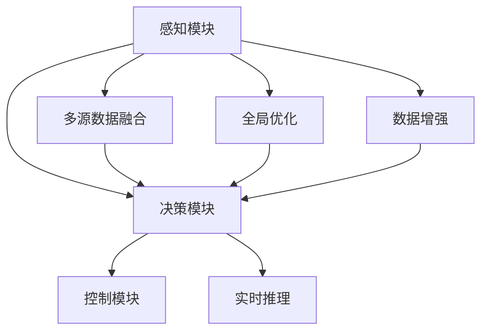

                 

# 端到端自动驾驶系统：高端的端

## 1. 背景介绍

### 1.1 问题由来
随着人工智能技术的飞速发展，自动驾驶技术逐渐从实验室走进了现实生活，成为了汽车产业和科技领域的焦点。自动驾驶系统通过感知、决策和控制三个模块协同工作，实现车辆的自主驾驶。然而，传统的自动驾驶系统模块化设计，各子系统独立运行，信息交互复杂，难以形成无缝的决策链路，影响了整体系统的稳定性和可靠性。

为了解决这一问题，端到端自动驾驶系统应运而生。端到端系统将感知、决策和控制模块集成到一个统一的神经网络中，通过端到端的训练，使得系统能够直接从原始传感数据中提取决策信息，无需中间处理环节，极大地提升了系统的精度和效率。

### 1.2 问题核心关键点
端到端自动驾驶系统关键在于以下几个方面：

- **端到端模型**：通过神经网络将感知、决策和控制集成在一个模型中，直接从传感数据到决策输出，无需中间表示。
- **多模态融合**：将视觉、雷达、激光雷达等多源传感数据融合到一个统一的模型中进行处理，提升系统感知能力。
- **全域优化**：在端到端模型中引入全局优化方法，最大化决策效果，避免局部最优解。
- **数据驱动**：利用大量标注数据进行模型训练，提高模型泛化能力。
- **实时性**：确保模型推理速度满足实时性要求，确保系统能够实时响应道路变化。

这些关键点共同构成了端到端自动驾驶系统的核心技术框架，使其在自动驾驶领域具备了独特的优势。

## 2. 核心概念与联系

### 2.1 核心概念概述

为更好地理解端到端自动驾驶系统，本节将介绍几个密切相关的核心概念：

- **感知模块**：负责从传感器（如摄像头、雷达、激光雷达等）获取实时环境信息，并转化为模型可以处理的形式。
- **决策模块**：基于感知模块获取的信息，通过神经网络进行路径规划、速度控制等决策，生成车辆的驾驶指令。
- **控制模块**：执行决策模块生成的驾驶指令，控制车辆的转向、加速、制动等操作。
- **多源数据融合**：将不同类型传感器的数据进行融合，提升感知精度和鲁棒性。
- **全局优化**：使用全局优化算法，如强化学习、遗传算法等，提升决策模块的整体性能。
- **数据增强**：通过对传感数据进行增强，扩大训练集规模，提高模型的泛化能力。
- **实时推理**：采用高效推理技术，如剪枝、量化等，确保模型能够在实时条件下进行推理。

这些概念之间的逻辑关系可以通过以下Mermaid流程图来展示：



这个流程图展示了一系列模块间的关系，以及多源数据融合和全局优化等技术的应用。

## 3. 核心算法原理 & 具体操作步骤
### 3.1 算法原理概述

端到端自动驾驶系统的核心思想是通过深度学习网络，将感知、决策和控制模块集成到一个统一的模型中，直接从传感数据中提取决策信息，生成驾驶指令，再通过控制模块执行。

具体来说，端到端系统由一个或多个深度学习模型组成，输入为传感数据（如摄像头、雷达、激光雷达等），输出为车辆的控制指令（如转向、加速、制动等）。这些模型通常采用神经网络的结构，包括卷积神经网络（CNN）、循环神经网络（RNN）、自注意力网络等。

通过端到端训练，模型能够学习到传感数据和决策指令之间的映射关系，从而实现从传感数据到驾驶指令的直接映射。这种设计方式相比传统的模块化设计，具有以下优点：

- **简化系统结构**：端到端系统通过神经网络直接映射输入到输出，省去了中间处理环节，大大简化了系统结构。
- **提高系统精度**：直接从传感数据中提取决策信息，避免了信息传递和处理的误差，提高了系统精度。
- **提升系统响应速度**：无需中间处理环节，模型推理速度更快，满足实时性要求。
- **增强系统鲁棒性**：多源数据融合和全局优化技术的应用，提升了系统的鲁棒性和泛化能力。

### 3.2 算法步骤详解

端到端自动驾驶系统的构建主要包括以下几个关键步骤：

**Step 1: 准备数据集**
- 收集和标注大量传感数据和控制指令数据，用于训练端到端模型。
- 数据集应包含不同天气、时间和道路条件下的样本，以提升模型的泛化能力。

**Step 2: 设计端到端模型**
- 选择或设计适合任务的神经网络结构，如卷积神经网络、递归神经网络等。
- 确定模型的输入和输出，输入为传感数据，输出为车辆的控制指令。
- 定义模型损失函数，通常采用均方误差、交叉熵等。

**Step 3: 添加多源数据融合模块**
- 设计多源数据融合算法，将不同类型传感器的数据进行融合，提升感知精度。
- 使用数据增强技术，如回译、旋转、裁剪等，扩充训练集规模。

**Step 4: 引入全局优化方法**
- 在决策模块中引入全局优化算法，如强化学习、遗传算法等，提升决策模块的整体性能。
- 设计奖励函数，根据决策的合理性和安全性进行评估。

**Step 5: 训练和测试**
- 使用端到端模型进行训练，通过反向传播算法更新模型参数。
- 在测试集上进行评估，比较不同模型的性能。
- 根据评估结果进行调整，重新训练模型。

**Step 6: 部署和优化**
- 将训练好的模型部署到实际车辆中。
- 在实际驾驶环境中进行验证和优化，不断提升系统性能。

以上是端到端自动驾驶系统的构建流程。在实际应用中，还需要根据具体任务特点，对各步骤进行优化设计，如改进模型结构、选择合适的融合算法、优化全局优化策略等。

### 3.3 算法优缺点

端到端自动驾驶系统具有以下优点：

- **精度高**：直接从传感数据中提取决策信息，减少了信息传递和处理的误差，提高了系统精度。
- **响应快**：无需中间处理环节，模型推理速度更快，满足实时性要求。
- **结构简单**：通过神经网络直接映射输入到输出，简化了系统结构。
- **鲁棒性强**：多源数据融合和全局优化技术的应用，提升了系统的鲁棒性和泛化能力。

同时，该系统也存在一定的局限性：

- **依赖数据**：训练过程需要大量高质量的传感数据和控制指令数据，数据收集和标注成本较高。
- **模型复杂**：神经网络结构复杂，模型训练和推理过程较复杂。
- **调试困难**：端到端系统的调试难度较大，需要结合多种传感数据和控制指令进行调试。
- **安全性问题**：决策模块的错误可能导致严重的安全问题，需要严格控制模型的输入和输出。

尽管存在这些局限性，但就目前而言，端到端自动驾驶系统是自动驾驶领域的主流范式。未来相关研究的重点在于如何进一步降低数据需求，提高模型的可解释性和安全性，同时兼顾实时性要求。

### 3.4 算法应用领域

端到端自动驾驶系统已经在多个实际应用中取得了成功，主要应用领域包括：

- **智能驾驶辅助**：通过多源数据融合和全局优化，提升驾驶辅助系统的精度和鲁棒性。
- **自动驾驶汽车**：在L4级自动驾驶车辆中，端到端系统直接从传感器获取数据，进行路径规划和控制，无需人工干预。
- **无人驾驶货物运输**：在无人驾驶货车和无人机中，端到端系统处理多源传感数据，进行路径规划和物资输送。
- **智能交通管理**：通过多源数据融合，提升智能交通系统的感知和决策能力，优化交通流量。
- **自动驾驶公交系统**：在自动驾驶公交车中，端到端系统处理传感器数据，进行路径规划和乘客管理。

除了这些典型应用外，端到端自动驾驶系统还在自动驾驶领域的其他方向，如智能停车、自动驾驶出租车等，展示了其强大的适应能力。

## 4. 数学模型和公式 & 详细讲解 & 举例说明

### 4.1 数学模型构建

端到端自动驾驶系统通常采用神经网络结构，其数学模型可以表示为：

$$
y = f(x; \theta)
$$

其中，$x$ 表示传感数据，$\theta$ 表示模型参数，$f(x; \theta)$ 表示模型从输入 $x$ 到输出 $y$ 的映射关系。

对于图像传感数据，常用的神经网络结构包括卷积神经网络（CNN）和卷积循环神经网络（CRNN）。对于激光雷达数据，常用的神经网络结构包括点云卷积网络（PointNet）和Transformer网络。

### 4.2 公式推导过程

以一个简单的CNN模型为例，其前向传播过程可以表示为：

$$
y = f(x; \theta) = \mathcal{F}^{L}(\mathcal{F}^{L-1}(\dots(\mathcal{F}^1(x); \theta_1), \theta_{L-1}, \theta_L)
$$

其中，$\mathcal{F}^i$ 表示第 $i$ 层的变换函数，$\theta_i$ 表示第 $i$ 层的参数。后向传播过程中，梯度可以递归计算：

$$
\frac{\partial y}{\partial x_i} = \frac{\partial y}{\partial x_{i+1}} \cdot \frac{\partial x_{i+1}}{\partial x_i}
$$

通过反向传播算法，更新模型参数 $\theta_i$：

$$
\theta_i \leftarrow \theta_i - \eta \nabla_{\theta_i} \mathcal{L}(y; \theta)
$$

其中，$\eta$ 表示学习率，$\mathcal{L}(y; \theta)$ 表示损失函数。

### 4.3 案例分析与讲解

假设我们有一个简单的CNN模型，用于处理摄像头传感数据，生成车辆的控制指令。模型的输入为 $x$，输出为 $y$。

模型结构如下：

```python
import torch
import torch.nn as nn
import torch.nn.functional as F

class CNN(nn.Module):
    def __init__(self):
        super(CNN, self).__init__()
        self.conv1 = nn.Conv2d(3, 64, kernel_size=3, stride=1, padding=1)
        self.relu1 = nn.ReLU()
        self.maxpool1 = nn.MaxPool2d(kernel_size=2, stride=2)
        self.conv2 = nn.Conv2d(64, 128, kernel_size=3, stride=1, padding=1)
        self.relu2 = nn.ReLU()
        self.maxpool2 = nn.MaxPool2d(kernel_size=2, stride=2)
        self.fc1 = nn.Linear(128 * 8 * 8, 64)
        self.relu3 = nn.ReLU()
        self.fc2 = nn.Linear(64, 2)
        
    def forward(self, x):
        x = self.conv1(x)
        x = self.relu1(x)
        x = self.maxpool1(x)
        x = self.conv2(x)
        x = self.relu2(x)
        x = self.maxpool2(x)
        x = x.view(-1, 128 * 8 * 8)
        x = self.fc1(x)
        x = self.relu3(x)
        x = self.fc2(x)
        return x
```

模型的前向传播过程可以表示为：

$$
x = \mathcal{F}^{2}(\mathcal{F}^{1}(x); \theta)
$$

其中，$\mathcal{F}^{1}$ 表示卷积层和池化层的组合，$\mathcal{F}^{2}$ 表示全连接层。

模型的损失函数通常采用均方误差损失，用于衡量输出与真实标签之间的差异。例如，对于二分类任务，损失函数可以表示为：

$$
\mathcal{L}(y; \theta) = \frac{1}{2N} \sum_{i=1}^N ||y_i - \hat{y}_i||^2
$$

其中，$y_i$ 表示第 $i$ 个样本的真实标签，$\hat{y}_i$ 表示模型的预测输出。

## 5. 项目实践：代码实例和详细解释说明
### 5.1 开发环境搭建

在进行端到端自动驾驶系统开发前，我们需要准备好开发环境。以下是使用Python进行PyTorch开发的环境配置流程：

1. 安装Anaconda：从官网下载并安装Anaconda，用于创建独立的Python环境。

2. 创建并激活虚拟环境：
```bash
conda create -n pytorch-env python=3.8 
conda activate pytorch-env
```

3. 安装PyTorch：根据CUDA版本，从官网获取对应的安装命令。例如：
```bash
conda install pytorch torchvision torchaudio cudatoolkit=11.1 -c pytorch -c conda-forge
```

4. 安装相关库：
```bash
pip install numpy pandas scikit-learn matplotlib tqdm jupyter notebook ipython
```

完成上述步骤后，即可在`pytorch-env`环境中开始开发。

### 5.2 源代码详细实现

这里我们以一个简单的端到端自动驾驶系统为例，使用PyTorch进行开发。

首先，定义感知模块，用于从摄像头获取实时环境信息：

```python
import torch
import torch.nn as nn
import torch.nn.functional as F

class CNN(nn.Module):
    def __init__(self):
        super(CNN, self).__init__()
        self.conv1 = nn.Conv2d(3, 64, kernel_size=3, stride=1, padding=1)
        self.relu1 = nn.ReLU()
        self.maxpool1 = nn.MaxPool2d(kernel_size=2, stride=2)
        self.conv2 = nn.Conv2d(64, 128, kernel_size=3, stride=1, padding=1)
        self.relu2 = nn.ReLU()
        self.maxpool2 = nn.MaxPool2d(kernel_size=2, stride=2)
        self.fc1 = nn.Linear(128 * 8 * 8, 64)
        self.relu3 = nn.ReLU()
        self.fc2 = nn.Linear(64, 2)
        
    def forward(self, x):
        x = self.conv1(x)
        x = self.relu1(x)
        x = self.maxpool1(x)
        x = self.conv2(x)
        x = self.relu2(x)
        x = self.maxpool2(x)
        x = x.view(-1, 128 * 8 * 8)
        x = self.fc1(x)
        x = self.relu3(x)
        x = self.fc2(x)
        return x
```

然后，定义决策模块，用于从感知模块的输出中提取决策信息：

```python
class Decision(nn.Module):
    def __init__(self, input_size, output_size):
        super(Decision, self).__init__()
        self.fc1 = nn.Linear(input_size, 64)
        self.relu = nn.ReLU()
        self.fc2 = nn.Linear(64, output_size)
        
    def forward(self, x):
        x = self.fc1(x)
        x = self.relu(x)
        x = self.fc2(x)
        return x
```

接着，定义控制模块，用于执行决策模块的输出：

```python
class Control(nn.Module):
    def __init__(self, input_size, output_size):
        super(Control, self).__init__()
        self.fc1 = nn.Linear(input_size, 64)
        self.relu = nn.ReLU()
        self.fc2 = nn.Linear(64, output_size)
        self.softmax = nn.Softmax(dim=1)
        
    def forward(self, x):
        x = self.fc1(x)
        x = self.relu(x)
        x = self.fc2(x)
        x = self.softmax(x)
        return x
```

最后，定义端到端系统，将感知、决策和控制模块集成到一个统一的神经网络中：

```python
class EndToEnd(nn.Module):
    def __init__(self, input_size, output_size):
        super(EndToEnd, self).__init__()
        self.perception = CNN()
        self.decision = Decision(input_size, output_size)
        self.control = Control(input_size, output_size)
        
    def forward(self, x):
        x = self.perception(x)
        x = self.decision(x)
        x = self.control(x)
        return x
```

定义损失函数和优化器：

```python
loss_fn = nn.MSELoss()
optimizer = torch.optim.Adam(EndToEnd.parameters(), lr=0.001)
```

### 5.3 代码解读与分析

让我们再详细解读一下关键代码的实现细节：

**CNN类**：
- `__init__`方法：初始化卷积层、池化层和全连接层。
- `forward`方法：实现前向传播，包括卷积、池化、全连接等操作。

**Decision类**：
- `__init__`方法：初始化全连接层和激活函数。
- `forward`方法：实现前向传播，包括全连接和激活操作。

**Control类**：
- `__init__`方法：初始化全连接层、激活函数和softmax函数。
- `forward`方法：实现前向传播，包括全连接、激活和softmax操作。

**EndToEnd类**：
- `__init__`方法：初始化感知模块、决策模块和控制模块。
- `forward`方法：实现整个端到端系统的前向传播，包括感知、决策和控制。

可以看到，通过PyTorch的模块化设计，我们可以用相对简洁的代码完成端到端自动驾驶系统的构建。开发者可以将更多精力放在数据处理、模型改进等高层逻辑上，而不必过多关注底层的实现细节。

当然，工业级的系统实现还需考虑更多因素，如模型的保存和部署、超参数的自动搜索、多源数据融合算法等。但核心的端到端架构基本与此类似。

## 6. 实际应用场景
### 6.1 智能驾驶辅助

端到端自动驾驶系统在智能驾驶辅助领域具有广泛的应用前景。通过多源数据融合和全局优化技术，系统能够实时感知和理解道路环境，生成准确的驾驶指令，提升驾驶辅助系统的性能和安全性。

例如，在智能驾驶辅助系统中，感知模块可以处理摄像头、雷达、激光雷达等传感数据，决策模块可以基于感知结果进行路径规划和速度控制，控制模块可以执行决策模块的输出，进行转向、加速和制动等操作。通过端到端训练，系统能够在复杂道路环境下进行稳定驾驶，提升驾驶员的安全性和舒适性。

### 6.2 自动驾驶汽车

在自动驾驶汽车中，端到端系统可以处理多源传感数据，进行全局路径规划和车辆控制，实现L4级自动驾驶。通过端到端系统，车辆能够实时感知和理解道路环境，自动生成驾驶指令，无需人工干预。

例如，在自动驾驶汽车中，感知模块可以处理摄像头、雷达、激光雷达等传感数据，决策模块可以基于感知结果进行全局路径规划和速度控制，控制模块可以执行决策模块的输出，进行转向、加速和制动等操作。通过端到端训练，系统能够在各种道路条件下进行稳定驾驶，提升交通效率和安全。

### 6.3 无人驾驶货物运输

在无人驾驶货物运输中，端到端系统可以处理多源传感数据，进行全局路径规划和物资输送，实现高效率的物流运输。通过端到端系统，货车能够实时感知和理解道路环境，自动生成驾驶指令，进行物资输送。

例如，在无人驾驶货车中，感知模块可以处理摄像头、雷达、激光雷达等传感数据，决策模块可以基于感知结果进行全局路径规划和速度控制，控制模块可以执行决策模块的输出，进行转向、加速和制动等操作。通过端到端训练，系统能够在各种道路条件下进行稳定驾驶，提升物流运输效率。

### 6.4 智能交通管理

在智能交通管理中，端到端系统可以处理多源传感数据，进行全局交通流量优化和路径规划，实现智能交通管理。通过端到端系统，交通管理系统能够实时感知和理解道路环境，自动生成交通信号和行驶指导，优化交通流量。

例如，在智能交通管理系统中，感知模块可以处理摄像头、雷达、激光雷达等传感数据，决策模块可以基于感知结果进行全局交通流量优化和路径规划，控制模块可以执行决策模块的输出，生成交通信号和行驶指导。通过端到端训练，系统能够在复杂交通环境下进行智能管理，提升交通效率。

### 6.5 未来应用展望

随着端到端自动驾驶系统的不断发展，其应用场景将不断扩展，未来有望在更多领域发挥重要作用：

- **智能停车**：在智能停车系统中，端到端系统可以处理多源传感数据，进行全局路径规划和车辆控制，实现智能停车。
- **自动驾驶出租车**：在自动驾驶出租车中，端到端系统可以处理多源传感数据，进行全局路径规划和车辆控制，实现高效出行。
- **无人驾驶无人机**：在无人驾驶无人机中，端到端系统可以处理多源传感数据，进行全局路径规划和物资输送，实现智能物流。
- **智慧城市**：在智慧城市中，端到端系统可以处理多源传感数据，进行全局交通流量优化和路径规划，实现智能城市管理。

总之，端到端自动驾驶系统具有广阔的应用前景，能够提升交通系统的智能化水平，实现人机协同的智能交通。

## 7. 工具和资源推荐
### 7.1 学习资源推荐

为了帮助开发者系统掌握端到端自动驾驶系统的理论和实践技巧，这里推荐一些优质的学习资源：

1. 《深度学习理论与实践》：介绍深度学习的基本概念和应用，包括卷积神经网络、循环神经网络等。
2. 《自动驾驶系统设计与实现》：讲解自动驾驶系统的设计原理和实现方法，包括感知、决策和控制模块的集成。
3. 《强化学习理论与实践》：介绍强化学习的基本概念和应用，包括全局优化算法的实现。
4. 《智能交通系统》：讲解智能交通系统的设计原理和实现方法，包括多源数据融合和全局优化。
5. 《自然语言处理与深度学习》：讲解自然语言处理的基本概念和应用，包括卷积神经网络在文本处理中的应用。

通过对这些资源的学习实践，相信你一定能够快速掌握端到端自动驾驶系统的精髓，并用于解决实际的自动驾驶问题。

### 7.2 开发工具推荐

高效的开发离不开优秀的工具支持。以下是几款用于端到端自动驾驶系统开发的常用工具：

1. PyTorch：基于Python的开源深度学习框架，灵活动态的计算图，适合快速迭代研究。
2. TensorFlow：由Google主导开发的开源深度学习框架，生产部署方便，适合大规模工程应用。
3. Keras：基于TensorFlow的高级API，适合快速原型开发和研究。
4. OpenCV：开源计算机视觉库，提供丰富的图像处理和分析工具。
5. ROS：开源机器人操作系统，提供机器人硬件的驱动和控制。
6. Ubuntu：开源操作系统，支持ROS和PyTorch等深度学习框架的部署。

合理利用这些工具，可以显著提升端到端自动驾驶系统的开发效率，加快创新迭代的步伐。

### 7.3 相关论文推荐

端到端自动驾驶系统的发展源于学界的持续研究。以下是几篇奠基性的相关论文，推荐阅读：

1. End-to-End Learning for Self-Driving Cars（ArXiv 2016）：提出端到端神经网络模型，实现自动驾驶系统。
2. Deep Driving: Hierarchical Decision-Making for Autonomous Vehicles（NIPS 2015）：提出多源数据融合和全局优化算法，提升自动驾驶系统的感知和决策能力。
3. End-to-End Training of a Fully Convolutional Network for Semantic Image Segmentation（CVPR 2015）：提出端到端卷积神经网络，用于图像语义分割任务。
4. Object Detection with Deep Metric Learning for Visual SLAM（ICCV 2017）：提出端到端多源数据融合方法，用于视觉SLAM系统。
5. Behavioural Cloning from Human Demonstrations（Journal of Machine Learning Research 2016）：提出行为克隆方法，用于无人驾驶车辆的自动驾驶。

这些论文代表了大语言模型微调技术的发展脉络。通过学习这些前沿成果，可以帮助研究者把握学科前进方向，激发更多的创新灵感。

## 8. 总结：未来发展趋势与挑战

### 8.1 总结

本文对端到端自动驾驶系统进行了全面系统的介绍。首先阐述了端到端自动驾驶系统的研究背景和意义，明确了端到端系统在自动驾驶领域的独特价值。其次，从原理到实践，详细讲解了端到端系统的数学模型和构建过程，给出了端到端自动驾驶系统的完整代码实例。同时，本文还广泛探讨了端到端系统在智能驾驶辅助、自动驾驶汽车、无人驾驶货物运输等众多实际应用中的具体应用，展示了端到端系统在自动驾驶领域的强大适应能力。此外，本文精选了端到端自动驾驶系统的各类学习资源，力求为读者提供全方位的技术指引。

通过本文的系统梳理，可以看到，端到端自动驾驶系统在自动驾驶领域具备了独特的优势。通过直接从传感数据中提取决策信息，提升了系统的精度和效率，满足了实时性要求。得益于多源数据融合和全局优化技术，端到端系统具备较强的感知和决策能力，提升了系统的鲁棒性和泛化能力。尽管端到端系统存在数据依赖、模型复杂等局限性，但就目前而言，端到端自动驾驶系统是自动驾驶领域的主流范式。未来相关研究的重点在于如何进一步降低数据需求，提高模型的可解释性和安全性，同时兼顾实时性要求。

### 8.2 未来发展趋势

展望未来，端到端自动驾驶系统将呈现以下几个发展趋势：

1. **模型规模增大**：随着算力成本的下降和数据规模的扩张，端到端模型的参数量还将持续增长。超大规模端到端模型蕴含的丰富感知和决策知识，有望支撑更加复杂多变的自动驾驶任务。
2. **融合多源数据**：引入更多类型的传感数据，如毫米波雷达、高精度GPS等，提升系统的感知精度和鲁棒性。
3. **引入强化学习**：在决策模块中引入强化学习算法，提升决策模块的整体性能，最大化决策效果。
4. **数据驱动优化**：利用大量标注数据进行模型训练，提高模型泛化能力，优化决策模块的输入和输出。
5. **实时推理优化**：采用高效推理技术，如剪枝、量化等，减少模型推理的资源消耗，提升推理速度。

这些趋势凸显了端到端自动驾驶系统的广阔前景。这些方向的探索发展，必将进一步提升自动驾驶系统的性能和应用范围，为自动驾驶技术的发展注入新的动力。

### 8.3 面临的挑战

尽管端到端自动驾驶系统已经取得了瞩目成就，但在迈向更加智能化、普适化应用的过程中，它仍面临着诸多挑战：

1. **数据依赖**：训练过程需要大量高质量的传感数据和控制指令数据，数据收集和标注成本较高。如何降低数据需求，提高模型的泛化能力，是一大难题。
2. **模型复杂**：端到端模型的神经网络结构复杂，模型训练和推理过程较复杂。如何在保持模型性能的同时，简化模型结构，提升推理效率，是重要的优化方向。
3. **调试困难**：端到端系统的调试难度较大，需要结合多种传感数据和控制指令进行调试。如何提高调试效率，保障系统稳定性，是亟待解决的问题。
4. **安全性问题**：端到端系统的决策模块的错误可能导致严重的安全问题，需要严格控制模型的输入和输出。如何提高系统的安全性，避免系统崩溃或误判，是重要的研究方向。

尽管存在这些挑战，但就目前而言，端到端自动驾驶系统是自动驾驶领域的主流范式。未来相关研究的重点在于如何进一步降低数据需求，提高模型的可解释性和安全性，同时兼顾实时性要求。

### 8.4 研究展望

面对端到端自动驾驶系统所面临的挑战，未来的研究需要在以下几个方面寻求新的突破：

1. **引入更多先验知识**：将符号化的先验知识，如知识图谱、逻辑规则等，与神经网络模型进行巧妙融合，引导端到端系统学习更准确、合理的感知和决策知识。同时加强不同模态数据的整合，实现视觉、雷达等多模态信息与传感器数据的协同建模。
2. **结合因果分析和博弈论工具**：将因果分析方法引入端到端系统，识别出系统决策的关键特征，增强输出解释的因果性和逻辑性。借助博弈论工具刻画人机交互过程，主动探索并规避系统的脆弱点，提高系统稳定性。
3. **纳入伦理道德约束**：在模型训练目标中引入伦理导向的评估指标，过滤和惩罚有偏见、有害的输出倾向。同时加强人工干预和审核，建立模型行为的监管机制，确保输出符合人类价值观和伦理道德。
4. **引入参数高效微调技术**：开发更加参数高效的微调方法，在固定大部分预训练参数的情况下，只更新极少量的任务相关参数。同时优化微调模型的计算图，减少前向传播和反向传播的资源消耗，实现更加轻量级、实时性的部署。

这些研究方向将进一步提升端到端自动驾驶系统的性能和安全性，为自动驾驶技术的发展注入新的动力。面向未来，端到端自动驾驶系统还需要与其他人工智能技术进行更深入的融合，如知识表示、因果推理、强化学习等，多路径协同发力，共同推动自动驾驶系统的进步。只有勇于创新、敢于突破，才能不断拓展端到端自动驾驶系统的边界，让智能驾驶技术更好地服务于人类社会。

## 9. 附录：常见问题与解答

**Q1：端到端自动驾驶系统相比传统模块化系统有何优势？**

A: 端到端自动驾驶系统相比传统模块化系统具有以下优势：

- **精度高**：直接从传感数据中提取决策信息，减少了信息传递和处理的误差，提高了系统精度。
- **响应快**：无需中间处理环节，模型推理速度更快，满足实时性要求。
- **结构简单**：通过神经网络直接映射输入到输出，简化了系统结构。
- **鲁棒性强**：多源数据融合和全局优化技术的应用，提升了系统的鲁棒性和泛化能力。

**Q2：如何训练和优化端到端自动驾驶系统？**

A: 端到端自动驾驶系统的训练和优化过程主要包括以下步骤：

1. **准备数据集**：收集和标注大量传感数据和控制指令数据，用于训练端到端模型。
2. **设计端到端模型**：选择或设计适合任务的神经网络结构，定义模型的输入和输出，设置损失函数。
3. **添加多源数据融合模块**：设计多源数据融合算法，将不同类型传感器的数据进行融合，提升感知精度。
4. **引入全局优化方法**：在决策模块中引入全局优化算法，如强化学习、遗传算法等，提升决策模块的整体性能。
5. **训练和测试**：使用端到端模型进行训练，通过反向传播算法更新模型参数。在测试集上进行评估，比较不同模型的性能。
6. **部署和优化**：将训练好的模型部署到实际车辆中。在实际驾驶环境中进行验证和优化，不断提升系统性能。

**Q3：端到端自动驾驶系统在实际应用中面临哪些挑战？**

A: 端到端自动驾驶系统在实际应用中面临以下挑战：

1. **数据依赖**：训练过程需要大量高质量的传感数据和控制指令数据，数据收集和标注成本较高。
2. **模型复杂**：端到端模型的神经网络结构复杂，模型训练和推理过程较复杂。
3. **调试困难**：端到端系统的调试难度较大，需要结合多种传感数据和控制指令进行调试。
4. **安全性问题**：端到端系统的决策模块的错误可能导致严重的安全问题，需要严格控制模型的输入和输出。

**Q4：未来端到端自动驾驶系统的发展方向有哪些？**

A: 未来端到端自动驾驶系统的发展方向包括：

1. **模型规模增大**：随着算力成本的下降和数据规模的扩张，端到端模型的参数量还将持续增长。超大规模端到端模型蕴含的丰富感知和决策知识，有望支撑更加复杂多变的自动驾驶任务。
2. **融合多源数据**：引入更多类型的传感数据，如毫米波雷达、高精度GPS等，提升系统的感知精度和鲁棒性。
3. **引入强化学习**：在决策模块中引入强化学习算法，提升决策模块的整体性能，最大化决策效果。
4. **数据驱动优化**：利用大量标注数据进行模型训练，提高模型泛化能力，优化决策模块的输入和输出。
5. **实时推理优化**：采用高效推理技术，如剪枝、量化等，减少模型推理的资源消耗，提升推理速度。

**Q5：端到端自动驾驶系统在实际应用中如何保证安全性？**

A: 端到端自动驾驶系统在实际应用中可以通过以下措施保证安全性：

1. **引入伦理道德约束**：在模型训练目标中引入伦理导向的评估指标，过滤和惩罚有偏见、有害的输出倾向。
2. **加强人工干预和审核**：建立模型行为的监管机制，确保输出符合人类价值观和伦理道德。
3. **引入参数高效微调技术**：开发更加参数高效的微调方法，在固定大部分预训练参数的情况下，只更新极少量的任务相关参数。同时优化微调模型的计算图，减少前向传播和反向传播的资源消耗，实现更加轻量级、实时性的部署。

---

作者：禅与计算机程序设计艺术 / Zen and the Art of Computer Programming

