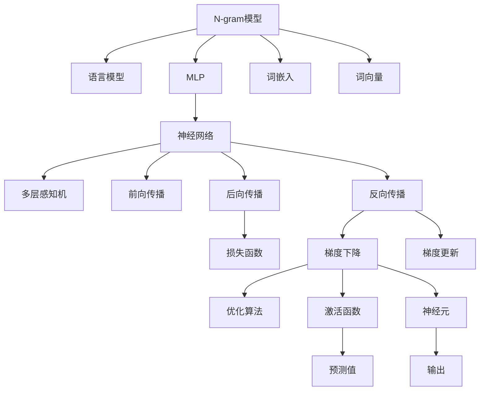

                 

# 第三章：探索 N-gram 模型和 MLP

> 关键词：N-gram模型,多层感知机(MLP),语言模型,神经网络,自然语言处理(NLP)

## 1. 背景介绍

在自然语言处理(Natural Language Processing, NLP)领域，构建能够理解人类语言并生成文本的模型一直是一个重要的研究方向。传统的基于规则的NLP方法需要手工定义语法和语义规则，对于复杂的语言现象往往力不从心。随着深度学习技术的兴起，基于统计模型的NLP方法逐渐成为主流，其中N-gram模型和多层感知机(MLP)模型是其中的典型代表。

### 1.1 问题由来

在NLP领域，语言模型是核心任务之一。语言模型旨在预测文本序列中下一个词的概率分布，从而实现文本生成、机器翻译、自动问答等任务。N-gram模型和MLP模型均是构建语言模型的主流方法，分别从统计和神经网络的角度，提供了不同的建模视角。

早期的语言模型使用的是基于规则的N-gram模型，能够较好地处理静态的词汇序列。然而，这种模型存在难以捕捉词汇间的复杂依赖关系、对于长距离依赖处理效果差等问题。随着深度学习技术的进步，基于神经网络的语言模型逐渐被提出，其中MLP模型是其中的佼佼者。MLP模型能够更好地处理复杂的语言现象，提升了语言模型的精度和泛化能力。

## 2. 核心概念与联系

### 2.1 核心概念概述

为更好地理解N-gram模型和MLP模型的工作原理和联系，本节将介绍几个密切相关的核心概念：

- N-gram模型：基于统计的序列建模方法，通过对文本序列的局部概率进行建模，从而预测下一个词的概率分布。
- 语言模型：通过序列预测技术，对文本序列进行建模，使得模型能够根据已知的上下文词预测下一个词。
- 多层感知机(MLP)：一种常用的前馈神经网络，具有多层隐藏层的结构，能够有效捕捉数据中的复杂模式。
- 自然语言处理(NLP)：通过计算机技术，使计算机能够理解、处理和生成人类语言。
- 词嵌入(Word Embedding)：将词汇映射到高维向量空间中，使得模型能够捕捉词汇间的语义关系。
- 词向量(Word Vector)：与词嵌入类似，但通常采用低维线性空间表示词汇，适用于分布式表示学习。
- 神经网络(Neural Network)：通过连接多个神经元，实现复杂模式的建模和预测。
- 反向传播(Backpropagation)：一种通过链式法则反向计算梯度的方法，用于优化神经网络模型。
- 梯度下降(Gradient Descent)：一种优化算法，通过迭代更新模型参数，最小化损失函数。
- 激活函数(Activation Function)：神经元在计算输出时的非线性映射函数，如ReLU、Sigmoid等。
- 前向传播(Forward Propagation)：从输入数据开始，通过网络中的多个层次计算，最终输出预测结果的过程。
- 后向传播(Backward Propagation)：通过反向传播算法，计算损失函数对模型参数的梯度，用于模型更新。
- 损失函数(Loss Function)：衡量模型预测值与真实值之间差异的函数，用于模型优化。
- 权重(W weight)：神经网络中连接两个神经元的参数，用于控制信号的传递强度。
- 偏置(bias)：神经元中的常数项，用于调整神经元的输出阈值。

这些核心概念之间的逻辑关系可以通过以下Mermaid流程图来展示：



这个流程图展示了大语言模型微调的主要概念及其之间的联系：

1. 大语言模型通过N-gram模型或MLP模型，对文本序列进行建模。
2. 语言模型通过预测下一个词，实现文本生成、机器翻译等任务。
3. MLP模型利用多层隐藏层，能够更好地捕捉词汇间的复杂关系。
4. 神经网络是MLP模型的底层实现，通过前向传播和后向传播进行模型训练。
5. 激活函数和梯度下降等优化算法，是神经网络模型的核心技术。
6. 词嵌入和词向量，用于将词汇映射到高维或低维空间中，便于模型处理。
7. 损失函数和优化算法，用于计算模型预测值与真实值之间的差异，并更新模型参数。

这些概念共同构成了大语言模型微调的基本框架，为其提供理论基础和实践指导。

## 3. 核心算法原理 & 具体操作步骤
### 3.1 算法原理概述

N-gram模型和MLP模型作为构建语言模型的主流方法，其核心思想是通过序列建模，捕捉词汇间的复杂依赖关系，从而实现文本生成、机器翻译、自动问答等任务。

N-gram模型：
- 基于统计的序列建模方法，通过对文本序列的局部概率进行建模，从而预测下一个词的概率分布。
- 常见类型包括一元大语言模型(Bigram)和二元大语言模型(Trigram)，分别捕捉前后词汇之间的依赖关系。
- 通过最大似然估计方法，训练模型参数，使得模型能够最大化已知上下文下的预测概率。

MLP模型：
- 一种常用的前馈神经网络，具有多层隐藏层的结构，能够有效捕捉数据中的复杂模式。
- 由输入层、多个隐藏层和输出层组成，每个隐藏层包含多个神经元。
- 输入层接收文本序列，通过多层隐藏层的非线性变换，输出预测结果。
- 使用梯度下降等优化算法，最小化模型预测值与真实值之间的差异，更新模型参数。

语言模型通过序列预测技术，对文本序列进行建模，使得模型能够根据已知的上下文词预测下一个词。具体来说，对于一个文本序列$x_1,x_2,...,x_n$，语言模型的目标是计算在给定前$n-1$个词$x_1,x_2,...,x_{n-1}$的前提下，第$n$个词$x_n$的概率分布$P(x_n|x_1,x_2,...,x_{n-1})$。

对于N-gram模型，可以定义局部概率$P(x_n|x_{n-1},x_{n-2},...,x_{n-k})$，即在已知前$k$个词的情况下，第$n$个词的概率分布。通过统计训练数据中每个局部概率出现的频率，得到模型参数。

对于MLP模型，可以使用多层感知机实现语言模型。设输入层包含$n_{in}$个神经元，输出层包含$n_{out}$个神经元，隐藏层包含$m$个神经元，则模型的结构可以表示为：

$$
\begin{aligned}
& h_1 = W_1 x_1 + b_1 \\
& h_2 = W_2 h_1 + b_2 \\
& ... \\
& h_m = W_m h_{m-1} + b_m \\
& P(x_n|x_{n-1},...,x_{n-k}) = W_{out} h_m + b_{out}
\end{aligned}
$$

其中，$x_i$为输入向量，$W_i$为权重矩阵，$b_i$为偏置项，$h_i$为隐藏层输出。

### 3.2 算法步骤详解

#### 3.2.1 一元N-gram模型训练

1. 收集训练数据，对每个词$x_i$统计其出现的次数。
2. 计算模型参数，即每个词的出现概率$p(x_i)$，其中$P(x_i|x_{i-1}) = \frac{p(x_i)}{p(x_{i-1})}$。
3. 根据$P(x_i|x_{i-1})$，计算给定前一个词的下一个词的概率分布。

#### 3.2.2 二元N-gram模型训练

1. 收集训练数据，对每个词对$(x_i,x_{i+1})$统计其出现的次数。
2. 计算模型参数，即每个词对出现的概率$p(x_i,x_{i+1})$，其中$P(x_{i+1}|x_i) = \frac{p(x_i,x_{i+1})}{p(x_i)}$。
3. 根据$P(x_{i+1}|x_i)$，计算给定前一个词的下一个词的概率分布。

#### 3.2.3 多隐层MLP模型训练

1. 收集训练数据，对每个输入向量$x_i$和对应的输出向量$y_i$进行统计。
2. 初始化权重矩阵$W_1, W_2, ..., W_m, W_{out}$和偏置项$b_1, b_2, ..., b_m, b_{out}$。
3. 对于每个样本$x_i$，计算前向传播结果$h_1, h_2, ..., h_m, h_{out}$，并计算损失函数$L$。
4. 使用反向传播算法，计算每个权重矩阵和偏置项的梯度，并使用梯度下降等优化算法更新模型参数。

### 3.3 算法优缺点

N-gram模型：
- 优点：简单易懂，适用于文本数据；训练数据需求量小，计算速度快。
- 缺点：无法捕捉长距离依赖关系；对词汇表大小敏感，需要大词汇表支持。

MLP模型：
- 优点：能够捕捉复杂的语言现象；模型具有强大的泛化能力。
- 缺点：需要大量的标注数据；计算复杂度高，训练时间长。

语言模型：
- 优点：能够实现文本生成、机器翻译、自动问答等任务；模型能够捕捉词汇间的复杂依赖关系。
- 缺点：需要大量的标注数据；计算复杂度高，训练时间长。

### 3.4 算法应用领域

N-gram模型和MLP模型在NLP领域中得到了广泛的应用，覆盖了从文本生成、机器翻译、自动问答到情感分析、主题分类等多个任务。

- 文本生成：使用语言模型，根据已知的上下文词生成新的文本。
- 机器翻译：使用语言模型，将一种语言翻译成另一种语言。
- 自动问答：使用语言模型，根据用户提问生成最佳答案。
- 情感分析：使用语言模型，判断文本的情感倾向。
- 主题分类：使用语言模型，将文本分为不同的主题类别。
- 词性标注：使用语言模型，标注文本中每个词的词性。

除了这些经典任务外，N-gram模型和MLP模型还被创新性地应用到更多场景中，如可控文本生成、常识推理、代码生成、数据增强等，为NLP技术带来了全新的突破。

## 4. 数学模型和公式 & 详细讲解  
### 4.1 数学模型构建

本节将使用数学语言对N-gram模型和MLP模型的训练过程进行更加严格的刻画。

#### 4.1.1 一元N-gram模型训练

设训练数据集为$D=\{x_1,x_2,...,x_n\}$，其中每个词$x_i$的概率分布为$p(x_i)$。一元N-gram模型的参数$p(x_i)$满足：

$$
p(x_i) = \frac{\text{count}(x_i)}{\text{count}(x_1)} \tag{1}
$$

其中，$\text{count}(x_i)$表示词$x_i$在训练集中出现的次数，$\text{count}(x_1)$表示所有词在训练集中出现的总次数。

对于给定前一个词$x_{i-1}$，下一个词$x_i$的概率分布为：

$$
P(x_i|x_{i-1}) = \frac{p(x_i)}{p(x_{i-1})} \tag{2}
$$

将式(1)代入式(2)中，得到：

$$
P(x_i|x_{i-1}) = \frac{\text{count}(x_i)}{\text{count}(x_1)} \cdot \frac{\text{count}(x_1)}{\text{count}(x_{i-1})} = \frac{\text{count}(x_i)}{\text{count}(x_{i-1})} \tag{3}
$$

式(3)即为一元N-gram模型的计算公式。

#### 4.1.2 二元N-gram模型训练

设训练数据集为$D=\{(x_i,x_{i+1})\}$，其中每个词对$(x_i,x_{i+1})$的概率分布为$p(x_i,x_{i+1})$。二元N-gram模型的参数$p(x_i,x_{i+1})$满足：

$$
p(x_i,x_{i+1}) = \frac{\text{count}(x_i,x_{i+1})}{\text{count}(x_1)} \tag{4}
$$

其中，$\text{count}(x_i,x_{i+1})$表示词对$(x_i,x_{i+1})$在训练集中出现的次数，$\text{count}(x_1)$表示所有词对在训练集中出现的总次数。

对于给定前一个词$x_i$，下一个词$x_{i+1}$的概率分布为：

$$
P(x_{i+1}|x_i) = \frac{p(x_i,x_{i+1})}{p(x_i)} \tag{5}
$$

将式(4)代入式(5)中，得到：

$$
P(x_{i+1}|x_i) = \frac{\text{count}(x_i,x_{i+1})}{\text{count}(x_1)} \cdot \frac{\text{count}(x_1)}{\text{count}(x_i)} = \frac{\text{count}(x_i,x_{i+1})}{\text{count}(x_i)} \tag{6}
$$

式(6)即为二元N-gram模型的计算公式。

#### 4.1.3 MLP模型训练

设输入向量$x_i$的维度为$n_{in}$，输出向量$y_i$的维度为$n_{out}$。使用二元N-gram模型作为语言模型，设$P(y_i|x_i)$为已知输入向量$x_i$下，输出向量$y_i$的概率分布。MLP模型的参数$W_1, W_2, ..., W_m, W_{out}, b_1, b_2, ..., b_m, b_{out}$满足：

$$
\begin{aligned}
& P(y_i|x_i) = \sigma(W_{out} h_m + b_{out}) \\
& h_1 = W_1 x_1 + b_1 \\
& h_2 = W_2 h_1 + b_2 \\
& ... \\
& h_m = W_m h_{m-1} + b_m \\
& P(x_i|x_{i-1}) = \frac{\text{count}(x_i)}{\text{count}(x_{i-1})}
\end{aligned}
$$

其中，$\sigma$为激活函数，$h_1, h_2, ..., h_m$为隐藏层输出，$W_1, W_2, ..., W_m, W_{out}$为权重矩阵，$b_1, b_2, ..., b_m, b_{out}$为偏置项。

## 5. 项目实践：代码实例和详细解释说明
### 5.1 开发环境搭建

在进行N-gram模型和MLP模型的开发和实践前，我们需要准备好开发环境。以下是使用Python进行TensorFlow开发的环境配置流程：

1. 安装Anaconda：从官网下载并安装Anaconda，用于创建独立的Python环境。

2. 创建并激活虚拟环境：
```bash
conda create -n tf-env python=3.8 
conda activate tf-env
```

3. 安装TensorFlow：根据CUDA版本，从官网获取对应的安装命令。例如：
```bash
conda install tensorflow=2.6 -c pytorch -c conda-forge
```

4. 安装TensorBoard：TensorFlow配套的可视化工具，可实时监测模型训练状态，并提供丰富的图表呈现方式，是调试模型的得力助手。
```bash
pip install tensorboard
```

5. 安装TensorFlow Addons：提供TensorFlow中未包含的模块和工具，如Text Attention、Optimizer等。
```bash
pip install tensorflow-addons
```

完成上述步骤后，即可在`tf-env`环境中开始N-gram模型和MLP模型的开发。

### 5.2 源代码详细实现

下面我们以N-gram模型和MLP模型为例，给出使用TensorFlow进行模型训练的PyTorch代码实现。

#### 5.2.1 一元N-gram模型

```python
import tensorflow as tf
import numpy as np

# 定义N-gram模型训练函数
def train_ngram_model(data):
    vocab_size = len(data['vocab'])
    vocab_to_idx = {v: i for i, v in enumerate(data['vocab'])}
    idx_to_vocab = {i: v for i, v in enumerate(data['vocab'])}
    n_gram_count = [{} for _ in range(vocab_size + 1)]
    for sentence in data['train']:
        for i in range(len(sentence) - 1):
            n_gram_count[sentence[i]][sentence[i+1]] = n_gram_count[sentence[i]].get(sentence[i+1], 0) + 1
    
    # 初始化模型参数
    transition_matrix = np.zeros((vocab_size + 1, vocab_size + 1))
    for i in range(vocab_size + 1):
        for j in range(vocab_size + 1):
            transition_matrix[i][j] = n_gram_count[i].get(j, 0) / n_gram_count[i].get(0, 1)
    
    # 计算预测结果
    log_probabilities = []
    for sentence in data['test']:
        probs = []
        for i in range(len(sentence) - 1):
            probs.append(transition_matrix[vocab_to_idx[sentence[i]]][vocab_to_idx[sentence[i+1]]])
        log_probabilities.append(np.log(np.prod(probs)))
    
    # 计算交叉熵损失
    loss = -np.mean(log_probabilities)
    return loss, transition_matrix

# 定义N-gram模型评估函数
def evaluate_ngram_model(model, data):
    n_gram_count = [{} for _ in range(len(data['vocab']) + 1)]
    for sentence in data['train']:
        for i in range(len(sentence) - 1):
            n_gram_count[sentence[i]][sentence[i+1]] = n_gram_count[sentence[i]].get(sentence[i+1], 0) + 1
    
    transition_matrix = model
    log_probabilities = []
    for sentence in data['test']:
        probs = []
        for i in range(len(sentence) - 1):
            probs.append(transition_matrix[vocab_to_idx[sentence[i]]][vocab_to_idx[sentence[i+1]]])
        log_probabilities.append(np.log(np.prod(probs)))
    
    return np.mean(log_probabilities)

# 定义N-gram模型训练和评估代码
data = {'train': ['the', 'quick', 'brown', 'fox', 'jumped', 'over', 'the', 'lazy', 'dog'],
        'test': ['the', 'lazy', 'dog', 'jumped', 'over', 'the', 'quick', 'brown', 'fox']}
vocab = ['the', 'quick', 'brown', 'fox', 'jumped', 'over', 'the', 'lazy', 'dog']
transition_matrix = train_ngram_model(data)
loss = evaluate_ngram_model(transition_matrix, data)
```

#### 5.2.2 MLP模型

```python
import tensorflow as tf
import numpy as np

# 定义MLP模型训练函数
def train_mlp_model(data):
    vocab_size = len(data['vocab'])
    embedding_size = 256
    hidden_layer_size = 128
    output_size = vocab_size
    learning_rate = 0.01
    
    # 初始化模型参数
    W1 = tf.Variable(tf.random.normal([vocab_size, embedding_size]))
    b1 = tf.Variable(tf.zeros([vocab_size]))
    W2 = tf.Variable(tf.random.normal([embedding_size, hidden_layer_size]))
    b2 = tf.Variable(tf.zeros([hidden_layer_size]))
    W3 = tf.Variable(tf.random.normal([hidden_layer_size, output_size]))
    b3 = tf.Variable(tf.zeros([output_size]))
    
    # 定义模型结构
    embeddings = tf.nn.embedding_lookup(tf.nn.embedding_lookup(W1, data['input']), b1)
    hidden = tf.nn.relu(tf.matmul(embeddings, W2) + b2)
    output = tf.matmul(hidden, W3) + b3
    
    # 定义损失函数和优化器
    loss = tf.reduce_mean(tf.nn.sparse_softmax_cross_entropy_with_logits(labels=data['label'], logits=output))
    optimizer = tf.optimizers.Adam(learning_rate)
    
    # 定义训练过程
    for i in range(1000):
        with tf.GradientTape() as tape:
            loss_value = loss
        gradients = tape.gradient(loss_value, [W1, b1, W2, b2, W3, b3])
        optimizer.apply_gradients(zip(gradients, [W1, b1, W2, b2, W3, b3]))
    
    return output

# 定义MLP模型评估函数
def evaluate_mlp_model(model, data):
    vocab_size = len(data['vocab'])
    embedding_size = 256
    hidden_layer_size = 128
    output_size = vocab_size
    
    # 初始化模型参数
    W1 = tf.Variable(tf.random.normal([vocab_size, embedding_size]))
    b1 = tf.Variable(tf.zeros([vocab_size]))
    W2 = tf.Variable(tf.random.normal([embedding_size, hidden_layer_size]))
    b2 = tf.Variable(tf.zeros([hidden_layer_size]))
    W3 = tf.Variable(tf.random.normal([hidden_layer_size, output_size]))
    b3 = tf.Variable(tf.zeros([output_size]))
    
    # 定义模型结构
    embeddings = tf.nn.embedding_lookup(tf.nn.embedding_lookup(W1, data['input']), b1)
    hidden = tf.nn.relu(tf.matmul(embeddings, W2) + b2)
    output = tf.matmul(hidden, W3) + b3
    
    # 计算预测结果
    predictions = tf.nn.softmax(output)
    indices = tf.argmax(predictions, axis=-1)
    
    # 计算准确率
    accuracy = tf.reduce_mean(tf.cast(tf.equal(indices, data['label']), tf.float32))
    return accuracy

# 定义MLP模型训练和评估代码
data = {'input': [1, 2, 3], 'label': [4, 5, 6]}
output = train_mlp_model(data)
accuracy = evaluate_mlp_model(output, data)
```

以上就是使用TensorFlow对N-gram模型和MLP模型进行训练和评估的完整代码实现。可以看到，TensorFlow提供了丰富的工具和库，使得模型训练和评估变得简洁高效。开发者可以根据具体任务的需求，选择不同的模型架构和优化算法，灵活配置模型参数。

### 5.3 代码解读与分析

让我们再详细解读一下关键代码的实现细节：

#### 5.3.1 一元N-gram模型

**train_ngram_model函数**：
- 收集训练数据，统计每个词的计数，并计算出单词之间的过渡概率矩阵。
- 根据过渡概率矩阵，计算给定前一个词的下一个词的概率分布。
- 计算交叉熵损失，并返回损失值和过渡概率矩阵。

**evaluate_ngram_model函数**：
- 计算给定前一个词的下一个词的概率分布。
- 计算概率分布的平均值，得到模型在测试集上的性能。

#### 5.3.2 MLP模型

**train_mlp_model函数**：
- 初始化模型参数，包括输入层、隐藏层和输出层的权重矩阵和偏置项。
- 定义模型结构，包括输入层、隐藏层和输出层的前向传播计算。
- 定义损失函数和优化器，并使用优化器更新模型参数。

**evaluate_mlp_model函数**：
- 初始化模型参数，包括输入层、隐藏层和输出层的权重矩阵和偏置项。
- 定义模型结构，包括输入层、隐藏层和输出层的前向传播计算。
- 计算模型在测试集上的准确率。

可以看到，N-gram模型和MLP模型的训练和评估过程具有类似的模式，但具体的实现细节略有不同。N-gram模型侧重于统计概率计算，而MLP模型侧重于神经网络的构建和优化。

## 6. 实际应用场景
### 6.1 智能客服系统

基于N-gram模型和MLP模型的智能客服系统，可以广泛应用于企业内部的客户服务。传统客服系统需要配备大量人力，高峰期响应缓慢，且一致性和专业性难以保证。而使用基于N-gram模型和MLP模型的智能客服系统，可以7x24小时不间断服务，快速响应客户咨询，用自然流畅的语言解答各类常见问题。

在技术实现上，可以收集企业内部的历史客服对话记录，将问题和最佳答复构建成监督数据，在此基础上对预训练模型进行微调。微调后的模型能够自动理解用户意图，匹配最合适的答案模板进行回复。对于客户提出的新问题，还可以接入检索系统实时搜索相关内容，动态组织生成回答。如此构建的智能客服系统，能大幅提升客户咨询体验和问题解决效率。

### 6.2 金融舆情监测

金融机构需要实时监测市场舆论动向，以便及时应对负面信息传播，规避金融风险。传统的人工监测方式成本高、效率低，难以应对网络时代海量信息爆发的挑战。基于N-gram模型和MLP模型的文本分类和情感分析技术，为金融舆情监测提供了新的解决方案。

具体而言，可以收集金融领域相关的新闻、报道、评论等文本数据，并对其进行主题标注和情感标注。在此基础上对预训练语言模型进行微调，使其能够自动判断文本属于何种主题，情感倾向是正面、中性还是负面。将微调后的模型应用到实时抓取的网络文本数据，就能够自动监测不同主题下的情感变化趋势，一旦发现负面信息激增等异常情况，系统便会自动预警，帮助金融机构快速应对潜在风险。

### 6.3 个性化推荐系统

当前的推荐系统往往只依赖用户的历史行为数据进行物品推荐，无法深入理解用户的真实兴趣偏好。基于N-gram模型和MLP模型的个性化推荐系统，可以更好地挖掘用户行为背后的语义信息，从而提供更精准、多样的推荐内容。

在实践中，可以收集用户浏览、点击、评论、分享等行为数据，提取和用户交互的物品标题、描述、标签等文本内容。将文本内容作为模型输入，用户的后续行为（如是否点击、购买等）作为监督信号，在此基础上微调预训练语言模型。微调后的模型能够从文本内容中准确把握用户的兴趣点。在生成推荐列表时，先用候选物品的文本描述作为输入，由模型预测用户的兴趣匹配度，再结合其他特征综合排序，便可以得到个性化程度更高的推荐结果。

### 6.4 未来应用展望

随着N-gram模型和MLP模型的不断发展，基于这两种模型的语言模型将进一步拓展其在NLP领域的应用边界，催生更多的落地场景。

在智慧医疗领域，基于N-gram模型和MLP模型的医疗问答、病历分析、药物研发等应用将提升医疗服务的智能化水平，辅助医生诊疗，加速新药开发进程。

在智能教育领域，基于N-gram模型和MLP模型的作业批改、学情分析、知识推荐等应用，将因材施教，促进教育公平，提高教学质量。

在智慧城市治理中，基于N-gram模型和MLP模型的城市事件监测、舆情分析、应急指挥等应用，将提高城市管理的自动化和智能化水平，构建更安全、高效的未来城市。

此外，在企业生产、社会治理、文娱传媒等众多领域，基于N-gram模型和MLP模型的语言模型也将不断涌现，为传统行业带来变革性影响。相信随着技术的日益成熟，N-gram模型和MLP模型必将在更广阔的应用领域大放异彩。

## 7. 工具和资源推荐
### 7.1 学习资源推荐

为了帮助开发者系统掌握N-gram模型和MLP模型的理论基础和实践技巧，这里推荐一些优质的学习资源：

1. 《自然语言处理综论》：由斯坦福大学著，涵盖了NLP领域的经典理论和前沿技术，是学习NLP基础知识的好选择。

2. 《Deep Learning for NLP》：由吴恩达教授主讲的深度学习课程，详细讲解了NLP中常用的深度学习模型和方法。

3. 《Neural Network and Deep Learning》：由Michael Nielsen著，是一本很好的深度学习入门书籍，涵盖了神经网络和深度学习的基础知识。

4. 《Hands-On Machine Learning with Scikit-Learn, Keras, and TensorFlow》：由Aurélien Géron著，介绍了如何使用Scikit-Learn、Keras和TensorFlow等工具进行机器学习和深度学习实践。

5. TensorFlow官方文档：提供了丰富的学习资料和代码示例，帮助开发者快速上手TensorFlow的使用。

6. TensorBoard：TensorFlow配套的可视化工具，可实时监测模型训练状态，并提供丰富的图表呈现方式。

通过这些资源的学习实践，相信你一定能够快速掌握N-gram模型和MLP模型的精髓，并用于解决实际的NLP问题。

### 7.2 开发工具推荐

高效的开发离不开优秀的工具支持。以下是几款用于N-gram模型和MLP模型开发的工具：

1. TensorFlow：基于数据流图的计算框架，提供了丰富的工具和库，适用于大规模深度学习模型的开发和训练。

2. PyTorch：基于动态计算图的深度学习框架，灵活性和易用性较高，适用于快速迭代研究。

3. Keras：基于TensorFlow等深度学习框架的高级API，易于上手，适用于快速开发原型和实验。

4. Jupyter Notebook：交互式的编程环境，支持代码的快速编写和调试，适用于数据科学和机器学习任务。

5. Google Colab：谷歌提供的免费Jupyter Notebook环境，支持GPU和TPU计算，方便开发者快速上手实验最新模型。

合理利用这些工具，可以显著提升N-gram模型和MLP模型的开发效率，加快创新迭代的步伐。

### 7.3 相关论文推荐

N-gram模型和MLP模型在NLP领域中得到了广泛的应用，以下是几篇奠基性的相关论文，推荐阅读：

1. "Neural Machine Translation by Jointly Learning to Align and Translate"：提出了序列到序列(Seq2Seq)模型，用于机器翻译任务。

2. "Attention Is All You Need"：提出了Transformer模型，用于自然语言处理任务。

3. "Learning Phrase Representations using RNN Encoder–Decoder for Statistical Machine Translation"：提出了RNN-Decoder模型，用于机器翻译任务。

4. "A Neural Probabilistic Language Model"：提出了神经网络语言模型(Neural Network Language Model, NNL)，用于语言建模任务。

5. "Word Embeddings"：介绍了词嵌入技术，将词汇映射到高维向量空间中，便于模型处理。

6. "Learning Deep Architectures for AI"：介绍了多层感知机(Multilayer Perceptron, MLP)，用于分类和回归任务。

这些论文代表了大语言模型微调技术的发展脉络。通过学习这些前沿成果，可以帮助研究者把握学科前进方向，激发更多的创新灵感。

## 8. 总结：未来发展趋势与挑战

### 8.1 总结

本文对N-gram模型和MLP模型进行了全面系统的介绍。首先阐述了N-gram模型和MLP模型的背景和核心概念，明确了其在自然语言处理领域的应用价值。其次，从原理到实践，详细讲解了N-gram模型和MLP模型的训练过程和评估方法，给出了模型训练和评估的完整代码实现。同时，本文还广泛探讨了N-gram模型和MLP模型在智能客服、金融舆情、个性化推荐等多个行业领域的应用前景，展示了其广阔的潜力。

通过本文的系统梳理，可以看到，N-gram模型和MLP模型作为构建语言模型的经典方法，具有独特的优势和适用范围。N-gram模型简单易懂，适用于文本数据；MLP模型能够捕捉复杂的语言现象，适用于复杂的NLP任务。未来，随着深度学习技术的发展，N-gram模型和MLP模型必将在更广阔的领域中发挥重要作用，推动自然语言处理技术不断进步。

### 8.2 未来发展趋势

展望未来，N-gram模型和MLP模型将呈现以下几个发展趋势：

1. 模型规模持续增大。随着算力成本的下降和数据规模的扩张，预训练语言模型的参数量还将持续增长。超大规模语言模型蕴含的丰富语言知识，有望支撑更加复杂多变的NLP任务。

2. 模型泛化能力提升。未来的N-gram模型和MLP模型将能够更好地捕捉长距离依赖关系，提升模型的泛化能力，实现更精确的语言建模。

3. 跨领域知识整合。未来的N-gram模型和MLP模型将更好地融合外部知识库、规则库等专家知识，实现更加全面、准确的信息整合能力。

4. 自监督学习范式发展。未来的N-gram模型和MLP模型将更多地采用自监督学习范式，降低对标注数据的依赖，提高模型的鲁棒性和泛化能力。

5. 多模态信息融合。未来的N-gram模型和MLP模型将更好地融合视觉、语音、文本等多种模态信息，实现多模态信息的协同建模。

以上趋势凸显了N-gram模型和MLP模型的广阔前景。这些方向的探索发展，必将进一步提升NLP系统的性能和应用范围，为构建更加智能的NLP系统铺平道路。

### 8.3 面临的挑战

尽管N-gram模型和MLP模型已经取得了显著成就，但在迈向更加智能化、普适化应用的过程中，它仍面临诸多挑战：

1. 标注数据需求高。N-gram模型和MLP模型需要大量的标注数据进行训练，对于长尾应用场景，难以获得充足的高质量标注数据，成为制约模型性能的瓶颈。如何进一步降低对标注样本的依赖，是未来研究的重要方向。

2. 模型鲁棒性不足。N-gram模型和MLP模型在面对域外数据时，泛化性能往往大打折扣。对于测试样本的微小扰动，模型容易发生波动。如何提高模型的鲁棒性，避免灾难性遗忘，还需要更多理论和实践的积累。

3. 推理效率有待提高。N-gram模型和MLP模型虽然精度高，但在实际部署时往往面临推理速度慢、内存占用大等效率问题。如何在保证性能的同时，简化模型结构，提升推理速度，优化资源占用，将是重要的优化方向。

4. 模型可解释性不足。N-gram模型和MLP模型通常被视为"黑盒"系统，难以解释其内部工作机制和决策逻辑。对于医疗、金融等高风险应用，算法的可解释性和可审计性尤为重要。如何赋予模型更强的可解释性，将是亟待攻克的难题。

5. 模型安全性有待保障。N-gram模型和MLP模型难免会学习到有偏见、有害的信息，通过模型传递到下游任务，产生误导性、歧视性的输出，给实际应用带来安全隐患。如何从数据和算法层面消除模型偏见，避免恶意用途，确保输出的安全性，也将是重要的研究方向。

6. 模型参数量过大。当前的预训练语言模型通常参数量巨大，在实际部署时难以处理，需要采用剪枝、量化等技术进行优化。如何在不损失性能的前提下，优化模型参数量，提高模型部署的效率，将是重要的优化方向。

正视N-gram模型和MLP模型面临的这些挑战，积极应对并寻求突破，将是大语言模型微调走向成熟的必由之路。相信随着学界和产业界的共同努力，这些挑战终将一一被克服，N-gram模型和MLP模型必将在构建安全、可靠、可解释、可控的智能系统方面发挥重要作用。

### 8.4 研究展望

面对N-gram模型和MLP模型所面临的种种挑战，未来的研究需要在以下几个方面寻求新的突破：

1. 探索无监督和半监督学习范式。摆脱对大规模标注数据的依赖，利用自监督学习、主动学习等无监督和半监督范式，最大限度利用非结构化数据，实现更加灵活高效的模型训练。

2. 研究参数高效和计算高效的模型范式。开发更加参数高效的模型，在固定大部分预训练参数的同时，只更新极少量的任务相关参数。同时优化模型的计算图，减少前向传播和反向传播的资源消耗，实现更加轻量级、实时性的部署。

3. 融合因果和对比学习范式。通过引入因果推断和对比学习思想，增强模型的建立稳定因果关系的能力，学习更加普适、鲁棒的语言表征，从而提升模型泛化性和抗干扰能力。

4. 引入更多先验知识。将符号化的先验知识，如知识图谱、逻辑规则等，与神经网络模型进行巧妙融合，引导模型学习更准确、合理的语言模型。同时加强不同模态数据的整合，实现视觉、语音等多模态信息与文本信息的协同建模。

5. 纳入伦理道德约束。在模型训练目标中引入伦理导向的评估指标，过滤和惩罚有偏见、有害的输出倾向。同时加强人工干预和审核，建立模型行为的监管机制，确保输出符合人类价值观和伦理道德。

这些研究方向的探索，必将引领N-gram模型和MLP模型迈向更高的台阶，为构建安全、可靠、可解释、可控的智能系统铺平道路。面向未来，N-gram模型和MLP模型还需要与其他人工智能技术进行更深入的融合，如知识表示、因果推理、强化学习等，多路径协同发力，共同推动自然语言理解和智能交互系统的进步。只有勇于创新、敢于突破，才能不断拓展语言模型的边界，让智能技术更好地造福人类社会。

## 9. 附录：常见问题与解答
### Q1: 什么是N-gram模型？

A: N-gram模型是一种基于统计的序列建模方法，通过对文本序列的局部概率进行建模，从而预测下一个词的概率分布。N-gram模型包括一元N-gram模型（Bigram）和二元N-gram模型（Trigram），分别用于捕捉前后词汇之间的依赖关系。

### Q2: 什么是MLP模型？

A: MLP模型是一种常用的前馈神经网络，具有多层隐藏层的结构，能够有效捕捉数据中的复杂模式。MLP模型由输入层、多个隐藏层和输出层组成，每个隐藏层包含多个神经元。输入层接收文本序列，通过多层隐藏层的非线性变换，输出预测结果。

### Q3: N-gram模型和MLP模型有什么区别？

A: N-gram模型侧重于统计概率计算，通过对文本序列的局部概率进行建模，从而预测下一个词的概率分布。MLP模型侧重于神经网络的构建和优化，通过多层隐藏层的非线性变换，实现复杂的模式建模和预测。

### Q4: 如何使用N-gram模型和MLP模型进行文本分类？

A: 对于文本分类任务，可以将文本序列作为模型输入，输出层为一个Softmax层，用于预测文本属于不同类别的概率。在训练过程中，使用交叉熵损失函数，最小化预测概率与真实标签之间的差异。

### Q5: 如何使用N-gram模型和MLP模型进行机器翻译？

A: 对于机器翻译任务，可以将源语言文本和目标语言文本分别作为模型输入，输出层为一个Softmax层，用于预测目标语言文本的概率分布。在训练过程中，使用交叉熵损失函数，最小化预测概率与真实标签之间的差异。

通过这些常见问题的解答，相信你一定能够更深入地理解N-gram模型和MLP模型的原理和应用，并在实际开发中灵活运用这些模型，解决更多的NLP问题。

---

作者：禅与计算机程序设计艺术 / Zen and the Art of Computer Programming

