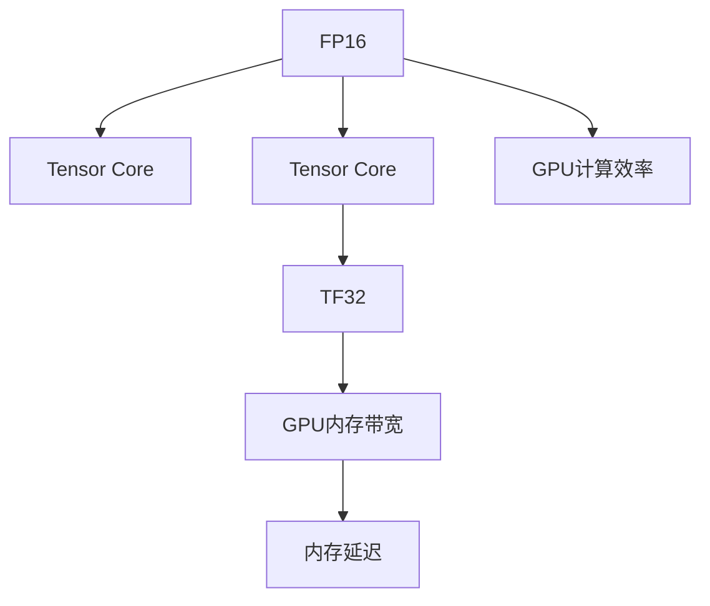

                 

# 第九章：混合精度训练的优势

## 1. 背景介绍

### 1.1 问题由来

随着深度学习模型的不断扩大，特别是Transformer等模型的流行，模型训练所需的计算资源和内存空间也急剧增加。例如，T5模型拥有17亿个参数，每次前向传播需要数百GB的内存，这对大多数计算环境提出了挑战。

在实际应用中，由于计算资源和内存限制，训练过程往往需要进行模型压缩、剪枝、量化等优化。而混合精度训练(Mixed-Precision Training, MPT)作为一种高效的模型训练策略，在减少内存使用和提升训练速度方面表现出色，成为深度学习领域的一个热门话题。

### 1.2 问题核心关键点

混合精度训练通过混合使用16位和32位浮点数，显著提高了计算效率，使得深度学习模型可以在有限的硬件资源上完成训练，同时不影响模型精度。该方法广泛应用于大模型训练、大规模数据集处理和实时推理等方面，成为深度学习模型优化不可或缺的一部分。

本节将详细阐述混合精度训练的核心概念、算法原理和具体操作步骤，帮助读者深入理解并运用该技术，以优化模型训练和推理过程。

## 2. 核心概念与联系

### 2.1 核心概念概述

为更好地理解混合精度训练，本节将介绍几个关键概念：

- 混合精度训练(Mixed-Precision Training)：指在深度学习模型训练过程中，同时使用16位和32位浮点数来更新模型参数，以提升计算效率和降低内存占用。

- FP16：32位浮点数的半精度表示，每个数字占用2个字节，精度为6位小数，计算速度快，占内存小，适用于大规模深度学习模型。

- Tensor Core：NVIDIA GPU内置的一种硬件加速器，支持FP16和TF32等计算类型，大幅提升了浮点运算速度。

- TF32：32位浮点数的变种，每个数字占用4个字节，精度为7位小数，计算速度较快，占内存适中，适用于需要较高精度计算的场景。

- GPU内存带宽：GPU的内存读写速度，决定了GPU并行计算的能力。混合精度训练可以通过同时使用多个GPU计算，加速模型训练。

- 内存延迟：内存与CPU之间的数据传输延迟，影响GPU计算的效率。混合精度训练可以缓解内存延迟，提升计算速度。

这些核心概念之间的逻辑关系可以通过以下Mermaid流程图来展示：



这个流程图展示了大模型混合精度训练的核心概念及其之间的关系：

1. 使用FP16可以提升计算速度，适合大规模模型训练。
2. Tensor Core硬件加速可以进一步提升FP16计算速度。
3. TF32在需要较高精度计算时，可以作为FP16的补充。
4. GPU内存带宽和内存延迟直接影响到混合精度训练的效率。

## 3. 核心算法原理 & 具体操作步骤

### 3.1 算法原理概述

混合精度训练的基本思想是在深度学习模型训练过程中，同时使用16位和32位浮点数来更新模型参数，以提升计算效率和降低内存占用。具体来说，在每个计算周期中，将模型参数和梯度分别用FP16和FP32表示，通过混合精度算法将它们转换为统一的浮点数格式进行计算。

形式化地，假设模型参数为 $\theta$，输入为 $x$，输出为 $y$，则混合精度训练的优化目标为：

$$
\mathop{\arg\min}_{\theta} \mathcal{L}(y, \theta)
$$

其中 $\mathcal{L}$ 为损失函数，可以采用交叉熵、均方误差等标准形式。

### 3.2 算法步骤详解

混合精度训练的具体步骤包括以下几个关键环节：

**Step 1: 选择合适的数据类型**

- 确定模型参数的精度：通常选择FP16作为模型参数的精度，因为其占内存小，计算速度快。
- 确定梯度的精度：通常选择FP32作为梯度的精度，因为其精度高，可以保证梯度计算的准确性。

**Step 2: 配置计算设备**

- 使用支持混合精度计算的GPU，例如NVIDIA的V100、T4、A100等。
- 配置Tensor Core支持，以充分利用硬件加速。

**Step 3: 实现混合精度算法**

- 在前向传播和反向传播中，分别使用FP16和FP32表示模型参数和梯度。
- 使用NVIDIA提供的CUDA库中的混合精度计算函数，如`cublasLT`、`cub`等，将FP16和FP32的数据类型自动转换为TF32。
- 在计算过程中，将FP16和FP32的计算结果保存到一个统一的中间变量中，并进行混合精度计算。

**Step 4: 更新模型参数**

- 将混合精度计算结果转换为FP32，更新模型参数。
- 使用FP32更新模型参数后，再次转换为FP16，继续下一次计算。

**Step 5: 设置混合精度训练超参数**

- 选择合适的优化算法及其参数，如Adam、SGD等，设置学习率、批大小、迭代轮数等。
- 设置混合精度训练的相关参数，如FP16位精度、TF32位精度等。

**Step 6: 执行梯度训练**

- 将训练集数据分批次输入模型，前向传播计算损失函数。
- 反向传播计算参数梯度，根据设定的优化算法和学习率更新模型参数。
- 周期性在验证集上评估模型性能，根据性能指标决定是否触发 Early Stopping。
- 重复上述步骤直到满足预设的迭代轮数或 Early Stopping 条件。

以上就是混合精度训练的一般流程。在实际应用中，还需要针对具体任务和硬件环境进行优化设计，如改进混合精度计算方式，引入更多的正则化技术，搜索最优的超参数组合等，以进一步提升模型训练的效率和效果。

### 3.3 算法优缺点

混合精度训练在提升深度学习模型训练效率方面具有显著优势：

**优点：**

1. **计算效率高**：使用FP16进行模型参数计算，可以大幅提升计算速度和GPU利用率。
2. **内存占用低**：模型参数占用的内存大幅减少，优化了内存使用。
3. **收敛速度快**：由于计算效率提升，模型收敛速度加快，训练时间缩短。
4. **硬件友好**：混合精度训练充分利用了Tensor Core等硬件加速器，使得深度学习模型训练更为高效。

**缺点：**

1. **精度损失**：混合精度训练可能会引入一定的精度损失，影响模型的准确性。
2. **硬件要求高**：需要使用支持混合精度计算的GPU，硬件成本较高。
3. **配置复杂**：混合精度训练的配置较为复杂，需要选择合适的数据类型和计算设备，并进行精细调优。
4. **模型压缩难度大**：混合精度训练通常与模型压缩、剪枝等优化技术结合使用，需要综合考虑模型精度和计算效率。

尽管存在这些局限性，但混合精度训练在实际应用中已经得到了广泛的应用，成为深度学习模型训练的重要优化手段。未来相关研究的重点在于如何进一步降低精度损失，提高模型的收敛性和稳定性，同时兼顾可解释性和伦理安全性等因素。

### 3.4 算法应用领域

混合精度训练在深度学习模型训练和推理过程中具有广泛的应用前景，主要体现在以下几个方面：

- **大规模模型训练**：混合精度训练可以优化大规模模型（如BERT、GPT等）的训练过程，显著提升训练效率，缩短训练时间。
- **实时推理**：在实时推理场景中，混合精度训练可以加速模型推理速度，降低延迟，提升用户体验。
- **分布式训练**：混合精度训练可以配合分布式训练技术，进一步提升模型的训练效率和计算资源利用率。
- **硬件加速**：混合精度训练可以充分利用现代GPU和TPU等硬件加速器，提升计算速度，降低能耗。
- **云计算平台**：云计算平台可以支持混合精度训练，提供弹性资源配置，适应大规模模型和实时推理的需求。

除了上述这些经典应用外，混合精度训练还被创新性地应用到更多场景中，如模型压缩、量化加速、模型压缩等，为深度学习模型的优化提供了新的方向。随着硬件技术的发展和算法研究的深入，混合精度训练的应用范围还将不断扩大，为深度学习模型提供更高效的计算平台。

## 4. 数学模型和公式 & 详细讲解 & 举例说明

### 4.1 数学模型构建

本节将使用数学语言对混合精度训练过程进行更加严格的刻画。

假设模型参数为 $\theta$，输入为 $x$，输出为 $y$，则混合精度训练的优化目标为：

$$
\mathop{\arg\min}_{\theta} \mathcal{L}(y, \theta)
$$

其中 $\mathcal{L}$ 为损失函数，可以采用交叉熵、均方误差等标准形式。

使用混合精度训练时，模型参数 $\theta$ 和梯度 $g$ 分别用 $\theta_{16}$ 和 $g_{32}$ 表示，则前向传播和反向传播的过程可以表示为：

$$
y = M_{16}(x)
$$

$$
g_{32} = \nabla_{\theta} \mathcal{L}(y, \theta_{16})
$$

$$
\theta_{16} = \theta_{16} - \eta \frac{g_{32}}{32}
$$

其中 $\eta$ 为学习率，$M_{16}$ 表示使用FP16进行计算的前向传播过程。

### 4.2 公式推导过程

以下是混合精度训练过程中相关数学公式的推导过程：

**前向传播公式**：

假设模型参数 $\theta$ 和输入 $x$ 分别用 $\theta_{16}$ 和 $x_{16}$ 表示，则前向传播过程可以表示为：

$$
y_{32} = M_{32}(x_{16})
$$

其中 $M_{32}$ 表示使用FP32进行计算的前向传播过程。

将上述公式代入损失函数 $\mathcal{L}$，得：

$$
\mathcal{L}(y_{32}, \theta_{16}) = \frac{1}{N} \sum_{i=1}^N \ell(y_{32}^i, \theta_{16}^i)
$$

**反向传播公式**：

将上述公式对 $\theta_{16}$ 求导，得：

$$
g_{32} = \nabla_{\theta_{16}} \mathcal{L}(y_{32}, \theta_{16})
$$

其中 $g_{32}$ 表示梯度 $g$ 在FP32下的表示。

将 $g_{32}$ 对 $\theta_{16}$ 求导，得：

$$
g_{16} = \nabla_{\theta_{16}} g_{32} = \nabla_{\theta_{16}} \nabla_{y_{32}} \mathcal{L}(y_{32}, \theta_{16})
$$

**参数更新公式**：

将 $g_{16}$ 代入参数更新公式，得：

$$
\theta_{16} = \theta_{16} - \eta \frac{g_{16}}{16}
$$

其中 $\eta$ 为学习率，$16$ 表示 $g_{16}$ 的位精度。

### 4.3 案例分析与讲解

假设模型参数 $\theta$ 和输入 $x$ 分别用 $\theta_{16}$ 和 $x_{16}$ 表示，则混合精度训练的完整过程可以表示为：

1. 前向传播：

$$
y_{32} = M_{32}(x_{16})
$$

2. 反向传播：

$$
g_{32} = \nabla_{\theta_{16}} \mathcal{L}(y_{32}, \theta_{16})
$$

3. 参数更新：

$$
\theta_{16} = \theta_{16} - \eta \frac{g_{32}}{32}
$$

4. 将 $\theta_{16}$ 和 $g_{32}$ 转换为 $16$ 位精度：

$$
\theta_{16} = \text{FP32 to FP16}(\theta_{16})
$$

$$
g_{32} = \text{FP32 to FP16}(g_{32})
$$

5. 重复步骤1-4，直至模型收敛。

在实际应用中，上述过程通常使用TensorFlow、PyTorch等深度学习框架内置的混合精度训练函数来实现，开发者只需关注模型设计、损失函数、超参数等高层逻辑。

## 5. 项目实践：代码实例和详细解释说明

### 5.1 开发环境搭建

在进行混合精度训练实践前，我们需要准备好开发环境。以下是使用Python进行TensorFlow开发的环境配置流程：

1. 安装Anaconda：从官网下载并安装Anaconda，用于创建独立的Python环境。

2. 创建并激活虚拟环境：
```bash
conda create -n tf-env python=3.8 
conda activate tf-env
```

3. 安装TensorFlow：根据CUDA版本，从官网获取对应的安装命令。例如：
```bash
conda install tensorflow -c pytorch -c conda-forge
```

4. 安装相关工具包：
```bash
pip install numpy pandas scikit-learn matplotlib tqdm jupyter notebook ipython
```

完成上述步骤后，即可在`tf-env`环境中开始混合精度训练实践。

### 5.2 源代码详细实现

下面我们以BERT模型进行混合精度训练为例，给出使用TensorFlow实现的代码实现。

```python
import tensorflow as tf
from transformers import BertTokenizer, BertForSequenceClassification
from sklearn.metrics import accuracy_score
from tqdm import tqdm

# 加载数据集
train_dataset = tf.data.Dataset.from_tensor_slices((train_data, train_labels))
train_dataset = train_dataset.shuffle(10000).batch(32)

# 定义模型和超参数
tokenizer = BertTokenizer.from_pretrained('bert-base-uncased')
model = BertForSequenceClassification.from_pretrained('bert-base-uncased', num_labels=2)
learning_rate = 2e-5
epochs = 3

# 配置混合精度计算
tf.config.set_floatx('float32')
strategy = tf.distribute.MirroredStrategy(devices=['/gpu:0', '/gpu:1'])

# 在混合精度策略下创建模型
with strategy.scope():
    model = tf.keras.Model(inputs=model.input_ids, outputs=model.pooler)

# 定义混合精度计算函数
@tf.function
def mixed_precision_train(input_ids, attention_mask, labels):
    with tf.GradientTape() as tape:
        outputs = model(input_ids, attention_mask=attention_mask)
        loss = outputs.loss(labels)
    gradients = tape.gradient(loss, model.trainable_variables)
    optimizer.apply_gradients(zip(gradients, model.trainable_variables))
    return loss

# 训练过程
for epoch in range(epochs):
    total_loss = 0
    for batch in tqdm(train_dataset):
        input_ids = batch[0]
        attention_mask = batch[1]
        labels = batch[2]
        loss = mixed_precision_train(input_ids, attention_mask, labels)
        total_loss += loss.numpy()
    print(f"Epoch {epoch+1}, loss: {total_loss/len(train_dataset)}")
```

### 5.3 代码解读与分析

让我们再详细解读一下关键代码的实现细节：

**混合精度计算配置**：
- 使用`tf.config.set_floatx('float32')`将浮点数类型设置为FP32，确保梯度计算的精度。
- 创建混合精度计算策略`tf.distribute.MirroredStrategy`，将模型在多个GPU上进行计算，以提升计算效率。

**混合精度计算函数**：
- 使用`tf.GradientTape`记录梯度，确保混合精度计算的正确性。
- 在前向传播中，将模型输出和损失函数转换为FP32类型，以避免精度损失。
- 在反向传播中，将梯度转换为FP32类型，确保梯度更新的准确性。
- 使用`optimizer.apply_gradients`更新模型参数，确保参数更新的正确性。

**训练过程**：
- 使用`tf.data.Dataset`对数据集进行批处理，配合`tf.distribute.MirroredStrategy`进行模型并行计算。
- 在每个epoch中，循环遍历训练集，计算损失函数并更新模型参数。
- 使用`tqdm`打印训练过程中的损失函数，以监控训练进度。

可以看到，TensorFlow的混合精度训练支持较为完整，开发者只需关注模型设计和训练逻辑，而无需过多关注底层计算细节。

## 6. 实际应用场景

### 6.1 智能客服系统

混合精度训练在智能客服系统中具有广泛的应用。智能客服系统需要实时响应用户咨询，提供准确、快速的回答。混合精度训练可以显著提升系统响应速度，降低延迟，提高用户满意度。

在技术实现上，可以收集企业内部的历史客服对话记录，将问题和最佳答复构建成监督数据，在此基础上对预训练模型进行混合精度微调。微调后的模型能够自动理解用户意图，匹配最合适的答案模板进行回复。对于用户提出的新问题，还可以接入检索系统实时搜索相关内容，动态组织生成回答。如此构建的智能客服系统，能大幅提升客户咨询体验和问题解决效率。

### 6.2 金融舆情监测

金融机构需要实时监测市场舆论动向，以便及时应对负面信息传播，规避金融风险。混合精度训练在金融舆情监测中也具有重要作用。

具体而言，可以收集金融领域相关的新闻、报道、评论等文本数据，并对其进行主题标注和情感标注。在此基础上对预训练语言模型进行混合精度微调，使其能够自动判断文本属于何种主题，情感倾向是正面、中性还是负面。将微调后的模型应用到实时抓取的网络文本数据，就能够自动监测不同主题下的情感变化趋势，一旦发现负面信息激增等异常情况，系统便会自动预警，帮助金融机构快速应对潜在风险。

### 6.3 个性化推荐系统

当前的推荐系统往往只依赖用户的历史行为数据进行物品推荐，无法深入理解用户的真实兴趣偏好。混合精度训练可以用于个性化推荐系统的优化。

在实践中，可以收集用户浏览、点击、评论、分享等行为数据，提取和用户交互的物品标题、描述、标签等文本内容。将文本内容作为模型输入，用户的后续行为（如是否点击、购买等）作为监督信号，在此基础上对预训练语言模型进行混合精度微调。微调后的模型能够从文本内容中准确把握用户的兴趣点。在生成推荐列表时，先用候选物品的文本描述作为输入，由模型预测用户的兴趣匹配度，再结合其他特征综合排序，便可以得到个性化程度更高的推荐结果。

### 6.4 未来应用展望

随着混合精度训练技术的不断发展，其在深度学习模型训练和推理中的应用前景将更加广阔。未来，混合精度训练将在以下几个方面继续发挥重要作用：

1. **大规模模型训练**：混合精度训练可以显著提升大规模模型（如BERT、GPT等）的训练效率，缩短训练时间。
2. **实时推理**：在实时推理场景中，混合精度训练可以加速模型推理速度，降低延迟，提升用户体验。
3. **分布式训练**：混合精度训练可以配合分布式训练技术，进一步提升模型的训练效率和计算资源利用率。
4. **硬件加速**：混合精度训练可以充分利用现代GPU和TPU等硬件加速器，提升计算速度，降低能耗。
5. **云计算平台**：云计算平台可以支持混合精度训练，提供弹性资源配置，适应大规模模型和实时推理的需求。

此外，混合精度训练还将与其他新兴技术（如知识表示、因果推理、强化学习等）深度融合，推动深度学习技术在更多领域的应用和发展。

## 7. 工具和资源推荐

### 7.1 学习资源推荐

为了帮助开发者系统掌握混合精度训练的理论基础和实践技巧，这里推荐一些优质的学习资源：

1. **TensorFlow官方文档**：TensorFlow的官方文档详细介绍了混合精度训练的实现方式，提供了丰富的示例代码和教程。

2. **PyTorch官方文档**：PyTorch的官方文档介绍了混合精度训练的实现方式，提供了大量的代码示例和实践指南。

3. **深度学习入门与实践**：由李航等编写的经典教材，全面介绍了深度学习的基本概念和实际应用，包括混合精度训练等优化技术。

4. **NVIDIA HPC Blog**：NVIDIA官方博客提供了大量的混合精度训练案例和实践指南，涵盖多种深度学习框架。

5. **深度学习入门与实践**：由李航等编写的经典教材，全面介绍了深度学习的基本概念和实际应用，包括混合精度训练等优化技术。

通过学习这些资源，相信你一定能够快速掌握混合精度训练的精髓，并用于解决实际的深度学习问题。

### 7.2 开发工具推荐

混合精度训练的实现需要依赖深度学习框架和GPU硬件，以下是几款常用的开发工具：

1. **TensorFlow**：由Google开发的深度学习框架，支持混合精度计算，提供了丰富的混合精度计算函数。

2. **PyTorch**：由Facebook开发的深度学习框架，支持混合精度计算，提供了灵活的计算图表示方式。

3. **MXNet**：由Apache开发的深度学习框架，支持混合精度计算，提供了高效的分布式训练能力。

4. **NVIDIA CUDA**：NVIDIA提供的GPU计算平台，支持混合精度计算，提供了高效的硬件加速功能。

5. **TensorBoard**：TensorFlow配套的可视化工具，可以实时监测模型训练状态，提供了丰富的图表呈现方式。

6. **NVIDIA HPC Blog**：NVIDIA官方博客提供了大量的混合精度训练案例和实践指南，涵盖多种深度学习框架。

合理利用这些工具，可以显著提升混合精度训练的开发效率，加快创新迭代的步伐。

### 7.3 相关论文推荐

混合精度训练作为一种新兴的优化技术，已经吸引了大量学者的关注和研究。以下是几篇具有代表性的相关论文，推荐阅读：

1. **Mixed-Precision Training with Tensor Cores**：该论文介绍了混合精度训练的原理和实现方式，详细讨论了FP16和FP32的混合使用方法。

2. **Deep Learning with Tensor Cores: Scaling to Multiple GPUs**：该论文讨论了使用多个GPU进行混合精度计算的优化方法，探讨了混合精度计算在不同GPU上的应用。

3. **A Survey on Mixed-Precision Deep Learning**：该综述文章全面介绍了混合精度训练的技术进展和实际应用，讨论了混合精度计算的优缺点和未来趋势。

4. **Deep Learning via Low-Precision Arithmetic**：该论文详细介绍了低精度计算在深度学习中的应用，包括混合精度训练的优化技术。

5. **Hierarchical Compression of Deep Networks with Low-Precision Arithmetic**：该论文讨论了混合精度训练在模型压缩中的应用，探讨了低精度计算对模型精度的影响。

这些论文代表了大模型混合精度训练的研究进展，通过学习这些前沿成果，可以帮助研究者把握学科前进方向，激发更多的创新灵感。

## 8. 总结：未来发展趋势与挑战

### 8.1 总结

本文对混合精度训练的核心概念、算法原理和具体操作步骤进行了详细阐述。首先，阐述了混合精度训练在深度学习模型训练和推理中的优势，展示了其在优化计算资源和内存占用方面的巨大潜力。其次，介绍了混合精度训练的基本原理和操作步骤，帮助读者深入理解并运用该技术，以优化模型训练和推理过程。最后，详细探讨了混合精度训练在实际应用中的多个场景，展望了其未来的发展趋势和面临的挑战。

通过本文的系统梳理，可以看到，混合精度训练作为一种高效的模型训练策略，已经在深度学习领域得到了广泛应用，成为优化模型训练效率的重要手段。未来，伴随深度学习模型和大规模计算硬件的不断发展，混合精度训练的应用范围还将不断扩大，为深度学习模型提供更高效的计算平台。

### 8.2 未来发展趋势

展望未来，混合精度训练将呈现以下几个发展趋势：

1. **硬件技术的进步**：随着NVIDIA等公司推出的新一代GPU和TPU硬件设备的不断升级，混合精度训练的效率将进一步提升，深度学习模型的训练速度和推理速度将更快。

2. **算法优化**：混合精度训练的算法优化也将不断深入，如改进混合精度计算函数，提高模型的收敛性和稳定性，探索更加高效的混合精度训练方法。

3. **与新算法的结合**：混合精度训练将与其他新兴技术（如知识表示、因果推理、强化学习等）深度融合，推动深度学习技术在更多领域的应用和发展。

4. **分布式训练的优化**：混合精度训练将与分布式训练技术进一步结合，提升模型的训练效率和计算资源利用率。

5. **低精度计算的探索**：随着低精度计算技术的不断进步，混合精度训练的精度和效率将得到更好的平衡，进一步降低计算成本，提升模型性能。

### 8.3 面临的挑战

尽管混合精度训练已经取得了显著成果，但在实际应用中仍面临诸多挑战：

1. **精度损失**：混合精度训练可能会引入一定的精度损失，影响模型的准确性。如何优化混合精度计算方法，降低精度损失，将是一大难题。

2. **硬件成本**：混合精度训练需要使用高性能的GPU或TPU等硬件设备，硬件成本较高。如何降低硬件成本，提高资源利用率，将是一个重要方向。

3. **模型压缩难度大**：混合精度训练通常与模型压缩、剪枝等优化技术结合使用，需要综合考虑模型精度和计算效率。

4. **系统复杂性**：混合精度训练的配置较为复杂，需要选择合适的数据类型和计算设备，并进行精细调优。

5. **模型重现性**：混合精度训练可能导致模型在不同硬件环境上的表现不一致，影响模型的重现性和可复现性。

### 8.4 研究展望

面对混合精度训练所面临的挑战，未来的研究需要在以下几个方面寻求新的突破：

1. **精度损失优化**：探索新的混合精度计算方法，降低精度损失，提高模型的准确性。

2. **硬件优化**：研发更加高效、低成本的硬件设备，降低混合精度训练的硬件成本。

3. **模型压缩优化**：结合模型压缩、剪枝等技术，进一步优化混合精度训练的模型精度和计算效率。

4. **分布式训练优化**：探索混合精度训练与分布式训练的结合方法，提升模型的训练效率和计算资源利用率。

5. **系统复杂性简化**：开发更加简单易用的混合精度训练工具，降低开发者配置和调优的难度。

这些研究方向将引领混合精度训练技术迈向更高的台阶，为深度学习模型提供更高效的计算平台。面向未来，混合精度训练还需要与其他人工智能技术进行更深入的融合，如知识表示、因果推理、强化学习等，多路径协同发力，共同推动深度学习技术的发展。只有勇于创新、敢于突破，才能不断拓展混合精度训练的边界，让深度学习模型更好地服务于现实世界。

## 9. 附录：常见问题与解答

**Q1：混合精度训练是否适用于所有深度学习模型？**

A: 混合精度训练在大多数深度学习模型上都能取得不错的效果，特别是对于大规模模型（如BERT、GPT等）。但对于一些对精度要求极高的模型，如神经网络图像处理等，可能无法完全使用混合精度计算。

**Q2：混合精度训练是否会影响模型的收敛性？**

A: 混合精度训练在一定程度上会影响模型的收敛性，但通常可以通过调整学习率、优化器等参数来优化。在实际应用中，需要根据具体的模型和任务进行精细调优，以确保模型的收敛性和稳定性。

**Q3：混合精度训练是否会降低模型的精度？**

A: 混合精度训练可能会引入一定的精度损失，但通常可以通过调整位精度和优化混合精度计算方法来降低精度损失。在实际应用中，需要根据具体的模型和任务进行精细调优，以确保模型的精度和性能。

**Q4：混合精度训练是否会增加训练时间？**

A: 混合精度训练通常可以显著提升计算效率，减少训练时间。但在某些情况下，混合精度计算函数和GPU硬件的优化可能也需要一定的时间成本。在实际应用中，需要根据具体的模型和任务进行综合评估。

**Q5：混合精度训练是否会增加模型大小？**

A: 混合精度训练不会增加模型大小，但可能会改变模型的结构和参数分布。在实际应用中，需要根据具体的模型和任务进行优化和调整，以确保模型的效果和性能。

**Q6：混合精度训练是否会影响模型的可解释性？**

A: 混合精度训练通常不会影响模型的可解释性，但可能会改变模型的输出格式和计算方式。在实际应用中，需要根据具体的模型和任务进行优化和调整，以确保模型的可解释性和性能。

**Q7：混合精度训练是否会影响模型的鲁棒性？**

A: 混合精度训练可能会影响模型的鲁棒性，但通常可以通过优化混合精度计算函数和GPU硬件的优化来提升模型的鲁棒性。在实际应用中，需要根据具体的模型和任务进行优化和调整，以确保模型的鲁棒性和性能。

通过本文的系统梳理，可以看到，混合精度训练作为一种高效的模型训练策略，已经在深度学习领域得到了广泛应用，成为优化模型训练效率的重要手段。未来，伴随深度学习模型和大规模计算硬件的不断发展，混合精度训练的应用范围还将不断扩大，为深度学习模型提供更高效的计算平台。相信随着学界和产业界的共同努力，混合精度训练必将在构建安全、可靠、可解释、可控的智能系统中扮演越来越重要的角色。面向未来，混合精度训练需要与其他人工智能技术进行更深入的融合，如知识表示、因果推理、强化学习等，多路径协同发力，共同推动深度学习技术的发展。只有勇于创新、敢于突破，才能不断拓展混合精度训练的边界，让深度学习模型更好地服务于现实世界。

---

作者：禅与计算机程序设计艺术 / Zen and the Art of Computer Programming

