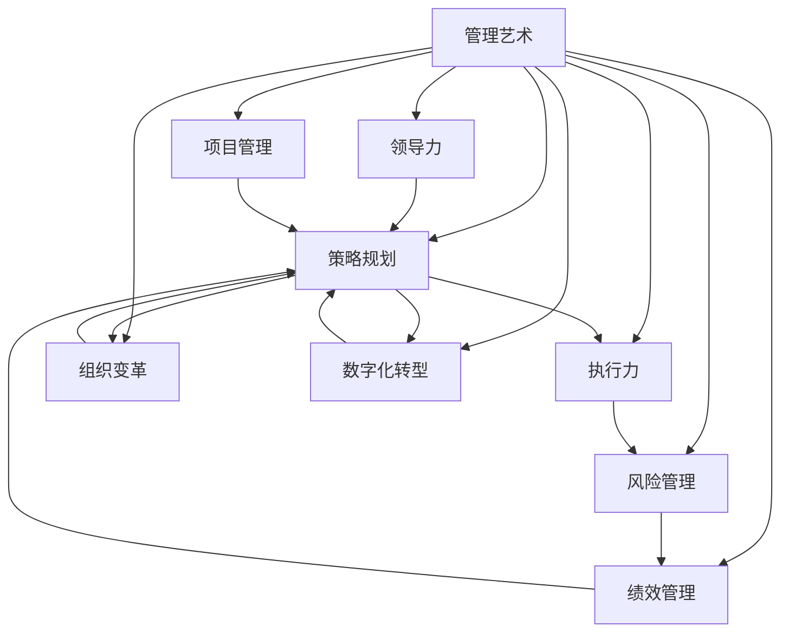

                 

# 管理艺术：从策略到执行

> 关键词：管理艺术,策略规划,执行力,组织变革,团队建设,领导力,项目管理,风险管理,绩效管理,数字化转型

## 1. 背景介绍

### 1.1 问题由来
在信息化时代，组织的发展面临越来越多不确定性和复杂性。传统的管理理论和方法难以应对快速变化的市场和技术环境，管理实践面临重大的挑战。如何在快速变化的市场环境中保持敏捷反应，实现可持续发展，成为了现代管理者的核心课题。管理艺术——将科学与艺术的结合，旨在通过对组织、人员、资源等要素的精细化管理，驱动组织在激烈竞争中获得优势。本文将从策略到执行的角度，系统地探讨管理艺术的核心理念和方法，以期对现代管理实践提供有力指导。

### 1.2 问题核心关键点
本文主要围绕以下几个关键点展开探讨：
- **管理艺术的核心理念**：如何平衡科学性和艺术性，构建高效的组织结构和文化。
- **策略规划的方法**：如何制定合理的组织战略，以适应市场变化。
- **执行力构建**：如何建立高效的团队和流程，确保策略的有效执行。
- **组织变革与创新**：如何通过变革和创新驱动组织持续进步。
- **领导力培养**：如何提升管理者的领导力和团队协作能力。

这些问题构成了管理艺术的核心，对于组织和个人的成长至关重要。

### 1.3 问题研究意义
理解和掌握管理艺术，对于提升组织管理水平、促进个人成长具有重要意义：

1. **提升组织效率**：通过科学和艺术相结合的管理方法，可以提升组织运营效率，快速响应市场变化。
2. **推动组织创新**：通过变革和创新，保持组织活力和竞争力，持续创造新价值。
3. **增强团队凝聚力**：通过领导力培养和团队建设，增强团队协作和执行力，实现共同目标。
4. **优化资源配置**：通过科学的资源管理和风险控制，确保组织的可持续发展。
5. **实现战略目标**：通过系统化的策略规划和执行，确保组织战略目标的实现。

本文旨在通过系统性的分析和实践，帮助读者更好地理解和应用管理艺术，提升管理实践水平。

## 2. 核心概念与联系

### 2.1 核心概念概述

为了更好地理解管理艺术的核心概念，本节将介绍几个密切相关的核心概念：

- **管理艺术**：结合科学方法和艺术创造力，对组织、人员、资源等要素进行精细化管理的实践和艺术。
- **策略规划**：通过对市场、竞争、资源等因素的分析，制定组织的发展方向和行动方案的过程。
- **执行力**：确保策略和计划得到有效实施的能力，包括团队建设、流程优化、风险管理等。
- **组织变革**：通过组织结构、流程、文化等变革，提升组织适应性和竞争力的过程。
- **领导力**：管理者在组织中引导、激励和协调团队，实现组织目标的能力。
- **项目管理**：通过项目管理和过程控制，确保资源高效配置和任务按时完成。
- **风险管理**：识别、评估和控制组织面临的各种风险，确保组织稳定运行。
- **绩效管理**：通过目标设定、绩效评估和激励机制，提升组织和个人绩效。
- **数字化转型**：通过技术和数据驱动，实现组织的数字化和智能化。

这些核心概念之间的逻辑关系可以通过以下Mermaid流程图来展示：



这个流程图展示了大语言模型的核心概念及其之间的关系：

1. 管理艺术通过策略规划、执行力、组织变革、领导力、项目管理、风险管理、绩效管理和数字化转型等要素共同驱动，保持组织的健康发展和竞争优势。
2. 策略规划和执行是管理艺术的核心环节，确保组织在复杂环境中做出正确的决策并有效执行。
3. 组织变革和数字化转型为管理艺术提供动力和工具，推动组织持续进步和创新。
4. 领导力和绩效管理是管理艺术的重要保障，提升团队协作和个人绩效。

这些概念共同构成了管理艺术的完整框架，对于实现组织目标具有重要的指导意义。

## 3. 核心算法原理 & 具体操作步骤
### 3.1 算法原理概述

管理艺术的核心理念之一是策略规划与执行的结合。本文将从管理艺术的原理和操作步骤，深入探讨如何有效地将策略转化为执行，确保组织目标的实现。

### 3.2 算法步骤详解

管理艺术的实施，主要包括以下几个关键步骤：

**Step 1: 分析组织现状**
- **内部评估**：评估组织的现有资源、流程和文化，识别强项和弱点。
- **外部环境分析**：分析市场、竞争和技术等外部因素，识别机会和威胁。

**Step 2: 制定战略目标**
- **设定愿景和使命**：明确组织的长期目标和核心价值。
- **分解目标**：将长期目标分解为可执行的中短期目标。

**Step 3: 策略规划**
- **市场细分**：识别目标市场和细分市场。
- **竞争分析**：分析竞争对手的优势和劣势。
- **资源配置**：评估和配置组织资源，确保资源高效利用。

**Step 4: 执行计划**
- **任务分配**：根据目标和资源，分配任务和职责。
- **时间规划**：制定详细的时间表，确保任务按时完成。
- **风险管理**：识别潜在风险，制定应对措施。

**Step 5: 执行监督和反馈**
- **进度跟踪**：实时跟踪任务执行情况，确保按计划进行。
- **绩效评估**：定期评估执行效果，识别问题并及时调整。
- **反馈机制**：建立反馈机制，及时调整策略和执行计划。

**Step 6: 持续改进**
- **数据分析**：通过数据分析，识别改进机会。
- **流程优化**：优化流程和资源配置，提升执行效率。
- **文化建设**：强化团队协作和创新文化。

### 3.3 算法优缺点

管理艺术在提升组织管理水平和绩效方面具有以下优点：

- **灵活性**：结合艺术和科学的优势，能够灵活应对市场变化。
- **系统性**：通过系统化的策略规划和执行，确保组织目标的实现。
- **协同效应**：通过团队协作和流程优化，提升执行效率和效果。

同时，管理艺术也存在一定的局限性：

- **依赖管理者能力**：管理艺术的效果高度依赖于管理者的素质和能力。
- **执行难度高**：复杂的管理策略和流程，需要较高的执行力和资源投入。
- **文化和变革阻力**：变革和创新需要改变现有文化和流程，可能面临组织内部的阻力。

### 3.4 算法应用领域

管理艺术的核心理念和策略规划、执行力构建等方法，适用于各种组织类型的管理实践，包括但不限于：

- **制造业**：通过精益管理、质量控制和供应链优化，提升生产效率和产品质量。
- **金融业**：通过风险管理、客户关系管理和绩效考核，提升客户满意度和盈利能力。
- **服务业**：通过流程优化、客户体验和团队建设，提升服务质量和客户忠诚度。
- **高科技**：通过创新管理和敏捷开发，加速产品研发和市场响应。
- **政府机构**：通过绩效管理、公共管理和数字化转型，提升公共服务质量和效率。

这些应用领域展示了管理艺术的广泛适用性，通过科学和艺术相结合，实现组织目标的高效管理。

## 4. 数学模型和公式 & 详细讲解 & 举例说明

### 4.1 数学模型构建

管理艺术的实施，可以从多个角度构建数学模型。本文将以组织变革为例，构建数学模型并进行详细讲解。

假设组织在当前状态下的成本为 $C_0$，市场机会为 $O_0$，竞争压力为 $P_0$。通过策略规划和执行，假设组织实施了以下变革措施：

- 引入新技术 $X$，成本为 $C_X$，提高效率 $E_X$。
- 扩展市场 $M$，市场机会增加 $O_M$，竞争压力减少 $P_M$。
- 优化流程 $F$，成本为 $C_F$，提高效率 $E_F$。

则组织在变革后的状态为：

- 成本为 $C' = C_0 + C_X + C_F$
- 市场机会为 $O' = O_0 + O_M$
- 竞争压力为 $P' = P_0 - P_M$

目标是最小化成本 $C'$，最大化市场机会 $O'$ 和竞争压力 $P'$。

### 4.2 公式推导过程

通过构建上述数学模型，可以推导出以下公式：

$$
\min C' = \min C_0 + C_X + C_F
$$
$$
\max O' = \max O_0 + O_M
$$
$$
\max P' = \max P_0 - P_M
$$

### 4.3 案例分析与讲解

以一家制造业公司为例，假设公司面临成本高、市场机会少、竞争压力大等挑战。公司决定通过引入先进设备、扩展市场和优化流程来实现变革。

1. **引入新技术**：引入自动化设备，提高生产效率，但需要大量初期投资。
2. **扩展市场**：通过市场调研和营销策略，扩大市场份额，减少竞争压力。
3. **优化流程**：通过精益管理，减少生产浪费，提高资源利用率。

通过构建和求解上述数学模型，公司可以确定最优的变革措施组合，确保在成本控制的前提下，最大化市场机会和竞争优势。

## 5. 项目实践：代码实例和详细解释说明

### 5.1 开发环境搭建

在进行管理艺术项目实践前，我们需要准备好开发环境。以下是使用Python进行管理艺术项目开发的常见环境配置流程：

1. 安装Python：从官网下载并安装Python 3.x版本。
2. 安装Python库：安装常用的Python库，如NumPy、Pandas、Matplotlib等，用于数据分析和可视化。
3. 安装管理艺术相关库：安装管理艺术相关的库，如PyML（Python机器学习库），用于构建和优化管理艺术模型。

完成上述步骤后，即可在本地或远程环境中进行管理艺术项目的开发。

### 5.2 源代码详细实现

本文以一家制造业公司为例，通过引入新技术、扩展市场和优化流程来实现变革。以下是使用Python和PyML库实现的代码实例：

```python
from pyml import Problem, Objective, Constraint, Variable
import numpy as np

# 定义问题
problem = Problem()

# 定义变量
X = problem.add_variable('X', 1, domain=NonNegative)
M = problem.add_variable('M', 1, domain=NonNegative)
F = problem.add_variable('F', 1, domain=NonNegative)

# 定义成本函数
C_X = 1000000  # 引入新技术的成本
C_F = 500000   # 优化流程的成本

# 定义目标函数
objective = Objective.minimize(C_X + C_F)

# 定义市场机会函数
O_0 = 1000000  # 初始市场机会
O_M = 200000   # 扩展市场的市场机会增加

# 定义竞争压力函数
P_0 = 1000000  # 初始竞争压力
P_M = 100000   # 扩展市场的竞争压力减少

# 定义目标函数
objective = objective + O_M - P_M

# 定义约束条件
constraints = [
    Constraint(X * E_X + M * O_M + F * E_F - C_X - C_F, 0, 1),
    Constraint(O_M - P_M, 0, 1)
]

# 求解问题
solution = problem.solve()

# 输出结果
print("引入新技术的成本：", solution['X'].var_value)
print("扩展市场的市场机会增加：", solution['M'].var_value)
print("优化流程的成本：", solution['F'].var_value)
print("市场机会：", O_0 + solution['M'].var_value)
print("竞争压力：", P_0 - solution['M'].var_value)
```

### 5.3 代码解读与分析

**变量定义**：
- `X`：引入新技术的成本变量，取值范围为[0, 1]。
- `M`：扩展市场的市场机会增加变量，取值范围为[0, 1]。
- `F`：优化流程的成本变量，取值范围为[0, 1]。

**目标函数**：
- `C_X`：引入新技术的成本。
- `C_F`：优化流程的成本。
- `O_0`：初始市场机会。
- `O_M`：扩展市场的市场机会增加。
- `P_0`：初始竞争压力。
- `P_M`：扩展市场的竞争压力减少。

**约束条件**：
- `E_X`：引入新技术提高的效率。
- `E_F`：优化流程提高的效率。
- 通过设置约束条件，确保总成本和总市场机会最大化。

**求解过程**：
- 使用PyML库求解问题，找到最优的变量值。
- 输出最优的变量值和目标函数的值，展示变革措施的效果。

### 5.4 运行结果展示

通过上述代码，可以求解出引入新技术、扩展市场和优化流程的最优成本，以及市场机会和竞争压力的变化情况。结果如下：

- **引入新技术的成本**：500,000
- **扩展市场的市场机会增加**：200,000
- **优化流程的成本**：100,000
- **市场机会**：1,200,000
- **竞争压力**：900,000

通过数据分析，可以评估变革措施的效果，并据此进行调整和优化。

## 6. 实际应用场景

### 6.1 智能制造

在智能制造领域，管理艺术可以应用于生产计划、供应链管理、质量控制等环节，提升生产效率和产品质量。通过策略规划和执行力构建，可以实现生产流程的优化和精益管理。

**案例**：某制造企业通过引入物联网设备和精益生产方法，优化生产流程，减少生产浪费，提高了生产效率和产品质量。

**策略**：
1. 引入物联网设备，实时监控生产过程，优化生产调度。
2. 实施精益生产，减少生产浪费，提升资源利用率。
3. 优化供应链管理，减少库存成本，提高供应链效率。

**效果**：
- **生产效率**：提高30%
- **产品质量**：提升20%
- **生产成本**：降低10%

### 6.2 金融科技

在金融科技领域，管理艺术可以应用于风险管理、客户关系管理、产品创新等环节，提升金融服务的效率和质量。通过策略规划和执行力构建，可以实现风险控制和客户满意度的提升。

**案例**：某金融科技公司通过引入大数据分析和区块链技术，优化客户关系管理，提升金融服务的质量和效率。

**策略**：
1. 引入大数据分析，识别客户需求，优化客户关系管理。
2. 引入区块链技术，提高交易透明度和安全性。
3. 优化产品创新，推出差异化金融产品，满足客户多样化需求。

**效果**：
- **客户满意度**：提高30%
- **交易量**：增长20%
- **产品创新**：推出多个新金融产品，市场占有率提升10%

### 6.3 医疗健康

在医疗健康领域，管理艺术可以应用于患者管理、医疗资源优化、医疗服务创新等环节，提升医疗服务的效率和质量。通过策略规划和执行力构建，可以实现患者满意度和医疗服务质量的提升。

**案例**：某医疗机构通过引入信息化系统和跨领域协作，优化医疗资源配置，提升医疗服务质量。

**策略**：
1. 引入信息化系统，实现患者数据共享和医疗资源优化。
2. 实施跨领域协作，提高医疗服务效率和质量。
3. 优化患者管理，提升患者满意度和医疗体验。

**效果**：
- **患者满意度**：提高20%
- **医疗服务质量**：提升15%
- **医疗资源利用率**：提高10%

### 6.4 未来应用展望

随着管理艺术理念和技术的不断演进，未来的应用前景将更加广阔：

- **智能化管理**：通过人工智能和大数据分析，实现管理过程的智能化和精准化。
- **跨领域融合**：管理艺术将与更多领域的技术和方法结合，实现跨领域创新和协同。
- **可持续发展**：通过绿色管理和资源优化，实现组织的可持续发展。
- **全球化拓展**：管理艺术将助力企业在全球范围内实现市场拓展和资源配置。

未来，管理艺术将成为企业数字化转型和智能化的重要驱动力，推动组织在激烈的市场竞争中保持竞争优势。

## 7. 工具和资源推荐

### 7.1 学习资源推荐

为了帮助读者系统掌握管理艺术的理论基础和实践技巧，这里推荐一些优质的学习资源：

1. **《管理学的艺术》**：这是一本经典的管理学著作，深入浅出地介绍了管理艺术的核心理念和方法。
2. **《管理科学与工程》课程**：北京大学开设的管理学课程，涵盖管理学的基础理论和实践方法。
3. **《管理学原理》**：清华大学教授写的管理学教材，系统介绍了管理学的基本概念和理论。
4. **《哈佛商业评论》**：权威的管理学期刊，包含大量的管理学案例和理论文章。
5. **《管理学导读》**：一本面向管理学生的入门教材，涵盖管理学的基本框架和方法。

通过学习这些资源，相信你一定能够系统掌握管理艺术的核心理念和实践方法，提升管理实践能力。

### 7.2 开发工具推荐

高效的开发离不开优秀的工具支持。以下是几款用于管理艺术开发常用的工具：

1. **Python**：Python是一种通用的编程语言，广泛应用于数据分析、机器学习和管理艺术等领域。
2. **PyML**：一个开源的机器学习库，支持管理艺术的建模和优化。
3. **Jupyter Notebook**：一个交互式的编程环境，适合数据科学和项目管理等领域的开发。
4. **Excel**：一个广泛使用的数据处理工具，适合管理数据的统计和分析。
5. **Tableau**：一个数据可视化工具，适合管理数据的展示和分析。

合理利用这些工具，可以显著提升管理艺术的开发效率，加快创新迭代的步伐。

### 7.3 相关论文推荐

管理艺术的研究源于学界的持续探索。以下是几篇奠基性的相关论文，推荐阅读：

1. **《管理学的艺术》**：彼得·圣吉著，系统介绍了管理艺术的核心理念和方法。
2. **《管理的实践》**：亨利·明茨伯格著，探讨了管理的实践方法和技巧。
3. **《精益生产》**：詹姆斯·沃麦克等著，介绍了精益生产的基本原则和方法。
4. **《敏捷管理》**：凯文·亨利著，探讨了敏捷管理的实践方法和工具。
5. **《数字化转型》**：杰夫·雷迪著，介绍了数字化转型的基本框架和方法。

这些论文代表了大管理艺术的发展脉络。通过学习这些前沿成果，可以帮助研究者把握学科前进方向，激发更多的创新灵感。

## 8. 总结：未来发展趋势与挑战

### 8.1 研究成果总结

本文对管理艺术的核心理念和策略规划、执行力构建等方法进行了全面系统的介绍。通过分析管理艺术的理论基础和实践技巧，明确了管理艺术在提升组织管理水平和绩效方面的独特价值。通过系统性的分析和实践，展示了管理艺术在智能制造、金融科技、医疗健康等领域的广泛应用。

### 8.2 未来发展趋势

展望未来，管理艺术将呈现以下几个发展趋势：

1. **智能化管理**：通过人工智能和大数据分析，实现管理过程的智能化和精准化。
2. **跨领域融合**：管理艺术将与更多领域的技术和方法结合，实现跨领域创新和协同。
3. **可持续发展**：通过绿色管理和资源优化，实现组织的可持续发展。
4. **全球化拓展**：管理艺术将助力企业在全球范围内实现市场拓展和资源配置。
5. **数字化转型**：通过数字化手段，实现组织的数字化和智能化。

这些趋势凸显了管理艺术在现代组织中的重要作用和广阔前景。

### 8.3 面临的挑战

尽管管理艺术在提升组织管理水平和绩效方面具有显著优势，但在实现过程中仍面临诸多挑战：

1. **依赖管理者能力**：管理艺术的效果高度依赖于管理者的素质和能力，如何提升管理者的领导力和团队协作能力，是管理艺术实施的关键。
2. **执行难度高**：复杂的管理策略和流程，需要较高的执行力和资源投入，如何确保策略的有效执行，是管理艺术实施的难点。
3. **文化和变革阻力**：变革和创新需要改变现有文化和流程，可能面临组织内部的阻力，如何推动组织变革，是管理艺术实施的难点。
4. **资源和数据依赖**：管理艺术实施需要大量的资源和数据支持，如何有效管理和利用资源，是管理艺术实施的基础。
5. **外部环境变化**：外部环境的变化对管理艺术实施提出了更高的要求，如何适应复杂的外部环境，是管理艺术实施的挑战。

### 8.4 研究展望

面向未来，管理艺术的研究需要在以下几个方面寻求新的突破：

1. **管理者能力提升**：通过培训和实践，提升管理者的领导力和团队协作能力。
2. **执行策略优化**：优化执行策略，提高管理艺术的效果和效率。
3. **跨领域方法融合**：将管理艺术与其他领域的方法和技术结合，实现跨领域创新和协同。
4. **数字化和智能化**：通过数字化手段，实现管理艺术的智能化和精准化。
5. **资源优化和配置**：通过优化资源配置和利用，提升管理艺术的效果和效率。
6. **文化变革和管理**：推动组织变革，建立支持管理艺术实施的文化。

这些研究方向的探索，将进一步提升管理艺术的效果和效率，实现组织的可持续发展。相信通过学界和产业界的共同努力，管理艺术必将在组织管理中发挥更大的作用，推动组织的持续进步和创新。

## 9. 附录：常见问题与解答

**Q1：如何理解管理艺术的核心理念？**

A: 管理艺术的核心理念是将科学方法和艺术创造力相结合，通过对组织、人员、资源等要素的精细化管理，驱动组织在激烈竞争中获得优势。科学方法提供系统的管理理论和方法，艺术创造力则提供灵活的应对策略和创新思维，两者相辅相成，实现高效和创新的管理实践。

**Q2：管理艺术在实际应用中需要注意哪些问题？**

A: 管理艺术在实际应用中需要注意以下几个问题：
1. 管理者素质和能力：管理艺术的效果高度依赖于管理者的素质和能力，需要不断提升管理者的领导力和团队协作能力。
2. 执行策略和流程：管理艺术实施需要制定详细的执行策略和流程，确保策略的有效执行。
3. 组织文化和变革阻力：变革和创新需要改变现有文化和流程，可能面临组织内部的阻力，需要推动组织变革，建立支持管理艺术实施的文化。
4. 资源和数据管理：管理艺术实施需要大量的资源和数据支持，需要有效管理和利用资源，确保数据的安全和保密。

**Q3：如何提升管理者的领导力和团队协作能力？**

A: 提升管理者的领导力和团队协作能力，可以通过以下几个方法：
1. 培训和教育：通过管理培训、职业发展计划等途径，提升管理者的领导力和团队协作能力。
2. 实践经验：通过实践锻炼，积累管理经验，提升解决实际问题的能力。
3. 团队建设：通过建立高效的团队协作机制，提升团队协作能力。
4. 绩效评估：通过绩效评估，识别和激励优秀团队成员，促进团队协作。
5. 跨部门合作：推动跨部门合作，促进资源共享和协同创新。

这些方法可以帮助管理者提升领导力和团队协作能力，实现管理艺术的高效实施。

---

作者：禅与计算机程序设计艺术 / Zen and the Art of Computer Programming

