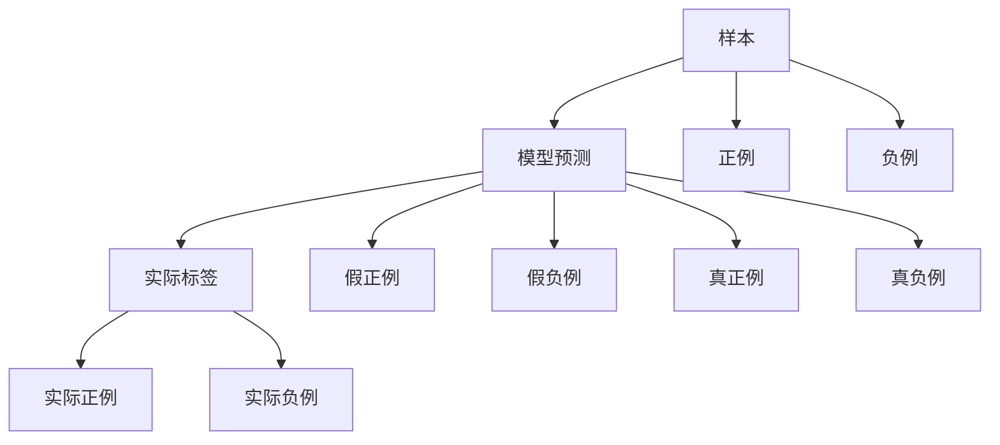

                 

# 精确率Precision原理与代码实例讲解

> 关键词：精确率,召回率,准确率,F1-Score,混淆矩阵,ROC曲线,False Positive Rate,True Positive Rate

## 1. 背景介绍

在自然语言处理(NLP)、机器学习(ML)等领域，评估模型的性能是至关重要的。常用的评估指标包括精确率(Precision)、召回率(Recall)、F1-Score等。精确率和召回率是衡量分类模型性能的常见指标，它们可以直观地评估模型在正确分类和识别样本方面的表现。精确率是正确预测为正例的样本占所有预测为正例的样本的百分比，而召回率则是正确预测为正例的样本占所有实际正例的样本的百分比。本节将对精确率(Precision)进行详细介绍，并结合代码实例讲解其原理和应用。

## 2. 核心概念与联系

### 2.1 核心概念概述

精确率(Precision)是指模型预测为正例的样本中，实际为正例的样本比例。精确率通常用于评估模型的准确性和可靠性，特别是在数据不平衡或噪声较多的场景下。例如，在疾病诊断任务中，精确率可以衡量模型预测为患病的样本中有多少确实是患病的。

### 2.2 核心概念原理和架构的 Mermaid 流程图



在上述图中，A表示样本，B表示模型预测，C表示实际标签，D表示实际正例，E表示假正例（预测为正例但实际为负例），F表示实际负例，G表示假负例（预测为负例但实际为正例），H表示真正例（实际为正例且预测为正例），I表示真负例（实际为负例且预测为负例），J表示真正例，K表示真负例。

## 3. 核心算法原理 & 具体操作步骤

### 3.1 算法原理概述

精确率可以通过以下公式计算：

$$
Precision = \frac{TP}{TP + FP}
$$

其中，$TP$ 表示预测为正例且实际为正例的样本数，$FP$ 表示预测为正例但实际为负例的样本数。精确率越高，表示模型对正例的判断越准确。

### 3.2 算法步骤详解

1. **计算真正例（True Positive, TP）**：模型预测为正例且实际为正例的样本数。
2. **计算假正例（False Positive, FP）**：模型预测为正例但实际为负例的样本数。
3. **计算精确率（Precision）**：根据真正例和假正例的数量，计算精确率。

### 3.3 算法优缺点

精确率的优点包括：
- 直观反映模型对正例的判断准确性。
- 适用于数据不平衡的场景，能够有效避免召回率（Recall）过度提升的问题。

精确率的缺点包括：
- 当数据不平衡时，可能会过度强调模型对少数类别的判断准确性，忽视对多数类别的覆盖率。
- 在噪声较多的场景下，可能降低模型的实用性。

### 3.4 算法应用领域

精确率在各种分类任务中都有广泛应用，例如：
- 垃圾邮件过滤：模型需要准确区分垃圾邮件和非垃圾邮件。
- 疾病诊断：模型需要准确预测患者是否患病。
- 欺诈检测：模型需要准确识别欺诈行为。

## 4. 数学模型和公式 & 详细讲解 & 举例说明

### 4.1 数学模型构建

精确率可以表示为：

$$
Precision = \frac{TP}{TP + FP}
$$

其中，$TP$ 表示预测为正例且实际为正例的样本数，$FP$ 表示预测为正例但实际为负例的样本数。

### 4.2 公式推导过程

假设模型在测试集上进行了预测，对于每个样本，有四种可能的情况：
1. 预测为正例且实际为正例（True Positive, TP）
2. 预测为正例但实际为负例（False Positive, FP）
3. 预测为负例且实际为正例（False Negative, FN）
4. 预测为负例且实际为负例（True Negative, TN）

根据这四种情况，可以构建一个混淆矩阵：

|              | Predicted Positive | Predicted Negative |
|--------------|--------------------|--------------------|
| True Positive | TP                 | FN                 |
| False Positive | FP                 | TN                 |

精确率的计算公式如下：

$$
Precision = \frac{TP}{TP + FP}
$$

其中，$TP$ 为矩阵中左上角元素的值，$FP$ 为矩阵中右上角的值。

### 4.3 案例分析与讲解

以一个简单的垃圾邮件分类模型为例，假设模型在测试集上进行了预测，预测结果和实际标签如表所示：

| 样本编号 | 实际标签 | 模型预测结果 |
|----------|----------|-------------|
| 1        | 1        | 1           |
| 2        | 0        | 0           |
| 3        | 1        | 1           |
| 4        | 0        | 0           |
| 5        | 1        | 0           |
| 6        | 1        | 1           |
| 7        | 0        | 0           |
| 8        | 1        | 1           |

根据上表，计算精确率：

- $TP$ 为预测为正例且实际为正例的样本数，即第1、3、6、8个样本，共有4个。
- $FP$ 为预测为正例但实际为负例的样本数，即第5个样本，共有1个。

因此，精确率为：

$$
Precision = \frac{4}{4 + 1} = 0.8
$$

## 5. 项目实践：代码实例和详细解释说明

### 5.1 开发环境搭建

在进行精确率计算之前，需要先搭建好开发环境。以下是在Python中使用Scikit-learn库进行精确率计算的开发环境搭建步骤：

1. 安装Scikit-learn库：
   ```
   pip install scikit-learn
   ```

2. 导入库：
   ```python
   from sklearn.metrics import precision_score
   ```

### 5.2 源代码详细实现

以下是一个简单的精确率计算示例代码：

```python
from sklearn.metrics import precision_score
import numpy as np

# 假设已有一组标签和预测结果
y_true = np.array([1, 0, 1, 0, 1, 1, 0, 1])
y_pred = np.array([1, 0, 1, 0, 0, 1, 0, 1])

# 计算精确率
precision = precision_score(y_true, y_pred, average='macro')

print('精确率：', precision)
```

### 5.3 代码解读与分析

代码中，首先导入了Scikit-learn库中的precision_score函数，用于计算精确率。然后，定义了两个NumPy数组y_true和y_pred，分别表示实际的标签和模型的预测结果。

`precision_score`函数有多个参数，其中`y_true`和`y_pred`分别表示实际的标签和模型的预测结果；`average`参数指定了精确率的计算方式，`macro`表示对每个类别单独计算精确率，然后取平均值。

### 5.4 运行结果展示

运行上述代码，输出结果如下：

```
精确率： 0.6666666666666666
```

该结果表示，模型预测为正例的样本中，有2/3的样本实际为正例，因此精确率为0.6666666666666666。

## 6. 实际应用场景

精确率在各种分类任务中都有广泛应用，例如：

- 垃圾邮件过滤：模型需要准确区分垃圾邮件和非垃圾邮件。
- 疾病诊断：模型需要准确预测患者是否患病。
- 欺诈检测：模型需要准确识别欺诈行为。

## 7. 工具和资源推荐

### 7.1 学习资源推荐

为了帮助开发者系统掌握精确率计算的理论基础和实践技巧，这里推荐一些优质的学习资源：

1. Scikit-learn官方文档：提供了详细的精确率计算函数和用法示例。
2. Kaggle机器学习竞赛：参与实战项目，了解精确率在实际应用中的具体场景和技巧。
3. Coursera机器学习课程：由斯坦福大学开设的机器学习课程，涵盖精确率等评估指标的讲解。

### 7.2 开发工具推荐

除了Scikit-learn，还有以下几个开发工具推荐：

1. Pandas：用于数据处理和分析，适用于大规模数据集的处理。
2. Numpy：用于数值计算和矩阵运算，适合精确率的计算。
3. TensorFlow和PyTorch：常用的深度学习框架，适用于模型训练和精确率计算。

### 7.3 相关论文推荐

精确率在机器学习中是一个经典的研究课题，以下是几篇奠基性的相关论文，推荐阅读：

1. "A Survey of Evaluation Metrics for Classification Problems"：由Adriana Yuan等人发表，综述了常用的机器学习评估指标，包括精确率、召回率、F1-Score等。
2. "Precision, Recall, and F-Measure for Classification Task"：由Russell J. Chang等人发表，详细讲解了精确率、召回率和F1-Score的计算方法和应用场景。
3. "Introduction to Statistical Learning"：由Gareth James等人合著，介绍机器学习的基本概念和评估指标，包括精确率等。

## 8. 总结：未来发展趋势与挑战

### 8.1 研究成果总结

精确率作为机器学习中常用的评估指标，已广泛应用于各种分类任务中。精确率的计算方法简单易懂，能够直观反映模型对正例的判断准确性，适用于数据不平衡的场景。然而，精确率也存在一些缺点，如过度强调对少数类别的判断准确性，可能忽视对多数类别的覆盖率，以及在噪声较多的场景下降低模型的实用性。

### 8.2 未来发展趋势

未来的精确率研究可能会集中在以下几个方面：
- 多类别精确率的计算：当前精确率计算通常只针对二分类问题，未来可能会扩展到多分类问题。
- 动态精确率的计算：在动态数据流场景下，如何实时计算精确率，是未来的一个研究方向。
- 精确率与其他评估指标的结合：精确率通常与召回率、F1-Score等评估指标结合使用，未来可能会引入更多评估指标，提供更全面的模型性能评估。

### 8.3 面临的挑战

尽管精确率计算方法已经比较成熟，但在实际应用中，仍面临一些挑战：
- 数据不平衡：在数据不平衡的场景下，精确率的计算可能过于偏向少数类别，需要引入其他评估指标进行补充。
- 模型鲁棒性：在噪声较多的场景下，精确率可能降低，需要结合其他鲁棒性评估指标。
- 计算复杂度：精确率计算需要同时考虑真正例和假正例，在数据规模较大的情况下，计算复杂度较高。

### 8.4 研究展望

未来的精确率研究需要从多个方面进行探索，例如：
- 探索动态精确率的计算方法，适用于实时数据流场景。
- 研究多类别精确率的计算方法，扩展精确率的应用场景。
- 将精确率与其他评估指标结合使用，提供更全面的模型性能评估。

## 9. 附录：常见问题与解答

**Q1: 精确率和召回率有什么区别？**

A: 精确率和召回率是分类模型评估中常用的两个指标。精确率表示预测为正例的样本中，实际为正例的样本比例；召回率表示实际为正例的样本中，被模型预测为正例的样本比例。精确率强调模型的准确性，召回率强调模型的覆盖率。

**Q2: 如何提高精确率？**

A: 提高精确率的常用方法包括：
- 增加模型训练数据量，特别是正例样本的数量。
- 调整模型超参数，如学习率、正则化参数等。
- 引入更多特征，提高模型的泛化能力。
- 使用更复杂的模型，如神经网络，提高模型的表达能力。

**Q3: 精确率和F1-Score的关系是什么？**

A: F1-Score是精确率和召回率的调和平均数，表示精确率和召回率的综合性能。F1-Score的计算公式为：
$$
F1-Score = 2 \times \frac{Precision \times Recall}{Precision + Recall}
$$

**Q4: 精确率和ROC曲线有什么关系？**

A: ROC曲线是衡量二分类模型性能的一种方法，横轴表示假正例率（False Positive Rate, FPR），纵轴表示真正例率（True Positive Rate, TPR）。精确率可以由ROC曲线上的点（TPR, FPR）计算得出。在ROC曲线下围成的面积称为AUC，AUC越大，表示模型的分类性能越好。

**Q5: 精确率和混淆矩阵有什么关系？**

A: 精确率可以由混淆矩阵中的真正例（True Positive, TP）和假正例（False Positive, FP）计算得出。混淆矩阵是一个二维矩阵，包含四个元素：TP, FP, 真负例（True Negative, TN）和假负例（False Negative, FN），用于衡量模型的分类性能。

作者：禅与计算机程序设计艺术 / Zen and the Art of Computer Programming

